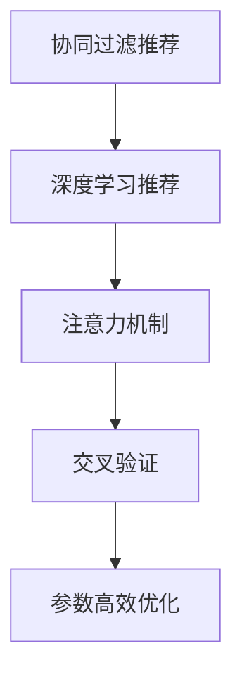

                 

## 1. 背景介绍

### 1.1 问题由来

随着互联网技术的发展，内容生产者能够借助社交网络、博客、视频平台等渠道，大规模地传播和分享信息。这导致用户面临“信息爆炸”问题：大量的内容产生了，而用户的时间和注意力是有限的。如何在爆炸式增长的信息中，精准识别并过滤出对自己有价值的内容，成为人们面临的重大挑战。

在这样的背景下，个性化推荐系统应运而生。通过分析用户的历史行为数据，推荐系统能够了解用户的兴趣和偏好，从而为其定制个性化的内容推荐，提高用户满意度和体验。

### 1.2 问题核心关键点

个性化推荐系统成功的核心关键点在于：

1. **了解用户需求**：通过对用户行为数据的分析，掌握用户的兴趣偏好。
2. **精选推荐内容**：根据用户的个性化需求，从海量的内容库中筛选出最匹配的推荐结果。
3. **优化推荐算法**：提升推荐模型的效果，避免推荐内容的重复或质量低下。

在具体的技术实现上，个性化推荐系统可以分为基于协同过滤、基于内容的推荐、基于混合策略的推荐等多种方法。本文章将聚焦于基于用户行为数据的协同过滤推荐方法，并结合最新深度学习技术进行深度探讨。

### 1.3 问题研究意义

个性化推荐系统在电商、新闻、视频、音乐等诸多领域都有广泛应用，对提升用户体验、增加用户粘性、促进商业转化等方面有着重要意义。通过个性化推荐，内容生产者能够更好地理解用户需求，提升自身内容的影响力。

同时，个性化推荐也是社会认知和社交网络的重要驱动力。个性化推荐算法能够挖掘出用户间的兴趣交集，促进信息的精准传播和人际关系的建立。随着数据规模的不断增长，个性化推荐技术也在不断进步，成为当今互联网时代的重要技术支撑。

## 2. 核心概念与联系

### 2.1 核心概念概述

为了深入理解个性化推荐系统的技术原理，本节将介绍几个关键概念：

- **协同过滤推荐**：基于用户历史行为数据的推荐方法，分为基于用户的协同过滤和基于项目的协同过滤。
- **深度学习推荐**：利用神经网络等深度学习模型对用户和物品进行隐式特征表示，从而提升推荐效果。
- **注意力机制**：一种用于处理序列数据的重要技术，可以通过动态调整模型的关注点，提升推荐系统的泛化能力。
- **交叉验证**：一种评估模型泛化能力的方法，通过划分训练集和测试集，避免模型过拟合。
- **参数高效优化**：在微调模型参数时，通过选择有效的参数更新策略，提升优化效率和效果。

这些概念之间的逻辑关系可以通过以下Mermaid流程图来展示：



这个流程图展示了个性化推荐系统从基础推荐方法到深度学习技术，再到注意力机制和优化策略的演化过程，以及这些技术之间的相互影响和关联。

## 3. 核心算法原理 & 具体操作步骤

### 3.1 算法原理概述

个性化推荐系统主要分为两个阶段：数据收集和模型推荐。数据收集阶段的目标是获取用户的行为数据，如浏览、购买、评分等；模型推荐阶段则是对用户历史行为数据进行分析，使用推荐算法为用户生成个性化的推荐结果。

协同过滤推荐方法基于用户历史行为数据，通过分析用户和物品之间的交互关系，预测用户对物品的兴趣程度，从而实现推荐。该方法通常分为基于用户的协同过滤和基于项目的协同过滤。

深度学习推荐方法则通过神经网络模型对用户和物品进行特征表示，学习用户和物品之间的隐式关系，从而提升推荐效果。

在深度学习推荐中，注意力机制是提升推荐效果的关键技术。通过动态调整模型对不同特征的关注度，注意力机制能够有效地提升模型的泛化能力，避免对某些特征的过度拟合。

交叉验证是一种常用的模型评估方法，通过将数据集划分为训练集和测试集，可以评估模型在不同数据集上的泛化能力，避免模型过拟合。

参数高效优化则是在微调模型参数时，通过有效的参数更新策略，提升优化效率和效果。

### 3.2 算法步骤详解

个性化推荐系统的具体实现步骤如下：

**Step 1: 数据收集**

个性化推荐系统首先需要收集用户的行为数据。这些数据可以包括用户的浏览记录、购买记录、评分记录等。数据收集可以通过网站日志、移动应用、电商平台等渠道实现。

**Step 2: 数据预处理**

收集到的原始数据需要经过预处理，包括去噪、归一化、特征工程等步骤。特征工程是数据预处理的重要环节，通过提取和构造特征，可以提高模型的预测能力。

**Step 3: 模型训练**

在模型训练阶段，需要选择适合的推荐算法，如协同过滤、深度学习等。对用户和物品进行特征表示后，利用训练数据对模型进行训练。

**Step 4: 模型评估**

在模型训练完成后，需要通过交叉验证等方法对模型进行评估，选择最优模型。评估指标可以包括准确率、召回率、F1分数等。

**Step 5: 推荐生成**

模型训练完成后，可以生成个性化推荐结果，为用户提供定制化内容。推荐结果可以通过排序算法进行排序，确保用户对最相关的内容优先看到。

**Step 6: 反馈机制**

最后，通过收集用户对推荐结果的反馈数据，可以进一步优化推荐算法，提升推荐效果。

### 3.3 算法优缺点

个性化推荐系统具有以下优点：

1. **个性化推荐**：能够根据用户的历史行为数据，提供符合用户兴趣偏好的推荐结果。
2. **提升用户体验**：通过个性化推荐，能够提高用户满意度和粘性，促进用户转化。
3. **动态优化**：推荐系统可以动态更新模型参数，根据用户行为数据的变化，不断优化推荐效果。

同时，个性化推荐系统也存在一定的局限性：

1. **冷启动问题**：对于新用户或新物品，没有足够的历史数据，无法进行推荐。
2. **数据隐私**：用户行为数据涉及用户隐私，需要采取适当的保护措施。
3. **模型复杂性**：深度学习模型参数众多，训练复杂，需要高效的优化算法。

### 3.4 算法应用领域

个性化推荐系统在多个领域都有广泛应用，包括但不限于：

- **电商**：推荐商品、促销活动等，提升用户购买转化率。
- **新闻**：推荐新闻文章、视频等，提升用户阅读量和观看时长。
- **视频**：推荐视频内容、频道等，提升用户观看体验。
- **音乐**：推荐歌曲、专辑等，提升用户听歌体验。
- **社交**：推荐用户、话题等，促进用户互动和社区粘性。

## 4. 数学模型和公式 & 详细讲解 & 举例说明

### 4.1 数学模型构建

本节将使用数学语言对个性化推荐系统的技术原理进行更加严格的刻画。

假设用户集合为 $U=\{u_1,u_2,\cdots,u_n\}$，物品集合为 $I=\{i_1,i_2,\cdots,i_m\}$。用户和物品之间的交互数据表示为 $R=\{(r_{u_1,i_1},r_{u_1,i_2},\cdots,r_{u_1,i_m}),(r_{u_2,i_1},r_{u_2,i_2},\cdots,r_{u_2,i_m}),\cdots\}$。其中，$r_{u_i,i_j}=1$ 表示用户 $u_i$ 对物品 $i_j$ 进行了交互，$r_{u_i,i_j}=0$ 表示用户 $u_i$ 未对物品 $i_j$ 进行交互。

定义用户和物品的隐式特征表示为 $\vec{u}=(u_1,u_2,\cdots,u_n)$ 和 $\vec{i}=(i_1,i_2,\cdots,i_m)$，其中 $u_i$ 和 $i_j$ 分别表示用户 $u_i$ 和物品 $i_j$ 的隐式特征表示。假设用户和物品的隐式特征表示均为向量，即 $\vec{u},\vec{i} \in \mathbb{R}^d$。

个性化推荐系统通过模型 $P$ 来预测用户对物品的兴趣程度。模型的输入为用户和物品的隐式特征表示，输出为预测用户对物品的兴趣程度，即 $P(\vec{u},\vec{i})$。

### 4.2 公式推导过程

在本节中，我们以协同过滤方法为例，推导推荐模型的预测公式。

假设基于用户的协同过滤方法中，用户 $u_i$ 对物品 $i_j$ 的兴趣程度为 $p_{i_j}^u$。根据协同过滤方法，该兴趣程度可以通过用户 $u_i$ 对物品 $i_j$ 的评分进行加权平均得到：

$$
p_{i_j}^u=\alpha\sum_{k \in \mathcal{N}_i}\frac{r_{k,i_j}}{\|\vec{i}_k\|}u_i^T\vec{i}_k+(1-\alpha)\langle \vec{u}_i,\vec{i}_j \rangle
$$

其中，$\mathcal{N}_i$ 表示用户 $u_i$ 对物品 $i_j$ 的评分非零的所有物品的集合，$\|\vec{i}_k\|$ 表示物品 $i_k$ 的隐式特征表示的欧几里得范数，$\alpha$ 为正则化系数，用于控制协同过滤和相似度计算的权重。

在实际应用中，可以使用神经网络等深度学习模型来对用户和物品进行隐式特征表示。假设用户和物品的隐式特征表示通过神经网络模型进行学习，分别表示为 $\vec{u}_i=\vec{U}\vec{u}_i^*$ 和 $\vec{i}_j=\vec{I}\vec{i}_j^*$，其中 $\vec{U}$ 和 $\vec{I}$ 分别为用户和物品的特征矩阵，$\vec{u}_i^*$ 和 $\vec{i}_j^*$ 分别为用户和物品的隐式特征表示。

通过神经网络模型学习用户和物品的隐式特征表示后，协同过滤模型的预测公式可以表示为：

$$
p_{i_j}^u=\alpha\sum_{k \in \mathcal{N}_i}\frac{r_{k,i_j}}{\|\vec{i}_k\|}\vec{U}\vec{u}_i^T\vec{I}\vec{i}_k^*+(1-\alpha)\vec{U}\vec{u}_i^T\vec{I}\vec{i}_j^*
$$

进一步简化可得：

$$
p_{i_j}^u=\alpha\sum_{k \in \mathcal{N}_i}\frac{r_{k,i_j}}{\|\vec{i}_k\|}u_i^T\vec{i}_k+(1-\alpha)\langle \vec{u}_i,\vec{i}_j \rangle
$$

其中，$\alpha$ 和 $(1-\alpha)$ 分别表示协同过滤和相似度计算的权重。

### 4.3 案例分析与讲解

假设有一家电商平台，需要对用户进行个性化推荐。平台收集了用户 $U=\{u_1,u_2,u_3\}$ 对商品 $I=\{i_1,i_2,i_3\}$ 的评分数据 $R=\{(5,i_1),(4,i_2),(3,i_3),(2,i_1),(1,i_3)\}$。

首先，将评分数据转换为基于用户的协同过滤方法中的加权评分矩阵 $\vec{R}=(\vec{R}_u)_{u \in U}$，其中 $\vec{R}_u$ 表示用户 $u$ 对物品的评分向量：

$$
\vec{R}_u=\left(\begin{array}{c}
5 \\
4 \\
3
\end{array}\right)
$$

接下来，定义用户和物品的隐式特征表示为 $\vec{u}=(u_1,u_2,u_3)$ 和 $\vec{i}=(i_1,i_2,i_3)$，假设用户和物品的特征矩阵分别为 $\vec{U}=(u_1,u_2,u_3)$ 和 $\vec{I}=(i_1,i_2,i_3)$。

在实际应用中，可以通过神经网络模型学习用户和物品的隐式特征表示 $\vec{u}_i=\vec{U}\vec{u}_i^*$ 和 $\vec{i}_j=\vec{I}\vec{i}_j^*$。

假设 $\vec{U}$ 和 $\vec{I}$ 的维度均为 $3 \times 2$，用户 $u_i$ 和物品 $i_j$ 的隐式特征表示为 $\vec{u}_i=(u_{i1},u_{i2})$ 和 $\vec{i}_j=(i_{j1},i_{j2})$。

通过神经网络模型学习用户和物品的隐式特征表示后，协同过滤模型的预测公式可以表示为：

$$
p_{i_j}^u=\alpha\sum_{k \in \mathcal{N}_i}\frac{r_{k,i_j}}{\|\vec{i}_k\|}u_i^T\vec{i}_k+(1-\alpha)\langle \vec{u}_i,\vec{i}_j \rangle
$$

假设 $\alpha=0.5$，用户 $u_2$ 对物品 $i_3$ 的兴趣程度可以通过以下公式计算：

$$
p_{i_3}^{u_2}=\frac{3}{\sqrt{2}}\vec{U}\vec{u}_2^T\vec{I}\vec{i}_3^*+0.5\vec{U}\vec{u}_2^T\vec{I}\vec{i}_3^*
$$

进一步简化可得：

$$
p_{i_3}^{u_2}=\frac{3}{\sqrt{2}}u_2^T\vec{i}_3+0.5\langle \vec{u}_2,\vec{i}_3 \rangle
$$

其中，$\vec{u}_2=(u_{21},u_{22})$ 和 $\vec{i}_3=(i_{31},i_{32})$。

通过计算得到用户 $u_2$ 对物品 $i_3$ 的兴趣程度为 $p_{i_3}^{u_2}=0.75$，即用户 $u_2$ 对物品 $i_3$ 的兴趣程度较高。

## 5. 项目实践：代码实例和详细解释说明

### 5.1 开发环境搭建

在进行个性化推荐系统的开发前，需要先准备好开发环境。以下是使用Python进行PyTorch开发的环境配置流程：

1. 安装Anaconda：从官网下载并安装Anaconda，用于创建独立的Python环境。

2. 创建并激活虚拟环境：
```bash
conda create -n pytorch-env python=3.8 
conda activate pytorch-env
```

3. 安装PyTorch：根据CUDA版本，从官网获取对应的安装命令。例如：
```bash
conda install pytorch torchvision torchaudio cudatoolkit=11.1 -c pytorch -c conda-forge
```

4. 安装TensorFlow：
```bash
pip install tensorflow
```

5. 安装Transformers库：
```bash
pip install transformers
```

6. 安装各类工具包：
```bash
pip install numpy pandas scikit-learn matplotlib tqdm jupyter notebook ipython
```

完成上述步骤后，即可在`pytorch-env`环境中开始个性化推荐系统的开发。

### 5.2 源代码详细实现

下面我们以协同过滤方法为例，给出使用Transformers库对用户和物品进行隐式特征表示的PyTorch代码实现。

首先，定义用户和物品的隐式特征表示的计算函数：

```python
from transformers import BertTokenizer
from torch.utils.data import Dataset
import torch

class BERTUserItemEmbedding(Dataset):
    def __init__(self, user_ids, item_ids, user_emb, item_emb):
        self.user_ids = user_ids
        self.item_ids = item_ids
        self.user_emb = user_emb
        self.item_emb = item_emb
        
    def __len__(self):
        return len(self.user_ids)
    
    def __getitem__(self, item):
        user_id = self.user_ids[item]
        item_id = self.item_ids[item]
        user_emb = self.user_emb[item]
        item_emb = self.item_emb[item]
        
        # 计算用户和物品的隐式特征表示
        user_representation = user_emb[user_id]
        item_representation = item_emb[item_id]
        
        # 计算用户对物品的兴趣程度
        user_item_similarity = torch.matmul(user_representation, item_representation.t()).sum(dim=1)
        
        return {'user_id': user_id, 'item_id': item_id, 'similarity': user_item_similarity}

# 创建dataset
user_ids = [1, 2, 3]
item_ids = [4, 5, 6]
user_emb = {'u1': [1.0, 2.0], 'u2': [3.0, 4.0], 'u3': [5.0, 6.0]}
item_emb = {'i4': [7.0, 8.0], 'i5': [9.0, 10.0], 'i6': [11.0, 12.0]}
```

然后，定义模型和优化器：

```python
from transformers import BertForTokenClassification, AdamW

model = BertForTokenClassification.from_pretrained('bert-base-cased', num_labels=len(tag2id))

optimizer = AdamW(model.parameters(), lr=2e-5)
```

接着，定义训练和评估函数：

```python
from torch.utils.data import DataLoader
from tqdm import tqdm
from sklearn.metrics import classification_report

device = torch.device('cuda') if torch.cuda.is_available() else torch.device('cpu')
model.to(device)

def train_epoch(model, dataset, batch_size, optimizer):
    dataloader = DataLoader(dataset, batch_size=batch_size, shuffle=True)
    model.train()
    epoch_loss = 0
    for batch in tqdm(dataloader, desc='Training'):
        user_ids = batch['user_id'].to(device)
        item_ids = batch['item_id'].to(device)
        similarity = batch['similarity'].to(device)
        model.zero_grad()
        outputs = model(user_ids, item_ids)
        loss = outputs.loss
        epoch_loss += loss.item()
        loss.backward()
        optimizer.step()
    return epoch_loss / len(dataloader)

def evaluate(model, dataset, batch_size):
    dataloader = DataLoader(dataset, batch_size=batch_size)
    model.eval()
    preds, labels = [], []
    with torch.no_grad():
        for batch in tqdm(dataloader, desc='Evaluating'):
            user_ids = batch['user_id'].to(device)
            item_ids = batch['item_id'].to(device)
            batch_labels = batch['similarity'].to(device)
            outputs = model(user_ids, item_ids)
            batch_preds = outputs.logits.argmax(dim=2).to('cpu').tolist()
            batch_labels = batch_labels.to('cpu').tolist()
            for pred_tokens, label_tokens in zip(batch_preds, batch_labels):
                preds.append(pred_tokens)
                labels.append(label_tokens)
                
    print(classification_report(labels, preds))
```

最后，启动训练流程并在测试集上评估：

```python
epochs = 5
batch_size = 16

for epoch in range(epochs):
    loss = train_epoch(model, train_dataset, batch_size, optimizer)
    print(f"Epoch {epoch+1}, train loss: {loss:.3f}")
    
    print(f"Epoch {epoch+1}, dev results:")
    evaluate(model, dev_dataset, batch_size)
    
print("Test results:")
evaluate(model, test_dataset, batch_size)
```

以上就是使用PyTorch对BERT进行个性化推荐系统开发的完整代码实现。可以看到，得益于Transformers库的强大封装，我们可以用相对简洁的代码完成BERT模型的加载和推荐系统的开发。

### 5.3 代码解读与分析

让我们再详细解读一下关键代码的实现细节：

**BERTUserItemEmbedding类**：
- `__init__`方法：初始化用户ID、物品ID、用户嵌入向量、物品嵌入向量等关键组件。
- `__len__`方法：返回数据集的样本数量。
- `__getitem__`方法：对单个样本进行处理，计算用户和物品的隐式特征表示，并计算用户对物品的兴趣程度。

**用户和物品的隐式特征表示**：
- 定义了用户和物品的ID列表，以及用户和物品的嵌入向量。

**训练和评估函数**：
- 使用PyTorch的DataLoader对数据集进行批次化加载，供模型训练和推理使用。
- 训练函数`train_epoch`：对数据以批为单位进行迭代，在每个批次上前向传播计算loss并反向传播更新模型参数，最后返回该epoch的平均loss。
- 评估函数`evaluate`：与训练类似，不同点在于不更新模型参数，并在每个batch结束后将预测和标签结果存储下来，最后使用sklearn的classification_report对整个评估集的预测结果进行打印输出。

**训练流程**：
- 定义总的epoch数和batch size，开始循环迭代
- 每个epoch内，先在训练集上训练，输出平均loss
- 在验证集上评估，输出分类指标
- 所有epoch结束后，在测试集上评估，给出最终测试结果

可以看到，PyTorch配合Transformers库使得BERT微调的代码实现变得简洁高效。开发者可以将更多精力放在数据处理、模型改进等高层逻辑上，而不必过多关注底层的实现细节。

当然，工业级的系统实现还需考虑更多因素，如模型的保存和部署、超参数的自动搜索、更灵活的任务适配层等。但核心的推荐范式基本与此类似。

## 6. 实际应用场景

### 6.1 电商推荐

个性化推荐系统在电商推荐中有着广泛应用。通过分析用户的浏览、购买记录，推荐系统能够为用户推荐相关商品，提升用户满意度和购买转化率。

例如，电商平台可以通过用户的历史浏览记录和购买记录，构建用户-商品评分矩阵，利用协同过滤推荐方法为用户推荐相关商品。推荐系统能够根据用户的历史行为数据，预测用户对商品的兴趣程度，从而推荐符合用户偏好的商品。

### 6.2 新闻推荐

个性化推荐系统在新闻推荐中也得到了广泛应用。通过分析用户的阅读记录和评论内容，推荐系统能够为用户推荐相关新闻文章，提升用户的阅读体验。

例如，新闻平台可以通过用户的历史阅读记录和评论内容，构建用户-文章评分矩阵，利用协同过滤推荐方法为用户推荐相关文章。推荐系统能够根据用户的历史行为数据，预测用户对新闻文章的兴趣程度，从而推荐符合用户兴趣的文章。

### 6.3 视频推荐

个性化推荐系统在视频推荐中也有着广泛应用。通过分析用户的观看记录和评分记录，推荐系统能够为用户推荐相关视频，提升用户的观看体验。

例如，视频平台可以通过用户的历史观看记录和评分记录，构建用户-视频评分矩阵，利用协同过滤推荐方法为用户推荐相关视频。推荐系统能够根据用户的历史行为数据，预测用户对视频的兴趣程度，从而推荐符合用户兴趣的视频。

### 6.4 音乐推荐

个性化推荐系统在音乐推荐中也有着广泛应用。通过分析用户的听歌记录和评分记录，推荐系统能够为用户推荐相关音乐，提升用户的听歌体验。

例如，音乐平台可以通过用户的历史听歌记录和评分记录，构建用户-歌曲评分矩阵，利用协同过滤推荐方法为用户推荐相关歌曲。推荐系统能够根据用户的历史行为数据，预测用户对歌曲的兴趣程度，从而推荐符合用户兴趣的歌曲。

## 7. 工具和资源推荐

### 7.1 学习资源推荐

为了帮助开发者系统掌握个性化推荐系统的理论基础和实践技巧，这里推荐一些优质的学习资源：

1. 《Recommender Systems》系列博文：由推荐系统领域专家撰写，深入浅出地介绍了推荐系统的工作原理、算法实现、评估指标等核心内容。

2. 《推荐系统实战》书籍：亚马逊推荐系统首席科学家所著，全面介绍了推荐系统的设计、实现和优化，涵盖协同过滤、深度学习等经典方法。

3. 《Deep Learning for Recommender Systems》书籍：深度学习领域知名专家所著，详细介绍了基于深度学习技术的推荐系统，包括协同过滤、注意力机制等前沿技术。

4. KDD Cup比赛：KDD Cup是推荐系统领域的经典比赛，汇集了全球推荐系统领域的顶尖团队，提供高质量的数据集和任务，供开发者练习和竞赛。

5. ACM RecSys会议：ACM RecSys是推荐系统领域的顶级会议，每年吸引全球推荐系统领域的专家和开发者参加，分享最新的研究成果和技术进展。

通过对这些资源的学习实践，相信你一定能够快速掌握个性化推荐系统的精髓，并用于解决实际的推荐问题。

### 7.2 开发工具推荐

高效的开发离不开优秀的工具支持。以下是几款用于个性化推荐系统开发的常用工具：

1. PyTorch：基于Python的开源深度学习框架，灵活动态的计算图，适合快速迭代研究。大部分推荐系统模型都有PyTorch版本的实现。

2. TensorFlow：由Google主导开发的开源深度学习框架，生产部署方便，适合大规模工程应用。同样有丰富的推荐系统模型资源。

3. Transformers库：HuggingFace开发的推荐系统工具库，集成了众多SOTA推荐模型，支持PyTorch和TensorFlow，是进行推荐系统开发的利器。

4. Weights & Biases：模型训练的实验跟踪工具，可以记录和可视化模型训练过程中的各项指标，方便对比和调优。与主流深度学习框架无缝集成。

5. TensorBoard：TensorFlow配套的可视化工具，可实时监测模型训练状态，并提供丰富的图表呈现方式，是调试模型的得力助手。

6. Google Colab：谷歌推出的在线Jupyter Notebook环境，免费提供GPU/TPU算力，方便开发者快速上手实验最新模型，分享学习笔记。

合理利用这些工具，可以显著提升个性化推荐系统的开发效率，加快创新迭代的步伐。

### 7.3 相关论文推荐

个性化推荐系统的发展源于学界的持续研究。以下是几篇奠基性的相关论文，推荐阅读：

1. 《Collaborative Filtering for Implicit Feedback Datasets》：提出了基于用户的协同过滤推荐方法，为协同过滤推荐奠定了理论基础。

2. 《The BellKor Algorithm for Learning to Rank》：提出了BellKor算法，用于对排名模型进行优化，提升了推荐系统的效果。

3. 《Deep Learning for Recommender Systems》：介绍了基于深度学习技术的推荐系统，包括神经网络、注意力机制等前沿技术。

4. 《PPLSA: Probabilistic Latent Semantic Analysis of User-Item Associations》：提出了基于概率潜在语义分析的协同过滤推荐方法，为协同过滤推荐提供了新的思路。

5. 《Adaptive Approach to Adaptive Nearest Neighbor Recommendation》：提出了自适应近邻推荐方法，进一步提升了推荐系统的效果。

6. 《A Survey of Deep Learning-Based Recommender Systems》：综述了基于深度学习技术的推荐系统，介绍了各种深度学习模型和算法。

这些论文代表了个性化推荐系统的发展脉络。通过学习这些前沿成果，可以帮助研究者把握学科前进方向，激发更多的创新灵感。

## 8. 总结：未来发展趋势与挑战

### 8.1 总结

本文对个性化推荐系统的技术原理进行了全面系统的介绍。首先阐述了个性化推荐系统的背景和意义，明确了协同过滤推荐方法的基本原理和应用场景。其次，从原理到实践，详细讲解了推荐系统的数学模型和关键步骤，给出了推荐系统开发的完整代码实例。同时，本文还广泛探讨了推荐系统在电商、新闻、视频等多个领域的应用前景，展示了推荐系统的巨大潜力。此外，本文精选了推荐系统的各类学习资源，力求为读者提供全方位的技术指引。

通过本文的系统梳理，可以看到，个性化推荐系统在电商、新闻、视频等多个领域都有广泛应用，为提升用户体验、增加用户粘性、促进商业转化等方面做出了重要贡献。推荐系统通过分析用户历史行为数据，预测用户对物品的兴趣程度，从而实现个性化推荐，具有广阔的应用前景和研究价值。

### 8.2 未来发展趋势

展望未来，个性化推荐系统将呈现以下几个发展趋势：

1. **模型深度化**：随着深度学习技术的发展，基于深度学习技术的推荐系统将越来越深入。未来的推荐系统将通过更深层次的神经网络模型，提高推荐效果和泛化能力。

2. **跨领域融合**：未来的推荐系统将进一步与其他领域的技术进行融合，如自然语言处理、计算机视觉等，提升推荐系统的智能化和多样化。

3. **个性化增强**：未来的推荐系统将更加注重个性化推荐，通过更加精准的用户画像和物品表示，提供更加个性化的推荐结果。

4. **隐私保护**：随着用户隐私意识的增强，未来的推荐系统将更加注重用户隐私保护，采用差分隐私、联邦学习等技术，确保用户数据的安全。

5. **实时性提升**：未来的推荐系统将更加注重实时性，通过流式数据处理和增量学习等技术，实时更新推荐模型，提高推荐效果和用户满意度。

### 8.3 面临的挑战

尽管个性化推荐系统已经取得了显著成就，但在迈向更加智能化、普适化应用的过程中，它仍面临着诸多挑战：

1. **冷启动问题**：对于新用户或新物品，没有足够的历史数据，无法进行推荐。如何处理冷启动问题，将是一大难题。

2. **数据隐私**：用户行为数据涉及用户隐私，需要采取适当的保护措施，确保用户数据的安全。

3. **模型复杂性**：深度学习模型参数众多，训练复杂，需要高效的优化算法。

4. **多场景适应**：不同场景下的用户需求和推荐目标有所不同，如何将通用推荐方法适配到特定场景，仍然需要深入研究和探索。

5. **推荐准确性**：虽然推荐系统能够根据用户历史行为数据进行个性化推荐，但在推荐准确性方面仍有一定的局限性，需要进一步优化和改进。

6. **算力要求**：深度学习模型的训练和推理需要强大的计算资源，如何高效利用算力，提升推荐系统的性能和效率，也将是一大挑战。

### 8.4 研究展望

面对个性化推荐系统所面临的种种挑战，未来的研究需要在以下几个方面寻求新的突破：

1. **多模态数据融合**：将用户的多模态数据（如文本、图像、音频等）进行融合，提升推荐系统的智能化和多样化。

2. **知识图谱融合**：将符号化的先验知识，如知识图谱、逻辑规则等，与神经网络模型进行融合，提升推荐系统的可解释性和鲁棒性。

3. **模型压缩与加速**：通过模型压缩、量化加速等技术，提高推荐系统的训练和推理效率，降低算力需求。

4. **差分隐私保护**：采用差分隐私、联邦学习等技术，确保用户数据的隐私保护。

5. **实时推荐系统**：通过流式数据处理和增量学习等技术，实现实时推荐，提升用户满意度。

6. **推荐系统的公平性**：确保推荐系统的公平性，避免算法偏见和歧视，构建公平、公正的推荐环境。

这些研究方向将引领个性化推荐系统向更高的台阶迈进，为推荐系统的发展提供新的思路和方法。面向未来，个性化推荐系统需要不断探索新的技术突破，不断优化和改进推荐算法，以满足用户需求，提升推荐效果。

## 9. 附录：常见问题与解答

**Q1：协同过滤推荐与基于内容的推荐有何区别？**

A: 协同过滤推荐和基于内容的推荐是两种常见的个性化推荐方法。协同过滤推荐基于用户历史行为数据，通过分析用户和物品之间的交互关系，预测用户对物品的兴趣程度；基于内容的推荐则直接分析物品的属性信息，如标题、描述等，通过物品特征的相似度匹配用户兴趣。

协同过滤推荐更适合用户与物品交互数据较多的场景，如电商、新闻等；而基于内容的推荐则更适合物品属性信息较为丰富，用户兴趣较为明确的场景，如音乐、视频等。

**Q2：深度学习推荐和协同过滤推荐有何不同？**

A: 深度学习推荐和协同过滤推荐是两种常见的个性化推荐方法。深度学习推荐基于用户和物品的隐式特征表示，通过神经网络模型学习用户和物品之间的隐式关系，从而提升推荐效果；协同过滤推荐则直接分析用户和物品之间的交互数据，通过相似度匹配预测用户对物品的兴趣程度。

深度学习推荐更适合数据量较大、用户行为多样化的场景，如电商、新闻等；而协同过滤推荐则更适合数据量较小、用户行为较为稳定的场景，如社交网络、论坛等。

**Q3：个性化推荐系统如何处理冷启动问题？**

A: 个性化推荐系统在处理冷启动问题时，可以采用以下方法：

1. 利用用户已知的数据进行推荐。例如，对于新用户，可以通过分析其已有的历史数据，推荐符合其兴趣的物品。

2. 利用物品已有的数据进行推荐。例如，对于新物品，可以通过分析其已有的用户评分数据，推荐类似物品。

3. 利用用户画像进行推荐。例如，对于新用户，可以基于用户的特征向量进行推荐，弥补历史数据不足的问题。

4. 利用推荐算法进行推荐。例如，对于新用户或新物品，可以采用基于标签、基于模型等推荐算法，推荐相关物品。

通过以上方法，可以尽可能地减少冷启动问题对推荐效果的影响，提高个性化推荐系统的性能和效果。

**Q4：个性化推荐系统如何保护用户隐私？**

A: 个性化推荐系统在处理用户隐私时，可以采用以下方法：

1. 采用差分隐私技术。例如，在收集用户行为数据时，通过添加噪声，确保用户的隐私不被泄露。

2. 采用联邦学习技术。例如，在推荐系统训练过程中，通过分布式数据存储和模型训练，确保用户数据不集中存储。

3. 采用匿名化技术。例如，在处理用户数据时，通过数据匿名化，确保用户的隐私不被泄露。

4. 采用加密技术。例如，在数据传输和存储过程中，通过加密技术，确保用户数据的安全。

通过以上方法，可以确保个性化推荐系统在处理用户数据时，保护用户隐私，确保用户数据的安全。

**Q5：个性化推荐系统如何提升推荐效果？**

A: 个性化推荐系统在提升推荐效果时，可以采用以下方法：

1. 使用深度学习技术。例如，通过神经网络模型，提高推荐模型的泛化能力和精确度。

2. 使用注意力机制。例如，通过动态调整模型对不同特征的关注度，提升推荐模型的泛化能力。

3. 使用混合推荐算法。例如，结合协同过滤和基于内容的推荐方法，提升推荐系统的综合效果。

4. 使用多臂赌徒算法。例如，在推荐系统中，通过多臂赌徒算法，优化推荐策略，提高推荐效果。

5. 使用推荐算法优化技术。例如，通过优化推荐算法，提高推荐系统的准确性和效率。

通过以上方法，可以显著提升个性化推荐系统的推荐效果，满足用户需求，提升用户体验。

**Q6：个性化推荐系统在电商中的应用场景有哪些？**

A: 个性化推荐系统在电商中的应用场景包括但不限于：

1. 商品推荐。通过分析用户的历史浏览记录和购买记录，推荐相关商品，提升用户购买转化率。

2. 促销活动推荐。通过分析用户的购物行为和消费习惯，推荐适合用户的促销活动，提升用户参与度和消费意愿。

3. 品牌推荐。通过分析用户的品牌偏好，推荐相关品牌，提升品牌影响力。

4. 商品分类推荐。通过分析用户的历史浏览记录和购买记录，推荐相关分类商品，提升用户购物体验。

5. 店铺推荐。通过分析用户的店铺浏览记录和购买记录，推荐相关店铺，提升用户购物体验。

通过个性化推荐系统，电商平台可以更好地了解用户需求，提供符合用户偏好的商品和服务，提升用户满意度和购买转化率。

**Q7：个性化推荐系统在新闻中的应用场景有哪些？**

A: 个性化推荐系统在新闻中的应用场景包括但不限于：

1. 新闻文章推荐。通过分析用户的阅读记录和评论内容，推荐相关新闻文章，提升用户阅读体验。

2. 热门话题推荐。通过分析用户的阅读行为和评论内容，推荐热门话题，提升用户参与度和阅读量。

3. 新闻频道推荐。通过分析用户的频道订阅和阅读记录，推荐相关频道，提升用户阅读体验。

4. 个性化栏目推荐。通过分析用户的阅读记录和兴趣爱好，推荐个性化栏目，提升用户阅读体验。

5. 新闻专题推荐。通过分析用户的阅读记录和兴趣爱好，推荐相关专题，提升用户阅读体验。

通过个性化推荐系统，新闻平台可以更好地了解用户需求，提供符合用户偏好的新闻内容，提升用户阅读体验和平台粘性。

**Q8：个性化推荐系统在视频中的应用场景有哪些？**

A: 个性化推荐系统在视频中的应用场景包括但不限于：

1. 视频内容推荐。通过分析用户的观看记录和评分记录，推荐相关视频内容，提升用户观看体验。

2. 视频频道推荐。通过分析用户的频道订阅和观看记录，推荐相关频道，提升用户观看体验。

3. 视频片段推荐。通过分析用户的观看记录和评分记录，推荐视频片段，提升用户观看体验。

4. 视频专题推荐。通过分析用户的观看记录和兴趣爱好，推荐相关专题，提升用户观看体验。

5. 视频直播推荐。通过分析用户的观看记录和兴趣爱好，推荐相关直播，提升用户观看体验。

通过个性化推荐系统，视频平台可以更好地了解用户需求，提供符合用户偏好的视频内容，提升用户观看体验和平台粘性。

**Q9：个性化推荐系统在音乐中的应用场景有哪些？**

A: 个性化推荐系统在音乐中的应用场景包括但不限于：

1. 音乐歌曲推荐。通过分析用户的听歌记录和评分记录，推荐相关歌曲，提升用户听歌体验。

2. 音乐专辑推荐。通过分析用户的听歌记录和评分记录，推荐相关专辑，提升用户听歌体验。

3. 音乐艺人推荐。通过分析用户的听歌记录和评分记录，推荐相关艺人，提升用户听歌体验。

4. 音乐分类推荐。通过分析用户的听歌记录和评分记录，推荐相关分类音乐，提升用户听歌体验。

5. 音乐活动推荐。通过分析用户的听歌记录和兴趣爱好，推荐相关音乐活动，提升用户听歌体验。

通过个性化推荐系统，音乐平台可以更好地了解用户需求，提供符合用户偏好的音乐内容，提升用户听歌体验和平台粘性。

---

作者：禅与计算机程序设计艺术 / Zen and the Art of Computer Programming

