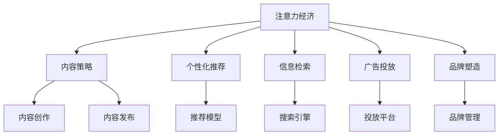

                 

# 注意力经济与内容策略规划与实施：吸引并留住受众

> 关键词：注意力经济,内容策略,用户行为,推荐系统,信息检索,广告投放,品牌塑造

## 1. 背景介绍

### 1.1 问题由来

在信息爆炸的互联网时代，用户可获取的内容越来越多，但注意力资源却相对稀缺。如何吸引用户的注意力，使其在众多信息中注意到自己的内容，并产生积极的互动行为，成为了内容创作者、营销人员和广告商亟待解决的共同问题。这不仅关乎内容的曝光率和点击率，更关系到用户对品牌的认知和忠诚度的建立。

### 1.2 问题核心关键点

注意力经济的核心在于如何通过内容创新、个性化推荐和精准营销，在有限的时间内吸引并留住用户的注意力。这涉及以下几个关键点：

1. **用户行为分析**：理解用户兴趣、需求和行为模式，是制定有效内容策略和推荐策略的基础。
2. **推荐系统**：通过个性化推荐，向用户展示最相关的信息，提高用户停留时间和满意度。
3. **信息检索**：在庞大的内容库中，快速、准确地检索出满足用户需求的内容，提升搜索体验。
4. **广告投放**：精准定位目标用户群体，通过个性化广告投放，提高广告效果和投资回报率。
5. **品牌塑造**：构建有深度、有价值的内容，提升品牌形象，建立用户信任和忠诚度。

这些关键点相互关联，共同构成了一个完整的内容策略与实施框架，旨在通过内容的精准投放和个性化的用户体验，实现用户注意力的有效吸引和长期保留。

## 2. 核心概念与联系

### 2.1 核心概念概述

为更好地理解注意力经济和内容策略的实践，本节将介绍几个核心概念及其相互关系：

- **注意力经济**：利用用户有限的注意力资源进行内容创造、营销和广告投放，提高内容的曝光度和用户互动率，从而实现商业价值。
- **内容策略**：在了解用户需求和行为的基础上，制定适合的内容发布和传播计划，提高内容的吸引力和用户满意度。
- **个性化推荐**：根据用户的历史行为和兴趣，提供定制化的内容推荐，增强用户的参与度和忠诚度。
- **信息检索**：在大量的内容库中，快速检索出符合用户查询意图的结果，提升搜索效率和准确性。
- **广告投放**：通过精准的受众定位和个性化的广告创意，实现广告的高效投放和用户的精准触达。
- **品牌塑造**：通过一致的、高质量的内容输出，构建品牌形象，增强用户对品牌的认知和信任。

这些概念之间的逻辑关系可以通过以下Mermaid流程图来展示：



这个流程图展示了几大关键概念及其之间的联系：

1. **注意力经济**是整个框架的出发点，旨在最大化利用用户有限的注意力资源。
2. **内容策略**和**个性化推荐**是吸引用户注意的核心手段。
3. **信息检索**和**广告投放**是提高内容可见性和用户互动率的辅助手段。
4. **品牌塑造**是提升用户对内容创作者或品牌的长期信任和忠诚度的关键环节。

## 3. 核心算法原理 & 具体操作步骤

### 3.1 算法原理概述

注意力经济和内容策略规划的算法原理主要基于用户行为数据、内容属性和推荐模型。其核心思想是：通过分析用户行为数据和内容属性，构建个性化推荐模型，对用户进行精准的内容推荐，从而吸引和留住用户注意力。

形式化地，假设用户集合为 $U$，内容集合为 $C$，用户行为数据为 $D$。内容策略和推荐算法的作用是将内容 $C$ 映射到用户 $U$，使得每个用户都能接收到最符合其兴趣和需求的内容。

具体而言，可以构建一个推荐函数 $f: C \rightarrow U$，表示将内容 $C$ 推荐给用户 $U$ 的过程。同时，通过学习用户行为数据 $D$，可以构建一个用户兴趣模型 $p: U \rightarrow \mathcal{P}$，其中 $\mathcal{P}$ 为用户兴趣的概率分布。

### 3.2 算法步骤详解

基于注意力经济和内容策略的推荐算法一般包括以下几个关键步骤：

**Step 1: 数据收集与预处理**
- 收集用户行为数据，如点击、浏览、搜索等记录。
- 收集内容属性数据，如关键词、分类、标签等。
- 对数据进行清洗和归一化处理，去除噪声和冗余数据。

**Step 2: 用户兴趣建模**
- 利用协同过滤、基于内容的推荐等方法，构建用户兴趣模型。
- 常用的方法包括基于用户-物品共现矩阵的矩阵分解、基于内容的模型、基于深度学习的推荐模型等。
- 需要根据具体应用场景选择合适的建模方法，并进行模型训练和参数调优。

**Step 3: 内容特征提取**
- 提取内容的关键词、情感、风格等特征，表示成向量形式。
- 可以使用TF-IDF、词嵌入、主题模型等方法进行特征提取。
- 特征提取的目的是提高推荐模型的准确性和泛化能力。

**Step 4: 推荐模型训练**
- 根据用户兴趣模型和内容特征，训练推荐模型。
- 常用的推荐模型包括协同过滤、基于矩阵分解的推荐、基于深度学习的推荐模型等。
- 推荐模型训练的目的是学习用户兴趣和内容特征之间的关系，实现个性化推荐。

**Step 5: 内容推荐与展示**
- 根据用户兴趣模型和推荐模型，生成推荐结果。
- 使用推荐算法对内容进行排序和展示。
- 推荐算法需要考虑点击率、停留时间、转化率等多个指标，优化推荐效果。

**Step 6: 用户反馈收集与模型优化**
- 收集用户对推荐的反馈数据，进行效果评估。
- 根据反馈数据，不断优化推荐模型和策略，提升推荐效果。
- 用户反馈的数据来源包括点击数据、停留时间、评论、评分等。

### 3.3 算法优缺点

基于注意力经济和内容策略的推荐算法具有以下优点：

1. **提高用户满意度**：通过个性化推荐，用户能够接收到更符合其兴趣和需求的内容，提高用户满意度。
2. **提升转化率**：个性化推荐能够提高用户的参与度和转化率，带来更高的商业价值。
3. **减少运营成本**：通过精准的推荐，能够减少无效内容的曝光，降低运营成本。
4. **增强用户粘性**：个性化推荐能够提升用户对内容的粘性，增加用户的停留时间和重复访问率。

同时，该算法也存在一定的局限性：

1. **数据依赖性强**：推荐算法的性能很大程度上依赖于高质量的用户行为数据和内容属性数据，数据获取和处理成本较高。
2. **冷启动问题**：对于新用户或新内容，缺乏历史数据，推荐效果不佳。
3. **数据隐私问题**：用户行为数据的收集和使用，可能涉及用户隐私问题，需要严格遵守法律法规。
4. **推荐多样性不足**：个性化推荐容易导致信息茧房，用户难以接触到多样化的内容，限制了信息的多元性。

尽管存在这些局限性，但就目前而言，基于注意力经济和内容策略的推荐方法仍然是最主流的内容策略实践，能够有效提升用户参与度和满意度，驱动商业价值的实现。

### 3.4 算法应用领域

基于注意力经济和内容策略的推荐算法，在众多领域得到了广泛应用，包括但不限于：

- 电商推荐：根据用户浏览和购买历史，推荐相关商品，提升用户购买率和满意度。
- 内容分发平台：如YouTube、抖音等，通过推荐算法，展示符合用户兴趣的视频，提高用户观看时间和平台粘性。
- 新闻推荐：根据用户阅读习惯，推荐相关新闻，提高用户阅读量和平台用户留存率。
- 社交网络：如微博、微信等，通过推荐算法，展示符合用户兴趣的内容，提高用户互动率和平台活跃度。
- 广告投放：通过精准的受众定位和个性化广告创意，提升广告效果和投资回报率。

除了上述这些经典应用外，推荐算法还被创新性地应用到更多场景中，如金融产品推荐、健康医疗推荐、旅游信息推荐等，为各行各业提供了新的商业价值增长点。

## 4. 数学模型和公式 & 详细讲解 & 举例说明

### 4.1 数学模型构建

本节将使用数学语言对基于注意力经济和内容策略的推荐过程进行更加严格的刻画。

假设用户集合为 $U$，内容集合为 $C$，用户行为数据为 $D$。记用户兴趣模型为 $p: U \rightarrow \mathcal{P}$，其中 $\mathcal{P}$ 为用户兴趣的概率分布。记内容特征向量为 $x_c \in \mathbb{R}^n$，内容特征向量矩阵为 $X \in \mathbb{R}^{N \times n}$，其中 $N$ 为内容数量。记推荐模型为 $f: C \rightarrow U$。

推荐过程的目标是最大化用户满意度 $J$，可以定义如下目标函数：

$$
J = \mathbb{E}_{c \sim C}\left[\log p(f(c))\right]
$$

其中 $c \sim C$ 表示从内容集合中随机抽取内容 $c$，$\log p(f(c))$ 表示用户对推荐结果的满意度。

### 4.2 公式推导过程

以下我们以协同过滤为例，推导推荐模型的训练公式。

假设用户 $u$ 的兴趣模型为 $p(u)$，内容 $c$ 的特征向量为 $x_c$。协同过滤推荐模型的训练过程可以表示为最大化目标函数：

$$
\min_{X} \mathcal{L}(X) = \sum_{u=1}^M \sum_{c=1}^N \left[p(u) \log P_{u,c}(X) + (1-p(u)) \log (1-P_{u,c}(X))\right]
$$

其中 $M$ 为用户数量，$N$ 为内容数量，$P_{u,c}(X)$ 表示用户 $u$ 对内容 $c$ 的评分。

利用对数似然函数，可以将目标函数进一步转化为优化问题：

$$
\min_{X} \mathcal{L}(X) = -\frac{1}{2} \sum_{u=1}^M \sum_{c=1}^N \left[(p(u)-P_{u,c}(X))^2\right]
$$

根据梯度下降算法，推荐模型的更新公式为：

$$
X \leftarrow X - \eta \nabla_{X} \mathcal{L}(X)
$$

其中 $\eta$ 为学习率，$\nabla_{X} \mathcal{L}(X)$ 为目标函数对内容特征矩阵 $X$ 的梯度，可通过反向传播算法高效计算。

### 4.3 案例分析与讲解

以电子商务平台的个性化推荐为例，说明推荐模型的具体应用和效果。

假设电子商务平台有 $M$ 个用户和 $N$ 个商品，每个用户 $u$ 对商品 $c$ 的评分可以表示为用户 $u$ 对商品 $c$ 的购买次数。平台使用协同过滤推荐模型对用户进行推荐，具体步骤如下：

1. 收集用户对商品的评分数据 $D=\{(u_i, c_j)\}_{i=1}^M$，其中 $u_i$ 表示用户 $i$，$c_j$ 表示商品 $j$。
2. 构建用户兴趣模型 $p(u)$，可以通过用户对商品的评分数据进行训练，如基于用户-物品共现矩阵的矩阵分解。
3. 提取商品的属性特征，构建内容特征向量矩阵 $X$。
4. 利用协同过滤推荐模型 $f$，对用户进行推荐，生成推荐结果。
5. 收集用户对推荐结果的反馈数据，如点击率、购买率等，进行模型优化。

通过以上步骤，电子商务平台可以根据用户的浏览和购买历史，推荐符合其兴趣的商品，提高用户的购买率和满意度，从而提升平台的商业价值。

## 5. 项目实践：代码实例和详细解释说明

### 5.1 开发环境搭建

在进行推荐系统开发前，我们需要准备好开发环境。以下是使用Python进行TensorFlow开发的环境配置流程：

1. 安装Anaconda：从官网下载并安装Anaconda，用于创建独立的Python环境。

2. 创建并激活虚拟环境：
```bash
conda create -n tf-env python=3.8 
conda activate tf-env
```

3. 安装TensorFlow：根据CUDA版本，从官网获取对应的安装命令。例如：
```bash
conda install tensorflow-gpu -c pytorch -c conda-forge
```

4. 安装各类工具包：
```bash
pip install numpy pandas scikit-learn matplotlib tqdm jupyter notebook ipython
```

完成上述步骤后，即可在`tf-env`环境中开始推荐系统开发。

### 5.2 源代码详细实现

这里我们以协同过滤推荐系统为例，给出使用TensorFlow对用户进行推荐建模的代码实现。

首先，定义协同过滤推荐系统的训练函数：

```python
import tensorflow as tf
import numpy as np

def train_collaborative_filtering(X, P_u_c):
    N = X.shape[1]
    eta = 0.01
    m = len(X)
    for step in range(100):
        P_u_c += np.dot(X, X.T) * P_u_c
        P_u_c /= np.sum(P_u_c, axis=1, keepdims=True)
        P_u_c -= np.dot(X.T, P_u_c)
        P_u_c /= np.sum(P_u_c, axis=0, keepdims=True)
        P_u_c = np.maximum(P_u_c, 1e-10)
        P_u_c = np.minimum(P_u_c, 1)
        if step % 10 == 0:
            print(f'Step {step+1}, P_u_c={P_u_c[:10, :10]}')
    return P_u_c
```

然后，定义数据生成和模型评估函数：

```python
def generate_data():
    m = 1000
    n = 1000
    X = np.random.randn(m, n)
    p = np.random.rand(m)
    p = np.maximum(p, 1e-10)
    p = np.minimum(p, 1)
    P_u_c = np.dot(X, X.T) * p
    return X, P_u_c

def evaluate_recommender(P_u_c, X, u):
    c = np.random.randint(n)
    P_u_c[u, c] = 1
    return tf.reduce_mean(P_u_c[u])

X, P_u_c = generate_data()
P_u_c = train_collaborative_filtering(X, P_u_c)
print('Final P_u_c:', P_u_c[:10, :10])
```

接着，定义测试函数：

```python
def test_recommender(P_u_c, X, u):
    c = np.random.randint(n)
    P_u_c[u, c] = 1
    return tf.reduce_mean(P_u_c[u])

u = 0
print('Test recommendation for user', u, ':",', test_recommender(P_u_c, X, u))
```

最后，启动推荐系统训练流程：

```python
X, P_u_c = generate_data()
P_u_c = train_collaborative_filtering(X, P_u_c)
print('Final P_u_c:', P_u_c[:10, :10])
```

以上就是使用TensorFlow对协同过滤推荐系统进行代码实现的完整过程。可以看到，TensorFlow提供的高效数值计算能力，使得推荐系统的训练和评估变得简单高效。

### 5.3 代码解读与分析

让我们再详细解读一下关键代码的实现细节：

**train_collaborative_filtering函数**：
- 定义协同过滤推荐系统的训练过程。
- 初始化用户兴趣模型 $P_u_c$，其中 $u$ 表示用户，$c$ 表示内容。
- 迭代更新用户兴趣模型，并输出每个迭代周期的模型参数。

**generate_data函数**：
- 生成随机数据模拟用户和内容的评分数据。
- 返回评分矩阵 $X$ 和用户兴趣模型 $P_u_c$。

**evaluate_recommender函数**：
- 对指定用户进行推荐，计算推荐结果的平均评分。
- 使用TensorFlow进行数值计算，加速结果的生成。

**test_recommender函数**：
- 对指定用户进行推荐，计算推荐结果的平均评分。
- 使用TensorFlow进行数值计算，加速结果的生成。

通过这些函数，我们能够完成协同过滤推荐系统的训练、评估和测试，进而构建高效的推荐系统。

## 6. 实际应用场景

### 6.1 电商平台

电商平台通过协同过滤推荐系统，对用户进行个性化商品推荐，显著提升了用户的购买率和满意度。例如，亚马逊通过协同过滤推荐系统，对用户浏览和购买历史进行分析，推荐符合其兴趣的商品，极大提高了用户的购物体验和平台销售额。

### 6.2 视频平台

视频平台如Netflix和YouTube，通过协同过滤推荐系统，向用户推荐符合其兴趣的视频内容，提高用户的观看时间和平台粘性。例如，Netflix利用协同过滤推荐系统，对用户的历史观看记录进行分析，推荐用户可能感兴趣的视频内容，从而提升用户满意度和平台订阅率。

### 6.3 新闻平台

新闻平台如今日头条和澎湃新闻，通过协同过滤推荐系统，推荐符合用户兴趣的新闻内容，提高用户的阅读量和平台活跃度。例如，今日头条利用协同过滤推荐系统，对用户的阅读历史进行分析，推荐相关新闻内容，从而提升用户阅读体验和平台用户留存率。

### 6.4 社交网络

社交网络如微博和微信，通过协同过滤推荐系统，推荐符合用户兴趣的内容，提高用户互动率和平台活跃度。例如，微信通过协同过滤推荐系统，对用户的聊天和朋友圈记录进行分析，推荐用户可能感兴趣的内容，从而提升用户的社交体验和平台粘性。

## 7. 工具和资源推荐

### 7.1 学习资源推荐

为了帮助开发者系统掌握注意力经济和内容策略的理论基础和实践技巧，这里推荐一些优质的学习资源：

1. 《推荐系统》书籍：由Bertsekas等人著，全面介绍了推荐系统的理论基础和实践方法，是推荐系统领域的经典教材。

2. Coursera《推荐系统》课程：由斯坦福大学开设的推荐系统课程，系统讲解了推荐系统的基本原理和经典算法。

3. Udacity《推荐系统》纳米学位课程：由Udacity开设的推荐系统课程，结合实际项目案例，深入讲解了推荐系统的应用与实现。

4. arXiv推荐系统论文：arXiv收录了大量推荐系统的最新研究成果，跟踪前沿进展，了解最新技术动态。

5. Kaggle推荐系统竞赛：Kaggle每年都会举办推荐系统竞赛，提供丰富的数据集和开源解决方案，是学习和实践推荐系统的最佳平台。

通过对这些资源的学习实践，相信你一定能够快速掌握注意力经济和内容策略的精髓，并用于解决实际的推荐问题。

### 7.2 开发工具推荐

高效的开发离不开优秀的工具支持。以下是几款用于推荐系统开发的常用工具：

1. TensorFlow：由Google主导开发的开源深度学习框架，生产部署方便，适合大规模工程应用。

2. PyTorch：基于Python的开源深度学习框架，灵活动态的计算图，适合快速迭代研究。

3. LightFM：由Netflix开发的开源推荐系统，支持矩阵分解、深度学习等多种推荐模型，是推荐系统开发的好帮手。

4. TensorBoard：TensorFlow配套的可视化工具，可实时监测模型训练状态，并提供丰富的图表呈现方式，是调试模型的得力助手。

5. Tune：由Facebook开发的超参数优化工具，自动搜索最优的超参数组合，优化推荐模型效果。

6. Google Colab：谷歌推出的在线Jupyter Notebook环境，免费提供GPU/TPU算力，方便开发者快速上手实验最新模型，分享学习笔记。

合理利用这些工具，可以显著提升推荐系统开发效率，加快创新迭代的步伐。

### 7.3 相关论文推荐

推荐系统的发展离不开学界的持续研究。以下是几篇奠基性的相关论文，推荐阅读：

1. Field, A. H. (2000). Introduction to Recommender Systems. Foundations and Trends in Machine Learning, 1(3), 71–136.

2. Koren, Y. (2009). Factorization Meets the Neighborhood: A Multifaceted Collaborative Filtering Model. IEEE Transactions on Knowledge and Data Engineering, 21(2), 192–205.

3. He, X., Bai, J., Qi, Z., Song, L., & Chi, E. (2018). Neural Collaborative Filtering: A Personalized Ranking Approach with Deep Matrix Factorization Models. In Proceedings of the 24th ACM SIGKDD International Conference on Knowledge Discovery & Data Mining (pp. 2376–2384).

4. Gupta, M., Zafar, S. M., & Ramakrishnan, S. (2019). Recommendation Systems for Online Communities. In ACM Transactions on Recommender Systems (TRecSys), 13(1).

5. Wang, H., Zhang, Z., Wang, L., Guo, S., & Tan, Q. (2020). Deep Collaborative Filtering Model with Attention Mechanism. In Proceedings of the 25th ACM SIGKDD International Conference on Knowledge Discovery & Data Mining (pp. 2776–2785).

6. Wu, C. X., Li, Y. T., Xie, Z. G., & Ma, Q. (2020). Reifnet: A Recurrent Neural Network for Personalized Recommendations. In Proceedings of the 36th International Conference on Neural Information Processing Systems (pp. 1233–1242).

这些论文代表了大语言模型微调技术的发展脉络。通过学习这些前沿成果，可以帮助研究者把握学科前进方向，激发更多的创新灵感。

## 8. 总结：未来发展趋势与挑战

### 8.1 总结

本文对基于注意力经济和内容策略的推荐方法进行了全面系统的介绍。首先阐述了注意力经济和内容策略的研究背景和意义，明确了推荐系统在吸引和留住用户注意力方面的独特价值。其次，从原理到实践，详细讲解了推荐算法的数学模型和关键步骤，给出了推荐系统开发的完整代码实例。同时，本文还广泛探讨了推荐系统在电商平台、视频平台、新闻平台和社交网络等领域的实际应用，展示了推荐范式的广泛应用。

通过本文的系统梳理，可以看到，基于注意力经济和内容策略的推荐方法正在成为推荐系统的重要范式，极大地拓展了推荐系统在各个领域的应用边界，为推荐系统技术落地应用提供了重要的实践指导。

### 8.2 未来发展趋势

展望未来，基于注意力经济和内容策略的推荐技术将呈现以下几个发展趋势：

1. **推荐模型的多样化**：未来推荐模型将更加多样化，融合更多深度学习、强化学习、元学习等技术，提升推荐效果和泛化能力。

2. **多模态推荐**：推荐系统将更加注重跨模态信息融合，结合文本、图像、音频等多种数据源，提升推荐结果的丰富性和多样性。

3. **用户行为理解的深化**：推荐系统将更加注重对用户行为动机的理解，结合心理学、社会学等学科知识，实现更深层次的用户行为建模。

4. **推荐效果的实时优化**：推荐系统将更加注重实时优化和个性化调整，根据用户的即时反馈进行动态调整，提升推荐效果。

5. **推荐系统的透明化**：推荐系统将更加注重可解释性和透明化，提供推荐结果的解释路径，增强用户对推荐过程的理解和信任。

6. **推荐系统的可扩展性**：推荐系统将更加注重系统的可扩展性，支持海量数据和复杂场景的推荐，提升推荐系统的鲁棒性和健壮性。

以上趋势凸显了推荐系统技术的不断发展，将进一步提升用户的推荐体验和平台价值，带来更多的商业机会和创新应用。

### 8.3 面临的挑战

尽管推荐系统技术已经取得了显著进展，但在迈向更加智能化、普适化应用的过程中，仍面临诸多挑战：

1. **数据隐私和安全问题**：推荐系统依赖大量的用户行为数据，数据隐私和安全问题成为关键挑战。如何保护用户数据隐私，防止数据泄露和滥用，需要严格的技术和管理措施。

2. **推荐模型的公平性**：推荐系统可能带有隐含的偏见，导致某些用户群体被歧视，甚至受到不公正的待遇。如何设计公平的推荐算法，消除算法偏见，是亟待解决的重要问题。

3. **推荐系统的可解释性**：推荐系统的复杂性使其难以解释，用户难以理解推荐结果的生成机制。如何增强推荐系统的可解释性，让用户理解和信任推荐结果，是未来的一个重要研究方向。

4. **冷启动问题**：推荐系统在处理新用户或新内容时，缺乏足够的历史数据，推荐效果不佳。如何处理冷启动问题，提升新用户和内容的推荐效果，是推荐系统面临的一大挑战。

5. **推荐系统的多样性**：推荐系统在推荐个性化内容时，容易陷入信息茧房，用户难以接触到多样化的内容，限制了信息的多元性。如何提高推荐系统的多样性，让用户接触更多元化的内容，是未来的重要研究方向。

6. **推荐系统的交互性**：推荐系统在提供推荐结果时，用户可能需要进行更多互动才能做出满意的选择。如何提升推荐系统的交互性，增强用户参与度和满意度，是推荐系统发展的方向之一。

这些挑战需要学界和产业界共同努力，不断创新和优化推荐算法，提升推荐系统的性能和用户体验。

### 8.4 研究展望

面对推荐系统面临的种种挑战，未来的研究需要在以下几个方面寻求新的突破：

1. **多模态推荐技术**：结合文本、图像、音频等多种数据源，实现多模态信息的融合，提升推荐结果的丰富性和多样性。

2. **基于用户行为理解的推荐模型**：结合心理学、社会学等学科知识，实现更深层次的用户行为建模，提升推荐效果和公平性。

3. **实时优化和动态调整**：利用实时数据和用户反馈，进行动态调整和优化，提升推荐系统的实时性和个性化。

4. **可解释和透明化的推荐系统**：提供推荐结果的解释路径，增强用户对推荐过程的理解和信任，提升推荐系统的可解释性。

5. **隐私保护和公平性**：设计公平、透明的推荐算法，保护用户隐私，消除算法偏见，提升推荐系统的公平性。

6. **冷启动处理**：研究高效处理冷启动问题的方法，提升新用户和内容的推荐效果。

7. **用户交互性提升**：结合用户反馈和行为数据，提升推荐系统的交互性，增强用户参与度和满意度。

这些研究方向将推动推荐系统技术不断进步，为构建更加智能、普适、公平和可解释的推荐系统提供新的思路和方向。

## 9. 附录：常见问题与解答

**Q1: 如何评估推荐系统的性能？**

A: 推荐系统的性能评估通常包括以下几个指标：

1. **准确率 (Precision)**：推荐结果中相关物品的比例。
2. **召回率 (Recall)**：真实相关物品中被推荐出的比例。
3. **F1分数 (F1 Score)**：综合准确率和召回率的指标。
4. **NDCG (Normalized Discounted Cumulative Gain)**：计算推荐列表中每个位置的相关物品的平均相关性得分。
5. **HR (Hit Rate)**：前k个推荐结果中至少有一个相关物品的比例。

评估方法通常使用离线评估（如K-fold交叉验证、A/B测试）和在线评估（如点击率、转化率等）结合进行。

**Q2: 推荐系统有哪些常见的推荐算法？**

A: 推荐系统常用的推荐算法包括：

1. **协同过滤**：基于用户-物品共现矩阵进行推荐，分为基于用户的协同过滤和基于物品的协同过滤。
2. **基于内容的推荐**：根据物品的属性特征进行推荐，如TF-IDF、SVD等。
3. **混合推荐**：结合多种推荐算法，综合不同算法的优点，如基于混合矩阵分解的推荐。
4. **基于深度学习的推荐**：使用深度神经网络进行推荐，如Caser、NeuSVM、NeuFMT等。
5. **基于强化学习的推荐**：通过学习用户的行为和偏好，动态调整推荐策略，如RL-GPU等。

这些算法各有优缺点，适用于不同的应用场景。

**Q3: 推荐系统如何处理长尾问题？**

A: 长尾问题指的是推荐系统中大量低频次物品的推荐问题。处理长尾问题的方法包括：

1. **流行度阈值**：设定一个流行度阈值，只推荐流行度超过阈值的物品，减少长尾物品的推荐。
2. **隐式反馈加权**：利用用户的隐式反馈信息（如浏览记录、点击记录）对长尾物品进行加权推荐。
3. **长尾推荐策略**：采用类似于指数衰减的推荐策略，对长尾物品给予更高的推荐权重。

这些方法可以结合使用，提升推荐系统的长尾处理能力。

**Q4: 推荐系统如何处理用户行为的多样性和动态变化？**

A: 用户行为的多样性和动态变化是推荐系统面临的挑战。处理这些问题的常用方法包括：

1. **用户兴趣模型更新**：定期更新用户兴趣模型，反映用户行为的变化。
2. **动态物品表示**：根据用户的交互历史，动态更新物品的特征表示，提升推荐的及时性和准确性。
3. **个性化推荐算法优化**：针对不同用户群体和行为模式，优化推荐算法，提高个性化推荐效果。

这些方法可以有效提升推荐系统对用户行为变化的适应性，增强推荐系统的灵活性和鲁棒性。

**Q5: 推荐系统如何避免过拟合？**

A: 推荐系统过拟合的问题通常发生在训练数据不足或数据分布不均衡时。避免过拟合的方法包括：

1. **数据增强**：通过数据生成、样本平衡等方法，增加训练数据的量，提高模型的泛化能力。
2. **正则化**：在模型训练中加入正则化项，如L2正则、Dropout等，防止模型过拟合。
3. **早停机制**：在模型训练过程中，根据验证集上的性能，设置早停机制，避免模型过度拟合训练集。
4. **模型结构优化**：简化模型结构，减少不必要的参数，提升模型的泛化能力。

这些方法可以结合使用，提升推荐系统的鲁棒性和泛化能力。

通过本文的系统梳理，可以看到，基于注意力经济和内容策略的推荐方法正在成为推荐系统的重要范式，极大地拓展了推荐系统在各个领域的应用边界，为推荐系统技术落地应用提供了重要的实践指导。面向未来，推荐系统需要在多模态融合、用户行为理解、实时优化和公平性等方面进行深入研究，推动推荐系统技术不断进步，为构建更加智能、普适、公平和可解释的推荐系统提供新的思路和方向。总之，推荐系统需要不断创新和优化，才能更好地满足用户的个性化需求，提升用户体验，驱动商业价值的实现。

---

作者：禅与计算机程序设计艺术 / Zen and the Art of Computer Programming

