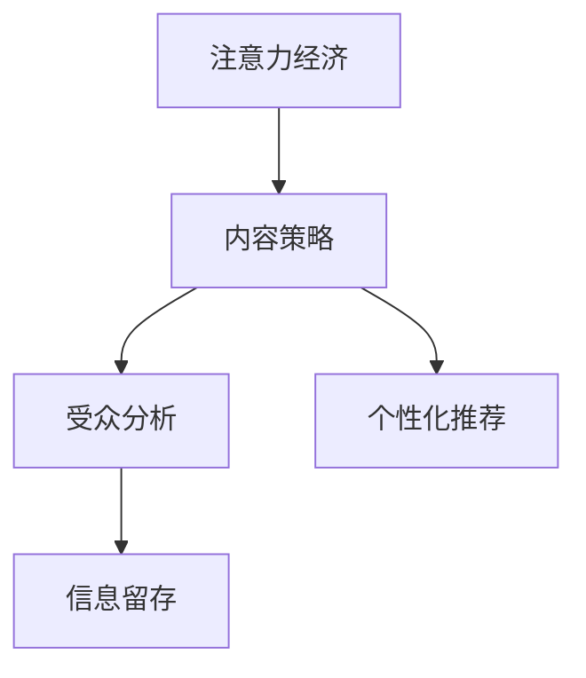

                 

# 注意力经济与内容策略：如何创建吸引并留住受众的信息

> 关键词：注意力经济,内容策略,受众吸引,信息留存,用户行为分析

## 1. 背景介绍

### 1.1 问题由来
在数字化时代，信息爆炸和注意力稀缺已成为不可逆转的趋势。用户不再被动接受信息，而是基于自身兴趣和需求主动筛选内容。如何在海量信息中脱颖而出，成为吸引和留住受众的关键。面对这一挑战，注意力经济和内容策略应运而生，成为企业信息传播和营销创新的重要手段。

### 1.2 问题核心关键点
注意力经济的核心在于通过精准的内容定位和高效的传播策略，最大化吸引和留住受众的注意力，从而提升品牌影响力和商业价值。内容策略则是在此基础上，系统性地设计内容形式、传播渠道、用户互动等要素，构建符合用户需求和行为习惯的完整信息生态。

如何设计高效的内容策略，实现信息精准传递，避免受众流失，是当前数字化营销和内容产业面临的重大课题。

### 1.3 问题研究意义
研究注意力经济和内容策略，对提升企业数字化营销水平、塑造品牌形象、增强用户粘性具有重要意义。通过精确的用户行为分析，可以设计出更具吸引力的内容形式和传播路径，满足用户需求，提升用户体验，从而在激烈的市场竞争中脱颖而出。

## 2. 核心概念与联系

### 2.1 核心概念概述

为更好地理解注意力经济和内容策略，本节将介绍几个密切相关的核心概念：

- 注意力经济：指在信息爆炸的数字化时代，通过高效的信息传播和内容设计，吸引和保持用户注意力的经济活动。
- 内容策略：指在注意力经济的基础上，通过系统化设计内容形式、传播渠道和用户互动等要素，构建符合用户需求和行为习惯的信息生态。
- 受众分析：指通过数据分析技术，深入了解用户兴趣、行为和需求，为内容设计提供依据。
- 信息留存：指通过持续的内容输出和用户互动，增强用户对信息的依赖性，降低用户流失率。
- 个性化推荐：指根据用户行为数据，推荐用户可能感兴趣的内容，提升用户粘性。

这些核心概念之间的逻辑关系可以通过以下Mermaid流程图来展示：



这个流程图展示了几大核心概念之间的相互联系：

1. 注意力经济是内容策略和个性化推荐的基础。通过吸引和保持用户的注意力，才能设计出更具吸引力的内容。
2. 内容策略是注意力经济的具体实现手段。通过系统化设计，满足用户需求，增强用户粘性。
3. 受众分析是内容策略和个性化推荐的依据。通过深入了解用户行为，才能设计出符合用户兴趣的内容。
4. 信息留存是内容策略和个性化推荐的最终目标。通过持续的内容输出和用户互动，增强用户依赖性，降低流失率。

这些概念共同构成了注意力经济和内容策略的完整框架，帮助企业设计出符合用户需求的信息生态，最大化用户注意力和品牌价值。

## 3. 核心算法原理 & 具体操作步骤
### 3.1 算法原理概述

注意力经济和内容策略的实现涉及多个层次的算法和技术。其核心在于通过数据分析和机器学习技术，深入理解用户行为和需求，设计高效的内容形式和传播渠道，实现信息的精准传递和用户留存。

具体来说，主要包括以下几个关键步骤：

- 用户行为分析：通过数据挖掘和机器学习算法，分析用户兴趣、行为和需求，为内容设计提供依据。
- 内容形式设计：根据用户行为分析结果，设计出符合用户兴趣的内容形式，如短视频、图文、音频等。
- 传播渠道优化：选择最适合目标用户群体的传播渠道，如社交媒体、搜索引擎、视频网站等，提升传播效果。
- 用户互动增强：设计互动性强的用户界面和功能，如评论区、直播互动、小游戏等，增加用户粘性。
- 信息留存策略：通过定期推送和更新内容，结合个性化推荐系统，持续吸引用户注意，降低流失率。

### 3.2 算法步骤详解

以下是详细的注意力经济和内容策略的实现步骤：

**Step 1: 数据收集与处理**

- 从用户行为数据中提取有用的信息，如浏览时长、点击率、互动频次等。
- 利用数据清洗和特征工程技术，处理缺失数据和异常值，提取出有用的特征。
- 使用数据可视化工具，对用户行为数据进行初步分析，理解用户兴趣和行为模式。

**Step 2: 用户行为分析**

- 使用机器学习算法，如聚类、分类等，对用户行为数据进行建模，识别出不同的用户群体和行为模式。
- 利用情感分析、主题模型等技术，对用户生成内容进行情感和主题分析，了解用户情感倾向和关注点。
- 结合用户画像技术和用户画像库，进一步细化用户群体，识别出高价值用户。

**Step 3: 内容形式设计**

- 根据用户行为分析结果，设计符合用户兴趣的内容形式，如短视频、图文、音频等。
- 结合多媒体处理技术，对设计好的内容进行加工和优化，提升用户体验。
- 使用A/B测试等技术，验证不同内容形式对用户行为的影响，不断优化内容设计。

**Step 4: 传播渠道优化**

- 根据用户行为分析结果，选择最适合目标用户群体的传播渠道，如社交媒体、搜索引擎、视频网站等。
- 利用SEO、社交媒体推广等技术，提升内容的传播效果。
- 通过大数据分析，实时监测内容在各个渠道上的表现，优化传播策略。

**Step 5: 用户互动增强**

- 设计互动性强的用户界面和功能，如评论区、直播互动、小游戏等，增加用户粘性。
- 结合社交媒体和直播平台，与用户进行实时互动，提升用户参与度。
- 使用用户反馈和互动数据，不断优化用户界面和功能，提升用户体验。

**Step 6: 信息留存策略**

- 通过定期推送和更新内容，结合个性化推荐系统，持续吸引用户注意。
- 利用数据挖掘和机器学习技术，预测用户流失风险，及时采取干预措施。
- 建立用户反馈和投诉机制，及时解决用户问题，提升用户满意度。

### 3.3 算法优缺点

注意力经济和内容策略的实现涉及多个层次的算法和技术，其优缺点如下：

#### 优点

- 提高用户粘性：通过精准的内容设计和传播，提升用户对内容的依赖性，降低流失率。
- 增强品牌影响力：通过高效的信息传播和内容设计，最大化吸引用户注意力，提升品牌曝光度。
- 提升用户参与度：通过互动性强的用户界面和功能，增加用户参与度和满意度。

#### 缺点

- 依赖高质量数据：注意力经济和内容策略的实现需要大量的用户行为数据和内容数据，获取和处理成本较高。
- 技术复杂度高：涉及数据挖掘、机器学习、多媒体处理等多项技术，技术实现难度较大。
- 效果难以量化：用户行为和注意力的变化受多种因素影响，难以准确量化和评估效果。

尽管存在这些局限性，但通过不断优化数据收集和处理、技术算法和内容设计，注意力经济和内容策略必将成为企业数字化营销和信息传播的重要手段，推动数字化产业的快速发展。

### 3.4 算法应用领域

注意力经济和内容策略在多个领域得到了广泛应用，例如：

- 数字营销：通过精准的内容设计和传播策略，提升广告投放效果，降低广告成本。
- 媒体平台：通过多样化的内容形式和互动功能，提升平台用户粘性和参与度。
- 社交网络：通过用户行为分析和个性化推荐，提升用户互动和留存率。
- 电子商务：通过精准的内容推荐和传播，提升用户购买转化率，增加销售额。
- 在线教育：通过个性化内容设计和互动功能，提升用户学习效果和参与度。

除了这些典型应用外，注意力经济和内容策略还将在更多领域得到探索和应用，为数字化经济的发展注入新的动力。

## 4. 数学模型和公式 & 详细讲解 & 举例说明

### 4.1 数学模型构建

注意力经济和内容策略的实现涉及多个层次的数学模型，以下是几个关键模型的构建和介绍：

#### 用户行为模型

- 目标：通过用户行为数据，预测用户兴趣和行为模式。
- 模型：基于用户历史行为数据，建立高斯混合模型或深度学习模型，如RNN、LSTM等。
- 公式：
$$
P(y|x) = \sum_i \pi_i f_i(x|y)
$$
其中 $P(y|x)$ 为预测用户行为 $y$ 的条件概率，$\pi_i$ 为混合权重，$f_i(x|y)$ 为不同模型的条件概率密度函数。

#### 内容推荐模型

- 目标：根据用户兴趣，推荐可能感兴趣的内容。
- 模型：基于协同过滤、内容过滤或混合推荐算法，如ALS、CF等。
- 公式：
$$
\hat{y} = f(x,w)
$$
其中 $\hat{y}$ 为推荐结果，$x$ 为用户行为数据，$w$ 为模型参数。

#### 传播效果模型

- 目标：评估内容在各个渠道上的传播效果。
- 模型：基于SEO、社交媒体推广等技术，建立传播效果评估模型。
- 公式：
$$
R = \sum_i p_i \times C_i
$$
其中 $R$ 为总传播效果，$p_i$ 为渠道权重，$C_i$ 为内容在渠道 $i$ 上的传播效果。

### 4.2 公式推导过程

以下我们以用户行为模型为例，推导高斯混合模型的公式及其推导过程。

假设用户行为 $y$ 服从混合高斯模型，可以表示为：

$$
P(y|x) = \sum_i \pi_i f_i(x|y)
$$

其中 $\pi_i$ 为混合权重，$f_i(x|y)$ 为不同混合分量的概率密度函数。假设 $f_i(x|y)$ 为高斯分布：

$$
f_i(x|y) = \frac{1}{\sqrt{2\pi\sigma_i^2}} \exp\left(-\frac{(x-\mu_i)^2}{2\sigma_i^2}\right)
$$

其中 $\mu_i$ 为均值，$\sigma_i$ 为方差。则总概率密度函数可以表示为：

$$
P(y|x) = \sum_i \pi_i \frac{1}{\sqrt{2\pi\sigma_i^2}} \exp\left(-\frac{(x-\mu_i)^2}{2\sigma_i^2}\right)
$$

为了求解混合权重 $\pi_i$ 和混合分量参数 $\mu_i,\sigma_i$，可以使用EM算法进行训练。具体步骤如下：

1. 初始化混合权重 $\pi_i$ 和混合分量参数 $\mu_i,\sigma_i$。
2. 对每个用户 $y$，计算各分量的责任度 $r_{ij}$：
$$
r_{ij} = \frac{\pi_j f_j(x|y)}{\sum_k \pi_k f_k(x|y)}
$$
3. 重新估计各分量的参数：
$$
\pi_i \propto \sum_j r_{ij}
$$
$$
\mu_i = \frac{\sum_j r_{ij} x_j}{\sum_j r_{ij}}
$$
$$
\sigma_i = \sqrt{\frac{\sum_j r_{ij}(x_j-\mu_i)^2}{\sum_j r_{ij}}}
$$
4. 重复步骤2和3，直到收敛。

### 4.3 案例分析与讲解

以内容推荐模型为例，进行具体案例分析和讲解。

假设某电子商务平台需要为用户推荐可能感兴趣的商品。用户行为数据包括浏览记录、点击记录和购买记录。通过协同过滤算法，可以为用户推荐可能感兴趣的商品，公式如下：

$$
\hat{y} = \sum_i (\alpha_i y_i + \beta_i x_i) 
$$

其中 $y_i$ 为用户对商品 $i$ 的评分，$x_i$ 为用户行为特征，$\alpha_i,\beta_i$ 为模型参数。

通过训练模型，得到用户对商品的评分预测结果 $\hat{y}$，即可为用户推荐评分预测较高的商品。例如，用户浏览了某款手机，但没有购买，通过内容推荐模型，可以预测用户对这款手机的评分较高，从而推荐给用户。

## 5. 项目实践：代码实例和详细解释说明
### 5.1 开发环境搭建

在进行注意力经济和内容策略的实践前，我们需要准备好开发环境。以下是使用Python进行TensorFlow开发的环境配置流程：

1. 安装Anaconda：从官网下载并安装Anaconda，用于创建独立的Python环境。

2. 创建并激活虚拟环境：
```bash
conda create -n tf-env python=3.8 
conda activate tf-env
```

3. 安装TensorFlow：根据CUDA版本，从官网获取对应的安装命令。例如：
```bash
conda install tensorflow==2.7 -c tensorflow
```

4. 安装各类工具包：
```bash
pip install numpy pandas scikit-learn matplotlib tqdm jupyter notebook ipython
```

完成上述步骤后，即可在`tf-env`环境中开始项目实践。

### 5.2 源代码详细实现

下面我们以用户行为分析为例，给出使用TensorFlow进行混合高斯模型训练的代码实现。

首先，定义用户行为数据集：

```python
import pandas as pd
import numpy as np

# 加载用户行为数据
data = pd.read_csv('user_behavior.csv')
```

然后，进行数据预处理：

```python
# 去除缺失值
data.dropna(inplace=True)

# 标准化数据
from sklearn.preprocessing import StandardScaler
scaler = StandardScaler()
data[['x1', 'x2']] = scaler.fit_transform(data[['x1', 'x2']])
```

接着，定义混合高斯模型：

```python
from tensorflow.keras.layers import Input, Dense, Dropout, GaussianDistribution
from tensorflow.keras.models import Model

# 定义输入和输出
x = Input(shape=(2,))
y = Input(shape=(1,))

# 定义混合高斯模型
pi = Dense(3)(x)
mu = Dense(2)(x)
sigma = Dense(2)(x)

# 计算各分量的责任度
p = GaussianDistribution(mu, sigma)
r = tf.distributions.dirichlet.Dirichlet(pi).sample()

# 计算预测结果
y_pred = r * p.pdf(y)

# 定义模型
model = Model(inputs=[x, y], outputs=y_pred)
```

最后，训练模型并进行预测：

```python
# 定义损失函数和优化器
loss = tf.losses.mean_squared_error(y, y_pred)
optimizer = tf.optimizers.Adam(learning_rate=0.01)

# 训练模型
model.compile(optimizer=optimizer, loss=loss)
model.fit(x_train, y_train, epochs=100, batch_size=32)

# 进行预测
y_pred = model.predict(x_test)
```

以上就是使用TensorFlow进行混合高斯模型训练的完整代码实现。可以看到，TensorFlow提供了强大的深度学习库和工具，使得混合高斯模型的实现变得简单高效。

### 5.3 代码解读与分析

让我们再详细解读一下关键代码的实现细节：

**定义输入和输出**：
- 使用`Input`函数定义输入特征`x`和输出标签`y`。

**定义混合高斯模型**：
- 使用`Dense`层定义混合权重`pi`、均值`mu`和方差`sigma`。
- 使用`GaussianDistribution`类定义各分量的概率密度函数`p`。
- 使用`tf.distributions.dirichlet.Dirichlet`类定义各分量的责任度`r`。

**计算预测结果**：
- 通过责任度`r`和概率密度函数`p`计算预测结果`y_pred`。

**定义模型**：
- 使用`Model`函数定义模型结构，包含输入、输出和计算过程。

**训练模型**：
- 使用`compile`函数定义损失函数和优化器。
- 使用`fit`函数进行模型训练，设置迭代轮数和批大小。

**进行预测**：
- 使用`predict`函数进行模型预测，输出预测结果。

可以看到，TensorFlow提供了丰富的API和工具，使得混合高斯模型的实现变得简单易懂。开发者可以根据实际需求，灵活运用TensorFlow的功能，快速实现各种复杂模型。

## 6. 实际应用场景
### 6.1 智能推荐系统

注意力经济和内容策略的核心应用之一是智能推荐系统。通过深入分析用户行为数据，推荐系统可以为用户推荐可能感兴趣的内容，提升用户满意度和留存率。

例如，电商平台可以根据用户浏览、点击和购买记录，推荐相关商品，提升用户转化率和销售额。社交媒体可以根据用户点赞、评论和分享数据，推荐相关内容，提升用户参与度和平台粘性。

### 6.2 内容分发平台

注意力经济和内容策略在内容分发平台也得到了广泛应用。通过精准的内容定位和传播策略，内容分发平台能够最大化吸引和留住用户，提升平台价值。

例如，新闻聚合平台可以根据用户阅读和点击数据，推荐相关新闻，提升平台流量和用户留存率。视频网站可以根据用户观看和互动数据，推荐相关视频，提升用户观看时长和粘性。

### 6.3 数字广告

注意力经济和内容策略在数字广告中也得到了广泛应用。通过精准的用户行为分析，数字广告可以最大化吸引用户注意力，提升广告效果和ROI。

例如，在线广告可以根据用户浏览和点击数据，投放相关广告，提升广告转化率和投放效果。移动应用可以根据用户下载和使用数据，投放相关广告，提升应用安装量和用户粘性。

### 6.4 未来应用展望

随着数字化产业的不断发展，注意力经济和内容策略的应用领域将进一步拓展，为数字化经济注入新的动力。

在智慧医疗领域，通过精准的内容设计和传播，医疗信息平台能够提升用户健康意识和满意度，推动医疗服务数字化转型。

在智慧教育领域，通过个性化内容推荐和互动功能，在线教育平台能够提升用户学习效果和参与度，推动教育公平。

在智慧城市治理中，通过精准的用户行为分析，智能城市平台能够提升城市管理效率和居民生活质量，构建更加安全、高效的未来城市。

## 7. 工具和资源推荐
### 7.1 学习资源推荐

为了帮助开发者系统掌握注意力经济和内容策略的理论基础和实践技巧，这里推荐一些优质的学习资源：

1. 《深度学习实战》系列博文：由深度学习专家撰写，深入浅出地介绍了深度学习在各个领域的应用，包括注意力经济和内容策略。

2. Coursera《机器学习》课程：斯坦福大学开设的机器学习明星课程，有Lecture视频和配套作业，带你入门机器学习的基本概念和经典模型。

3. 《自然语言处理与深度学习》书籍：全面介绍了深度学习在自然语言处理中的应用，包括注意力机制、内容推荐等。

4. Kaggle：数据科学和机器学习竞赛平台，可以参与各类竞赛，实践注意力经济和内容策略的实际应用。

5. GitHub：开放源代码的代码仓库，可以找到各种注意经济和内容策略的代码实现和案例分析。

通过对这些资源的学习实践，相信你一定能够快速掌握注意力经济和内容策略的精髓，并用于解决实际的数字化营销问题。

### 7.2 开发工具推荐

高效的开发离不开优秀的工具支持。以下是几款用于注意力经济和内容策略开发的常用工具：

1. TensorFlow：基于Python的开源深度学习框架，灵活动态的计算图，适合快速迭代研究。支持混合高斯模型等多种模型的实现。

2. PyTorch：基于Python的开源深度学习框架，灵活的动态图，支持深度学习模型的高效构建和训练。

3. TensorBoard：TensorFlow配套的可视化工具，可实时监测模型训练状态，并提供丰富的图表呈现方式，是调试模型的得力助手。

4. Jupyter Notebook：交互式编程环境，支持Python、R等多种语言，方便开发者进行代码调试和数据分析。

5. Weights & Biases：模型训练的实验跟踪工具，可以记录和可视化模型训练过程中的各项指标，方便对比和调优。

合理利用这些工具，可以显著提升注意力经济和内容策略的开发效率，加快创新迭代的步伐。

### 7.3 相关论文推荐

注意力经济和内容策略的发展源于学界的持续研究。以下是几篇奠基性的相关论文，推荐阅读：

1. Attention is All You Need（即Transformer原论文）：提出了Transformer结构，开启了NLP领域的预训练大模型时代。

2. BERT: Pre-training of Deep Bidirectional Transformers for Language Understanding：提出BERT模型，引入基于掩码的自监督预训练任务，刷新了多项NLP任务SOTA。

3. The Best of Both Worlds: Deep Unsupervised Learning for User Behavior Modeling（用户行为建模的深度无监督学习）：提出深度无监督学习模型，通过用户行为数据建模，提升用户兴趣预测准确率。

4. Recommendation Systems with Deep Feature Learning（深度特征学习推荐系统）：提出深度神经网络模型，通过用户行为数据推荐相关内容，提升推荐效果。

5. Deep Learning for Sentiment Analysis（深度学习用于情感分析）：提出深度神经网络模型，通过文本数据进行情感分类，提升情感分析效果。

这些论文代表了大语言模型微调技术的发展脉络。通过学习这些前沿成果，可以帮助研究者把握学科前进方向，激发更多的创新灵感。

## 8. 总结：未来发展趋势与挑战

### 8.1 总结

本文对注意力经济和内容策略进行了全面系统的介绍。首先阐述了注意力经济和内容策略的研究背景和意义，明确了其在日常数字化营销和信息传播中的重要性。其次，从原理到实践，详细讲解了注意力经济和内容策略的数学模型和实现步骤，给出了具体的代码实例。同时，本文还广泛探讨了注意力经济和内容策略在多个行业领域的应用前景，展示了其广阔的发展潜力。此外，本文精选了注意力经济和内容策略的学习资源，力求为读者提供全方位的技术指引。

通过本文的系统梳理，可以看到，注意力经济和内容策略正在成为数字化营销和信息传播的重要手段，极大地拓展了数字化产业的边界，推动了信息传播方式的创新。未来，伴随技术的发展和应用的深化，注意力经济和内容策略必将在更广泛的领域得到应用，为数字化经济注入新的动力。

### 8.2 未来发展趋势

展望未来，注意力经济和内容策略的发展趋势将呈现以下几个方向：

1. 自动化程度提高：通过深度学习和大数据技术，自动分析用户行为和需求，设计出更具吸引力的内容形式和传播渠道。

2. 多模态融合：将文本、图像、视频等多种模态数据融合，提升信息传播效果，增强用户互动体验。

3. 个性化增强：通过深度学习和大数据分析，精准预测用户兴趣和行为，实现个性化推荐和内容定制。

4. 社交互动加强：通过社交媒体和直播平台，增强用户互动和参与，提升用户粘性和满意度。

5. 实时监控和优化：通过大数据分析和实时监控，不断优化内容策略，提升传播效果和用户留存率。

以上趋势凸显了注意力经济和内容策略在数字化产业中的重要地位。这些方向的探索发展，必将在未来带来更多的创新突破，推动数字化产业的进一步发展。

### 8.3 面临的挑战

尽管注意力经济和内容策略已经取得了显著成效，但在迈向更广泛应用的过程中，仍面临诸多挑战：

1. 数据获取难度大：高质量的用户行为数据获取成本高，且数据隐私保护要求严格，获取和处理难度较大。

2. 技术复杂度高：深度学习和大数据分析技术复杂度高，开发和实现难度大，对开发者技术水平要求较高。

3. 效果难以量化：用户行为和注意力的变化受多种因素影响，难以准确量化和评估效果。

4. 用户隐私保护：用户数据隐私保护要求严格，如何平衡用户隐私保护和信息传播效果是重要的挑战。

5. 广告主的精准投放：广告主的精准投放需求较高，如何在保证广告效果的同时，保护用户隐私，是重要的研究方向。

6. 内容质量和审核：内容质量控制和审核要求高，如何构建高效的内容审核机制，是重要的研究方向。

正视这些挑战，积极应对并寻求突破，将是注意力经济和内容策略进一步发展的关键。相信随着技术的进步和应用的深化，这些问题必将被逐步解决，注意力经济和内容策略必将在构建数字化经济中发挥更大的作用。

### 8.4 研究展望

面对注意力经济和内容策略所面临的种种挑战，未来的研究需要在以下几个方面寻求新的突破：

1. 探索无监督和半监督学习模型：摆脱对大规模标注数据的依赖，利用深度学习和大数据分析技术，最大化利用非结构化数据，实现更加灵活高效的推荐和传播。

2. 研究多模态融合技术：将文本、图像、视频等多种模态数据融合，提升信息传播效果，增强用户互动体验。

3. 引入先验知识：将符号化的先验知识，如知识图谱、逻辑规则等，与神经网络模型进行巧妙融合，提升推荐模型的泛化能力和鲁棒性。

4. 融合因果分析和博弈论工具：将因果分析方法引入推荐模型，识别出推荐过程中的关键特征，增强推荐系统的因果逻辑性。借助博弈论工具刻画人机交互过程，主动探索并规避模型的脆弱点，提高系统稳定性。

5. 引入伦理道德约束：在推荐模型设计中引入伦理导向的评估指标，过滤和惩罚有偏见、有害的输出倾向，确保推荐系统的公正性和安全性。

6. 优化数据收集和处理流程：构建高效的数据采集和处理系统，降低数据获取成本，提升数据处理效率，确保数据质量。

7. 增强用户隐私保护：研究数据加密和匿名化技术，保护用户隐私，提升用户信任度。

这些研究方向的探索，必将在未来引领注意力经济和内容策略技术迈向更高的台阶，为构建安全、可靠、可解释、可控的智能推荐系统铺平道路。面向未来，注意力经济和内容策略需要与其他人工智能技术进行更深入的融合，如知识表示、因果推理、强化学习等，多路径协同发力，共同推动智能推荐系统的进步。只有勇于创新、敢于突破，才能不断拓展推荐系统的边界，让智能技术更好地造福用户。

## 9. 附录：常见问题与解答

**Q1：注意力经济和内容策略是否适用于所有数字营销场景？**

A: 注意力经济和内容策略在大多数数字营销场景中都能取得不错的效果，特别是对于数据量较大的场景。但对于一些特殊领域，如医疗、法律等，数据获取和处理难度较高，需要根据具体情况进行设计和优化。

**Q2：如何进行有效的用户行为分析？**

A: 有效的用户行为分析需要以下几个步骤：
1. 数据收集：通过网站、应用、社交媒体等渠道，收集用户行为数据。
2. 数据清洗：去除异常值和噪声，处理缺失数据。
3. 特征工程：提取有用的特征，如浏览时长、点击率、互动频次等。
4. 建模预测：使用机器学习算法，如聚类、分类等，建立用户兴趣和行为模型，进行预测和推荐。

**Q3：如何提升推荐系统的个性化程度？**

A: 提升推荐系统的个性化程度需要以下几个步骤：
1. 数据收集：通过用户行为数据，收集用户的兴趣和行为模式。
2. 特征工程：提取有用的特征，如商品评分、用户画像等。
3. 建模推荐：使用协同过滤、内容过滤或混合推荐算法，建立推荐模型，进行个性化推荐。
4. 反馈优化：根据用户反馈，不断优化推荐模型和推荐策略，提升个性化程度。

**Q4：推荐系统如何平衡用户隐私保护和广告主的精准投放需求？**

A: 推荐系统平衡用户隐私保护和广告主精准投放需求的方法如下：
1. 数据脱敏：在数据收集和处理过程中，对敏感信息进行脱敏处理，保护用户隐私。
2. 匿名化处理：将用户数据进行匿名化处理，保护用户隐私。
3. 数据加密：对用户数据进行加密处理，保护数据安全。
4. 透明化政策：明确告知用户数据使用方式和目的，提升用户信任度。
5. 法律合规：遵守相关法律法规，保护用户隐私和数据安全。

这些方法可以有效平衡用户隐私保护和广告主的精准投放需求，构建更加公平、透明的推荐系统。

**Q5：推荐系统如何应对用户流失？**

A: 推荐系统应对用户流失的方法如下：
1. 定期推送：通过定期推送和更新内容，持续吸引用户注意。
2. 个性化推荐：根据用户行为数据，推荐可能感兴趣的内容，提升用户粘性。
3. 用户互动：设计互动性强的用户界面和功能，增强用户粘性。
4. 数据挖掘：利用数据挖掘和机器学习技术，预测用户流失风险，及时采取干预措施。

这些方法可以有效应对用户流失，提升用户留存率，增强推荐系统的用户粘性。

---

作者：禅与计算机程序设计艺术 / Zen and the Art of Computer Programming

