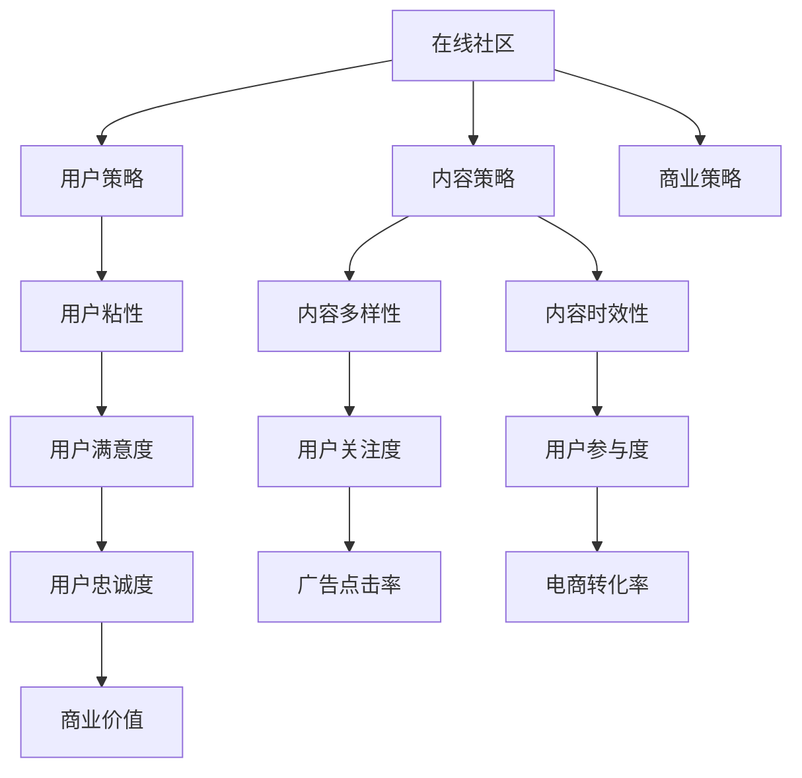

                 

# 注意力经济与在线社区建设策略与实践：吸引并留住忠实的粉丝和受众

## 1. 背景介绍

### 1.1 问题由来

随着互联网技术的快速发展，在线社区成为了人们获取信息、交流思想、分享经验的重要平台。然而，在线社区的生存和发展面临着诸多挑战，尤其是在日益激烈的注意力竞争环境中。用户留存率低、广告投放效果差、商业变现困难等问题，严重制约着在线社区的可持续发展。因此，如何吸引和留住忠实的粉丝和受众，成为每个在线社区运营者亟需解决的核心问题。

### 1.2 问题核心关键点

在线社区建设的核心在于构建一个以用户为中心、内容为核心的生态系统。这个生态系统不仅要有优质的内容产出，还要具备足够的用户粘性和商业价值。因此，构建一个优秀的在线社区需要从多个维度进行思考和实践，包括但不限于内容策略、用户策略、商业策略等。

## 2. 核心概念与联系

### 2.1 核心概念概述

为更好地理解如何构建和运营一个成功的在线社区，本节将介绍几个密切相关的核心概念：

- **在线社区**：通过互联网技术连接用户，以内容为载体，以用户互动为核心的社交平台。在线社区包括论坛、博客、社交网络等形式，旨在为人们提供信息交流、知识分享、兴趣交流的虚拟空间。
- **注意力经济**：以注意力为资源，通过吸引用户关注和参与，实现商业价值变现的经济模式。注意力经济的核心在于如何通过内容和互动机制，吸引和保持用户的注意力。
- **用户粘性**：用户对社区的持续关注和参与，包括频繁访问、积极互动、高频率消费等行为。用户粘性高的社区具有更强的用户忠诚度和商业变现能力。
- **内容策略**：根据社区定位和用户需求，制定内容生产、分发、推广的策略，确保内容的多样性、丰富性和时效性。
- **用户策略**：通过用户分析、用户管理、用户激励等手段，提升用户满意度和参与度，增强用户粘性。
- **商业策略**：通过广告、电商、会员等多种形式，实现社区的商业变现和持续发展。

这些核心概念之间的逻辑关系可以通过以下Mermaid流程图来展示：



这个流程图展示了大语言模型的核心概念及其之间的关系：

1. 在线社区通过内容策略、用户策略和商业策略三大支柱支撑，构建起用户粘性和商业价值的生态系统。
2. 内容策略决定了社区内容的多样性和时效性，直接影响用户关注度和参与度。
3. 用户策略通过提升用户满意度和忠诚度，增强用户粘性。
4. 商业策略通过多种变现形式，实现社区的可持续发展。
5. 高用户粘性、高用户满意度和高商业价值共同构成了社区的成功要素。

## 3. 核心算法原理 & 具体操作步骤

### 3.1 算法原理概述

构建一个成功的在线社区，其核心在于实现高用户粘性、高用户满意度和高商业价值的平衡。为此，我们需要通过一系列的算法和策略，吸引和留住忠实的粉丝和受众。以下是基于注意力经济的在线社区建设的主要算法原理和操作步骤：

### 3.2 算法步骤详解

**Step 1: 内容生产与分发**

- **内容策略制定**：根据社区定位和用户需求，制定内容生产、分发、推广的策略。例如，技术社区应侧重于深度技术文章，娱乐社区应侧重于趣味性内容。
- **内容多样性**：确保内容类型多样化，包括图文、视频、直播等，满足不同用户的需求。
- **内容时效性**：保持内容的时效性，及时更新热点话题和新闻信息，吸引用户关注。
- **内容分发**：通过算法推荐系统，根据用户的兴趣和行为数据，推荐相关内容，提高内容的曝光率和点击率。

**Step 2: 用户分析与管理**

- **用户画像构建**：通过数据分析，构建用户画像，了解用户的兴趣、行为和需求。
- **用户激励机制**：设计合理的激励机制，如积分、奖励、认证等，鼓励用户参与互动和贡献内容。
- **用户反馈收集**：通过调查问卷、评论区、私信等方式，收集用户反馈，及时调整内容和策略。

**Step 3: 商业变现与运营**

- **广告变现**：通过精准的广告投放和广告形式多样化，提高广告点击率和转化率。
- **电商变现**：利用社区的流量和用户信任，推荐和销售相关产品。
- **会员制度**：设计合理的会员制度，提高用户忠诚度和消费频次。

### 3.3 算法优缺点

在线社区建设中的算法和策略设计，具有以下优点：

1. **精准推荐**：通过算法推荐系统，能够高效地匹配用户需求和内容，提高用户的参与度和满意度。
2. **数据分析**：通过用户行为数据分析，可以实时调整内容和策略，提升用户粘性。
3. **商业价值**：通过多样化的变现形式，可以最大化商业价值，支持社区的可持续发展。

然而，也存在一些局限性：

1. **数据隐私问题**：大量用户数据的收集和使用，可能引发数据隐私和安全问题。
2. **内容质量控制**：算法推荐可能导致低质量内容的泛滥，需要持续优化内容审核机制。
3. **用户流失风险**：过度商业化可能导致用户反感，影响用户粘性。

尽管存在这些局限性，但通过合理设计和优化，这些算法和策略依然可以在实际应用中发挥巨大作用，帮助在线社区吸引和留住忠实的粉丝和受众。

### 3.4 算法应用领域

基于注意力经济的在线社区建设方法，已在诸多领域得到了广泛应用，例如：

- 技术论坛：如Stack Overflow、知乎等，通过技术文章、代码交流等方式，吸引技术爱好者。
- 娱乐社区：如抖音、B站等，通过短视频、直播、互动游戏等方式，吸引娱乐爱好者。
- 社交平台：如微信、微博等，通过文章、评论、社交互动等方式，吸引社交爱好者。
- 电商平台：如淘宝、京东等，通过商品推荐、购物体验等方式，吸引购物爱好者。

除了上述这些经典场景外，在线社区建设的方法也被创新性地应用于更多领域中，如学习社区、创业社区、公益社区等，为不同领域的专业人士提供了交流、分享、互助的虚拟空间。

## 4. 数学模型和公式 & 详细讲解 & 举例说明

### 4.1 数学模型构建

在在线社区建设中，算法推荐系统是一个重要的工具。通过数学模型和算法，可以精准地匹配用户需求和内容，提高用户参与度和满意度。

假设用户集合为 $U$，内容集合为 $C$，内容-用户评分矩阵为 $R \in \mathbb{R}^{n \times m}$，其中 $n$ 为内容数量，$m$ 为用户数量。用户对内容的评分 $r_{i,j}$ 表示用户 $i$ 对内容 $j$ 的兴趣程度。

我们的目标是设计一个推荐算法，使得每个用户 $i$ 都能够看到其最感兴趣的内容 $j$，即最大化用户满意度的总和：

$$
\max \sum_{i=1}^{m} \sum_{j=1}^{n} r_{i,j} \times f(i,j)
$$

其中 $f(i,j)$ 为推荐算法函数，需要满足 $f(i,j) \in [0,1]$，即推荐值在合理范围内。

### 4.2 公式推导过程

为了设计一个高效的推荐算法，我们可以采用协同过滤方法。协同过滤包括基于用户的协同过滤和基于内容的协同过滤。

- **基于用户的协同过滤**：计算用户 $i$ 与所有其他用户的相似度，根据相似度权重推荐用户 $i$ 对内容 $j$ 的评分预测。

设用户 $i$ 和用户 $k$ 的相似度为 $s_{i,k}$，则用户 $i$ 对内容 $j$ 的评分预测为：

$$
\hat{r}_{i,j} = \sum_{k=1}^{m} s_{i,k} \times r_{k,j}
$$

其中 $s_{i,k}$ 可以通过余弦相似度、皮尔逊相关系数等方法计算得到。

- **基于内容的协同过滤**：计算内容 $j$ 与所有其他内容的相似度，根据相似度权重推荐内容 $j$ 对用户 $i$ 的评分预测。

设内容 $j$ 和内容 $k$ 的相似度为 $s_{j,k}$，则内容 $j$ 对用户 $i$ 的评分预测为：

$$
\hat{r}_{i,j} = \sum_{k=1}^{n} s_{j,k} \times r_{i,k}
$$

其中 $s_{j,k}$ 可以通过余弦相似度、欧几里得距离等方法计算得到。

### 4.3 案例分析与讲解

假设我们有一个电影推荐系统，目标是推荐用户最感兴趣的电影。我们可以使用基于用户的协同过滤算法，具体步骤如下：

1. 收集用户的评分数据 $R$，如用户的评分矩阵。
2. 计算用户 $i$ 和用户 $k$ 的相似度 $s_{i,k}$，可以使用余弦相似度：

$$
s_{i,k} = \frac{\sum_{j=1}^{n} r_{i,j} \times r_{k,j}}{\sqrt{\sum_{j=1}^{n} r_{i,j}^2} \times \sqrt{\sum_{j=1}^{n} r_{k,j}^2}}
$$

3. 根据相似度权重推荐用户 $i$ 对电影 $j$ 的评分预测 $\hat{r}_{i,j}$：

$$
\hat{r}_{i,j} = \sum_{k=1}^{m} s_{i,k} \times r_{k,j}
$$

4. 根据评分预测，推荐用户 $i$ 最感兴趣的电影 $j$。

在实际应用中，我们需要对推荐算法进行优化，如引入时间因素、处理冷启动问题、改进相似度计算方法等，以提高推荐的准确性和用户满意度。

## 5. 项目实践：代码实例和详细解释说明

### 5.1 开发环境搭建

在进行在线社区建设实践前，我们需要准备好开发环境。以下是使用Python进行TensorFlow开发的环境配置流程：

1. 安装Anaconda：从官网下载并安装Anaconda，用于创建独立的Python环境。

2. 创建并激活虚拟环境：
```bash
conda create -n tf-env python=3.8 
conda activate tf-env
```

3. 安装TensorFlow：根据CUDA版本，从官网获取对应的安装命令。例如：
```bash
conda install tensorflow -c tensorflow
```

4. 安装Flask：用于构建社区的Web应用：
```bash
pip install flask
```

5. 安装Pandas：用于数据处理：
```bash
pip install pandas
```

6. 安装Matplotlib：用于数据可视化：
```bash
pip install matplotlib
```

7. 安装TensorBoard：用于模型训练的可视化：
```bash
pip install tensorboard
```

完成上述步骤后，即可在`tf-env`环境中开始在线社区的开发实践。

### 5.2 源代码详细实现

下面我们以电影推荐系统为例，给出使用TensorFlow实现协同过滤算法的PyTorch代码实现。

首先，定义评分矩阵：

```python
import pandas as pd
import tensorflow as tf

# 定义评分矩阵
R = pd.read_csv('ratings.csv')
R = R.values
R = R.astype(float)
```

然后，定义协同过滤算法函数：

```python
def collaborative_filtering(R, user, num_neighbours=10):
    # 计算用户间的相似度
    S = np.dot(R, R.T)
    S = S / (np.linalg.norm(R) * np.linalg.norm(R.T))
    
    # 计算预测评分
    predictions = np.zeros_like(R)
    for i in range(R.shape[0]):
        for j in range(R.shape[1]):
            # 选择最相似的邻居
            top_neighbours = np.argsort(S[i])[-num_neighbours:][::-1]
            predictions[i,j] = np.mean(R[top_neighbours] * S[i, top_neighbours])
    
    return predictions
```

接着，调用协同过滤算法进行电影推荐：

```python
# 定义用户和电影
users = R.shape[0]
movies = R.shape[1]

# 进行电影推荐
user = 0
num_neighbours = 10
predictions = collaborative_filtering(R, user, num_neighbours)

# 获取推荐的电影
recommended_movies = np.argsort(predictions[user])[::-1][:5]
print(recommended_movies)
```

以上是使用TensorFlow实现协同过滤算法的完整代码实现。可以看到，TensorFlow提供了强大的计算图和分布式训练能力，可以高效地实现协同过滤等复杂算法。

### 5.3 代码解读与分析

让我们再详细解读一下关键代码的实现细节：

**评分矩阵定义**：
- 使用Pandas库读取评分数据，将其转换为NumPy数组，并转换成浮点数格式。

**协同过滤算法实现**：
- 计算用户间的相似度矩阵 $S$，通过余弦相似度计算。
- 根据相似度权重，计算预测评分矩阵 $predictions$，每个用户对每部电影的评分预测。

**推荐结果输出**：
- 选择用户 $i$ 最感兴趣的 $num_neighbours$ 部电影，并输出推荐结果。

在实际应用中，TensorFlow还提供了多种优化器和损失函数，可以帮助我们更好地进行模型的训练和优化。同时，TensorFlow的Keras API也提供了丰富的预训练模型和层次化神经网络构建方法，可以大大简化模型的搭建和调试过程。

## 6. 实际应用场景

### 6.1 智能推荐系统

基于协同过滤算法的推荐系统，可以在电商、视频、音乐等多个领域发挥重要作用。以电商推荐为例，通过用户的历史浏览、购买记录等数据，推荐用户可能感兴趣的商品，可以显著提升用户的购买转化率和平台销售额。

在技术实现上，可以将用户和商品的数据构建为矩阵，通过协同过滤算法计算预测评分，根据评分排序推荐商品。此外，还可以引入内容特征、时间特征、用户特征等多样化因素，提高推荐的准确性和多样性。

### 6.2 社交网络分析

社交网络分析是社交媒体和社交网络的重要应用。通过分析用户之间的互动关系，可以挖掘出用户的兴趣、行为和关系网络。例如，在Twitter上分析用户之间的关注关系和互动内容，可以发现影响力和传播力较大的用户，进而构建出用户影响力模型。

在技术实现上，可以使用图数据库和图算法，构建用户-用户互动关系图，并使用算法分析用户之间的关系特征和影响力。此外，还可以引入情感分析、文本挖掘等技术，进一步提升社交网络分析的效果。

### 6.3 视频推荐系统

视频推荐系统在视频平台和流媒体服务中应用广泛。通过分析用户的观看历史和行为数据，推荐用户可能感兴趣的视频内容，可以提升用户观看时长和平台留存率。

在技术实现上，可以使用协同过滤算法和深度学习模型，联合推荐结果，提高推荐的准确性和个性化程度。同时，还可以引入视频元数据、用户画像等多样化因素，提升推荐的效果。

### 6.4 未来应用展望

随着在线社区建设技术的不断进步，未来在线社区将呈现以下几个发展趋势：

1. **个性化推荐**：通过用户画像和行为数据，提供更加精准和个性化的内容推荐，提高用户满意度和粘性。
2. **实时互动**：通过实时通信和互动功能，增强用户之间的交流和互动，提升社区的活跃度和参与度。
3. **多模态融合**：将文本、图片、视频等多种模态的数据进行融合，提升内容的多样性和吸引力。
4. **AI辅助运营**：引入AI技术，如自然语言处理、计算机视觉等，提升社区的内容生成和运营效率。
5. **商业变现**：通过多样化变现手段，如广告、电商、知识付费等，实现社区的商业价值最大化。

以上趋势将进一步提升在线社区的生态系统和商业价值，为用户带来更加丰富和优质的内容体验。相信随着技术的不断进步，在线社区将成为人们获取信息、交流思想、分享经验的重要平台，助力社交和信息技术的深度融合。

## 7. 工具和资源推荐

### 7.1 学习资源推荐

为了帮助开发者系统掌握在线社区建设的技术基础和实践技巧，这里推荐一些优质的学习资源：

1. **《深度学习》**：Ian Goodfellow等著，系统介绍了深度学习的基本概念和算法。
2. **《Python机器学习》**：Sebastian Raschka著，介绍了机器学习和深度学习的Python实现。
3. **《TensorFlow实战》**：Xavier Garrette等著，介绍了TensorFlow的基本概念和应用实践。
4. **《Keras实战》**：Tim Stallion等著，介绍了Keras的基本概念和应用实践。
5. **Coursera和edX**：提供多门深度学习和AI课程，涵盖基本概念和前沿技术。

通过对这些资源的学习实践，相信你一定能够快速掌握在线社区建设的技术基础和实践技巧。

### 7.2 开发工具推荐

高效的开发离不开优秀的工具支持。以下是几款用于在线社区建设的常用工具：

1. **TensorFlow**：由Google主导开发的深度学习框架，生产部署方便，适合大规模工程应用。
2. **Keras**：高层次的神经网络API，可以快速搭建和调试深度学习模型。
3. **Flask**：用于构建Web应用的Python框架，简单易用，适合快速开发和部署。
4. **Pandas**：用于数据处理和分析的Python库，提供了丰富的数据操作功能。
5. **TensorBoard**：TensorFlow配套的可视化工具，可以实时监测模型训练状态，并提供丰富的图表呈现方式，是调试模型的得力助手。
6. **PyTorch**：基于Python的深度学习框架，灵活动态的计算图，适合快速迭代研究。

合理利用这些工具，可以显著提升在线社区建设的开发效率，加快创新迭代的步伐。

### 7.3 相关论文推荐

在线社区建设的研究源于学界的持续研究。以下是几篇奠基性的相关论文，推荐阅读：

1. **《Collaborative Filtering for Recommender Systems》**：由SVD、ALS等方法代表的协同过滤算法，是推荐系统的重要基础。
2. **《A Survey of Recommender Systems》**：介绍了推荐系统的多种算法和技术，包括协同过滤、基于内容的推荐、混合推荐等。
3. **《Deep Learning for Recommender Systems: A Survey and Outlook》**：介绍了深度学习在推荐系统中的应用，包括基于CNN、RNN、GAN等方法的推荐技术。
4. **《A Comprehensive Survey of Multi-view Clustering》**：介绍了多视图聚类算法，可用于社交网络分析和用户画像构建。
5. **《A Survey on Social Recommendation Systems》**：介绍了社交推荐系统的算法和技术，包括基于社交网络的推荐、基于社区的推荐等。

这些论文代表了大语言模型微调技术的发展脉络。通过学习这些前沿成果，可以帮助研究者把握学科前进方向，激发更多的创新灵感。

## 8. 总结：未来发展趋势与挑战

### 8.1 总结

本文对基于注意力经济的在线社区建设方法进行了全面系统的介绍。首先阐述了在线社区建设的背景和核心问题，明确了如何通过内容策略、用户策略和商业策略三大支柱，构建用户粘性和商业价值的生态系统。其次，从原理到实践，详细讲解了协同过滤算法的数学模型和操作步骤，给出了在线社区建设的完整代码实例。同时，本文还广泛探讨了在线社区建设在智能推荐、社交网络分析、视频推荐等实际应用场景中的应用前景，展示了在线社区建设的巨大潜力。此外，本文精选了在线社区建设的学习资源、开发工具和相关论文，力求为开发者提供全方位的技术指引。

通过本文的系统梳理，可以看到，基于注意力经济的在线社区建设方法正在成为社交媒体和信息平台的重要范式，极大地提升了用户参与度和平台商业价值。未来，伴随在线社区技术的不断进步，社交媒体和信息平台必将在更多领域发挥重要作用，深刻影响人们的生产生活方式。

### 8.2 未来发展趋势

展望未来，在线社区建设技术将呈现以下几个发展趋势：

1. **多样化内容推荐**：通过用户画像和行为数据，提供更加精准和个性化的内容推荐，提高用户满意度和粘性。
2. **实时互动和社交网络分析**：通过实时通信和互动功能，增强用户之间的交流和互动，提升社区的活跃度和参与度。
3. **多模态融合和AI辅助运营**：将文本、图片、视频等多种模态的数据进行融合，提升内容的多样性和吸引力，引入AI技术提升社区的运营效率。
4. **商业变现的多样化**：通过多样化变现手段，如广告、电商、知识付费等，实现社区的商业价值最大化。
5. **社区生态的协同演化**：通过社区内容的生产、分发、互动等环节的协同设计，构建更加健康、有活力的社区生态。

以上趋势将进一步提升在线社区的生态系统和商业价值，为用户带来更加丰富和优质的内容体验。相信随着技术的不断进步，在线社区将成为人们获取信息、交流思想、分享经验的重要平台，助力社交和信息技术的深度融合。

### 8.3 面临的挑战

尽管在线社区建设技术已经取得了瞩目成就，但在迈向更加智能化、普适化应用的过程中，它仍面临着诸多挑战：

1. **用户隐私保护**：用户数据的收集和使用，可能引发数据隐私和安全问题。如何保护用户隐私，同时提升用户体验，将是未来的一个重要课题。
2. **推荐算法的多样性**：单一的推荐算法难以满足复杂多样的用户需求。如何引入多种推荐算法，提升推荐效果，将是重要的优化方向。
3. **用户粘性的长期保持**：用户流失问题是社区建设的难题。如何通过多样化的内容和互动机制，长期保持用户粘性，还需要更多的探索和实践。
4. **社区管理的规范性**：在线社区容易滋生谣言、虚假信息等问题。如何建立社区管理的规范和机制，提升社区质量，将是重要的管理方向。
5. **社区运营的可持续性**：在线社区需要大量的运营成本和技术支持。如何降低运营成本，提升运营效率，将是重要的运营方向。

正视在线社区建设面临的这些挑战，积极应对并寻求突破，将是在线社区建设走向成熟的必由之路。相信随着学界和产业界的共同努力，这些挑战终将一一被克服，在线社区建设必将在构建人机协同的智能时代中扮演越来越重要的角色。

### 8.4 研究展望

面对在线社区建设所面临的种种挑战，未来的研究需要在以下几个方面寻求新的突破：

1. **数据隐私保护技术**：研究如何在保护用户隐私的前提下，提升数据利用效率和用户体验。
2. **推荐算法的优化**：研究如何引入更多样化的推荐算法，提升推荐效果和用户满意度。
3. **用户粘性提升**：研究如何通过多样化的内容和互动机制，长期保持用户粘性。
4. **社区管理规范**：研究如何建立社区管理的规范和机制，提升社区质量。
5. **社区运营优化**：研究如何降低运营成本，提升运营效率。

这些研究方向将引领在线社区建设技术迈向更高的台阶，为构建安全、可靠、可解释、可控的智能系统铺平道路。面向未来，在线社区建设技术还需要与其他人工智能技术进行更深入的融合，如知识表示、因果推理、强化学习等，多路径协同发力，共同推动社交媒体和信息平台的进步。只有勇于创新、敢于突破，才能不断拓展在线社区的边界，让智能技术更好地造福人类社会。

## 9. 附录：常见问题与解答

**Q1：在线社区建设中，如何选择合适的推荐算法？**

A: 在线社区建设中，选择合适的推荐算法需要考虑以下几个方面：

1. **数据特征**：根据社区数据的特征，选择合适的推荐算法。例如，如果数据具有稀疏性，可以选用基于协同过滤的算法；如果数据具有多样性，可以选用基于内容的算法。
2. **用户需求**：根据社区用户的需求，选择合适的推荐算法。例如，如果用户对多样性要求较高，可以选用基于混合推荐的算法。
3. **技术复杂度**：根据技术实现的复杂度，选择合适的推荐算法。例如，如果实现简单，可以选择基于规则的推荐算法；如果实现复杂，可以选择基于深度学习的推荐算法。

**Q2：在线社区建设中，如何提升用户粘性？**

A: 在线社区建设中，提升用户粘性需要从多个维度进行思考和实践：

1. **内容丰富性**：提供多样化的内容，满足不同用户的需求。例如，技术社区提供技术文章、代码分享等，娱乐社区提供短视频、直播等。
2. **互动机制**：设计多样化的互动机制，增强用户之间的交流和互动。例如，通过评论、点赞、私信等方式，提高用户参与度。
3. **用户激励**：设计合理的激励机制，鼓励用户贡献内容。例如，通过积分、奖励、认证等方式，提升用户贡献积极性和粘性。
4. **社区氛围**：营造积极健康的社区氛围，提高用户满意度和留存率。例如，通过社区管理、版主监管等方式，提升社区质量和用户信任。

**Q3：在线社区建设中，如何实现商业变现？**

A: 在线社区建设中，实现商业变现可以通过以下多种方式：

1. **广告变现**：通过精准的广告投放和广告形式多样化，提高广告点击率和转化率。例如，通过展示广告、原生广告等方式，实现商业变现。
2. **电商变现**：利用社区的流量和用户信任，推荐和销售相关产品。例如，通过社区电商、商品推荐等方式，实现商业变现。
3. **会员制度**：设计合理的会员制度，提高用户忠诚度和消费频次。例如，通过会员特权、会员积分等方式，实现商业变现。

**Q4：在线社区建设中，如何处理数据隐私问题？**

A: 在线社区建设中，处理数据隐私问题需要从多个维度进行思考和实践：

1. **数据匿名化**：对用户数据进行匿名化处理，保护用户隐私。例如，通过数据脱敏、数据匿名化等方式，保护用户隐私。
2. **用户授权**：获取用户的明确授权，确保数据使用的合法性。例如，通过隐私协议、用户同意等方式，获取用户授权。
3. **数据加密**：对用户数据进行加密处理，防止数据泄露。例如，通过数据加密、数据备份等方式，保护数据安全。

这些策略可以帮助在线社区建设者更好地处理数据隐私问题，保护用户隐私，同时提升用户体验和社区信任度。

**Q5：在线社区建设中，如何提升推荐算法的准确性和多样性？**

A: 在线社区建设中，提升推荐算法的准确性和多样性需要从多个维度进行思考和实践：

1. **多模态数据融合**：将文本、图片、视频等多种模态的数据进行融合，提升内容的丰富性和多样性。例如，通过图像识别、语音识别等方式，获取多模态数据，提升推荐效果。
2. **实时数据更新**：实时更新用户行为数据，提升推荐的及时性和准确性。例如，通过实时记录用户行为、兴趣变化等方式，动态调整推荐策略。
3. **多样化算法结合**：结合多种推荐算法，提升推荐的全面性和多样性。例如，通过协同过滤、基于内容的推荐、深度学习等方式，提升推荐效果。
4. **用户反馈机制**：引入用户反馈机制，实时调整推荐策略。例如，通过用户评分、用户评论等方式，优化推荐算法。

这些策略可以帮助在线社区建设者提升推荐算法的准确性和多样性，为用户提供更加精准和个性化的内容推荐。

**Q6：在线社区建设中，如何构建用户画像？**

A: 在线社区建设中，构建用户画像需要从多个维度进行思考和实践：

1. **行为数据**：收集用户的行为数据，如浏览记录、点击记录、互动记录等，构建用户的行为画像。例如，通过日志分析、数据分析等方式，获取用户的行为数据。
2. **社交数据**：收集用户的社交数据，如关注关系、互动关系等，构建用户的社交画像。例如，通过社交网络分析、用户互动记录等方式，获取用户的社交数据。
3. **内容数据**：收集用户的内容数据，如评论内容、文章内容等，构建用户的内容画像。例如，通过内容分析、情感分析等方式，获取用户的内容数据。
4. **用户反馈**：收集用户的反馈数据，如评分数据、评论数据等，构建用户的反馈画像。例如，通过用户评分、用户评论等方式，获取用户的反馈数据。

这些策略可以帮助在线社区建设者构建完整的用户画像，了解用户的需求和行为，提升推荐效果和用户满意度。

---

作者：禅与计算机程序设计艺术 / Zen and the Art of Computer Programming

