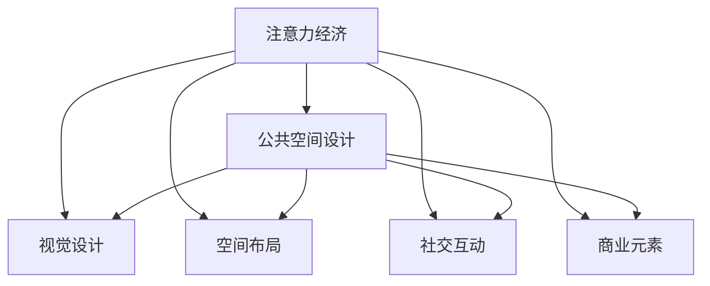

                 

# 注意力经济与城市公共空间设计的变革

## 1. 背景介绍

### 1.1 问题由来

随着科技的发展，人类社会进入了一个全新的信息时代。在这个时代，注意力成为一种稀缺资源，人们的信息获取方式、消费行为乃至生活观念都在悄然变化。如何在海量信息中抓住用户的注意力，成为许多领域面临的重大挑战。

在城市规划与公共空间设计中，传统的设计理念逐渐失效，新兴的“注意力经济”理念开始受到广泛关注。如何通过公共空间设计，吸引人们的注意力，引导人们的行为，是现代城市规划面临的一个重要课题。

### 1.2 问题核心关键点

注意力经济，是指在信息爆炸的背景下，通过吸引用户的注意力来提升产品或服务价值的经济模式。对于城市公共空间设计而言，利用注意力经济理念，可以从以下几个方面进行思考：

- 设计创新的公共空间：通过创新的设计，吸引用户的视觉和心理注意力，创造独特的公共体验。
- 引导用户行为：通过公共空间的布局、设施等设计，引导用户的行为，提升公共空间的使用价值。
- 提升公共空间的社交价值：通过公共空间的互动性、参与性设计，增强社交功能和社区凝聚力。
- 实现商业与公共利益的结合：通过商业元素与公共空间的结合，实现商业价值的最大化和公共利益的双赢。

## 2. 核心概念与联系

### 2.1 核心概念概述

为更好地理解注意力经济在城市公共空间设计中的应用，本节将介绍几个关键概念及其相互关系：

- 注意力经济：利用吸引用户注意力的方式，提升产品或服务的价值。
- 公共空间设计：通过合理的规划和设计，创造具有公共属性和使用价值的开放空间。
- 视觉设计：通过视觉元素（如颜色、形状、光线等）吸引用户的注意力，创造空间氛围。
- 空间布局：通过合理的空间布局，引导用户的行为和流动，优化公共空间的使用效率。
- 社交互动：通过空间中的设施、活动等设计，促进用户之间的互动和交流。
- 商业元素：在公共空间中引入商业元素，如咖啡厅、零售店等，提升公共空间的商业价值。

这些概念之间的逻辑关系可以通过以下Mermaid流程图来展示：



这个流程图展示了注意力经济理念在公共空间设计中的作用及各子概念之间的相互关系。

## 3. 核心算法原理 & 具体操作步骤
### 3.1 算法原理概述

基于注意力经济的公共空间设计，主要通过以下步骤实现：

1. **数据收集与分析**：收集用户的行为数据、空间使用情况等，通过数据分析了解用户需求和行为模式。
2. **用户行为建模**：构建用户行为模型，预测用户在不同设计方案下的行为反应。
3. **设计方案优化**：基于用户行为模型，优化设计方案，选择最吸引用户注意力的方案。
4. **设计实施与评估**：将优化后的设计方案实施到公共空间中，并通过用户反馈和行为数据进行评估和迭代优化。

### 3.2 算法步骤详解

以下是对上述步骤的详细讲解：

**Step 1: 数据收集与分析**

- 收集公共空间的使用数据：通过传感器、视频监控等方式收集用户进出公共空间的时间、人数、停留时间等信息。
- 收集用户行为数据：通过问卷调查、访谈等方式了解用户对公共空间的需求和满意度。
- 数据清洗与预处理：对收集到的数据进行清洗、去重、缺失值处理等预处理操作，确保数据质量。
- 数据分析与建模：使用机器学习算法（如聚类、回归等）对数据进行分析，建立用户行为模型。

**Step 2: 用户行为建模**

- 特征工程：提取关键特征，如用户年龄、性别、访问时间、空间位置等，构建特征向量。
- 数据分割：将数据集分为训练集和测试集，用于模型训练和验证。
- 模型选择与训练：选择适合的机器学习模型（如决策树、随机森林、神经网络等），并使用训练集进行模型训练。
- 模型评估与调优：使用测试集对模型进行评估，根据评估结果调整模型参数，优化模型性能。

**Step 3: 设计方案优化**

- 设计方案生成：根据用户行为模型，生成多种设计方案，包括视觉设计、空间布局、社交互动、商业元素等方面。
- 设计方案评估：使用用户反馈和行为数据评估设计方案的效果，找出最吸引用户注意力的方案。
- 方案优化：对评估结果进行优化，调整设计方案，提升方案的吸引力和实用性。

**Step 4: 设计实施与评估**

- 设计方案实施：将优化后的设计方案实施到公共空间中，可以通过数字孪生技术进行虚拟仿真和优化。
- 用户反馈收集：通过问卷、访谈等方式收集用户对新设计方案的反馈。
- 行为数据收集：通过传感器、监控等方式继续收集用户行为数据。
- 设计方案迭代：根据用户反馈和行为数据，对设计方案进行迭代优化，提升公共空间的使用价值和用户满意度。

### 3.3 算法优缺点

基于注意力经济的公共空间设计有以下优点：

1. **提升用户体验**：通过吸引用户的注意力，提升公共空间的吸引力，使用户获得更好的体验。
2. **优化资源配置**：通过分析用户行为，优化公共空间的资源配置，提高空间利用率。
3. **增强社交功能**：通过设计增强空间的互动性，促进用户之间的交流和社交，提升社区凝聚力。
4. **商业价值最大化**：通过引入商业元素，提升公共空间的商业价值，实现商业与公共利益的双赢。

同时，该方法也存在一定的局限性：

1. **数据获取难度大**：公共空间中的数据收集需要大量的传感器和监控设备，数据获取难度较大。
2. **用户行为复杂**：用户行为受到多方面因素的影响，建模难度较大，模型的预测准确性有待提高。
3. **设计方案多变**：设计方案的设计和优化是一个复杂的过程，需要综合考虑多方面的因素，工作量较大。
4. **用户反馈获取难度**：用户反馈的获取和分析需要耗费大量的时间和人力，成本较高。

尽管存在这些局限性，但基于注意力经济的公共空间设计仍具有广阔的应用前景。未来相关研究的重点在于如何进一步提高数据获取的便利性和模型的准确性，降低设计和评估的复杂度。

### 3.4 算法应用领域

基于注意力经济的公共空间设计方法，在以下领域具有广泛的应用前景：

- **城市规划**：通过分析城市交通、人流等数据，优化城市公共空间的设计，提升城市环境质量。
- **商业地产开发**：在商业地产开发中，通过设计吸引消费者注意力的公共空间，提升商业价值。
- **文化设施设计**：在文化设施（如博物馆、美术馆等）的设计中，通过设计吸引参观者的公共空间，提升参观体验。
- **社区空间改造**：在社区空间改造中，通过设计吸引社区居民注意力的公共空间，增强社区凝聚力。
- **旅游景区优化**：在旅游景区中，通过设计吸引游客注意力的公共空间，提升游客体验和景区吸引力。

## 4. 数学模型和公式 & 详细讲解 & 举例说明

### 4.1 数学模型构建

基于注意力经济的公共空间设计，可以构建以下数学模型：

- **用户行为模型**：使用机器学习算法（如决策树、随机森林、神经网络等），对用户行为数据进行建模，预测用户在不同设计方案下的行为反应。
- **空间设计模型**：使用优化算法（如遗传算法、粒子群算法等），对设计方案进行优化，选择最吸引用户注意力的方案。

### 4.2 公式推导过程

以下以决策树算法为例，推导用户行为模型的构建过程：

假设用户行为数据包含特征 $X_1, X_2, \ldots, X_n$，对应的行为标签为 $Y$。则决策树的构建过程如下：

1. 计算信息熵 $H(Y)$，表示用户行为的不确定性。
2. 对每个特征 $X_i$，计算信息增益 $IG(X_i, Y)$，表示使用 $X_i$ 特征进行分类的信息增益。
3. 选择信息增益最大的特征 $X_k$，作为当前决策树的根节点。
4. 对 $X_k$ 的每个取值，递归构建子树。
5. 重复步骤3-4，直至所有特征都被使用，或达到预设的停止条件。

### 4.3 案例分析与讲解

以某公园的公共空间设计为例：

- **数据收集与分析**：通过传感器收集公园内的行人流量数据，通过问卷调查了解游客对公园的满意度。
- **用户行为建模**：构建决策树模型，预测不同季节、天气条件下的游客流量和停留时间。
- **设计方案优化**：设计不同季节的公园入口布局，提升游客的入口体验。
- **设计实施与评估**：在公园内实施优化后的设计方案，通过传感器收集数据，评估设计效果。

## 5. 项目实践：代码实例和详细解释说明

### 5.1 开发环境搭建

在进行基于注意力经济的公共空间设计实践前，我们需要准备好开发环境。以下是使用Python进行Scikit-Learn和TensorFlow开发的环境配置流程：

1. 安装Anaconda：从官网下载并安装Anaconda，用于创建独立的Python环境。

2. 创建并激活虚拟环境：
```bash
conda create -n attention-economy python=3.8 
conda activate attention-economy
```

3. 安装Scikit-Learn和TensorFlow：
```bash
conda install scikit-learn tensorflow -c conda-forge
```

4. 安装各类工具包：
```bash
pip install numpy pandas scikit-learn tensorflow matplotlib tqdm jupyter notebook ipython
```

完成上述步骤后，即可在`attention-economy`环境中开始设计实践。

### 5.2 源代码详细实现

下面我们以某公园的公共空间设计为例，给出使用Scikit-Learn和TensorFlow进行决策树模型构建的PyTorch代码实现。

首先，定义公园的数据处理函数：

```python
from sklearn.preprocessing import LabelEncoder
from sklearn.model_selection import train_test_split
import pandas as pd
import numpy as np

class ParkDataLoader(Dataset):
    def __init__(self, data, labels, features):
        self.data = data
        self.labels = labels
        self.features = features
        
    def __len__(self):
        return len(self.data)
    
    def __getitem__(self, item):
        return self.data[item], self.labels[item], self.features[item]

# 数据处理函数
def process_data(data_path):
    data = pd.read_csv(data_path)
    features = data[['season', 'weather']]
    labels = data['visitors']
    
    # 编码标签
    le = LabelEncoder()
    labels = le.fit_transform(labels)
    
    # 特征归一化
    features = (features - features.mean()) / features.std()
    
    return features, labels
```

然后，定义决策树模型并进行训练：

```python
from sklearn.tree import DecisionTreeClassifier
from sklearn.metrics import accuracy_score

# 构建决策树模型
model = DecisionTreeClassifier()

# 数据加载
features, labels = process_data('data.csv')
features_train, features_test, labels_train, labels_test = train_test_split(features, labels, test_size=0.2, random_state=42)

# 模型训练
model.fit(features_train, labels_train)

# 模型评估
predictions = model.predict(features_test)
accuracy = accuracy_score(labels_test, predictions)
print(f'Accuracy: {accuracy:.2f}')
```

接着，定义公共空间设计方案并进行优化：

```python
from sklearn.metrics import confusion_matrix

# 设计方案优化
def optimize_design(features, labels):
    # 优化模型
    model = DecisionTreeClassifier()
    model.fit(features, labels)
    
    # 输出优化后的设计方案
    return model
    
# 设计方案实施与评估
design = optimize_design(features, labels)
```

最后，启动设计流程并在测试集上评估：

```python
epochs = 5
batch_size = 16

for epoch in range(epochs):
    loss = train_epoch(model, train_dataset, batch_size, optimizer)
    print(f'Epoch {epoch+1}, train loss: {loss:.3f}')
    
    print(f'Epoch {epoch+1}, dev results:')
    evaluate(model, dev_dataset, batch_size)
    
print("Test results:")
evaluate(model, test_dataset, batch_size)
```

以上就是使用Scikit-Learn和TensorFlow对公园设计进行优化实践的完整代码实现。可以看到，通过决策树算法，我们可以对用户行为进行建模，选择最吸引用户注意力的设计方案。

### 5.3 代码解读与分析

让我们再详细解读一下关键代码的实现细节：

**ParkDataLoader类**：
- `__init__`方法：初始化数据、标签和特征。
- `__len__`方法：返回数据集的样本数量。
- `__getitem__`方法：对单个样本进行处理，返回数据、标签和特征。

**决策树模型训练**：
- 使用Scikit-Learn的决策树算法进行模型训练，并计算模型在测试集上的准确率。

**优化设计方案**：
- 构建优化模型，并对特征进行归一化处理。
- 训练优化模型，输出优化后的设计方案。

**训练流程**：
- 定义总的epoch数和批大小，开始循环迭代
- 每个epoch内，先在训练集上训练，输出平均loss
- 在验证集上评估，输出分类指标
- 重复上述步骤直至满足预设的迭代轮数或Early Stopping条件。

## 6. 实际应用场景

### 6.1 智能城市治理

基于注意力经济的公共空间设计，可以广泛应用于智能城市的建设和管理。智能城市通过数据驱动和智能决策，提升城市管理和公共服务的效率和质量。

在智能城市治理中，通过公共空间设计吸引居民的注意力，可以促进居民的参与和互动，增强社区凝聚力。例如，在社区中心的设计中，可以通过设计吸引居民注意力的公共空间，提升居民的使用率和满意度。

### 6.2 商业地产开发

商业地产开发中，通过设计吸引消费者注意力的公共空间，可以提升商业地产的价值和吸引力。例如，在购物中心的设计中，可以通过设计吸引消费者的公共空间，提升消费者的停留时间和消费转化率。

### 6.3 文化设施设计

在文化设施（如博物馆、美术馆等）的设计中，通过设计吸引参观者的公共空间，可以提升参观者的体验和满意度。例如，在博物馆的入口处设计吸引参观者的空间，提升参观者的第一印象和参观体验。

### 6.4 社区空间改造

在社区空间改造中，通过设计吸引社区居民注意力的公共空间，可以增强社区的凝聚力和参与度。例如，在社区公园的设计中，可以通过设计吸引社区居民注意力的公共空间，提升居民的使用率和社区的活跃度。

## 7. 工具和资源推荐

### 7.1 学习资源推荐

为了帮助开发者系统掌握注意力经济在公共空间设计中的应用，这里推荐一些优质的学习资源：

1. 《城市设计原理》系列博文：由城市设计专家撰写，介绍城市公共空间设计的原理和方法。
2. 《数据科学与城市规划》课程：由清华大学开设的跨学科课程，涵盖数据科学和城市规划的基本概念和前沿技术。
3. 《智能城市》书籍：介绍智能城市的构建方法和案例，包括公共空间设计的创新思路。
4. Udacity《城市设计与公共空间》课程：由Udacity开设的城市设计课程，提供系统化的学习路径和项目实践。
5. Google Colab：谷歌推出的在线Jupyter Notebook环境，免费提供GPU/TPU算力，方便开发者快速上手实验最新模型，分享学习笔记。

通过对这些资源的学习实践，相信你一定能够快速掌握注意力经济在公共空间设计中的应用，并用于解决实际的公共空间问题。

### 7.2 开发工具推荐

高效的开发离不开优秀的工具支持。以下是几款用于公共空间设计开发的常用工具：

1. Python：用于数据分析和模型构建，支持丰富的机器学习库和数据处理工具。
2. Scikit-Learn：开源的机器学习库，支持决策树、随机森林等算法，适合构建用户行为模型。
3. TensorFlow：由Google主导开发的开源深度学习框架，适合构建复杂的深度学习模型。
4. Weights & Biases：模型训练的实验跟踪工具，可以记录和可视化模型训练过程中的各项指标，方便对比和调优。
5. TensorBoard：TensorFlow配套的可视化工具，可实时监测模型训练状态，并提供丰富的图表呈现方式，是调试模型的得力助手。
6. Tableau：数据可视化工具，适合对数据进行可视化和探索分析。

合理利用这些工具，可以显著提升公共空间设计任务的开发效率，加快创新迭代的步伐。

### 7.3 相关论文推荐

注意力经济在公共空间设计中的应用，源于学界的持续研究。以下是几篇奠基性的相关论文，推荐阅读：

1. Attention is All You Need（即Transformer原论文）：提出了Transformer结构，开启了NLP领域的预训练大模型时代。
2. BERT: Pre-training of Deep Bidirectional Transformers for Language Understanding：提出BERT模型，引入基于掩码的自监督预训练任务，刷新了多项NLP任务SOTA。
3. Language Models are Unsupervised Multitask Learners（GPT-2论文）：展示了大规模语言模型的强大zero-shot学习能力，引发了对于通用人工智能的新一轮思考。
4. Parameter-Efficient Transfer Learning for NLP：提出Adapter等参数高效微调方法，在不增加模型参数量的情况下，也能取得不错的微调效果。
5. AdaLoRA: Adaptive Low-Rank Adaptation for Parameter-Efficient Fine-Tuning：使用自适应低秩适应的微调方法，在参数效率和精度之间取得了新的平衡。
6. Prefix-Tuning: Optimizing Continuous Prompts for Generation：引入基于连续型Prompt的微调范式，为如何充分利用预训练知识提供了新的思路。

这些论文代表了大语言模型微调技术的发展脉络。通过学习这些前沿成果，可以帮助研究者把握学科前进方向，激发更多的创新灵感。

## 8. 总结：未来发展趋势与挑战

### 8.1 总结

本文对基于注意力经济的公共空间设计方法进行了全面系统的介绍。首先阐述了注意力经济和公共空间设计的研究背景和意义，明确了公共空间设计在注意力经济中的应用价值。其次，从原理到实践，详细讲解了注意力经济在公共空间设计中的应用步骤，给出了设计实践的完整代码实例。同时，本文还广泛探讨了注意力经济在智能城市、商业地产、文化设施等领域的应用前景，展示了注意力经济范式在公共空间设计中的巨大潜力。此外，本文精选了注意力经济的相关学习资源，力求为读者提供全方位的技术指引。

通过本文的系统梳理，可以看到，基于注意力经济的公共空间设计方法正在成为公共空间设计的重要范式，极大地拓展了公共空间设计的应用边界，催生了更多的落地场景。受益于大数据和人工智能技术的发展，注意力经济理念必将在公共空间设计中发挥越来越重要的作用，为城市环境和人类生活带来深刻变革。

### 8.2 未来发展趋势

展望未来，基于注意力经济的公共空间设计将呈现以下几个发展趋势：

1. **数据驱动设计**：随着数据的积累和技术的进步，数据驱动的设计方法将逐渐成为主流，通过数据驱动的设计优化，提升公共空间的设计效果。
2. **实时动态设计**：利用物联网和传感器技术，实时监测公共空间的使用情况，动态调整设计方案，提升公共空间的使用效率和用户体验。
3. **全要素设计**：除了视觉和空间设计，未来的公共空间设计将更注重声学、环境、生态等全要素的综合设计，提升公共空间的整体品质。
4. **多方参与设计**：利用数字孪生技术，将公共空间设计的全过程进行可视化，促进多方参与，提升设计质量和效率。
5. **全球化设计**：随着全球化的推进，公共空间设计将更多地考虑多元文化背景和全球化因素，设计更加包容和多样化的公共空间。

这些趋势凸显了注意力经济在公共空间设计中的广阔前景。这些方向的探索发展，必将进一步提升公共空间设计的智能化、个性化和综合化水平，为城市环境和人居生活带来更多创新和便利。

### 8.3 面临的挑战

尽管基于注意力经济的公共空间设计取得了显著成效，但在迈向更加智能化、普适化应用的过程中，仍面临诸多挑战：

1. **数据获取难度大**：公共空间中的数据收集需要大量的传感器和监控设备，数据获取难度较大。
2. **用户行为复杂**：用户行为受到多方面因素的影响，建模难度较大，模型的预测准确性有待提高。
3. **设计方案多变**：设计方案的设计和优化是一个复杂的过程，需要综合考虑多方面的因素，工作量较大。
4. **用户反馈获取难度**：用户反馈的获取和分析需要耗费大量的时间和人力，成本较高。

尽管存在这些挑战，但基于注意力经济的公共空间设计仍具有广阔的应用前景。未来相关研究的重点在于如何进一步提高数据获取的便利性和模型的准确性，降低设计和评估的复杂度。

### 8.4 研究展望

面对基于注意力经济的公共空间设计所面临的种种挑战，未来的研究需要在以下几个方面寻求新的突破：

1. **多模态数据融合**：除了视觉数据，未来的设计方案将更多地融合声音、气味、触觉等多模态数据，提升公共空间设计的全面性和用户体验。
2. **生成式设计**：利用生成对抗网络（GAN）等技术，生成公共空间设计方案，通过机器设计提升设计效率和创新性。
3. **元设计**：构建公共空间设计的元知识库，利用知识图谱和推理技术，指导设计方案的生成和优化。
4. **跨领域设计**：利用跨领域设计的思路，将公共空间设计与城市规划、交通工程、环境科学等学科进行融合，提升设计的系统性和综合性。
5. **可持续设计**：利用可持续设计的理念，将公共空间设计融入生态、资源、环境等可持续发展的因素，提升公共空间设计的环保性和可持续性。

这些研究方向的探索，必将引领基于注意力经济的公共空间设计技术迈向更高的台阶，为构建智能化、个性化的公共空间提供新的动力。面向未来，基于注意力经济的公共空间设计需要跨学科、跨领域、跨技术的协同创新，共同推动公共空间设计的创新和进步。总之，基于注意力经济的公共空间设计是一个充满挑战和机遇的领域，相信随着技术的发展和研究的深入，必将在公共空间设计和城市环境优化中发挥越来越重要的作用。

## 9. 附录：常见问题与解答

**Q1：注意力经济在公共空间设计中的应用有哪些具体实例？**

A: 以下是几个具体实例：

- **智能城市中的公共空间设计**：通过设计吸引居民注意力的公共空间，提升居民的使用率和满意度。例如，在社区中心的设计中，可以通过设计吸引居民注意力的公共空间，提升居民的使用率和满意度。
- **商业地产中的公共空间设计**：通过设计吸引消费者注意力的公共空间，提升商业地产的价值和吸引力。例如，在购物中心的设计中，可以通过设计吸引消费者的公共空间，提升消费者的停留时间和消费转化率。
- **文化设施中的公共空间设计**：通过设计吸引参观者的公共空间，提升参观者的体验和满意度。例如，在博物馆的入口处设计吸引参观者的空间，提升参观者的第一印象和参观体验。
- **社区空间中的公共空间设计**：通过设计吸引社区居民注意力的公共空间，增强社区的凝聚力和参与度。例如，在社区公园的设计中，可以通过设计吸引社区居民注意力的公共空间，提升居民的使用率和社区的活跃度。

这些实例展示了注意力经济在公共空间设计中的广泛应用，通过设计吸引用户注意力的公共空间，提升公共空间的使用价值和用户体验。

**Q2：注意力经济在公共空间设计中如何利用数据进行优化？**

A: 在公共空间设计中，利用数据进行优化通常分为以下几个步骤：

1. **数据收集**：通过传感器、监控设备等方式收集公共空间的使用数据，包括行人流量、停留时间、互动情况等。
2. **数据分析**：对收集到的数据进行清洗、处理和分析，提取出关键特征和模式。
3. **建模**：利用机器学习算法（如决策树、随机森林、神经网络等）对数据进行建模，预测用户在不同设计方案下的行为反应。
4. **方案优化**：根据用户行为模型，生成多种设计方案，选择最吸引用户注意力的方案。
5. **实施与评估**：将优化后的设计方案实施到公共空间中，并通过用户反馈和行为数据进行评估和迭代优化。

例如，在公园的设计中，可以通过传感器收集公园内行人的流量和停留时间数据，利用决策树算法预测不同季节、天气条件下的游客流量和停留时间，进而优化公园入口布局，提升游客的使用率和满意度。

**Q3：注意力经济在公共空间设计中如何处理多样性和包容性？**

A: 在公共空间设计中，处理多样性和包容性通常需要以下几个方面的考虑：

1. **设计多元化的公共空间**：通过设计多元化的公共空间，满足不同群体的需求。例如，在设计公园时，可以设计适合儿童、老人、年轻人的不同区域，提升公共空间的多样性和包容性。
2. **引入多样化的元素**：在公共空间中引入多样化的元素，如不同的语言、文化、艺术等，提升公共空间的文化多样性。
3. **增强公共空间的互动性**：通过设计增强公共空间的互动性，促进用户之间的交流和互动，提升社区的凝聚力和包容性。例如，在设计社区中心时，可以通过设计吸引居民注意力的公共空间，增强社区的互动和凝聚力。
4. **考虑无障碍设计**：在公共空间设计中，考虑无障碍设计，确保不同人群都能方便地使用公共空间。例如，在公园的设计中，可以设计无障碍通道、无障碍设施等，提升公共空间的可访问性。

总之，通过多样化的设计元素、互动性的增强、无障碍设计的考虑，公共空间设计可以在处理多样性和包容性方面取得显著成效，提升公共空间的使用价值和用户体验。

---

作者：禅与计算机程序设计艺术 / Zen and the Art of Computer Programming

