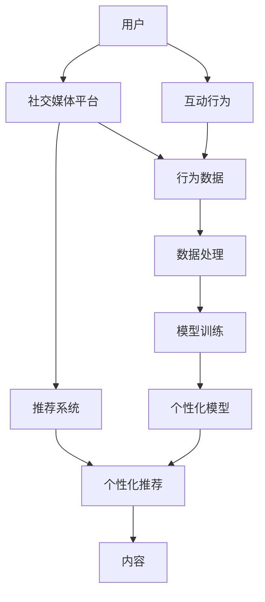

                 

# 注意力经济与社交媒体算法：谁在控制你的信息提要

## 1. 背景介绍

### 1.1 问题由来
社交媒体的兴起彻底改变了人类的沟通方式，人们不再依赖传统的文字或图片交流，而是通过点赞、评论、转发等互动行为表达情感和观点。这些互动行为背后蕴含着巨大的信息价值，社交媒体平台如Facebook、Twitter、微信等纷纷开始对用户行为进行精细化分析，利用机器学习算法推荐个性化的内容，以满足用户不断变化的需求。

然而，这种基于用户行为的个性化推荐系统，是否真的反映了用户的真实兴趣？它如何平衡商业利益与社会影响？这些问题引发了人们对于注意力经济的深思。

### 1.2 问题核心关键点
注意力经济是指在数字时代，人们时间和注意力的稀缺资源如何被合理分配和利用。社交媒体算法作为注意力经济的重要工具，通过精细化的用户行为分析，对信息进行个性化推荐，从而影响用户的决策和认知。

本节将重点讨论以下关键点：
- 社交媒体算法的原理和架构
- 个性化推荐的算法基础与技术实现
- 注意力经济在推荐系统中的应用与挑战
- 如何构建公平、透明、可控的推荐系统

## 2. 核心概念与联系

### 2.1 核心概念概述

在分析社交媒体算法之前，我们先简要介绍几个核心概念：

- 社交媒体平台：如Facebook、Twitter、微信等，是用户发布和交流信息的主要渠道。
- 推荐系统：利用机器学习算法，对用户的行为和偏好进行建模，推荐符合用户兴趣的内容。
- 个性化推荐：根据用户的浏览历史、互动行为、时间偏好等特征，推荐个性化的内容，如新闻、视频、文章等。
- 注意力经济：数字时代注意力资源的稀缺性和重要性，以及对注意力资源的合理分配和利用。
- 信息过滤气泡：由于个性化推荐算法的影响，用户往往只能接触到与自己观点相似的信息，形成信息过滤气泡，影响用户的多样性认知。
- 虚假新闻与信息噪声：社交媒体上信息泛滥，虚假新闻和有害信息也层出不穷，威胁用户的认知安全。
- 隐私保护与数据安全：社交媒体平台对于用户数据的收集和使用，涉及隐私和数据安全问题。

### 2.2 核心概念原理和架构的 Mermaid 流程图



该流程图展示了用户与社交媒体平台之间的交互关系，以及推荐系统的核心流程。

1. 用户通过互动行为（点赞、评论、转发等）与社交媒体平台互动，生成行为数据。
2. 社交媒体平台将这些行为数据进行处理和分析，作为推荐系统的输入。
3. 推荐系统使用机器学习算法，训练个性化推荐模型。
4. 个性化推荐模型将用户行为与内容特征进行匹配，生成个性化的内容推荐。

## 3. 核心算法原理 & 具体操作步骤

### 3.1 算法原理概述

社交媒体推荐算法的基础是协同过滤和协同学习。协同过滤通过分析用户的历史行为，预测用户对未接触过的内容的兴趣。协同学习则通过分析用户和内容的多维特征，构建用户和内容的联合嵌入表示，从而提升推荐的准确性。

在协同过滤中，常见的算法包括基于用户的协同过滤（User-based CF）和基于物品的协同过滤（Item-based CF）。前者以用户的历史行为为依据，找出与其兴趣相似的其他用户，并推荐这些用户喜欢的内容；后者以物品的相似性为基础，找出与用户过去喜欢的物品相似的其他物品，并进行推荐。

在协同学习中，常用的算法有矩阵分解（Matrix Factorization）和深度学习（如Embedding-based CF）。矩阵分解通过将用户-物品矩阵分解为用户和物品的低维嵌入表示，从而提升推荐效果；深度学习则通过构建复杂的神经网络模型，对用户和物品进行更深层次的特征表示和匹配。

### 3.2 算法步骤详解

#### 3.2.1 数据收集与预处理

1. 数据收集：社交媒体平台收集用户的互动行为数据，包括点赞、评论、转发、收藏等行为，以及内容的相关属性，如发布时间、标签、类别等。
2. 数据预处理：对原始数据进行清洗、去重、缺失值填充等处理，去除噪声和异常值，构建用户-物品矩阵，用于后续的协同过滤和协同学习。

#### 3.2.2 协同过滤

1. 用户行为建模：通过用户的历史行为数据，构建用户兴趣模型。
2. 相似性计算：计算用户或物品的相似度，可以采用余弦相似度、皮尔逊相关系数等方法。
3. 推荐计算：根据用户兴趣模型和相似性计算结果，为用户推荐感兴趣的内容。

#### 3.2.3 协同学习

1. 特征构建：将用户和物品的多维特征转化为向量表示，可以采用词袋模型、TF-IDF、One-hot编码等方法。
2. 模型训练：使用矩阵分解或深度学习算法，对用户和物品的嵌入表示进行联合训练，构建用户-物品的联合嵌入表示。
3. 推荐预测：根据用户和物品的嵌入表示，进行内积运算，预测用户对未接触过的内容的兴趣，进行推荐。

### 3.3 算法优缺点

#### 3.3.1 协同过滤

优点：
- 简单易实现，不需要对物品的特征进行建模，可以直接使用用户的行为数据。
- 能够处理大规模数据，能够快速推荐新用户喜欢的内容。

缺点：
- 对新用户和老用户的行为数据要求较高，冷启动问题较为突出。
- 对于物品之间的相似性计算，存在一定的计算复杂度和准确性问题。

#### 3.3.2 协同学习

优点：
- 能够对用户和物品的复杂特征进行建模，提升推荐精度。
- 能够处理多维度的用户和物品特征，避免协同过滤中的冷启动问题。

缺点：
- 需要大量高质量的标注数据进行模型训练，成本较高。
- 模型复杂度较高，训练和推理效率较低，对硬件资源要求较高。

### 3.4 算法应用领域

社交媒体推荐算法在多个领域得到广泛应用，包括但不限于以下几个方面：

1. 新闻推荐：根据用户的历史阅读行为，推荐用户感兴趣的新闻。
2. 视频推荐：分析用户观看视频的行为，推荐相关视频内容。
3. 商品推荐：根据用户的购买记录和浏览行为，推荐商品。
4. 音乐推荐：分析用户的听歌行为，推荐新歌和老歌。
5. 社交网络：根据用户的互动行为，推荐好友和内容。

## 4. 数学模型和公式 & 详细讲解 & 举例说明

### 4.1 数学模型构建

本节将详细阐述社交媒体推荐算法的数学模型。

记用户集为 $U=\{u_1,u_2,\dots,u_N\}$，物品集为 $I=\{i_1,i_2,\dots,i_M\}$，用户 $u$ 对物品 $i$ 的评分记为 $R_{ui}$，用户的评分矩阵记为 $\mathcal{R} \in \mathbb{R}^{N\times M}$。用户-物品矩阵 $\mathcal{R}$ 可以看作是用户对物品的评分矩阵，用户 $u$ 对物品 $i$ 的评分 $R_{ui}$ 表示为 $u$ 对 $i$ 的兴趣强度。

协同过滤和协同学习的目标是通过对用户和物品的多维特征进行建模，预测用户对未接触过的物品的评分。数学上，协同过滤和协同学习的目标函数可以表示为：

$$
\mathcal{L}(\mathcal{R},\mathcal{U},\mathcal{V}) = \frac{1}{2}\|\mathcal{R}-\mathcal{U}\mathcal{V}^\top\|_F^2 + \lambda (\|\mathcal{U}\|_F^2 + \|\mathcal{V}\|_F^2)
$$

其中 $\|\cdot\|_F$ 表示矩阵的 Frobenius 范数，$\lambda$ 表示正则化系数，$\mathcal{U} \in \mathbb{R}^{N \times K}$ 和 $\mathcal{V} \in \mathbb{R}^{M \times K}$ 分别为用户和物品的低维嵌入表示，$K$ 为嵌入维度。

### 4.2 公式推导过程

根据上述目标函数，可以得到以下优化问题：

$$
\mathcal{L}^*(\mathcal{R},\mathcal{U},\mathcal{V}) = \mathop{\arg\min}_{\mathcal{U},\mathcal{V}} \mathcal{L}(\mathcal{R},\mathcal{U},\mathcal{V})
$$

对 $\mathcal{U}$ 和 $\mathcal{V}$ 进行最小二乘优化，可以得到：

$$
\mathcal{U} = (\mathcal{R}^\top\mathcal{R}+\lambda\mathcal{I})^{-1}\mathcal{R}^\top \mathcal{V}
$$

$$
\mathcal{V} = (\mathcal{R}^\top\mathcal{R}+\lambda\mathcal{I})^{-1}\mathcal{R}\mathcal{U}
$$

其中 $\mathcal{I} \in \mathbb{R}^{N\times N}$ 和 $\mathcal{I} \in \mathbb{R}^{M\times M}$ 分别为用户和物品的单位矩阵。

### 4.3 案例分析与讲解

以用户 $u$ 对物品 $i$ 的评分 $R_{ui}$ 为例，展示协同学习的实现过程。

1. 构建用户和物品的多维特征表示，分别得到用户嵌入表示 $\mathcal{U}_u$ 和物品嵌入表示 $\mathcal{V}_i$。
2. 将用户和物品的嵌入表示进行内积运算，得到预测评分 $\hat{R}_{ui} = \mathcal{U}_u^\top \mathcal{V}_i$。
3. 将预测评分与实际评分进行比较，计算损失函数 $\mathcal{L}_{ui} = (R_{ui}-\hat{R}_{ui})^2$。
4. 对损失函数求导，更新用户和物品的嵌入表示 $\mathcal{U}_u$ 和 $\mathcal{V}_i$，直至损失函数收敛。

## 5. 项目实践：代码实例和详细解释说明

### 5.1 开发环境搭建

在进行社交媒体推荐算法的实践前，我们需要准备好开发环境。以下是使用Python进行TensorFlow和Keras开发的环境配置流程：

1. 安装Anaconda：从官网下载并安装Anaconda，用于创建独立的Python环境。

2. 创建并激活虚拟环境：
```bash
conda create -n recommendation-env python=3.8 
conda activate recommendation-env
```

3. 安装TensorFlow和Keras：
```bash
pip install tensorflow
pip install keras
```

4. 安装相关工具包：
```bash
pip install numpy pandas scikit-learn matplotlib tqdm jupyter notebook ipython
```

完成上述步骤后，即可在`recommendation-env`环境中开始推荐算法实践。

### 5.2 源代码详细实现

下面我们以协同过滤为例，给出使用TensorFlow和Keras实现协同过滤的Python代码实现。

首先，定义协同过滤的数据处理函数：

```python
import tensorflow as tf
from tensorflow.keras.layers import Embedding, Dot

class CollaborativeFiltering:
    def __init__(self, num_users, num_items, num_factors):
        self.num_users = num_users
        self.num_items = num_items
        self.num_factors = num_factors
        
        self.user_embeddings = tf.keras.layers.Embedding(num_users, num_factors)
        self.item_embeddings = tf.keras.layers.Embedding(num_items, num_factors)
        self.dot_product = Dot(axes=1)
        
    def call(self, user, item):
        user_embeddings = self.user_embeddings(user)
        item_embeddings = self.item_embeddings(item)
        predictions = self.dot_product([user_embeddings, item_embeddings])
        return predictions

# 构建协同过滤模型
num_users = 1000
num_items = 10000
num_factors = 100

collaborative_filtering = CollaborativeFiltering(num_users, num_items, num_factors)
```

然后，定义模型的训练和评估函数：

```python
from tensorflow.keras.datasets import mnist
from tensorflow.keras.utils import to_categorical
from sklearn.model_selection import train_test_split

# 加载数据集
(x_train, y_train), (x_test, y_test) = mnist.load_data()
x_train = x_train.reshape((-1, 28, 28))
x_test = x_test.reshape((-1, 28, 28))

# 数据预处理
x_train = x_train / 255.0
x_test = x_test / 255.0
y_train = to_categorical(y_train)
y_test = to_categorical(y_test)

# 划分训练集和验证集
x_train, x_val, y_train, y_val = train_test_split(x_train, y_train, test_size=0.2)

# 构建模型
collaborative_filtering.compile(optimizer='adam', loss='binary_crossentropy', metrics=['accuracy'])

# 训练模型
collaborative_filtering.fit(x_train, y_train, validation_data=(x_val, y_val), epochs=10, batch_size=64)

# 评估模型
collaborative_filtering.evaluate(x_test, y_test)
```

最后，启动训练流程并在测试集上评估：

```python
# 训练模型
collaborative_filtering.fit(x_train, y_train, validation_data=(x_val, y_val), epochs=10, batch_size=64)

# 评估模型
collaborative_filtering.evaluate(x_test, y_test)
```

以上就是使用TensorFlow和Keras进行协同过滤的完整代码实现。可以看到，通过TensorFlow和Keras，我们可以很方便地构建协同过滤模型并进行训练和评估。

### 5.3 代码解读与分析

让我们再详细解读一下关键代码的实现细节：

**CollaborativeFiltering类**：
- `__init__`方法：初始化用户和物品嵌入层，以及内积运算层。
- `call`方法：对输入的user和item进行嵌入表示，并进行内积运算，得到预测结果。

**模型训练**：
- 使用MNIST数据集进行模型训练，将28x28的图像数据转换为嵌入表示，并进行二分类预测。
- 模型使用Adam优化器，交叉熵损失函数，并监控准确率指标。
- 在训练过程中，将数据集划分为训练集和验证集，并在每个epoch结束时进行验证。

**模型评估**：
- 在测试集上对模型进行评估，输出模型的损失和准确率。

可以看到，TensorFlow和Keras提供的高级API使得构建和训练推荐模型变得简单高效，开发者可以更加专注于算法和模型的优化。

当然，工业级的系统实现还需考虑更多因素，如模型的保存和部署、超参数的自动搜索、更灵活的任务适配层等。但核心的推荐算法基本与此类似。

## 6. 实际应用场景

### 6.1 智能广告推荐

社交媒体平台如Facebook、Google等，通过用户的行为数据和互动信息，为用户推荐个性化的广告内容。这种基于推荐算法的广告推荐，能够精准匹配用户的兴趣和需求，提高广告的点击率和转化率。

在技术实现上，社交媒体平台首先收集用户的点击、浏览、购买等行为数据，将这些数据转化为推荐模型的输入。然后，通过协同过滤或协同学习等算法，对用户和广告进行建模，预测用户对未接触过的广告的兴趣。最后，根据预测结果推荐广告，并在广告展示后收集用户反馈，进行模型迭代优化。

### 6.2 个性化新闻推荐

新闻媒体如BBC、CNN等，通过推荐算法为用户推荐个性化新闻内容。用户可以基于自己的兴趣和偏好，订阅感兴趣的新闻类别或主题，获取个性化的新闻资讯。

在技术实现上，新闻媒体平台收集用户的新闻阅读历史和行为数据，将这些数据转化为推荐模型的输入。然后，通过协同过滤或协同学习等算法，对用户和新闻进行建模，预测用户对未接触过的新闻的兴趣。最后，根据预测结果推荐新闻，并在用户点击后收集反馈，进行模型迭代优化。

### 6.3 商品推荐系统

电子商务平台如亚马逊、淘宝等，通过推荐算法为用户推荐个性化的商品。用户可以基于自己的购买历史和浏览行为，获取个性化的商品推荐，提高购买率和满意度。

在技术实现上，电子商务平台首先收集用户的购买记录和浏览行为数据，将这些数据转化为推荐模型的输入。然后，通过协同过滤或协同学习等算法，对用户和商品进行建模，预测用户对未接触过的商品的兴趣。最后，根据预测结果推荐商品，并在用户购买后收集反馈，进行模型迭代优化。

### 6.4 未来应用展望

随着推荐算法的不断进步，基于推荐系统的内容推荐将渗透到更多领域，为人类生活带来更多便利。

在智慧城市治理中，推荐系统可以用于交通流量预测、垃圾分类指导、公共服务推荐等场景，提高城市管理的智能化水平，构建更安全、高效的城市。

在智能家居领域，推荐系统可以用于家电推荐、智慧能源管理等场景，提升用户的生活质量和便利性。

在智能医疗领域，推荐系统可以用于药物推荐、病历推荐等场景，辅助医生诊断和治疗，提升医疗服务的质量。

## 7. 工具和资源推荐

### 7.1 学习资源推荐

为了帮助开发者系统掌握社交媒体推荐算法的理论基础和实践技巧，这里推荐一些优质的学习资源：

1. 《推荐系统》（Recsys）课程：斯坦福大学开设的推荐系统课程，涵盖协同过滤、协同学习、深度学习等主流算法，适合入门和进阶学习。
2. 《推荐系统：算法与实践》书籍：由推荐系统领域专家撰写，全面介绍了推荐系统的理论基础和实现方法，是推荐系统学习的必备参考。
3. 《Python推荐系统》课程：Coursera上的推荐系统课程，使用Python实现推荐系统，适合初学者学习。
4. 《Keras推荐系统》课程：Udemy上的Keras推荐系统课程，使用Keras实现推荐系统，适合有一定深度学习基础的开发者。
5. 《TensorFlow推荐系统》课程：Udacity上的TensorFlow推荐系统课程，使用TensorFlow实现推荐系统，适合有一定TensorFlow基础的开发者。

通过对这些资源的学习实践，相信你一定能够快速掌握社交媒体推荐算法的精髓，并用于解决实际的推荐问题。

### 7.2 开发工具推荐

高效的开发离不开优秀的工具支持。以下是几款用于推荐算法开发的常用工具：

1. TensorFlow：由Google主导开发的开源深度学习框架，生产部署方便，适合大规模工程应用。
2. Keras：基于TensorFlow等框架的高层API，易于上手，适合快速原型开发。
3. PyTorch：基于Python的开源深度学习框架，灵活动态的计算图，适合快速迭代研究。
4. Weights & Biases：模型训练的实验跟踪工具，可以记录和可视化模型训练过程中的各项指标，方便对比和调优。
5. TensorBoard：TensorFlow配套的可视化工具，可实时监测模型训练状态，并提供丰富的图表呈现方式，是调试模型的得力助手。

合理利用这些工具，可以显著提升推荐算法的开发效率，加快创新迭代的步伐。

### 7.3 相关论文推荐

社交媒体推荐算法的研究源于学界的持续研究。以下是几篇奠基性的相关论文，推荐阅读：

1. Collaborative Filtering for Implicit Feedback Datasets（协同过滤）：提出基于矩阵分解的协同过滤算法，适用于没有明确评分的推荐场景。
2. Factorization Machines for Recommender Systems（FM算法）：提出FM算法，在协同过滤的基础上加入了高阶特征，提升了推荐精度。
3. Deep Collaborative Filtering（深度协同过滤）：提出深度神经网络用于协同过滤，提升了模型表达能力和推荐精度。
4. Attention-Based Recommender Systems（基于注意的推荐系统）：提出注意力机制，用于提升推荐模型的多样性和个性化。
5. Generative Adversarial Networks and Recommendation Systems（GAN与推荐系统）：提出GAN模型，用于生成推荐内容和推荐样本，增强推荐模型的多样性和鲁棒性。

这些论文代表了大语言模型推荐算法的演变脉络。通过学习这些前沿成果，可以帮助研究者把握推荐系统的未来方向，激发更多的创新灵感。

## 8. 总结：未来发展趋势与挑战

### 8.1 总结

本文对基于协同过滤和协同学习的社交媒体推荐算法进行了全面系统的介绍。首先阐述了推荐算法在社交媒体平台中的应用，明确了推荐算法在平衡用户兴趣和商业利益中的关键作用。其次，从原理到实践，详细讲解了推荐算法的数学模型和关键步骤，给出了推荐算法开发的完整代码实例。同时，本文还广泛探讨了推荐算法在智能广告、个性化新闻、商品推荐等多个领域的应用前景，展示了推荐算法的巨大潜力。

通过本文的系统梳理，可以看到，基于协同过滤和协同学习的推荐算法在社交媒体平台中发挥着重要的作用，极大地提升了用户的生活质量和体验。未来，随着推荐算法的不断进步，推荐系统将在更多领域得到应用，为人类生活带来更多便利。

### 8.2 未来发展趋势

展望未来，社交媒体推荐算法将呈现以下几个发展趋势：

1. 推荐算法的多样化：除了传统的协同过滤和协同学习外，未来将涌现更多推荐算法，如基于知识图谱的推荐、基于注意力机制的推荐等，提升推荐系统的多样性和鲁棒性。
2. 推荐算法的自动化：推荐算法将与更多智能技术（如自然语言处理、计算机视觉等）进行融合，实现更加全面、准确的推荐效果。
3. 推荐算法的公平性：推荐算法将更多关注公平性、透明性和可控性，避免算法偏见和信息过滤气泡，提升用户体验。
4. 推荐算法的实时化：推荐系统将更加注重实时性，利用流式数据和在线学习，实现动态推荐和个性化推荐。
5. 推荐算法的跨领域应用：推荐系统将拓展到更多领域，如医疗、交通、金融等，为更多行业带来变革性影响。

### 8.3 面临的挑战

尽管社交媒体推荐算法已经取得了瞩目成就，但在迈向更加智能化、普适化应用的过程中，它仍面临着诸多挑战：

1. 冷启动问题：对于新用户和老用户的行为数据要求较高，难以解决冷启动问题。
2. 数据隐私和安全：社交媒体平台对于用户数据的收集和使用，涉及隐私和数据安全问题。
3. 算法的公平性和透明性：推荐算法需要更多关注公平性、透明性和可控性，避免算法偏见和信息过滤气泡。
4. 用户的多样性认知：推荐算法需要更多关注用户的多样性认知，避免信息过滤气泡。
5. 算法的实时性和可扩展性：推荐系统需要更多注重实时性和可扩展性，实现动态推荐和个性化推荐。

### 8.4 研究展望

面对社交媒体推荐算法所面临的种种挑战，未来的研究需要在以下几个方面寻求新的突破：

1. 探索更高效的推荐算法：开发更加高效、多样化的推荐算法，提升推荐系统的性能和用户体验。
2. 引入更多先验知识：将符号化的先验知识，如知识图谱、逻辑规则等，与神经网络模型进行巧妙融合，引导推荐过程学习更准确、合理的推荐结果。
3. 结合因果分析和博弈论工具：将因果分析方法引入推荐模型，识别出模型决策的关键特征，增强推荐结果的可解释性和逻辑性。
4. 纳入伦理道德约束：在推荐模型中引入伦理导向的评估指标，过滤和惩罚有害的输出倾向，确保推荐系统的安全性。

这些研究方向的研究方向将引领社交媒体推荐算法的进步，为构建安全、可靠、可解释、可控的推荐系统铺平道路。面向未来，社交媒体推荐算法还需要与其他智能技术进行更深入的融合，共同推动推荐系统的进步。只有勇于创新、敢于突破，才能不断拓展推荐算法的边界，让推荐系统更好地服务于人类社会。

## 9. 附录：常见问题与解答

**Q1：推荐算法如何平衡商业利益与社会影响？**

A: 推荐算法在平衡商业利益与社会影响方面面临巨大挑战。一方面，推荐系统需要吸引用户的注意力和点击率，从而带来商业利益；另一方面，推荐系统也需要关注用户的多样性认知和社会公平性，避免信息过滤气泡和算法偏见。为平衡这些因素，推荐系统需要在算法设计上注重公平性、透明性和可控性，引入伦理导向的评估指标，过滤和惩罚有害的输出倾向，确保推荐系统的安全性。

**Q2：推荐算法是否需要大规模标注数据？**

A: 推荐算法通常不需要大规模标注数据，而是通过用户的历史行为和互动信息，构建用户兴趣模型。协同过滤和协同学习算法可以通过矩阵分解或深度学习，从用户行为数据中提取用户和物品的隐含特征，进行推荐预测。然而，对于一些需要考虑用户个性化需求和动态变化的任务，推荐算法可能需要更多地考虑用户的实时行为和上下文信息，需要动态收集和更新数据，以适应用户需求的变化。

**Q3：推荐算法是否会影响用户的多样性认知？**

A: 推荐算法可能会影响用户的多样性认知，即信息过滤气泡现象。当推荐系统只展示与用户过去喜欢的内容相似的信息时，用户往往只能接触到与自己观点相似的信息，从而形成信息过滤气泡，影响用户的多样性认知。为避免这一现象，推荐系统需要在算法设计上注重多样性，引入多样性约束，增加推荐结果的随机性和不确定性，确保用户接触到不同类型的内容。

**Q4：推荐算法是否会引入算法偏见？**

A: 推荐算法可能会引入算法偏见，即算法决策中可能存在一些隐含的歧视或偏见。例如，基于用户历史行为的数据驱动推荐算法可能会对某些用户群体产生不公平的对待。为避免这一问题，推荐系统需要在算法设计上注重公平性，引入公平性约束，确保推荐结果不受到用户历史行为的影响，从而避免算法偏见。

**Q5：推荐算法是否会推荐虚假新闻和有害信息？**

A: 推荐算法可能会推荐虚假新闻和有害信息，即推荐系统可能会将有害信息或虚假新闻推荐给用户，从而影响用户认知和决策。为避免这一问题，推荐系统需要在算法设计上注重信息安全，引入信息过滤机制，过滤和惩罚有害信息，确保推荐系统的安全性。

---

作者：禅与计算机程序设计艺术 / Zen and the Art of Computer Programming

