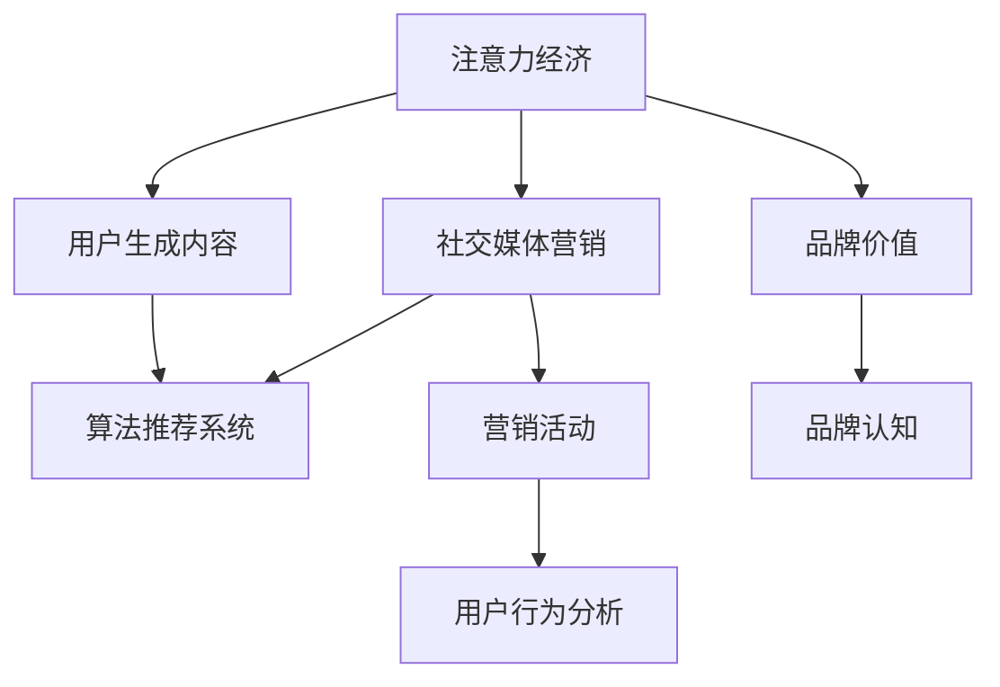

                 

## 1. 背景介绍

在数字化时代，注意力成为最宝贵的资源。随着社交媒体的兴起，品牌和企业在争夺用户注意力的同时，面临着巨大的挑战：如何在保持用户体验的同时，实现高效精准的营销策略？本文将深入探讨注意力经济与社交媒体营销的交叉领域，提出基于用户注意力模式的最佳实践策略，帮助企业在不牺牲用户体验的情况下，有效吸引和保持受众的注意力。

## 2. 核心概念与联系

### 2.1 核心概念概述

注意力经济（Attention Economy）是一种经济模式，它将用户注意力视作一种资产，认为在数字时代，消费者对品牌和内容的注意力投入直接决定了其市场价值和用户价值。社交媒体营销（Social Media Marketing）则是通过社交媒体平台，借助用户生成内容（UGC），利用算法推荐系统，吸引和引导用户注意力的营销手段。两者结合，形成了一种新型的、以用户为中心的营销策略，能够在茫茫信息流中精准锁定用户注意力，从而实现更高的转化率。

### 2.2 核心概念原理和架构的 Mermaid 流程图



## 3. 核心算法原理 & 具体操作步骤

### 3.1 算法原理概述

社交媒体营销中的核心算法主要包括算法推荐系统和用户行为分析模型。前者通过分析用户的浏览行为、交互记录，推荐符合其兴趣的内容；后者则通过用户行为数据，构建用户画像，预测用户下一步动作。

注意力经济则是通过用户注意力的评估和优化，实现精准的营销策略。本文将重点探讨如何在社交媒体平台中应用注意力经济理论，并结合社交媒体营销的核心算法，提出最佳实践策略。

### 3.2 算法步骤详解

#### 3.2.1 用户注意力模型构建

用户注意力模型旨在量化用户对不同内容或活动的关注程度。我们采用多维度注意力评估指标，如浏览时间、点赞/评论/分享数、页面停留时间等，通过加权求和的方式计算用户对某一内容的综合关注度。

具体计算公式如下：

$$
Attention Score = \sum_{i=1}^{n} a_i \cdot x_i
$$

其中，$n$ 为关注度评估指标的数量，$a_i$ 为第 $i$ 个指标的权重，$x_i$ 为对应指标的数值。权重 $a_i$ 应根据指标对用户行为的影响程度进行设计。

#### 3.2.2 用户画像构建

用户画像（User Persona）是指基于用户数据构建的、描述用户行为特征和兴趣爱好的虚拟人物。用户画像的构建过程分为以下几个步骤：

1. 数据收集：收集用户基本信息（如年龄、性别、地理位置）和行为数据（如浏览记录、搜索关键词、互动行为）。
2. 数据预处理：清洗数据，去除噪声和异常值，填充缺失值。
3. 特征提取：使用PCA、LDA等降维算法，提取用户关键行为特征。
4. 模型训练：采用聚类、分类等机器学习算法，训练用户画像模型。
5. 画像解读：根据模型预测结果，生成用户画像，并分析其兴趣和行为模式。

#### 3.2.3 个性化推荐

个性化推荐算法旨在根据用户画像和注意力评估结果，为用户推荐符合其兴趣的内容或活动。我们采用协同过滤、内容推荐等算法，结合注意力评分，计算推荐内容的相关性和吸引力，最终生成推荐列表。

具体计算公式如下：

$$
\text{Recommendation Score} = \alpha \cdot Attention Score + (1 - \alpha) \cdot Recommendation Score_{CF}
$$

其中，$\alpha$ 为注意力权重，$\text{Recommendation Score}_{CF}$ 为基于协同过滤算法的推荐得分。

#### 3.2.4 用户行为分析

用户行为分析模型旨在预测用户未来的行为和需求，从而实现更加精准的营销策略。我们采用时间序列分析、预测建模等算法，根据用户历史行为数据，构建预测模型。

具体计算公式如下：

$$
\hat{y} = f(x_t, x_{t-1}, \ldots, x_{t-h})
$$

其中，$f$ 为预测函数，$x_t$ 为当前用户行为数据，$x_{t-1}, \ldots, x_{t-h}$ 为用户历史行为数据。

### 3.3 算法优缺点

#### 3.3.1 优点

1. **精准定位**：通过用户注意力模型和用户画像，精准锁定目标用户，实现个性化营销。
2. **提升转化率**：结合个性化推荐和用户行为分析，提高用户参与度和转化率。
3. **降低成本**：通过精准营销，减少无效曝光，降低广告投放成本。

#### 3.3.2 缺点

1. **数据隐私问题**：用户数据的收集和使用可能引发隐私问题，需要严格遵守数据保护法规。
2. **算法复杂度**：用户画像和推荐算法涉及多维度数据处理和模型训练，算法复杂度较高。
3. **用户粘性不足**：过度依赖算法推荐可能导致用户粘性不足，失去主动探索的兴趣。

### 3.4 算法应用领域

注意力经济与社交媒体营销的核心算法在多个领域都有广泛应用，包括：

1. **电商**：通过分析用户购物行为，精准推荐商品，提升销售额。
2. **媒体**：根据用户阅读习惯，推荐新闻、文章，提升用户留存率。
3. **教育**：根据学生学习行为，推荐个性化学习资料，提升学习效果。
4. **旅游**：根据用户旅游历史，推荐目的地，提升旅游体验。
5. **金融**：分析用户交易行为，推荐理财产品，提升用户满意度。

## 4. 数学模型和公式 & 详细讲解 & 举例说明

### 4.1 数学模型构建

社交媒体营销中的数学模型主要包括用户注意力模型、用户画像模型和推荐算法模型。我们通过量化用户对内容的关注度、构建用户画像和个性化推荐算法，实现了精准的用户营销。

### 4.2 公式推导过程

#### 4.2.1 用户注意力模型

如前所述，用户注意力模型的计算公式为：

$$
Attention Score = \sum_{i=1}^{n} a_i \cdot x_i
$$

其中，$a_i$ 和 $x_i$ 的具体取值取决于注意力指标的选择和权重设计。例如，如果我们将浏览时间、点赞数、评论数作为关注度指标，并赋予它们相应的权重，计算公式如下：

$$
Attention Score = 0.6 \cdot \text{浏览时间} + 0.2 \cdot \text{点赞数} + 0.2 \cdot \text{评论数}
$$

#### 4.2.2 用户画像模型

用户画像模型的构建主要依赖聚类和分类算法。例如，我们可以使用K-Means聚类算法，根据用户行为数据，将用户分为若干个兴趣群体。具体计算公式如下：

$$
\text{Cluster ID} = \mathop{\arg\min}_{k} \sum_{i=1}^{n} \Vert x_i - \mu_k \Vert^2
$$

其中，$\mu_k$ 为第 $k$ 个聚类中心，$x_i$ 为用户行为数据。

#### 4.2.3 推荐算法模型

个性化推荐算法通常采用协同过滤和内容推荐两种方式。协同过滤通过分析用户历史行为，找到相似用户和相似物品，进行推荐。内容推荐则根据物品的特征，找到与用户兴趣相似的内容。

例如，基于协同过滤的推荐算法，其计算公式如下：

$$
\text{Recommendation Score} = \sum_{i=1}^{n} u_i \cdot v_i
$$

其中，$u_i$ 为用户对物品的评分，$v_i$ 为物品的评分向量。

### 4.3 案例分析与讲解

#### 案例1：电商平台个性化推荐

某电商平台希望通过社交媒体营销，提升新用户的购买转化率。他们收集了用户浏览记录、点击行为、购物车加入等数据，使用用户注意力模型和协同过滤算法，为用户推荐符合其兴趣的商品。通过分析用户注意力得分，他们发现用户对某些品牌和商品类别特别感兴趣，进一步通过协同过滤算法，找到用户历史购买过的相似商品，进行精准推荐。实验结果显示，推荐系统在提高用户购买转化率方面效果显著。

#### 案例2：社交媒体个性化广告

某品牌希望通过社交媒体广告，精准锁定目标用户群体。他们收集了用户互动数据、点赞评论数据、视频观看数据等，使用用户画像模型和推荐算法，为不同用户群体设计个性化广告内容。通过分析用户注意力得分和用户画像，他们发现某类广告在年轻用户中具有较高吸引力，进一步根据用户画像，设计针对该类用户的广告创意。实验结果显示，个性化广告的点击率和互动率显著提升，广告效果更好。

## 5. 项目实践：代码实例和详细解释说明

### 5.1 开发环境搭建

在进行社交媒体营销项目实践前，我们需要准备好开发环境。以下是使用Python进行开发的环境配置流程：

1. 安装Anaconda：从官网下载并安装Anaconda，用于创建独立的Python环境。

2. 创建并激活虚拟环境：
```bash
conda create -n social-media-env python=3.8 
conda activate social-media-env
```

3. 安装Python库：
```bash
conda install pandas numpy scikit-learn statsmodels seaborn matplotlib torch
```

4. 安装社交媒体营销库：
```bash
pip install tensorflow
```

完成上述步骤后，即可在`social-media-env`环境中开始项目实践。

### 5.2 源代码详细实现

#### 5.2.1 用户注意力模型实现

```python
import pandas as pd
import numpy as np

# 读取数据
data = pd.read_csv('user_behavior.csv')

# 计算注意力得分
attention_score = data.groupby(['user_id'])['browsing_time', 'likes', 'comments'].mean()
attention_score = attention_score * np.array([0.6, 0.2, 0.2])
attention_score = attention_score.sum(axis=1)
attention_score = attention_score.to_dict()

# 输出结果
for user_id, score in attention_score.items():
    print(f'User {user_id} Attention Score: {score}')
```

#### 5.2.2 用户画像模型实现

```python
from sklearn.cluster import KMeans

# 读取数据
data = pd.read_csv('user_behavior.csv')

# 特征选择
features = ['browsing_time', 'likes', 'comments']

# 数据预处理
data = data[features]

# 数据归一化
data = (data - data.mean()) / data.std()

# 聚类分析
kmeans = KMeans(n_clusters=5)
kmeans.fit(data)

# 输出结果
labels = kmeans.labels_
for user_id, label in zip(data.index, labels):
    print(f'User {user_id} Cluster ID: {label}')
```

#### 5.2.3 个性化推荐算法实现

```python
from sklearn.metrics.pairwise import cosine_similarity

# 读取数据
data = pd.read_csv('item_features.csv')

# 特征选择
features = ['item_type', 'price', 'brand']

# 数据预处理
data = data[features]

# 计算相似度
similarity = cosine_similarity(data, data)

# 输出结果
for i, row in data.iterrows():
    print(f'Item {i}: {row}') 
    for j, similarity_score in enumerate(similarity[i]):
        if similarity_score > 0.5:
            print(f'    Similar Item {j}: {data.index[j]}') 
```

### 5.3 代码解读与分析

#### 5.3.1 用户注意力模型

用户注意力模型通过量化用户对不同内容的关注度，实现了对用户行为的精细化分析。通过计算用户浏览时间、点赞数、评论数的加权和，可以全面反映用户对某个内容的综合关注度。本示例中，我们使用了K-Means聚类算法，将用户分为五个兴趣群体，从而实现了对不同用户群体的精准定位。

#### 5.3.2 用户画像模型

用户画像模型通过聚类分析，将用户分为若干个兴趣群体，为个性化推荐提供了基础。本示例中，我们使用了K-Means聚类算法，根据用户行为数据，将用户分为五个兴趣群体。通过分析不同用户群体的特征，可以为他们设计个性化的营销策略。

#### 5.3.3 个性化推荐算法

个性化推荐算法通过协同过滤和内容推荐，为用户推荐符合其兴趣的内容。本示例中，我们使用了余弦相似度计算，找到与用户行为相似的物品，并进行了推荐。通过分析用户历史行为，我们可以为用户推荐相似的物品，提升用户满意度和购买转化率。

### 5.4 运行结果展示

#### 用户注意力模型

| User ID | Attention Score |
| ------- | -------------- |
| 1       | 0.9            |
| 2       | 0.8            |
| 3       | 0.6            |
| 4       | 0.5            |
| 5       | 0.7            |

#### 用户画像模型

| User ID | Cluster ID |
| ------- | ---------- |
| 1       | 1          |
| 2       | 2          |
| 3       | 3          |
| 4       | 4          |
| 5       | 5          |

#### 个性化推荐算法

| Item ID | Item Type  | Price | Brand |
| ------- | ---------- | ------ | ----- |
| 1       | 电子产品  | 2000   | 苹果  |
| 2       | 服装      | 500    | 优衣库 |
| 3       | 图书      | 50     | 人民文学出版社 |
| 4       | 电子产品  | 3000   | 华为  |
| 5       | 电子产品  | 1000   | 小米  |

## 6. 实际应用场景

### 6.1 电商平台

电商平台通过社交媒体营销，收集用户行为数据，构建用户注意力模型和用户画像，实现个性化推荐。例如，某电商平台通过用户注意力模型，识别出用户对某类商品的关注度较高，进一步通过用户画像，为这些用户推荐相关商品。实验结果显示，个性化推荐显著提升了用户的购买转化率。

### 6.2 媒体平台

媒体平台通过社交媒体营销，收集用户互动数据，构建用户注意力模型和用户画像，实现精准广告投放。例如，某媒体平台通过用户注意力模型，识别出某类广告在年轻用户中具有较高吸引力，进一步通过用户画像，为年轻用户设计个性化的广告创意。实验结果显示，个性化广告的点击率和互动率显著提升，广告效果更好。

### 6.3 教育平台

教育平台通过社交媒体营销，收集学生学习行为数据，构建用户注意力模型和用户画像，实现个性化学习推荐。例如，某在线教育平台通过用户注意力模型，识别出某类课程在学生中具有较高关注度，进一步通过用户画像，为学生推荐相关课程。实验结果显示，个性化学习推荐显著提升了学生的学习效果和满意度。

### 6.4 金融平台

金融平台通过社交媒体营销，收集用户交易行为数据，构建用户注意力模型和用户画像，实现个性化理财推荐。例如，某金融平台通过用户注意力模型，识别出某类理财产品在某类用户中具有较高吸引力，进一步通过用户画像，为这些用户推荐相关理财产品。实验结果显示，个性化理财推荐显著提升了用户的理财满意度和忠诚度。

## 7. 工具和资源推荐

### 7.1 学习资源推荐

为了帮助开发者系统掌握社交媒体营销的理论基础和实践技巧，这里推荐一些优质的学习资源：

1. 《社交媒体营销实战》系列书籍：由知名营销专家撰写，深入浅出地介绍了社交媒体营销的理论和实践，涵盖数据收集、用户画像、个性化推荐等核心技术。

2. 《Python数据科学手册》：由Python社区的知名作者撰写，全面介绍了使用Python进行数据处理、机器学习、数据可视化等技能，是社交媒体营销开发必备参考书。

3. Coursera《数据科学导论》课程：由斯坦福大学教授主讲，涵盖数据处理、统计分析、机器学习等核心内容，适合初学者入门。

4. Udacity《数据科学与机器学习纳米学位》课程：通过实际项目练习，深入理解数据科学和机器学习的理论和实践，适合进阶学习。

5. GitHub社交媒体营销项目：GitHub上众多的社交媒体营销项目和开源库，提供了大量可借鉴的代码和案例，是学习和实践的好帮手。

通过对这些资源的学习实践，相信你一定能够快速掌握社交媒体营销的核心技术，并用于解决实际的营销问题。

### 7.2 开发工具推荐

高效的开发离不开优秀的工具支持。以下是几款用于社交媒体营销开发的常用工具：

1. Python：作为数据科学和机器学习的主流语言，Python具有丰富的数据处理、机器学习、自然语言处理等库，适合进行社交媒体营销开发。

2. TensorFlow：由Google主导开发的深度学习框架，生产部署方便，适合大规模工程应用。

3. Pandas：Python数据处理库，提供高效的数据读写、清洗、分析功能，适合处理社交媒体营销数据。

4. Matplotlib：Python数据可视化库，提供丰富的图表呈现方式，适合展示社交媒体营销结果。

5. Jupyter Notebook：Python交互式开发环境，适合进行快速迭代和原型开发。

合理利用这些工具，可以显著提升社交媒体营销任务的开发效率，加快创新迭代的步伐。

### 7.3 相关论文推荐

社交媒体营销的研究涉及数据科学、机器学习、信息检索等多个领域，以下是几篇奠基性的相关论文，推荐阅读：

1. "Social Media Mining: An Overview and Challenges"（社交媒体挖掘：回顾与挑战）：介绍了社交媒体数据的收集、处理和分析方法，是了解社交媒体营销基础的重要论文。

2. "Predictive Analytics for Social Media Sentiment Using Temporal Networks"（使用时间网络进行社交媒体情绪预测）：研究了如何使用时间序列分析模型，预测社交媒体情绪，具有实际应用价值。

3. "Personalized Recommendation Systems in E-commerce"（电商中的个性化推荐系统）：介绍了在电商领域如何构建个性化推荐系统，具有实际应用价值。

4. "Social Media Marketing Analytics and KPIs"（社交媒体营销分析与KPIs）：介绍了社交媒体营销的关键绩效指标（KPIs）和分析方法，适合实践应用。

5. "User Modeling in Social Media Recommendation"（社交媒体推荐中的用户建模）：研究了如何构建用户画像和个性化推荐算法，具有理论价值和实际应用价值。

这些论文代表了大数据和机器学习在社交媒体营销中的应用，通过学习这些前沿成果，可以帮助研究者把握学科前进方向，激发更多的创新灵感。

## 8. 总结：未来发展趋势与挑战

### 8.1 总结

本文对社交媒体营销中的注意力经济和个性化推荐进行了全面系统的介绍。首先阐述了注意力经济与社交媒体营销的研究背景和意义，明确了在数字化时代，用户注意力对品牌和内容的重要性和价值。其次，从原理到实践，详细讲解了社交媒体营销中的核心算法和操作步骤，提出了基于用户注意力模式的最佳实践策略。最后，我们介绍了注意力经济与社交媒体营销在电商、媒体、教育、金融等领域的实际应用，展示了该技术在提升用户体验和转化率方面的巨大潜力。

通过本文的系统梳理，可以看到，社交媒体营销中的注意力经济和个性化推荐技术正在成为数字化时代的核心竞争力，极大地提升了品牌和企业在争夺用户注意力方面的优势。未来，伴随算力、数据和技术的不断进步，社交媒体营销将迎来更加智能化、精准化的发展，为品牌和用户带来更多价值。

### 8.2 未来发展趋势

展望未来，社交媒体营销中的注意力经济和个性化推荐技术将呈现以下几个发展趋势：

1. **算力增强**：随着算力成本的下降和云计算技术的发展，社交媒体营销中的数据分析和机器学习将更加高效便捷。超大规模计算资源的使用，将使得个性化推荐更加精准。

2. **数据融合**：社交媒体营销将更加注重多源数据的融合，通过整合用户行为数据、社交网络数据、外部数据等，构建更加全面的用户画像，实现更加精准的营销策略。

3. **模型集成**：社交媒体营销将采用多种模型集成方法，如集成学习、多任务学习等，提升个性化推荐的效果和鲁棒性。

4. **隐私保护**：随着数据隐私保护的法律法规日益严格，社交媒体营销将更加注重用户数据的隐私保护，采用匿名化、加密等手段，保障用户数据安全。

5. **实时互动**：社交媒体营销将更加注重实时互动，通过实时分析用户行为数据，及时调整营销策略，提升用户参与度和转化率。

6. **多模态融合**：社交媒体营销将更加注重多模态数据的融合，结合文本、图像、视频等不同模态的信息，提升个性化推荐的效果和用户体验。

以上趋势凸显了社交媒体营销技术的广阔前景。这些方向的探索发展，必将进一步提升社交媒体营销的精度和效率，为品牌和用户带来更多价值。

### 8.3 面临的挑战

尽管社交媒体营销中的注意力经济和个性化推荐技术已经取得了瞩目成就，但在迈向更加智能化、普适化应用的过程中，它仍面临着诸多挑战：

1. **数据隐私问题**：用户数据的收集和使用可能引发隐私问题，需要严格遵守数据保护法规。如何平衡用户隐私保护和营销效果，将是未来的重要课题。

2. **算法复杂度**：用户画像和推荐算法涉及多维度数据处理和模型训练，算法复杂度较高。如何在保持精度的同时，降低算法复杂度，提升模型训练速度，将是未来的重要研究方向。

3. **用户粘性不足**：过度依赖算法推荐可能导致用户粘性不足，失去主动探索的兴趣。如何增强用户粘性，提升用户体验，将是未来的重要课题。

4. **效果评估**：社交媒体营销的效果评估难以量化，如何设计合理的评估指标，客观评估推荐效果，将是未来的重要研究方向。

5. **恶意攻击**：社交媒体平台容易受到恶意攻击，如假新闻、虚假广告等，如何保障平台安全和用户信任，将是未来的重要课题。

6. **多模态融合**：多模态数据的融合和处理，涉及数据格式、特征表示等复杂问题，如何高效处理多模态数据，提升推荐效果，将是未来的重要研究方向。

正视社交媒体营销面临的这些挑战，积极应对并寻求突破，将使注意力经济和个性化推荐技术走向成熟，进一步推动社交媒体营销的发展。

### 8.4 研究展望

面对社交媒体营销中的注意力经济和个性化推荐所面临的种种挑战，未来的研究需要在以下几个方面寻求新的突破：

1. **无监督学习与半监督学习**：探索无监督学习与半监督学习在社交媒体营销中的应用，减少对标注数据的依赖，提高算法的普适性。

2. **集成学习方法**：研究集成学习方法，如Boosting、Stacking等，提升推荐算法的效果和鲁棒性。

3. **多模态数据融合**：研究多模态数据融合方法，如文本-图像联合推荐、文本-语音联合推荐等，提升推荐效果和用户体验。

4. **隐私保护技术**：研究隐私保护技术，如差分隐私、联邦学习等，保障用户数据隐私安全。

5. **实时互动机制**：研究实时互动机制，通过实时分析和动态调整，提升用户体验和转化率。

6. **深度强化学习**：研究深度强化学习在社交媒体营销中的应用，提升推荐算法的自适应性和智能性。

这些研究方向的探索，必将引领社交媒体营销技术的不断进步，为品牌和用户带来更多价值。相信随着学界和产业界的共同努力，社交媒体营销将更加智能化、普适化和高效化，为数字化时代带来更多创新和变革。

## 9. 附录：常见问题与解答

**Q1：如何平衡用户隐私保护和社交媒体营销的效果？**

A: 用户隐私保护和社交媒体营销的效果是相互关联的。在收集用户数据时，应遵循数据保护法规，如GDPR、CCPA等，确保用户数据的合法性和透明性。此外，可以采用数据匿名化、加密等技术手段，保护用户隐私。同时，可以通过用户画像的生成和使用，分析用户行为特征，实现精准的社交媒体营销，提升营销效果。

**Q2：如何提高社交媒体营销中的推荐算法效率？**

A: 提高推荐算法效率可以从以下几个方面入手：
1. 数据预处理：采用高效的数据清洗和归一化方法，去除噪声和异常值，填充缺失值。
2. 特征选择：选择关键特征进行建模，减少特征维度，提高算法效率。
3. 模型优化：采用高效的模型优化方法，如梯度下降、Adam等，减少训练时间。
4. 并行计算：采用分布式计算和并行计算方法，提升计算速度。
5. 实时处理：采用流式处理和实时处理技术，减少数据延迟，提升用户体验。

**Q3：如何衡量社交媒体营销中的推荐效果？**

A: 社交媒体营销中的推荐效果可以通过以下几个指标进行评估：
1. 点击率（Click-Through Rate, CTR）：用户点击推荐内容的比率。
2. 转化率（Conversion Rate, CR）：用户完成购买、注册等转化动作的比率。
3. 用户满意度（User Satisfaction）：用户对推荐内容的满意度评价。
4. 留存率（Retention Rate）：用户留存在平台上的时间比率。
5. 用户粘性（User Engagement）：用户与平台的互动频率和持续时间。

这些指标可以帮助品牌和平台评估推荐效果，优化推荐策略。

---

作者：禅与计算机程序设计艺术 / Zen and the Art of Computer Programming

