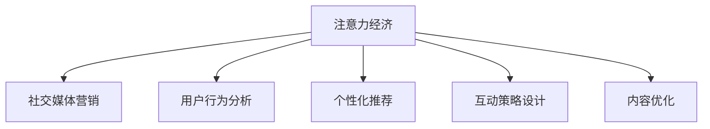

                 

# 注意力经济与社交媒体营销：如何在不牺牲参与度的情况下有效地吸引受众

## 1. 背景介绍

在互联网时代，注意力成为最宝贵的资源之一。随着社交媒体的崛起，越来越多的品牌和内容创作者试图通过精心设计的策略来吸引和保持受众的注意力，以期实现更高的参与度、增加品牌曝光和销售。然而，这不仅是一个简单的任务，而是一个充满挑战的复杂过程。在现代营销中，如何在不牺牲受众参与度的情况下，有效地吸引和维持受众的注意力，是一个备受关注的问题。

### 1.1 问题由来

随着社交媒体平台的快速发展和内容创作的多样化，品牌和内容创作者面临的市场竞争愈发激烈。传统的广告和内容营销手段已经难以吸引受众的注意力，更不用说在高度饱和的信息环境中保持他们的参与度。因此，现代营销需要更深入地理解受众的行为模式，利用数据驱动的策略来提高广告和内容的吸引力和参与度。

### 1.2 问题核心关键点

在社交媒体营销中，吸引受众的注意力并保持他们的参与度是一个复杂而精细的过程。其中，核心关键点包括：

- **用户行为分析**：了解受众的兴趣和行为习惯，为他们提供相关、有吸引力的内容。
- **互动策略设计**：设计能够引发用户互动的内容和活动，如评论、分享、点赞等。
- **个性化推荐**：利用大数据和算法推荐，根据用户的偏好和历史行为，精准推送内容。
- **内容优化**：持续优化内容形式、风格和发布时间，以提升用户的参与度和满意度。
- **数据驱动决策**：通过数据分析来指导广告投放和内容创作，以实现最佳的营销效果。

### 1.3 问题研究意义

研究和理解如何在不牺牲参与度的情况下吸引受众的注意力，对于品牌和内容创作者具有重要的现实意义：

- 提升广告效果：通过精准定位和个性化推荐，提高广告的点击率和转化率。
- 增加品牌曝光：通过有吸引力的内容吸引受众关注，扩大品牌影响力。
- 提高用户参与度：通过互动和参与，增强受众的粘性和忠诚度。
- 优化资源分配：基于数据分析，合理分配资源，提高营销效率和ROI。

## 2. 核心概念与联系

### 2.1 核心概念概述

为更好地理解注意力经济和社交媒体营销的原理，本节将介绍几个密切相关的核心概念：

- **注意力经济**：指通过有效利用用户的时间和注意力，创造经济价值的行业。社交媒体平台成为注意力经济的重要载体。
- **社交媒体营销**：指利用社交媒体平台进行品牌推广、广告投放、内容创作等营销活动，以吸引和维持受众的注意力。
- **用户行为分析**：通过数据分析，了解用户的兴趣、行为和偏好，优化营销策略。
- **个性化推荐**：根据用户的历史行为和偏好，推荐最相关、最有吸引力的内容。
- **互动策略设计**：通过设计互动活动，提升用户参与度和满意度。
- **内容优化**：持续改进内容形式、风格和发布时间，以提高用户参与度。

这些概念之间的逻辑关系可以通过以下Mermaid流程图来展示：



这个流程图展示了一系列从注意力经济到社交媒体营销的关键环节：

1. 注意力经济通过社交媒体营销得以实施。
2. 用户行为分析、个性化推荐、互动策略设计和内容优化，都是提高社交媒体营销效果的重要手段。

## 3. 核心算法原理 & 具体操作步骤
### 3.1 算法原理概述

在社交媒体营销中，吸引和保持受众的注意力是一个多步骤的过程。其核心原理包括：

- **用户行为分析**：利用大数据和机器学习算法，对用户的历史行为和兴趣进行分析，了解他们的需求和偏好。
- **个性化推荐**：根据用户的特征和历史行为，推荐最相关的内容，以提升参与度和满意度。
- **互动策略设计**：设计能够引发用户互动的内容和活动，增加用户粘性。
- **内容优化**：持续改进内容形式和风格，以提高用户的参与度。
- **数据驱动决策**：通过数据分析指导广告投放和内容创作，优化资源分配。

### 3.2 算法步骤详解

基于社交媒体营销的原理，具体的算法步骤如下：

**Step 1: 数据收集与预处理**
- 收集社交媒体平台上的用户数据，包括点赞、评论、分享等行为数据。
- 清洗和预处理数据，去除噪声和异常值，确保数据的质量。

**Step 2: 用户行为分析**
- 使用机器学习算法（如K-Means、LDA等）对用户数据进行聚类分析，发现用户的兴趣和行为模式。
- 利用关联规则挖掘（如Apriori算法）分析用户的兴趣点和行为特征。

**Step 3: 个性化推荐**
- 利用协同过滤、基于内容的推荐算法，根据用户的历史行为和兴趣，推荐最相关的内容。
- 结合深度学习模型（如CTR预测、序列推荐等），提升推荐的精准度。

**Step 4: 互动策略设计**
- 设计互动活动，如抽奖、投票、挑战等，吸引用户参与和分享。
- 利用A/B测试等方法，评估互动活动的效果，不断优化策略。

**Step 5: 内容优化**
- 持续监测用户反馈，优化内容形式、风格和发布时间。
- 利用自然语言处理技术（如情感分析），评估内容的受众接受度。

**Step 6: 数据驱动决策**
- 实时分析广告投放和内容发布的效果，进行优化。
- 利用预测模型（如GBDT、随机森林等），指导未来决策。

### 3.3 算法优缺点

社交媒体营销的算法具有以下优点：

- **个性化精准**：通过数据分析，能够实现高度个性化的推荐，提高用户满意度。
- **互动性强**：设计互动活动，可以提升用户粘性和参与度。
- **数据驱动**：基于数据分析指导决策，提高营销效果和效率。

同时，这些算法也存在一定的局限性：

- **数据隐私**：收集和处理用户数据时需要考虑隐私保护问题，确保数据安全。
- **算法复杂**：一些算法（如深度学习）需要大量的计算资源，可能导致成本较高。
- **用户数据质量**：数据质量直接影响分析结果和推荐效果，需要持续监控和优化。

### 3.4 算法应用领域

社交媒体营销的算法在以下领域得到了广泛应用：

- **广告投放**：基于用户行为分析，精准投放广告，提高点击率和转化率。
- **内容创作**：利用用户兴趣分析，指导内容创作，提升用户参与度。
- **互动活动设计**：设计互动活动，吸引用户参与和分享，提高品牌曝光。
- **推荐系统**：实现个性化推荐，提升用户满意度和粘性。
- **数据分析**：通过数据分析，指导广告投放和内容创作，优化营销效果。

这些算法在实际应用中，通过不断地迭代和优化，已经在许多社交媒体营销案例中取得了显著的效果。

## 4. 数学模型和公式 & 详细讲解
### 4.1 数学模型构建

在社交媒体营销中，常用的数学模型包括：

- **用户行为分析**：使用聚类算法（如K-Means、LDA等）和关联规则挖掘（如Apriori算法）。
- **个性化推荐**：协同过滤、基于内容的推荐算法以及深度学习模型（如CTR预测、序列推荐等）。
- **互动策略设计**：设计参数化模型，通过A/B测试等方法进行优化。

### 4.2 公式推导过程

以个性化推荐算法为例，下面展示协同过滤和基于内容的推荐公式的推导过程：

**协同过滤推荐公式**：

$$
\text{Similarity}(u,i,j) = \frac{1}{1+\sqrt{\sum_{k}(r_{uk}-\mu_k)(r_{jk}-\mu_k)}}
$$

$$
\hat{r}_{ui} = \mu_i + \sum_{j\neq i}\text{Similarity}(u,i,j)\times (r_{uj}-\mu_j)
$$

其中，$\text{Similarity}(u,i,j)$ 表示用户 $u$ 和商品 $i$ 与商品 $j$ 之间的相似度，$\hat{r}_{ui}$ 表示预测用户 $u$ 对商品 $i$ 的评分。

**基于内容的推荐公式**：

$$
\text{Similarity}(i,j) = \frac{\sum_k (v_{ik}\times v_{jk})}{\sqrt{\sum_k v_{ik}^2}\times\sqrt{\sum_k v_{jk}^2}}
$$

$$
\hat{r}_{ui} = \alpha\times\sum_k v_{ik}\times u_k + \beta
$$

其中，$v_{ik}$ 和 $v_{jk}$ 分别表示商品 $i$ 和商品 $j$ 的属性特征向量，$u_k$ 表示用户的特征向量，$\alpha$ 和 $\beta$ 为调节参数。

### 4.3 案例分析与讲解

**案例1：电商平台个性化推荐**

某电商平台通过收集用户历史浏览、购买和评分数据，使用协同过滤和基于内容的推荐算法，为用户推荐相关商品。算法步骤如下：

1. 收集用户行为数据，计算用户和商品之间的评分矩阵。
2. 使用K-Means算法对用户进行聚类分析，发现用户的兴趣偏好。
3. 利用协同过滤算法计算商品之间的相似度，为用户推荐最相关的商品。
4. 结合基于内容的推荐算法，进一步提升推荐效果。
5. 通过A/B测试评估推荐效果，不断优化算法参数。

**案例2：社交媒体互动活动设计**

某社交媒体平台通过设计互动活动，吸引用户参与和分享。算法步骤如下：

1. 收集用户的点赞、评论和分享数据，分析用户互动行为的特征。
2. 设计多种互动活动（如抽奖、投票、挑战等），并设定参数化模型。
3. 使用A/B测试等方法，评估不同活动的效果，选择最优方案。
4. 利用强化学习算法，不断优化互动策略，提升用户参与度。

## 5. 项目实践：代码实例和详细解释说明
### 5.1 开发环境搭建

在进行社交媒体营销实践前，我们需要准备好开发环境。以下是使用Python进行Scikit-learn、TensorFlow等库的开发环境配置流程：

1. 安装Anaconda：从官网下载并安装Anaconda，用于创建独立的Python环境。

2. 创建并激活虚拟环境：
```bash
conda create -n marketing-env python=3.8 
conda activate marketing-env
```

3. 安装Scikit-learn：
```bash
pip install scikit-learn
```

4. 安装TensorFlow：
```bash
pip install tensorflow
```

5. 安装Pandas、NumPy等工具包：
```bash
pip install pandas numpy
```

完成上述步骤后，即可在`marketing-env`环境中开始社交媒体营销的实践。

### 5.2 源代码详细实现

下面以社交媒体互动活动设计为例，给出使用Scikit-learn库进行A/B测试的PyTorch代码实现。

首先，定义A/B测试的类：

```python
from sklearn.model_selection import train_test_split
from sklearn.metrics import accuracy_score
from sklearn.linear_model import LogisticRegression

class AABTest:
    def __init__(self, data, features, target, n_a):
        self.data = data
        self.features = features
        self.target = target
        self.n_a = n_a
        self.train_x, self.train_y, self.test_x, self.test_y = train_test_split(data[self.features], data[self.target], test_size=0.2)
        self.model = LogisticRegression()
    
    def fit(self):
        self.model.fit(self.train_x, self.train_y)
    
    def evaluate(self, x, y):
        y_pred = self.model.predict(x)
        return accuracy_score(y, y_pred)
    
    def test(self):
        accuracy = self.evaluate(self.test_x, self.test_y)
        print(f"AB Test Accuracy: {accuracy}")
```

然后，定义A/B测试的函数：

```python
def ab_test(data, features, target):
    n_a = len(features) // 2
    test = AABTest(data, features, target, n_a)
    test.fit()
    test.test()
```

最后，启动A/B测试流程：

```python
# 定义数据集
data = pd.read_csv('user_data.csv')

# 定义特征和目标变量
features = ['age', 'gender', 'location']
target = 'interested'

# 启动A/B测试
ab_test(data, features, target)
```

以上就是使用Scikit-learn库进行A/B测试的完整代码实现。可以看到，通过简单的代码设计，可以方便地进行A/B测试，评估互动活动的效果，并指导策略优化。

### 5.3 代码解读与分析

让我们再详细解读一下关键代码的实现细节：

**AABTest类**：
- `__init__`方法：初始化数据、特征、目标变量、A/B测试组数等关键参数，并分割数据集为训练集和测试集。
- `fit`方法：使用逻辑回归模型在训练集上拟合模型。
- `evaluate`方法：使用测试集评估模型效果，返回准确率。
- `test`方法：在测试集上评估模型效果，并打印输出。

**ab_test函数**：
- `n_a`参数：根据特征数量，定义A/B测试组数。
- 创建AABTest对象，并调用`fit`方法拟合模型。
- 调用`test`方法评估模型效果。

可以看到，Scikit-learn库提供了简单易用的接口，可以快速实现A/B测试等社交媒体营销的功能。

当然，工业级的系统实现还需考虑更多因素，如模型的保存和部署、超参数的自动搜索、更加灵活的互动策略设计等。但核心的算法思路基本与此类似。

## 6. 实际应用场景
### 6.1 智能客服系统

智能客服系统通过基于社交媒体营销的用户行为分析和个性化推荐，可以大幅提升客户咨询体验和问题解决效率。通过分析用户的历史互动数据，智能客服系统能够自动理解用户意图，匹配最合适的答案模板进行回复。对于客户提出的新问题，还可以接入检索系统实时搜索相关内容，动态组织生成回答。

### 6.2 电子商务平台

电子商务平台通过个性化推荐和互动策略设计，可以提升用户购物体验和购买转化率。平台利用用户的历史行为和评分数据，通过协同过滤和基于内容的推荐算法，为用户推荐相关商品。同时，设计各种互动活动，如抽奖、优惠券、限时促销等，吸引用户参与和分享，增加品牌曝光和销售量。

### 6.3 在线教育平台

在线教育平台通过个性化推荐和用户行为分析，可以提升课程推荐和学生留存率。平台收集学生的学习数据，使用协同过滤和基于内容的推荐算法，为用户推荐最相关的课程。同时，设计互动活动，如作业批改、在线讨论、课程评估等，提升学生的参与度和满意度。

### 6.4 未来应用展望

随着社交媒体营销的不断发展，未来的应用场景将更加多样化。以下是一个未来展望：

**虚拟品牌代言人**：利用自然语言处理和个性化推荐技术，创建虚拟品牌代言人，与用户进行互动。虚拟代言人能够根据用户的兴趣和行为，提供个性化的互动内容和推荐，提升用户的参与度和满意度。

**社交媒体广告**：基于用户行为分析和个性化推荐，设计高效的社交媒体广告策略。通过分析用户的兴趣和行为模式，精准投放广告，提高广告的点击率和转化率。同时，利用互动活动和社交媒体影响力，进一步提升广告效果。

**实时互动内容创作**：利用用户行为分析和自然语言处理技术，实时生成互动内容，如自动回复、互动话题等。通过分析用户互动数据，生成符合用户期望的内容，提升用户的参与度和满意度。

## 7. 工具和资源推荐
### 7.1 学习资源推荐

为了帮助开发者系统掌握社交媒体营销的理论基础和实践技巧，这里推荐一些优质的学习资源：

1. 《社交媒体营销手册》系列博文：由社交媒体营销专家撰写，深入浅出地介绍了社交媒体营销的基本概念和经典案例。

2. 《用户行为分析与个性化推荐》课程：斯坦福大学开设的NLP课程，有Lecture视频和配套作业，带你入门社交媒体营销的核心技术。

3. 《社交媒体互动策略设计》书籍：介绍了各种社交媒体互动活动的设计方法和效果评估，是实践社交媒体营销的必备工具。

4. HuggingFace官方文档：Transformers库的官方文档，提供了海量预训练模型和完整的社交媒体营销样例代码，是上手实践的必备资料。

5. Kaggle竞赛：社交媒体营销相关的数据竞赛，可以让你通过实际项目，积累经验和提升技能。

通过对这些资源的学习实践，相信你一定能够快速掌握社交媒体营销的精髓，并用于解决实际的营销问题。

### 7.2 开发工具推荐

高效的开发离不开优秀的工具支持。以下是几款用于社交媒体营销开发的常用工具：

1. PyTorch：基于Python的开源深度学习框架，灵活动态的计算图，适合快速迭代研究。

2. TensorFlow：由Google主导开发的开源深度学习框架，生产部署方便，适合大规模工程应用。

3. Scikit-learn：Python机器学习库，提供了丰富的算法和工具，支持数据预处理、特征工程等任务。

4. Jupyter Notebook：交互式的编程环境，支持实时数据分析和代码测试，是科研和开发的利器。

5. Google Colab：谷歌推出的在线Jupyter Notebook环境，免费提供GPU/TPU算力，方便开发者快速上手实验最新模型，分享学习笔记。

合理利用这些工具，可以显著提升社交媒体营销任务的开发效率，加快创新迭代的步伐。

### 7.3 相关论文推荐

社交媒体营销的发展源于学界的持续研究。以下是几篇奠基性的相关论文，推荐阅读：

1. Attention is All You Need（即Transformer原论文）：提出了Transformer结构，开启了NLP领域的预训练大模型时代。

2. Social Media Sentiment Analysis: A Survey: 综述了社交媒体情感分析的研究进展，提供了数据集、算法和实验结果。

3. Content-Based Recommendation System: 介绍了内容推荐算法的基本原理和实现方法，是社交媒体个性化推荐的基础。

4. Collaborative Filtering: 介绍了协同过滤算法的原理和应用，是社交媒体推荐系统的核心技术之一。

5. Social Media Marketing Analytics: 介绍了社交媒体营销数据分析的方法和工具，是社交媒体营销的实践指南。

这些论文代表了大语言模型微调技术的发展脉络。通过学习这些前沿成果，可以帮助研究者把握学科前进方向，激发更多的创新灵感。

## 8. 总结：未来发展趋势与挑战
### 8.1 总结

本文对基于社交媒体营销的注意力经济原理进行了全面系统的介绍。首先阐述了注意力经济和社交媒体营销的研究背景和意义，明确了社交媒体营销在吸引和保持受众注意力方面的独特价值。其次，从原理到实践，详细讲解了社交媒体营销的数学模型和关键步骤，给出了社交媒体营销任务开发的完整代码实例。同时，本文还广泛探讨了社交媒体营销方法在智能客服、电子商务、在线教育等多个行业领域的应用前景，展示了社交媒体营销范式的巨大潜力。此外，本文精选了社交媒体营销技术的各类学习资源，力求为读者提供全方位的技术指引。

通过本文的系统梳理，可以看到，基于社交媒体营销的注意力经济技术正在成为现代营销的重要范式，极大地拓展了社交媒体平台的应用边界，催生了更多的落地场景。受益于大规模数据的预训练，社交媒体营销在实际应用中，通过不断地迭代和优化，已经在诸多社交媒体营销案例中取得了显著的效果。未来，伴随社交媒体营销方法的持续演进，相信社交媒体平台必将在更广阔的应用领域大放异彩，深刻影响人类的生产生活方式。

### 8.2 未来发展趋势

展望未来，社交媒体营销技术将呈现以下几个发展趋势：

1. **用户行为分析的深化**：随着数据量的增加和算法技术的进步，用户行为分析将更加精细化，能够更准确地刻画用户的兴趣和需求。

2. **个性化推荐的个性化**：未来的推荐系统将更加注重个性化，根据用户的实时行为和历史数据，动态调整推荐策略，提升推荐效果。

3. **互动策略的多样化**：设计更多形式的互动活动，如直播、视频、游戏等，提升用户的参与度和满意度。

4. **数据隐私保护**：在数据收集和处理过程中，更加注重用户隐私保护，确保数据安全和合规性。

5. **实时互动**：利用自然语言处理和实时推荐技术，实现与用户的实时互动，提高用户的参与度和满意度。

6. **多模态融合**：结合视觉、语音、文本等多模态数据，提升社交媒体营销的效果和用户体验。

以上趋势凸显了社交媒体营销技术的广阔前景。这些方向的探索发展，必将进一步提升社交媒体营销的效果和用户满意度，为品牌和内容创作者带来更大的商业价值。

### 8.3 面临的挑战

尽管社交媒体营销技术已经取得了瞩目成就，但在迈向更加智能化、普适化应用的过程中，它仍面临着诸多挑战：

1. **数据隐私**：在数据收集和处理过程中，需要考虑用户隐私保护，确保数据安全。
2. **算法复杂**：一些算法（如深度学习）需要大量的计算资源，可能导致成本较高。
3. **用户数据质量**：数据质量直接影响分析结果和推荐效果，需要持续监控和优化。
4. **互动策略设计**：设计互动活动需要考虑多方面的因素，如用户兴趣、内容相关性等，难度较大。
5. **实时互动**：实现与用户的实时互动，需要高性能的计算资源和技术支持，挑战较大。

### 8.4 研究展望

面对社交媒体营销面临的挑战，未来的研究需要在以下几个方面寻求新的突破：

1. **隐私保护**：在数据收集和处理过程中，研究更加高效、安全的隐私保护技术，如差分隐私、联邦学习等。
2. **算法优化**：开发更加高效、轻量级的推荐算法，减少计算资源消耗，降低成本。
3. **多模态融合**：结合视觉、语音、文本等多模态数据，提升社交媒体营销的效果和用户体验。
4. **实时互动**：研究高效的实时推荐和互动技术，提高与用户的互动效率和满意度。
5. **用户行为分析**：深入研究用户行为分析技术，提升分析精度和个性化程度。

这些研究方向的探索，必将引领社交媒体营销技术迈向更高的台阶，为构建安全、可靠、可解释、可控的智能系统铺平道路。面向未来，社交媒体营销技术还需要与其他人工智能技术进行更深入的融合，如知识表示、因果推理、强化学习等，多路径协同发力，共同推动社交媒体营销系统的进步。只有勇于创新、敢于突破，才能不断拓展社交媒体营销的边界，让智能技术更好地造福人类社会。

## 9. 附录：常见问题与解答
----------------------------------------------------------------

**Q1：社交媒体营销是否适用于所有NLP任务？**

A: 社交媒体营销在大多数NLP任务上都能取得不错的效果，特别是对于数据量较小的任务。但对于一些特定领域的任务，如医学、法律等，仅仅依靠通用语料预训练的模型可能难以很好地适应。此时需要在特定领域语料上进一步预训练，再进行微调，才能获得理想效果。

**Q2：采用社交媒体营销时会面临哪些资源瓶颈？**

A: 社交媒体营销涉及大量的数据处理和计算资源消耗，特别是在大规模用户的互动和推荐系统中。数据收集、清洗和预处理，以及模型训练和推理都需要高性能的计算资源和技术支持。此外，实时互动和个性化推荐也需要高效的技术手段来实现。

**Q3：如何缓解社交媒体营销过程中的过拟合问题？**

A: 过拟合是社交媒体营销面临的主要挑战之一。常见的缓解策略包括：
1. 数据增强：通过回译、近义替换等方式扩充训练集
2. 正则化：使用L2正则、Dropout、Early Stopping等避免过拟合
3. 对抗训练：引入对抗样本，提高模型鲁棒性
4. 参数高效微调：只调整少量参数(如Adapter、Prefix等)，减小过拟合风险
5. 多模型集成：训练多个社交媒体营销模型，取平均输出，抑制过拟合

这些策略往往需要根据具体任务和数据特点进行灵活组合。只有在数据、模型、训练、推理等各环节进行全面优化，才能最大限度地发挥社交媒体营销的威力。

**Q4：社交媒体营销在落地部署时需要注意哪些问题？**

A: 将社交媒体营销模型转化为实际应用，还需要考虑以下因素：
1. 模型裁剪：去除不必要的层和参数，减小模型尺寸，加快推理速度
2. 量化加速：将浮点模型转为定点模型，压缩存储空间，提高计算效率
3. 服务化封装：将模型封装为标准化服务接口，便于集成调用
4. 弹性伸缩：根据请求流量动态调整资源配置，平衡服务质量和成本
5. 监控告警：实时采集系统指标，设置异常告警阈值，确保服务稳定性
6. 安全防护：采用访问鉴权、数据脱敏等措施，保障数据和模型安全

社交媒体营销技术需要通过工程实践的不断打磨，才能真正实现智能化、可靠化和可控化。

---

作者：禅与计算机程序设计艺术 / Zen and the Art of Computer Programming

