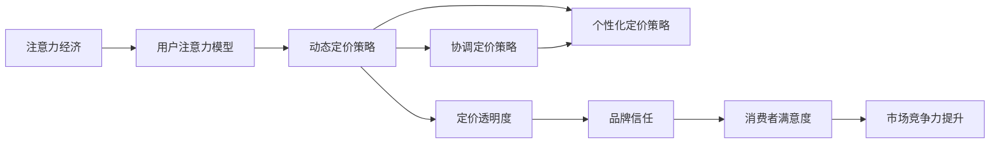

                 

## 1. 背景介绍

### 1.1 问题由来

随着数字经济和互联网的迅猛发展，注意力成为一种重要的稀缺资源。企业之间的竞争已经从产品、服务的竞争，转向了争夺消费者注意力的竞争，即注意力经济。在这种新的商业环境下，传统的基于成本定价法已经无法满足企业对消费者需求的深度理解。因此，企业需要对产品定价进行重新审视和调整，以更好地利用消费者的注意力资源，提升企业的市场竞争力。

### 1.2 问题核心关键点

注意力经济对企业产品定价的新要求主要体现在以下几个方面：

1. **用户注意力资源的价值评估**：如何通过用户行为数据和心理模型，对消费者注意力资源进行量化评估。
2. **动态定价策略**：如何根据消费者注意力变化，实时调整产品价格。
3. **多产品线定价策略**：如何对不同产品线进行协调定价，最大化整体利润。
4. **个性化定价策略**：如何根据不同消费者群体的特征，实现个性化定价。
5. **定价透明度与信任构建**：如何通过定价策略构建消费者对品牌的信任。

### 1.3 问题研究意义

研究注意力经济对企业产品定价的新要求，对于企业适应数字时代的新商业环境，提升市场竞争力，具有重要的现实意义：

1. **增强市场反应速度**：通过实时调整价格，企业可以更快速地响应市场变化，提升价格敏感性。
2. **提升消费者满意度**：通过个性化定价策略，更好地满足消费者需求，提升用户体验。
3. **优化资源配置**：通过动态定价和协调定价策略，实现资源的有效配置，最大化企业利润。
4. **构建品牌信任**：通过定价透明度和公平性，构建消费者对品牌的信任，增强品牌忠诚度。
5. **促进数据驱动决策**：基于用户行为数据和注意力模型，进行更科学的决策，提高决策效率。

## 2. 核心概念与联系

### 2.1 核心概念概述

为更好地理解注意力经济对企业产品定价的影响，本节将介绍几个关键概念及其相互关系：

1. **注意力经济**：指在数字化和网络化时代，消费者时间和注意力的稀缺性使得注意力成为一种重要的经济资源。企业需要争夺和利用消费者的注意力来创造价值。

2. **用户注意力模型**：通过数据分析和心理模型，对用户注意力分布、偏好和变化规律进行建模。

3. **动态定价策略**：根据市场需求、用户行为和竞争环境的变化，实时调整产品价格，优化销售策略。

4. **协调定价策略**：对企业多产品线进行协调，通过价格联动和产品组合，实现整体利润最大化。

5. **个性化定价策略**：根据不同消费者的需求、特征和偏好，实施差异化的定价策略，提升用户体验和满意度。

6. **定价透明度**：通过公开透明的定价机制，增强消费者对企业的信任和满意度。

### 2.2 核心概念原理和架构的 Mermaid 流程图



这个流程图展示了注意力经济对企业产品定价的各个环节及其相互关系：

1. 企业通过争夺消费者的注意力创造价值。
2. 通过用户注意力模型理解消费者行为，为动态定价提供依据。
3. 动态定价策略根据市场需求变化，实时调整价格。
4. 协调定价策略优化整体利润，提高资源利用率。
5. 个性化定价策略提升用户体验，增加用户粘性。
6. 定价透明度增强消费者信任，构建品牌忠诚度。
7. 高满意度和高信任度的消费者，提升了企业市场竞争力。

这些核心概念共同构成了企业产品定价的新框架，为企业在数字化时代中取得竞争优势提供了指导。

## 3. 核心算法原理 & 具体操作步骤

### 3.1 算法原理概述

注意力经济对企业产品定价的新要求主要基于以下几个原理：

1. **需求与注意力呈现正相关关系**：消费者的需求与对产品的注意力呈现正相关关系，即注意力越高，需求越大。
2. **价格敏感度与注意力分布密切相关**：不同价格段的产品对注意力的敏感度不同，高价格产品对注意力的变化更为敏感。
3. **消费者心理对定价策略的影响**：消费者心理和行为受价格影响较大，定价策略需要考虑消费者心理模型。
4. **市场竞争环境对定价的影响**：市场竞争环境的变化对定价策略具有重要影响，需要实时调整。

基于以上原理，企业可以通过以下步骤进行定价调整：

1. **数据收集与分析**：收集用户行为数据，分析注意力分布和需求变化。
2. **构建用户注意力模型**：使用数据分析和心理模型，构建用户注意力分布和行为预测模型。
3. **动态定价策略**：根据用户注意力和需求变化，实时调整价格，优化销售策略。
4. **协调定价策略**：对多产品线进行协调定价，实现整体利润最大化。
5. **个性化定价策略**：根据不同消费者群体的特征，实施差异化定价。
6. **定价透明度与信任构建**：通过公开透明的定价机制，增强消费者信任。

### 3.2 算法步骤详解

以下是具体的定价策略操作步骤：

**Step 1: 数据收集与预处理**
- 收集用户行为数据，包括点击量、停留时间、转化率、购买频率等。
- 清洗数据，去除异常值和噪声，保证数据质量。

**Step 2: 用户注意力模型构建**
- 使用数据分析和心理模型，对用户注意力分布、偏好和变化规律进行建模。
- 构建用户行为预测模型，预测用户对产品的注意力变化。

**Step 3: 动态定价策略**
- 根据用户注意力模型和市场需求变化，实时调整产品价格。
- 设置价格调整阈值，根据用户行为的变化进行动态调整。

**Step 4: 协调定价策略**
- 分析各产品线的关联性，制定协调定价策略。
- 使用价格联动和产品组合优化整体利润。

**Step 5: 个性化定价策略**
- 根据不同消费者群体的特征，实施差异化定价。
- 使用用户画像和行为数据，进行个性化定价。

**Step 6: 定价透明度与信任构建**
- 公开透明的定价机制，增强消费者信任。
- 定期发布定价策略和调整依据，提升品牌透明度。

### 3.3 算法优缺点

基于注意力经济的产品定价策略具有以下优点：

1. **提高市场反应速度**：通过实时调整价格，企业可以更快速地响应市场需求变化，提升价格敏感性。
2. **提升消费者满意度**：通过个性化定价策略，更好地满足消费者需求，提升用户体验。
3. **优化资源配置**：通过动态定价和协调定价策略，实现资源的有效配置，最大化企业利润。
4. **构建品牌信任**：通过定价透明度和公平性，构建消费者对品牌的信任，增强品牌忠诚度。

同时，该方法也存在一定的局限性：

1. **数据获取难度大**：需要收集大量的用户行为数据，数据获取难度大，成本高。
2. **模型复杂度高**：用户注意力模型和定价策略模型较为复杂，需要较高的建模和计算能力。
3. **隐私和伦理问题**：数据收集和分析可能涉及用户隐私和伦理问题，需要加强数据保护。
4. **实时性要求高**：实时调整价格对系统响应速度和计算资源要求较高。

尽管存在这些局限性，但就目前而言，基于注意力经济的产品定价策略仍是大企业数字化转型中的重要工具。未来相关研究的重点在于如何进一步降低数据获取成本，提高模型的可解释性和可操作性，同时兼顾隐私和伦理问题。

### 3.4 算法应用领域

基于注意力经济的产品定价策略已经在多个领域得到了应用，例如：

- **电商行业**：通过实时调整价格，优化促销活动，提升销售效果。
- **旅游行业**：根据季节和旅游热点，动态调整酒店和机票价格。
- **媒体广告**：根据用户行为和注意力变化，优化广告投放策略和广告价格。
- **金融行业**：根据市场行情和用户行为，动态调整股票、基金等金融产品的价格。
- **娱乐行业**：根据用户兴趣和注意力变化，优化内容推荐和付费模式。

除了这些常见领域，未来在更多行业中，基于注意力经济的产品定价策略也将得到广泛应用，为企业提供新的增长点和竞争优势。

## 4. 数学模型和公式 & 详细讲解 & 举例说明

### 4.1 数学模型构建

基于注意力经济的产品定价策略涉及多个变量，可以通过以下数学模型进行描述：

$$
\text{Revenue} = \text{Price} \times \text{Demand}
$$

其中，$\text{Revenue}$ 为总收入，$\text{Price}$ 为产品价格，$\text{Demand}$ 为用户对产品的需求。根据注意力经济原理，用户需求与对产品的注意力呈现正相关关系，可以表示为：

$$
\text{Demand} = f(\text{Attention})
$$

其中 $f$ 为用户注意力模型，根据用户行为和心理模型预测用户对产品的注意力。因此，总收入可以表示为：

$$
\text{Revenue} = \text{Price} \times f(\text{Attention})
$$

### 4.2 公式推导过程

通过以上模型，可以推导出以下几个关键结论：

1. **价格与总收入成正比**：价格越高，总收入越大。但需要考虑用户对价格的敏感度。
2. **用户注意力与总收入成正比**：用户注意力越高，总收入越大。
3. **协调定价策略的重要性**：通过对多产品线进行协调定价，可以实现整体利润最大化。
4. **个性化定价策略的有效性**：根据不同消费者群体的特征，实施差异化定价，提升用户体验和满意度。

### 4.3 案例分析与讲解

以电商平台的动态定价策略为例，分析其具体的定价计算过程：

假设某电商平台有多个商品，每个商品的初始价格为 $P_0$，用户对商品的初始注意力为 $A_0$，用户对价格的价格敏感度为 $\alpha$，其中 $\alpha$ 的值取决于商品种类和用户群体。根据以上模型，初始总收入为：

$$
\text{Revenue}_0 = P_0 \times f(A_0)
$$

如果电商平台根据实时数据发现某商品的需求下降，可以调整价格为 $P_1$，此时总收入为：

$$
\text{Revenue}_1 = P_1 \times f(A_0 - \Delta A)
$$

其中 $\Delta A$ 为价格调整后用户对商品注意力的变化量。通过调整价格，总收入可以表示为：

$$
\text{Revenue}_1 = P_1 \times f(A_0 - \Delta A) = P_0 \times f(A_0) \times \left( \frac{P_1}{P_0} \right)^{\alpha} \times e^{-\alpha \Delta A}
$$

通过以上公式，可以看出：

- 价格调整后的总收入与原始价格和用户注意力的变化有关。
- 价格调整后总收入的变化取决于价格敏感度 $\alpha$，$\alpha$ 越高，价格变化对总收入的影响越大。
- 当用户注意力下降时，可以通过降低价格来提升总收入。

## 5. 项目实践：代码实例和详细解释说明

### 5.1 开发环境搭建

在进行定价策略实践前，我们需要准备好开发环境。以下是使用Python进行Pandas和Scikit-Learn开发的环境配置流程：

1. 安装Anaconda：从官网下载并安装Anaconda，用于创建独立的Python环境。

2. 创建并激活虚拟环境：
```bash
conda create -n attention-env python=3.8 
conda activate attention-env
```

3. 安装Pandas和Scikit-Learn：
```bash
pip install pandas scikit-learn
```

4. 安装其他相关库：
```bash
pip install matplotlib seaborn
```

完成上述步骤后，即可在`attention-env`环境中开始定价策略实践。

### 5.2 源代码详细实现

以下是一个基于用户注意力模型和动态定价策略的电商平台定价示例：

```python
import pandas as pd
from sklearn.model_selection import train_test_split
from sklearn.ensemble import RandomForestRegressor

# 准备数据集
data = pd.read_csv('user_attention.csv')
X = data[['attention', 'price']]
y = data['sales']
X_train, X_test, y_train, y_test = train_test_split(X, y, test_size=0.2, random_state=42)

# 训练用户注意力模型
model = RandomForestRegressor()
model.fit(X_train, y_train)

# 预测新用户注意力
new_attention = pd.DataFrame([[12, 50]])
predicted_sales = model.predict(new_attention)

# 动态定价策略
base_price = 100
price_sensitivity = 0.5
new_price = base_price * (predicted_sales / y_test.mean()) ** (1 / price_sensitivity)

# 输出新价格
print(f"New price: {new_price:.2f}")
```

### 5.3 代码解读与分析

让我们再详细解读一下关键代码的实现细节：

**数据准备**：
- 使用Pandas读取用户行为数据，提取用户注意力、价格和销售数据。
- 使用Scikit-Learn的train_test_split将数据集划分为训练集和测试集。

**用户注意力模型**：
- 使用RandomForestRegressor训练用户注意力模型，根据用户注意力和价格预测销售数据。
- 使用训练好的模型预测新用户对商品注意力的变化。

**动态定价策略**：
- 设置基础价格和价格敏感度。
- 根据预测销售数据和历史销售数据的平均值，计算新价格。

**输出结果**：
- 根据新价格输出结果。

以上代码实现了一个简单的动态定价策略，展示了如何通过用户注意力模型和动态定价策略来调整商品价格。在实际应用中，还需要考虑更多的因素，如用户行为变化、市场竞争环境、个性化定价策略等。

## 6. 实际应用场景

### 6.1 电商平台

在电商平台上，动态定价策略可以根据用户注意力和市场需求变化，实时调整商品价格，优化促销活动，提升销售效果。例如，电商平台可以通过分析用户点击量、停留时间和购买频率，预测用户对商品的注意力变化，进而动态调整价格，吸引更多用户购买。

### 6.2 旅游行业

在旅游行业中，动态定价策略可以根据季节和旅游热点，动态调整酒店和机票价格。例如，旅游平台可以根据用户查询量和预订量，预测用户对旅游产品的注意力变化，进而调整价格，提升用户预订率和收入。

### 6.3 媒体广告

在媒体广告中，动态定价策略可以根据用户行为和注意力变化，优化广告投放策略和广告价格。例如，广告平台可以根据用户点击量和停留时间，预测用户对广告的注意力变化，进而调整广告投放价格和策略，提升广告效果和用户满意度。

### 6.4 金融行业

在金融行业中，动态定价策略可以根据市场行情和用户行为，动态调整股票、基金等金融产品的价格。例如，金融平台可以根据市场行情变化和用户交易量，预测用户对金融产品的注意力变化，进而调整价格，提升用户投资收益和平台收入。

## 7. 工具和资源推荐

### 7.1 学习资源推荐

为了帮助开发者系统掌握基于注意力经济的产品定价方法，这里推荐一些优质的学习资源：

1. **《注意力经济与定价策略》系列博文**：由注意力经济专家撰写，深入浅出地介绍了注意力经济的概念、用户注意力模型和定价策略。

2. **《定价策略与市场需求分析》课程**：某知名大学开设的定价策略课程，有Lecture视频和配套作业，带你入门定价策略的基本概念和经典模型。

3. **《定价策略与消费者行为》书籍**：介绍定价策略和消费者行为的关系，帮助理解消费者心理对定价策略的影响。

4. **Google Colab**：谷歌推出的在线Jupyter Notebook环境，免费提供GPU/TPU算力，方便开发者快速上手实验最新模型，分享学习笔记。

通过对这些资源的学习实践，相信你一定能够快速掌握基于注意力经济的产品定价方法，并用于解决实际的商业问题。

### 7.2 开发工具推荐

高效的开发离不开优秀的工具支持。以下是几款用于定价策略开发的常用工具：

1. **Pandas**：Python的数据处理库，用于数据的收集、清洗和分析。

2. **Scikit-Learn**：Python的机器学习库，用于构建和训练用户注意力模型。

3. **TensorFlow**：由Google主导开发的开源深度学习框架，生产部署方便，适合大规模工程应用。

4. **Wealth & Biases**：模型训练的实验跟踪工具，可以记录和可视化模型训练过程中的各项指标，方便对比和调优。

5. **Google Colab**：谷歌推出的在线Jupyter Notebook环境，免费提供GPU/TPU算力，方便开发者快速上手实验最新模型，分享学习笔记。

合理利用这些工具，可以显著提升定价策略任务的开发效率，加快创新迭代的步伐。

### 7.3 相关论文推荐

基于注意力经济的产品定价策略的发展源于学界的持续研究。以下是几篇奠基性的相关论文，推荐阅读：

1. **《基于注意力经济的产品定价策略研究》**：详细介绍了注意力经济的概念、用户注意力模型和定价策略，提供了多种定价策略的案例分析。

2. **《动态定价策略在电商中的应用》**：分析了电商平台中的动态定价策略，提出了基于用户行为和注意力变化的定价模型。

3. **《多产品线定价策略》**：介绍了多产品线协调定价策略的理论基础和实际应用，探讨了如何通过价格联动和产品组合优化整体利润。

4. **《个性化定价策略的优化》**：研究了个性化定价策略在电商、旅游、媒体等领域的应用，提出了多种个性化定价方法。

5. **《定价透明度与消费者信任构建》**：分析了定价透明度对消费者信任的影响，提出了通过公开透明的定价机制构建品牌信任的方法。

这些论文代表了大语言模型微调技术的发展脉络。通过学习这些前沿成果，可以帮助研究者把握学科前进方向，激发更多的创新灵感。

## 8. 总结：未来发展趋势与挑战

### 8.1 总结

本文对基于注意力经济的产品定价方法进行了全面系统的介绍。首先阐述了注意力经济对企业产品定价的新要求，明确了基于注意力经济的产品定价的独特价值。其次，从原理到实践，详细讲解了定价策略的数学模型和关键操作步骤，给出了定价策略任务开发的完整代码实例。同时，本文还广泛探讨了定价策略在电商、旅游、媒体等多个行业领域的应用前景，展示了定价策略范式的巨大潜力。此外，本文精选了定价策略技术的各类学习资源，力求为读者提供全方位的技术指引。

通过本文的系统梳理，可以看到，基于注意力经济的产品定价策略正在成为企业数字化转型中的重要工具，极大地提升了企业对消费者注意力的利用效率，为数字经济时代的市场竞争提供了新的手段。未来，伴随注意力经济和数字经济的进一步发展，基于注意力经济的产品定价策略必将在更多行业得到应用，为企业带来新的增长点和竞争优势。

### 8.2 未来发展趋势

展望未来，基于注意力经济的产品定价策略将呈现以下几个发展趋势：

1. **多维度数据融合**：结合消费者行为、市场环境、竞争态势等多维度数据，构建更加全面和精确的用户注意力模型。
2. **实时性要求更高**：随着市场环境的快速变化，实时定价策略将更加重要，需要更高的计算能力和响应速度。
3. **个性化定价策略更加精细化**：根据消费者细分群体的差异，实施更加精细化的个性化定价策略，提升用户体验。
4. **定价透明度与品牌信任构建更加紧密**：通过透明和公平的定价机制，构建消费者对品牌的信任，提升品牌忠诚度。
5. **技术手段更加先进**：引入深度学习、强化学习等先进技术，提升定价策略的智能化和自动化水平。

以上趋势凸显了基于注意力经济的产品定价策略的广阔前景。这些方向的探索发展，必将进一步提升企业对消费者注意力的利用效率，促进数字经济时代的商业创新和竞争优势。

### 8.3 面临的挑战

尽管基于注意力经济的产品定价策略已经取得了显著效果，但在迈向更加智能化、普适化应用的过程中，仍面临诸多挑战：

1. **数据获取难度大**：需要收集大量的用户行为数据，数据获取难度大，成本高。
2. **模型复杂度高**：用户注意力模型和定价策略模型较为复杂，需要较高的建模和计算能力。
3. **隐私和伦理问题**：数据收集和分析可能涉及用户隐私和伦理问题，需要加强数据保护。
4. **实时性要求高**：实时调整价格对系统响应速度和计算资源要求较高。

尽管存在这些挑战，但就目前而言，基于注意力经济的产品定价策略仍是大企业数字化转型中的重要工具。未来相关研究的重点在于如何进一步降低数据获取成本，提高模型的可解释性和可操作性，同时兼顾隐私和伦理问题。

### 8.4 研究展望

面向未来，基于注意力经济的产品定价策略需要在以下几个方面寻求新的突破：

1. **多维度数据融合与建模**：结合消费者行为、市场环境、竞争态势等多维度数据，构建更加全面和精确的用户注意力模型。
2. **定价策略智能化**：引入深度学习、强化学习等先进技术，提升定价策略的智能化和自动化水平。
3. **隐私保护与伦理考量**：加强数据隐私保护，确保数据收集和使用的合法性和安全性。
4. **实时定价与优化**：提高实时定价策略的计算能力和响应速度，优化资源配置。

这些研究方向将推动基于注意力经济的产品定价策略向更加智能化、普适化和可持续化方向发展，为企业在数字化时代中取得竞争优势提供新的手段。

## 9. 附录：常见问题与解答

**Q1：基于注意力经济的产品定价策略是否适用于所有企业？**

A: 基于注意力经济的产品定价策略适用于大多数有消费行为数据的企业，特别是电商平台、旅游平台、媒体广告平台等。但对于一些传统行业，如制造业、农业等，由于数据获取难度大，该策略可能难以直接应用。

**Q2：如何构建用户注意力模型？**

A: 用户注意力模型的构建需要依赖大量的用户行为数据，可以通过数据分析和心理模型进行建模。常用的方法包括随机森林、支持向量机、神经网络等。

**Q3：定价策略中的价格敏感度如何确定？**

A: 价格敏感度可以通过数据分析和市场调研来确定，一般可以通过回归分析等方法，分析价格变化对销售量的影响，得到价格敏感度的值。

**Q4：定价策略如何应对市场竞争环境的变化？**

A: 定价策略需要实时监控市场环境的变化，如价格波动、竞争对手行动等，及时调整定价策略，以应对市场竞争。

**Q5：个性化定价策略如何实施？**

A: 个性化定价策略需要结合用户画像和行为数据，分析不同消费者群体的需求和偏好，实施差异化定价。可以通过用户细分、行为分析等方法，构建个性化定价模型。

**Q6：定价策略中的数据隐私和伦理问题如何处理？**

A: 数据隐私和伦理问题需要高度重视，企业需要确保数据收集和使用的合法性和安全性。可以通过匿名化处理、数据加密、隐私保护协议等方法，保障用户隐私。

通过以上分析，可以看出，基于注意力经济的产品定价策略为企业的数字化转型提供了新的手段，具有广阔的应用前景和重大的现实意义。面对未来的发展挑战，需要不断探索和优化定价策略，提升企业的市场竞争力。

---

作者：禅与计算机程序设计艺术 / Zen and the Art of Computer Programming

