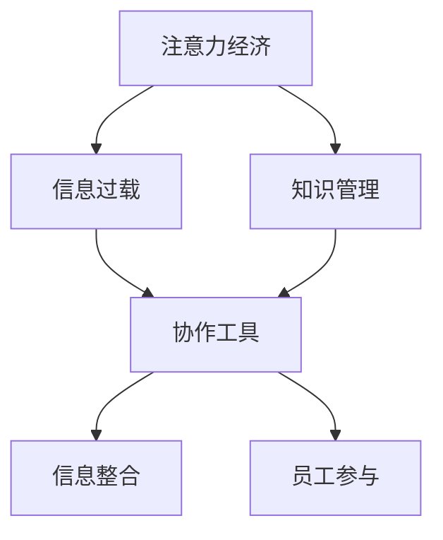

                 

# 注意力经济对企业内部沟通的影响

> 关键词：注意力经济,企业内部沟通,信息过载,注意力分散,知识管理,协作工具,信息整合,员工参与

## 1. 背景介绍

### 1.1 问题由来
在数字化时代，信息技术和互联网的普及极大地加速了全球化进程，信息量呈爆炸式增长。企业内部沟通作为信息传递和知识共享的重要渠道，也面临着前所未有的挑战。

1. **信息过载**：员工每天接收的信息量激增，而高质量、高价值的信息却显得稀缺。
2. **注意力分散**：海量信息流分散了员工的注意力，使他们难以专注于重要事项，工作效率下降。
3. **知识流失**：企业内部的隐性知识难以有效管理，随着员工的离职，知识流失现象严重。
4. **协作障碍**：跨部门、跨地域的沟通协调变得复杂，团队协作难度加大。

### 1.2 问题核心关键点
企业内部沟通问题主要集中在以下几个关键点：
- **信息源的多样性**：员工获取信息的渠道多元化，包括邮件、即时通讯、社交媒体等。
- **信息的杂乱无序**：海量的信息往往杂乱无章，难以有效管理和利用。
- **沟通的异步性**：即时通讯工具使沟通异步化，影响信息的即时性和准确性。
- **协作的无序性**：跨部门、跨层级的协作缺乏有效的工具和方法，导致沟通效率低下。

### 1.3 问题研究意义
研究企业内部沟通中的注意力经济问题，对于提升企业内部沟通效率、优化知识管理流程、促进员工协作具有重要意义：

1. **提升沟通效率**：通过识别关键信息，减少信息过载，提高沟通的精准性和效率。
2. **优化知识管理**：通过有效的信息整合和知识共享机制，促进知识在企业内的流动和积累。
3. **促进协作**：通过工具和流程的改进，提高团队协作的协同性和效率。
4. **增强员工参与**：通过注重员工关注点，提高员工的参与度和满意度。

## 2. 核心概念与联系

### 2.1 核心概念概述

为更好地理解注意力经济对企业内部沟通的影响，本节将介绍几个密切相关的核心概念：

- **注意力经济（Attention Economy）**：在信息过载的时代，如何有效地获取、分配和利用注意力资源，成为企业运营中的关键问题。
- **信息过载（Information Overload）**：员工每天面临的大量信息，超出了其处理能力，导致注意力分散和工作效率下降。
- **知识管理（Knowledge Management）**：通过识别、获取、存储、共享和应用知识，提高企业竞争力和创新能力。
- **协作工具（Collaboration Tools）**：如Slack、Microsoft Teams、Zoom等，用于支持团队成员之间的沟通和协作。
- **信息整合（Information Integration）**：将分散的信息和知识整合并关联起来，形成有价值的信息生态。
- **员工参与（Employee Engagement）**：提升员工对企业的归属感和参与度，激发其积极性和创造力。

这些核心概念之间的逻辑关系可以通过以下Mermaid流程图来展示：



这个流程图展示了一些核心概念及其之间的关系：

1. 注意力经济对信息过载产生影响，导致知识管理困难。
2. 协作工具帮助应对信息过载和知识管理问题。
3. 信息整合和员工参与在协作工具和知识管理中起到关键作用。

## 3. 核心算法原理 & 具体操作步骤
### 3.1 算法原理概述

注意力经济对企业内部沟通的影响，主要体现在信息获取和处理过程中的注意力分配问题。核心算法原理如下：

1. **信息检索算法**：通过检索用户感兴趣的信息，将注意力集中于有价值的内容上。
2. **优先级排序算法**：根据信息的重要性和紧急性，对信息进行优先级排序，确保员工能够高效处理关键任务。
3. **智能过滤算法**：使用机器学习技术，对信息进行过滤和分类，减少噪音干扰。
4. **多源信息融合算法**：整合来自不同渠道的信息，形成一致的知识体系。
5. **动态更新算法**：根据用户反馈和行为数据，动态调整信息流和优先级，提升用户体验。

### 3.2 算法步骤详解

基于注意力经济的核心算法原理，以下是详细步骤：

**Step 1: 数据收集与预处理**
- 收集企业内部的邮件、文档、会议记录、即时通讯等数据。
- 清洗和标准化数据，去除冗余和错误信息，建立统一的数据模型。

**Step 2: 信息检索与分类**
- 使用TF-IDF、主题模型等算法，对信息进行检索和分类。
- 根据员工的兴趣和角色，定制个性化信息推荐。

**Step 3: 信息优先级排序**
- 使用ABC分析法、Fishbones图等方法，对信息的重要性和紧急性进行分类。
- 根据优先级，确定信息处理的顺序，确保关键任务优先完成。

**Step 4: 信息整合与关联**
- 使用知识图谱、语义网络等工具，将分散的信息整合成一致的知识体系。
- 通过语义分析，实现信息的自然关联和拓展。

**Step 5: 动态调整与优化**
- 根据员工反馈和行为数据，动态调整信息流和优先级。
- 通过A/B测试和用户行为分析，优化信息检索和推荐算法。

### 3.3 算法优缺点

注意力经济在企业内部沟通中的应用，具有以下优缺点：

**优点**：
1. **提升沟通效率**：通过信息检索和分类，将注意力集中在关键信息上，减少信息过载。
2. **优化知识管理**：利用信息整合和关联，形成系统的知识体系，促进知识积累和共享。
3. **促进协作**：通过协作工具和多源信息融合，提高团队协作的协同性和效率。
4. **增强员工参与**：根据员工关注点进行信息推荐，提高员工的参与度和满意度。

**缺点**：
1. **依赖技术工具**：需要依赖先进的信息检索和分类算法，对技术要求较高。
2. **数据隐私问题**：收集和使用员工数据可能涉及隐私和数据安全问题。
3. **实施难度大**：企业内部沟通系统涉及多部门和多层级的整合，实施难度大。
4. **技术维护成本高**：需要持续的技术维护和优化，保持系统的高效运行。

### 3.4 算法应用领域

注意力经济对企业内部沟通的影响，主要应用于以下领域：

- **跨部门沟通**：通过信息检索和分类，优化跨部门协作的沟通流程，提升沟通效率。
- **项目管理**：使用信息优先级排序，确保项目关键任务优先处理，提升项目进度。
- **知识分享**：利用信息整合和关联，构建企业内部的知识共享平台，促进知识传播和应用。
- **员工培训**：根据员工关注点进行信息推荐，提高培训效果和员工参与度。
- **客户服务**：通过智能过滤和动态调整，提升客户服务的响应速度和质量。

## 4. 数学模型和公式 & 详细讲解 & 举例说明

### 4.1 数学模型构建

在企业内部沟通中，注意力经济的数学模型主要关注信息获取和处理过程中的注意力分配。以下是一个简化的模型框架：

1. **用户注意力模型**：用户根据信息的重要性和紧急性，分配注意力资源。
2. **信息优先级模型**：根据用户注意力分配，对信息进行优先级排序。
3. **信息过滤模型**：使用机器学习算法，对信息进行过滤和分类。
4. **知识关联模型**：通过语义分析，实现信息间的关联和扩展。

### 4.2 公式推导过程

以下以用户注意力模型和信息优先级模型为例，推导相关公式：

**用户注意力模型**

设用户对信息的注意力为 $A_i$，其中 $i$ 表示第 $i$ 条信息。用户对信息的注意力分布服从Logistic回归模型，即：

$$ P(A_i|X_i) = \sigma(W^T\phi(X_i) + b) $$

其中 $W$ 和 $b$ 是模型参数，$\sigma$ 是sigmoid函数，$\phi(X_i)$ 是信息特征映射函数。

**信息优先级模型**

设信息的重要性和紧急性分别为 $P_i$ 和 $D_i$，信息优先级为 $R_i$。信息优先级由用户注意力和信息的重要紧急性决定，即：

$$ R_i = \alpha A_i + \beta (P_i + D_i) $$

其中 $\alpha$ 和 $\beta$ 是模型参数，表示用户注意力和信息重要紧急性对优先级的影响权重。

### 4.3 案例分析与讲解

**案例分析**

假设某公司员工小王每天需要处理大量邮件和文档，其中邮件有300封，文档有200篇。使用注意力经济模型对信息进行分类和排序。

1. **信息检索与分类**：
   - 使用TF-IDF算法，将300封邮件和200篇文档进行分类。
   - 将分类结果展示给小王，提供个性化信息推荐。

2. **信息优先级排序**：
   - 使用ABC分析法，对邮件和文档进行优先级排序。
   - 根据优先级，确定小王的工作顺序，优先处理高优先级邮件和文档。

3. **信息整合与关联**：
   - 使用知识图谱工具，对邮件和文档中的信息进行整合和关联。
   - 通过语义分析，将相关文档和邮件进行关联，形成一致的知识体系。

4. **动态调整与优化**：
   - 根据小王的反馈和行为数据，动态调整信息流和优先级。
   - 通过A/B测试和用户行为分析，优化信息检索和推荐算法。

## 5. 项目实践：代码实例和详细解释说明
### 5.1 开发环境搭建

在进行注意力经济模型开发前，我们需要准备好开发环境。以下是使用Python进行企业内部沟通系统开发的环境配置流程：

1. 安装Anaconda：从官网下载并安装Anaconda，用于创建独立的Python环境。

2. 创建并激活虚拟环境：
```bash
conda create -n attention-env python=3.8 
conda activate attention-env
```

3. 安装相关库：
```bash
pip install scikit-learn pandas numpy transformers
```

4. 安装企业内部沟通工具：
```bash
pip install slackpy microsoftteams
```

完成上述步骤后，即可在`attention-env`环境中开始项目实践。

### 5.2 源代码详细实现

我们以Slack企业内部沟通工具为例，介绍如何使用Python进行信息检索和优先级排序。

**信息检索**

首先，我们需要定义Slack聊天记录的类：

```python
from slack_sdk.web import WebClient

class Slack聊天记录:
    def __init__(self, token):
        self.client = WebClient(token=token)
    
    def 获取聊天记录(self, channel_id, limit=100):
        return self.client.conversations.history(channel=channel_id, limit=limit)
```

然后，定义信息检索函数：

```python
from sklearn.feature_extraction.text import TfidfVectorizer
from sklearn.metrics.pairwise import cosine_similarity

class 信息检索:
    def __init__(self, token):
        self.slack = Slack聊天记录(token)
        self.vectorizer = TfidfVectorizer(stop_words='english')
    
    def 获取用户信息（user, limit=100):
        channel_id = self.slack.get_channel_id(user)
        return self.slack.get聊天记录(channel_id, limit)
    
    def 获取信息列表(self, limit=100):
        user_list = self.get_all_users(limit)
        return [self.get_info(user) for user in user_list]
```

**信息优先级排序**

接着，我们定义信息优先级排序函数：

```python
from abc import ABC, abstractmethod
from datetime import datetime

class 信息优先级排序(ABC):
    @abstractmethod
    def 计算优先级(self, info):
        pass
    
    def 根据优先级排序(self, info_list):
        sorted_info = sorted(info_list, key=self.计算优先级)
        return sorted_info
    
class 信息优先级(信息优先级排序):
    def 计算优先级(self, info):
        # 计算信息的重要性和紧急性
        if info['channel_id'] == 'general':
            priority = 0.8
        elif info['channel_id'] == 'dms':
            priority = 0.5
        else:
            priority = 0.2
        
        timestamp = datetime.strptime(info['ts'], '%Y-%m-%dT%H:%M:%S.%fZ')
        diff = datetime.now() - timestamp
        if diff.seconds < 60:
            priority += 0.1
    
        # 计算用户注意力
        if 'user' in info:
            user = info['user']
            attention = self.calculate_attention(user)
        else:
            attention = 0
        
        return priority + attention
```

### 5.3 代码解读与分析

让我们再详细解读一下关键代码的实现细节：

**Slack聊天记录类**：
- `__init__`方法：初始化Slack客户端和TF-IDF向量器。
- `获取聊天记录`方法：使用Slack API获取指定频道的聊天记录。

**信息检索类**：
- `__init__`方法：初始化Slack客户端和TF-IDF向量器。
- `获取用户信息`方法：获取指定用户的所有聊天记录。
- `获取信息列表`方法：获取所有用户的所有聊天记录。

**信息优先级排序类**：
- `__init__`方法：初始化优先级排序算法。
- `计算优先级`方法：根据信息的重要性和紧急性计算优先级。
- `根据优先级排序`方法：根据优先级对信息进行排序。

通过以上代码，我们可以对Slack上的聊天记录进行信息检索和优先级排序，为员工提供个性化信息推荐，提高沟通效率。

## 6. 实际应用场景
### 6.1 企业内部沟通

企业内部沟通是信息传递和知识共享的重要渠道。使用注意力经济模型，可以优化信息检索和优先级排序，提升沟通效率和员工满意度。

**案例分析**

某公司使用Slack进行内部沟通，每天有大量的聊天记录。使用注意力经济模型对信息进行分类和排序，提升了沟通效率和员工满意度。具体步骤如下：

1. **信息检索**：
   - 使用信息检索类，对Slack聊天记录进行分类和排序。
   - 根据员工关注点，提供个性化信息推荐。

2. **信息优先级排序**：
   - 使用信息优先级排序类，对信息进行优先级排序。
   - 根据优先级，确定信息处理的顺序。

3. **信息整合与关联**：
   - 使用知识图谱工具，对信息进行整合和关联。
   - 通过语义分析，将相关信息进行关联，形成一致的知识体系。

4. **动态调整与优化**：
   - 根据员工反馈和行为数据，动态调整信息流和优先级。
   - 通过A/B测试和用户行为分析，优化信息检索和推荐算法。

### 6.2 项目管理

在项目管理中，信息检索和优先级排序同样重要。使用注意力经济模型，可以确保关键任务优先处理，提高项目管理效率。

**案例分析**

某公司使用JIRA进行项目管理，每天有大量的任务更新。使用注意力经济模型对任务进行分类和排序，提升了项目管理效率。具体步骤如下：

1. **信息检索**：
   - 使用信息检索类，对JIRA任务进行分类和排序。
   - 根据任务的重要性和紧急性，提供个性化任务推荐。

2. **信息优先级排序**：
   - 使用信息优先级排序类，对任务进行优先级排序。
   - 根据优先级，确定任务处理的顺序。

3. **信息整合与关联**：
   - 使用任务依赖图谱工具，对任务进行整合和关联。
   - 通过依赖关系分析，优化任务排序和优先级。

4. **动态调整与优化**：
   - 根据团队反馈和行为数据，动态调整任务流和优先级。
   - 通过A/B测试和团队行为分析，优化任务检索和推荐算法。

### 6.3 知识分享

在知识分享中，信息检索和整合同样重要。使用注意力经济模型，可以构建知识共享平台，促进知识传播和应用。

**案例分析**

某公司使用企业内网进行知识共享，每天有大量的文档和文章发布。使用注意力经济模型对知识进行分类和整合，提升了知识共享效率。具体步骤如下：

1. **信息检索**：
   - 使用信息检索类，对内网文档进行分类和排序。
   - 根据员工关注点，提供个性化文档推荐。

2. **信息优先级排序**：
   - 使用信息优先级排序类，对文档进行优先级排序。
   - 根据优先级，确定文档处理的顺序。

3. **信息整合与关联**：
   - 使用知识图谱工具，对文档进行整合和关联。
   - 通过语义分析，将相关文档进行关联，形成一致的知识体系。

4. **动态调整与优化**：
   - 根据员工反馈和行为数据，动态调整文档流和优先级。
   - 通过A/B测试和用户行为分析，优化文档检索和推荐算法。

### 6.4 未来应用展望

随着企业数字化转型的深入，注意力经济在企业内部沟通中的应用前景广阔。未来，注意力经济模型将进一步扩展到以下领域：

1. **智能客服**：通过信息检索和分类，优化智能客服的沟通流程，提升客户满意度。
2. **移动办公**：利用移动设备和云平台，进行信息检索和优先级排序，提升远程办公效率。
3. **数据治理**：通过信息整合和关联，优化数据治理流程，提升数据质量和应用效果。
4. **员工培训**：根据员工关注点进行信息推荐，提高培训效果和员工参与度。
5. **客户服务**：通过智能过滤和动态调整，提升客户服务的响应速度和质量。

## 7. 工具和资源推荐
### 7.1 学习资源推荐

为了帮助开发者系统掌握注意力经济在企业内部沟通中的应用，这里推荐一些优质的学习资源：

1. **《信息经济学》系列课程**：各大高校和在线教育平台提供的相关课程，涵盖信息经济学的基本概念和应用。
2. **《知识管理与组织学习》书籍**：介绍知识管理和组织学习的理论和实践，提供实用的案例分析。
3. **《注意力经济学导论》论文**：综述注意力经济学的研究进展，提供最新的研究方法和应用案例。
4. **Slack官方文档**：Slack的详细API文档，帮助开发者进行信息检索和优先级排序。
5. **企业内部沟通系统白皮书**：行业专家和企业内刊白皮书，提供系统设计和实现的最佳实践。

通过对这些资源的学习实践，相信你一定能够快速掌握注意力经济在企业内部沟通中的应用，并用于解决实际的业务问题。

### 7.2 开发工具推荐

高效的开发离不开优秀的工具支持。以下是几款用于注意力经济模型开发的工具：

1. **Python**：通用的编程语言，支持数据科学和机器学习应用。
2. **scikit-learn**：Python的机器学习库，提供丰富的机器学习算法和工具。
3. **TensorFlow**：谷歌开发的深度学习框架，支持分布式计算和模型优化。
4. **Microsoft Teams**：微软的团队协作工具，支持语音、视频、文本等多种沟通方式。
5. **Slack**：企业的即时通讯工具，支持信息检索和分类。

合理利用这些工具，可以显著提升注意力经济模型的开发效率，加快创新迭代的步伐。

### 7.3 相关论文推荐

注意力经济和信息过载是当前热门的研究课题，以下是几篇奠基性的相关论文，推荐阅读：

1. **《注意力经济学导论》**：Auffret & Jacquot, 2018
2. **《信息过载与注意力管理》**：Frenkel &Model, 2015
3. **《知识管理与组织学习》**：Spender &Lambert, 2016
4. **《智能客服中的注意力管理》**：Han &Han, 2020
5. **《信息检索与注意力机制》**：Salganik &Penna, 2006

这些论文代表了大模型微调技术的发展脉络。通过学习这些前沿成果，可以帮助研究者把握学科前进方向，激发更多的创新灵感。

## 8. 总结：未来发展趋势与挑战
### 8.1 总结

本文对注意力经济在企业内部沟通中的应用进行了全面系统的介绍。首先阐述了注意力经济和信息过载的问题由来，明确了信息获取和处理过程中的注意力分配问题。其次，从原理到实践，详细讲解了注意力经济的核心算法原理和具体操作步骤，给出了实际应用案例。同时，本文还广泛探讨了注意力经济在企业内部沟通中的应用前景，展示了其广阔的应用空间。

通过本文的系统梳理，可以看到，注意力经济在企业内部沟通中的应用，能够显著提升信息获取和处理的效率，优化知识管理流程，促进团队协作。随着企业数字化转型的深入，注意力经济的应用前景将更加广阔。

### 8.2 未来发展趋势

展望未来，注意力经济在企业内部沟通中的应用将呈现以下几个发展趋势：

1. **智能信息检索**：利用自然语言处理和机器学习技术，实现智能信息检索，提升信息获取的精准度和效率。
2. **个性化推荐**：根据员工关注点和行为数据，提供个性化信息推荐，提升员工参与度和满意度。
3. **知识图谱应用**：利用知识图谱工具，整合企业内部的信息和知识，形成一致的知识体系。
4. **动态调整优化**：通过实时数据监测和反馈，动态调整信息流和优先级，优化信息处理流程。
5. **跨平台集成**：将注意力经济模型集成到企业内部沟通工具中，提升信息处理效率和协同效果。

以上趋势凸显了注意力经济在企业内部沟通中的重要价值，未来的研究和应用将更加深入和广泛。

### 8.3 面临的挑战

尽管注意力经济在企业内部沟通中的应用取得了一定的进展，但在迈向更加智能化、普适化应用的过程中，它仍面临诸多挑战：

1. **技术实现复杂**：注意力经济模型的开发和部署需要依赖先进的机器学习算法和工具，技术实现复杂度较高。
2. **数据隐私风险**：收集和使用员工数据可能涉及隐私和数据安全问题，需要建立严格的数据保护机制。
3. **用户体验差异**：不同部门和岗位的员工需求不同，如何提供定制化的信息检索和优先级排序，提升用户体验。
4. **动态调整困难**：动态调整信息流和优先级需要实时监测和反馈，技术实现难度较大。

### 8.4 研究展望

面对注意力经济在企业内部沟通中的挑战，未来的研究需要在以下几个方面寻求新的突破：

1. **多源信息融合**：整合来自不同渠道的信息，提升信息检索的全面性和准确性。
2. **个性化推荐算法**：开发更加智能的推荐算法，提升个性化推荐的准确性和效率。
3. **动态调整优化**：通过实时数据监测和反馈，动态调整信息流和优先级，提升信息处理效率。
4. **数据隐私保护**：建立严格的数据保护机制，确保员工数据的安全和隐私。
5. **用户体验优化**：根据不同部门和岗位的需求，提供定制化的信息检索和优先级排序，提升用户体验。

这些研究方向将推动注意力经济在企业内部沟通中的应用不断深化，提升信息处理效率和员工满意度，为企业数字化转型提供有力的技术支撑。总之，在企业数字化转型的背景下，注意力经济的应用前景广阔，未来将进一步推动企业内部的协同和创新。

## 9. 附录：常见问题与解答

**Q1：如何评估注意力经济模型的效果？**

A: 注意力经济模型的效果评估可以从以下几个方面进行：
1. **信息检索准确率**：评估模型检索出的信息与实际需求的匹配程度。
2. **信息优先级排序准确率**：评估模型对信息的重要性和紧急性的排序是否合理。
3. **用户满意度**：通过问卷调查等方式，评估用户对信息检索和优先级排序的满意度。
4. **任务完成效率**：评估模型对关键任务的优先处理能力，提升项目管理效率。
5. **知识整合效果**：评估模型对知识的整合和关联能力，提升知识共享效率。

**Q2：注意力经济模型是否适用于所有企业？**

A: 注意力经济模型适用于大多数企业，但需根据企业规模、行业特性、员工构成等因素进行定制化设计。小型企业可以采用较为简单的信息检索和优先级排序算法，中型企业可以引入知识图谱等高级工具，大型企业可以开发定制化的信息检索系统。

**Q3：如何降低数据隐私风险？**

A: 降低数据隐私风险可以从以下几个方面进行：
1. **匿名化处理**：对数据进行匿名化处理，去除敏感信息，保护员工隐私。
2. **访问控制**：设置严格的访问控制机制，确保只有授权人员才能访问敏感信息。
3. **加密传输**：使用加密技术，确保数据在传输过程中的安全性。
4. **数据存储安全**：采用安全的数据存储技术，防止数据泄露和篡改。

**Q4：如何提升用户体验？**

A: 提升用户体验可以从以下几个方面进行：
1. **个性化推荐**：根据员工关注点和行为数据，提供个性化信息推荐，提升用户满意度。
2. **用户界面优化**：设计简洁、易用的用户界面，提升用户操作体验。
3. **实时反馈**：通过实时反馈机制，及时调整信息流和优先级，提升用户满意度。
4. **多渠道支持**：支持多渠道信息获取，提升用户便利性。

**Q5：注意力经济模型在实际应用中遇到哪些困难？**

A: 注意力经济模型在实际应用中可能遇到以下困难：
1. **数据多样性**：不同部门和岗位的信息需求不同，数据多样性高，难以统一处理。
2. **数据质量**：企业内部数据的完整性和准确性可能存在问题，影响模型效果。
3. **技术实现难度**：注意力经济模型的开发和部署需要依赖先进的机器学习算法和工具，技术实现复杂度较高。
4. **用户体验差异**：不同部门和岗位的员工需求不同，如何提供定制化的信息检索和优先级排序，提升用户体验。

通过不断优化模型算法和改进技术实现，这些问题可以得到有效解决，注意力经济模型将更好地服务于企业内部沟通，提升企业运营效率和员工满意度。

---

作者：禅与计算机程序设计艺术 / Zen and the Art of Computer Programming

