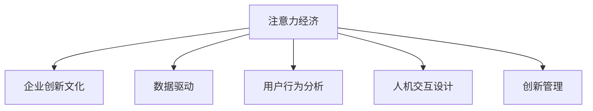

                 

# 注意力经济对企业创新文化的塑造

> 关键词：注意力经济,企业创新文化,数据驱动,用户行为分析,人机交互设计,创新管理

## 1. 背景介绍

### 1.1 问题由来

随着互联网技术的飞速发展，人类社会的经济活动已经从传统的物质经济转变为注意力经济。注意力经济指的是通过吸引和集中用户注意力来获取经济价值的经济形态。在注意力经济时代，信息过载和注意力稀缺的问题愈发严重，企业需要在纷繁复杂的信息中脱颖而出，吸引并保持用户的关注。

面对这一挑战，企业纷纷将数据和人工智能技术引入管理决策，构建基于用户行为和交互数据的决策模型，以期从海量数据中挖掘出用户的关注点和需求，进而制定更具针对性的产品策略和营销策略，提升企业的市场竞争力和品牌影响力。

### 1.2 问题核心关键点

注意力经济的核心在于如何通过数据分析和人工智能技术，深入理解用户的行为和需求，以吸引和保持用户注意力。这一过程涉及多个环节：

- **数据采集**：收集用户在网络平台上的行为数据（如浏览记录、搜索历史、点击行为等），获取用户对内容的兴趣和偏好。
- **数据处理**：对原始数据进行清洗、去重、归一化等处理，去除噪音数据，提炼出有价值的信息。
- **数据建模**：构建基于机器学习的预测模型，通过历史数据预测用户未来的行为和偏好。
- **结果应用**：根据预测结果，制定产品策略和营销策略，引导用户注意力的流向。

本文将围绕注意力经济的这些关键环节，深入探讨企业如何通过数据和人工智能技术，构建和优化创新文化，提升企业创新能力和市场竞争力。

## 2. 核心概念与联系

### 2.1 核心概念概述

为更好地理解注意力经济对企业创新文化的塑造，本节将介绍几个密切相关的核心概念：

- **注意力经济**：指的是通过吸引和集中用户注意力来获取经济价值的经济形态。注意力成为商品，用户通过时间和精力的投入，获得相应的信息和价值。

- **企业创新文化**：指的是企业内部推崇创新、鼓励尝试的企业文化氛围。创新文化强调开放、合作、探索和持续改进，是企业持续发展的动力源泉。

- **数据驱动**：指的是利用数据进行决策和优化，数据成为支持决策和创新的重要依据。

- **用户行为分析**：通过分析用户在网络平台上的行为数据，理解用户需求和偏好，为产品策略和营销策略提供依据。

- **人机交互设计**：设计用户与机器互动的界面和流程，提升用户体验，促进用户粘性和忠诚度。

- **创新管理**：指的是通过系统化的方法和工具，促进企业的创新过程，提升创新效率和效果。

这些核心概念之间的逻辑关系可以通过以下Mermaid流程图来展示：



这个流程图展示出注意力经济对企业创新文化的塑造过程：

1. 注意力经济通过数据驱动，依赖用户行为分析，设计人机交互界面，进而促进企业创新文化。
2. 数据驱动和用户行为分析为人机交互设计和创新管理提供数据支撑。
3. 人机交互设计和创新管理共同构成企业创新实践，进一步推动注意力经济的发展。

这些概念共同构成了企业注意力经济的核心框架，为企业利用数据和人工智能技术，构建和优化创新文化提供了方向。

## 3. 核心算法原理 & 具体操作步骤
### 3.1 算法原理概述

基于数据驱动和人工智能技术的注意力经济，其核心在于构建和优化用户行为预测模型，实现对用户注意力流向的精确引导。

形式化地，假设企业收集到用户行为数据集 $D=\{(x_i, y_i)\}_{i=1}^N$，其中 $x_i$ 为输入的用户行为特征，$y_i$ 为输出的用户注意力标记。企业通过构建和优化预测模型 $f$，最小化损失函数 $\mathcal{L}(f)$，使得模型输出与真实标记尽可能一致。

数学表达如下：

$$
\hat{y}_i = f(x_i) \\
\mathcal{L}(f) = \frac{1}{N} \sum_{i=1}^N \ell(\hat{y}_i, y_i)
$$

其中 $\ell(\cdot,\cdot)$ 为损失函数，如交叉熵损失。

### 3.2 算法步骤详解

基于注意力经济的预测模型构建和优化，一般包括以下几个关键步骤：

**Step 1: 数据预处理**

- 收集用户行为数据：获取用户在社交媒体、电商平台、内容平台等网络平台上的行为记录。
- 数据清洗与处理：去除噪音数据，对原始数据进行归一化、去重、填补缺失值等处理。
- 特征工程：提取用户行为特征，如浏览记录、搜索历史、点击行为等。

**Step 2: 构建预测模型**

- 选择合适的机器学习算法，如随机森林、梯度提升树、神经网络等。
- 划分训练集、验证集和测试集，确保模型的泛化能力。
- 训练模型，使用交叉验证、网格搜索等方法调整模型参数。

**Step 3: 结果评估与优化**

- 在验证集上评估模型性能，使用AUC、准确率、召回率等指标。
- 根据评估结果，优化模型结构或调整算法参数，进行迭代训练。
- 在测试集上最终评估模型性能，确保模型在新数据上的泛化能力。

**Step 4: 结果应用**

- 根据模型预测结果，制定产品策略和营销策略，引导用户注意力流向。
- 在实际应用中持续收集数据，进行模型迭代和优化，提升预测准确性。
- 结合人机交互设计，优化用户体验，促进用户粘性和忠诚度。

### 3.3 算法优缺点

基于注意力经济的预测模型，具有以下优点：

1. **精准预测**：通过分析大量历史数据，预测用户未来的行为和偏好，可以精准引导用户注意力。
2. **实时响应**：数据驱动模型可以实时响应用户行为变化，快速调整策略。
3. **个性化推荐**：根据用户个性化特征，提供定制化的内容和服务。
4. **高效运营**：优化广告投放、推荐算法等运营环节，提高运营效率。

但同时，也存在一些局限性：

1. **数据隐私问题**：用户行为数据涉及隐私，获取和使用数据需要遵守相关法律法规。
2. **模型泛化性**：模型可能过度拟合训练数据，泛化性能有限。
3. **算法复杂性**：构建和优化预测模型需要一定的算法和数据处理技术。
4. **成本高昂**：数据采集和处理成本较高，对企业技术能力要求高。
5. **动态变化**：用户行为和偏好随时间变化，需要持续监控和调整模型。

尽管存在这些局限性，基于数据驱动和人工智能技术的预测模型仍然是大企业提升市场竞争力的重要手段。未来相关研究的重点在于如何进一步降低数据获取和使用成本，提高模型泛化性和算法的可解释性，同时兼顾隐私保护和动态变化等问题。

### 3.4 算法应用领域

基于注意力经济的预测模型，在多个领域得到了广泛的应用，如：

- **电商推荐**：根据用户浏览和购买历史，推荐相关商品，提升转化率和销售额。
- **内容推送**：分析用户阅读和互动行为，推送个性化的新闻、文章、视频等内容。
- **广告投放**：预测用户点击和转化概率，优化广告投放策略，提高广告效果和ROI。
- **客户服务**：通过用户行为数据，预测客户需求，提升客户满意度和忠诚度。
- **市场分析**：分析用户行为和偏好，了解市场趋势和用户需求，制定营销策略。

除了上述这些经典应用外，注意力经济还被创新性地应用到更多场景中，如智能家居、智能制造、健康医疗等，为企业数字化转型提供了新的思路。

## 4. 数学模型和公式 & 详细讲解 & 举例说明
### 4.1 数学模型构建

本节将使用数学语言对注意力经济的用户行为预测模型进行更加严格的刻画。

假设企业收集到用户行为数据集 $D=\{(x_i, y_i)\}_{i=1}^N$，其中 $x_i \in \mathbb{R}^d$ 为输入特征向量，$y_i \in \{0,1\}$ 为输出标记。

定义模型 $f$ 在数据样本 $(x,y)$ 上的损失函数为 $\ell(f(x),y)$，则在数据集 $D$ 上的经验风险为：

$$
\mathcal{L}(f) = \frac{1}{N} \sum_{i=1}^N \ell(f(x_i),y_i)
$$

在实践中，我们通常使用基于梯度的优化算法（如随机梯度下降、Adam等）来近似求解上述最优化问题。设 $\eta$ 为学习率，$\lambda$ 为正则化系数，则参数的更新公式为：

$$
f \leftarrow f - \eta \nabla_{f}\mathcal{L}(f) - \eta\lambda f
$$

其中 $\nabla_{f}\mathcal{L}(f)$ 为损失函数对模型 $f$ 的梯度，可通过反向传播算法高效计算。

### 4.2 公式推导过程

以下我们以二分类任务为例，推导交叉熵损失函数及其梯度的计算公式。

假设模型 $f$ 在输入 $x$ 上的输出为 $\hat{y}=f(x) \in [0,1]$，表示样本属于正类的概率。真实标签 $y \in \{0,1\}$。则二分类交叉熵损失函数定义为：

$$
\ell(f(x),y) = -[y\log \hat{y} + (1-y)\log (1-\hat{y})]
$$

将其代入经验风险公式，得：

$$
\mathcal{L}(f) = -\frac{1}{N}\sum_{i=1}^N [y_i\log f(x_i)+(1-y_i)\log(1-f(x_i))]
$$

根据链式法则，损失函数对模型 $f$ 的梯度为：

$$
\frac{\partial \mathcal{L}(f)}{\partial f(x)} = -\frac{1}{N}\sum_{i=1}^N (\frac{y_i}{f(x_i)}-\frac{1-y_i}{1-f(x_i)}) \frac{\partial f(x)}{\partial x}
$$

其中 $\frac{\partial f(x)}{\partial x}$ 可进一步递归展开，利用自动微分技术完成计算。

在得到损失函数的梯度后，即可带入参数更新公式，完成模型的迭代优化。重复上述过程直至收敛，最终得到适应数据集 $D$ 的最优模型 $f^*$。

### 4.3 案例分析与讲解

假设某电商平台的推荐系统，使用深度神经网络进行用户行为预测。模型输入为用户的浏览记录 $x_i$，输出为是否购买该商品的标签 $y_i$。

- **数据预处理**：
  - 收集用户浏览记录，提取特征如浏览时间、浏览次数、浏览类别等。
  - 去除异常数据和噪音数据，确保数据质量。
  - 对数据进行归一化和标准化处理，避免数据尺度的影响。

- **模型构建**：
  - 设计多层感知器网络，包括输入层、隐藏层和输出层。
  - 使用交叉熵损失函数，评估模型预测结果与真实标签的一致性。
  - 在训练集上使用随机梯度下降优化算法，调整模型参数，最小化损失函数。

- **结果评估**：
  - 在验证集上评估模型性能，计算AUC、准确率、召回率等指标。
  - 使用混淆矩阵分析模型的预测效果，调整模型参数和优化算法。
  - 在测试集上最终评估模型性能，确保模型的泛化能力。

- **结果应用**：
  - 根据模型预测结果，推荐用户可能感兴趣的商品。
  - 实时更新推荐算法，根据用户反馈调整推荐策略。
  - 结合用户行为数据和个性化特征，提升推荐精度和用户满意度。

通过以上步骤，电商平台可以构建一个基于用户行为预测的推荐系统，精准引导用户注意力，提升用户转化率和满意度。

## 5. 项目实践：代码实例和详细解释说明
### 5.1 开发环境搭建

在进行项目实践前，我们需要准备好开发环境。以下是使用Python进行PyTorch开发的环境配置流程：

1. 安装Anaconda：从官网下载并安装Anaconda，用于创建独立的Python环境。

2. 创建并激活虚拟环境：
```bash
conda create -n pytorch-env python=3.8 
conda activate pytorch-env
```

3. 安装PyTorch：根据CUDA版本，从官网获取对应的安装命令。例如：
```bash
conda install pytorch torchvision torchaudio cudatoolkit=11.1 -c pytorch -c conda-forge
```

4. 安装必要的第三方库：
```bash
pip install pandas numpy matplotlib sklearn
```

5. 安装PyTorch的交互式环境Jupyter Notebook：
```bash
pip install jupyter notebook
```

完成上述步骤后，即可在`pytorch-env`环境中开始项目实践。

### 5.2 源代码详细实现

下面我们以电商推荐任务为例，给出使用PyTorch进行用户行为预测的完整代码实现。

首先，定义数据集和特征工程函数：

```python
import pandas as pd
import numpy as np

# 读取数据集
data = pd.read_csv('user_behavior.csv')

# 特征工程
def preprocess_data(data):
    # 处理缺失值
    data.fillna(method='ffill', inplace=True)
    
    # 特征编码
    data['category'] = data['category'].map({1: 'category1', 2: 'category2', 3: 'category3'})
    
    # 特征归一化
    data['duration'] = (data['duration'] - data['duration'].mean()) / data['duration'].std()
    
    return data

# 数据预处理
data = preprocess_data(data)
```

然后，定义神经网络模型：

```python
import torch
import torch.nn as nn
import torch.optim as optim

# 定义模型
class BehaviorPredictor(nn.Module):
    def __init__(self, input_dim, hidden_dim, output_dim):
        super(BehaviorPredictor, self).__init__()
        self.fc1 = nn.Linear(input_dim, hidden_dim)
        self.fc2 = nn.Linear(hidden_dim, hidden_dim)
        self.fc3 = nn.Linear(hidden_dim, output_dim)
        self.relu = nn.ReLU()
    
    def forward(self, x):
        x = self.fc1(x)
        x = self.relu(x)
        x = self.fc2(x)
        x = self.relu(x)
        x = self.fc3(x)
        return x

# 创建模型
input_dim = 5  # 特征维度
hidden_dim = 10
output_dim = 1  # 标签维度

model = BehaviorPredictor(input_dim, hidden_dim, output_dim)
```

接着，定义损失函数和优化器：

```python
# 定义损失函数
criterion = nn.BCELoss()

# 定义优化器
optimizer = optim.Adam(model.parameters(), lr=0.001)
```

然后，定义训练和评估函数：

```python
# 定义训练函数
def train_model(model, data, optimizer, num_epochs):
    for epoch in range(num_epochs):
        for i, (inputs, labels) in enumerate(data):
            inputs = inputs.to(device)
            labels = labels.to(device)
            
            # 前向传播
            outputs = model(inputs)
            loss = criterion(outputs, labels)
            
            # 反向传播
            optimizer.zero_grad()
            loss.backward()
            optimizer.step()
            
            if (i+1) % 100 == 0:
                print(f'Epoch [{epoch+1}/{num_epochs}], Step [{i+1}/{len(data)}], Loss: {loss.item():.4f}')

# 定义评估函数
def evaluate_model(model, data, num_epochs):
    total_loss = 0
    correct = 0
    with torch.no_grad():
        for i, (inputs, labels) in enumerate(data):
            inputs = inputs.to(device)
            labels = labels.to(device)
            
            # 前向传播
            outputs = model(inputs)
            loss = criterion(outputs, labels)
            
            # 计算损失和精度
            total_loss += loss.item()
            _, predicted = torch.max(outputs, 1)
            correct += (predicted == labels).sum().item()
    
    accuracy = correct / (len(data) * output_dim)
    print(f'Accuracy: {accuracy:.4f}')
```

最后，启动训练流程并在测试集上评估：

```python
# 加载数据集
data = pd.read_csv('user_behavior.csv')

# 数据预处理
data = preprocess_data(data)

# 划分训练集和测试集
train_data, test_data = train_test_split(data, test_size=0.2, random_state=42)

# 模型训练
train_model(model, train_data, optimizer, num_epochs=10)

# 模型评估
evaluate_model(model, test_data, num_epochs=10)
```

以上就是使用PyTorch进行电商推荐任务用户行为预测的完整代码实现。可以看到，得益于PyTorch的强大封装，我们可以用相对简洁的代码完成神经网络的构建和训练。

### 5.3 代码解读与分析

让我们再详细解读一下关键代码的实现细节：

**数据预处理函数**：
- `preprocess_data`函数：对原始数据进行缺失值处理、特征编码和归一化等预处理操作。

**神经网络模型**：
- `BehaviorPredictor`类：定义了一个简单的多层感知器网络，包括输入层、隐藏层和输出层，使用ReLU激活函数。
- `forward`方法：实现了前向传播过程，通过多层线性变换和激活函数计算输出。

**损失函数和优化器**：
- `nn.BCELoss`：定义二分类交叉熵损失函数，用于评估模型预测结果与真实标签的一致性。
- `Adam`优化器：使用随机梯度下降优化算法，调整模型参数，最小化损失函数。

**训练和评估函数**：
- `train_model`函数：对数据集进行迭代训练，每100步输出一次损失，以监控训练进度。
- `evaluate_model`函数：在测试集上评估模型性能，计算损失和准确率。

**训练流程**：
- 定义总的训练轮数，开始循环迭代
- 每个epoch内，对训练集数据进行批次化加载，每个batch前向传播计算损失并反向传播更新模型参数
- 在测试集上评估模型性能，输出准确率

可以看到，PyTorch配合TensorFlow库使得神经网络的构建和训练过程变得简洁高效。开发者可以将更多精力放在特征工程、模型设计等高层逻辑上，而不必过多关注底层的实现细节。

当然，工业级的系统实现还需考虑更多因素，如模型的保存和部署、超参数的自动搜索、更灵活的任务适配层等。但核心的注意力经济模型构建和优化方法基本与此类似。

## 6. 实际应用场景
### 6.1 智能客服系统

基于用户行为预测的智能客服系统，可以显著提升客服效率和用户体验。传统客服往往需要配备大量人力，高峰期响应缓慢，且一致性和专业性难以保证。而使用基于用户行为预测的推荐系统，可以7x24小时不间断服务，快速响应客户咨询，用个性化的服务提升用户满意度。

在技术实现上，可以收集企业内部的历史客服对话记录，将问题和最佳答复构建成监督数据，在此基础上对神经网络模型进行微调。微调后的推荐系统能够自动理解用户意图，匹配最合适的答复模板进行回复。对于客户提出的新问题，还可以接入检索系统实时搜索相关内容，动态组织生成回答。如此构建的智能客服系统，能大幅提升客户咨询体验和问题解决效率。

### 6.2 金融舆情监测

金融机构需要实时监测市场舆论动向，以便及时应对负面信息传播，规避金融风险。传统的人工监测方式成本高、效率低，难以应对网络时代海量信息爆发的挑战。基于用户行为预测的文本分类和情感分析技术，为金融舆情监测提供了新的解决方案。

具体而言，可以收集金融领域相关的新闻、报道、评论等文本数据，并对其进行主题标注和情感标注。在此基础上对神经网络模型进行微调，使其能够自动判断文本属于何种主题，情感倾向是正面、中性还是负面。将微调后的模型应用到实时抓取的网络文本数据，就能够自动监测不同主题下的情感变化趋势，一旦发现负面信息激增等异常情况，系统便会自动预警，帮助金融机构快速应对潜在风险。

### 6.3 个性化推荐系统

当前的推荐系统往往只依赖用户的历史行为数据进行物品推荐，无法深入理解用户的真实兴趣偏好。基于用户行为预测的个性化推荐系统，可以更好地挖掘用户行为背后的语义信息，从而提供更精准、多样的推荐内容。

在实践中，可以收集用户浏览、点击、评论、分享等行为数据，提取和用户交互的物品标题、描述、标签等文本内容。将文本内容作为模型输入，用户的后续行为（如是否点击、购买等）作为监督信号，在此基础上微调神经网络模型。微调后的模型能够从文本内容中准确把握用户的兴趣点。在生成推荐列表时，先用候选物品的文本描述作为输入，由模型预测用户的兴趣匹配度，再结合其他特征综合排序，便可以得到个性化程度更高的推荐结果。

### 6.4 未来应用展望

随着神经网络模型和用户行为预测技术的不断发展，基于注意力经济的预测模型将在更多领域得到应用，为传统行业带来变革性影响。

在智慧医疗领域，基于用户行为预测的医疗问答、病历分析、药物研发等应用将提升医疗服务的智能化水平，辅助医生诊疗，加速新药开发进程。

在智能教育领域，基于用户行为预测的学习推荐系统，可以为学生提供个性化的学习资源和作业推荐，因材施教，促进教育公平，提高教学质量。

在智慧城市治理中，基于用户行为预测的城市事件监测、舆情分析、应急指挥等应用，可以提高城市管理的自动化和智能化水平，构建更安全、高效的未来城市。

此外，在企业生产、社会治理、文娱传媒等众多领域，基于用户行为预测的人工智能应用也将不断涌现，为经济社会发展注入新的动力。相信随着技术的日益成熟，用户行为预测方法将成为人工智能落地应用的重要范式，推动人工智能技术在垂直行业的规模化落地。总之，用户行为预测和注意力经济的应用，将显著提升各行业的数字化转型进程，为构建智能社会提供坚实的基础。

## 7. 工具和资源推荐
### 7.1 学习资源推荐

为了帮助开发者系统掌握注意力经济的理论和实践，这里推荐一些优质的学习资源：

1. 《深度学习》（Goodfellow等）：经典的深度学习教材，涵盖从基础到高级的深度学习算法和模型。
2. 《Python深度学习》（Francois等）：基于Python的深度学习实践指南，提供丰富的代码示例和项目案例。
3. 《人工智能导论》（Goodman等）：介绍人工智能的基本概念和前沿技术，涵盖机器学习、自然语言处理等领域。
4. 《深度学习与大数据》（Hinton等）：讲解深度学习在大数据环境下的应用，包括特征工程、模型优化等。
5. Coursera上的《机器学习》（Andrew Ng）：斯坦福大学开设的机器学习课程，涵盖从基础到高级的机器学习算法和应用。

通过对这些资源的学习实践，相信你一定能够快速掌握用户行为预测和注意力经济的核心技术和应用思路，并用于解决实际的NLP问题。
###  7.2 开发工具推荐

高效的开发离不开优秀的工具支持。以下是几款用于用户行为预测开发的常用工具：

1. PyTorch：基于Python的开源深度学习框架，灵活动态的计算图，适合快速迭代研究。大多数预训练语言模型都有PyTorch版本的实现。
2. TensorFlow：由Google主导开发的开源深度学习框架，生产部署方便，适合大规模工程应用。同样有丰富的预训练语言模型资源。
3. Jupyter Notebook：交互式的开发环境，支持代码编写、模型训练和结果展示，是数据科学和机器学习领域的主流工具。
4. Keras：基于TensorFlow和Theano的高层API，提供了简单易用的接口，可以快速构建深度学习模型。
5. Scikit-learn：Python的机器学习库，提供了丰富的机器学习算法和工具，适合数据预处理和模型评估。
6. Weights & Biases：模型训练的实验跟踪工具，可以记录和可视化模型训练过程中的各项指标，方便对比和调优。

合理利用这些工具，可以显著提升用户行为预测任务的开发效率，加快创新迭代的步伐。

### 7.3 相关论文推荐

用户行为预测和注意力经济的发展源于学界的持续研究。以下是几篇奠基性的相关论文，推荐阅读：

1. Caffeine: Practical High-Performance Distributed Machine Learning：介绍了一个分布式机器学习框架Caffeine，通过分布式计算加速大规模数据集上的机器学习任务。
2. A Survey of Machine Learning in Healthcare：综述了机器学习在医疗领域的应用，包括图像识别、基因分析、疾病预测等。
3. Scalable Learning with Online Consensus Algorithms：提出了一种基于共识算法的分布式机器学习框架，提高了模型的可扩展性和效率。
4. Multi-Task Learning with Co-Attention for Healthcare Multi-Label Classification：提出了一种多任务学习框架，通过协同注意力机制提高了医疗领域多标签分类的效果。
5. On the Power and Limits of Multi-task Learning：探讨了多任务学习在各种应用场景中的效果和局限性，提供了丰富的实验结果和理论分析。

这些论文代表了大模型微调技术的发展脉络。通过学习这些前沿成果，可以帮助研究者把握学科前进方向，激发更多的创新灵感。

## 8. 总结：未来发展趋势与挑战

### 8.1 总结

本文对基于用户行为预测的注意力经济进行了全面系统的介绍。首先阐述了注意力经济对企业创新文化的塑造，明确了用户行为预测在构建和优化创新文化中的关键作用。其次，从原理到实践，详细讲解了用户行为预测的数学原理和关键步骤，给出了用户行为预测任务开发的完整代码实例。同时，本文还广泛探讨了用户行为预测在智能客服、金融舆情、个性化推荐等多个领域的应用前景，展示了用户行为预测范式的巨大潜力。此外，本文精选了用户行为预测技术的各类学习资源，力求为读者提供全方位的技术指引。

通过本文的系统梳理，可以看到，用户行为预测和注意力经济在企业数字化转型中扮演了重要的角色，为传统行业带来了新的活力和发展机遇。未来，伴随用户行为预测技术的持续演进，企业将能够更精准地理解用户需求，提供更个性化、高效的服务，进一步提升市场竞争力和品牌影响力。

### 8.2 未来发展趋势

展望未来，用户行为预测和注意力经济技术将呈现以下几个发展趋势：

1. **多模态融合**：除了文本数据外，还应结合图像、音频等多模态数据进行用户行为预测，提升预测的准确性和鲁棒性。
2. **实时响应**：基于流式数据的用户行为预测，能够实时响应用户行为变化，动态调整推荐策略。
3. **分布式计算**：面对海量数据和高并发请求，分布式计算框架如Spark、Hadoop等将发挥重要作用，提升预测模型的可扩展性。
4. **自适应学习**：根据用户反馈和行为变化，动态调整模型参数和优化策略，提高预测精度和模型泛化能力。
5. **跨领域应用**：用户行为预测技术将更多地应用于医疗、教育、智能制造等垂直领域，推动这些行业的数字化转型。

以上趋势凸显了用户行为预测和注意力经济的广阔前景。这些方向的探索发展，必将进一步提升预测模型的性能和应用范围，为构建智能社会提供坚实的技术基础。

### 8.3 面临的挑战

尽管用户行为预测和注意力经济技术已经取得了瞩目成就，但在迈向更加智能化、普适化应用的过程中，它仍面临着诸多挑战：

1. **数据隐私问题**：用户行为数据涉及隐私，获取和使用数据需要遵守相关法律法规。如何平衡用户隐私保护和企业数据利用，是一大难题。
2. **模型泛化性**：模型可能过度拟合训练数据，泛化性能有限。如何在保证预测精度的同时，提高模型的泛化能力，是一大挑战。
3. **算法复杂性**：构建和优化预测模型需要一定的算法和数据处理技术。如何降低算法复杂度，提高模型训练和推理效率，是一大挑战。
4. **动态变化**：用户行为和偏好随时间变化，需要持续监控和调整模型。如何实时更新模型，应对动态变化的用户需求，是一大挑战。
5. **技术门槛高**：用户行为预测和注意力经济的应用需要较高的技术门槛，如何降低技术门槛，推广应用，是一大挑战。

尽管存在这些挑战，用户行为预测和注意力经济仍然是大企业提升市场竞争力的重要手段。未来相关研究的重点在于如何进一步降低数据获取和使用成本，提高模型泛化性和算法的可解释性，同时兼顾隐私保护和动态变化等问题。

### 8.4 研究展望

面对用户行为预测和注意力经济所面临的种种挑战，未来的研究需要在以下几个方面寻求新的突破：

1. **无监督学习和半监督学习**：摆脱对大规模标注数据的依赖，利用自监督学习、主动学习等无监督和半监督范式，最大限度利用非结构化数据，实现更加灵活高效的预测。
2. **参数高效和计算高效的预测方法**：开发更加参数高效的预测方法，如自适应学习、知识蒸馏等，在固定大部分预训练参数的情况下，只更新极少量的任务相关参数。同时优化预测模型的计算图，减少前向传播和反向传播的资源消耗，实现更加轻量级、实时性的部署。
3. **跨领域融合**：将符号化的先验知识，如知识图谱、逻辑规则等，与神经网络模型进行巧妙融合，引导预测过程学习更准确、合理的用户行为模型。同时加强不同模态数据的整合，实现视觉、语音等多模态信息与文本信息的协同建模。
4. **因果分析和博弈论工具**：将因果分析方法引入预测模型，识别出模型决策的关键特征，增强预测结果的因果性和逻辑性。借助博弈论工具刻画人机交互过程，主动探索并规避模型的脆弱点，提高系统稳定性。

这些研究方向的探索，必将引领用户行为预测和注意力经济技术迈向更高的台阶，为构建智能社会提供坚实的技术基础。面向未来，用户行为预测和注意力经济技术还需要与其他人工智能技术进行更深入的融合，如知识表示、因果推理、强化学习等，多路径协同发力，共同推动人工智能技术在垂直行业的规模化落地。只有勇于创新、敢于突破，才能不断拓展用户行为预测和注意力经济的边界，让智能技术更好地造福人类社会。

## 9. 附录：常见问题与解答

**Q1：用户行为预测是否适用于所有NLP任务？**

A: 用户行为预测在大多数NLP任务上都能取得不错的效果，特别是对于数据量较小的任务。但对于一些特定领域的任务，如医学、法律等，仅仅依靠通用语料预训练的模型可能难以很好地适应。此时需要在特定领域语料上进一步预训练，再进行微调，才能获得理想效果。此外，对于一些需要时效性、个性化很强的任务，如对话、推荐等，用户行为预测方法也需要针对性的改进优化。

**Q2：如何选择合适的学习率？**

A: 用户行为预测的学习率一般要比预训练时小1-2个数量级，如果使用过大的学习率，容易破坏预训练权重，导致过拟合。一般建议从1e-5开始调参，逐步减小学习率，直至收敛。也可以使用warmup策略，在开始阶段使用较小的学习率，再逐渐过渡到预设值。需要注意的是，不同的优化器(如AdamW、Adafactor等)以及不同的学习率调度策略，可能需要设置不同的学习率阈值。

**Q3：用户行为预测面临哪些资源瓶颈？**

A: 用户行为预测模型涉及大量数据的采集和处理，对算力、内存、存储都提出了很高的要求。GPU/TPU等高性能设备是必不可少的，但即便如此，超大批次的训练和推理也可能遇到显存不足的问题。因此需要采用一些资源优化技术，如梯度积累、混合精度训练、模型并行等，来突破硬件瓶颈。同时，模型的存储和读取也可能占用大量时间和空间，需要采用模型压缩、稀疏化存储等方法进行优化。

**Q4：如何缓解用户行为预测的过拟合问题？**

A: 过拟合是用户行为预测面临的主要挑战，尤其是在标注数据不足的情况下。常见的缓解策略包括：
1. 数据增强：通过回译、近义替换等方式扩充训练集
2. 正则化：使用L2正则、Dropout、Early Stopping等避免过拟合
3. 对抗训练：引入对抗样本，提高模型鲁棒性
4. 参数高效微调：只调整少量参数(如Adapter、Prefix等)，减小过拟合风险
5. 多模型集成：训练多个预测模型，取平均输出，抑制过拟合

这些策略往往需要根据具体任务和数据特点进行灵活组合。只有在数据、模型、训练、推理等各环节进行全面优化，才能最大限度地发挥用户行为预测模型的潜力。

**Q5：用户行为预测在落地部署时需要注意哪些问题？**

A: 将用户行为预测模型转化为实际应用，还需要考虑以下因素：
1. 模型裁剪：去除不必要的层和参数，减小模型尺寸，加快推理速度
2. 量化加速：将浮点模型转为定点模型，压缩存储空间，提高计算效率
3. 服务化封装：将模型封装为标准化服务接口，便于集成调用
4. 弹性伸缩：根据请求流量动态调整资源配置，平衡服务质量和成本
5. 监控告警：实时采集系统指标，设置异常告警阈值，确保服务稳定性
6. 安全防护：采用访问鉴权、数据脱敏等措施，保障数据和模型安全

用户行为预测和注意力经济的应用，需要从数据、算法、工程、业务等多个维度协同发力，才能真正实现人工智能技术在垂直行业的规模化落地。总之，用户行为预测需要开发者根据具体任务，不断迭代和优化模型、数据和算法，方能得到理想的效果。

---

作者：禅与计算机程序设计艺术 / Zen and the Art of Computer Programming

