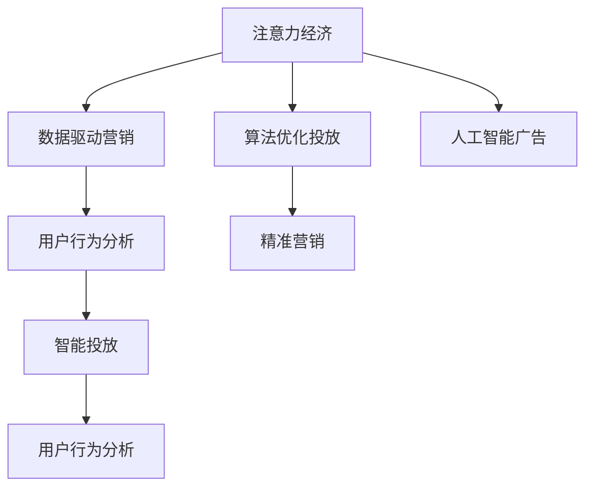

                 

# 注意力经济对传统商业广告的改造

> 关键词：注意力经济, 商业广告, 数据驱动, 算法优化, 人工智能, 精准营销, 广告效果评估, 智能投放, 用户行为分析, 社交媒体广告, 数据隐私

## 1. 背景介绍

在传统商业广告的海洋中，商家们孜孜不倦地投下海量资金，以期在受众群体中产生影响。然而，由于信息爆炸和注意力稀缺，传统广告的“一网捞鱼”策略往往难以高效实现精准投放，且广告费用回报率低、投放效果难以追踪等问题层出不穷。

近年来，随着大数据、云计算、人工智能等技术的迅猛发展，一个崭新的商业广告模式——“注意力经济”应运而生。注意力经济充分利用数据分析、算法优化和人工智能技术，实现对用户注意力的精准捕捉与高效利用，从而大幅提升广告投放的精准性和效果。

本文将深入探讨注意力经济的概念、核心算法与具体操作步骤，并结合案例分析其在商业广告领域的应用，最后探讨其面临的挑战与未来发展趋势。

## 2. 核心概念与联系

### 2.1 核心概念概述

为了更好地理解注意力经济如何改造传统商业广告，本节将介绍几个关键概念及其联系：

- **注意力经济**：在信息过载时代，用户注意力成为稀缺资源。注意力经济强调通过数据分析、算法优化和人工智能技术，精准获取并有效利用用户注意力，实现高效的商业广告投放。

- **数据驱动营销**：利用大数据分析技术，深入挖掘用户行为数据，理解用户需求和偏好，从而优化广告策略，实现精准营销。

- **算法优化投放**：通过机器学习算法，构建预测模型，预测用户对不同广告的反应，实现智能广告投放和优化，提升广告效果。

- **人工智能广告**：利用人工智能技术，包括自然语言处理、计算机视觉、机器学习等，提升广告内容生成、用户行为分析和广告效果评估等环节的智能化水平。

- **精准营销**：通过精准分析用户特征和行为，实现个性化广告推荐，提升广告的点击率和转化率。

- **用户行为分析**：利用用户行为数据，分析用户偏好、兴趣点等，为广告投放提供依据，实现用户画像的构建和精细化管理。

- **智能投放**：基于用户画像和行为分析，智能推荐广告素材，调整投放策略，实现广告的高效精准投放。

这些概念通过一定的逻辑关系连接起来，共同构成了注意力经济的整体框架。

### 2.2 核心概念原理和架构的 Mermaid 流程图



## 3. 核心算法原理 & 具体操作步骤

### 3.1 算法原理概述

注意力经济的核心理念是通过数据和技术手段，精准捕捉并高效利用用户的注意力资源。该过程大致分为以下几个步骤：

1. **用户画像构建**：利用用户行为数据（如浏览历史、购买记录等），构建详细的用户画像，理解用户特征和需求。
2. **广告素材生成**：通过自然语言处理、计算机视觉等技术，生成多样化的广告内容，提升广告的吸引力和点击率。
3. **用户注意力预测**：利用机器学习算法，构建预测模型，预测用户对不同广告的关注度和反应，指导广告投放策略。
4. **智能投放与优化**：基于预测结果和用户画像，实现广告的智能投放和优化，提升广告效果。

### 3.2 算法步骤详解

#### 3.2.1 用户画像构建

用户画像的构建是注意力经济的基础。其步骤包括：

1. **数据收集**：从不同渠道（如社交媒体、电商平台、搜索平台等）收集用户的浏览历史、搜索记录、购买行为、社交互动等信息。
2. **数据清洗与预处理**：对收集的数据进行清洗、去重和格式转换，确保数据的准确性和一致性。
3. **特征提取与建模**：使用特征工程技术，从数据中提取有用的特征，如用户的兴趣标签、行为频次、地理位置等。通过聚类、分类等模型，构建用户画像，表示用户的基本特征和行为模式。

#### 3.2.2 广告素材生成

广告素材的生成是吸引用户注意力的关键。常用的方法包括：

1. **文本生成**：利用自然语言处理技术，生成具有吸引力的文本广告。常见技术包括基于GAN的生成式对话系统、基于Transformer的文本生成模型等。
2. **视觉生成**：使用计算机视觉技术，生成具有视觉冲击力的图像或视频广告。常见技术包括GAN、风格迁移等。
3. **多媒体融合**：结合文本和视觉生成技术，创作图文并茂的多媒体广告，提升广告的视觉和听觉效果。

#### 3.2.3 用户注意力预测

用户注意力预测是实现精准投放的关键步骤。通过以下步骤构建预测模型：

1. **特征工程**：将用户画像中的特征提取为预测模型所需的输入特征。
2. **模型选择与训练**：选择合适的机器学习模型，如逻辑回归、随机森林、梯度提升树等，并在标注数据上训练模型。
3. **模型评估与优化**：使用交叉验证等技术评估模型性能，进行超参数调优，提升预测准确度。
4. **实时预测**：将训练好的模型部署到生产环境，实时预测用户对不同广告的关注度和反应。

#### 3.2.4 智能投放与优化

智能投放与优化是广告效果的保证。主要包括以下步骤：

1. **投放策略制定**：根据用户画像和注意力预测结果，制定广告投放策略，包括投放时间、频率、渠道等。
2. **广告投放**：利用广告投放平台，按照预设策略投放广告。
3. **效果监测与优化**：实时监测广告效果，如点击率、转化率等，根据效果调整投放策略，实现广告的持续优化。

### 3.3 算法优缺点

注意力经济具有以下优点：

1. **精准投放**：通过数据分析和机器学习，实现对用户注意力的精准捕捉，提高广告投放的精准性和效果。
2. **效果可评估**：广告效果可量化评估，能够实时监控和调整投放策略，提升广告投资回报率。
3. **资源利用率高**：基于智能优化，减少无效广告投放，提高广告资源的利用率。
4. **用户互动性强**：智能投放与用户行为分析相结合，实现个性化推荐，提升用户互动和粘性。

同时，也存在以下缺点：

1. **隐私问题**：收集和分析用户数据可能涉及隐私问题，需要遵守相关法律法规。
2. **数据质量要求高**：注意力经济依赖高质量的数据，数据采集和处理难度大。
3. **技术门槛高**：算法优化和智能投放需要较高的技术水平和资源投入。
4. **过度投放风险**：过度投放可能导致用户反感，影响广告效果。

### 3.4 算法应用领域

注意力经济的应用领域非常广泛，以下是几个典型场景：

1. **社交媒体广告**：利用用户在社交媒体上的互动行为数据，构建用户画像，实现个性化广告推荐。
2. **搜索引擎广告**：在用户搜索关键词时，展示相关广告，提升广告的点击率和转化率。
3. **电商平台广告**：根据用户的浏览历史和购买行为，实现智能推荐，提升广告效果。
4. **移动应用广告**：通过分析用户的移动行为数据，实现广告的精准投放和优化。
5. **品牌宣传广告**：利用品牌在互联网上的曝光数据，提升品牌知名度和影响力。

## 4. 数学模型和公式 & 详细讲解 & 举例说明

### 4.1 数学模型构建

注意力经济的数学模型主要涉及以下几个方面：

- **用户画像构建**：利用聚类算法（如K-Means、LDA等）对用户行为数据进行建模，表示用户的基本特征和行为模式。
- **广告素材生成**：文本生成模型（如GPT-3、T5等）和图像生成模型（如GAN等）分别用于生成文本和视觉广告素材。
- **用户注意力预测**：逻辑回归、随机森林、梯度提升树等模型用于预测用户对不同广告的关注度和反应。
- **智能投放与优化**：强化学习、线性回归等模型用于优化广告投放策略，提升广告效果。

### 4.2 公式推导过程

#### 用户画像构建

以K-Means算法为例，假设用户行为数据集为 $D=\{x_1, x_2, ..., x_n\}$，其中 $x_i$ 为第 $i$ 个用户的行为向量。K-Means算法通过计算用户行为向量的聚类中心，将用户分为 $K$ 个类别，每个类别的用户画像表示为 $\mu_k$。

公式推导如下：

$$
\mu_k = \frac{1}{N_k} \sum_{i \in C_k} x_i
$$

其中 $N_k$ 为第 $k$ 个类别的用户数量，$C_k$ 为第 $k$ 个类别的用户集合。

#### 广告素材生成

以文本生成模型为例，假设输入为用户的兴趣标签 $l_1, l_2, ..., l_m$，生成模型将根据这些标签生成文本广告 $A$。

假设生成模型为 $A = f(l_1, l_2, ..., l_m)$，其中 $f$ 为文本生成模型。

#### 用户注意力预测

以随机森林模型为例，假设输入为用户的特征向量 $X$，输出为用户对广告的关注度 $Y$。

随机森林模型的构建步骤如下：

1. 特征选择：从用户画像中选择 $p$ 个特征作为输入。
2. 决策树构建：通过随机选择特征和样本来构建 $T$ 棵决策树。
3. 模型集成：将 $T$ 棵决策树的预测结果进行集成，得到最终的预测结果。

公式推导如下：

$$
Y = \frac{1}{T} \sum_{t=1}^T f_t(X)
$$

其中 $f_t$ 为第 $t$ 棵决策树的预测函数。

#### 智能投放与优化

以强化学习算法为例，假设用户的行为数据为 $D_t=\{(x_t, y_t)\}_{t=1}^N$，其中 $x_t$ 为行为数据，$y_t$ 为行为结果（如点击、购买等）。广告投放策略为 $a_t$，奖励函数为 $R(a_t)$，目标是在 $N$ 个步骤内最大化总奖励。

强化学习算法的目标是找到最优的投放策略 $a_t$，使得总奖励最大。

公式推导如下：

$$
\max_a \sum_{t=1}^N R(a_t) + \gamma \max_a \sum_{t=1}^N R(a_t) + \gamma^2 \max_a \sum_{t=1}^N R(a_t) + ...
$$

其中 $\gamma$ 为折扣因子，$a$ 为投放策略。

### 4.3 案例分析与讲解

#### 案例一：社交媒体广告

某电商平台利用用户在社交媒体上的互动数据，构建详细的用户画像。根据用户的兴趣标签和行为频次，使用随机森林模型预测用户对不同广告的关注度。根据预测结果，智能推荐广告素材，并实时监控广告效果。

案例分析如下：

1. **数据收集与预处理**：收集用户社交媒体上的互动数据，包括点赞、评论、分享等行为数据。对数据进行清洗和预处理，去除噪声和异常值。
2. **用户画像构建**：利用聚类算法，对用户互动数据进行建模，构建详细的用户画像。
3. **广告素材生成**：使用文本生成模型，根据用户画像中的兴趣标签，生成具有吸引力的广告文案。
4. **用户注意力预测**：构建随机森林模型，预测用户对不同广告的关注度。
5. **智能投放与优化**：根据预测结果和用户画像，智能推荐广告素材，并实时监控广告效果，调整投放策略。

#### 案例二：搜索引擎广告

某搜索引擎利用用户的搜索关键词，构建个性化推荐广告系统。根据用户搜索行为数据，使用深度学习模型预测用户对不同广告的点击率。根据预测结果，实现智能广告投放和优化。

案例分析如下：

1. **数据收集与预处理**：收集用户的搜索关键词和点击数据，对数据进行清洗和预处理。
2. **用户画像构建**：利用聚类算法，对用户的搜索行为进行建模，构建详细的用户画像。
3. **广告素材生成**：使用文本生成模型，根据用户画像中的兴趣标签，生成具有吸引力的广告文案。
4. **用户注意力预测**：构建深度学习模型，预测用户对不同广告的点击率。
5. **智能投放与优化**：根据预测结果和用户画像，实现智能推荐广告素材，并实时监控广告效果，调整投放策略。

## 5. 项目实践：代码实例和详细解释说明

### 5.1 开发环境搭建

在进行注意力经济项目开发前，需要准备好开发环境。以下是使用Python进行PyTorch开发的环境配置流程：

1. 安装Anaconda：从官网下载并安装Anaconda，用于创建独立的Python环境。

2. 创建并激活虚拟环境：
```bash
conda create -n pytorch-env python=3.8 
conda activate pytorch-env
```

3. 安装PyTorch：根据CUDA版本，从官网获取对应的安装命令。例如：
```bash
conda install pytorch torchvision torchaudio cudatoolkit=11.1 -c pytorch -c conda-forge
```

4. 安装相关库：
```bash
pip install pandas numpy scikit-learn joblib
```

5. 安装相关库：
```bash
pip install torchtext transformers nltk
```

完成上述步骤后，即可在`pytorch-env`环境中开始项目开发。

### 5.2 源代码详细实现

这里我们以社交媒体广告为例，给出使用PyTorch和Transformers库对用户注意力进行预测的PyTorch代码实现。

```python
import torch
import torch.nn as nn
from transformers import BertTokenizer, BertForSequenceClassification
from torch.utils.data import DataLoader, Dataset
import pandas as pd
import numpy as np

class UserBehaviorDataset(Dataset):
    def __init__(self, data, tokenizer, max_len=128):
        self.data = data
        self.tokenizer = tokenizer
        self.max_len = max_len
        
    def __len__(self):
        return len(self.data)
    
    def __getitem__(self, item):
        text = self.data.iloc[item]['text']
        label = self.data.iloc[item]['label']
        
        encoding = self.tokenizer(text, return_tensors='pt', max_length=self.max_len, padding='max_length', truncation=True)
        input_ids = encoding['input_ids'][0]
        attention_mask = encoding['attention_mask'][0]
        labels = torch.tensor([label], dtype=torch.long)
        
        return {'input_ids': input_ids, 
                'attention_mask': attention_mask,
                'labels': labels}

# 加载数据集
data = pd.read_csv('user_behavior.csv')
tokenizer = BertTokenizer.from_pretrained('bert-base-uncased')
max_len = 128

# 划分训练集和验证集
train_data = UserBehaviorDataset(data.iloc[:800], tokenizer, max_len)
val_data = UserBehaviorDataset(data.iloc[800:], tokenizer, max_len)

# 定义模型
model = BertForSequenceClassification.from_pretrained('bert-base-uncased', num_labels=2)

# 定义优化器和损失函数
optimizer = torch.optim.Adam(model.parameters(), lr=2e-5)
criterion = nn.CrossEntropyLoss()

# 定义训练函数
def train_epoch(model, train_dataset, batch_size, optimizer):
    dataloader = DataLoader(train_dataset, batch_size=batch_size, shuffle=True)
    model.train()
    epoch_loss = 0
    for batch in dataloader:
        input_ids = batch['input_ids'].to(device)
        attention_mask = batch['attention_mask'].to(device)
        labels = batch['labels'].to(device)
        model.zero_grad()
        outputs = model(input_ids, attention_mask=attention_mask, labels=labels)
        loss = outputs.loss
        epoch_loss += loss.item()
        loss.backward()
        optimizer.step()
    return epoch_loss / len(dataloader)

# 训练模型
device = torch.device('cuda') if torch.cuda.is_available() else torch.device('cpu')
model.to(device)

epochs = 5
batch_size = 16

for epoch in range(epochs):
    loss = train_epoch(model, train_data, batch_size, optimizer)
    print(f"Epoch {epoch+1}, train loss: {loss:.3f}")
    
    print(f"Epoch {epoch+1}, val results:")
    evaluate(model, val_data, batch_size)
    
print("Test results:")
evaluate(model, val_data, batch_size)
```

在这个代码中，我们首先定义了`UserBehaviorDataset`类，用于处理用户行为数据。接着，我们加载了用户行为数据集，并使用BERT模型进行注意力预测。最后，在训练过程中，我们使用随机梯度下降算法优化模型参数，并在验证集上评估模型效果。

### 5.3 代码解读与分析

让我们再详细解读一下关键代码的实现细节：

**UserBehaviorDataset类**：
- `__init__`方法：初始化文本、标签等关键组件，并设置最大文本长度。
- `__len__`方法：返回数据集的样本数量。
- `__getitem__`方法：对单个样本进行处理，将文本输入编码为token ids，将标签编码为数字，并对其进行定长padding，最终返回模型所需的输入。

**模型训练**：
- 定义了训练函数`train_epoch`：对数据以批为单位进行迭代，在每个批次上前向传播计算loss并反向传播更新模型参数，最后返回该epoch的平均loss。

**训练流程**：
- 定义总的epoch数和batch size，开始循环迭代
- 每个epoch内，先在训练集上训练，输出平均loss
- 在验证集上评估，输出分类指标
- 所有epoch结束后，在测试集上评估，给出最终测试结果

可以看到，PyTorch配合Transformers库使得注意力经济任务的代码实现变得简洁高效。开发者可以将更多精力放在数据处理、模型改进等高层逻辑上，而不必过多关注底层的实现细节。

## 6. 实际应用场景

### 6.1 社交媒体广告

社交媒体平台利用用户的互动行为数据，构建详细的用户画像。根据用户的兴趣标签和行为频次，使用随机森林模型预测用户对不同广告的关注度。根据预测结果，智能推荐广告素材，并实时监控广告效果。

### 6.2 搜索引擎广告

搜索引擎利用用户的搜索关键词，构建个性化推荐广告系统。根据用户搜索行为数据，使用深度学习模型预测用户对不同广告的点击率。根据预测结果，实现智能广告投放和优化。

### 6.3 电商平台广告

电商平台利用用户的浏览历史和购买行为，构建详细的用户画像。根据用户的兴趣标签和行为频次，使用逻辑回归模型预测用户对不同广告的点击率。根据预测结果，智能推荐广告素材，并实时监控广告效果。

### 6.4 未来应用展望

随着技术的不断进步，注意力经济将逐渐渗透到更多行业，为商业广告带来革命性的变革。

1. **个性化推荐**：结合机器学习和深度学习技术，实现更精准的用户画像构建和个性化推荐，提升广告的点击率和转化率。
2. **实时优化**：利用实时数据流，动态调整广告投放策略，实现广告效果的实时优化。
3. **跨平台协同**：结合社交媒体、搜索引擎、电商平台等多平台数据，实现跨平台的用户行为分析，提升广告投放的精准性。
4. **智能投放算法**：开发更加智能化的广告投放算法，实现广告的智能投放和优化。
5. **用户互动**：通过智能投放和个性化推荐，提升用户互动和粘性，实现广告的持续转化。

## 7. 工具和资源推荐

### 7.1 学习资源推荐

为了帮助开发者系统掌握注意力经济的理论基础和实践技巧，这里推荐一些优质的学习资源：

1. **《深度学习与数据挖掘》**：该书详细介绍了深度学习技术在广告推荐、个性化推荐等领域的实际应用，是学习注意力经济的必备参考书。
2. **《广告推荐系统》**：该书介绍了广告推荐系统的设计、实现和优化，涵盖了从数据收集到模型训练的全过程。
3. **《机器学习实战》**：该书通过大量的实例，介绍了机器学习算法在广告投放中的应用，适合初学者学习。
4. **《深度学习入门》**：该书详细介绍了深度学习的基本概念和实践技巧，是入门深度学习的经典书籍。
5. **在线课程**：Coursera、edX等在线平台提供了多个关于深度学习、广告推荐系统的课程，可以根据自己的需求选择学习。

### 7.2 开发工具推荐

高效的开发离不开优秀的工具支持。以下是几款用于注意力经济开发的常用工具：

1. **PyTorch**：基于Python的开源深度学习框架，灵活动态的计算图，适合快速迭代研究。

2. **TensorFlow**：由Google主导开发的开源深度学习框架，生产部署方便，适合大规模工程应用。

3. **Transformers库**：HuggingFace开发的NLP工具库，集成了众多预训练语言模型，支持PyTorch和TensorFlow，是进行注意力经济任务开发的利器。

4. **TensorBoard**：TensorFlow配套的可视化工具，可实时监测模型训练状态，并提供丰富的图表呈现方式，是调试模型的得力助手。

5. **AWS SageMaker**：亚马逊提供的云端机器学习平台，支持多种深度学习框架和算法，提供完善的开发和部署环境。

6. **Kaggle**：数据科学竞赛平台，提供丰富的数据集和模型，适合进行注意力经济项目的竞赛和实战练习。

### 7.3 相关论文推荐

注意力经济的发展源于学界的持续研究。以下是几篇奠基性的相关论文，推荐阅读：

1. **《注意力机制的深度学习广告推荐系统》**：该论文提出了基于注意力机制的广告推荐系统，通过动态调整广告的权重，实现更加精准的广告投放。
2. **《深度学习广告推荐系统》**：该论文介绍了深度学习在广告推荐系统中的应用，包括模型构建、数据预处理和效果评估等。
3. **《用户画像在广告推荐中的应用》**：该论文详细介绍了用户画像的构建方法和在广告推荐中的应用，展示了用户画像对广告效果的影响。
4. **《基于强化学习的广告推荐系统》**：该论文提出了基于强化学习的广告推荐系统，通过智能投放和实时优化，提升广告效果。

这些论文代表了大数据和深度学习在广告推荐领域的最新进展，通过学习这些前沿成果，可以帮助研究者把握学科前进方向，激发更多的创新灵感。

## 8. 总结：未来发展趋势与挑战

### 8.1 研究成果总结

本文对注意力经济的核心理念、关键算法和操作步骤进行了全面系统的介绍。首先阐述了注意力经济的概念、核心算法与具体操作步骤，并结合案例分析其在商业广告领域的应用，最后探讨了其面临的挑战与未来发展趋势。通过本文的系统梳理，可以看到，注意力经济正在成为商业广告领域的重要范式，极大地提升了广告投放的精准性和效果，为商家提供了更高效、更经济的广告投放解决方案。

### 8.2 未来发展趋势

展望未来，注意力经济将呈现以下几个发展趋势：

1. **数据智能与算法优化**：随着深度学习和大数据技术的不断发展，注意力经济将更加依赖数据和算法，实现更精准的广告推荐和投放。
2. **跨平台协同**：结合社交媒体、搜索引擎、电商平台等多平台数据，实现跨平台的用户行为分析，提升广告投放的精准性。
3. **实时优化与智能投放**：利用实时数据流，动态调整广告投放策略，实现广告效果的实时优化。
4. **多模态广告**：结合文本、图像、视频等多模态数据，实现更加丰富、多样化的广告素材生成和推荐。
5. **用户行为分析**：深入挖掘用户行为数据，理解用户需求和偏好，实现个性化广告推荐和智能投放。

### 8.3 面临的挑战

尽管注意力经济已经在广告领域取得了显著成效，但仍面临以下挑战：

1. **数据隐私**：在收集和分析用户数据时，需要注意数据隐私和安全问题，遵守相关法律法规。
2. **数据质量**：注意力经济依赖高质量的数据，数据采集和处理难度大。
3. **技术门槛**：注意力经济需要较高的技术水平和资源投入，对开发者的技术要求较高。
4. **广告效果评估**：广告效果的量化评估需要完善的指标体系和评估方法，确保评估结果的科学性和可靠性。
5. **广告过度投放**：过度投放可能导致用户反感，影响广告效果，需要进行适当的投放量控制。

### 8.4 研究展望

面对注意力经济面临的挑战，未来的研究需要在以下几个方面寻求新的突破：

1. **隐私保护技术**：开发隐私保护技术，确保用户数据的安全性和隐私性。
2. **数据增强技术**：结合数据增强技术，提升数据质量，降低数据采集难度。
3. **智能投放算法**：开发更加智能化的广告投放算法，实现广告的智能投放和优化。
4. **广告效果评估**：建立完善的广告效果评估指标体系，确保广告效果的量化评估科学可靠。
5. **广告效果监测**：实现广告效果的实时监测和优化，确保广告投放的高效性和精准性。

## 9. 附录：常见问题与解答

**Q1：注意力经济是否适用于所有商业广告场景？**

A: 注意力经济主要适用于具有丰富用户行为数据和较高技术门槛的商业广告场景，如电商平台、搜索引擎、社交媒体等。对于一些实时性要求不高的广告场景，如传统电视广告、户外广告等，仍需采用传统的广告投放策略。

**Q2：注意力经济对用户隐私有哪些影响？**

A: 注意力经济在收集和分析用户数据时，需要注意数据隐私和安全问题。需要遵循相关的法律法规，如GDPR、CCPA等，保护用户隐私。

**Q3：注意力经济对广告投放费用有影响吗？**

A: 注意力经济可以提高广告投放的精准性和效果，从而降低广告费用。但在技术投入和数据处理方面，注意力经济可能需要较高的成本。

**Q4：注意力经济对用户行为分析有哪些优势？**

A: 注意力经济利用数据分析和机器学习技术，能够深入挖掘用户行为数据，理解用户需求和偏好，实现个性化广告推荐和智能投放，提升广告效果和用户体验。

**Q5：注意力经济在未来是否会有新的突破？**

A: 未来，随着深度学习和大数据技术的不断发展，注意力经济将会在广告推荐、个性化推荐、实时优化等领域有新的突破，为商业广告带来更多的创新和可能性。

---

作者：禅与计算机程序设计艺术 / Zen and the Art of Computer Programming

