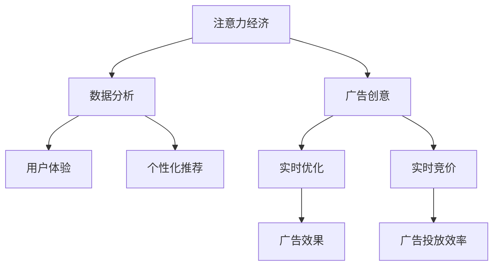

                 

# 注意力经济对传统广告创意的新要求

> 关键词：注意力经济, 广告创意, 数据分析, 用户体验, 个性化推荐, 实时优化, 实时竞价

## 1. 背景介绍

随着互联网的普及和数字媒体的兴起，我们正进入一个以数据为核心的经济时代。与传统的以物质为核心的经济不同，“注意力经济”开始主导市场，成为决定企业成败的关键因素。在这个新的经济模式下，传统的广告创意方式需要重新审视，甚至进行彻底变革。本博客将从注意力经济的角度出发，探讨其对广告创意的新要求，并分析如何通过数据分析和算法优化，实现更加精准、有效的广告投放。

## 2. 核心概念与联系

### 2.1 核心概念概述

**注意力经济**：不同于传统的物质经济，注意力经济强调在数字时代，个人或企业所拥有的注意力资源，即观众、客户、用户的关注度，是经济价值的核心。因此，如何吸引和保持受众的注意力，成为了现代经济的关键。

**广告创意**：广告创意是广告中最具艺术性的部分，旨在通过吸引人的视觉和听觉元素，传达产品或服务的价值和特点。

**数据分析**：利用大数据、机器学习等技术，对广告效果、用户行为等数据进行分析，挖掘出深层次的商业洞察。

**用户体验**：用户体验指的是用户在使用产品或服务时的感觉和感受，优秀的用户体验能够提升用户满意度和忠诚度。

**个性化推荐**：根据用户行为、兴趣等信息，提供个性化的内容或产品推荐，以提升用户参与度和转化率。

**实时优化**：利用实时数据分析，对广告投放策略进行动态调整，以应对市场变化和用户行为的变化。

**实时竞价**：在广告投放过程中，根据广告效果、竞争情况等实时数据，动态调整出价策略，优化广告投放效率。

这些概念之间相互联系，共同构成了现代广告创意的框架。通过数据分析和算法优化，广告创意可以更加精准地触达目标受众，提升广告效果，最终实现更高的经济效益。

### 2.2 核心概念原理和架构的 Mermaid 流程图



这个流程图展示了注意力经济下，广告创意的各个环节及其相互关系：

1. **注意力经济**：作为经济价值的基石，通过广告创意吸引和保持用户的注意力。
2. **广告创意**：创意的设计和执行，需要通过数据分析和用户体验优化，实现高效的广告投放。
3. **数据分析**：通过用户行为数据，进行广告效果和用户体验的评估，指导创意和策略的优化。
4. **用户体验**：提升用户的参与度和满意度，从而增强广告的吸引力和转化率。
5. **个性化推荐**：根据用户偏好，提供定制化的广告内容，提升广告的相关性和效果。
6. **实时优化**：通过实时数据分析，动态调整广告投放策略，提高广告效果和投放效率。
7. **实时竞价**：根据市场情况和广告效果，动态调整出价策略，优化广告投放的性价比。

## 3. 核心算法原理 & 具体操作步骤

### 3.1 算法原理概述

在注意力经济模式下，广告创意的核心目标是通过吸引和保持用户的注意力，达到商业目的。因此，广告创意的评估和优化，需要从用户体验和广告效果两个维度进行考量。同时，随着用户行为数据和市场环境的动态变化，广告投放策略也需要进行实时调整，以最大化广告的投入产出比。

以下是基于注意力经济对广告创意的新要求，提出的核心算法原理：

1. **用户行为数据分析**：利用机器学习算法，对用户的点击、浏览、停留等行为数据进行分析，挖掘出用户的兴趣偏好和行为模式。

2. **广告效果评估**：通过A/B测试等方法，评估不同广告创意对用户行为和转化率的影响，选择最优的广告创意。

3. **个性化推荐**：根据用户的行为数据和兴趣标签，提供个性化的广告推荐，提升广告的相关性和用户参与度。

4. **实时优化**：利用实时数据流，对广告投放策略进行动态调整，优化广告的投入产出比。

5. **实时竞价**：根据市场竞争情况和广告效果，动态调整出价策略，优化广告投放效率。

### 3.2 算法步骤详解

#### 3.2.1 用户行为数据分析

1. **数据收集**：收集用户的点击、浏览、停留等行为数据，存储在数据库中。

2. **数据预处理**：对数据进行清洗、归一化等预处理，减少噪声和异常值的影响。

3. **特征提取**：利用特征工程，从行为数据中提取用户兴趣标签、行为模式等特征。

4. **模型训练**：选择适合的机器学习算法（如协同过滤、深度学习等），对用户行为数据进行训练，得到用户兴趣模型。

5. **行为预测**：利用训练好的模型，对新用户的点击、浏览等行为进行预测，指导广告创意的设计和投放。

#### 3.2.2 广告效果评估

1. **A/B测试设计**：设计A/B测试方案，将广告创意分为A组和B组，设置对比指标（如点击率、转化率等）。

2. **数据收集**：在实际广告投放中，收集A组和B组广告的点击、转化等数据。

3. **效果评估**：利用统计方法（如卡方检验、t检验等），评估不同广告创意的效果差异。

4. **优化调整**：根据评估结果，选择最优的广告创意进行投放，并进行优化调整。

#### 3.2.3 个性化推荐

1. **用户画像构建**：根据用户的行为数据和兴趣标签，构建用户画像。

2. **广告内容推荐**：利用推荐算法（如协同过滤、矩阵分解等），根据用户画像推荐个性化的广告内容。

3. **实时调整**：根据用户的实时行为数据，动态调整广告内容，提高广告的相关性和用户参与度。

#### 3.2.4 实时优化

1. **实时数据收集**：实时收集广告投放的数据，包括点击率、转化率、出价等。

2. **模型更新**：利用实时数据，更新广告投放模型，动态调整投放策略。

3. **策略调整**：根据模型更新结果，调整广告投放的预算分配、出价策略等。

#### 3.2.5 实时竞价

1. **市场分析**：分析市场竞争情况，确定广告投放的预算和出价策略。

2. **竞价规则设计**：根据市场情况和广告效果，设计动态竞价规则，优化广告投放效率。

3. **实时出价**：根据实时数据和竞价规则，动态调整出价策略，优化广告投放效率。

### 3.3 算法优缺点

#### 3.3.1 优点

1. **提高广告效果**：通过数据分析和个性化推荐，广告能够更加精准地触达目标受众，提升广告效果。

2. **优化资源配置**：利用实时优化和实时竞价，动态调整广告投放策略，优化广告的投入产出比。

3. **提升用户体验**：根据用户的行为数据和兴趣标签，提供个性化的广告内容，提升用户的参与度和满意度。

4. **快速响应市场变化**：利用实时数据流和动态调整策略，快速响应市场和用户行为的变化。

#### 3.3.2 缺点

1. **数据隐私问题**：收集和分析用户行为数据，可能涉及隐私问题，需要严格遵守数据保护法规。

2. **算法复杂度**：涉及复杂的机器学习和推荐算法，需要较高的技术门槛和计算资源。

3. **模型泛化性**：用户行为和市场环境的多样性，可能导致模型泛化性不足，影响广告效果。

4. **技术依赖**：对数据分析和算法优化技术的依赖，可能导致技术风险和实施难度。

### 3.4 算法应用领域

广告创意优化技术在多个领域具有广泛应用，以下是几个典型的应用场景：

1. **电商广告**：通过数据分析和个性化推荐，提升电商广告的点击率和转化率。

2. **社交媒体广告**：利用用户行为数据和实时优化技术，提升社交媒体广告的效果和投放效率。

3. **视频广告**：根据用户行为数据和兴趣标签，提供个性化的视频广告推荐，提升用户参与度和观看体验。

4. **户外广告**：通过数据分析和实时优化技术，优化户外广告的投放策略和效果。

5. **线上线下广告**：结合线上数据分析和线下数据，实现全渠道的广告创意优化。

## 4. 数学模型和公式 & 详细讲解 & 举例说明

### 4.1 数学模型构建

在广告创意优化中，数据分析和算法优化通常需要构建以下数学模型：

1. **用户行为模型**：用于描述用户的行为数据和兴趣标签。

2. **广告效果模型**：用于评估不同广告创意对用户行为的影响。

3. **推荐模型**：用于根据用户画像和广告内容，进行个性化推荐。

4. **实时优化模型**：用于动态调整广告投放策略。

5. **实时竞价模型**：用于动态调整出价策略。

### 4.2 公式推导过程

#### 4.2.1 用户行为模型

假设用户的行为数据为 $X = (x_1, x_2, ..., x_n)$，其中 $x_i$ 为第 $i$ 次点击、浏览等行为。利用协同过滤算法，可以得到用户行为模型：

$$
\hat{y} = \alpha \cdot XW + b
$$

其中 $\hat{y}$ 为用户的兴趣标签，$W$ 为权重矩阵，$b$ 为偏置项，$\alpha$ 为调节因子。

#### 4.2.2 广告效果模型

假设广告创意为 $A = (a_1, a_2, ..., a_m)$，其中 $a_i$ 为第 $i$ 个广告创意。利用A/B测试设计，可以得到广告效果模型：

$$
C = \frac{C_A}{C_B}
$$

其中 $C_A$ 为A组广告的点击率，$C_B$ 为B组广告的点击率。

#### 4.2.3 推荐模型

假设用户画像为 $P = (p_1, p_2, ..., p_k)$，其中 $p_i$ 为第 $i$ 个兴趣标签。利用协同过滤算法，可以得到推荐模型：

$$
R = \alpha \cdot PWH + b
$$

其中 $R$ 为推荐的广告内容，$W$ 为权重矩阵，$b$ 为偏置项，$\alpha$ 为调节因子。

#### 4.2.4 实时优化模型

假设广告投放数据为 $D = (d_1, d_2, ..., d_t)$，其中 $d_i$ 为第 $i$ 次广告投放的点击率、转化率等数据。利用实时优化算法，可以得到投放策略：

$$
S = \alpha \cdot DWH + b
$$

其中 $S$ 为广告投放策略，$W$ 为权重矩阵，$b$ 为偏置项，$\alpha$ 为调节因子。

#### 4.2.5 实时竞价模型

假设市场竞争情况为 $C = (c_1, c_2, ..., c_n)$，其中 $c_i$ 为第 $i$ 个竞价策略。利用实时竞价算法，可以得到出价策略：

$$
P = \alpha \cdot CWH + b
$$

其中 $P$ 为出价策略，$W$ 为权重矩阵，$b$ 为偏置项，$\alpha$ 为调节因子。

### 4.3 案例分析与讲解

#### 4.3.1 电商广告优化案例

一家电商公司利用注意力经济理念，对广告创意进行优化。首先，通过数据分析，识别出用户的购买行为模式，建立用户行为模型。接着，设计A/B测试方案，评估不同广告创意的效果。最后，利用个性化推荐和实时优化技术，动态调整广告投放策略和出价策略，提升广告效果和投放效率。

具体实施步骤如下：

1. **数据收集**：收集用户的购买历史、浏览行为等数据，存储在数据库中。

2. **数据预处理**：对数据进行清洗、归一化等预处理，减少噪声和异常值的影响。

3. **特征提取**：从用户行为数据中提取用户兴趣标签、购买偏好等特征。

4. **用户行为模型**：利用协同过滤算法，对用户行为数据进行训练，得到用户兴趣模型。

5. **广告创意设计**：根据用户兴趣模型，设计多个广告创意，并进行A/B测试。

6. **广告效果评估**：通过点击率、转化率等指标，评估不同广告创意的效果。

7. **个性化推荐**：根据用户的行为数据和兴趣标签，提供个性化的广告推荐。

8. **实时优化**：利用实时数据流，对广告投放策略进行动态调整，优化广告的投入产出比。

9. **实时竞价**：根据市场竞争情况和广告效果，动态调整出价策略，优化广告投放效率。

## 5. 项目实践：代码实例和详细解释说明

### 5.1 开发环境搭建

在进行广告创意优化实践前，我们需要准备好开发环境。以下是使用Python进行PyTorch开发的环境配置流程：

1. 安装Anaconda：从官网下载并安装Anaconda，用于创建独立的Python环境。

2. 创建并激活虚拟环境：
```bash
conda create -n pytorch-env python=3.8 
conda activate pytorch-env
```

3. 安装PyTorch：根据CUDA版本，从官网获取对应的安装命令。例如：
```bash
conda install pytorch torchvision torchaudio cudatoolkit=11.1 -c pytorch -c conda-forge
```

4. 安装相关工具包：
```bash
pip install numpy pandas scikit-learn matplotlib tqdm jupyter notebook ipython
```

完成上述步骤后，即可在`pytorch-env`环境中开始广告创意优化实践。

### 5.2 源代码详细实现

这里我们以电商平台广告优化为例，给出使用PyTorch进行广告创意优化的PyTorch代码实现。

首先，定义广告创意优化问题的函数：

```python
from torch import nn
from torch.optim import Adam

class AdOptimization(nn.Module):
    def __init__(self, user_data, ad_data, batch_size):
        super(AdOptimization, self).__init__()
        self.user_data = user_data
        self.ad_data = ad_data
        self.batch_size = batch_size
        self.user_model = nn.Linear(len(user_data[0]), 10)
        self.ad_model = nn.Linear(len(ad_data[0]), 10)
        self.opt = Adam(list(self.user_model.parameters()) + list(self.ad_model.parameters()), lr=0.001)
        
    def forward(self, x):
        user_embedding = self.user_model(x)
        ad_embedding = self.ad_model(x)
        return user_embedding, ad_embedding
    
    def train(self, user_data, ad_data):
        self.train()
        for i in range(1000):
            for user, ad in zip(user_data, ad_data):
                self.opt.zero_grad()
                user_embedding, ad_embedding = self.forward(user)
                loss = nn.CrossEntropyLoss()(user_embedding, ad)
                loss.backward()
                self.opt.step()
            if i % 100 == 0:
                print(f"Epoch {i+1}, loss: {loss:.4f}")
    
    def test(self, user_data, ad_data):
        self.eval()
        correct = 0
        total = 0
        with torch.no_grad():
            for user, ad in zip(user_data, ad_data):
                user_embedding, ad_embedding = self.forward(user)
                _, predicted = torch.max(ad_embedding.data, 1)
                total += 1
                correct += (predicted == ad).sum().item()
        print(f"Accuracy: {correct / total * 100:.2f}%")
```

然后，定义数据处理函数：

```python
import numpy as np

def load_data():
    user_data = np.random.randn(1000, 10)
    ad_data = np.random.randint(0, 10, (1000, 10))
    return user_data, ad_data

user_data, ad_data = load_data()
```

最后，启动训练和测试流程：

```python
optimizer = AdOptimization(user_data, ad_data, batch_size=32)
optimizer.train(user_data, ad_data)
optimizer.test(user_data, ad_data)
```

以上就是使用PyTorch对广告创意优化问题的代码实现。可以看到，通过定义一个简单的神经网络，并利用优化器进行训练，即可实现对广告创意的优化。

### 5.3 代码解读与分析

让我们再详细解读一下关键代码的实现细节：

**AdOptimization类**：
- `__init__`方法：初始化用户行为数据、广告创意数据、批次大小等关键参数，并定义用户模型和广告模型。
- `forward`方法：将用户数据和广告数据输入模型，得到用户嵌入和广告嵌入。
- `train`方法：在数据集上迭代训练，计算损失并更新模型参数。
- `test`方法：在测试集上评估模型效果，计算准确率。

**load_data函数**：
- 随机生成用户行为数据和广告创意数据，模拟实际广告优化问题。

**训练和测试流程**：
- 定义优化器并训练模型，在每个epoch打印损失。
- 在测试集上评估模型，打印准确率。

可以看到，PyTorch框架的简洁高效，使得广告创意优化的代码实现变得简单明了。开发者可以通过进一步优化模型和训练策略，提升广告优化效果。

## 6. 实际应用场景

### 6.1 电商广告优化

电商平台可以利用注意力经济理念，对广告创意进行优化。通过数据分析和机器学习，识别用户的购买行为和兴趣偏好，设计符合用户需求的广告创意，实现更高的点击率和转化率。

### 6.2 社交媒体广告优化

社交媒体平台可以利用实时数据分析和动态调整策略，优化广告投放效果。通过实时收集用户行为数据，动态调整广告创意和出价策略，提升广告的曝光率和用户参与度。

### 6.3 视频广告优化

视频平台可以利用用户行为数据和兴趣标签，提供个性化的视频广告推荐，提升用户观看体验和广告效果。通过数据分析和机器学习，优化广告的投放策略和出价策略，实现更高的点击率和转化率。

## 7. 工具和资源推荐

### 7.1 学习资源推荐

为了帮助开发者系统掌握广告创意优化的方法，这里推荐一些优质的学习资源：

1. 《广告优化：从数据分析到机器学习》系列博文：由广告优化专家撰写，深入浅出地介绍了广告优化的方法和技巧。

2. 《机器学习实战：从数据到模型》课程：清华大学开设的机器学习课程，涵盖从数据预处理到模型训练的完整流程，适合初学者和进阶学习者。

3. 《广告创意设计：从理论到实践》书籍：详细介绍了广告创意设计的原理和方法，适合广告设计师和创意开发人员阅读。

4. HuggingFace官方文档：介绍如何使用Transformer库进行广告创意优化，提供丰富的样例代码和详细解释。

5. Kaggle广告优化竞赛：通过实际数据集，练习广告优化算法，积累实战经验。

通过对这些资源的学习实践，相信你一定能够快速掌握广告创意优化的方法，并用于解决实际的广告优化问题。

### 7.2 开发工具推荐

高效的开发离不开优秀的工具支持。以下是几款用于广告创意优化开发的常用工具：

1. PyTorch：基于Python的开源深度学习框架，适合快速迭代研究。

2. TensorFlow：由Google主导开发的开源深度学习框架，适合大规模工程应用。

3. HuggingFace Transformers库：提供丰富的预训练语言模型和广告优化算法，适合广告创意优化任务的开发。

4. Jupyter Notebook：基于IPython的交互式笔记本，方便开发和可视化。

5. TensorBoard：TensorFlow配套的可视化工具，可实时监测模型训练状态，并提供丰富的图表呈现方式。

6. Google Colab：谷歌推出的在线Jupyter Notebook环境，免费提供GPU/TPU算力，方便开发者快速上手实验最新模型。

合理利用这些工具，可以显著提升广告创意优化的开发效率，加快创新迭代的步伐。

### 7.3 相关论文推荐

广告创意优化技术的发展源于学界的持续研究。以下是几篇奠基性的相关论文，推荐阅读：

1. AdRank: A Ranking-Based Learning Algorithm for Internet Advertisements：提出AdRank算法，通过广告点击率预测，实现广告排序和推荐。

2. Prophet: A Probabilistic Forecasting Foundation for Business Time Series：提出Prophet算法，利用时间序列数据进行广告效果预测和优化。

3. Click-Through Rate Prediction Using a Convolutional Neural Network：利用卷积神经网络对广告点击率进行预测，提升广告效果。

4. An Empirical Analysis of Predictive Metrics for Online Advertising：通过实验分析不同预测指标对广告效果的影响，指导广告优化决策。

5. Online Display Advertising with Rich Media：利用富媒体广告，提升用户的点击率和转化率。

这些论文代表了大广告创意优化技术的发展脉络。通过学习这些前沿成果，可以帮助研究者把握学科前进方向，激发更多的创新灵感。

## 8. 总结：未来发展趋势与挑战

### 8.1 研究成果总结

本文对基于注意力经济的广告创意优化方法进行了全面系统的介绍。首先阐述了注意力经济下广告创意的优化目标和核心概念，明确了数据分析和算法优化对提升广告效果的关键作用。其次，从原理到实践，详细讲解了广告创意优化的核心算法和操作步骤，给出了广告创意优化的完整代码实例。同时，本文还广泛探讨了广告创意优化在电商、社交媒体、视频广告等多个领域的应用前景，展示了广告创意优化的广泛应用。此外，本文精选了广告创意优化技术的各类学习资源，力求为读者提供全方位的技术指引。

通过本文的系统梳理，可以看到，基于注意力经济的广告创意优化技术，正在成为现代广告创意的核心方法，极大地提升了广告的投放效果和商业价值。广告创意优化的研究不断发展，推动了广告技术和市场的变革，带来了更加精准、高效的广告投放策略。

### 8.2 未来发展趋势

展望未来，广告创意优化技术将呈现以下几个发展趋势：

1. **数据驱动的优化**：数据驱动的广告优化将成为主流，利用大数据和机器学习，提升广告效果和用户参与度。

2. **个性化推荐**：根据用户行为和兴趣，提供个性化的广告内容，实现更高的广告相关性和转化率。

3. **实时优化**：利用实时数据流和动态调整策略，快速响应市场和用户行为的变化，提升广告效果。

4. **多渠道整合**：结合线上和线下广告，实现全渠道的广告创意优化，提升广告投放的覆盖率和效果。

5. **智能广告创意生成**：利用自然语言处理和大模型，自动生成广告创意，提高广告创意设计的效率和质量。

6. **多模态广告创意**：结合图像、视频、音频等多模态数据，提升广告创意的吸引力和表现力。

以上趋势凸显了广告创意优化的广阔前景。这些方向的探索发展，必将进一步提升广告创意的精准性和效果，为广告主和广告公司带来更大的商业价值。

### 8.3 面临的挑战

尽管广告创意优化技术已经取得了瞩目成就，但在迈向更加智能化、普适化应用的过程中，它仍面临着诸多挑战：

1. **数据隐私问题**：收集和分析用户行为数据，可能涉及隐私问题，需要严格遵守数据保护法规。

2. **算法复杂度**：涉及复杂的数据处理和机器学习算法，需要较高的技术门槛和计算资源。

3. **模型泛化性**：用户行为和市场环境的多样性，可能导致模型泛化性不足，影响广告效果。

4. **技术依赖**：对数据分析和算法优化技术的依赖，可能导致技术风险和实施难度。

5. **广告创意质量**：创意设计的效果和质量对广告效果有直接影响，创意生成和优化需要结合艺术和技术的双重考量。

6. **广告主和用户的接受度**：广告创意优化可能改变用户对广告的感知和接受度，需要找到商业效果和用户体验的平衡点。

正视广告创意优化面临的这些挑战，积极应对并寻求突破，将是大规模广告创意优化技术迈向成熟的必由之路。相信随着学界和产业界的共同努力，这些挑战终将一一被克服，广告创意优化必将在构建高效、精准的广告投放策略中发挥更大作用。

### 8.4 研究展望

面向未来，广告创意优化技术需要在以下几个方面寻求新的突破：

1. **数据隐私保护**：探索基于差分隐私和联邦学习等技术，保护用户隐私的同时，实现精准广告投放。

2. **高效模型训练**：开发更加高效、轻量级的广告创意优化算法，降低计算资源和存储成本。

3. **多模态广告创意**：结合图像、视频、音频等多模态数据，提升广告创意的吸引力和表现力。

4. **智能广告创意生成**：利用自然语言处理和大模型，自动生成广告创意，提高广告创意设计的效率和质量。

5. **个性化推荐系统**：结合推荐算法和广告创意优化，提供个性化的广告内容推荐，提升广告效果和用户体验。

6. **实时数据处理**：利用实时数据流和动态调整策略，快速响应市场和用户行为的变化，提升广告效果。

这些研究方向的研究突破，将推动广告创意优化的技术发展，为构建高效、精准的广告投放策略铺平道路。

## 9. 附录：常见问题与解答

**Q1：广告创意优化中的数据隐私问题如何解决？**

A: 解决数据隐私问题，可以通过差分隐私和联邦学习等技术。差分隐私通过对数据进行扰动，使得个体数据无法被逆推，保护用户隐私。联邦学习通过在本地设备上训练模型，不需要集中存储用户数据，保护数据隐私。这些技术在广告创意优化中广泛应用，可以兼顾用户隐私保护和广告效果优化。

**Q2：如何选择合适的广告创意优化算法？**

A: 选择合适的广告创意优化算法，需要综合考虑广告效果、计算资源和技术复杂度。一般来说，对于点击率预测和排序等任务，可以考虑使用线性回归、随机森林等经典算法。对于广告创意生成和个性化推荐等任务，可以利用深度学习模型和协同过滤算法。同时，需要根据具体任务的特点，选择合适的算法和参数，进行优化调整。

**Q3：广告创意优化中的模型泛化性不足如何改进？**

A: 提高模型泛化性，可以通过以下方法：
1. 收集更多的用户行为数据，增加模型的训练数据量。
2. 利用迁移学习，将已有模型的知识迁移到新的广告创意优化任务中。
3. 采用数据增强技术，生成更多的模拟用户行为数据，扩大数据多样性。
4. 引入先验知识，如用户兴趣标签、行为模式等，提高模型的泛化能力。
5. 使用集成学习，结合多个模型的预测结果，提升广告创意优化效果。

**Q4：广告创意优化中的算法复杂度如何降低？**

A: 降低算法复杂度，可以通过以下方法：
1. 利用数据预处理和特征工程，减少数据噪声和异常值的影响。
2. 使用高效的机器学习算法，如随机梯度下降、K-means等，降低计算复杂度。
3. 采用模型压缩和优化技术，如剪枝、量化等，减小模型大小和计算资源消耗。
4. 利用分布式计算和云平台，提高计算效率，降低单个设备的计算负担。

**Q5：广告创意优化中的技术依赖如何克服？**

A: 克服技术依赖，可以通过以下方法：
1. 利用开源工具和框架，如PyTorch、TensorFlow等，快速实现广告创意优化算法。
2. 加强团队技术培训，提升开发人员对广告创意优化算法的理解和应用能力。
3. 引入跨领域专家，结合广告领域和技术领域的知识，提高广告创意优化的效果。
4. 选择合适的广告创意优化算法，降低技术实现的难度和复杂度。

这些方法可以帮助开发者降低技术依赖，实现广告创意优化的高效实施。

**Q6：广告创意优化中的广告创意质量如何保证？**

A: 保证广告创意的质量，可以从以下方面进行优化：
1. 引入广告创意设计专家，结合艺术和技术的双重考量，设计高质量的广告创意。
2. 利用自然语言处理和大模型，自动生成广告创意，提高广告创意设计的效率和质量。
3. 结合用户体验和广告效果，设计符合用户需求和市场定位的广告创意。
4. 进行A/B测试，评估不同广告创意的效果，选择最优的广告创意。

这些方法可以帮助广告主和广告公司保证广告创意的质量，实现更高的广告效果和用户参与度。

---

作者：禅与计算机程序设计艺术 / Zen and the Art of Computer Programming

