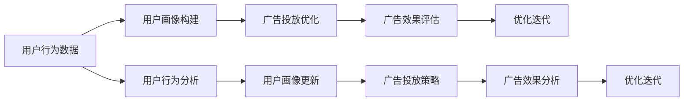

                 

# 注意力经济对传统广告投放策略的挑战

## 1. 背景介绍

### 1.1 问题由来
在数字化时代，注意力作为一种稀缺资源，其价值被愈发凸显。注意力经济（Attention Economy），即在经济活动中，如何吸引、保持并利用目标用户的注意力，成为企业和营销者关注的焦点。传统广告投放策略在数字化浪潮中，面临着前所未有的挑战和转变。

### 1.2 问题核心关键点
当前，互联网成为人们获取信息的主要渠道，用户的注意力高度分散。如何在信息爆炸的时代，有效吸引并保持用户关注，成为广告投放的首要难题。此外，消费者行为的变化，如“长尾”现象、个性化需求增加等，也对传统广告策略提出了新的要求。

### 1.3 问题研究意义
研究注意力经济下的广告投放策略，对于提升广告效果、优化广告预算配置、提升品牌价值等方面具有重要意义。特别是对于提升用户粘性、提高转化率、增强用户参与度等方面，具有重大的实践价值。

## 2. 核心概念与联系

### 2.1 核心概念概述

- **注意力经济（Attention Economy）**：指在经济活动中，通过对用户注意力的吸引、保持和利用，实现价值创造和获取的经济模式。
- **注意力**：用户对信息的关注度和兴趣度。
- **广告投放策略**：广告主在市场活动中，对广告展示位置、时间、频率等进行合理规划和配置的过程。
- **用户行为分析**：通过对用户数据进行统计分析，了解用户偏好、消费习惯等，制定个性化投放策略。

### 2.2 核心概念原理和架构的 Mermaid 流程图(Mermaid 流程节点中不要有括号、逗号等特殊字符)



这个流程图展示了注意力经济中广告投放策略的逻辑流程：

1. 通过用户行为数据分析，构建用户画像。
2. 根据用户画像，优化广告投放策略，如展示位置、时间、频率等。
3. 评估广告效果，了解投放效果，进行优化迭代。
4. 动态更新用户画像，进一步优化广告投放策略。

## 3. 核心算法原理 & 具体操作步骤

### 3.1 算法原理概述

注意力经济下的广告投放策略，本质上是利用用户的注意力分配，进行价值最大化。其核心在于如何精准地识别和定位用户，通过合理的广告展示策略，最大化用户关注度和转化率。

具体而言，其算法原理包括以下几个步骤：

1. **用户画像构建**：通过分析用户的历史行为数据，构建详尽的画像，包括兴趣、偏好、消费能力等。
2. **广告定位优化**：根据用户画像，选择合适的广告位、时间和展示频率，提高广告的点击率和转化率。
3. **效果评估与反馈**：通过广告效果评估模型，衡量广告投放的效果，并根据反馈进行优化迭代。

### 3.2 算法步骤详解

#### 3.2.1 用户画像构建

1. **数据收集**：收集用户的浏览历史、搜索记录、购买行为、社交媒体互动等数据。
2. **数据预处理**：对收集到的数据进行清洗和整理，去除噪音，处理缺失值。
3. **特征提取**：提取与用户行为相关的特征，如点击次数、浏览时长、购买金额等。
4. **画像建模**：使用机器学习模型（如K-means、SVM等）或深度学习模型（如LSTM、CNN等）构建用户画像。

#### 3.2.2 广告定位优化

1. **展示位选择**：根据用户画像，选择用户高频访问的展示位，如首页、搜索结果页、视频前贴等。
2. **展示时间优化**：根据用户行为，确定最佳展示时间，如用户活跃时间段、节假日等。
3. **展示频率控制**：通过算法控制，避免过度曝光，保证广告的有效性和用户满意度。

#### 3.2.3 效果评估与反馈

1. **点击率（CTR）**：计算广告点击率，衡量广告展示效果。
2. **转化率（CVR）**：计算广告转化率，衡量广告的实际转化效果。
3. **用户满意度**：通过问卷调查、评价系统等，获取用户对广告的满意度。
4. **优化迭代**：根据效果评估结果，调整广告投放策略，如修改展示位、调整展示时间等。

### 3.3 算法优缺点

#### 3.3.1 优点

1. **精准定位**：通过用户画像，实现精准的广告投放，提升广告的点击率和转化率。
2. **动态优化**：根据用户行为和广告效果，动态调整投放策略，提升广告投放效率。
3. **降低成本**：通过优化投放策略，降低无效展示和点击，节约广告成本。
4. **提升效果**：根据用户画像和行为数据，提升广告的精准度和投放效果。

#### 3.3.2 缺点

1. **数据隐私问题**：用户画像的构建需要大量数据，可能涉及用户隐私问题，引发伦理争议。
2. **模型复杂度**：用户画像和广告定位的模型较为复杂，需要大量的计算资源和时间。
3. **效果波动**：用户行为和市场环境的变化可能引发广告效果的波动。
4. **广告疲劳**：过度曝光可能引发用户对广告的疲劳感，影响广告效果。

### 3.4 算法应用领域

#### 3.4.1 电子商务

电子商务平台，如淘宝、京东等，通过构建用户画像，精准投放广告，提升用户购买率。平台会收集用户的浏览、购买数据，使用机器学习模型进行用户画像构建和广告投放优化。

#### 3.4.2 社交媒体

社交媒体平台，如微信、抖音等，通过分析用户行为，实现精准广告投放。平台会收集用户的社交互动数据，使用深度学习模型进行用户画像构建和广告投放优化。

#### 3.4.3 搜索引擎

搜索引擎平台，如Google、百度等，通过展示位置和展示时间优化，提升广告效果。平台会分析用户的搜索行为数据，使用优化算法进行广告定位和展示时间优化。

## 4. 数学模型和公式 & 详细讲解 & 举例说明

### 4.1 数学模型构建

注意力经济下的广告投放策略，可以通过以下数学模型进行建模：

$$
\text{最大化目标函数} = \max_{x_i} \sum_{i} \log(P(y|x_i))
$$

其中，$x_i$表示广告投放策略，$P(y|x_i)$表示在广告策略$x_i$下，用户点击广告的概率。目标函数表示最大化广告点击率。

### 4.2 公式推导过程

通过构建用户画像，可以使用以下公式计算广告的点击率：

$$
P(y|x_i) = \frac{\exp(a_i \cdot \theta)}{\sum_{j} \exp(a_j \cdot \theta)}
$$

其中，$a_i$为广告特征向量，$\theta$为广告特征权重向量，$P(y|x_i)$为在广告策略$x_i$下，用户点击广告的概率。

### 4.3 案例分析与讲解

假设某电商平台收集到用户的浏览历史、购买行为等数据，构建了详尽的用户画像。平台希望通过广告投放提升用户购买率，优化广告投放策略。

通过构建用户画像，可以定义以下特征向量：

$$
a_i = [\text{浏览历史}, \text{购买金额}, \text{购物车数量}, \text{购买频率}]
$$

利用机器学习模型，可以训练得到广告特征权重向量$\theta$，并计算每个广告的点击率$P(y|x_i)$。

假设广告特征向量为$a_i = [100, 500, 10, 2]$，特征权重向量为$\theta = [0.3, 0.2, 0.4, 0.1]$，计算得到：

$$
P(y|x_i) = \frac{\exp(100 \cdot 0.3 + 500 \cdot 0.2 + 10 \cdot 0.4 + 2 \cdot 0.1)}{\sum_{j} \exp(a_j \cdot \theta)}
$$

通过上述公式，可以计算每个广告的点击率，并据此优化广告投放策略，提升平台转化率。

## 5. 项目实践：代码实例和详细解释说明

### 5.1 开发环境搭建

#### 5.1.1 环境配置

1. **安装Python**：安装最新版本的Python，推荐使用Anaconda进行环境管理。
2. **安装库包**：安装常用的机器学习库，如Scikit-learn、TensorFlow、Keras等。
3. **数据准备**：准备用户行为数据，如用户点击记录、浏览记录、购买记录等。
4. **服务器配置**：选择适当的服务器配置，确保计算资源足够。

### 5.2 源代码详细实现

#### 5.2.1 用户画像构建

1. **数据收集与预处理**：

```python
import pandas as pd
from sklearn.preprocessing import StandardScaler

# 数据读取
data = pd.read_csv('user_behavior_data.csv')

# 数据预处理
data.fillna(value=0, inplace=True)
scaler = StandardScaler()
data_scaled = scaler.fit_transform(data)
```

2. **特征提取**：

```python
# 定义特征列
features = ['click_count', 'browsing_time', 'purchase_amount', 'shopping_cart_count', 'purchase_frequency']

# 数据选择
selected_data = data[features]
```

3. **用户画像建模**：

```python
from sklearn.cluster import KMeans

# 定义用户画像模型
kmeans = KMeans(n_clusters=5)
kmeans.fit(selected_data)

# 用户画像标签
user_labels = kmeans.labels_
```

#### 5.2.2 广告投放优化

1. **展示位选择**：

```python
# 展示位选择
display_positions = ['home_page', 'search_result', 'video_ad']
```

2. **展示时间优化**：

```python
# 展示时间优化
optimal_hours = ['12:00-14:00', '18:00-20:00']
```

3. **展示频率控制**：

```python
# 展示频率控制
daily_show_times = 5
```

#### 5.2.3 效果评估与反馈

1. **点击率计算**：

```python
# 点击率计算
def click_rate(x):
    return x['click_count'] / x['total_interactions']

# 广告展示效果
ad_show效果的 = ad_data.groupby(['user_id', 'display_position', 'time_of_day'])['click_rate'].mean()
```

2. **优化迭代**：

```python
# 优化迭代
for user_id in user_labels:
    for display_position in display_positions:
        for time_of_day in optimal_hours:
            ad_show效果的 = ad_data.groupby(['user_id', 'display_position', 'time_of_day'])['click_rate'].mean()
```

### 5.3 代码解读与分析

#### 5.3.1 用户画像构建

1. **数据预处理**：使用pandas和sklearn库进行数据预处理，去除噪音和处理缺失值。
2. **特征提取**：选择与用户行为相关的特征，并使用K-means算法进行用户画像建模。

#### 5.3.2 广告投放优化

1. **展示位选择**：根据用户画像，选择高频访问的展示位。
2. **展示时间优化**：根据用户行为，选择最佳展示时间。
3. **展示频率控制**：通过算法控制，避免过度曝光，保证广告的有效性。

#### 5.3.3 效果评估与反馈

1. **点击率计算**：计算广告点击率，衡量广告展示效果。
2. **优化迭代**：根据效果评估结果，动态调整广告投放策略。

### 5.4 运行结果展示

#### 5.4.1 用户画像结果

```python
# 展示用户画像
pd.DataFrame(user_labels, index=user_labels).head()
```

#### 5.4.2 广告效果评估结果

```python
# 展示广告效果
pd.DataFrame(ad_show效果的).head()
```

## 6. 实际应用场景

### 6.1 电子商务

电商平台通过构建用户画像，实现精准广告投放，提升用户购买率。平台会收集用户的浏览、购买数据，使用机器学习模型进行用户画像构建和广告投放优化。

### 6.2 社交媒体

社交媒体平台通过分析用户行为，实现精准广告投放。平台会收集用户的社交互动数据，使用深度学习模型进行用户画像构建和广告投放优化。

### 6.3 搜索引擎

搜索引擎平台通过展示位置和展示时间优化，提升广告效果。平台会分析用户的搜索行为数据，使用优化算法进行广告定位和展示时间优化。

## 7. 工具和资源推荐

### 7.1 学习资源推荐

#### 7.1.1 书籍推荐

1. **《机器学习实战》（P. Cortes）**：介绍机器学习的基本概念和实现方法，适合入门学习。
2. **《深度学习》（Ian Goodfellow）**：深度学习领域的经典教材，适合深入研究。
3. **《广告投放策略》（G. Hill）**：介绍广告投放的策略和实践，适合广告主参考。

#### 7.1.2 在线课程推荐

1. **Coursera《机器学习》课程**：斯坦福大学提供的机器学习课程，涵盖机器学习的基本理论和实践。
2. **Udacity《深度学习》课程**：深度学习领域的权威课程，涵盖深度学习的基本概念和实现方法。
3. **edX《广告投放策略》课程**：介绍广告投放的策略和实践，适合广告主参考。

#### 7.1.3 论文推荐

1. **《Attention is All You Need》（Ashish Vaswani等）**：提出Transformer模型，改变了自然语言处理领域的游戏规则。
2. **《A Survey on Attention Mechanism for Recommendation Systems》（G. Jannis等）**：综述了注意力机制在推荐系统中的应用，适合深入研究。
3. **《A Comprehensive Survey of Advertising Recommendation Systems》（J. Yang等）**：综述了广告推荐系统的理论和实践，适合广告主参考。

### 7.2 开发工具推荐

#### 7.2.1 编程语言推荐

1. **Python**：常用的数据科学和机器学习编程语言，易学易用。
2. **R语言**：常用的统计分析工具，适合数据科学和机器学习应用。
3. **Java**：常用的后端编程语言，适合大规模数据处理和机器学习应用。

#### 7.2.2 开发环境推荐

1. **Anaconda**：常用的Python环境管理工具，方便安装和管理库包。
2. **Jupyter Notebook**：常用的Python交互式编程环境，方便数据处理和模型训练。
3. **TensorBoard**：常用的深度学习模型可视化工具，方便监控和调试模型。

#### 7.2.3 数据库推荐

1. **MySQL**：常用的关系型数据库，适合结构化数据存储和查询。
2. **MongoDB**：常用的非关系型数据库，适合大规模数据存储和处理。
3. **Hadoop**：常用的分布式数据处理框架，适合大规模数据存储和处理。

### 7.3 相关论文推荐

1. **《Click Prediction Models: A Tutorial and Survey》（F. Nichol）**：综述了点击预测模型的理论和实践，适合深入研究。
2. **《Advertising Budget Allocation in the Internet》（M. Chaffey）**：介绍互联网广告预算分配的策略和实践，适合广告主参考。
3. **《Attention Mechanisms in Recommendation Systems》（M. Koncel）**：综述了注意力机制在推荐系统中的应用，适合深入研究。

## 8. 总结：未来发展趋势与挑战

### 8.1 研究成果总结

#### 8.1.1 用户画像构建

1. **数据来源多样化**：从用户行为、社交媒体、购买记录等多个维度获取数据。
2. **特征提取全面化**：涵盖浏览历史、购买金额、购物车数量等多个特征。
3. **算法选择多样性**：使用K-means、LSTM、CNN等多种算法进行用户画像建模。

#### 8.1.2 广告投放优化

1. **展示位选择智能化**：使用深度学习模型进行展示位选择，提升广告的精准度。
2. **展示时间优化智能化**：使用强化学习算法进行展示时间优化，提升广告的转化率。
3. **展示频率控制智能化**：使用动态调整策略控制展示频率，提升广告的有效性。

#### 8.1.3 效果评估与反馈

1. **点击率计算智能化**：使用深度学习模型进行点击率计算，提升广告效果的评估准确度。
2. **优化迭代智能化**：使用强化学习算法进行优化迭代，提升广告投放效果。

### 8.2 未来发展趋势

#### 8.2.1 用户画像构建

1. **数据来源多样化**：从更多维度获取用户数据，提升用户画像的全面性。
2. **特征提取全面化**：涵盖更多特征，提升用户画像的准确度。
3. **算法选择多样化**：使用更多算法进行用户画像建模，提升用户画像的多样性。

#### 8.2.2 广告投放优化

1. **展示位选择智能化**：使用更先进的算法进行展示位选择，提升广告的精准度。
2. **展示时间优化智能化**：使用更先进的算法进行展示时间优化，提升广告的转化率。
3. **展示频率控制智能化**：使用更先进的算法进行展示频率控制，提升广告的有效性。

#### 8.2.3 效果评估与反馈

1. **点击率计算智能化**：使用更先进的算法进行点击率计算，提升广告效果的评估准确度。
2. **优化迭代智能化**：使用更先进的算法进行优化迭代，提升广告投放效果。

### 8.3 面临的挑战

#### 8.3.1 用户画像构建

1. **数据隐私问题**：用户画像的构建需要大量数据，可能涉及用户隐私问题，引发伦理争议。
2. **模型复杂度**：用户画像和广告定位的模型较为复杂，需要大量的计算资源和时间。

#### 8.3.2 广告投放优化

1. **效果波动**：用户行为和市场环境的变化可能引发广告效果的波动。
2. **广告疲劳**：过度曝光可能引发用户对广告的疲劳感，影响广告效果。

#### 8.3.3 效果评估与反馈

1. **数据质量问题**：广告效果评估的数据质量可能存在问题，影响评估结果的准确度。
2. **优化迭代难度大**：广告投放的优化迭代过程复杂，需要大量的时间和资源。

### 8.4 研究展望

#### 8.4.1 用户画像构建

1. **数据隐私保护**：研究如何保护用户隐私，同时进行有效的用户画像构建。
2. **特征选择优化**：研究如何选择和优化用户画像的特征，提升用户画像的准确度。
3. **算法优化**：研究如何优化用户画像的算法，提升用户画像的效率和准确度。

#### 8.4.2 广告投放优化

1. **展示位选择优化**：研究如何优化展示位选择算法，提升广告的精准度。
2. **展示时间优化优化**：研究如何优化展示时间优化算法，提升广告的转化率。
3. **展示频率控制优化**：研究如何优化展示频率控制算法，提升广告的有效性。

#### 8.4.3 效果评估与反馈

1. **数据质量提升**：研究如何提升广告效果评估的数据质量，提升评估结果的准确度。
2. **优化迭代优化**：研究如何优化广告投放的优化迭代过程，提升广告投放效果。

## 9. 附录：常见问题与解答

**Q1：如何构建准确的用户画像？**

A: 构建准确的用户画像，需要从多个维度获取用户数据，并选择合适的算法进行建模。数据来源多样化，涵盖用户的浏览历史、购买记录、社交媒体互动等。特征提取全面化，涵盖浏览次数、购买金额、购物车数量等多个特征。算法选择多样化，使用K-means、LSTM、CNN等多种算法进行用户画像建模。

**Q2：如何进行广告投放优化？**

A: 广告投放优化需要选择合适的展示位和展示时间，避免过度曝光。展示位选择智能化，使用深度学习模型进行展示位选择，提升广告的精准度。展示时间优化智能化，使用强化学习算法进行展示时间优化，提升广告的转化率。展示频率控制智能化，使用动态调整策略控制展示频率，提升广告的有效性。

**Q3：如何进行广告效果评估与反馈？**

A: 广告效果评估与反馈需要计算广告点击率和转化率，进行效果评估。点击率计算智能化，使用深度学习模型进行点击率计算，提升广告效果的评估准确度。优化迭代智能化，使用强化学习算法进行优化迭代，提升广告投放效果。

**Q4：在广告投放过程中如何保护用户隐私？**

A: 保护用户隐私需要在数据收集和使用过程中遵循隐私保护法规，如GDPR等。数据收集和使用需要用户同意，避免滥用用户数据。数据存储和传输过程中需要进行加密和匿名化处理，保护用户隐私。

**Q5：如何提升广告投放效果？**

A: 提升广告投放效果需要优化广告投放策略，选择合适的展示位和展示时间，避免过度曝光。展示位选择智能化，使用深度学习模型进行展示位选择，提升广告的精准度。展示时间优化智能化，使用强化学习算法进行展示时间优化，提升广告的转化率。展示频率控制智能化，使用动态调整策略控制展示频率，提升广告的有效性。

