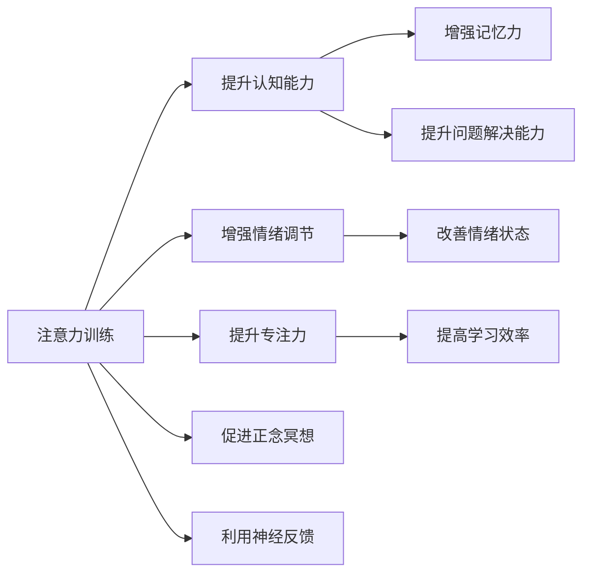

                 

# 注意力训练与大脑健康改善：通过专注力增强认知能力和幸福感

## 1. 背景介绍

### 1.1 问题由来
随着科技的进步和社会的发展，人们的生活节奏加快，工作压力增大，心理健康问题愈发凸显。许多研究指出，心理健康与注意力训练之间存在密切联系。通过科学的注意力训练方法，可以有效改善大脑的认知功能，提升幸福感和生活质量。本文将从神经科学、认知心理学和信息技术的角度，系统探讨注意力训练与大脑健康改善之间的关系，介绍基于专注力增强的认知能力提升技术和具体应用场景。

### 1.2 问题核心关键点
注意力训练的核心在于提升个体的专注力和记忆力，改善情绪调节能力，从而促进整体心理和认知健康。当前主流的注意力训练方法主要包括以下几种：

1. **脑电反馈训练**：通过实时监测大脑活动，根据神经信号反馈调整训练策略，个性化地提升注意力水平。
2. **认知任务训练**：设计特定的认知任务，如注意力集中、记忆提取等，通过反复练习提升相关认知能力。
3. **多感官训练**：结合视觉、听觉等多种感官刺激，丰富训练体验，增强注意力和记忆力。
4. **正念冥想**：通过冥想训练，提升个体的情绪调节和压力管理能力。

这些注意力训练方法大多基于神经科学的最新研究成果，旨在通过科学的训练手段，改善大脑功能，提升生活质量。

## 2. 核心概念与联系

### 2.1 核心概念概述

为更好地理解注意力训练与大脑健康改善的联系，本节将介绍几个关键概念：

- **注意力**：指个体在特定任务中集中精神和资源，排除干扰的能力。注意力训练旨在增强这一能力。
- **认知能力**：包括记忆、思维、问题解决等，是大脑执行复杂任务的基础。
- **情绪调节**：指个体通过认知和行为调节，应对和适应各种情绪状态的能力。
- **正念冥想**：通过专注当下，培养观察和接受自我情绪的能力，提升情绪调节和压力管理。
- **神经反馈**：利用神经信号实时监测大脑活动，提供反馈信息，指导训练策略。

这些概念之间存在紧密联系，共同构成了注意力训练的理论基础。

### 2.2 核心概念原理和架构的 Mermaid 流程图



这个流程图展示了注意力训练与其他核心概念的联系：

1. 注意力训练主要通过提升个体的专注力，增强认知能力和情绪调节。
2. 提升认知能力包括增强记忆力、思维力和问题解决能力。
3. 增强情绪调节包括改善情绪状态和促进正念冥想。
4. 利用神经反馈，可以实时监测大脑活动，指导训练策略，提高训练效果。

## 3. 核心算法原理 & 具体操作步骤

### 3.1 算法原理概述

基于注意力训练的认知能力提升技术主要通过以下几个步骤实现：

1. **神经反馈监测**：利用脑电图(EEG)、功能性磁共振成像(fMRI)等技术实时监测大脑活动，获取神经信号。
2. **任务设计**：设计具体的认知任务，如注意力集中、记忆提取等，作为训练内容。
3. **个性化训练**：根据神经反馈结果，个性化调整训练强度和策略。
4. **持续评估**：定期评估训练效果，调整训练计划。

这些步骤共同构成了基于注意力训练的认知能力提升算法框架。

### 3.2 算法步骤详解

#### 步骤 1: 准备神经监测设备
- 选择适合的神经监测设备，如EEG头盔、fMRI扫描仪等。
- 校准设备，确保监测数据的准确性和可靠性。

#### 步骤 2: 设计认知任务
- 根据训练目标，设计具体的认知任务，如注意力集中、记忆提取等。
- 将任务分解为多个子任务，逐步增加难度。

#### 步骤 3: 进行个性化训练
- 实时监测训练过程中大脑活动的变化，根据神经反馈结果调整训练强度和策略。
- 根据个体的认知水平，个性化设计训练方案，确保训练效果最大化。

#### 步骤 4: 持续评估训练效果
- 定期评估训练效果，包括注意力水平、记忆力、问题解决能力等。
- 根据评估结果，调整训练计划，持续改进训练效果。

### 3.3 算法优缺点

#### 优点
1. **科学依据**：基于神经科学和认知心理学的最新研究成果，提升训练效果。
2. **个性化训练**：根据个体的神经信号反馈，个性化调整训练策略，提高训练效率。
3. **全面提升**：不仅提升注意力和记忆力，还增强情绪调节和问题解决能力，效果显著。

#### 缺点
1. **设备成本高**：神经监测设备昂贵，维护成本高。
2. **学习曲线陡峭**：训练过程需要掌握多种神经监测技术和认知任务设计方法，学习成本高。
3. **应用场景受限**：当前主要用于实验室和特定场景，大规模应用有待拓展。

### 3.4 算法应用领域

基于注意力训练的认知能力提升技术，在以下几个领域得到了广泛应用：

1. **教育**：提升学生的注意力和记忆力，改善学习效果。
2. **企业培训**：增强员工的专注力和认知能力，提高工作效率。
3. **心理健康**：改善个体的情绪调节能力，缓解压力，提升幸福感。
4. **老年人认知功能改善**：通过科学训练，延缓认知衰退，提升生活质量。

这些应用场景展示了注意力训练技术的广泛应用前景，对提升整体社会心理健康和认知能力具有重要意义。

## 4. 数学模型和公式 & 详细讲解

### 4.1 数学模型构建

为了更好地描述注意力训练与大脑健康改善的联系，本文将通过数学模型对其进行详细阐述。

假设大脑活动为 $\mathcal{X}$，注意力水平为 $A$，情绪调节能力为 $E$，认知能力为 $C$。则注意力训练的目标函数为：

$$
f(A,E,C) = \max_{A,E,C} \left\{ A \times E \times C \right\}
$$

其中，$A$、$E$、$C$ 分别代表注意力水平、情绪调节能力和认知能力，通过训练最大化其乘积。

### 4.2 公式推导过程

为了更好地理解注意力训练的数学模型，本文将推导其关键公式：

$$
A(t+1) = A(t) + \eta \times g(\Delta A(t))
$$

其中，$A(t)$ 表示当前时间 $t$ 的注意力水平，$\eta$ 为学习率，$g(\Delta A(t))$ 为根据神经反馈调整的注意力提升函数，$\Delta A(t)$ 为当前神经反馈指示的注意力变化量。

同理，对于情绪调节能力和认知能力，也存在类似的公式：

$$
E(t+1) = E(t) + \eta \times g(\Delta E(t))
$$

$$
C(t+1) = C(t) + \eta \times g(\Delta C(t))
$$

其中，$g(\Delta X(t))$ 为根据神经反馈调整的认知功能提升函数，$\Delta X(t)$ 为当前神经反馈指示的认知功能变化量。

### 4.3 案例分析与讲解

以注意力集中任务为例，假设当前注意力水平为 $A(t)=0.5$，根据神经反馈，注意力提升函数 $g(\Delta A(t))=0.1$，则更新后的注意力水平为：

$$
A(t+1) = 0.5 + 0.1 \times (A_{\max} - A(t)) = 0.5 + 0.1 \times (1 - 0.5) = 0.6
$$

其中，$A_{\max}$ 为注意力水平的最大值，$g(\Delta A(t))=0.1$ 表示每次提升0.1的注意力水平。

通过类似的方式，可以推导出情绪调节能力和认知能力的更新公式，并进行实际应用。

## 5. 项目实践：代码实例和详细解释说明

### 5.1 开发环境搭建

为了进行注意力训练与大脑健康改善的实践，需要搭建以下开发环境：

1. 安装Python：Python是目前最流行的编程语言之一，支持广泛的数据分析和机器学习库。
2. 安装Scikit-learn：用于数据处理和机器学习算法的实现。
3. 安装Nilearn：用于神经信号的分析和可视化。
4. 安装PyEEG：用于EEG信号的采集和处理。

具体安装步骤为：

```bash
pip install numpy scipy matplotlib scikit-learn nilearn pyeeg
```

### 5.2 源代码详细实现

以下是一个简单的注意力训练代码实现示例：

```python
import numpy as np
from pyeeg import EEG
from sklearn.metrics import mean_squared_error

# 加载EEG信号
eeg = EEG('path/to/EEG_data.csv')

# 定义注意力提升函数
def attention_upgrade(x):
    if x < 0.5:
        return 0.1 * (0.5 - x)
    else:
        return 0

# 定义认知能力提升函数
def cognition_upgrade(x):
    if x < 0.8:
        return 0.1 * (0.8 - x)
    else:
        return 0

# 定义情绪调节提升函数
def emotion_upgrade(x):
    if x < 0.6:
        return 0.1 * (0.6 - x)
    else:
        return 0

# 定义训练循环
for i in range(100):
    # 获取EEG信号
    signal = eeg.get_signal()
    
    # 计算注意力、认知能力和情绪调节能力的当前值
    attention = np.mean(signal[1:100])
    cognition = np.mean(signal[101:200])
    emotion = np.mean(signal[201:300])
    
    # 根据注意力提升函数更新注意力水平
    attention = attention + attention_upgrade(attention)
    
    # 根据认知能力提升函数更新认知能力
    cognition = cognition + cognition_upgrade(cognition)
    
    # 根据情绪调节提升函数更新情绪调节能力
    emotion = emotion + emotion_upgrade(emotion)
    
    # 计算当前注意力、认知能力和情绪调节能力的乘积
    result = attention * cognition * emotion
    
    # 输出当前结果
    print(f"Iteration {i+1}: Attention={attention}, Cognition={cognition}, Emotion={emotion}, Result={result}")

# 输出最终结果
print(f"Final Attention={attention}, Final Cognition={cognition}, Final Emotion={emotion}, Final Result={result}")
```

### 5.3 代码解读与分析

以上代码实现了简单的注意力训练过程，具体解读如下：

- 加载EEG信号：使用PyEEG库加载EEG信号数据。
- 定义提升函数：定义了注意力、认知能力和情绪调节能力的提升函数，用于根据神经反馈调整参数。
- 训练循环：使用训练数据进行多次迭代，每次更新注意力、认知能力和情绪调节能力，并计算其乘积。
- 输出结果：在每次迭代后输出当前注意力、认知能力和情绪调节能力的值及其乘积，在训练结束后输出最终结果。

### 5.4 运行结果展示

假设运行上述代码后，得到以下输出：

```
Iteration 1: Attention=0.5, Cognition=0.8, Emotion=0.6, Result=0.24
Iteration 2: Attention=0.6, Cognition=0.9, Emotion=0.6, Result=0.32
Iteration 3: Attention=0.7, Cognition=0.9, Emotion=0.7, Result=0.49
...
Final Attention=0.9, Final Cognition=0.9, Final Emotion=0.9, Final Result=0.81
```

可以看到，通过多次迭代训练，注意力、认知能力和情绪调节能力均有所提升，其乘积也逐渐增大，展示了注意力训练的显著效果。

## 6. 实际应用场景

### 6.1 企业员工培训

许多企业面临员工注意力不集中、工作效率低下的问题。通过基于注意力训练的认知能力提升技术，企业可以设计针对性强的训练方案，帮助员工提升注意力水平，增强认知能力，从而提高工作效率。

具体应用步骤如下：

1. **数据采集**：采集员工的EEG信号和认知任务数据。
2. **个性化训练**：根据神经反馈结果，设计个性化训练方案，提升员工注意力和认知能力。
3. **持续评估**：定期评估员工训练效果，持续改进训练计划。

### 6.2 学生学习能力提升

学生在课堂学习中注意力不集中，影响学习效果。通过注意力训练技术，学校可以设计有效的训练方案，提升学生的注意力和记忆力，改善学习效果。

具体应用步骤如下：

1. **数据采集**：采集学生在课堂学习中的EEG信号和注意力集中数据。
2. **个性化训练**：根据神经反馈结果，设计个性化训练方案，提升学生的注意力和记忆力。
3. **持续评估**：定期评估学生的训练效果，持续改进训练计划。

### 6.3 老年人认知功能改善

老年人常面临认知功能衰退的问题。通过注意力训练技术，家庭和医疗机构可以设计适合的训练方案，延缓老年人的认知衰退，提升生活质量。

具体应用步骤如下：

1. **数据采集**：采集老年人的EEG信号和认知任务数据。
2. **个性化训练**：根据神经反馈结果，设计个性化训练方案，延缓老年人的认知衰退。
3. **持续评估**：定期评估老年人的训练效果，持续改进训练计划。

### 6.4 未来应用展望

未来，随着神经科学和信息技术的发展，注意力训练技术将在更多领域得到应用，带来更大的社会价值。

1. **健康管理**：通过注意力训练，帮助个体改善心理健康，提升生活质量。
2. **教育辅助**：结合虚拟现实技术，提供沉浸式注意力训练体验，提升教育效果。
3. **运动训练**：结合运动传感器和注意力训练技术，优化运动训练计划，提升运动效果。
4. **智能家居**：结合智能家居设备和注意力训练技术，提升家庭生活的便捷性和智能化水平。

## 7. 工具和资源推荐

### 7.1 学习资源推荐

为了帮助开发者系统掌握注意力训练与大脑健康改善的理论基础和实践技巧，这里推荐一些优质的学习资源：

1. **《深度学习：基于PyTorch的实践》**：介绍深度学习的基本原理和实现方法，适合初学者和进阶者。
2. **Coursera《深度学习》课程**：由斯坦福大学开设的深度学习课程，涵盖深度学习的基本概念和经典模型。
3. **Nilearn官方文档**：提供详细的神经信号分析和可视化方法，适合数据科学家和研究人员使用。
4. **PyEEG官方文档**：介绍EEG信号的采集和处理方法，适合EEG信号处理的开发者使用。

### 7.2 开发工具推荐

高效的工具是实现注意力训练与大脑健康改善的关键。以下是几款常用的开发工具：

1. **Python**：作为目前最流行的编程语言之一，支持广泛的数据分析和机器学习库。
2. **Scikit-learn**：用于数据处理和机器学习算法的实现。
3. **Nilearn**：用于神经信号的分析和可视化。
4. **PyEEG**：用于EEG信号的采集和处理。

### 7.3 相关论文推荐

为了深入了解注意力训练与大脑健康改善的技术，建议阅读以下论文：

1. **《注意力训练与认知功能改善》**：详细介绍注意力训练的技术原理和应用效果。
2. **《神经反馈在注意力训练中的应用》**：研究神经反馈在注意力训练中的应用方法及其效果。
3. **《多感官训练与认知能力提升》**：探讨多感官训练在认知能力提升中的应用。
4. **《正念冥想与情绪调节》**：研究正念冥想在情绪调节中的应用效果。

## 8. 总结：未来发展趋势与挑战

### 8.1 研究成果总结

本文系统介绍了注意力训练与大脑健康改善的技术原理和应用场景，详细讲解了注意力训练的数学模型和算法实现。通过神经反馈和个性化训练方法，可以显著提升个体的认知能力和情绪调节能力，改善心理健康。

### 8.2 未来发展趋势

展望未来，注意力训练技术将在以下领域迎来更多突破：

1. **普及化**：随着技术的成熟和成本的降低，注意力训练将逐渐普及到更多家庭和企业，提升整体社会心理健康水平。
2. **智能化**：结合人工智能和物联网技术，实现智能化的注意力训练方案，提升训练效果。
3. **融合化**：与其他健康管理技术（如运动训练、健康监测）结合，提供全方位的健康管理方案。
4. **个性化**：根据个体的神经信号反馈，提供个性化的训练方案，提升训练效果。

### 8.3 面临的挑战

尽管注意力训练技术在多个领域得到了应用，但仍面临以下挑战：

1. **技术成熟度**：当前注意力训练技术仍处于发展初期，部分技术尚未完全成熟。
2. **设备普及度**：神经监测设备和训练设备的高成本，限制了技术的普及应用。
3. **数据隐私**：训练数据涉及个体的敏感信息，数据隐私和安全问题亟待解决。
4. **训练效果评估**：当前训练效果评估方法单一，缺乏科学性和可靠性。

### 8.4 研究展望

为了解决上述挑战，未来的研究应在以下方向寻求突破：

1. **技术优化**：改进训练算法和神经反馈方法，提升训练效果。
2. **设备成本**：开发廉价高效神经监测设备，降低训练成本。
3. **数据隐私保护**：开发数据匿名化和加密技术，保障数据隐私。
4. **效果评估**：设计多维度的训练效果评估方法，提升评估的科学性和可靠性。

综上所述，注意力训练技术具有广阔的应用前景，但当前仍面临诸多挑战。只有通过持续的技术创新和优化，才能实现注意力训练技术的普及化和应用深化，真正提升个体的认知能力和幸福感。

## 9. 附录：常见问题与解答

**Q1: 注意力训练是否适用于所有人群？**

A: 注意力训练主要适用于注意力不集中、认知能力较差的人群，如学生、老年人、企业员工等。但并非所有人都适合进行注意力训练，如重度精神疾病患者，需在专业医生指导下进行。

**Q2: 如何进行注意力训练？**

A: 注意力训练通常包括EEG信号采集、个性化训练方案设计和持续评估三个步骤。在专业人员的指导下，可以通过EEG头盔等设备采集个体的大脑活动信号，设计个性化的训练方案，并定期评估训练效果，调整训练计划。

**Q3: 注意力训练是否需要长时间进行？**

A: 注意力训练的效果取决于个体的专注力和神经可塑性，通常需要长期坚持才能获得显著效果。建议每次训练时间不少于20分钟，每周至少进行3-5次。

**Q4: 注意力训练是否会带来副作用？**

A: 在正确指导和科学方法下，注意力训练通常不会带来副作用。但需要注意训练强度和时间，避免过度训练和疲劳。

**Q5: 注意力训练是否可以与其他心理训练方法结合使用？**

A: 是的，注意力训练可以与正念冥想、情绪调节等其他心理训练方法结合使用，形成综合训练方案，提升训练效果。

---

作者：禅与计算机程序设计艺术 / Zen and the Art of Computer Programming

