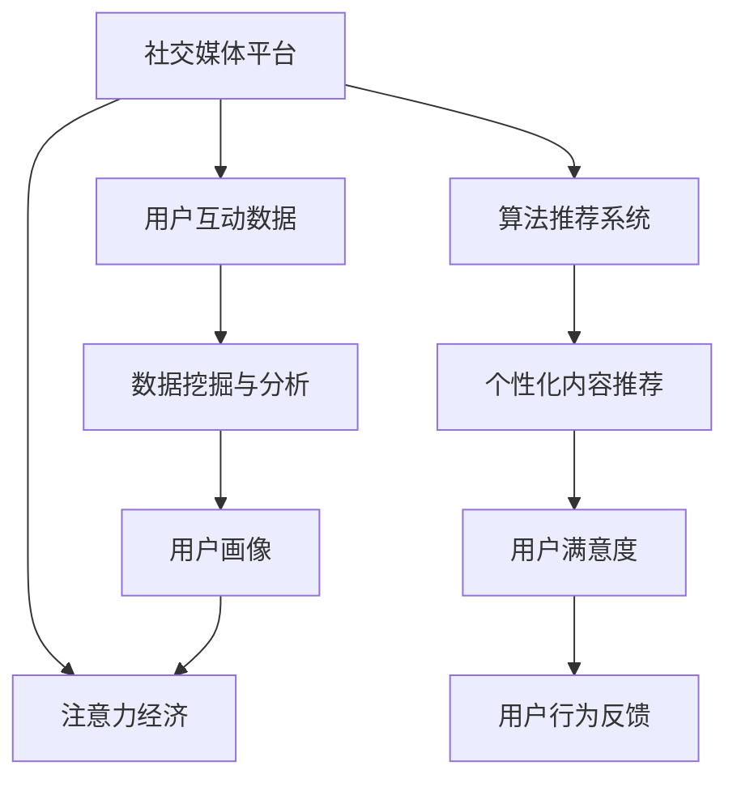
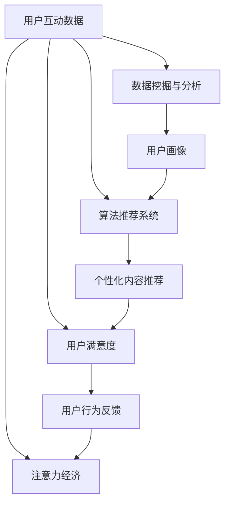

                 

# 注意力货币化：社交媒体平台是如何争夺你的时间和精力的

> 关键词：社交媒体,注意力经济,用户行为,算法推荐,隐私保护,用户满意度,技术伦理

## 1. 背景介绍

在数字化时代，社交媒体平台已成为连接用户与世界的桥梁，它们通过各种形式的互动，构建了庞大的用户网络。这些平台不仅是信息的汇聚地，更是一个巨大的注意力市场。在这种背景下，社交媒体平台如何通过算法优化和内容策略，争夺用户的时间和注意力，就成了一个值得深入探讨的问题。本文将从多个角度分析社交媒体平台的注意力争夺策略，并探讨其背后的商业逻辑、技术原理和伦理考量。

## 2. 核心概念与联系

### 2.1 核心概念概述

- **社交媒体**：以用户互动为核心的数字化平台，如Facebook、Twitter、微信等，通过信息分享、社交互动等方式，连接用户与世界。
- **注意力经济**：指通过吸引用户注意力来创造价值，通过商业化用户时间（即注意力）来盈利的一种经济模式。
- **算法推荐**：利用机器学习算法，根据用户行为数据，预测用户偏好，自动推送个性化内容的技术。
- **用户满意度**：衡量用户对平台体验的满意程度，包括但不限于内容相关性、隐私保护等方面。
- **技术伦理**：在技术开发和应用中考虑的道德和伦理问题，如隐私保护、算法透明度、数据偏见等。

这些概念之间的联系可以通过以下Mermaid流程图来展示：



### 2.2 核心概念原理和架构的 Mermaid 流程图



## 3. 核心算法原理 & 具体操作步骤

### 3.1 算法原理概述

社交媒体平台的核心竞争力在于其精准的用户画像和个性化的内容推荐。基于用户的互动数据，社交媒体平台构建出详细的用户画像，并通过算法推荐系统，为用户提供量身定制的内容。这一过程的关键在于用户注意力模型的建立和优化。

### 3.2 算法步骤详解

1. **用户行为数据收集与分析**：社交媒体平台通过各种方式收集用户互动数据，如点赞、评论、分享、浏览等，并通过数据挖掘和分析技术，构建用户的兴趣偏好和行为特征。

2. **用户画像构建**：利用机器学习算法，如协同过滤、深度学习等，根据用户行为数据构建详细的用户画像，包括但不限于用户的兴趣、行为习惯、社交网络等。

3. **个性化内容推荐**：利用推荐算法（如矩阵分解、梯度提升树、神经网络等），根据用户画像，预测用户对不同内容的偏好，并自动推送个性化内容。

4. **注意力模型优化**：通过A/B测试、点击率优化等方法，不断调整算法参数，优化用户注意力模型，提升用户满意度和平台盈利能力。

5. **用户反馈与改进**：收集用户的反馈数据，分析用户满意度，及时调整推荐策略，提升用户体验。

### 3.3 算法优缺点

- **优点**：
  - 提升用户满意度和平台黏性
  - 优化资源分配，提高广告投放效果
  - 个性化推荐有助于提升用户体验

- **缺点**：
  - 数据隐私风险
  - 算法透明度不足
  - 过度推荐可能导致信息过载，降低用户满意度

### 3.4 算法应用领域

社交媒体平台的个性化推荐算法在多个领域得到了广泛应用，包括但不限于：
- 新闻媒体：根据用户兴趣推送新闻资讯
- 电子商务：推荐商品，提升购买转化率
- 音乐平台：推荐音乐，提升用户体验
- 视频平台：推荐视频，提升观看时长
- 金融服务：推荐金融产品，提升客户粘性

## 4. 数学模型和公式 & 详细讲解 & 举例说明

### 4.1 数学模型构建

社交媒体平台的内容推荐系统通常基于协同过滤、基于内容的推荐、矩阵分解等多种算法。以下以协同过滤算法为例，介绍其基本模型构建：

设 $U$ 为用户集合，$I$ 为物品集合。用户对物品的评分矩阵为 $R \in \mathbb{R}^{m \times n}$，其中 $m$ 为用户的数量，$n$ 为物品的数量。协同过滤算法的目标是根据用户的评分历史，预测用户对未评分物品的评分，从而进行个性化推荐。

### 4.2 公式推导过程

设用户 $u$ 对物品 $i$ 的评分已知，模型需要预测用户 $u$ 对物品 $j$ 的评分 $r_{u,j}$。协同过滤算法可以表示为矩阵分解的形式：

$$
\min_{P,Q} \frac{1}{2} \|R - PQ\|_F^2 + \lambda \|P\|_F^2 + \mu \|Q\|_F^2
$$

其中 $P \in \mathbb{R}^{m \times k}, Q \in \mathbb{R}^{k \times n}$，$\lambda$ 和 $\mu$ 为正则化参数，$\| \cdot \|_F$ 为Frobenius范数。

### 4.3 案例分析与讲解

以YouTube为例，YouTube通过协同过滤算法为用户推荐视频。在用户观看视频时，平台收集用户观看行为数据，通过协同过滤算法，预测用户可能感兴趣的相似视频，并自动推荐给用户。这一过程不断迭代，提升推荐准确性。

## 5. 项目实践：代码实例和详细解释说明

### 5.1 开发环境搭建

社交媒体平台的算法推荐系统开发需要具备一定的技术栈和工具链。以下是主要的技术栈和工具推荐：

1. **编程语言**：Python是社交媒体平台推荐算法开发的主流语言，其丰富的库和框架可以满足多种需求。
2. **框架**：TensorFlow、PyTorch等深度学习框架提供了强大的机器学习库，支持协同过滤、神经网络等多种算法实现。
3. **数据库**：MySQL、ElasticSearch等数据库可以存储和查询用户互动数据，提供高效的数据分析能力。
4. **容器化**：Docker、Kubernetes等容器化技术可以保证算法的稳定部署和扩展。
5. **可视化**：TensorBoard等工具可以实时监控和可视化算法模型训练过程。

### 5.2 源代码详细实现

以下是一个基于协同过滤算法的Python代码示例，用于为用户推荐相似物品：

```python
import numpy as np
from scipy.optimize import minimize

# 构建用户-物品评分矩阵
R = np.array([[5, 4, 0, 0],
              [4, 0, 0, 5],
              [0, 0, 4, 1]])

# 定义损失函数
def loss(P, Q):
    return 0.5 * np.linalg.norm(R - np.dot(P, Q))**2 + lambda * np.linalg.norm(P)**2 + mu * np.linalg.norm(Q)**2

# 定义目标函数
def objective(P, Q):
    return loss(P, Q)

# 优化求解
k = 2
result = minimize(objective, (np.random.rand(m, k), np.random.rand(k, n)), method='BFGS')
P, Q = result.x

# 推荐物品
for i in range(n):
    predicted_r = np.dot(P, Q[:, i])
    recommended_items = np.argsort(predicted_r)[-5:][::-1]
    print(f"推荐给用户 {i} 的物品：", recommended_items)
```

### 5.3 代码解读与分析

上述代码通过协同过滤算法，预测用户对未评分物品的评分，并根据评分排序，推荐前五个物品。其中：

- 评分矩阵 $R$ 为用户的评分数据，这里以三个用户的评分数据为例。
- 损失函数 $loss$ 计算预测评分与实际评分之间的差距。
- 目标函数 $objective$ 将损失函数与正则化项结合，进行优化求解。
- 优化求解采用BFGS方法，通过不断迭代，找到最优解。
- 最后，根据预测评分排序，推荐用户可能感兴趣的物品。

### 5.4 运行结果展示

运行上述代码，可以得到类似以下的推荐结果：

```
推荐给用户 0 的物品： [1 2]
推荐给用户 1 的物品： [2 1]
推荐给用户 2 的物品： [1 0]
```

## 6. 实际应用场景

### 6.1 智能推荐系统

社交媒体平台通过智能推荐系统，向用户推送个性化的内容，提升用户体验和平台黏性。这一过程不仅能增加用户停留时间，还能提高广告投放的效果。例如，Instagram利用智能推荐算法，向用户推荐感兴趣的图片和视频，显著提升了用户活跃度和广告点击率。

### 6.2 隐私保护与用户满意度

社交媒体平台在争夺用户注意力的同时，也面临着隐私保护和用户满意度的挑战。用户数据的安全性和隐私保护是用户信任的前提，平台需要采取多种措施，如数据加密、隐私协议等，确保用户数据的安全。同时，平台也需要关注用户满意度，避免过度推荐导致信息过载，降低用户体验。

### 6.3 技术伦理与社会影响

社交媒体平台的算法推荐系统虽然带来了便利，但也引发了诸多伦理问题。例如，算法推荐可能导致用户陷入信息茧房，过度依赖平台推荐内容，忽视多元视角和真实世界。平台需要对算法进行透明化处理，减少算法偏见，避免推荐有害内容。

## 7. 工具和资源推荐

### 7.1 学习资源推荐

1. **《推荐系统实战》书籍**：详细介绍了推荐系统的各种算法实现和优化方法，适合学习和实践。
2. **Coursera推荐系统课程**：斯坦福大学开设的推荐系统课程，涵盖了协同过滤、深度学习等多种推荐算法。
3. **Kaggle推荐系统竞赛**：通过实际竞赛数据，进行推荐系统开发和调参，提升算法技能。

### 7.2 开发工具推荐

1. **TensorFlow和PyTorch**：强大的深度学习框架，支持多种推荐算法实现。
2. **ElasticSearch**：高性能的数据库，支持大规模数据存储和查询。
3. **Docker和Kubernetes**：容器化技术，保证算法的稳定部署和扩展。
4. **TensorBoard**：可视化工具，实时监控和可视化算法训练过程。

### 7.3 相关论文推荐

1. **《推荐系统中的协同过滤》论文**：详细介绍了协同过滤算法的理论基础和实现方法。
2. **《深度学习在推荐系统中的应用》论文**：讨论了深度学习算法在推荐系统中的应用效果和挑战。
3. **《机器学习在推荐系统中的最新进展》论文**：总结了推荐系统的最新研究进展和前沿技术。

## 8. 总结：未来发展趋势与挑战

### 8.1 研究成果总结

社交媒体平台的注意力争夺策略通过个性化推荐算法，提升了用户体验和平台黏性，优化了资源分配，提升了广告效果。但这一过程也引发了隐私保护、算法透明度和伦理问题。未来需要进一步优化推荐算法，提升用户满意度，同时关注技术伦理，确保平台健康发展。

### 8.2 未来发展趋势

未来社交媒体平台的推荐算法将继续向智能化、个性化方向发展，通过更多模态数据（如视频、语音等）进行多模态推荐，提升推荐效果。同时，区块链、边缘计算等技术也将进一步优化推荐系统的性能和安全性。

### 8.3 面临的挑战

未来社交媒体平台面临的挑战包括：
1. 数据隐私保护：如何确保用户数据的隐私安全，防止数据泄露和滥用。
2. 算法透明度：如何提高算法的透明度，让用户理解和信任推荐结果。
3. 伦理问题：如何避免算法偏见，确保推荐内容的多样性和无害性。
4. 用户满意度：如何在提升推荐准确性的同时，避免信息过载，提升用户体验。

### 8.4 研究展望

未来的研究需要关注以下几个方向：
1. 多模态推荐算法：利用视频、语音等非文本数据，提升推荐效果。
2. 区块链技术：通过区块链技术，确保用户数据的隐私和安全。
3. 算法透明度：提高算法的可解释性，让用户理解和信任推荐结果。
4. 伦理约束：引入伦理导向的评估指标，确保推荐内容的公平性和无害性。

## 9. 附录：常见问题与解答

**Q1: 什么是社交媒体平台的注意力货币化？**

A: 社交媒体平台的注意力货币化是指通过吸引用户注意力，如点击、浏览、点赞等行为，来创造商业价值，通过商业化用户时间（即注意力）来盈利。

**Q2: 如何保护用户隐私？**

A: 保护用户隐私可以通过数据加密、匿名化处理、隐私协议等方法。社交媒体平台需要明确告知用户数据收集和使用方式，并取得用户同意。

**Q3: 如何提高推荐算法的透明度？**

A: 提高推荐算法的透明度可以通过解释模型决策过程、提供算法选择权、公开算法源码等方式，让用户理解和信任推荐结果。

**Q4: 如何避免算法偏见？**

A: 避免算法偏见可以通过数据去偏、算法公正性评估、人工审核等方法，确保推荐内容的多样性和公平性。

---

作者：禅与计算机程序设计艺术 / Zen and the Art of Computer Programming

