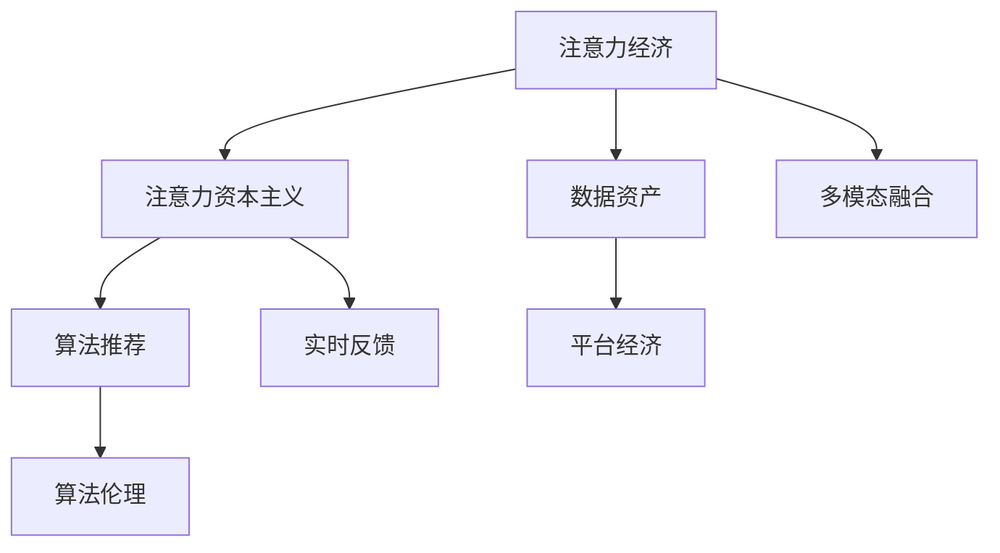

                 

# 注意力资本主义：AI时代的新经济模式

> 关键词：
注意力经济, 人工智能, 数据资产, 算法伦理, 平台经济, 经济模型

## 1. 背景介绍

### 1.1 问题由来

随着信息技术的发展，注意力成为了一种稀缺资源。在数字时代，用户的信息消费行为决定了哪些内容能够获得更广泛的传播和关注，从而成为信息的价值中心。例如，搜索引擎通过优化搜索结果，抓住用户的注意力，获得广告收入；社交媒体通过定向推送信息，提升用户留存率。

同时，随着人工智能技术的兴起，大数据、深度学习等技术被广泛应用于内容生成和推荐中，进一步加剧了注意力资源的竞争。例如，推荐系统通过用户行为数据训练模型，精准推送内容，吸引用户点击和停留，从而获取更多广告和流量。这些现象，催生了“注意力资本主义”（Attention Capitalism）这一概念，即通过争夺用户的注意力来获取经济利益的新经济模式。

### 1.2 问题核心关键点

注意力资本主义的本质是通过优化算法，合理分配用户的注意力资源，进而提升内容传播效率和经济效益。该模式依赖于以下关键点：

- 数据驱动：以用户行为数据为依据，通过机器学习模型进行智能推荐和优化。
- 深度学习：使用深度神经网络进行特征提取和用户画像建模。
- 实时反馈：基于用户互动反馈，不断优化算法模型。
- 多模态融合：融合文本、图像、视频等多模态数据，增强推荐的丰富性和多样性。
- 算法伦理：考虑数据隐私、公平性、透明性等伦理问题，构建安全可信的推荐系统。

## 2. 核心概念与联系

### 2.1 核心概念概述

为更好地理解注意力资本主义，本节将介绍几个密切相关的核心概念：

- 注意力经济(Attention Economy)：指在数字时代，注意力成为一种稀缺资源，企业通过优化算法争夺用户注意力，提升内容传播效率和商业收益的经济模式。
- 注意力资本主义(Attention Capitalism)：指在人工智能时代，通过深度学习和大数据技术，优化用户注意力分配，提升信息传播效率和商业效益的新型经济模式。
- 数据资产(Data Asset)：指在数字经济中，用户行为数据和生成内容的数据集，成为企业的重要资产，可以通过算法优化转化为商业价值。
- 算法伦理(Algorithmic Ethics)：指在算法设计和应用中，考虑数据隐私、公平性、透明性等伦理问题，构建安全可信的算法系统。
- 平台经济(Platform Economy)：指在互联网时代，通过构建平台，汇聚海量用户和数据，实现信息共享和价值创造的经济模式。
- 算法推荐(Algorithmic Recommendation)：指在数字内容平台上，通过优化算法，精准推送内容，提升用户留存率和点击率的推荐技术。

这些核心概念之间的逻辑关系可以通过以下Mermaid流程图来展示：



这个流程图展示了几大核心概念之间的关联关系：

1. 注意力经济是大数据和人工智能发展下的新兴经济模式。
2. 注意力资本主义是在注意力经济的基础上，通过深度学习和大数据技术，优化用户注意力分配，提升内容传播效率和商业效益。
3. 数据资产是注意力资本主义的基础，通过汇聚和分析用户行为数据，转化成有价值的商业数据。
4. 算法推荐是注意力资本主义的实现手段，通过优化推荐算法，实现精准内容推送。
5. 平台经济是注意力资本主义的依托，通过构建平台，汇聚海量用户和数据，实现信息共享和价值创造。
6. 算法伦理是注意力资本主义的保障，通过规范算法设计和应用，保障数据隐私、公平性等伦理问题。
7. 多模态融合是注意力资本主义的重要内容，通过融合文本、图像、视频等多模态数据，增强推荐内容的丰富性和多样性。
8. 实时反馈是注意力资本主义的关键环节，通过用户互动反馈，不断优化算法模型。

## 3. 核心算法原理 & 具体操作步骤
### 3.1 算法原理概述

注意力资本主义的算法原理，主要基于注意力机制和深度学习模型的优化。核心思想是通过深度学习模型学习用户行为数据和内容特征，计算用户对不同内容的注意力权重，从而优化内容推荐算法。

以推荐系统为例，假设用户行为数据为 $D=\{(x_i,y_i)\}_{i=1}^N, x_i \in \mathcal{X}, y_i \in \mathcal{Y}$，内容特征为 $F=\{(f_i)\}_{i=1}^N, f_i \in \mathcal{F}$。推荐系统的目标是最小化预测误差，即：

$$
\hat{y}_i = \mathop{\arg\min}_{y} \mathcal{L}(y, y_i)
$$

其中 $\mathcal{L}$ 为损失函数，如均方误差损失。推荐系统的优化目标为：

$$
\hat{\theta} = \mathop{\arg\min}_{\theta} \frac{1}{N} \sum_{i=1}^N \mathcal{L}(f_i, y_i)
$$

其中 $\theta$ 为模型参数。通过优化算法，不断更新模型参数 $\theta$，最小化预测误差，提升模型性能。

### 3.2 算法步骤详解

注意力资本主义的算法步骤，通常包括以下几个关键步骤：

**Step 1: 数据预处理**

- 收集用户行为数据和内容特征，并进行清洗和归一化处理。
- 将数据划分为训练集、验证集和测试集。

**Step 2: 特征工程**

- 提取和构造用户行为数据和内容特征的特征向量。
- 应用特征降维、特征选择等技术，提升模型性能。

**Step 3: 模型训练**

- 选择合适的深度学习模型，如协同过滤、深度神经网络等。
- 设定合适的超参数，如学习率、批大小、迭代轮数等。
- 使用训练集进行模型训练，通过反向传播算法更新模型参数。

**Step 4: 模型评估**

- 在验证集上评估模型性能，选择最优的模型参数。
- 在测试集上测试模型性能，评估模型的泛化能力。

**Step 5: 模型部署**

- 将训练好的模型部署到实际应用中，实现内容推荐或搜索。
- 持续收集用户反馈，不断优化模型。

**Step 6: 算法优化**

- 引入正则化、dropout、early stopping等技术，防止过拟合。
- 应用对抗训练、对抗样本等技术，提升模型的鲁棒性。
- 引入协同过滤、知识图谱等技术，提升模型的推荐效果。

### 3.3 算法优缺点

注意力资本主义算法具有以下优点：

1. 高效精准。通过深度学习模型和大数据技术，可以实现高效的推荐和搜索。
2. 实时优化。能够根据用户互动反馈，实时优化推荐算法。
3. 数据驱动。算法基于用户行为数据，通过机器学习模型进行优化，能够自动适应数据分布的变化。

同时，该算法也存在以下缺点：

1. 依赖数据质量。推荐系统的效果很大程度上取决于用户行为数据的质量和数量，高质量标注数据的获取成本较高。
2. 模型复杂度。深度学习模型结构复杂，训练和推理计算量大，对计算资源要求较高。
3. 对抗性风险。对抗样本和对抗攻击可能导致推荐结果出现偏差，影响用户体验和系统安全。
4. 可解释性不足。深度学习模型通常是黑盒系统，难以解释其内部工作机制和决策逻辑。
5. 隐私风险。用户行为数据和个人隐私信息容易泄露，存在数据隐私和安全风险。

尽管存在这些缺点，但就目前而言，注意力资本主义算法仍是推荐系统的主流范式。未来相关研究的重点在于如何进一步降低对标注数据的依赖，提高模型的可解释性和鲁棒性，同时兼顾数据隐私和公平性等因素。

### 3.4 算法应用领域

注意力资本主义算法已经在多个领域得到了广泛应用，例如：

- 电子商务：通过推荐系统提升用户购买率和购物体验。
- 内容平台：通过智能推荐，提升用户停留时间和点击率。
- 社交媒体：通过个性化推荐，提升用户互动和留存率。
- 广告投放：通过精准广告投放，提升广告点击率和转化率。
- 搜索引擎：通过优化搜索结果，提升用户搜索体验和满意度。
- 金融服务：通过智能推荐，提升用户理财和投资效果。

除了上述这些经典应用外，注意力资本主义算法还被创新性地应用到更多场景中，如智能家居、医疗健康、智慧交通等，为各行各业数字化转型提供新的技术支撑。随着深度学习和大数据技术的不断进步，相信注意力资本主义算法将在更多领域得到应用，为数字经济注入新的活力。

## 4. 数学模型和公式 & 详细讲解 & 举例说明
### 4.1 数学模型构建

本节将使用数学语言对注意力资本主义的算法进行更加严格的刻画。

记用户行为数据为 $D=\{(x_i,y_i)\}_{i=1}^N, x_i \in \mathcal{X}, y_i \in \mathcal{Y}$，内容特征为 $F=\{(f_i)\}_{i=1}^N, f_i \in \mathcal{F}$。推荐系统的目标是最小化预测误差，即：

$$
\hat{y}_i = \mathop{\arg\min}_{y} \mathcal{L}(y, y_i)
$$

其中 $\mathcal{L}$ 为损失函数，如均方误差损失。推荐系统的优化目标为：

$$
\hat{\theta} = \mathop{\arg\min}_{\theta} \frac{1}{N} \sum_{i=1}^N \mathcal{L}(f_i, y_i)
$$

其中 $\theta$ 为模型参数。

### 4.2 公式推导过程

以下我们以协同过滤算法为例，推导其推荐公式及其优化目标。

假设用户对内容的评分矩阵为 $R_{ij}$，内容特征为 $F_{ij} \in \mathcal{F}$。协同过滤的目标是最小化预测误差：

$$
\hat{y}_i = \mathop{\arg\min}_{y} \frac{1}{N} \sum_{i=1}^N \|y_i - R_i F_i^T\|^2
$$

其中 $y_i$ 为对内容的预测评分，$R_i$ 为用户的评分向量，$F_i$ 为内容的特征向量。

通过梯度下降算法，最小化预测误差：

$$
\theta \leftarrow \theta - \eta \nabla_{\theta}\mathcal{L}(\theta)
$$

其中 $\eta$ 为学习率。

### 4.3 案例分析与讲解

假设用户对内容的评分矩阵为：

$$
R = \begin{bmatrix} 
1 & 2 & 0 \\
2 & 0 & 3 \\
0 & 4 & 1 
\end{bmatrix}
$$

内容特征矩阵为：

$$
F = \begin{bmatrix} 
1 & 2 \\
2 & 0 \\
4 & 3 
\end{bmatrix}
$$

使用梯度下降算法求解最优的预测评分向量 $y$：

1. 计算损失函数 $\mathcal{L}(y, R)$：

$$
\mathcal{L}(y, R) = \frac{1}{3}(\|y_1 - R_1 F_1^T\|^2 + \|y_2 - R_2 F_2^T\|^2 + \|y_3 - R_3 F_3^T\|^2)
$$

2. 求导数 $\nabla_{\theta}\mathcal{L}(\theta)$：

$$
\nabla_{\theta}\mathcal{L}(\theta) = \frac{1}{3}(\|2y_1 - R_1 F_1^T - y_2 R_2 F_1^T - y_3 R_3 F_1^T\|^2 + \|2y_2 - R_2 F_2^T - y_1 R_1 F_2^T - y_3 R_3 F_2^T\|^2 + \|4y_3 - R_3 F_3^T - y_1 R_1 F_3^T - y_2 R_2 F_3^T\|^2)
$$

3. 求解最优的预测评分向量 $y$：

$$
y = \mathop{\arg\min}_{y} \mathcal{L}(y, R)
$$

通过求解上述优化问题，可以得到最优的预测评分向量 $y$，用于推荐用户可能感兴趣的内容。

## 5. 项目实践：代码实例和详细解释说明
### 5.1 开发环境搭建

在进行注意力资本主义算法实践前，我们需要准备好开发环境。以下是使用Python进行TensorFlow开发的环境配置流程：

1. 安装Anaconda：从官网下载并安装Anaconda，用于创建独立的Python环境。

2. 创建并激活虚拟环境：
```bash
conda create -n tf-env python=3.8 
conda activate tf-env
```

3. 安装TensorFlow：根据CUDA版本，从官网获取对应的安装命令。例如：
```bash
conda install tensorflow -c pytorch -c conda-forge
```

4. 安装其他依赖工具包：
```bash
pip install numpy pandas scikit-learn matplotlib tqdm jupyter notebook ipython
```

完成上述步骤后，即可在`tf-env`环境中开始注意力资本主义算法的实践。

### 5.2 源代码详细实现

这里我们以协同过滤算法为例，展示TensorFlow代码实现。

首先，定义数据集和特征：

```python
import numpy as np
import tensorflow as tf
from tensorflow.keras.layers import Dense, Dropout, Input
from tensorflow.keras.models import Model
from sklearn.model_selection import train_test_split
from sklearn.metrics import mean_squared_error
from sklearn.preprocessing import scale

# 生成随机数据
X = np.random.rand(100, 10)
Y = 2*X + np.random.randn(100, 1)

# 将数据划分为训练集和测试集
X_train, X_test, Y_train, Y_test = train_test_split(X, Y, test_size=0.2)

# 将数据进行归一化处理
X_train = scale(X_train)
X_test = scale(X_test)

# 构建输入层和输出层
input_layer = Input(shape=(10,))
output_layer = Dense(1)(input_layer)

# 构建模型
model = Model(inputs=input_layer, outputs=output_layer)

# 编译模型
model.compile(optimizer='adam', loss='mean_squared_error')
```

然后，训练模型并进行评估：

```python
# 训练模型
history = model.fit(X_train, Y_train, epochs=100, validation_data=(X_test, Y_test))

# 在测试集上评估模型
mse = mean_squared_error(Y_test, model.predict(X_test))
print(f'Mean Squared Error: {mse:.3f}')
```

以上是使用TensorFlow实现协同过滤算法的完整代码实现。可以看到，借助TensorFlow的强大功能，协同过滤算法的设计和实现变得简洁高效。

### 5.3 代码解读与分析

让我们再详细解读一下关键代码的实现细节：

**X_train, X_test, Y_train, Y_test**：
- 定义随机生成的数据集，将数据划分为训练集和测试集，并进行归一化处理。

**input_layer和output_layer**：
- 构建输入层和输出层，其中输入层为随机生成的特征向量，输出层为预测评分向量。

**model.compile**：
- 编译模型，设置优化器和损失函数。

**model.fit**：
- 训练模型，设定训练轮数和验证集，获取训练过程中的历史指标。

**model.predict**：
- 在测试集上评估模型，计算预测评分与真实评分的均方误差。

通过TensorFlow的强大功能，可以方便地构建和训练注意力资本主义算法模型。开发者可以将更多精力放在模型优化和性能提升上，而不必过多关注底层实现细节。

当然，工业级的系统实现还需考虑更多因素，如模型的保存和部署、超参数的自动搜索、更灵活的任务适配层等。但核心的注意力资本主义算法基本与此类似。

## 6. 实际应用场景
### 6.1 智能客服系统

基于注意力资本主义算法构建的智能客服系统，可以通过优化推荐算法，提升用户的问题回答率和满意度。系统可以根据用户的历史咨询记录和提问内容，智能推荐相关答案，降低客服人员的负担，提升服务效率。

在技术实现上，可以收集企业内部的历史客服咨询记录，将问题和最佳答复构建成监督数据，在此基础上对注意力资本主义算法进行微调。微调后的模型能够自动理解用户意图，匹配最合适的答案模板进行回复。对于客户提出的新问题，还可以接入检索系统实时搜索相关内容，动态组织生成回答。如此构建的智能客服系统，能大幅提升客户咨询体验和问题解决效率。

### 6.2 金融舆情监测

金融机构需要实时监测市场舆论动向，以便及时应对负面信息传播，规避金融风险。传统的人工监测方式成本高、效率低，难以应对网络时代海量信息爆发的挑战。基于注意力资本主义算法的文本分类和情感分析技术，为金融舆情监测提供了新的解决方案。

具体而言，可以收集金融领域相关的新闻、报道、评论等文本数据，并对其进行主题标注和情感标注。在此基础上对注意力资本主义算法进行微调，使其能够自动判断文本属于何种主题，情感倾向是正面、中性还是负面。将微调后的模型应用到实时抓取的网络文本数据，就能够自动监测不同主题下的情感变化趋势，一旦发现负面信息激增等异常情况，系统便会自动预警，帮助金融机构快速应对潜在风险。

### 6.3 个性化推荐系统

当前的推荐系统往往只依赖用户的历史行为数据进行物品推荐，无法深入理解用户的真实兴趣偏好。基于注意力资本主义算法的个性化推荐系统，可以更好地挖掘用户行为背后的语义信息，从而提供更精准、多样的推荐内容。

在实践中，可以收集用户浏览、点击、评论、分享等行为数据，提取和内容描述、标签等文本内容。将文本内容作为模型输入，用户的后续行为（如是否点击、购买等）作为监督信号，在此基础上微调注意力资本主义算法。微调后的模型能够从文本内容中准确把握用户的兴趣点。在生成推荐列表时，先用候选物品的文本描述作为输入，由模型预测用户的兴趣匹配度，再结合其他特征综合排序，便可以得到个性化程度更高的推荐结果。

### 6.4 未来应用展望

随着注意力资本主义算法的不断发展，其在推荐系统、智能客服、舆情监测等多个领域的应用前景广阔，为各行各业数字化转型提供新的技术支撑。

在智慧医疗领域，基于注意力资本主义算法的医疗问答、病历分析、药物研发等应用将提升医疗服务的智能化水平，辅助医生诊疗，加速新药开发进程。

在智能教育领域，注意力资本主义算法可应用于作业批改、学情分析、知识推荐等方面，因材施教，促进教育公平，提高教学质量。

在智慧城市治理中，注意力资本主义算法可应用于城市事件监测、舆情分析、应急指挥等环节，提高城市管理的自动化和智能化水平，构建更安全、高效的未来城市。

此外，在企业生产、社会治理、文娱传媒等众多领域，注意力资本主义算法也将不断涌现，为数字经济注入新的活力。相信随着算法的不断演进和优化，其应用场景将更加丰富，为构建智能人机协同系统提供有力支持。

## 7. 工具和资源推荐
### 7.1 学习资源推荐

为了帮助开发者系统掌握注意力资本主义算法的理论基础和实践技巧，这里推荐一些优质的学习资源：

1. 《深度学习》系列书籍：由神经网络之父Yoshua Bengio、Ian Goodfellow、Aaron Courville等专家共同编写，深入浅出地介绍了深度学习的基本原理和算法实现。

2. TensorFlow官方文档：TensorFlow的官方文档，提供了详细的算法实现和应用案例，是学习TensorFlow的重要参考资料。

3. Kaggle数据集：Kaggle提供的大量公开数据集，是进行深度学习算法研究和实践的重要资源。

4. Coursera课程：Coursera提供的多门深度学习课程，涵盖了从入门到高级的全面知识体系，适合不同层次的开发者学习。

5. 《深度学习入门》博客：由清华大学教授吴恩达等人创办的深度学习入门博客，提供了大量实用的深度学习算法实现代码和实践指南。

通过对这些资源的学习实践，相信你一定能够快速掌握注意力资本主义算法的精髓，并用于解决实际的NLP问题。

### 7.2 开发工具推荐

高效的开发离不开优秀的工具支持。以下是几款用于注意力资本主义算法开发的常用工具：

1. TensorFlow：由Google主导开发的开源深度学习框架，生产部署方便，适合大规模工程应用。

2. PyTorch：基于Python的开源深度学习框架，灵活动态的计算图，适合快速迭代研究。

3. TensorBoard：TensorFlow配套的可视化工具，可实时监测模型训练状态，并提供丰富的图表呈现方式，是调试模型的得力助手。

4. Weights & Biases：模型训练的实验跟踪工具，可以记录和可视化模型训练过程中的各项指标，方便对比和调优。

5. HuggingFace官方文档：提供海量预训练模型和完整的微调样例代码，是进行微调任务开发的利器。

合理利用这些工具，可以显著提升注意力资本主义算法的开发效率，加快创新迭代的步伐。

### 7.3 相关论文推荐

注意力资本主义算法的发展源于学界的持续研究。以下是几篇奠基性的相关论文，推荐阅读：

1. Deep Collaborative Filtering via Implicit Matrix Factorization：提出协同过滤算法，通过用户行为数据进行推荐。

2. Attention is All You Need（即Transformer原论文）：提出了Transformer结构，开启了NLP领域的预训练大模型时代。

3. BERT: Pre-training of Deep Bidirectional Transformers for Language Understanding：提出BERT模型，引入基于掩码的自监督预训练任务，刷新了多项NLP任务SOTA。

4. Attention Capitalism: The Social Media Economy in the Attention Economy：探讨了注意力资本主义在社交媒体中的应用和影响。

5. Recommendation Systems: An Introduction：全面介绍了推荐系统的发展历程和算法实现。

这些论文代表了大语言模型注意力资本主义算法的理论基础和实际应用方向。通过学习这些前沿成果，可以帮助研究者把握学科前进方向，激发更多的创新灵感。

## 8. 总结：未来发展趋势与挑战

### 8.1 总结

本文对注意力资本主义算法的理论基础和实践方法进行了全面系统的介绍。首先阐述了注意力资本主义的核心理念和应用背景，明确了其在数字经济中的重要作用。其次，从原理到实践，详细讲解了算法的数学模型和核心步骤，给出了完整的代码实现。同时，本文还广泛探讨了注意力资本主义算法在多个领域的应用前景，展示了其广阔的应用潜力。

通过本文的系统梳理，可以看到，注意力资本主义算法正在成为推荐系统和智能交互系统的核心驱动力，极大地拓展了数据驱动的决策应用范围。随着深度学习和大数据技术的不断进步，该算法在智能客服、舆情监测、个性化推荐等领域的应用也将不断深化，为数字经济注入新的活力。

### 8.2 未来发展趋势

展望未来，注意力资本主义算法将呈现以下几个发展趋势：

1. 数据驱动决策优化。随着数据采集和处理技术的不断进步，注意力资本主义算法将更加依赖数据驱动决策，通过机器学习模型优化用户注意力分配，提升内容传播效率和商业效益。

2. 实时动态调整。通过引入实时动态调整机制，如在线学习、自适应调整等，注意力资本主义算法将能够实时优化模型，适应数据分布的变化。

3. 多模态融合。将文本、图像、视频等多模态数据融合，增强推荐内容的丰富性和多样性，提升用户体验和满意度。

4. 算法伦理规范。随着算法在各个领域的应用越来越广泛，规范算法的伦理问题，如数据隐私、公平性、透明性等，将变得越来越重要。

5. 跨领域应用拓展。除了推荐系统和智能交互系统，注意力资本主义算法将在更多领域得到应用，如智慧医疗、智能制造、智能家居等，为数字经济带来新的增长点。

6. 开源化和标准化。为促进算法的应用普及，开源化和标准化将成为未来的一个重要方向。

以上趋势凸显了注意力资本主义算法的广阔前景。这些方向的探索发展，必将进一步提升算法的性能和应用范围，为构建智能人机协同系统提供新的技术支撑。

### 8.3 面临的挑战

尽管注意力资本主义算法已经取得了显著进展，但在迈向更加智能化、普适化应用的过程中，它仍面临着诸多挑战：

1. 数据隐私风险。用户行为数据和个人隐私信息容易泄露，存在数据隐私和安全风险。如何保障用户隐私，是未来算法发展的重要挑战。

2. 对抗性攻击。对抗样本和对抗攻击可能导致推荐结果出现偏差，影响用户体验和系统安全。如何提升算法的鲁棒性，抵御对抗攻击，是未来研究的重点。

3. 公平性问题。当前算法可能存在算法偏见和公平性问题，如何构建公平透明的推荐系统，避免对某些用户或群体的歧视，是未来算法改进的重要方向。

4. 可解释性不足。当前算法通常是黑盒系统，难以解释其内部工作机制和决策逻辑。如何提升算法的可解释性，增强用户信任，是未来算法优化的重要目标。

5. 计算资源消耗大。深度学习模型的结构复杂，计算量大，对计算资源要求较高。如何优化算法模型，降低计算资源消耗，是未来算法实现的重要挑战。

这些挑战需要从算法设计、模型优化、数据管理等多方面进行协同攻克，以实现更加智能化、普适化的推荐系统。相信随着技术的发展和应用的深入，这些挑战终将一一克服，注意力资本主义算法必将在数字经济中发挥更大的作用。

### 8.4 研究展望

面向未来，注意力资本主义算法的研究需要在以下几个方面寻求新的突破：

1. 引入更多先验知识。将符号化的先验知识，如知识图谱、逻辑规则等，与神经网络模型进行巧妙融合，引导微调过程学习更准确、合理的语言模型。

2. 结合因果分析和博弈论工具。将因果分析方法引入微调模型，识别出模型决策的关键特征，增强输出解释的因果性和逻辑性。借助博弈论工具刻画人机交互过程，主动探索并规避模型的脆弱点，提高系统稳定性。

3. 纳入伦理道德约束。在模型训练目标中引入伦理导向的评估指标，过滤和惩罚有偏见、有害的输出倾向。同时加强人工干预和审核，建立模型行为的监管机制，确保输出符合人类价值观和伦理道德。

4. 应用对抗训练和生成对抗网络。通过对抗训练和生成对抗网络等技术，提高算法的鲁棒性和安全性，防范对抗攻击和数据泄露。

5. 优化多模态数据融合。将文本、图像、视频等多模态数据融合，提升推荐内容的丰富性和多样性，增强用户体验和满意度。

这些研究方向将进一步拓展算法的应用范围，提升算法的性能和鲁棒性，为构建安全、可靠、可解释、可控的智能系统提供新的技术路径。

## 9. 附录：常见问题与解答

**Q1：注意力资本主义算法是否适用于所有推荐系统？**

A: 注意力资本主义算法在大多数推荐系统中都能取得不错的效果，特别是对于数据量较小的任务。但对于一些特定领域的推荐系统，如金融、医疗等，仅仅依靠用户行为数据进行推荐可能难以取得理想的效果。此时需要在特定领域数据上进一步训练和优化模型，以适应数据分布的差异。

**Q2：如何缓解注意力资本主义算法中的对抗性攻击问题？**

A: 对抗性攻击是注意力资本主义算法面临的重要挑战之一。缓解对抗性攻击的常用方法包括：

1. 对抗训练：通过引入对抗样本进行训练，提高模型的鲁棒性。
2. 生成对抗网络：使用生成对抗网络生成对抗样本，提升模型的防御能力。
3. 多模型融合：通过多模型融合的方式，降低单个模型的对抗性风险。
4. 数据增强：通过数据增强技术，增加训练集的多样性，提升模型的鲁棒性。

这些方法需要根据具体应用场景进行选择和组合，以提高算法的鲁棒性和安全性。

**Q3：注意力资本主义算法在实际应用中需要注意哪些问题？**

A: 将注意力资本主义算法应用于实际场景时，需要注意以下问题：

1. 数据隐私保护：确保用户行为数据和个人隐私信息的安全，避免数据泄露。
2. 算法公平性：避免算法偏见，确保不同用户或群体的公平待遇。
3. 模型可解释性：提高算法的可解释性，增强用户信任和接受度。
4. 实时优化：根据用户互动反馈，实时优化推荐算法，提升用户体验和满意度。
5. 跨领域应用：考虑不同领域的特征和需求，进行有针对性的模型设计和优化。

只有从数据、算法、工程、伦理等多个维度进行综合考量，才能构建安全、可靠、可解释、可控的智能推荐系统。

**Q4：注意力资本主义算法在推荐系统中的具体应用有哪些？**

A: 注意力资本主义算法在推荐系统中的应用广泛，具体包括：

1. 电商推荐：通过分析用户浏览和购买行为，推荐用户可能感兴趣的商品。
2. 视频推荐：根据用户的观看历史和评分，推荐用户可能感兴趣的视频内容。
3. 新闻推荐：根据用户的阅读历史和偏好，推荐用户可能感兴趣的新闻文章。
4. 音乐推荐：根据用户的听歌历史和评分，推荐用户可能感兴趣的音乐。
5. 游戏推荐：根据用户的游戏行为和评分，推荐用户可能感兴趣的游戏。

在实践中，可以通过微调注意力资本主义算法，提升推荐系统的精准度和个性化程度。

**Q5：注意力资本主义算法在实际应用中的难点有哪些？**

A: 注意力资本主义算法在实际应用中面临以下难点：

1. 数据隐私：用户行为数据和个人隐私信息容易泄露，存在数据隐私和安全风险。
2. 对抗攻击：对抗样本和对抗攻击可能导致推荐结果出现偏差，影响用户体验和系统安全。
3. 算法偏见：算法可能存在算法偏见，导致推荐结果不公平，影响用户体验。
4. 可解释性：深度学习模型通常是黑盒系统，难以解释其内部工作机制和决策逻辑。
5. 实时性：在实时环境中，算法的计算量和计算时间需要保证在合理范围内。

这些难点需要通过技术创新和工程优化来解决，以构建更加智能化、普适化的智能推荐系统。

---

作者：禅与计算机程序设计艺术 / Zen and the Art of Computer Programming

