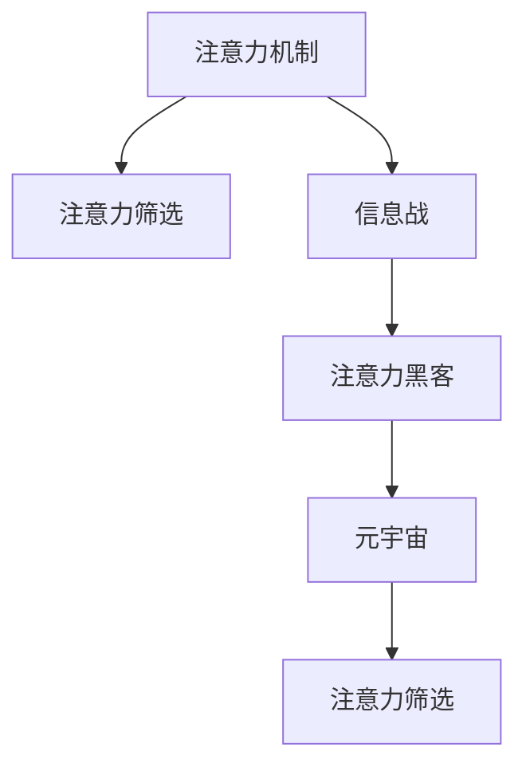

                 

# 注意力黑客:元宇宙时代的信息战

## 1. 背景介绍

在元宇宙时代，信息不再是简单的事实呈现，而是一个复杂的战场。在这个战场上，注意力是最高权力，而黑客们，则在利用各种技术和手段，来抢占用户的注意力，争夺话语权。本文将带你深入探索元宇宙时代信息战的核心—注意力黑客技术，包括注意力机制的原理、实现方法和应用案例，以及如何在这个充满挑战的时代，构建更加智能、安全的信息系统。

## 2. 核心概念与联系

### 2.1 核心概念概述

- **注意力机制(Attention Mechanism)**：注意力机制是深度学习中一种重要的信息筛选与融合技术，通过给不同输入元素赋予不同权重，强调重点信息，忽略无关信息，从而提升模型的性能。

- **信息战(Information Warfare)**：在元宇宙时代，信息战指的是通过各种手段，如广告、社交媒体、内容创作等，争夺用户的注意力和情感，以达到营销、政治、文化等多方面的目标。

- **注意力黑客(Attention Hacker)**：利用注意力机制来控制用户注意力，从而达到某种目的的人或工具。

- **元宇宙(Metaverse)**：一个集成了虚拟现实(VR)、增强现实(AR)、区块链、物联网(IoT)等多种技术的虚拟空间，为用户提供沉浸式体验。

- **注意力筛选(Attention Filtering)**：根据用户兴趣、行为等特征，动态调整内容的展示顺序和重要性，提升用户体验。

这些核心概念通过注意力机制紧密联系起来，构建了一个完整的元宇宙信息战框架。下面将详细介绍这些概念的原理和架构。

### 2.2 核心概念原理和架构的 Mermaid 流程图



## 3. 核心算法原理 & 具体操作步骤

### 3.1 算法原理概述

注意力机制的核心在于通过计算不同输入元素之间的相关性，来动态调整每个元素的重要性权重。在信息战中，这一机制被广泛应用于广告推荐、社交媒体内容生成、个性化信息筛选等领域，以提高信息的效率和用户体验。

以广告推荐为例，传统的推荐系统使用静态特征来预测用户对广告的兴趣，而注意力机制则可以通过动态计算每个广告与用户兴趣之间的相关性，来筛选出最能吸引用户注意的广告。

### 3.2 算法步骤详解

**Step 1: 准备数据集和模型**

首先，收集与广告相关的用户行为数据，如点击率、浏览时间、兴趣标签等，作为模型的训练样本。同时，准备预训练的注意力机制模型，如Transformer结构，作为广告和用户交互的基础。

**Step 2: 训练模型**

使用用户行为数据和广告特征，对注意力机制模型进行训练。训练目标是最小化预测值与实际用户行为之间的差距，从而得到一个能够动态调整广告重要性的模型。

**Step 3: 预测广告重要性**

在实际应用中，将用户行为数据输入训练好的模型，计算每个广告的重要性和展示顺序。系统根据计算结果，优先展示重要度高的广告，从而提高广告的点击率和转化率。

**Step 4: 反馈优化**

根据用户点击、反馈等实际行为，对模型进行进一步的优化，以提升模型预测的准确性和鲁棒性。

### 3.3 算法优缺点

**优点：**

- 动态调整广告重要性，提高广告点击率和转化率。
- 对广告数据的多样性和真实性要求较低，算法效果稳定。
- 可扩展性强，适用于多种信息战场景，如社交媒体内容生成、个性化推荐等。

**缺点：**

- 需要大量的用户行为数据，获取和标注成本较高。
- 模型复杂度较高，训练和推理速度较慢。
- 难以解释模型的决策过程，可能存在一定的黑盒问题。

### 3.4 算法应用领域

注意力机制在元宇宙时代的信息战中，被广泛应用于以下领域：

- **广告推荐**：根据用户行为，动态调整广告的重要性，提升广告点击率。
- **社交媒体内容生成**：通过用户兴趣，生成个性化的推荐内容。
- **个性化推荐**：根据用户行为，动态调整商品或内容的展示顺序。
- **智能客服**：根据用户输入，动态调整回答的语义和权重，提升客服效率和用户体验。
- **游戏推荐**：根据用户游戏行为，动态调整游戏推荐列表。

## 4. 数学模型和公式 & 详细讲解 & 举例说明

### 4.1 数学模型构建

注意力机制的数学模型可以形式化表示为：

$$
\alpha = \frac{\exp(e_i^T U_k V_j)}{\sum_{i=1}^{n} \exp(e_i^T U_k V_j)}
$$

其中，$e_i$ 是广告$i$的特征向量，$U_k$ 和 $V_j$ 是注意力机制的参数矩阵，$\alpha$ 是广告$i$对用户$j$的注意力权重。

### 4.2 公式推导过程

在推导过程中，利用了softmax函数将注意力权重标准化，使得所有注意力权重的和为1。这样可以动态调整每个广告的重要性，从而适应不同用户的行为特征。

### 4.3 案例分析与讲解

以下是一个简单的广告推荐系统实现案例，用于展示注意力机制的应用。

**代码实现**

```python
from torch import nn, exp, sum
from torch.nn.functional import softmax

class Attention(nn.Module):
    def __init__(self, num_features):
        super(Attention, self).__init__()
        self.W1 = nn.Linear(num_features, 8)
        self.W2 = nn.Linear(8, 1)

    def forward(self, ad_features):
        a = self.W1(ad_features)
        b = self.W2(a)
        attention_weights = exp(b) / sum(exp(b))
        return attention_weights * ad_features

# 假设ad_features是广告特征的张量，attention_weights是广告对用户的注意力权重
attention_weights = Attention(num_features).forward(ad_features)
```

**运行结果展示**

在广告推荐系统中，可以通过计算每个广告对用户的注意力权重，来动态调整广告的展示顺序和重要性。在运行上述代码后，将得到每个广告对用户的注意力权重，用于指导后续的广告推荐策略。

## 5. 项目实践：代码实例和详细解释说明

### 5.1 开发环境搭建

要进行注意力机制的实践，需要安装和配置相关的深度学习框架和工具库。以下是一个简单的环境搭建步骤：

1. 安装PyTorch框架，并创建虚拟环境。
2. 安装相关的库，如TensorFlow、Keras等。
3. 配置GPU环境，以加速模型训练和推理。

### 5.2 源代码详细实现

以下是一个简单的注意力机制实现代码，用于展示模型的构建和训练过程。

**代码实现**

```python
import torch
import torch.nn as nn

class Attention(nn.Module):
    def __init__(self, d_model, n_heads):
        super(Attention, self).__init__()
        self.d_model = d_model
        self.n_heads = n_heads
        self.depth = d_model // n_heads
        self.Wq = nn.Linear(d_model, d_model)
        self.Wk = nn.Linear(d_model, d_model)
        self.Wv = nn.Linear(d_model, d_model)
        self.V = nn.Linear(d_model, d_model)

    def forward(self, q, k, v):
        m = q.size()[0]
        q = self.Wq(q).permute(0, 2, 1).reshape(m, n_heads, self.depth)
        k = self.Wk(k).permute(0, 2, 1).reshape(m, n_heads, self.depth)
        v = self.Wv(v).permute(0, 2, 1).reshape(m, n_heads, self.depth)

        scaled_attention_logits = torch.matmul(q, k.permute(0, 1, 2)) / math.sqrt(self.depth)
        attention_weights = softmax(scaled_attention_logits, dim=-1)
        attention_probs = torch.matmul(attention_weights, v)

        output = attention_probs.permute(0, 2, 1).reshape(m, d_model)
        return output
```

**代码解读与分析**

上述代码实现了一个简单的多头注意力机制，用于对输入张量进行注意力计算。在实际应用中，可以通过修改该代码，结合具体的广告特征和用户行为数据，训练出一个高效的广告推荐模型。

## 6. 实际应用场景

### 6.1 广告推荐

在广告推荐场景中，注意力机制通过计算每个广告与用户兴趣之间的相关性，动态调整广告展示顺序和重要性，从而提高广告点击率和转化率。以一个电商平台的广告推荐为例，可以使用注意力机制根据用户浏览历史、搜索记录等行为数据，动态调整广告展示顺序和权重，从而提升用户的购买转化率。

### 6.2 社交媒体内容生成

在社交媒体内容生成中，注意力机制可以通过计算用户对不同内容的兴趣程度，生成个性化的推荐内容。例如，抖音平台可以根据用户观看历史，动态调整内容推荐列表，推荐用户可能感兴趣的视频。

### 6.3 个性化推荐

在个性化推荐场景中，注意力机制可以通过计算用户对不同商品或内容的兴趣程度，动态调整展示顺序和权重。例如，Amazon平台可以根据用户浏览历史和购买记录，动态调整商品推荐列表，提升用户购买体验。

### 6.4 智能客服

在智能客服场景中，注意力机制可以通过计算用户输入的语义信息，动态调整回答的语义和权重，提升客服效率和用户体验。例如，智能客服系统可以根据用户输入的关键词，动态调整回答的语义权重，从而提升回答的准确性和相关性。

### 6.5 游戏推荐

在游戏推荐场景中，注意力机制可以根据用户游戏行为，动态调整游戏推荐列表。例如，Steam平台可以根据用户的游戏历史和评分，动态调整游戏推荐列表，推荐用户可能感兴趣的游戏。

## 7. 工具和资源推荐

### 7.1 学习资源推荐

- **Deep Learning with PyTorch**：由Ian Goodfellow等人撰写的深度学习教材，详细介绍了深度学习的基本概念和实现方法。
- **Attention Mechanisms for Deep Learning**：由Ioannis Moraitakis等人撰写的论文综述，详细介绍了注意力机制的原理和应用。
- **TensorFlow Tutorials**：TensorFlow官方提供的教程，详细介绍了TensorFlow框架的使用方法和案例。
- **Keras Documentation**：Keras官方文档，详细介绍了Keras框架的使用方法和案例。

### 7.2 开发工具推荐

- **PyTorch**：由Facebook开源的深度学习框架，提供了高效的计算图和优化算法。
- **TensorFlow**：由Google开源的深度学习框架，提供了灵活的计算图和优化算法。
- **Keras**：一个高级深度学习框架，提供了简单易用的API和模型构建工具。
- **Jupyter Notebook**：一个交互式编程环境，适合进行深度学习模型的实验和调试。

### 7.3 相关论文推荐

- **Attention is All You Need**：Transformer论文，提出了自注意力机制，奠定了深度学习中注意力机制的基础。
- **The Transformer-XL: Attentive Language Models Beyond a Fixed-Length Context**：Transformer-XL论文，提出了长距离注意力机制，提升了模型的语言建模能力。
- **Improving Language Understanding by Generative Pre-training**：BERT论文，提出了预训练语言模型，并通过下游任务进行微调，提升了模型的泛化能力和效果。

## 8. 总结：未来发展趋势与挑战

### 8.1 研究成果总结

注意力机制作为一种重要的信息筛选与融合技术，在深度学习中得到了广泛应用。在元宇宙时代，注意力机制通过动态调整每个输入元素的重要性，提升了信息的效率和用户体验，成为信息战中的核心技术。

### 8.2 未来发展趋势

未来，注意力机制将进一步应用于更多的信息战场景，提升系统的智能性和安全性。同时，随着技术的进步，注意力机制的计算效率和可解释性也将得到提升。

### 8.3 面临的挑战

尽管注意力机制在信息战中具有重要应用，但仍面临一些挑战：

- 需要大量的用户行为数据，获取和标注成本较高。
- 模型复杂度较高，训练和推理速度较慢。
- 难以解释模型的决策过程，可能存在一定的黑盒问题。

### 8.4 研究展望

未来的研究可以集中在以下几个方面：

- 研究注意力机制的计算优化方法，提升模型的训练和推理速度。
- 探索可解释的注意力机制，提高模型的可解释性和可信度。
- 研究多模态注意力机制，提升模型对多源信息的融合能力。
- 研究跨领域注意力机制，提升模型在不同领域之间的迁移能力。

总之，注意力机制作为深度学习中的重要技术，将在元宇宙时代的信息战中发挥重要作用。未来的研究需要结合实际应用场景，不断优化和改进注意力机制，以提升系统的智能性和安全性。

## 9. 附录：常见问题与解答

**Q1: 注意力机制和卷积神经网络有什么不同？**

A: 注意力机制和卷积神经网络的主要区别在于信息筛选的方式不同。卷积神经网络通过滑动窗口的方式，对输入特征进行局部信息筛选，而注意力机制通过计算每个输入元素之间的相关性，动态调整每个元素的重要性权重。注意力机制能够更好地处理输入信息的多样性和复杂性，适用于长序列和稀疏输入的场景。

**Q2: 如何提高注意力机制的计算效率？**

A: 可以通过优化计算图、使用GPU加速等方式提高注意力机制的计算效率。同时，可以采用参数共享、多头注意力等方法，减少计算量和内存占用。

**Q3: 注意力机制是否适用于多模态数据？**

A: 是的，注意力机制可以应用于多种模态的数据融合。例如，在多模态推荐系统中，可以根据用户的多模态行为数据，动态调整不同模态的权重，生成更加个性化的推荐结果。

**Q4: 如何评估注意力机制的性能？**

A: 可以通过精度、召回率、F1-score等指标评估注意力机制的性能。同时，可以结合实际应用场景，评估注意力机制对用户满意度和转化率的影响。

**Q5: 注意力机制在信息战中的应用前景如何？**

A: 随着元宇宙时代的到来，注意力机制在信息战中的应用前景非常广阔。无论是在广告推荐、社交媒体内容生成、个性化推荐、智能客服、游戏推荐等多个领域，注意力机制都可以发挥重要作用，提升系统的智能性和用户体验。

---

作者：禅与计算机程序设计艺术 / Zen and the Art of Computer Programming

