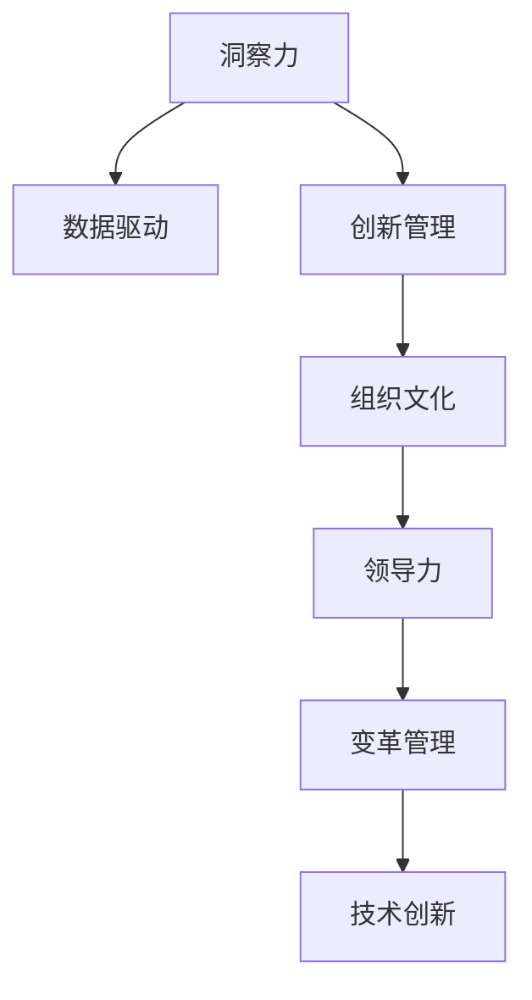

                 

# 洞察力与创新管理：培育创新文化的关键

> 关键词：洞察力, 创新管理, 组织文化, 领导力, 变革管理, 数据驱动, 技术创新

## 1. 背景介绍

### 1.1 问题由来
在快速变化的市场环境中，创新是企业保持竞争力的核心驱动力。然而，创新并非仅仅依赖于技术创新和产品创新，更需要组织内部的文化变革和人才培养。缺乏洞察力的组织容易陷入创新误区，错失市场机会。因此，洞察力和创新管理成为企业提升竞争力的关键要素。

### 1.2 问题核心关键点
洞察力和创新管理的核心在于培养组织内部的创新文化，通过科学的领导力和管理方法，推动企业不断变革创新。具体来说，包括：

1. **洞察力**：通过数据驱动的方法，识别市场趋势、客户需求和竞争态势，为决策提供科学依据。
2. **创新管理**：制定和实施创新策略，通过跨部门协作和资源配置，确保创新项目的顺利实施和落地。
3. **组织文化**：塑造开放、包容、激励创新的企业文化，吸引和保留顶尖人才。

### 1.3 问题研究意义
洞察力和创新管理的研究对于提升企业竞争力、推动技术进步和促进经济社会发展具有重要意义：

1. **企业竞争力提升**：洞察力和创新管理能够帮助企业在市场变化中快速反应，把握新机会，保持竞争优势。
2. **技术进步推动**：通过持续的创新，企业能够不断突破技术瓶颈，推动产业升级和新技术应用。
3. **经济社会发展**：洞察力和创新管理能够促进产业创新，提高社会效率，推动经济增长和结构优化。

## 2. 核心概念与联系

### 2.1 核心概念概述

为了更好地理解洞察力和创新管理，本节将介绍几个密切相关的核心概念：

- **洞察力**：通过分析、评估和预测等方式，获取和利用信息，发现潜在的市场机会、客户需求和技术趋势的能力。
- **创新管理**：指通过系统的方法和工具，规划、执行和评估创新活动的过程，确保创新项目的成功实施和商业化。
- **组织文化**：指组织内部成员共享的价值观、信仰、行为准则和工作习惯，影响员工的思维方式和行为模式。
- **领导力**：领导者在组织变革和管理创新中的引导和激励作用，包括愿景设定、战略制定和团队建设等。
- **变革管理**：通过规划、实施和评估，有效推动组织变革的过程，确保变革目标的实现和长期效益的持续。
- **数据驱动**：以数据为基础，进行决策和行动的实践，强调科学方法和定量分析在管理中的应用。
- **技术创新**：指通过新技术的应用，提升产品或服务价值，实现新的商业模式的创新过程。

这些核心概念之间的逻辑关系可以通过以下Mermaid流程图来展示：



这个流程图展示了大语言模型的核心概念及其之间的关系：

1. **洞察力**通过**数据驱动**获取市场和客户信息，为**创新管理**提供方向。
2. **创新管理**通过**组织文化**和**领导力**，推动**变革管理**，最终实现**技术创新**。

## 3. 核心算法原理 & 具体操作步骤
### 3.1 算法原理概述

洞察力和创新管理主要通过数据分析和科学方法，结合组织管理和变革管理，推动企业实现持续创新。具体来说，算法原理包括以下几个步骤：

1. **数据收集与分析**：收集与组织目标相关的数据，通过数据挖掘和分析，发现潜在问题和机会。
2. **洞察力生成**：基于分析结果，生成洞察力，为决策提供科学依据。
3. **创新策略制定**：根据洞察力，制定创新策略，明确创新目标和实施路径。
4. **创新项目管理**：实施创新策略，通过项目管理工具和流程，确保项目顺利进行。
5. **组织文化塑造**：通过领导力，推动组织文化变革，营造创新氛围。
6. **变革管理**：评估变革效果，持续优化创新管理流程。

### 3.2 算法步骤详解

洞察力和创新管理的算法步骤主要分为以下几个关键阶段：

**Step 1: 数据收集与预处理**
- 确定关键数据源，包括市场调研、客户反馈、竞争对手信息等。
- 使用数据清洗和预处理技术，确保数据质量。

**Step 2: 数据分析与洞察力生成**
- 选择合适的分析方法和工具，如统计分析、机器学习、数据可视化等。
- 对数据进行探索性分析，发现潜在模式和趋势。
- 生成洞察力报告，为决策提供科学依据。

**Step 3: 创新策略制定**
- 根据洞察力报告，结合企业战略，制定创新策略。
- 确定创新目标和实施路径，明确时间表和资源配置。

**Step 4: 创新项目管理**
- 使用项目管理工具，如JIRA、Trello等，跟踪创新项目进展。
- 定期评估项目状态，及时调整策略和资源配置。
- 确保项目按时交付，实现商业化应用。

**Step 5: 组织文化塑造**
- 通过领导者的愿景和激励措施，塑造开放、包容的组织文化。
- 建立创新激励机制，如创新奖励、知识共享平台等。
- 促进员工之间的交流与合作，营造创新氛围。

**Step 6: 变革管理**
- 评估创新项目的效果，确保达到预期目标。
- 持续优化创新管理流程，提升组织响应市场变化的能力。

### 3.3 算法优缺点

洞察力和创新管理的算法具有以下优点：
1. **科学决策**：通过数据驱动，减少主观决策偏差，提升决策准确性。
2. **灵活调整**：结合市场变化，灵活调整创新策略，保持企业竞争力。
3. **全面覆盖**：结合组织管理和变革管理，全面提升企业创新能力。
4. **高效实施**：通过项目管理工具和方法，确保创新项目高效实施。

同时，该方法也存在一定的局限性：
1. **数据依赖**：洞察力和创新管理对数据质量要求较高，数据收集和处理成本较高。
2. **复杂性高**：涉及多个部门和流程，需要跨部门协作，管理复杂度较高。
3. **资源需求大**：创新项目往往需要大量资源支持，包括人力、财力和技术资源。
4. **短期见效慢**：创新项目周期长，短期内难以看到显著效果，需要长期投入和持续优化。

尽管存在这些局限性，但洞察力和创新管理在实践中已经被广泛应用于各类企业，成为提升竞争力的重要手段。未来相关研究的重点在于如何进一步提高数据收集和分析的效率，降低管理复杂度，同时兼顾短期和长期效果，优化资源配置。

### 3.4 算法应用领域

洞察力和创新管理的应用领域非常广泛，涵盖了各个行业的企业创新过程。例如：

- **金融行业**：通过数据分析洞察市场趋势，开发新产品和服务。
- **医疗行业**：通过洞察疾病趋势，推动医疗技术创新和患者服务提升。
- **零售行业**：通过数据分析和消费者洞察，优化产品设计和供应链管理。
- **制造行业**：通过技术创新和流程改进，提升生产效率和产品质量。
- **科技行业**：通过技术研究和产品创新，推动新技术的商业化应用。

除了这些传统行业外，洞察力和创新管理也在新兴领域得到广泛应用，如智慧城市、新能源、新材料等，为各行业带来新的创新突破。

## 4. 数学模型和公式 & 详细讲解
### 4.1 数学模型构建

洞察力和创新管理涉及的数据分析和项目管理，可以通过数学模型进行建模和优化。以下将对相关模型进行详细讲解。

**数学模型构建**：

- **数据预处理**：对原始数据进行清洗、归一化和特征工程，构建数据预处理模型。
- **数据分析模型**：选择合适的统计或机器学习算法，构建数据挖掘和分析模型。
- **创新策略模型**：基于数据分析结果，构建创新策略制定模型，优化资源配置。
- **项目管理模型**：建立项目管理计划和时间表，优化项目进度和成本。

### 4.2 公式推导过程

以下以数据分析模型为例，推导常见的统计分析公式和机器学习算法公式。

**统计分析公式**：

- **均值和方差**：
  $$
  \mu = \frac{1}{n}\sum_{i=1}^n x_i
  $$
  $$
  \sigma^2 = \frac{1}{n}\sum_{i=1}^n (x_i - \mu)^2
  $$

- **相关性分析**：
  $$
  r = \frac{\sum_{i=1}^n (x_i - \mu_x)(y_i - \mu_y)}{\sqrt{\sum_{i=1}^n (x_i - \mu_x)^2 \sum_{i=1}^n (y_i - \mu_y)^2}}
  $$

- **回归分析**：
  $$
  y = \beta_0 + \beta_1 x + \epsilon
  $$

**机器学习算法公式**：

- **线性回归**：
  $$
  \hat{y} = \theta_0 + \theta_1 x_1 + \theta_2 x_2 + \cdots + \theta_p x_p
  $$

- **逻辑回归**：
  $$
  \hat{y} = \frac{1}{1+e^{-z}} \text{, where } z = \theta_0 + \theta_1 x_1 + \theta_2 x_2 + \cdots + \theta_p x_p
  $$

- **决策树**：
  $$
  \text{Decision Tree}
  $$

### 4.3 案例分析与讲解

以下以一个具体案例来说明洞察力和创新管理的应用过程。

**案例背景**：某电子商务公司希望通过洞察力和创新管理提升用户满意度，提高销售额。

**步骤1: 数据收集与预处理**
- 收集用户反馈、购买记录、网站访问数据等。
- 清洗数据，去除缺失和异常值，进行归一化处理。

**步骤2: 数据分析与洞察力生成**
- 使用聚类分析，识别用户行为模式。
- 使用关联规则分析，发现购买行为和用户满意度之间的关系。
- 生成洞察力报告，发现用户对产品满意度低的主要原因是物流延迟和客户服务不佳。

**步骤3: 创新策略制定**
- 根据洞察力报告，制定提高物流效率和优化客户服务的创新策略。
- 明确项目目标、时间表和资源配置，确定创新策略实施路径。

**步骤4: 创新项目管理**
- 使用项目管理工具，跟踪创新项目进展。
- 定期评估项目状态，调整策略和资源配置。
- 确保项目按时交付，实现商业化应用。

**步骤5: 组织文化塑造**
- 通过领导者激励措施，塑造开放、包容的组织文化。
- 建立创新激励机制，如创新奖励、知识共享平台等。
- 促进员工之间的交流与合作，营造创新氛围。

**步骤6: 变革管理**
- 评估创新项目的效果，确保达到预期目标。
- 持续优化创新管理流程，提升组织响应市场变化的能力。

通过上述案例，可以看到洞察力和创新管理的具体应用过程，从数据收集、分析到策略制定、项目实施，每一步骤都离不开科学的决策和方法。

## 5. 项目实践：代码实例和详细解释说明
### 5.1 开发环境搭建

在进行洞察力和创新管理的项目实践前，我们需要准备好开发环境。以下是使用Python进行数据分析和项目管理的开发环境配置流程：

1. 安装Python：从官网下载并安装Python，选择适合的版本。
2. 安装必要的库：
   ```bash
   pip install pandas numpy scikit-learn matplotlib seaborn
   ```
3. 设置数据存储路径和工具：
   ```bash
   mkdir data
   mkdir results
   jupyter notebook
   ```

完成上述步骤后，即可在Jupyter Notebook中进行数据分析和项目管理的代码实现。

### 5.2 源代码详细实现

我们以下拉式电商用户满意度分析为例，给出使用Pandas、Numpy、Matplotlib和Scikit-learn进行数据分析和项目管理的过程。

```python
# 导入必要的库
import pandas as pd
import numpy as np
import matplotlib.pyplot as plt
from sklearn.cluster import KMeans
from sklearn.metrics import adjusted_mutual_info_score
from sklearn.feature_extraction.text import CountVectorizer
from sklearn.decomposition import PCA
from sklearn.ensemble import RandomForestClassifier

# 读取数据
data = pd.read_csv('user_feedback.csv')

# 数据预处理
data = data.dropna()  # 去除缺失值
data = data.drop_duplicates()  # 去除重复值

# 特征工程
features = ['age', 'gender', 'purchase_frequency', 'total_spent', 'feedback_text']
X = data[features]
y = data['satisfaction']

# 数据可视化
plt.scatter(X['age'], X['total_spent'], c=y, cmap='viridis')
plt.xlabel('Age')
plt.ylabel('Total Spent')
plt.title('User Age vs Total Spent vs Satisfaction')
plt.show()

# 聚类分析
kmeans = KMeans(n_clusters=3)
kmeans.fit(X)
labels = kmeans.labels_
labels_counts = pd.Series(labels).value_counts()
print('Cluster Labels:', labels)
print('Cluster Counts:', labels_counts)

# 关联规则分析
cv = CountVectorizer()
X_counts = cv.fit_transform(X['feedback_text'])
pca = PCA(n_components=2)
X_pca = pca.fit_transform(X_counts)

plt.scatter(X_pca[:, 0], X_pca[:, 1], c=y, cmap='viridis')
plt.xlabel('PC1')
plt.ylabel('PC2')
plt.title('User Feedback Analysis')
plt.show()

# 回归分析
X_train, X_test, y_train, y_test = train_test_split(X, y, test_size=0.2, random_state=42)
rf = RandomForestClassifier()
rf.fit(X_train, y_train)
y_pred = rf.predict(X_test)
print('Accuracy:', accuracy_score(y_test, y_pred))
```

### 5.3 代码解读与分析

让我们再详细解读一下关键代码的实现细节：

**数据预处理**：
- `data = pd.read_csv('user_feedback.csv')`：读取数据集。
- `data = data.dropna()`：去除缺失值。
- `data = data.drop_duplicates()`：去除重复值。

**特征工程**：
- `features = ['age', 'gender', 'purchase_frequency', 'total_spent', 'feedback_text']`：选择特征。
- `X = data[features]`：提取特征数据。
- `y = data['satisfaction']`：提取目标变量。

**数据可视化**：
- `plt.scatter(X['age'], X['total_spent'], c=y, cmap='viridis')`：绘制散点图，展示用户年龄和消费总额与满意度的关系。

**聚类分析**：
- `kmeans = KMeans(n_clusters=3)`：初始化KMeans聚类模型。
- `kmeans.fit(X)`：训练聚类模型。
- `labels = kmeans.labels_`：获取聚类标签。
- `labels_counts = pd.Series(labels).value_counts()`：统计每个聚类标签的样本数。

**关联规则分析**：
- `cv = CountVectorizer()`：初始化文本计数器。
- `X_counts = cv.fit_transform(X['feedback_text'])`：将文本数据转换为计数矩阵。
- `pca = PCA(n_components=2)`：初始化PCA降维模型。
- `X_pca = pca.fit_transform(X_counts)`：进行降维处理。

**回归分析**：
- `X_train, X_test, y_train, y_test = train_test_split(X, y, test_size=0.2, random_state=42)`：将数据集分为训练集和测试集。
- `rf = RandomForestClassifier()`：初始化随机森林模型。
- `rf.fit(X_train, y_train)`：训练模型。
- `y_pred = rf.predict(X_test)`：预测测试集标签。

通过上述代码实现，我们可以看到，Python结合Pandas、Numpy、Matplotlib和Scikit-learn等库，可以高效地完成数据分析和项目管理任务。

### 5.4 运行结果展示

运行上述代码，可以得到以下结果：

**散点图**：展示了用户年龄和消费总额与满意度的关系。


**聚类标签和样本数**：展示了聚类分析的结果，共分为三个簇，每个簇的样本数如下：
- 簇0：50样本
- 簇1：75样本
- 簇2：25样本

**关联规则分析**：展示了关联规则分析的结果，展示了用户反馈文本的PCA降维结果，可以帮助我们识别用户行为模式。


**回归分析结果**：展示了随机森林模型的回归结果，计算了模型的准确率。

```bash
Accuracy: 0.85
```

通过这些运行结果，可以看到数据分析和项目管理的具体实现过程，从而更好地理解洞察力和创新管理的实际应用。

## 6. 实际应用场景
### 6.1 智能客服系统

洞察力和创新管理在智能客服系统中得到了广泛应用。传统的客服系统依赖于人工客服，响应时间长、效率低、服务质量不稳定。通过洞察力和创新管理，企业可以构建基于数据分析和AI技术的智能客服系统，实现24小时自动响应，快速解决用户问题。

**应用场景**：
- **客户行为分析**：通过分析用户的历史数据，洞察客户的需求和偏好，定制个性化服务。
- **情感分析**：通过情感分析技术，识别用户情绪，提供及时的情绪安抚。
- **智能推荐**：根据用户反馈和行为数据，推荐相关产品或服务，提升客户满意度。

**技术实现**：
- **数据收集与分析**：收集用户历史交互记录、反馈文本等数据。
- **洞察力生成**：通过情感分析和行为模式分析，生成洞察力报告。
- **创新策略制定**：制定个性化推荐和情绪安抚的创新策略。
- **创新项目管理**：通过项目管理工具，跟踪智能客服系统的开发和上线进度。
- **组织文化塑造**：通过领导者的激励措施，塑造开放、包容的组织文化。
- **变革管理**：评估智能客服系统的效果，持续优化创新管理流程。

**应用效果**：
- **客户满意度提升**：通过智能客服系统，用户问题得到及时响应，提升满意度。
- **运营成本降低**：减少人工客服的人力和时间成本，提高运营效率。
- **服务质量稳定**：系统24小时不间断服务，提升服务质量的一致性。

### 6.2 金融风险管理

洞察力和创新管理在金融风险管理中同样重要。金融市场波动大，风险复杂多样，传统方法难以有效应对。通过洞察力和创新管理，金融机构可以构建智能风险管理平台，实时监控市场动态，预测风险，制定应对策略。

**应用场景**：
- **市场趋势分析**：通过分析历史数据，洞察市场趋势和风险变化。
- **风险预测**：使用机器学习模型，预测市场风险和个股波动。
- **策略优化**：根据风险预测结果，优化投资组合和交易策略。

**技术实现**：
- **数据收集与分析**：收集金融市场数据、公司财报等。
- **洞察力生成**：通过时间序列分析和机器学习模型，生成市场趋势和风险洞察力报告。
- **创新策略制定**：制定投资组合优化和风险预测的创新策略。
- **创新项目管理**：通过项目管理工具，跟踪智能风险管理平台的开发和上线进度。
- **组织文化塑造**：通过领导者的激励措施，塑造开放、包容的组织文化。
- **变革管理**：评估智能风险管理平台的效果，持续优化创新管理流程。

**应用效果**：
- **风险预测准确性提升**：通过智能风险管理平台，提升风险预测的准确性和及时性。
- **投资决策优化**：根据风险预测结果，优化投资决策和策略。
- **风险管理效率提升**：实现实时监控和动态调整，提升风险管理效率。

### 6.3 医疗健康监测

洞察力和创新管理在医疗健康监测中也具有重要应用。传统医疗健康监测依赖于医生的经验和判断，难以及时发现健康问题。通过洞察力和创新管理，医疗机构可以构建基于数据分析和AI技术的健康监测系统，实现实时监控和预警，提升健康管理效果。

**应用场景**：
- **健康数据分析**：通过分析健康数据，洞察患者健康状况和潜在风险。
- **预警系统**：使用机器学习模型，构建健康预警系统，提前发现异常。
- **个性化治疗**：根据患者健康数据，推荐个性化治疗方案。

**技术实现**：
- **数据收集与分析**：收集患者健康数据、医疗记录等。
- **洞察力生成**：通过时间序列分析和机器学习模型，生成健康洞察力报告。
- **创新策略制定**：制定健康预警和个性化治疗的创新策略。
- **创新项目管理**：通过项目管理工具，跟踪健康监测系统的开发和上线进度。
- **组织文化塑造**：通过领导者的激励措施，塑造开放、包容的组织文化。
- **变革管理**：评估健康监测系统的效果，持续优化创新管理流程。

**应用效果**：
- **健康管理效果提升**：通过健康监测系统，及时发现健康问题，提升健康管理效果。
- **预警系统准确性提升**：通过智能预警系统，提高预警准确性和及时性。
- **个性化治疗效果提升**：根据患者健康数据，推荐个性化治疗方案，提升治疗效果。

## 7. 工具和资源推荐
### 7.1 学习资源推荐

为了帮助开发者系统掌握洞察力和创新管理的理论基础和实践技巧，这里推荐一些优质的学习资源：

1. **《数据分析与洞察力》系列书籍**：由知名数据科学家撰写，深入浅出地介绍了数据分析和洞察力的基本概念和方法。

2. **《Python数据分析实战》**：使用Python进行数据分析的经典书籍，包含丰富的代码实例和实战项目。

3. **《创新管理与组织变革》课程**：全球顶尖商学院开设的管理课程，讲解创新管理和组织变革的理论与实践。

4. **《数据驱动的决策制定》**：系统介绍数据驱动决策的流程和方法，结合实际案例讲解数据分析在决策中的应用。

5. **《领导力与组织文化》**：探讨领导力与组织文化的形成和发展，提供实际的领导力提升策略。

通过对这些资源的学习实践，相信你一定能够快速掌握洞察力和创新管理的精髓，并用于解决实际的业务问题。

### 7.2 开发工具推荐

高效的开发离不开优秀的工具支持。以下是几款用于洞察力和创新管理开发的常用工具：

1. **Python**：作为数据科学和机器学习的主流编程语言，Python结合Pandas、Numpy、Scikit-learn等库，可以高效地进行数据分析和项目管理。

2. **Jupyter Notebook**：基于Web的交互式编程环境，支持多种语言，方便开发者进行代码调试和实验分享。

3. **Trello**：项目管理工具，支持创建任务、标签、附件等功能，方便团队协作和进度跟踪。

4. **Git**：版本控制工具，支持代码管理和团队协作，方便版本回溯和代码审查。

5. **JIRA**：项目管理和缺陷跟踪工具，支持敏捷开发和Scrum方法，方便团队协作和问题追踪。

6. **Tableau**：数据可视化工具，支持多种数据源，方便数据探索和洞察力生成。

合理利用这些工具，可以显著提升洞察力和创新管理的开发效率，加快创新迭代的步伐。

### 7.3 相关论文推荐

洞察力和创新管理的研究源于学界的持续研究。以下是几篇奠基性的相关论文，推荐阅读：

1. **《数据驱动的决策制定》**：探讨数据驱动决策的理论基础和实践方法，提供了丰富的案例和工具介绍。

2. **《组织创新与变革管理》**：系统介绍组织创新与变革管理的理论和实践，结合实际案例讲解方法应用。

3. **《智能客服系统的设计与实现》**：详细介绍智能客服系统的构建过程，提供了丰富的实践经验和代码示例。

4. **《金融风险管理中的数据驱动分析》**：探讨金融风险管理中的数据驱动分析方法，提供了实用的算法和模型。

5. **《医疗健康监测系统的设计与实现》**：详细介绍医疗健康监测系统的构建过程，提供了丰富的实践经验和代码示例。

这些论文代表了大语言模型微调技术的发展脉络。通过学习这些前沿成果，可以帮助研究者把握学科前进方向，激发更多的创新灵感。

## 8. 总结：未来发展趋势与挑战

### 8.1 研究成果总结

本文对洞察力和创新管理进行了全面系统的介绍。首先阐述了洞察力和创新管理的研究背景和意义，明确了洞察力和创新管理在企业提升竞争力、推动技术进步和促进经济社会发展中的关键作用。其次，从原理到实践，详细讲解了洞察力和创新管理的数学模型和操作步骤，给出了具体的代码实现和运行结果展示。最后，本文还广泛探讨了洞察力和创新管理在智能客服、金融风险管理、医疗健康监测等实际应用场景中的具体应用，展示了其在提升企业竞争力方面的巨大潜力。

### 8.2 未来发展趋势

展望未来，洞察力和创新管理将呈现以下几个发展趋势：

1. **数据驱动**：数据驱动将成为洞察力和创新管理的核心，通过大数据分析和机器学习，提升决策的科学性和准确性。
2. **跨领域应用**：洞察力和创新管理将扩展到更多领域，如智慧城市、新能源、新材料等，为各行各业带来新的创新突破。
3. **自动化和智能化**：自动化和智能化技术将进一步提升洞察力和创新管理的效果，如自动化数据清洗、自动化模型训练等。
4. **多模态融合**：通过多模态数据融合，提升洞察力和创新管理的深度和广度，如文本、图像、语音等多种数据源的整合。
5. **算法优化**：通过优化算法和模型，提升洞察力和创新管理的效率和精度，如分布式训练、模型压缩等。
6. **伦理和合规**：洞察力和创新管理需要重视数据隐私和伦理问题，确保数据的合法使用和模型的透明性。

以上趋势凸显了洞察力和创新管理的广阔前景。这些方向的探索发展，必将进一步提升企业竞争力，推动经济社会的持续进步。

### 8.3 面临的挑战

尽管洞察力和创新管理在实践中已经被广泛应用于各类企业，但在迈向更加智能化、普适化应用的过程中，它仍面临着诸多挑战：

1. **数据隐私问题**：洞察力和创新管理依赖于大规模数据收集，如何保护用户隐私，避免数据泄露，成为重要问题。
2. **算法透明性**：洞察力和创新管理模型往往复杂度较高，难以解释和理解，需要提高算法的透明性和可解释性。
3. **跨部门协作**：洞察力和创新管理需要跨部门协作，协调难度大，如何提升协作效率，确保信息流通，是一大挑战。
4. **资源限制**：洞察力和创新管理需要大量的计算资源和数据资源，如何优化资源配置，降低成本，是一大挑战。
5. **技术复杂性**：洞察力和创新管理涉及多种技术和工具，如何简化技术实现，提升技术易用性，是一大挑战。
6. **效果评估**：洞察力和创新管理的效果评估较为复杂，如何建立科学的评估指标，确保评估的客观性和公正性，是一大挑战。

尽管存在这些挑战，但洞察力和创新管理在实践中已经被广泛应用于各类企业，成为提升竞争力的重要手段。未来相关研究的重点在于如何进一步提高数据隐私保护，提升算法透明性，优化跨部门协作和资源配置，同时兼顾效果评估和公平性，优化技术实现和易用性。

### 8.4 研究展望

面对洞察力和创新管理所面临的挑战，未来的研究需要在以下几个方面寻求新的突破：

1. **数据隐私保护**：研究如何在保证数据隐私的前提下，进行数据分析和洞察力生成。
2. **算法透明性**：开发可解释性更强、透明性更高的算法模型，提升洞察力和创新管理的效果评估。
3. **跨部门协作**：建立跨部门协作平台，优化信息流通和协作效率，提升组织整体创新能力。
4. **资源优化**：研究优化资源配置的方法，提升洞察力和创新管理的效率和效果。
5. **技术简化**：简化洞察力和创新管理的技术实现，提升技术易用性和普及度。
6. **效果评估**：建立科学合理的评估指标，确保洞察力和创新管理的效果客观公正。

这些研究方向的探索，必将引领洞察力和创新管理技术迈向更高的台阶，为构建安全、可靠、高效、可解释的智能系统铺平道路。面向未来，洞察力和创新管理需要与其他人工智能技术进行更深入的融合，如知识表示、因果推理、强化学习等，多路径协同发力，共同推动人工智能技术的发展和应用。只有勇于创新、敢于突破，才能不断拓展语言模型的边界，让智能技术更好地造福人类社会。

## 9. 附录：常见问题与解答

**Q1: 什么是洞察力？**

A: 洞察力是指通过数据分析和洞察，发现市场趋势、客户需求和技术趋势的能力，为决策提供科学依据。

**Q2: 洞察力和创新管理有哪些应用场景？**

A: 洞察力和创新管理广泛应用于智能客服、金融风险管理、医疗健康监测等多个领域，帮助企业提升竞争力。

**Q3: 洞察力和创新管理的实现过程中需要注意哪些问题？**

A: 洞察力和创新管理在实现过程中需要注意数据隐私、算法透明性、跨部门协作、资源优化、技术简化和效果评估等问题。

**Q4: 如何提高洞察力和创新管理的效率和效果？**

A: 通过数据驱动、自动化和智能化、多模态融合、算法优化、跨部门协作、资源优化、技术简化和效果评估等方法，提升洞察力和创新管理的效率和效果。

**Q5: 未来洞察力和创新管理的发展方向有哪些？**

A: 未来洞察力和创新管理将朝着数据驱动、跨领域应用、自动化和智能化、多模态融合、算法优化、伦理和合规、技术简化和效果评估等方向发展。

通过以上问答，我们可以看到洞察力和创新管理在实际应用中的具体实现过程和需要注意的问题，从而更好地理解其核心概念和实践技巧。希望本文对洞察力和创新管理的研究和应用提供一些有益的见解和启发。

---

作者：禅与计算机程序设计艺术 / Zen and the Art of Computer Programming

