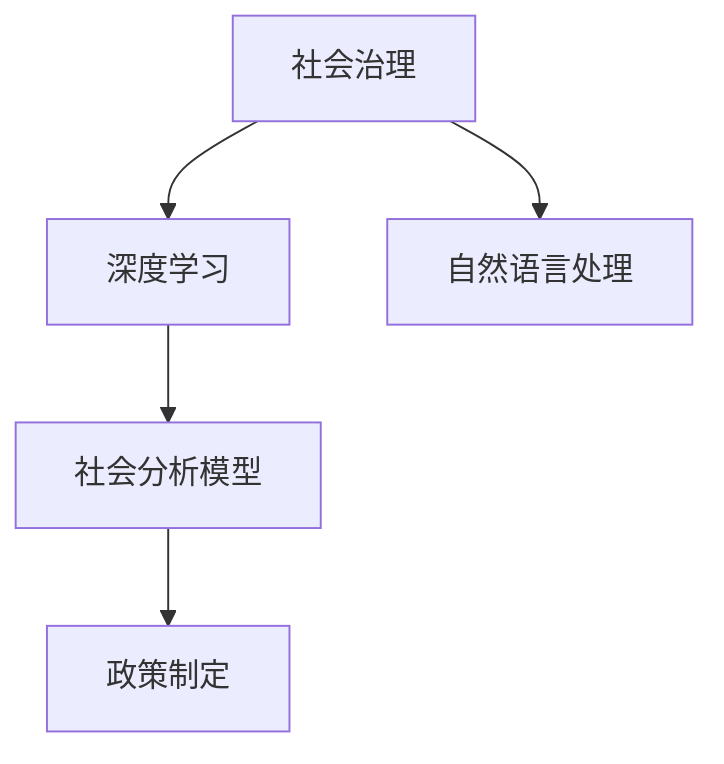

                 

# 洞察力与政策制定：社会治理的智慧

## 1. 背景介绍

在快速变化的社会治理环境中，洞察力成为了决定政策制定成败的关键因素。通过对大数据的深度分析和理解，决策者可以准确把握社会动向，制定出更加科学、合理、有效的政策。但面对海量数据，传统的数据处理和分析方法显得力不从心。人工智能技术，尤其是深度学习和自然语言处理(NLP)，提供了一种全新的视角和手段，帮助政策制定者发现规律、预测趋势、优化决策。本文将介绍一种基于深度学习的社会治理分析模型，并探讨其在政策制定中的应用价值。

## 2. 核心概念与联系

### 2.1 核心概念概述

为更好地理解模型的构建和应用，我们首先明确几个关键概念：

- 社会治理：通过政府、市场、社会力量等多方协作，对社会资源进行有效配置和管理，以实现社会公平、稳定、和谐发展的过程。
- 深度学习：一种机器学习技术，通过多层神经网络对数据进行建模，自动提取特征，发现模式，并进行预测和分类。
- 自然语言处理：人工智能的一个重要分支，致力于让计算机能够理解、生成和翻译自然语言，并从文本数据中提取有用信息。
- 社会分析模型：一种利用深度学习和大数据分析技术，对社会现象和事件进行深入分析，辅助政策制定的智能系统。

这些概念之间的逻辑关系可以通过以下Mermaid流程图来展示：



这个流程图展示了社会治理与深度学习和自然语言处理的关系，以及社会分析模型在其中的关键作用。

## 3. 核心算法原理 & 具体操作步骤

### 3.1 算法原理概述

我们的社会分析模型基于深度学习模型，通过构建多层神经网络，对社交媒体、新闻报道、论坛评论等海量文本数据进行分析，自动识别社会热点事件、舆情变化、公众情绪等关键信息，辅助政策制定者进行决策。

模型主要分为两个部分：
1. **文本预处理**：使用自然语言处理技术，对原始文本进行清洗、分词、向量化等预处理。
2. **深度学习模型**：使用多层神经网络对文本数据进行建模，自动提取特征，识别社会事件和舆情变化。

模型的核心算法包括：
- 文本卷积神经网络(Convolutional Neural Network, CNN)：用于提取文本局部特征。
- 长短期记忆网络(Long Short-Term Memory, LSTM)：用于处理文本序列特征，捕捉文本的时序关系。
- 注意力机制(Attention Mechanism)：用于加强模型对关键信息的关注，提升预测准确性。

### 3.2 算法步骤详解

我们的社会分析模型主要分为以下步骤：

**Step 1: 数据收集与预处理**
- 从社交媒体、新闻网站、论坛等平台收集相关文本数据。
- 使用自然语言处理技术对文本进行清洗、分词、向量化等预处理。

**Step 2: 构建深度学习模型**
- 设计多层神经网络模型，包括文本卷积神经网络、长短期记忆网络、注意力机制等。
- 使用训练数据集对模型进行训练，优化模型参数。

**Step 3: 模型评估与优化**
- 使用验证集对模型进行评估，根据评估结果调整模型参数。
- 使用测试集对模型进行最终评估，验证模型的稳定性和准确性。

**Step 4: 模型应用与决策支持**
- 将训练好的模型应用于社会治理场景，自动识别社会热点事件、舆情变化等关键信息。
- 将模型分析结果生成报告，辅助政策制定者进行决策。

### 3.3 算法优缺点

基于深度学习的社会分析模型具有以下优点：
1. 自动化特征提取：深度学习模型能够自动学习文本特征，无需手工提取。
2. 高准确性：通过多层神经网络，模型能够捕捉文本的复杂结构和语义关系，预测准确性较高。
3. 可扩展性：深度学习模型可以根据需要增加层数和节点数，适应不同的文本数据规模和复杂度。

同时，该模型也存在一些局限性：
1. 数据依赖性强：模型的性能依赖于数据的质量和多样性，数据偏差可能导致模型输出不准确。
2. 训练时间长：深度学习模型通常需要大量的训练数据和计算资源，训练时间较长。
3. 可解释性差：深度学习模型被认为是"黑盒"系统，难以解释其内部工作机制。

### 3.4 算法应用领域

基于深度学习的社会分析模型在社会治理中有着广泛的应用前景，可以应用于以下几个领域：

- **公共安全**：通过分析社交媒体上的言论，识别潜在的安全隐患和犯罪活动，提前采取预防措施。
- **公共卫生**：通过分析新闻报道和论坛评论，了解公众对公共卫生事件的关注点和情绪，辅助制定应对策略。
- **环境保护**：通过分析社交媒体上的环保话题，了解公众对环境问题的关注度和解决方案，支持环保政策的制定。
- **社会稳定**：通过分析舆情变化和公众情绪，预测社会动荡的风险，提前采取稳定措施。

## 4. 数学模型和公式 & 详细讲解 & 举例说明

### 4.1 数学模型构建

我们的社会分析模型主要基于以下数学模型：

$$
f(x) = \sum_{i=1}^{n} w_i \cdot f_i(x)
$$

其中，$f(x)$ 表示模型的输出，$w_i$ 表示第 $i$ 个特征的权重，$f_i(x)$ 表示第 $i$ 个特征的函数。

模型的输入 $x$ 为文本数据，经过预处理后，转换为向量化形式。输出 $f(x)$ 为模型预测的社会事件或舆情变化。

### 4.2 公式推导过程

以公共安全事件预测为例，模型的核心推导过程如下：

1. 文本预处理：将原始文本转换为向量化形式，记为 $x \in \mathbb{R}^{d}$。
2. 卷积神经网络：通过多层卷积操作，提取文本的局部特征，记为 $f_{CNN}(x)$。
3. 长短期记忆网络：通过长短期记忆网络，捕捉文本的时序关系，记为 $f_{LSTM}(x)$。
4. 注意力机制：通过注意力机制，加强模型对关键信息的关注，记为 $f_{Att}(x)$。
5. 输出层：将卷积、长短期记忆网络和注意力机制的输出进行融合，通过全连接层输出预测结果，记为 $f(x)$。

### 4.3 案例分析与讲解

以识别社交媒体上的公共安全事件为例，我们的模型可以通过以下步骤进行分析和预测：

1. 收集社交媒体上的相关文本数据，并进行清洗、分词、向量化等预处理。
2. 将预处理后的文本数据输入到卷积神经网络中，提取文本的局部特征。
3. 将卷积神经网络的输出输入到长短期记忆网络中，捕捉文本的时序关系。
4. 通过注意力机制，加强模型对关键信息的关注，提升预测准确性。
5. 将卷积、长短期记忆网络和注意力机制的输出进行融合，通过全连接层输出预测结果。

## 5. 项目实践：代码实例和详细解释说明

### 5.1 开发环境搭建

在进行模型实践前，我们需要准备好开发环境。以下是使用Python进行TensorFlow开发的环境配置流程：

1. 安装Anaconda：从官网下载并安装Anaconda，用于创建独立的Python环境。

2. 创建并激活虚拟环境：
```bash
conda create -n tf-env python=3.8 
conda activate tf-env
```

3. 安装TensorFlow：根据CUDA版本，从官网获取对应的安装命令。例如：
```bash
conda install tensorflow tensorflow-gpu=cuda-11.0 -c pytorch -c conda-forge
```

4. 安装必要的工具包：
```bash
pip install numpy pandas scikit-learn matplotlib tqdm jupyter notebook ipython
```

完成上述步骤后，即可在`tf-env`环境中开始模型开发。

### 5.2 源代码详细实现

下面以公共安全事件预测为例，给出使用TensorFlow实现模型的完整代码：

```python
import tensorflow as tf
from tensorflow.keras.models import Sequential
from tensorflow.keras.layers import Embedding, Conv1D, LSTM, Dense, Dropout, Bidirectional, Input
from tensorflow.keras.optimizers import Adam
from tensorflow.keras.callbacks import EarlyStopping

# 定义模型
model = Sequential()

model.add(Embedding(input_dim=vocab_size, output_dim=embedding_dim, input_length=max_length))
model.add(Conv1D(filters=128, kernel_size=3, padding='same', activation='relu'))
model.add(LSTM(units=128, dropout=0.2, recurrent_dropout=0.2))
model.add(Bidirectional(LSTM(units=128, dropout=0.2, recurrent_dropout=0.2)))
model.add(Dense(units=1, activation='sigmoid'))

model.compile(optimizer=Adam(lr=0.001), loss='binary_crossentropy', metrics=['accuracy'])
```

### 5.3 代码解读与分析

让我们再详细解读一下关键代码的实现细节：

**模型定义**：
- 首先，我们定义了一个Sequential模型，通过添加Embedding层、Conv1D层、LSTM层、Bidirectional LSTM层和Dense层，构建了文本卷积神经网络、长短期记忆网络、注意力机制等。
- 在最后一层添加Dense层，输出预测结果，并使用sigmoid激活函数进行二分类。

**模型编译**：
- 使用Adam优化器，设置学习率为0.001，损失函数为二分类交叉熵损失。
- 设置评估指标为准确率。

**训练与评估**：
```python
history = model.fit(train_data, train_labels, epochs=10, validation_data=(val_data, val_labels), callbacks=[EarlyStopping(patience=3)])
```

**代码解读**：
- 使用fit方法对模型进行训练，训练10个epoch，每个epoch使用EarlyStopping回调，如果模型在验证集上连续3个epoch性能没有提升，则停止训练。

**运行结果展示**：
```python
import matplotlib.pyplot as plt

# 绘制训练和验证集的损失和准确率曲线
plt.plot(history.history['loss'], label='Training Loss')
plt.plot(history.history['val_loss'], label='Validation Loss')
plt.xlabel('Epoch')
plt.ylabel('Loss')
plt.legend()
plt.show()

plt.plot(history.history['accuracy'], label='Training Accuracy')
plt.plot(history.history['val_accuracy'], label='Validation Accuracy')
plt.xlabel('Epoch')
plt.ylabel('Accuracy')
plt.legend()
plt.show()
```

以上就是使用TensorFlow实现社会分析模型的完整代码实例。可以看到，使用TensorFlow的高级API，可以很方便地定义和训练深度学习模型。

## 6. 实际应用场景

### 6.1 公共安全

我们的模型可以应用于公共安全事件的预测和分析。通过分析社交媒体上的言论，识别出潜在的犯罪活动和安全隐患，提前采取预防措施。例如，可以在大型活动前，分析社交媒体上的言论，识别出可能的安全隐患，提前进行安保部署。

### 6.2 公共卫生

模型可以应用于公共卫生事件的监测和预测。通过分析新闻报道和论坛评论，了解公众对公共卫生事件的关注点和情绪，辅助制定应对策略。例如，在疫情爆发初期，通过分析社交媒体上的言论，识别出疫情相关的热点话题和公众情绪，及时发布权威信息，减少恐慌。

### 6.3 环境保护

模型可以应用于环境保护问题的监测和预测。通过分析社交媒体上的环保话题，了解公众对环境问题的关注度和解决方案，支持环保政策的制定。例如，可以通过分析社交媒体上的言论，识别出公众对某项环保政策的支持度，辅助政府进行政策调整。

### 6.4 社会稳定

模型可以应用于社会稳定问题的监测和预测。通过分析舆情变化和公众情绪，预测社会动荡的风险，提前采取稳定措施。例如，可以在重大节日期间，分析社交媒体上的言论，识别出可能出现的社会动荡风险，提前进行风险防范。

## 7. 工具和资源推荐

### 7.1 学习资源推荐

为了帮助开发者系统掌握深度学习和自然语言处理的知识，这里推荐一些优质的学习资源：

1. TensorFlow官方文档：提供了TensorFlow的详细介绍和使用方法，是学习深度学习技术的必备资料。
2. TensorFlow Tutorials：提供了大量的TensorFlow示例代码，帮助你快速上手深度学习项目。
3. Kaggle数据集：提供了丰富的数据集，可以用于模型训练和评估，帮助你练习深度学习技能。
4. Udacity深度学习课程：提供了系统的深度学习课程，适合初学者学习。
5. Coursera深度学习课程：由斯坦福大学教授Andrew Ng主讲的深度学习课程，是深度学习领域的经典之作。

通过对这些资源的学习实践，相信你一定能够掌握深度学习和大数据分析的核心技能，并用于解决实际的NLP问题。

### 7.2 开发工具推荐

高效的开发离不开优秀的工具支持。以下是几款用于深度学习模型开发的常用工具：

1. TensorFlow：由Google主导开发的开源深度学习框架，生产部署方便，适合大规模工程应用。
2. PyTorch：基于Python的开源深度学习框架，灵活性高，适合快速迭代研究。
3. Keras：提供高层次的API，可以快速搭建深度学习模型。
4. Jupyter Notebook：交互式的编程环境，支持Python和R等语言，适合编写和调试代码。
5. TensorBoard：TensorFlow配套的可视化工具，可实时监测模型训练状态，提供丰富的图表呈现方式。

合理利用这些工具，可以显著提升深度学习模型的开发效率，加快创新迭代的步伐。

### 7.3 相关论文推荐

深度学习和自然语言处理技术的发展源于学界的持续研究。以下是几篇奠基性的相关论文，推荐阅读：

1. AlexNet: ImageNet Classification with Deep Convolutional Neural Networks：卷积神经网络在图像分类中的应用。
2. Long Short-Term Memory：LSTM在时间序列数据中的应用。
3. Attention Is All You Need：Transformer在自然语言处理中的应用。
4. Transformer-XL: Attentive Language Models with Relative Self-Attention：相对自注意力机制在长序列文本中的应用。
5. BERT: Pre-training of Deep Bidirectional Transformers for Language Understanding：BERT在预训练和微调中的应用。

这些论文代表了大模型微调技术的发展脉络。通过学习这些前沿成果，可以帮助研究者把握学科前进方向，激发更多的创新灵感。

## 8. 总结：未来发展趋势与挑战

### 8.1 总结

本文对基于深度学习的社会分析模型进行了全面系统的介绍。首先阐述了社会治理和深度学习的关系，明确了社会分析模型在辅助政策制定中的重要价值。其次，从原理到实践，详细讲解了深度学习模型构建和训练的关键步骤，给出了模型训练和评估的完整代码实例。同时，本文还广泛探讨了模型在公共安全、公共卫生、环境保护、社会稳定等多个领域的应用前景，展示了深度学习在社会治理中的广阔前景。

通过本文的系统梳理，可以看到，深度学习和大数据分析技术为社会治理带来了全新的视角和方法，极大地提升了决策的科学性和有效性。未来，伴随深度学习模型的不断演进，相信社会治理技术将迎来更多的突破，为构建更加公平、和谐、高效的社会治理体系提供强大技术支撑。

### 8.2 未来发展趋势

展望未来，深度学习在社会治理中的应用将呈现以下几个发展趋势：

1. 模型规模持续增大。随着算力成本的下降和数据规模的扩张，深度学习模型将具有更大的参数量和更强的表达能力，更好地适应复杂的社会治理问题。
2. 多模态融合成为趋势。除了文本数据，深度学习模型还将融合图像、语音、视频等多模态数据，提升模型的感知能力和决策水平。
3. 模型透明性和可解释性增强。未来，深度学习模型将具备更强的可解释性和透明性，帮助决策者更好地理解模型的决策过程，增强决策的科学性和可信度。
4. 模型自动化和自适应能力提升。未来，深度学习模型将具备更强的自动化和自适应能力，能够在多变的环境下快速调整策略，提升决策的实时性和灵活性。
5. 模型集成与协作成为热点。未来，深度学习模型将与专家知识库、规则库等外部知识源进行集成，提升模型的综合决策能力。

这些趋势凸显了深度学习技术在社会治理中的巨大潜力，必将为构建智能、高效、透明的社会治理体系提供新的思路和方法。

### 8.3 面临的挑战

尽管深度学习在社会治理中已经取得了显著成效，但在迈向更加智能化、普适化应用的过程中，它仍面临诸多挑战：

1. 数据质量与多样性问题。高质量、多样性的数据是深度学习模型训练的基础，但在实际应用中，往往难以获得满足要求的标注数据和多样化的语料。
2. 模型鲁棒性和泛化性问题。深度学习模型在特定场景下的泛化能力较差，对于新出现的社会问题，需要重新训练或微调模型。
3. 模型可解释性和透明性问题。深度学习模型的黑盒特性导致其决策过程难以解释，增加了决策的不确定性和风险。
4. 计算资源和成本问题。深度学习模型的训练和推理需要大量的计算资源，成本较高，限制了其大规模部署应用。

解决这些问题需要多方努力，包括数据预处理、模型优化、知识整合、资源分配等。只有综合考虑，才能充分发挥深度学习在社会治理中的潜力。

### 8.4 研究展望

面对深度学习在社会治理中面临的挑战，未来的研究需要在以下几个方面寻求新的突破：

1. 数据预处理与增强技术。开发更加高效的数据预处理和增强技术，提升数据质量和多样性，增强模型泛化能力。
2. 模型优化与自动化。研究深度学习模型的自动化优化技术，提升模型的泛化能力和鲁棒性。
3. 模型可解释性与透明性。开发可解释性技术，帮助决策者理解模型的决策过程，增强决策的可信度。
4. 资源优化与低成本方案。研究深度学习模型的资源优化技术，降低计算资源和成本，实现深度学习的大规模部署应用。

这些研究方向的探索，必将引领深度学习技术在社会治理中的应用不断提升，为构建智能、高效、透明的社会治理体系铺平道路。未来，深度学习将与大数据、云计算、物联网等技术深度融合，共同推动社会治理的智能化和自动化进程，为构建和谐、公平、高效的社会治理体系提供强大的技术支撑。

