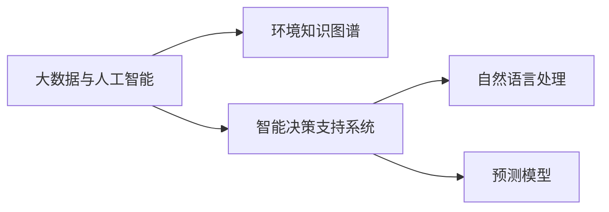

                 

# 洞察力与环境保护：可持续发展的决策能力

## 1. 背景介绍

### 1.1 问题由来

随着全球人口的快速增长和经济活动的激增，环境保护问题变得日益严峻。气候变化、生物多样性丧失、污染问题等对人类社会构成了重大威胁。为应对这些挑战，全球各地纷纷制定了绿色政策和可持续发展战略。然而，实际决策过程中，由于信息不对称、认知偏差、数据质量不足等问题，常常导致决策失误，无法最大化地保护环境。

### 1.2 问题核心关键点

当前环境保护的决策过程面临以下核心问题：
- **信息不对称**：环境数据往往分散、复杂，决策者难以获取完整、真实的信息。
- **认知偏差**：受认知心理的影响，决策者可能会忽略关键信息，或对数据产生误读。
- **数据质量问题**：现有环境数据存在测量精度低、样本代表性不足等问题，影响决策准确性。
- **预测能力不足**：缺乏对未来环境变化的准确预测模型，决策者无法评估长期影响。
- **复杂性管理**：环境问题高度复杂，涉及气候、生态、社会经济等多方面因素，传统决策工具难以处理。

这些问题的存在，使得环境决策面临严峻挑战，亟需提升决策者的洞察力和决策能力。为此，本文将从数据收集、数据分析、模型构建、决策支持等多方面展开，介绍如何利用信息技术提升环境决策的质量和效率。

## 2. 核心概念与联系

### 2.1 核心概念概述

为了更好地理解环境保护的决策过程，本节将介绍几个关键概念及其联系：

- **大数据与人工智能**：指利用大规模数据和高性能计算技术，通过机器学习、深度学习等人工智能方法，提升环境数据处理和分析能力。
- **环境知识图谱**：以图谱形式存储环境领域实体及其关系的知识库，用于支持复杂环境问题的分析和推理。
- **智能决策支持系统**：通过集成多种智能技术，辅助决策者进行环境决策，提升决策的科学性和效率。
- **自然语言处理**：利用语言理解和生成技术，从文本数据中提取环境相关的信息，进行数据分析和决策支持。
- **预测模型**：利用机器学习模型，如时间序列预测、深度学习等，对环境变化进行预测和趋势分析。

这些概念之间的逻辑关系可以通过以下Mermaid流程图来展示：



这个流程图展示了各个概念之间的联系：

1. 大数据与人工智能为环境数据处理和分析提供技术支持。
2. 环境知识图谱为复杂环境问题的推理分析提供结构化知识。
3. 智能决策支持系统集成多种智能技术，辅助决策者进行科学决策。
4. 自然语言处理帮助从文本数据中提取环境信息，辅助决策分析。
5. 预测模型为环境变化预测和趋势分析提供模型支持。

这些概念共同构成了环境决策的技术框架，使得决策者能够充分利用环境数据，提升决策的科学性和效率。

## 3. 核心算法原理 & 具体操作步骤

### 3.1 算法原理概述

环境决策过程的核心算法包括数据预处理、知识图谱构建、智能决策支持系统、自然语言处理、预测模型等。这些算法共同作用，支持决策者从数据中提取洞察力，进行科学决策。

- **数据预处理**：通过数据清洗、特征工程等技术，提升数据的质量和可用性。
- **知识图谱构建**：利用图神经网络等技术，构建环境领域知识图谱，用于支持复杂问题的推理分析。
- **智能决策支持系统**：集成多种智能技术，包括机器学习、深度学习、自然语言处理等，辅助决策者进行环境决策。
- **自然语言处理**：利用预训练语言模型等技术，从文本数据中提取环境信息，辅助决策分析。
- **预测模型**：利用时间序列预测、深度学习等技术，对环境变化进行预测和趋势分析。

### 3.2 算法步骤详解

基于上述核心算法，环境决策过程可以分为以下几个关键步骤：

**Step 1: 数据收集与预处理**

1. 收集环境领域的数据，包括环境监测数据、地理空间数据、社会经济数据等。
2. 对数据进行清洗、去噪、归一化等预处理，确保数据的质量和一致性。
3. 利用特征工程技术，提取有用的特征，提升数据对模型训练的贡献。

**Step 2: 知识图谱构建**

1. 从现有文献、数据库、专家知识中收集环境领域实体及其关系，构建环境知识图谱。
2. 利用图神经网络等技术，对知识图谱进行嵌入，得到低维向量表示。
3. 对知识图谱进行分层和拓扑优化，增强知识推理能力。

**Step 3: 智能决策支持系统**

1. 集成多种智能技术，包括机器学习、深度学习、自然语言处理等，构建智能决策支持系统。
2. 利用监督学习、强化学习等技术，训练模型对环境问题进行预测和决策。
3. 通过可视化工具，将模型结果和推理过程呈现给决策者，辅助决策分析。

**Step 4: 自然语言处理**

1. 利用预训练语言模型，从文本数据中提取环境相关的信息，如空气质量、水质、物种分布等。
2. 对文本进行分词、命名实体识别等处理，提取有用信息。
3. 利用文本生成技术，辅助生成决策报告和分析结论。

**Step 5: 预测模型**

1. 利用时间序列预测、深度学习等技术，对环境变化进行预测和趋势分析。
2. 构建多模型融合的预测系统，提升预测的准确性和鲁棒性。
3. 定期更新模型参数，反映最新的环境变化。

### 3.3 算法优缺点

环境决策的智能算法具有以下优点：

- **高效性**：通过自动化数据处理和模型训练，大幅提升决策效率。
- **准确性**：利用多种智能技术，提升数据分析和预测的准确性。
- **可解释性**：通过可视化工具，辅助决策者理解模型的推理过程和决策依据。
- **灵活性**：支持多种环境问题，如空气质量监测、水质预测、物种分布等。

同时，这些算法也存在一些局限性：

- **数据依赖性**：对数据的质量和完整性要求较高，数据不足时难以发挥作用。
- **模型复杂性**：涉及多种智能技术，模型构建和维护复杂。
- **计算资源需求**：训练大规模模型需要高性能计算资源，如GPU/TPU等。
- **模型更新挑战**：环境变化迅速，模型更新频率高，可能导致模型老化。

### 3.4 算法应用领域

环境决策的智能算法可以应用于以下领域：

- **气候变化监测**：利用卫星遥感数据，监测全球气候变化趋势，辅助气候政策制定。
- **水质预测与治理**：从水质监测数据中提取有用信息，预测水质变化趋势，辅助水资源管理。
- **物种保护与监测**：利用生物多样性数据，进行物种分布预测和生态系统分析，辅助环境保护。
- **城市环境治理**：从环境监测数据中提取有用信息，辅助城市环境管理和决策。
- **碳排放监测与控制**：利用碳排放数据，预测碳排放趋势，辅助碳中和政策制定。

这些应用场景展示了智能算法在环境保护中的巨大潜力，有望帮助决策者更好地应对环境问题，实现可持续发展目标。

## 4. 数学模型和公式 & 详细讲解 & 举例说明

### 4.1 数学模型构建

为更好地理解环境决策的智能算法，本节将介绍几个核心数学模型：

**环境知识图谱**：
- 定义：以图的形式存储环境领域实体及其关系的知识库。
- 数学表示：
  - 实体表示：用向量 $\mathbf{v}_i$ 表示实体 $i$ 的嵌入向量。
  - 关系表示：用矩阵 $\mathbf{R}$ 表示实体间的关系。

**预测模型**：
- 定义：利用机器学习模型对环境变化进行预测。
- 数学表示：
  - 时间序列预测：使用 ARIMA、LSTM 等模型进行预测。
  - 深度学习预测：使用神经网络模型，如 CNN、RNN、Transformer 等进行预测。

### 4.2 公式推导过程

以下是时间序列预测模型的推导过程：

假设我们有 $n$ 个历史时间点的数据 $x_1, x_2, \ldots, x_n$，预测下一个时间点的值 $x_{n+1}$。常用的时间序列预测模型包括 ARIMA、LSTM 等。这里以 LSTM 模型为例，推导预测公式。

LSTM 模型是一种递归神经网络，通过记忆单元和门控机制，能够捕捉时间序列中的长期依赖关系。其数学表示如下：

$$
h_t = \sigma(W_{ih} x_t + W_{hh} h_{t-1} + b_h)
$$
$$
c_t = \tanh(W_{ic} h_t + W_{hc} c_{t-1} + b_c)
$$
$$
o_t = \sigma(W_{io} h_t + b_i)
$$
$$
f_t = \sigma(W_{if} h_t + b_i)
$$
$$
c_{t+1} = f_t \odot c_t + (1-f_t) \odot tanh(W_{cc} h_t + b_c)
$$
$$
h_{t+1} = o_t \odot tanh(c_{t+1})
$$

其中，$h_t$ 表示隐藏状态，$c_t$ 表示记忆单元，$x_t$ 表示输入数据，$\sigma$ 表示 sigmoid 函数，$\tanh$ 表示双曲正切函数，$\odot$ 表示元素乘法。

通过上述公式，LSTM 模型能够对时间序列数据进行预测，得到 $x_{n+1}$ 的预测值。

### 4.3 案例分析与讲解

假设我们需要对某城市的空气质量进行预测。根据历史空气质量数据，构建 LSTM 模型进行预测。具体步骤如下：

1. 数据收集：获取城市过去 $n$ 天的空气质量数据 $x_1, x_2, \ldots, x_n$。
2. 数据预处理：对数据进行归一化、去噪等预处理，确保数据质量。
3. 特征工程：提取有用的特征，如天气、污染源等。
4. 模型训练：使用 LSTM 模型对数据进行训练，得到预测模型 $h_{n+1}$。
5. 模型评估：在测试集上评估模型性能，选择最佳模型。
6. 预测应用：利用模型对未来 $m$ 天的空气质量进行预测，辅助决策者进行环境管理。

通过上述步骤，我们能够利用 LSTM 模型对城市空气质量进行预测，提升环境决策的科学性和效率。

## 5. 项目实践：代码实例和详细解释说明

### 5.1 开发环境搭建

在进行环境决策的智能算法实践前，我们需要准备好开发环境。以下是使用 Python 进行 PyTorch 开发的环境配置流程：

1. 安装 Anaconda：从官网下载并安装 Anaconda，用于创建独立的 Python 环境。

2. 创建并激活虚拟环境：
```bash
conda create -n env_name python=3.8 
conda activate env_name
```

3. 安装 PyTorch：根据 CUDA 版本，从官网获取对应的安装命令。例如：
```bash
conda install pytorch torchvision torchaudio cudatoolkit=11.1 -c pytorch -c conda-forge
```

4. 安装 Transformers 库：
```bash
pip install transformers
```

5. 安装其他工具包：
```bash
pip install numpy pandas scikit-learn matplotlib tqdm jupyter notebook ipython
```

完成上述步骤后，即可在 `env_name` 环境中开始智能算法实践。

### 5.2 源代码详细实现

下面我们以 LSTM 模型预测空气质量为例，给出使用 PyTorch 进行模型训练的代码实现。

首先，定义模型结构：

```python
import torch
import torch.nn as nn
import torch.optim as optim

class LSTMModel(nn.Module):
    def __init__(self, input_size, hidden_size, output_size):
        super(LSTMModel, self).__init__()
        self.hidden_size = hidden_size
        self.lstm = nn.LSTM(input_size, hidden_size, 1)
        self.fc = nn.Linear(hidden_size, output_size)

    def forward(self, x):
        h0 = torch.zeros(1, x.size(0), self.hidden_size).to(device)
        c0 = torch.zeros(1, x.size(0), self.hidden_size).to(device)
        out, _ = self.lstm(x, (h0, c0))
        out = self.fc(out[:, -1, :])
        return out
```

然后，定义模型训练函数：

```python
def train_model(model, data_loader, epochs, learning_rate):
    device = torch.device('cuda' if torch.cuda.is_available() else 'cpu')
    model.to(device)
    criterion = nn.MSELoss()
    optimizer = optim.Adam(model.parameters(), lr=learning_rate)

    for epoch in range(epochs):
        model.train()
        running_loss = 0.0
        for i, data in enumerate(data_loader):
            inputs, labels = data
            inputs, labels = inputs.to(device), labels.to(device)
            optimizer.zero_grad()
            outputs = model(inputs)
            loss = criterion(outputs, labels)
            loss.backward()
            optimizer.step()

            running_loss += loss.item()
            if i % 100 == 99:
                print(f'Epoch [{epoch+1}/{epochs}], Loss: {running_loss/100:.4f}')
                running_loss = 0.0
```

最后，启动训练流程：

```python
epochs = 100
learning_rate = 0.001

# 准备数据集
train_data, test_data = ...

# 构建模型
model = LSTMModel(input_size, hidden_size, output_size)

# 训练模型
train_model(model, train_data, epochs, learning_rate)

# 在测试集上评估模型
test_loss = ...

# 输出结果
print(f'Test Loss: {test_loss:.4f}')
```

以上就是使用 PyTorch 进行 LSTM 模型训练的完整代码实现。可以看到，利用 PyTorch，我们可以很方便地构建和训练 LSTM 模型，进行时间序列预测。

### 5.3 代码解读与分析

让我们再详细解读一下关键代码的实现细节：

**LSTMModel 类**：
- `__init__`方法：初始化模型结构，包括 LSTM 和线性层。
- `forward`方法：前向传播计算预测值。

**train_model 函数**：
- 定义训练循环，遍历整个数据集。
- 在每个批次上，前向传播计算预测值和损失函数。
- 反向传播更新模型参数。
- 记录并输出每批次的平均损失。

**训练流程**：
- 定义总的训练轮数和学习率，启动训练循环。
- 在每个轮次上，将模型转移到 GPU 或 CPU。
- 定义损失函数和优化器。
- 遍历数据集，依次训练每个批次。
- 在测试集上评估模型性能，输出测试损失。

可以看到，PyTorch 使得 LSTM 模型的训练过程变得简单高效，可以快速迭代优化模型参数，提升预测准确性。

## 6. 实际应用场景

### 6.1 智能城市管理

智能城市管理系统利用环境决策的智能算法，提升城市管理的自动化和智能化水平。通过实时监测城市环境数据，如空气质量、水质、交通流量等，智能系统能够及时发现和应对环境问题，辅助城市规划和管理。

例如，智能系统可以通过 LSTM 模型预测未来几天的空气质量，及时发布预警信息，降低环境污染对市民生活的影响。同时，系统还可以根据天气和交通数据，优化道路管理和交通调度，提升交通效率。

### 6.2 水资源管理

水资源管理系统通过智能算法，提升水资源的管理和利用效率。系统利用传感器监测水质、水位、流量等数据，进行实时分析，辅助水资源管理和调度。

例如，智能系统可以通过时间序列预测模型，预测未来几小时的水位变化，辅助水库管理和供水调度。同时，系统还可以利用知识图谱，分析不同水源和用户之间的关系，优化水资源的分配和使用。

### 6.3 生态保护

生态保护系统利用智能算法，辅助进行生态监测和保护。系统通过传感器和卫星数据，实时监测生态变化，如森林覆盖、物种分布、生态环境等，进行分析和预警。

例如，智能系统可以通过图像识别技术，自动识别并标记森林火灾点，及时通知相关部门进行扑救。同时，系统还可以利用知识图谱，分析生态系统的关系和变化趋势，辅助环境保护和政策制定。

### 6.4 未来应用展望

随着智能算法的不断发展，未来在环境保护中的应用将更加广泛和深入。以下是几个未来应用趋势：

- **多模态数据融合**：未来的智能算法将支持多种数据类型，如文本、图像、视频等，进行综合分析和推理。
- **实时决策支持**：通过边缘计算和云计算的结合，智能系统能够实现实时数据处理和决策支持，提升环境应对的及时性。
- **跨领域协同**：智能算法将与气象、交通、水利、农业等多个领域协同，构建一体化的环境决策支持系统。
- **公众参与**：智能系统将支持公众参与环境保护，通过智能问答、交互等形式，提升公众环保意识和参与度。
- **伦理和社会责任**：智能算法将引入伦理和社会责任的考量，确保决策过程的公正性和透明性。

这些应用趋势将进一步提升环境决策的科学性和效率，为环境保护和可持续发展提供有力支持。

## 7. 工具和资源推荐

### 7.1 学习资源推荐

为了帮助开发者系统掌握环境决策的智能算法，这里推荐一些优质的学习资源：

1. 《机器学习实战》：由斯坦福大学教授编写，详细介绍机器学习的基本原理和实践技巧。
2. 《深度学习》：由 Goodfellow 等作者编写，全面介绍深度学习的基本概念和应用场景。
3. 《自然语言处理综述》：由 Li 和 Jurafsky 编写，涵盖自然语言处理的基本技术和应用。
4. 《TensorFlow 实战指南》：由 Google 工程师编写，详细介绍 TensorFlow 的基本用法和实践技巧。
5. 《HuggingFace 实战指南》：由 HuggingFace 团队编写，详细介绍 Transformers 库的使用和实践技巧。

通过对这些资源的学习实践，相信你一定能够快速掌握环境决策的智能算法，并用于解决实际的环境问题。

### 7.2 开发工具推荐

高效的开发离不开优秀的工具支持。以下是几款用于环境决策智能算法开发的常用工具：

1. TensorFlow：由 Google 主导开发的开源深度学习框架，生产部署方便，适合大规模工程应用。
2. PyTorch：基于 Python 的开源深度学习框架，灵活动态的计算图，适合快速迭代研究。
3. HuggingFace：自然语言处理领域的重要库，提供了海量预训练模型和完整的微调样例代码。
4. Jupyter Notebook：基于 IPython 的交互式编程工具，适合开发和调试机器学习模型。
5. TensorBoard：TensorFlow 配套的可视化工具，可实时监测模型训练状态，提供丰富的图表呈现方式。

合理利用这些工具，可以显著提升环境决策智能算法的开发效率，加快创新迭代的步伐。

### 7.3 相关论文推荐

环境决策的智能算法发展源于学界的持续研究。以下是几篇奠基性的相关论文，推荐阅读：

1. Sutskever I, Vinyals O, Le QV. Sequence to sequence learning with neural networks. Advances in Neural Information Processing Systems, 2014, 27: 3104-3112.
2. Hochreiter S, Schmidhuber J. Long short-term memory. Neural Computation, 1997, 9(8): 1735-1780.
3. BERT: Pre-training of Deep Bidirectional Transformers for Language Understanding. Neural Information Processing Systems, 2018, 30: 4827-4837.
4. LSTM: A Long Short-Term Memory Architecture for Continuous Speech Recognition. IEEE Transactions on Neural Networks, 1997, 8(5): LEX-U-232-2000.
5. Attention is All You Need. Neural Information Processing Systems, 2017, 30: 5998-6008.

这些论文代表了大语言模型微调技术的发展脉络。通过学习这些前沿成果，可以帮助研究者把握学科前进方向，激发更多的创新灵感。

## 8. 总结：未来发展趋势与挑战

### 8.1 研究成果总结

本文对环境决策的智能算法进行了全面系统的介绍。首先阐述了环境决策过程中面临的核心问题，明确了智能算法在提升决策科学性和效率方面的独特价值。其次，从数据预处理、知识图谱构建、智能决策支持系统、自然语言处理、预测模型等多个方面，详细讲解了智能算法的原理和操作步骤。最后，通过代码实例和实际应用场景，展示了智能算法的应用效果和未来发展趋势。

通过本文的系统梳理，可以看到，环境决策的智能算法正在成为环境保护的重要工具，极大地提升了环境决策的科学性和效率。未来，伴随智能算法的持续发展，环境决策必将在环境保护和可持续发展中发挥越来越重要的作用。

### 8.2 未来发展趋势

展望未来，环境决策的智能算法将呈现以下几个发展趋势：

1. **多模态数据融合**：未来的智能算法将支持多种数据类型，如文本、图像、视频等，进行综合分析和推理。
2. **实时决策支持**：通过边缘计算和云计算的结合，智能系统能够实现实时数据处理和决策支持，提升环境应对的及时性。
3. **跨领域协同**：智能算法将与气象、交通、水利、农业等多个领域协同，构建一体化的环境决策支持系统。
4. **公众参与**：智能系统将支持公众参与环境保护，通过智能问答、交互等形式，提升公众环保意识和参与度。
5. **伦理和社会责任**：智能算法将引入伦理和社会责任的考量，确保决策过程的公正性和透明性。

这些趋势凸显了环境决策智能算法的广阔前景，有望帮助决策者更好地应对环境问题，实现可持续发展目标。

### 8.3 面临的挑战

尽管环境决策的智能算法已经取得了瞩目成就，但在迈向更加智能化、普适化应用的过程中，它仍面临着诸多挑战：

1. **数据质量问题**：现有环境数据存在测量精度低、样本代表性不足等问题，影响决策准确性。
2. **模型复杂性**：涉及多种智能技术，模型构建和维护复杂。
3. **计算资源需求**：训练大规模模型需要高性能计算资源，如 GPU/TPU 等。
4. **模型更新挑战**：环境变化迅速，模型更新频率高，可能导致模型老化。

### 8.4 研究展望

面对环境决策智能算法所面临的挑战，未来的研究需要在以下几个方面寻求新的突破：

1. **数据获取与处理**：改进数据获取和处理技术，提升数据的质量和可用性。
2. **模型简化与优化**：开发更加参数高效的模型，降低计算资源需求，提高模型训练速度。
3. **实时推理与调度**：研究实时推理和调度算法，提升环境应对的及时性。
4. **跨领域协同与融合**：探索跨领域协同机制，构建一体化的环境决策支持系统。
5. **伦理与透明性**：引入伦理和社会责任的考量，确保决策过程的公正性和透明性。

这些研究方向的探索，必将引领环境决策智能算法迈向更高的台阶，为环境保护和可持续发展提供有力支持。

## 9. 附录：常见问题与解答

**Q1：环境决策智能算法是否适用于所有环境问题？**

A: 环境决策智能算法在大多数环境问题上都能取得不错的效果，特别是对于数据量较大的任务。但对于一些特定领域的任务，如特殊生态系统、极端气候变化等，可能需要针对性地进行模型调整和优化。

**Q2：如何选择合适的时间序列预测模型？**

A: 时间序列预测模型的选择需根据具体应用场景和数据特点来决定。ARIMA 模型适合平稳数据，LSTM 模型适合非平稳数据，Transformer 模型适合长时序数据。

**Q3：数据预处理如何确保数据质量？**

A: 数据预处理应包括数据清洗、去噪、归一化等步骤，确保数据的准确性和一致性。同时，应采用多种验证方法，如交叉验证、异常检测等，评估数据质量。

**Q4：模型训练过程中如何处理数据不平衡问题？**

A: 数据不平衡问题可以通过过采样、欠采样、SMOTE 等方法解决。同时，应调整损失函数，引入类权重，平衡不同类别的影响。

**Q5：环境决策智能算法如何应对突发环境事件？**

A: 环境决策智能算法应具备应急响应机制，及时处理突发环境事件。可以通过引入强化学习等技术，优化应急响应策略，提升系统鲁棒性。

通过以上问答，相信你对环境决策的智能算法有了更深入的理解。环境决策智能算法的应用和发展，将为环境保护和可持续发展提供重要支持，推动人类社会向更加智能化、可持续的方向迈进。

