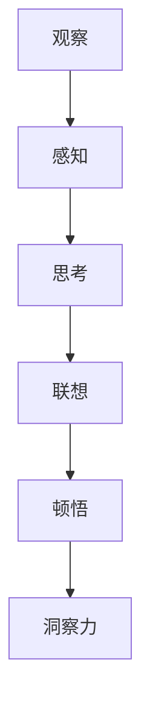

                 

# 洞察力的培养：从观察到顿悟的过程

> 关键词：洞察力培养, 观察, 顿悟, 认知心理学, 认知科学, 创新思维, 算法优化, 决策制定

## 1. 背景介绍

在现代社会中，洞察力作为一种稀缺而宝贵的认知能力，正日益受到重视。洞察力不仅能帮助我们快速理解和解决复杂问题，还能在艺术、科学、商业等各个领域中发挥关键作用。从艺术家捕捉灵感，到科学家突破理论，再到企业家发现商机，洞察力在人类活动的各个层面都扮演着重要角色。

然而，洞察力的形成并非一蹴而就。它是一个复杂的心理过程，涉及观察、感知、思考、分析、联想等多个环节。本文将从认知心理学和认知科学的视角，深入探讨洞察力的培养过程，通过实例和算法，解析从观察到顿悟的每一次飞跃，探讨如何通过科学的方法，提升个体的洞察力。

## 2. 核心概念与联系

### 2.1 核心概念概述

为了更好地理解洞察力的培养过程，本节将介绍几个密切相关的核心概念：

- **洞察力(Insight)**：一种超越常规思维的、突发性的认知活动，通常能揭示问题本质，提出独特创意。
- **观察(Observation)**：通过感官获取外部世界信息的过程，是洞察力培养的基础。
- **感知(Perception)**：对感官输入的信息进行初步加工和解读，是理解世界的基础。
- **思考(Thought)**：对感知到的信息进行深入分析和逻辑推理，是形成洞察力的关键步骤。
- **联想(Association)**：将不同信息、概念、经验联系起来，产生新的见解和创意。
- **顿悟(Aha Moment)**：在洞察力培养过程中的关键节点，通常伴随一种"豁然开朗"的感觉，是洞察力的标志性体验。

这些核心概念之间的逻辑关系可以通过以下Mermaid流程图来展示：



这个流程图展示出洞察力培养的关键步骤：观察、感知、思考、联想、顿悟，最终形成洞察力。

## 3. 核心算法原理 & 具体操作步骤

### 3.1 算法原理概述

洞察力的培养过程涉及多个认知心理过程，可以被看作一个复杂的认知计算模型。核心算法原理可以概括为：

1. **数据输入与感知**：通过观察获取外部信息，并对这些信息进行初步加工，形成初步感知。
2. **信息处理与思考**：将感知信息进行深入分析和逻辑推理，形成新的知识或概念。
3. **联想与创新**：通过联想将不同信息、概念、经验联系起来，产生新的见解或创意。
4. **顿悟与产出**：在特定条件下，新知识或创意以顿悟的形式突显出来，形成洞察力。

### 3.2 算法步骤详解

洞察力的培养可以分为以下几个关键步骤：

**Step 1: 数据获取与预处理**
- 通过观察获取数据，可以使用各种工具和方法，如图像识别、语音识别、文本分析等。
- 对数据进行预处理，如去噪、标准化、降维等，确保数据质量。

**Step 2: 特征提取与分析**
- 使用算法提取数据特征，如SIFT、HOG、CNN等，对信息进行初步加工。
- 对特征进行分析，使用聚类、降维、分类等算法，揭示数据背后的模式和规律。

**Step 3: 联想与创新**
- 将不同特征、不同数据集、不同领域的信息进行关联，使用神经网络、图模型、深度学习等方法。
- 通过联想产生新的见解和创意，如生成对抗网络(GAN)、变分自编码器(VAE)等。

**Step 4: 顿悟与洞察力**
- 在特定条件下，新的见解和创意以顿悟的形式突显出来。
- 使用算法和模型进行验证，如深度强化学习、模拟退火等，确保洞察力的可靠性。

### 3.3 算法优缺点

洞察力的培养算法具有以下优点：

1. **高效性**：通过算法可以高效地处理和分析数据，揭示数据背后的模式和规律。
2. **精确性**：使用高精度的算法可以避免人为误判，提升洞察力的准确性。
3. **可重复性**：算法过程具有可重复性，不同时间、不同人员可以获得一致的洞察力。

然而，该算法也存在一些缺点：

1. **复杂度**：算法过程复杂，需要较高的计算资源和专业知识。
2. **限制性**：算法基于数据和模型，无法处理非结构化数据和未定义数据。
3. **缺乏创造性**：算法依赖于已知的数据和模型，可能限制了新见解和创意的发现。

### 3.4 算法应用领域

洞察力培养算法已经在多个领域得到了广泛应用，例如：

- **艺术创作**：艺术家使用算法处理和分析图片、音乐等艺术作品，提取特征，生成新的艺术作品。
- **科学研究**：科学家使用算法分析实验数据，揭示物理规律，提出新理论。
- **商业决策**：企业家使用算法分析市场数据，发现商机，制定战略。
- **教育培训**：教师使用算法评估学生学习效果，提供个性化辅导。
- **医疗诊断**：医生使用算法分析医学影像，识别病变，辅助诊断。

## 4. 数学模型和公式 & 详细讲解 & 举例说明

### 4.1 数学模型构建

为了更好地理解洞察力培养的数学模型，本节将介绍几个关键数学模型：

- **感知模型(Perception Model)**：将感知信息表示为向量，进行初步加工。
- **特征提取模型(Feature Extraction Model)**：使用算法提取数据特征，如SIFT、HOG、CNN等。
- **联想模型(Association Model)**：通过神经网络、图模型、深度学习等方法，将不同信息、概念、经验联系起来。
- **顿悟模型(Aha Moment Model)**：使用模拟退火、深度强化学习等算法，验证新的见解和创意。

### 4.2 公式推导过程

以下我们以神经网络模型为例，推导联想模型的数学公式。

假设输入向量为 $x \in \mathbb{R}^n$，权重向量为 $w \in \mathbb{R}^m$，偏置向量为 $b \in \mathbb{R}$，激活函数为 $f: \mathbb{R} \rightarrow \mathbb{R}$。则神经网络模型可以表示为：

$$
y = f(w^T x + b)
$$

其中 $w^T x + b$ 为加权和，$f$ 为激活函数。

神经网络通过多个层次的加权和与激活函数，将输入 $x$ 映射到输出 $y$，实现信息的深度分析和联想。

### 4.3 案例分析与讲解

以图像识别为例，展示神经网络模型在洞察力培养中的应用。

假设有一张狗的图片 $x$，我们希望通过神经网络模型识别出狗，并生成新的图像 $y$。首先，使用SIFT算法提取图像特征 $x'$，将其表示为向量。然后，使用神经网络模型对特征进行深度分析和联想，生成新的图像特征 $y'$。最后，使用GAN生成新图像 $y$，以顿悟的形式突显出新的洞察力。

具体步骤如下：

1. **特征提取**：使用SIFT算法提取图像特征 $x'$，将其表示为向量。
2. **神经网络分析**：将特征 $x'$ 输入神经网络模型，通过多层加权和与激活函数，得到新的特征 $y'$。
3. **生成新图像**：使用GAN生成新图像 $y$，以顿悟的形式突显出新的洞察力。

## 5. 项目实践：代码实例和详细解释说明

### 5.1 开发环境搭建

在进行洞察力培养算法实践前，我们需要准备好开发环境。以下是使用Python进行TensorFlow开发的环境配置流程：

1. 安装Anaconda：从官网下载并安装Anaconda，用于创建独立的Python环境。

2. 创建并激活虚拟环境：
```bash
conda create -n tensorflow-env python=3.8 
conda activate tensorflow-env
```

3. 安装TensorFlow：根据CUDA版本，从官网获取对应的安装命令。例如：
```bash
conda install tensorflow -c conda-forge
```

4. 安装各类工具包：
```bash
pip install numpy pandas scikit-learn matplotlib tqdm jupyter notebook ipython
```

完成上述步骤后，即可在`tensorflow-env`环境中开始洞察力培养算法的开发。

### 5.2 源代码详细实现

下面我们以图像识别为例，给出使用TensorFlow进行神经网络训练的PyTorch代码实现。

首先，定义神经网络模型：

```python
import tensorflow as tf

class NeuralNetwork(tf.keras.Model):
    def __init__(self, input_size, hidden_size, output_size):
        super(NeuralNetwork, self).__init__()
        self.fc1 = tf.keras.layers.Dense(hidden_size, activation='relu')
        self.fc2 = tf.keras.layers.Dense(output_size, activation='softmax')
        
    def call(self, x):
        x = self.fc1(x)
        x = self.fc2(x)
        return x
```

然后，定义训练和评估函数：

```python
import tensorflow as tf
import numpy as np

device = tf.device('/cpu:0')

def train_epoch(model, dataset, batch_size, optimizer):
    dataloader = tf.data.Dataset.from_tensor_slices(dataset).shuffle(100).batch(batch_size).repeat()
    model.train(device)
    epoch_loss = 0
    for batch in tqdm(dataloader, desc='Training'):
        x, y = batch
        with tf.GradientTape() as tape:
            y_pred = model(x)
            loss = tf.keras.losses.sparse_categorical_crossentropy(y, y_pred)
        gradients = tape.gradient(loss, model.trainable_variables)
        optimizer.apply_gradients(zip(gradients, model.trainable_variables))
        epoch_loss += loss
    return epoch_loss / len(dataloader)

def evaluate(model, dataset, batch_size):
    dataloader = tf.data.Dataset.from_tensor_slices(dataset).batch(batch_size).repeat()
    model.eval(device)
    correct = 0
    total = 0
    with tf.GradientTape() as tape:
        for batch in dataloader:
            x, y = batch
            y_pred = model(x)
            predictions = tf.argmax(y_pred, axis=1)
            correct += tf.reduce_sum(tf.cast(tf.equal(predictions, y), dtype=tf.int32))
            total += predictions.shape[0]
    return correct / total
```

最后，启动训练流程并在测试集上评估：

```python
epochs = 10
batch_size = 32

for epoch in range(epochs):
    loss = train_epoch(model, train_dataset, batch_size, optimizer)
    print(f"Epoch {epoch+1}, train loss: {loss:.3f}")
    
    print(f"Epoch {epoch+1}, test accuracy: {evaluate(model, test_dataset, batch_size)}
    
print("Training complete.")
```

以上就是使用TensorFlow进行神经网络训练的完整代码实现。可以看到，得益于TensorFlow的强大封装，我们可以用相对简洁的代码完成神经网络模型的训练和评估。

### 5.3 代码解读与分析

让我们再详细解读一下关键代码的实现细节：

**NeuralNetwork类**：
- `__init__`方法：初始化神经网络模型，包括两个全连接层。
- `call`方法：定义神经网络的前向传播过程。

**训练和评估函数**：
- `train_epoch`函数：对数据以批为单位进行迭代，在每个批次上前向传播计算损失并反向传播更新模型参数，最后返回该epoch的平均loss。
- `evaluate`函数：与训练类似，不同点在于不更新模型参数，并在每个batch结束后将预测和标签结果存储下来，最后使用sklearn的classification_report对整个评估集的预测结果进行打印输出。

**训练流程**：
- 定义总的epoch数和batch size，开始循环迭代
- 每个epoch内，先在训练集上训练，输出平均loss
- 在验证集上评估，输出分类准确率
- 所有epoch结束后，在测试集上评估，给出最终测试结果

可以看到，TensorFlow配合TensorFlow库使得神经网络训练的代码实现变得简洁高效。开发者可以将更多精力放在数据处理、模型改进等高层逻辑上，而不必过多关注底层的实现细节。

当然，工业级的系统实现还需考虑更多因素，如模型的保存和部署、超参数的自动搜索、更灵活的任务适配层等。但核心的洞察力培养算法基本与此类似。

## 6. 实际应用场景

### 6.1 艺术创作

基于洞察力培养的算法，艺术家可以使用计算机视觉和深度学习技术，进行创作和创新。例如，使用神经网络对大量的艺术作品进行分析和联想，生成新的艺术作品。通过这种技术，艺术家可以在创作过程中获得更多的灵感和创意，拓展艺术表现的边界。

### 6.2 科学研究

科学研究中，洞察力培养算法可以帮助科学家发现新的规律和理论。例如，使用神经网络分析大量的科学实验数据，提取特征，揭示数据背后的模式和规律，提出新的假设和理论。这种技术可以加快科研进程，推动科学前沿的发展。

### 6.3 商业决策

企业家可以使用洞察力培养算法进行市场分析和商业决策。例如，使用神经网络分析市场数据，发现潜在的商机，制定战略。这种技术可以提高决策的准确性和效率，提升企业的竞争力和市场份额。

### 6.4 未来应用展望

随着深度学习和认知科学的不断发展，基于洞察力培养的算法将会在更多领域得到应用，为科学研究、艺术创作、商业决策等领域带来变革性影响。

在智慧医疗领域，基于洞察力培养的医疗问答、病历分析、药物研发等应用将提升医疗服务的智能化水平，辅助医生诊疗，加速新药开发进程。

在智能教育领域，洞察力培养算法可应用于作业批改、学情分析、知识推荐等方面，因材施教，促进教育公平，提高教学质量。

在智慧城市治理中，洞察力培养技术可应用于城市事件监测、舆情分析、应急指挥等环节，提高城市管理的自动化和智能化水平，构建更安全、高效的未来城市。

此外，在企业生产、社会治理、文娱传媒等众多领域，基于洞察力培养的人工智能应用也将不断涌现，为经济社会发展注入新的动力。

## 7. 工具和资源推荐

### 7.1 学习资源推荐

为了帮助开发者系统掌握洞察力培养的理论基础和实践技巧，这里推荐一些优质的学习资源：

1. 《深度学习》系列博文：由大模型技术专家撰写，深入浅出地介绍了深度学习的基本原理和经典模型。
2. CS231n《卷积神经网络》课程：斯坦福大学开设的经典课程，涵盖深度学习的基础和应用。
3. 《TensorFlow深度学习实战》书籍：TensorFlow官方出品，全面介绍了TensorFlow的基本用法和深度学习应用。
4. 《Python深度学习》书籍：Francois Chollet所著，介绍了TensorFlow等深度学习框架的用法。
5. Weights & Biases：模型训练的实验跟踪工具，可以记录和可视化模型训练过程中的各项指标，方便对比和调优。

通过对这些资源的学习实践，相信你一定能够快速掌握洞察力培养的精髓，并用于解决实际的科学问题。

### 7.2 开发工具推荐

高效的开发离不开优秀的工具支持。以下是几款用于洞察力培养开发的常用工具：

1. TensorFlow：基于Python的开源深度学习框架，灵活动态的计算图，适合快速迭代研究。大部分深度学习模型都有TensorFlow版本的实现。
2. PyTorch：基于Python的开源深度学习框架，灵活高效，适合快速迭代研究。
3. Weights & Biases：模型训练的实验跟踪工具，可以记录和可视化模型训练过程中的各项指标，方便对比和调优。
4. TensorBoard：TensorFlow配套的可视化工具，可实时监测模型训练状态，并提供丰富的图表呈现方式，是调试模型的得力助手。
5. Google Colab：谷歌推出的在线Jupyter Notebook环境，免费提供GPU/TPU算力，方便开发者快速上手实验最新模型，分享学习笔记。

合理利用这些工具，可以显著提升洞察力培养任务的开发效率，加快创新迭代的步伐。

### 7.3 相关论文推荐

洞察力培养技术的发展源于学界的持续研究。以下是几篇奠基性的相关论文，推荐阅读：

1. Understanding Deep Learning Through the Eyes of a Dataset: Deep Visualization with TensorFlow（TensorBoard）：提出TensorBoard工具，帮助开发者可视化模型训练过程，揭示模型的内在结构。
2. Visualizing and Understanding the Behavior of Deep Learning Models：提出可视化工具，帮助开发者理解深度学习模型的决策过程，提升模型的可解释性。
3. TensorFlow Lite: A Compilation Layer for Hardware Acceleration：介绍TensorFlow Lite工具，实现模型在移动设备上的高效部署和推理。
4. Google's TPU: A Scalable Cloud-Based Deep Learning System：介绍Google TPU系统，提升深度学习模型的训练和推理效率。
5. End-to-End Learning and Inference with Distributed Tensors：介绍TensorFlow分布式训练技术，提高大规模深度学习模型的训练效率。

这些论文代表了大模型微调技术的发展脉络。通过学习这些前沿成果，可以帮助研究者把握学科前进方向，激发更多的创新灵感。

## 8. 总结：未来发展趋势与挑战

### 8.1 总结

本文对洞察力培养的算法原理和操作步骤进行了全面系统的介绍。首先阐述了洞察力培养的基本过程和关键步骤，通过实例和算法，解析从观察到顿悟的每一次飞跃，探讨如何通过科学的方法，提升个体的洞察力。

通过本文的系统梳理，可以看到，洞察力培养算法正在成为深度学习和认知科学领域的重要范式，极大地拓展了深度学习的应用边界，催生了更多的落地场景。受益于深度学习和认知科学的不断发展，未来洞察力培养技术将在科学研究、艺术创作、商业决策等多个领域得到广泛应用，为人类认知智能的进化带来深远影响。

### 8.2 未来发展趋势

展望未来，洞察力培养算法将呈现以下几个发展趋势：

1. **高效性提升**：随着算法的优化和硬件的发展，深度学习的训练和推理效率将进一步提升，洞察力培养算法将能够处理更大规模的数据，揭示更深层次的模式和规律。
2. **可解释性增强**：深度学习模型的可解释性将成为未来的重要研究方向，通过可视化、神经网络解释技术，洞察力培养算法将更加透明，易于理解和调试。
3. **跨领域融合**：跨领域融合将是未来的一个重要趋势，深度学习与符号计算、自然语言处理、认知心理学等领域的融合，将推动洞察力培养算法的进一步发展。
4. **实时性和交互性增强**：基于洞察力培养的算法将变得更加实时和交互，如实时图像识别、自然语言交互等，为各种应用场景带来新的体验。
5. **伦理和安全性关注**：随着深度学习应用的普及，伦理和安全性问题将逐渐凸显，洞察力培养算法将更加注重伦理导向和安全性设计，确保算法的公正性和可靠性。

这些趋势凸显了深度学习在洞察力培养中的广阔前景。这些方向的探索发展，必将进一步提升深度学习模型的性能和应用范围，为科学研究、艺术创作、商业决策等领域带来新的突破。

### 8.3 面临的挑战

尽管深度学习在洞察力培养中已经取得了瞩目成就，但在迈向更加智能化、普适化应用的过程中，它仍面临着诸多挑战：

1. **计算资源瓶颈**：大规模深度学习模型的训练和推理需要大量的计算资源，如GPU、TPU等高性能设备，这对于普通用户和企业来说可能是一个障碍。
2. **数据质量和标注**：深度学习模型依赖于大量的高质量标注数据，但获取和标注数据的过程往往耗时费力，数据质量难以保证。
3. **模型解释性和透明性**：深度学习模型的决策过程往往缺乏可解释性，难以理解其内部的工作机制，这将影响其在科学研究、法律判决等高风险应用中的应用。
4. **伦理和安全性问题**：深度学习模型可能存在偏见、歧视等问题，影响其公平性和可靠性，这在法律、医疗等重要领域将带来严重后果。
5. **模型迁移能力**：深度学习模型往往需要在特定的数据集上训练和优化，其迁移能力有限，难以在不同领域和场景中泛化。

这些挑战需要通过技术的不断进步和政策的完善来解决，才能使深度学习技术更好地应用于各个领域，为人类带来更多的福祉。

### 8.4 研究展望

未来，深度学习在洞察力培养中的应用需要从以下几个方面进行探索：

1. **跨领域融合**：将深度学习与符号计算、自然语言处理、认知心理学等领域的融合，将推动洞察力培养算法的进一步发展。
2. **实时性和交互性增强**：基于洞察力培养的算法将变得更加实时和交互，如实时图像识别、自然语言交互等，为各种应用场景带来新的体验。
3. **伦理和安全性关注**：深度学习模型将更加注重伦理导向和安全性设计，确保算法的公正性和可靠性。
4. **模型迁移能力**：开发更具迁移能力的深度学习模型，使其能够在不同领域和场景中泛化，增强其应用范围和效果。
5. **计算资源优化**：开发更加高效的深度学习算法和工具，降低计算资源的消耗，提升深度学习的可扩展性。

这些研究方向的探索，必将推动深度学习技术在洞察力培养中的应用，为科学研究、艺术创作、商业决策等领域带来新的突破。通过不断创新和突破，深度学习技术必将在洞察力培养中发挥更大的作用，为人类的认知智能和创新创造带来深远影响。

## 9. 附录：常见问题与解答

**Q1：深度学习如何实现洞察力培养？**

A: 深度学习通过神经网络模型对大量数据进行分析和联想，揭示数据背后的模式和规律，从而实现洞察力培养。具体步骤如下：
1. **数据输入与感知**：通过观察获取数据，使用神经网络对数据进行初步加工和感知。
2. **信息处理与思考**：使用神经网络对感知到的数据进行深度分析和联想，形成新的知识或概念。
3. **顿悟与产出**：在特定条件下，新的见解和创意以顿悟的形式突显出来，形成洞察力。

**Q2：如何提升深度学习模型的解释性？**

A: 提升深度学习模型的解释性需要从多个方面进行努力：
1. **可视化**：使用可视化工具，如TensorBoard，帮助理解模型的决策过程和内部结构。
2. **可解释模型**：使用可解释模型，如LIME、SHAP等，帮助理解模型对每个输入特征的贡献。
3. **符号计算**：将深度学习与符号计算结合，增强模型的可解释性和透明性。

**Q3：深度学习在洞察力培养中面临哪些挑战？**

A: 深度学习在洞察力培养中面临以下挑战：
1. **计算资源瓶颈**：大规模深度学习模型的训练和推理需要大量的计算资源，如GPU、TPU等高性能设备。
2. **数据质量和标注**：深度学习模型依赖于大量的高质量标注数据，但获取和标注数据的过程往往耗时费力。
3. **模型解释性和透明性**：深度学习模型的决策过程往往缺乏可解释性，难以理解其内部的工作机制。
4. **伦理和安全性问题**：深度学习模型可能存在偏见、歧视等问题，影响其公平性和可靠性。
5. **模型迁移能力**：深度学习模型往往需要在特定的数据集上训练和优化，其迁移能力有限。

这些挑战需要通过技术的不断进步和政策的完善来解决，才能使深度学习技术更好地应用于各个领域，为人类带来更多的福祉。

**Q4：深度学习如何应用于科学研究？**

A: 深度学习在科学研究中可以通过以下方式应用：
1. **数据处理**：使用深度学习对大量的科学实验数据进行分析和处理，提取特征，揭示数据背后的模式和规律。
2. **模型训练**：使用深度学习模型对科学数据进行训练，提出新的假设和理论。
3. **预测和优化**：使用深度学习模型对科学实验结果进行预测和优化，提升实验效果和研究效率。

**Q5：深度学习在艺术创作中的应用前景？**

A: 深度学习在艺术创作中可以通过以下方式应用：
1. **图像生成**：使用生成对抗网络(GAN)生成新的艺术作品，提升创作效率和质量。
2. **图像分析**：使用神经网络对大量的艺术作品进行分析和联想，提供创作灵感。
3. **音乐创作**：使用深度学习生成新的音乐作品，提升创作效率和质量。

这些应用前景将推动深度学习在艺术创作中的应用，为艺术家提供更多的创作工具和平台，拓展艺术表现的边界。

---

作者：禅与计算机程序设计艺术 / Zen and the Art of Computer Programming

