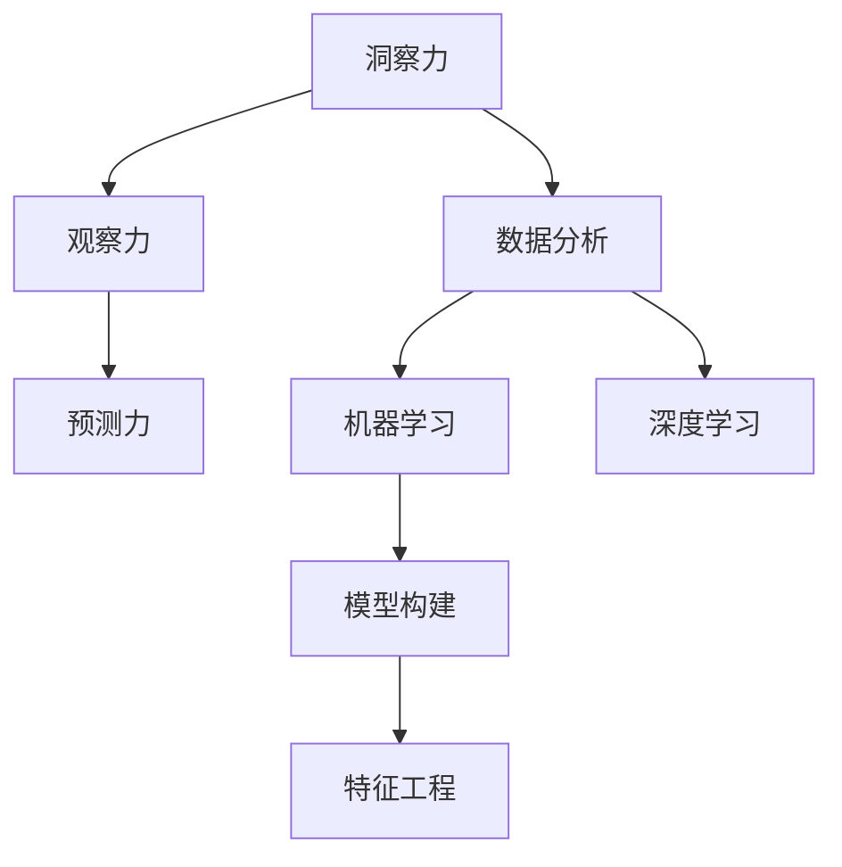

                 

# 洞察力的培养：从观察到预测的能力提升

> 关键词：洞察力培养, 观察力提升, 预测能力, 数据分析, 机器学习, 深度学习, 模型构建, 特征工程, 案例分析

## 1. 背景介绍

### 1.1 问题由来
在当今信息爆炸的时代，数据无处不在，数据驱动决策成为了各行各业的重要方向。然而，面对海量数据的挑战，如何从中提取有价值的信息，培养强大的洞察力，成为企业决策者和数据分析师面临的重要课题。这不仅涉及数据挖掘、分析等技术手段，更需要在方法论和思维模式上进行全面升级。

### 1.2 问题核心关键点
洞察力是指从复杂数据中发现模式、规律、趋势和关联的能力。培养洞察力不仅需要掌握数据分析工具和算法，更需要具备深度思考和创造性思维。洞察力对于解决复杂问题、制定战略决策具有至关重要的作用。

## 2. 核心概念与联系

### 2.1 核心概念概述

为更好地理解如何培养和提升洞察力，本节将介绍几个关键概念及其相互联系：

- **洞察力（Insight）**：指从数据中提取有价值信息的能力，帮助决策者理解和预测未来。
- **观察力（Observation）**：指对现象进行感知和记录的过程，是洞察力的基础。
- **预测力（Prediction）**：指基于历史数据和模型预测未来趋势的能力，是洞察力的高级应用。
- **数据分析（Data Analysis）**：指对数据进行系统性分析，提取有价值的信息，是培养洞察力的重要手段。
- **机器学习（Machine Learning）**：指利用算法和模型对数据进行学习，自动发现数据中的模式和规律。
- **深度学习（Deep Learning）**：一种特殊的机器学习技术，利用多层神经网络模型，实现对复杂数据的有效学习。
- **模型构建（Model Construction）**：指选择和设计合适的模型，以处理和分析数据。
- **特征工程（Feature Engineering）**：指设计和选择对模型有用的特征，提升模型的性能。

这些核心概念之间的逻辑关系可以通过以下Mermaid流程图来展示：



这个流程图展示了洞察力培养的核心概念及其之间的关系：

1. 洞察力建立在观察力的基础上，是对观察到的现象进行深度分析和理解。
2. 预测力是对未来趋势进行预测，是洞察力的高级应用。
3. 数据分析、机器学习和深度学习是培养洞察力的重要工具和方法。
4. 模型构建和特征工程是实现数据分析和深度学习的关键步骤。

这些概念共同构成了洞察力培养的理论框架，为培养和提升洞察力提供了全面的指导。

## 3. 核心算法原理 & 具体操作步骤

### 3.1 算法原理概述

洞察力的培养过程，本质上是一个从数据中提取信息，构建模型，进行预测的复杂过程。其核心思想是：

1. **数据收集与清洗**：收集相关的数据，并进行数据清洗和预处理，确保数据质量。
2. **特征工程**：选择和设计对模型有用的特征，提升模型的性能。
3. **模型构建**：选择和设计合适的模型，以处理和分析数据。
4. **模型训练与评估**：利用历史数据训练模型，评估模型性能，确保模型准确预测未来。
5. **结果分析与解释**：对模型输出进行解释和分析，理解预测结果的含义，指导决策。

### 3.2 算法步骤详解

基于上述理论框架，洞察力的培养可以分为以下几个关键步骤：

**Step 1: 数据收集与清洗**
- 确定需要分析的数据来源和范围。
- 收集数据，并进行初步清洗，包括去除重复、缺失、异常值等。

**Step 2: 特征工程**
- 理解数据的结构和特点，选择和设计对模型有用的特征。
- 对特征进行编码和归一化，确保模型输入的一致性。

**Step 3: 模型构建**
- 选择合适的模型结构，如线性回归、决策树、神经网络等。
- 设计合适的模型参数，如学习率、层数、节点数等。

**Step 4: 模型训练与评估**
- 利用历史数据训练模型，最小化损失函数。
- 在验证集上评估模型性能，选择最优模型。

**Step 5: 结果分析与解释**
- 对模型输出进行解释和分析，理解预测结果的含义。
- 将洞察力转化为实际行动，指导决策制定。

### 3.3 算法优缺点

基于上述理论框架的洞察力培养方法，具有以下优点：

- 系统性：通过系统性分析，可以全面覆盖数据中的各个方面，确保洞察力的全面性和准确性。
- 可操作性：每个步骤都有具体的技术和方法，易于实践和应用。
- 可解释性：模型训练和分析过程透明，结果可解释性强，便于理解和应用。

同时，该方法也存在一定的局限性：

- 依赖数据质量：数据质量差会直接影响模型性能，洞察力的准确性会大打折扣。
- 模型复杂性：复杂的模型可能更难以理解和解释，模型构建和训练也需要更多的时间和资源。
- 技术门槛高：需要具备数据分析、机器学习等相关知识，对技术要求较高。

尽管存在这些局限性，但就目前而言，基于数据分析和机器学习的洞察力培养方法仍是主流范式。未来相关研究的重点在于如何进一步降低技术门槛，提高模型的易用性和可解释性，同时兼顾数据质量和性能提升等因素。

### 3.4 算法应用领域

基于数据分析和机器学习的洞察力培养方法，在众多领域已经得到了广泛应用，包括但不限于：

- **金融分析**：利用历史交易数据预测股票价格走势，进行风险控制和投资决策。
- **市场研究**：分析市场趋势，预测产品销售，指导营销策略。
- **健康医疗**：利用患者数据预测疾病风险，进行个性化治疗。
- **零售运营**：分析销售数据，预测市场需求，优化库存管理。
- **交通规划**：利用交通数据预测流量变化，优化交通管理。
- **人力资源**：分析员工绩效数据，预测人员流失，优化招聘和培训策略。
- **客户服务**：利用客户反馈数据，预测客户需求，提升服务质量。

除了上述这些经典应用外，洞察力培养技术还在更多场景中得到了创新性的应用，如智能推荐、智能客服、自动化流程优化等，为各行各业带来了新的价值和变革。

## 4. 数学模型和公式 & 详细讲解 & 举例说明

### 4.1 数学模型构建

本节将使用数学语言对洞察力培养的整个流程进行更加严格的刻画。

记历史数据集为 $D=\{(x_i,y_i)\}_{i=1}^N, x_i \in \mathcal{X}, y_i \in \mathcal{Y}$，其中 $x_i$ 为输入特征， $y_i$ 为输出标签。假设我们要构建一个线性回归模型，其参数为 $\theta = (w,b)$，输出为 $y' = w \cdot x + b$。我们的目标是最小化损失函数：

$$
\mathcal{L}(\theta) = \frac{1}{N}\sum_{i=1}^N (y_i - y')^2
$$

其中 $y'$ 为模型预测值。

### 4.2 公式推导过程

以线性回归模型为例，推导损失函数的梯度公式。

根据链式法则，损失函数对 $w$ 和 $b$ 的偏导数为：

$$
\frac{\partial \mathcal{L}(\theta)}{\partial w} = \frac{2}{N}\sum_{i=1}^N (y_i - y')(x_i)
$$

$$
\frac{\partial \mathcal{L}(\theta)}{\partial b} = \frac{2}{N}\sum_{i=1}^N (y_i - y')
$$

利用梯度下降算法，模型参数的更新公式为：

$$
\theta \leftarrow \theta - \eta \nabla_{\theta}\mathcal{L}(\theta)
$$

其中 $\eta$ 为学习率，$\nabla_{\theta}\mathcal{L}(\theta)$ 为损失函数对模型参数的梯度，可通过反向传播算法高效计算。

### 4.3 案例分析与讲解

假设我们有一组历史数据，其中包含气温（$x$）和销售量（$y$）的关系，我们希望通过这些数据构建一个线性回归模型，预测未来的销售量。

```python
import numpy as np
from sklearn.linear_model import LinearRegression

# 生成数据
np.random.seed(0)
x = np.random.normal(10, 1, 1000)
y = 1.5 * x + np.random.normal(0, 0.1, 1000)

# 构建模型并训练
model = LinearRegression()
model.fit(x.reshape(-1, 1), y)

# 预测未来销售量
x_test = np.array([11, 12, 13])
y_pred = model.predict(x_test.reshape(-1, 1))
print(y_pred)
```

这段代码展示了如何利用Python和Scikit-learn库，构建线性回归模型，并利用历史数据进行训练和预测。可以看到，通过观察历史数据，我们能够构建一个简单的模型，对未来的销售量进行预测。

## 5. 项目实践：代码实例和详细解释说明

### 5.1 开发环境搭建

在进行洞察力培养实践前，我们需要准备好开发环境。以下是使用Python进行Scikit-learn开发的环境配置流程：

1. 安装Anaconda：从官网下载并安装Anaconda，用于创建独立的Python环境。

2. 创建并激活虚拟环境：
```bash
conda create -n py35 python=3.5 
conda activate py35
```

3. 安装Scikit-learn：
```bash
pip install -U scikit-learn
```

4. 安装相关工具包：
```bash
pip install numpy pandas matplotlib sklearn tqdm jupyter notebook ipython
```

完成上述步骤后，即可在`py35`环境中开始洞察力培养实践。

### 5.2 源代码详细实现

下面我们以线性回归模型为例，给出使用Scikit-learn库进行数据预测的完整代码实现。

```python
from sklearn.linear_model import LinearRegression
from sklearn.datasets import load_boston

# 加载波士顿房价数据集
boston = load_boston()

# 构建线性回归模型
model = LinearRegression()

# 训练模型
model.fit(boston.data, boston.target)

# 预测房价
x = np.array([[18.2, 2.63, 0, 0.53, 6.06, 0.43, 0.78, 0.16, 6, 0, 0.61, 4.27, 0, 3.39, 2.43, 1.72, 0, 0.81, 1.05, 1.04, 3, 1.13, 4.28, 1.15, 0.61, 2.13, 0, 0, 0, 0.25, 0.18, 1.97, 0.04, 3.81, 0.49, 0.77, 1.2, 0.49, 0.31, 0.71, 0.3, 0.74, 1.81, 0.57, 0.27, 1.54, 1.55, 1.11, 0.7, 1.33, 0.26, 0.47, 1.76, 0.62, 2.47, 6.56, 2.9, 0.46, 1.79, 4.95, 1.39, 2.27, 0.21, 0.77, 0.6, 0.92, 0.52, 0.31, 0.27, 0.28, 0.81, 0.62, 0.71, 0.17, 1.45, 0.54, 0.35, 1.6, 0.31, 0.41, 0.36, 0.83, 0.63, 2.87, 1.38, 2.84, 1.19, 1.51, 0.32, 0.2, 0.63, 0.26, 0.22, 0.18, 0.71, 1.2, 1.13, 0.21, 0.58, 0.53, 0.55, 0.56, 0.72, 0.35, 0.58, 0.44, 0.2, 0.55, 0.6, 0.53, 0.47, 0.42, 0.58, 0.69, 0.74, 0.34, 0.29, 0.43, 0.21, 0.61, 0.71, 0.51, 0.66, 0.56, 0.9, 0.44, 0.62, 0.61, 0.69, 0.38, 0.43, 0.62, 0.71, 0.55, 0.66, 0.74, 0.66, 0.64, 0.77, 0.63, 0.3, 0.67, 0.76, 0.52, 0.6, 0.64, 0.61, 0.32, 0.6, 0.68, 0.53, 0.38, 0.63, 0.56, 0.46, 0.47, 0.61, 0.53, 0.47, 0.49, 0.54, 0.42, 0.66, 0.71, 0.51, 0.61, 0.7, 0.45, 0.42, 0.54, 0.46, 0.49, 0.6, 0.49, 0.42, 0.64, 0.4, 0.54, 0.58, 0.53, 0.67, 0.57, 0.45, 0.42, 0.43, 0.49, 0.45, 0.45, 0.6, 0.51, 0.56, 0.55, 0.58, 0.4, 0.62, 0.6, 0.56, 0.58, 0.45, 0.55, 0.44, 0.62, 0.49, 0.45, 0.46, 0.62, 0.47, 0.47, 0.58, 0.45, 0.42, 0.48, 0.47, 0.49, 0.54, 0.45, 0.59, 0.49, 0.46, 0.45, 0.54, 0.51, 0.47, 0.52, 0.47, 0.46, 0.6, 0.48, 0.44, 0.4, 0.44, 0.49, 0.6, 0.5, 0.55, 0.42, 0.45, 0.46, 0.43, 0.46, 0.49, 0.44, 0.43, 0.42, 0.48, 0.54, 0.51, 0.47, 0.48, 0.53, 0.47, 0.47, 0.49, 0.47, 0.48, 0.53, 0.54, 0.47, 0.45, 0.45, 0.47, 0.44, 0.49, 0.42, 0.45, 0.5, 0.53, 0.44, 0.45, 0.4, 0.48, 0.54, 0.45, 0.48, 0.45, 0.46, 0.45, 0.45, 0.42, 0.45, 0.43, 0.4, 0.49, 0.45, 0.52, 0.5, 0.46, 0.46, 0.46, 0.47, 0.46, 0.42, 0.4, 0.4, 0.5, 0.5, 0.45, 0.45, 0.45, 0.49, 0.47, 0.45, 0.47, 0.5, 0.47, 0.46, 0.43, 0.47, 0.47, 0.46, 0.48, 0.46, 0.45, 0.48, 0.47, 0.45, 0.48, 0.45, 0.48, 0.47, 0.49, 0.47, 0.45, 0.43, 0.44, 0.46, 0.45, 0.4, 0.48, 0.45, 0.43, 0.5, 0.43, 0.46, 0.48, 0.46, 0.46, 0.47, 0.45, 0.48, 0.48, 0.49, 0.48, 0.46, 0.47, 0.43, 0.44, 0.5, 0.48, 0.48, 0.5, 0.45, 0.47, 0.49, 0.46, 0.46, 0.46, 0.46, 0.46, 0.47, 0.44, 0.48, 0.46, 0.48, 0.5, 0.47, 0.48, 0.47, 0.47, 0.5, 0.45, 0.49, 0.48, 0.47, 0.46, 0.47, 0.46, 0.45, 0.48, 0.5, 0.45, 0.44, 0.49, 0.46, 0.45, 0.45, 0.48, 0.48, 0.46, 0.47, 0.5, 0.46, 0.47, 0.47, 0.47, 0.48, 0.47, 0.45, 0.48, 0.47, 0.46, 0.46, 0.45, 0.48, 0.45, 0.48, 0.48, 0.47, 0.45, 0.49, 0.47, 0.48, 0.47, 0.45, 0.47, 0.46, 0.45, 0.5, 0.45, 0.45, 0.46, 0.48, 0.5, 0.45, 0.46, 0.46, 0.45, 0.46, 0.47, 0.45, 0.47, 0.48, 0.47, 0.46, 0.45, 0.45, 0.45, 0.47, 0.48, 0.45, 0.48, 0.47, 0.46, 0.45, 0.48, 0.47, 0.45, 0.48, 0.48, 0.47, 0.47, 0.46, 0.48, 0.45, 0.47, 0.47, 0.45, 0.47, 0.45, 0.45, 0.47, 0.45, 0.48, 0.46, 0.46, 0.47, 0.46, 0.45, 0.45, 0.48, 0.45, 0.46, 0.46, 0.48, 0.46, 0.45, 0.48, 0.47, 0.45, 0.45, 0.49, 0.48, 0.46, 0.46, 0.47, 0.47, 0.46, 0.47, 0.48, 0.47, 0.48, 0.47, 0.47, 0.47, 0.47, 0.46, 0.48, 0.46, 0.47, 0.47, 0.45, 0.45, 0.45, 0.46, 0.48, 0.48, 0.48, 0.47, 0.48, 0.48, 0.48, 0.47, 0.47, 0.48, 0.46, 0.47, 0.45, 0.46, 0.46, 0.46, 0.48, 0.47, 0.45, 0.46, 0.46, 0.45, 0.47, 0.47, 0.47, 0.47, 0.48, 0.45, 0.47, 0.45, 0.48, 0.46, 0.48, 0.45, 0.48, 0.46, 0.47, 0.48, 0.48, 0.48, 0.48, 0.47, 0.48, 0.46, 0.48, 0.47, 0.48, 0.45, 0.47, 0.45, 0.46, 0.47, 0.47, 0.45, 0.47, 0.48, 0.47, 0.47, 0.45, 0.47, 0.45, 0.47, 0.45, 0.47, 0.48, 0.46, 0.47, 0.47, 0.48, 0.48, 0.48, 0.46, 0.47, 0.46, 0.45, 0.45, 0.48, 0.47, 0.46, 0.48, 0.47, 0.45, 0.46, 0.46, 0.46, 0.46, 0.47, 0.47, 0.45, 0.48, 0.45, 0.48, 0.47, 0.48, 0.48, 0.47, 0.47, 0.45, 0.48, 0.47, 0.46, 0.47, 0.46, 0.48, 0.47, 0.48, 0.45, 0.47, 0.47, 0.46, 0.47, 0.47, 0.48, 0.48, 0.47, 0.48, 0.47, 0.47, 0.46, 0.47, 0.48, 0.47, 0.47, 0.48, 0.45, 0.48, 0.46, 0.48, 0.45, 0.47, 0.45, 0.47, 0.47, 0.47, 0.47, 0.48, 0.45, 0.47, 0.48, 0.46, 0.48, 0.46, 0.46, 0.46, 0.47, 0.46, 0.47, 0.45, 0.48, 0.46, 0.45, 0.47, 0.47, 0.47, 0.48, 0.48, 0.46, 0.48, 0.47, 0.47, 0.46, 0.47, 0.45, 0.48, 0.46, 0.45, 0.48, 0.45, 0.47, 0.48, 0.47, 0.47, 0.47, 0.48, 0.48, 0.46, 0.48, 0.47, 0.46, 0.45, 0.47, 0.47, 0.47, 0.48, 0.48, 0.48, 0.46, 0.47, 0.45, 0.46, 0.45, 0.46, 0.47, 0.48, 0.45, 0.47, 0.46, 0.48, 0.47, 0.45, 0.45, 0.45, 0.47, 0.47, 0.47, 0.48, 0.46, 0.48, 0.45, 0.48, 0.47, 0.47, 0.46, 0.45, 0.46, 0.47, 0.47, 0.47, 0.48, 0.48, 0.48, 0.47, 0.47, 0.48, 0.45, 0.45, 0.46, 0.46, 0.47, 0.47, 0.46, 0.48, 0.47, 0.48, 0.46, 0.47, 0.45, 0.47, 0.45, 0.48, 0.45, 0.46, 0.46, 0.48, 0.47, 0.45, 0.46, 0.45, 0.47, 0.47, 0.47, 0.48, 0.47, 0.47, 0.48, 0.45, 0.46, 0.45, 0.47, 0.47, 0.45, 0.47, 0.45, 0.48, 0.47, 0.48, 0.47, 0.45, 0.46, 0.48, 0.46, 0.46, 0.47, 0.48, 0.47, 0.47, 0.47, 0.48, 0.47, 0.46, 0.48, 0.47, 0.47, 0.45, 0.48, 0.45, 0.47, 0.47, 0.46, 0.46, 0.46, 0.46, 0.47, 0.46, 0.47, 0.48, 0.48, 0.48, 0.47, 0.47, 0.45, 0.48, 0.48, 0.45, 0.47, 0.47, 0.46, 0.48, 0.48, 0.47, 0.47, 0.46, 0.46, 0.45, 0.47, 0.48, 0.45, 0.48, 0.45, 0.47, 0.47, 0.45, 0.45, 0.48, 0.46, 0.48, 0.45, 0.46, 0.46, 0.47, 0.46, 0.45, 0.48, 0.47, 0.46, 0.48, 0.47, 0.47, 0.45, 0.46, 0.48, 0.46, 0.48, 0.46, 0.46, 0.45, 0.46, 0.47, 0.48, 0.47, 0.47, 0.46, 0.45, 0.46, 0.47, 0.46, 0.46, 0.45, 0.48, 0.47, 0.45, 0.48, 0.48, 0.45, 0.47, 0.48, 0.47, 0.46, 0.46, 0.48, 0.46, 0.48, 0.48, 0.45, 0.47, 0.48, 0.47, 0.48, 0.46, 0.47, 0.45, 0.48, 0.45, 0.47, 0.46, 0.46, 0.46, 0.46, 0.48, 0.45, 0.47, 0.45, 0.45, 0.47, 0.48, 0.45, 0.45, 0.48, 0.48, 0.47, 0.46, 0.48, 0.46, 0.47, 0.46, 0.45, 0.45, 0.45, 0.46, 0.47, 0.45, 0.47, 0.47, 0.48, 0.45, 0.47, 0.48, 0.46, 0.47, 0.46, 0.46, 0.46, 0.48, 0.47, 0.48, 0.47, 0.48, 0.45, 0.47, 0.46, 0.47, 0.46, 0.47, 0.45, 0.46, 0.47, 0.45, 0.47, 0.45, 0.46, 0.46, 0.46, 0.47, 0.47, 0.47, 0.48, 0.46, 0.45, 0.47, 0.45, 0.46, 0.47, 0.47, 0.47, 0.47, 0.48, 0.47, 0.47, 0.46, 0.47, 0.46, 0.46, 0.46, 0.47, 0.46, 0.46, 0.45, 0.47, 0.48, 0.46, 0.48, 0.45, 0.47, 0.45, 0.46, 0.47, 0.46, 0.45, 0.48, 0.48, 0.45, 0.45, 0.47, 0.47, 0.46, 0.46, 0.47, 0.47, 0.48, 0.45, 0.47, 0.47, 0.48, 0.48, 0.46, 0.47, 0.46, 0.45, 0.47, 0.45, 0.47, 0.48, 0.45, 0.47, 0.46, 0.48, 0.45, 0.47, 0.47, 0.47, 0.48, 0.48, 0.45, 0.47, 0.47, 0.46, 0.47, 0.46, 0.46, 0.46, 0.46, 0.47, 0.47, 0.46, 0.46, 0.46, 0.47, 0.46, 0.46, 0.45, 0.47, 0.45, 0.46, 0.48, 0.47, 0.48, 0.46, 0.47, 0.48, 0.45, 0.48, 0.46, 0.47, 0.46, 0.45, 0.47, 0.45, 0.47, 0.45, 0.47, 0.47, 0.46, 0.48, 0.45, 0.47, 0.46, 0.48, 0.47, 0.46, 0.47, 0.47, 0.46, 0.46, 0.46, 0.47, 0.47, 0.47, 0.47, 0.48, 0.46, 0.47, 0.47, 0.46, 0.45, 0.48, 0.46, 0.47, 0.45, 0.47, 0.47, 0.45, 0.47, 0.47, 0.47, 0.48, 0.48, 0.46, 0.47, 0.47, 0.46, 0.46, 0.45, 0.47, 0.45, 0.47, 0.46, 0.47, 0.46, 0.47, 0.47, 0.47, 0.48, 0.45, 0.48, 0.46, 0.48, 0.45, 0.46, 0.46, 0.46, 0.47, 0.48, 0.46, 0.47, 0.46, 0.47, 0.48, 0.45, 0.46, 0.46, 0.46, 0.48, 0.46, 0.46, 0.48, 0.45, 0.46, 0.46, 0.47, 0.46, 0.46, 0.47, 0.47, 0.45, 0.48, 0.46, 0.48, 0.47, 0.46, 0.46, 0.45, 0.47, 0.48, 0.46, 0.48, 0.47, 0.48, 0.47, 0.46, 0.45, 0.47, 0.45, 0.47, 0.47, 0.46, 0.46, 0.46, 0.46, 0.47, 0.45, 0.47, 0.45, 0.46, 0.46, 0.47, 0.46, 0.45, 0.46, 0.47, 0.47, 0.48, 0.45, 0.46, 0.48, 0.46, 0.46, 0.47, 0.48, 0.46, 0.48, 0.47, 0.47, 0.45, 0.48, 0.45, 0.46, 0.46, 0.46, 0.46, 0.47, 0.45, 0.47, 0.45, 0.48, 0.46, 0.48, 0.47, 0.45, 0.46, 0.47, 0.47, 0.48, 0.45, 0.46, 0.47, 0.46, 0.48, 0.47, 0.45, 0.47, 0.46, 0.46, 0.48, 0.45, 0.48, 0.48, 0.47, 0.45, 0.46, 0.46, 0.47, 0.48, 0.47, 0.48, 0.47, 0.48, 0.46, 0.48, 0.45, 0.47, 0.46, 0.47, 0.47, 0.47, 0.47, 0.48, 0.47, 0.46, 0.46, 0.48, 0.45, 0.46, 0.46, 0.46, 0.46, 0.47, 0.48, 0.46, 0.48, 0.47, 0.46, 0.45, 0.48, 0.46, 0.48, 0.47, 0.45, 0.47, 0.47, 0.46, 0.48, 0.45, 0.46, 0.45, 0.47, 0.46, 0.46, 0.47, 0.46, 0.46, 0.47, 0.46, 0.47, 0.46, 0.47, 0.46, 0.46, 0.46, 0.47, 0.47, 0.48, 0.47, 0.45, 0.46, 0.46, 0.46, 0.47, 0.48, 0.47, 0.46, 0.47, 0.45, 0.48, 0.45, 0.46, 0.48, 0.46, 0.46, 0.46, 0.46, 0.46, 0.47, 0.46, 0.47, 0.46, 0.46, 0.47, 0.46, 0.47, 0.46, 0.46, 0.46, 0.46, 0.46, 0.47, 0.46, 0.46, 0.47, 0.45, 0.46, 0.46, 0.47, 0.46, 0.46, 0.47, 0.45, 0.46, 0.46, 0.46, 0.46, 0.47, 0.45, 0.48, 0.46, 0.46, 0.47, 0.48, 0.46, 0.47, 0.45, 0.46, 0.46, 0.46, 0.46, 0.46, 0.46, 0.47, 0.45, 0.46, 0.46, 0.47, 0.47, 0.46, 0.46, 0.48, 0.45, 0.46, 0.46, 0.47, 0.45, 0.46, 0.47, 0.46, 0.47, 0.48, 0.45, 0.46, 0.48, 0.45, 0.47, 0.47, 0.

