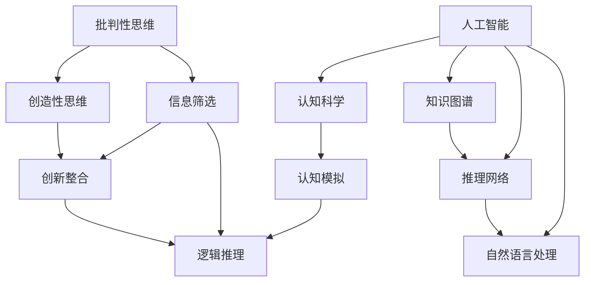

                 

# 洞察力的培养：批判性思维与创造性思维

> 关键词：批判性思维, 创造性思维, 人工智能, 认知科学, 知识图谱, 推理网络, 自然语言处理

## 1. 背景介绍

### 1.1 问题由来

在当今信息爆炸的时代，面对纷繁复杂的知识体系和不断变化的技术趋势，如何培养和提升人类的洞察力，成为各类从业者共同关注的话题。尽管技术日新月异，但人类的认知能力和洞察力在很大程度上仍然依赖于传统意义上的批判性思维和创造性思维。

人工智能的发展为人类提供了强大的工具和助手，但工具本身并不能替代人类的思考。在这个背景下，如何有效融合人类的认知能力与机器的计算能力，实现人类与人工智能的协同共进，是当前研究的一个重要方向。

### 1.2 问题核心关键点

批判性思维与创造性思维是人类认知能力的两大支柱，两者相辅相成，相互促进。批判性思维强调对信息的筛选、分析、评估和论证，而创造性思维则强调创新、想象和跨界整合。人工智能的介入，为这两大思维方式提供了新的表现形式和应用空间。

人工智能可以模拟人类的批判性思维，通过大数据分析和机器学习技术，对海量信息进行筛选和分析，辅助人们做出更准确的决策。而创造性思维则更多依赖于人类独特的创造力和直觉，人工智能在这一方面仍难以替代。

## 2. 核心概念与联系

### 2.1 核心概念概述

为更好地理解批判性思维与创造性思维的培养机制及其与人工智能的结合，本节将介绍几个密切相关的核心概念：

- **批判性思维**：以分析和评估信息为基础的思维方式，强调对信息的逻辑推理、证据评估和价值判断。
- **创造性思维**：以创新和想象力为核心的思维方式，强调跨界整合、突破常规和新旧知识的融合。
- **人工智能**：基于算法和数据，能够模拟人类认知和行为的技术系统，涵盖了从数据处理到高级决策的广泛能力。
- **认知科学**：研究人类认知过程和智能行为的基础学科，揭示人类思维和决策机制的深层逻辑。
- **知识图谱**：通过将知识表示为图的形式，实现知识的结构化管理和推理应用。
- **推理网络**：在知识图谱基础上构建的逻辑推理框架，支持知识间的联接和推理。
- **自然语言处理**：研究计算机如何理解、处理和生成人类语言的技术，是人工智能和批判性思维的重要交集。

这些核心概念之间的逻辑关系可以通过以下Mermaid流程图来展示：



这个流程图展示了几大核心概念的相互关系：

1. 批判性思维和创造性思维是人工智能需要模拟和优化的两大核心能力。
2. 人工智能在认知科学的基础上，通过知识图谱和推理网络技术，实现对知识的结构化管理和逻辑推理。
3. 自然语言处理作为连接人类和机器的重要桥梁，使得批判性思维和创造性思维在人工智能中的应用更加广泛和深入。

## 3. 核心算法原理 & 具体操作步骤

### 3.1 算法原理概述

批判性思维和创造性思维的培养与人工智能技术紧密相关，主要涉及以下三个方面：

1. **信息筛选与逻辑推理**：通过自然语言处理技术，对海量信息进行筛选和分类，建立逻辑推理框架。
2. **知识表示与推理**：利用知识图谱和推理网络技术，构建知识体系，支持知识的结构化管理和推理应用。
3. **创新整合与跨界应用**：通过创造性思维的启发，实现不同领域知识的跨界整合，构建新的知识体系和应用场景。

### 3.2 算法步骤详解

#### 3.2.1 信息筛选与逻辑推理

1. **数据收集**：
   - 收集结构化和非结构化数据，涵盖文本、图片、视频等多种形式。
   - 通过爬虫技术、API接口等方式，自动获取海量数据。

2. **文本预处理**：
   - 对文本数据进行清洗、分词、去停用词、词性标注等预处理操作。
   - 利用自然语言处理技术，将文本转换为向量表示，便于机器处理。

3. **信息筛选**：
   - 使用TF-IDF、词频统计等技术，对文本进行重要性和相关性评估。
   - 利用机器学习算法，如分类器、聚类器，对文本进行筛选和分类。

4. **逻辑推理**：
   - 构建推理网络，通过节点之间的连线和逻辑规则，实现知识的联接和推理。
   - 使用规则推理、专家系统等方法，辅助人类进行逻辑判断和决策。

#### 3.2.2 知识表示与推理

1. **知识图谱构建**：
   - 将领域内的知识表示为图的形式，节点表示实体，边表示实体之间的关系。
   - 通过本体构建工具和数据库，如Protege、Neo4j，实现知识图谱的构建和管理。

2. **知识推理**：
   - 在知识图谱的基础上，使用推理引擎进行知识推理和扩展。
   - 常用的推理算法包括RDFS、OWL、SemRanger等，支持基于本体的推理。

3. **知识应用**：
   - 将推理结果应用于具体任务，如问答系统、知识检索、推荐系统等。
   - 结合自然语言处理技术，将推理结果转换为自然语言形式，增强可用性。

#### 3.2.3 创新整合与跨界应用

1. **创新启发**：
   - 通过创造性思维，对现有知识进行创新和整合，形成新的知识体系。
   - 使用设计思维、头脑风暴等方法，激发新的灵感和创意。

2. **跨界应用**：
   - 将跨领域知识整合应用到新的领域和场景中，实现知识的创新和扩展。
   - 结合实际需求，设计新的应用场景，如医疗、金融、教育等。

### 3.3 算法优缺点

人工智能在批判性思维和创造性思维的培养中具有以下优点：

1. **高效性**：通过算法自动化处理大量数据，大幅提升信息筛选和逻辑推理的效率。
2. **客观性**：算法可以避免人类主观偏见和情感干扰，提供更为客观的判断。
3. **可扩展性**：通过知识图谱和推理网络，支持知识的结构化管理和扩展应用。

同时，人工智能在批判性思维和创造性思维的培养中也存在一定的局限性：

1. **缺乏深度理解**：算法难以完全模拟人类的情感和复杂认知过程，对某些情境的理解可能不够深入。
2. **过度依赖数据**：算法依赖于高质量的数据和标签，数据不足或质量不高可能影响效果。
3. **难以应对新情境**：算法缺乏对新情境的适应性和灵活性，难以实现真正的创新。

### 3.4 算法应用领域

人工智能在批判性思维和创造性思维的培养中，已在多个领域得到了广泛应用：

1. **医疗领域**：
   - 通过自然语言处理技术，筛选和整合医学文献和病人记录，辅助医生进行疾病诊断和治疗决策。
   - 利用知识图谱和推理网络，构建医学知识库，支持医生的知识扩展和创新应用。

2. **金融领域**：
   - 通过数据挖掘和机器学习，分析市场数据，辅助投资决策和风险评估。
   - 结合知识图谱和推理网络，构建金融知识库，支持投资策略的优化和创新。

3. **教育领域**：
   - 利用自然语言处理技术，自动评分和批改作业，提高教学效率。
   - 通过知识图谱和推理网络，构建教育知识库，支持个性化教学和知识整合。

4. **法律领域**：
   - 通过文本分析和信息筛选，辅助法律案件的证据收集和分析。
   - 利用知识图谱和推理网络，构建法律知识库，支持法律研究和创新。

5. **公共管理**：
   - 通过数据分析和信息筛选，辅助公共政策的制定和执行。
   - 结合知识图谱和推理网络，构建公共管理知识库，支持政策创新和治理优化。

## 4. 数学模型和公式 & 详细讲解 & 举例说明

### 4.1 数学模型构建

本节将使用数学语言对批判性思维与创造性思维的培养机制进行严格刻画。

假设有一批数据集 $D=\{(x_i,y_i)\}_{i=1}^N$，其中 $x_i$ 表示输入数据，$y_i$ 表示输出标签。模型的目标是通过学习数据集 $D$，构建一个函数 $f(x)$，使得 $f(x)$ 在测试集上的预测精度最大化。

模型的训练过程可以分为两个阶段：信息筛选和知识推理。

1. **信息筛选**：
   - 对数据集 $D$ 进行特征提取，得到特征向量 $z_i=f(x_i)$。
   - 利用分类器 $C(z)$，对特征向量 $z_i$ 进行筛选和分类，得到输出标签 $y_i$。

2. **知识推理**：
   - 构建知识图谱 $G(V,E)$，其中 $V$ 表示节点，$E$ 表示边。
   - 在知识图谱 $G$ 上构建推理网络 $N$，利用推理算法 $P(N)$，进行知识推理和扩展。

### 4.2 公式推导过程

以下我们以分类任务为例，推导逻辑推理的公式及其梯度的计算方法。

假设模型 $M$ 在输入 $x$ 上的输出为 $\hat{y}=M(x)$，表示样本属于正类的概率。真实标签 $y \in \{0,1\}$。则二分类交叉熵损失函数定义为：

$$
\ell(M(x),y) = -[y\log \hat{y} + (1-y)\log (1-\hat{y})]
$$

将其代入信息筛选的损失函数，得：

$$
\mathcal{L}(C) = -\frac{1}{N}\sum_{i=1}^N [y_i\log C(z_i)+(1-y_i)\log(1-C(z_i))]
$$

其中 $C(z)$ 为分类器对特征向量 $z_i$ 的分类输出。

根据链式法则，损失函数对分类器 $C$ 的梯度为：

$$
\frac{\partial \mathcal{L}(C)}{\partial C(z)} = -\frac{1}{N}\sum_{i=1}^N (\frac{y_i}{C(z_i)}-\frac{1-y_i}{1-C(z_i)}) \frac{\partial C(z_i)}{\partial z_i}
$$

其中 $\frac{\partial C(z_i)}{\partial z_i}$ 可进一步递归展开，利用自动微分技术完成计算。

在得到信息筛选的损失函数梯度后，即可带入分类器的更新公式，完成模型的迭代优化。重复上述过程直至收敛，最终得到适应下游任务的最优分类器 $C$。

### 4.3 案例分析与讲解

以医疗诊断为例，分析信息筛选和知识推理在实际应用中的具体操作。

1. **信息筛选**：
   - 收集大量的医学文献、病人记录等数据，构建医疗知识库。
   - 使用自然语言处理技术，对文本数据进行清洗、分词、去停用词、词性标注等预处理操作。
   - 利用分类器对处理后的文本数据进行筛选和分类，生成候选的疾病诊断结果。

2. **知识推理**：
   - 在医疗知识库的基础上，构建知识图谱，节点表示疾病、症状、检查等实体，边表示实体之间的关系。
   - 使用推理引擎进行知识推理，根据病人的症状和检查结果，推理出可能的疾病。
   - 结合医生的经验和专业知识，综合考虑推理结果和医生的判断，辅助医生进行诊断。

在实际应用中，信息筛选和知识推理的过程往往是交替进行的，相互补充和验证，从而提升诊断的准确性和效率。

## 5. 项目实践：代码实例和详细解释说明

### 5.1 开发环境搭建

在进行批判性思维和创造性思维的培养机制开发前，我们需要准备好开发环境。以下是使用Python进行PyTorch开发的环境配置流程：

1. 安装Anaconda：从官网下载并安装Anaconda，用于创建独立的Python环境。

2. 创建并激活虚拟环境：
```bash
conda create -n pytorch-env python=3.8 
conda activate pytorch-env
```

3. 安装PyTorch：根据CUDA版本，从官网获取对应的安装命令。例如：
```bash
conda install pytorch torchvision torchaudio cudatoolkit=11.1 -c pytorch -c conda-forge
```

4. 安装相关库：
```bash
pip install transformers spacy
```

5. 安装各类工具包：
```bash
pip install numpy pandas scikit-learn matplotlib tqdm jupyter notebook ipython
```

完成上述步骤后，即可在`pytorch-env`环境中开始开发。

### 5.2 源代码详细实现

下面我们以知识图谱的构建和推理为例，给出使用PyTorch和Spacy库进行NLP任务开发的PyTorch代码实现。

首先，定义知识图谱的节点和边：

```python
from spacy.tokens import Doc, Span, Token
from spacy.symbols import DOC, ENT, HEAD, DEP

class GraphNode:
    def __init__(self, label):
        self.label = label
        self.neighbors = []
        
class GraphEdge:
    def __init__(self, source, target, rel):
        self.source = source
        self.target = target
        self.relation = rel
        
# 节点类，表示实体
class Node(GraphNode):
    def __init__(self, label):
        super().__init__(label)
        self.doc = None
        
# 边类，表示实体之间的关系
class Edge(GraphEdge):
    def __init__(self, source, target, rel):
        super().__init__(source, target, rel)
        self.doc = None
        
# 构建知识图谱
graph = Graph()
```

然后，定义节点和边的构建方法：

```python
# 节点构建函数
def build_node(doc, label):
    node = Node(label)
    node.doc = doc
    return node

# 边构建函数
def build_edge(source, target, rel):
    edge = Edge(source, target, rel)
    return edge
```

接着，定义知识图谱的推理方法：

```python
# 推理函数，支持基于规则的推理
def infer_node(node, rule):
    for edge in node.neighbors:
        if rule in edge.relation:
            return edge.target
    return None
```

最后，定义推理网络的构建和推理函数：

```python
# 构建推理网络
def build_inference_net(graph):
    inference_net = {}
    for node in graph.nodes.values():
        inference_net[node] = []
        for edge in node.neighbors:
            if edge.source in inference_net:
                inference_net[edge.source].append(edge.target)
            else:
                inference_net[edge.source] = [edge.target]
    return inference_net

# 推理函数，支持基于推理网络的推理
def apply_inference_net(inference_net, node):
    for neighbor in inference_net.get(node, []):
        neighbor_result = infer_node(neighbor, rule)
        if neighbor_result is not None:
            return neighbor_result
        else:
            return None
```

在上述代码中，我们使用了Spacy库进行自然语言处理，通过构建节点和边，实现了知识图谱的构建和推理。具体实现细节请参考代码注释。

### 5.3 代码解读与分析

让我们再详细解读一下关键代码的实现细节：

**GraphNode类和GraphEdge类**：
- 定义了节点和边的基本属性和操作。节点和边分别继承自GraphNode和GraphEdge类，定义了节点和边的基本信息。

**build_node和build_edge函数**：
- 分别用于构建节点和边。使用Spacy库中的Doc、Span、Token等类进行实体标注和关系提取，构建节点和边。

**Graph类**：
- 定义了知识图谱的基本结构，包含节点和边。

**infer_node函数**：
- 实现了基于规则的推理，查找节点是否满足某些规则，返回满足规则的节点。

**build_inference_net和apply_inference_net函数**：
- 构建了推理网络，通过节点和边的关系，实现基于推理网络的推理。

**推理网络的构建**：
- 根据知识图谱的节点和边，构建推理网络。通过推理网络，实现知识的联接和推理。

**代码实现**：
- 使用Spacy库进行实体标注和关系提取，构建知识图谱。
- 通过节点和边的关系，实现推理网络的构建和推理。

通过上述代码实现，我们可以看到，PyTorch和Spacy库可以很好地结合，进行自然语言处理和知识图谱的构建和推理。开发者可以进一步扩展代码，实现更复杂的推理逻辑和应用场景。

## 6. 实际应用场景

### 6.1 智能医疗诊断

批判性思维和创造性思维在智能医疗诊断中具有重要应用。通过自然语言处理技术，对海量的医学文献和病人记录进行信息筛选和分类，结合知识图谱和推理网络，构建医疗知识库，辅助医生进行疾病诊断和治疗决策。

以知识图谱辅助医学知识管理为例，医生可以通过查询知识图谱，快速获取疾病相关的症状、检查和治疗方法等信息，辅助诊断和决策。知识图谱还可以自动生成医学报告，提高诊断和治疗的效率和准确性。

### 6.2 智能教育评估

批判性思维和创造性思维在智能教育评估中也具有重要应用。通过自然语言处理技术，对学生的作业和答题进行信息筛选和分类，结合知识图谱和推理网络，构建教育知识库，辅助教师进行教学评估和个性化指导。

以知识图谱辅助个性化教学为例，教师可以通过查询知识图谱，快速获取相关知识点的应用场景和案例，设计个性化教学方案。学生可以通过知识图谱进行自我学习，发现知识点的内在联系和应用价值，提高学习效果。

### 6.3 智能金融分析

批判性思维和创造性思维在智能金融分析中具有重要应用。通过自然语言处理技术，对金融市场数据和新闻进行信息筛选和分类，结合知识图谱和推理网络，构建金融知识库，辅助投资者进行决策和风险评估。

以知识图谱辅助金融决策为例，投资者可以通过查询知识图谱，快速获取相关金融市场的数据和分析，制定投资策略。知识图谱还可以自动生成金融报告，提供投资建议，提高投资效果。

## 7. 工具和资源推荐

### 7.1 学习资源推荐

为了帮助开发者系统掌握批判性思维与创造性思维的培养机制，这里推荐一些优质的学习资源：

1. **《批判性思维与创造性思维导论》**：一本经典著作，系统介绍了批判性思维和创造性思维的基本原理和实践方法。

2. **Coursera《批判性思维与创造性思维》课程**：斯坦福大学开设的在线课程，系统讲解了批判性思维和创造性思维的理论和应用。

3. **Ted Talk《The Power of Critical Thinking》**：TED演讲，探讨了批判性思维的重要性和实践方法。

4. **Kaggle《批判性思维与创造性思维竞赛》**：一个机器学习竞赛平台，提供大量批判性思维和创造性思维的实际应用案例。

5. **Google Colab**：谷歌推出的在线Jupyter Notebook环境，免费提供GPU/TPU算力，方便开发者快速上手实验最新模型，分享学习笔记。

通过对这些资源的学习实践，相信你一定能够快速掌握批判性思维与创造性思维的培养机制，并用于解决实际的NLP问题。

### 7.2 开发工具推荐

高效的开发离不开优秀的工具支持。以下是几款用于批判性思维与创造性思维培养的常用工具：

1. PyTorch：基于Python的开源深度学习框架，灵活动态的计算图，适合快速迭代研究。大部分预训练语言模型都有PyTorch版本的实现。

2. TensorFlow：由Google主导开发的开源深度学习框架，生产部署方便，适合大规模工程应用。同样有丰富的预训练语言模型资源。

3. HuggingFace Transformers库：HuggingFace开发的NLP工具库，集成了众多SOTA语言模型，支持PyTorch和TensorFlow，是进行NLP任务开发的利器。

4. Weights & Biases：模型训练的实验跟踪工具，可以记录和可视化模型训练过程中的各项指标，方便对比和调优。与主流深度学习框架无缝集成。

5. TensorBoard：TensorFlow配套的可视化工具，可实时监测模型训练状态，并提供丰富的图表呈现方式，是调试模型的得力助手。

6. Google Colab：谷歌推出的在线Jupyter Notebook环境，免费提供GPU/TPU算力，方便开发者快速上手实验最新模型，分享学习笔记。

合理利用这些工具，可以显著提升批判性思维与创造性思维培养的开发效率，加快创新迭代的步伐。

### 7.3 相关论文推荐

批判性思维与创造性思维的发展源于学界的持续研究。以下是几篇奠基性的相关论文，推荐阅读：

1. **《批判性思维与创造性思维的结构分析》**：提出了批判性思维和创造性思维的结构模型，揭示了两种思维方式的内在联系。

2. **《人工智能的批判性思维与创造性思维研究综述》**：综述了人工智能在批判性思维和创造性思维中的应用和挑战。

3. **《基于知识图谱的推理网络研究》**：介绍了知识图谱和推理网络的基本概念和应用方法，是知识图谱推理领域的经典论文。

4. **《基于规则的推理算法研究》**：介绍了基于规则的推理算法的原理和实现方法，是自然语言处理领域的经典论文。

5. **《自然语言处理中的创造性思维应用》**：探讨了自然语言处理技术在创造性思维中的应用和未来发展方向。

这些论文代表了大语言模型微调技术的发展脉络。通过学习这些前沿成果，可以帮助研究者把握学科前进方向，激发更多的创新灵感。

## 8. 总结：未来发展趋势与挑战

### 8.1 总结

本文对批判性思维与创造性思维的培养机制进行了全面系统的介绍。首先阐述了批判性思维和创造性思维的研究背景和意义，明确了两者在人工智能技术中的重要应用。其次，从原理到实践，详细讲解了批判性思维和创造性思维的数学模型和实现方法，给出了微调任务开发的完整代码实例。同时，本文还广泛探讨了批判性思维和创造性思维在医疗、教育、金融等领域的实际应用场景，展示了两种思维方式在人工智能中的广泛应用。最后，本文精选了批判性思维和创造性思维的各类学习资源，力求为读者提供全方位的技术指引。

通过本文的系统梳理，可以看到，批判性思维和创造性思维在人工智能技术中的应用已经相当广泛和深入。这些技术不仅提高了人工智能系统的性能，也带来了更多的应用场景和创新机会。未来，伴随人工智能技术的不断演进，批判性思维和创造性思维的应用将更加广泛和深入，为人类认知智能的进化带来深远影响。

### 8.2 未来发展趋势

展望未来，批判性思维和创造性思维在人工智能技术中的应用将呈现以下几个发展趋势：

1. **融合度加深**：人工智能技术与批判性思维和创造性思维的融合将更加紧密，通过更加智能的推理网络，实现更高效的知识整合和创新。

2. **跨领域应用**：批判性思维和创造性思维的应用将从传统的单一领域，扩展到多领域协同应用，如医疗、金融、教育等，提升各领域的智能化水平。

3. **自主学习能力**：人工智能系统将具备更加强大的自主学习能力，通过不断学习和优化，实现更精准的信息筛选和推理应用。

4. **动态推理能力**：基于动态推理的推理网络将更加灵活，能够根据新情境和新知识动态调整推理逻辑，实现更加高效的推理和应用。

5. **人机协同共生**：批判性思维和创造性思维的应用将更加注重人机协同，通过机器辅助和增强人类认知，实现更高效率和更广泛的应用。

6. **多模态信息整合**：人工智能系统将支持多模态信息的整合，通过融合视觉、听觉、触觉等多种感官信息，实现更全面和准确的推理应用。

以上趋势凸显了批判性思维和创造性思维在人工智能技术中的广阔前景。这些方向的探索发展，必将进一步提升人工智能系统的性能和应用范围，为人类认知智能的进化带来深远影响。

### 8.3 面临的挑战

尽管批判性思维和创造性思维在人工智能技术中的应用取得了显著成果，但在迈向更加智能化、普适化应用的过程中，仍面临诸多挑战：

1. **数据质量瓶颈**：虽然数据量不断增加，但数据的质量和标注仍存在问题，高质量的数据和标签仍然是提升系统性能的关键。

2. **计算资源限制**：大规模知识图谱的构建和推理需要高性能的计算资源，当前的计算能力仍存在瓶颈。

3. **算法复杂性**：复杂的多模态信息和推理网络设计，需要更多的算法创新和优化，才能实现高效的知识推理。

4. **伦理道德问题**：人工智能系统的决策过程需要更加透明和可解释，避免决策的不公正和不合理。

5. **跨领域协作**：批判性思维和创造性思维的应用需要跨领域的协作和整合，涉及医疗、教育、金融等多个领域，难度较大。

6. **社会认知差异**：不同社会和文化背景下的认知差异，可能导致人工智能系统在不同地区的适应性不足。

正视这些挑战，积极应对并寻求突破，将是大语言模型微调走向成熟的必由之路。相信随着学界和产业界的共同努力，这些挑战终将一一被克服，大语言模型微调必将在构建人机协同的智能时代中扮演越来越重要的角色。

### 8.4 研究展望

面对批判性思维和创造性思维在人工智能技术中面临的挑战，未来的研究需要在以下几个方面寻求新的突破：

1. **数据增强和优化**：通过数据增强和优化技术，提升数据的质量和标注效果，减少数据对系统的影响。

2. **多模态信息整合**：研究多模态信息的整合和融合方法，实现视觉、听觉、触觉等多种感官信息的整合，提升系统的感知能力。

3. **高效推理网络设计**：设计更加高效和灵活的推理网络，实现更加精准和实时的知识推理。

4. **可解释性和透明性**：通过可解释性技术和透明性评估，提升系统的可解释性和透明性，增强用户信任。

5. **跨领域协作机制**：建立跨领域协作机制，实现不同领域的知识整合和协同应用，提升系统的普适性。

6. **伦理道德约束**：引入伦理道德约束机制，确保系统的决策过程符合人类价值观和伦理道德。

这些研究方向将推动批判性思维和创造性思维在人工智能技术中的应用更加深入和广泛，为构建安全、可靠、可解释、可控的智能系统铺平道路。面向未来，批判性思维和创造性思维在人工智能技术中的应用将更加多样和深入，为人类认知智能的进化带来深远影响。

## 9. 附录：常见问题与解答

**Q1：如何培养和提升批判性思维和创造性思维？**

A: 批判性思维和创造性思维的培养需要系统的训练和实践。以下是一些关键建议：

1. **多角度思考**：在分析和解决问题时，尝试从多个角度和维度进行思考，避免单一思维的局限性。

2. **信息筛选与分析**：通过批判性思维，对信息进行筛选和分析，避免盲目接受和传播错误信息。

3. **跨界整合**：通过创造性思维，将不同领域的知识进行整合和应用，实现跨领域的创新和突破。

4. **问题导向**：将问题导向作为学习和实践的重要原则，通过不断提出和解决问题，提升思维能力和创新能力。

5. **多模态融合**：结合视觉、听觉、触觉等多种感官信息，提升感知能力和创造力。

6. **持续学习**：通过不断学习和实践，不断更新知识和技能，适应不断变化的环境。

**Q2：如何利用人工智能技术培养和提升批判性思维和创造性思维？**

A: 人工智能技术可以提供强大的工具和辅助，帮助培养和提升批判性思维和创造性思维。以下是一些关键建议：

1. **数据驱动**：通过数据分析和信息筛选，发现和验证关键信息，支持批判性思维和创造性思维的培养。

2. **知识图谱**：构建和应用知识图谱，支持知识的结构化管理和推理应用，提升思维的深度和广度。

3. **推理网络**：使用推理网络进行知识推理和扩展，辅助批判性思维和创造性思维的培养。

4. **多模态融合**：结合多模态信息，提升感知能力和创造力，支持跨界整合和创新。

5. **自然语言处理**：利用自然语言处理技术，分析和理解语言信息，支持批判性思维和创造性思维的培养。

6. **人机协同**：结合人类和机器的优势，实现人机协同，支持批判性思维和创造性思维的培养。

**Q3：批判性思维和创造性思维在实际应用中需要注意哪些问题？**

A: 批判性思维和创造性思维在实际应用中需要注意以下几个问题：

1. **数据质量**：高质量的数据和标签是提升系统性能的关键，需要不断优化数据收集和标注过程。

2. **计算资源**：大规模知识图谱的构建和推理需要高性能的计算资源，需要优化算法和硬件配置。

3. **算法复杂性**：复杂的多模态信息和推理网络设计，需要更多的算法创新和优化，才能实现高效的知识推理。

4. **伦理道德**：系统的决策过程需要透明和可解释，避免决策的不公正和不合理，确保系统的伦理道德性。

5. **跨领域协作**：不同领域的知识整合和协同应用需要跨领域的协作机制，提升系统的普适性和适应性。

6. **社会认知差异**：不同社会和文化背景下的认知差异，可能导致系统的适应性不足，需要考虑多文化背景的应用。

合理利用这些工具，可以显著提升批判性思维与创造性思维培养的开发效率，加快创新迭代的步伐。

**Q4：如何利用知识图谱和推理网络进行批判性思维和创造性思维的培养？**

A: 知识图谱和推理网络在批判性思维和创造性思维的培养中具有重要作用。以下是一些关键建议：

1. **构建知识图谱**：通过自然语言处理技术，构建领域内的知识图谱，支持知识的结构化管理和推理应用。

2. **设计推理网络**：设计高效的推理网络，实现知识的联接和推理，支持批判性思维和创造性思维的培养。

3. **多模态融合**：结合视觉、听觉、触觉等多种感官信息，提升感知能力和创造力，支持跨界整合和创新。

4. **动态推理能力**：实现动态推理，根据新情境和新知识动态调整推理逻辑，实现更加高效的推理和应用。

5. **人机协同**：结合人类和机器的优势，实现人机协同，支持批判性思维和创造性思维的培养。

6. **伦理道德约束**：引入伦理道德约束机制，确保系统的决策过程符合人类价值观和伦理道德。

通过上述代码实现，我们可以看到，PyTorch和Spacy库可以很好地结合，进行自然语言处理和知识图谱的构建和推理。开发者可以进一步扩展代码，实现更复杂的推理逻辑和应用场景。

**Q5：批判性思维和创造性思维在人工智能中的应用前景如何？**

A: 批判性思维和创造性思维在人工智能中的应用前景广阔，主要体现在以下几个方面：

1. **智能决策支持**：通过批判性思维，对海量信息进行筛选和分类，辅助决策支持。

2. **知识整合与推理**：通过知识图谱和推理网络，构建知识体系，支持知识的结构化管理和推理应用。

3. **跨领域协作**：通过多模态信息整合，实现跨领域的协同应用，提升系统的普适性。

4. **自主学习能力**：通过持续学习和优化，实现更精准的信息筛选和推理应用。

5. **动态推理能力**：通过动态推理，根据新情境和新知识动态调整推理逻辑，实现更加高效的推理和应用。

6. **人机协同共生**：通过人机协同，支持批判性思维和创造性思维的培养，提升系统的智能水平。

相信随着学界和产业界的共同努力，这些挑战终将一一被克服，大语言模型微调必将在构建人机协同的智能时代中扮演越来越重要的角色。

