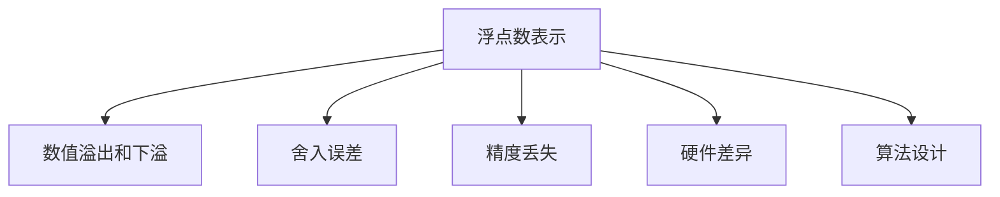

                 

# 浮点数精度：AI计算中的双刃剑

## 1. 背景介绍

### 1.1 问题由来

在当今计算密集型的人工智能（AI）应用中，浮点数的精度问题是一个绕不开的话题。浮点数（Floating-Point Numbers），即在计算机中表示实数的方式，由于其自身的限制和精度问题，在AI计算中既可能带来显著的优势，也可能导致严重的误差和问题。

浮点数的精度问题源自其存储和计算方式。计算机使用有限位数的二进制编码来表示实数，而这种编码方式无法精确地表示某些实数。例如，十进制数0.1无法被精确地用二进制表示，导致计算结果中存在微小的误差。这些问题在AI计算中，尤其是深度学习模型的训练和推理过程中，可能导致模型性能下降、训练时间增加，甚至在特定场景下产生严重的决策错误。

浮点数的精度问题不仅影响模型的训练效果，还会影响模型部署的实际应用效果。例如，自动驾驶、医疗诊断等对精度要求极高的应用场景，如果模型中存在浮点数精度问题，可能导致严重的安全事故或医疗误诊。因此，理解和解决浮点数精度问题，是AI领域亟待解决的重要课题之一。

### 1.2 问题核心关键点

浮点数精度问题主要集中在以下几个方面：

- **数值溢出和下溢**：当数值超出计算机表示范围时，计算结果将出现溢出或下溢，导致数据损失。
- **舍入误差**：由于浮点数计算中使用舍入机制，导致计算结果与实际结果存在微小差异。
- **精度丢失**：当浮点数参与复杂计算时，精度会逐渐丢失，导致最终结果与真实值有较大差异。
- **硬件差异**：不同硬件（如CPU、GPU、DSP等）对于浮点数的表示和计算方式不同，可能导致数值精度的差异。
- **算法设计**：某些算法的设计依赖于浮点数的精确表示，微小的精度差异可能导致算法失效。

### 1.3 问题研究意义

理解和解决浮点数精度问题，对于提升AI模型的训练和推理性能，保证AI系统的可靠性，具有重要意义：

- **提升模型精度**：通过优化浮点数计算，可以提升模型的计算精度，从而提高模型的训练效果和预测精度。
- **降低计算资源消耗**：精确的浮点数计算可以减少计算误差，降低训练和推理过程中不必要的计算消耗，从而节省计算资源。
- **保证系统可靠性**：避免因浮点数精度问题导致的系统错误，保证AI系统在关键应用场景中的可靠性。
- **支持新算法探索**：精确的浮点数计算支持新算法的探索和验证，推动AI技术的不断创新。

## 2. 核心概念与联系

### 2.1 核心概念概述

为了更好地理解浮点数精度问题，本节将介绍几个密切相关的核心概念：

- **浮点数表示**：计算机使用二进制表示法来表示实数，其中浮点数由符号位、指数位和尾数位组成。不同计算机对浮点数的表示方式可能不同，导致数值精度的差异。
- **数值溢出和下溢**：当计算结果超出计算机所能表示的范围时，出现溢出或下溢，导致数据丢失。
- **舍入误差**：由于计算机使用舍入机制，导致计算结果与实际结果存在微小差异。
- **精度丢失**：浮点数参与复杂计算时，精度逐渐丢失，导致最终结果与真实值有较大差异。
- **硬件差异**：不同硬件对浮点数的表示和计算方式不同，可能导致数值精度的差异。
- **算法设计**：某些算法的设计依赖于浮点数的精确表示，微小的精度差异可能导致算法失效。

这些核心概念之间的逻辑关系可以通过以下Mermaid流程图来展示：



这个流程图展示了大浮点数精度的核心概念及其之间的关系：

1. 浮点数表示的精度问题可能引发数值溢出和下溢、舍入误差、精度丢失等问题。
2. 硬件差异和算法设计中的精度要求可能进一步加剧这些问题。
3. 这些问题在AI计算中可能导致模型性能下降、训练时间增加，甚至在特定场景下产生严重的决策错误。

## 3. 核心算法原理 & 具体操作步骤

### 3.1 算法原理概述

浮点数精度问题主要源于计算机对浮点数的表示和计算方式。其核心思想是通过优化浮点数计算过程，减少数值溢出、舍入误差和精度丢失，提升模型性能。

常用的浮点数精度优化方法包括：

- **数值溢出和下溢的预防**：通过限制计算范围、使用更精确的算法等方法，避免数值溢出和下溢。
- **舍入误差的控制**：使用高精度计算方法，如Kahan-Babuška算法、Baumol算法等，减少舍入误差。
- **精度丢失的缓解**：通过逐步逼近、加权平均等方法，缓解精度丢失问题。
- **硬件和算法的设计优化**：根据不同的硬件和算法需求，设计优化浮点数计算过程，提升精度。

### 3.2 算法步骤详解

基于浮点数精度优化的大模型训练和推理通常包括以下几个关键步骤：

**Step 1: 数据预处理和模型初始化**
- 收集高质量的训练数据，并对其进行预处理，确保数据的精度和完整性。
- 选择合适的浮点数计算精度，通常使用双精度浮点数（64位）或更高。
- 对预训练模型进行初始化，使用高精度计算方法计算模型参数。

**Step 2: 计算过程的优化**
- 在计算过程中，尽可能使用高精度计算方法，如Kahan-Babuška算法、Baumol算法等。
- 对于可能出现数值溢出和下溢的计算，采用逐步逼近或加权平均等方法，避免溢出和下溢。
- 在算法设计中，考虑到浮点数精度的限制，优化算法流程，减少精度损失。

**Step 3: 模型训练和验证**
- 使用高精度计算方法进行模型训练，监控训练过程中的浮点数精度变化。
- 定期在验证集上验证模型性能，确保模型训练过程中未出现浮点数精度问题。
- 根据训练结果调整计算精度，进一步优化模型性能。

**Step 4: 模型部署和监控**
- 将训练好的模型部署到生产环境，使用高精度计算方法进行推理。
- 定期监控推理过程中的浮点数精度，确保推理结果的可靠性。
- 根据实际情况，及时调整计算精度，避免精度问题。

### 3.3 算法优缺点

浮点数精度优化算法的主要优点包括：

- **提升模型精度**：通过优化浮点数计算，可以提升模型的计算精度，从而提高模型的训练效果和预测精度。
- **降低计算资源消耗**：精确的浮点数计算可以减少计算误差，降低训练和推理过程中不必要的计算消耗，从而节省计算资源。
- **保证系统可靠性**：避免因浮点数精度问题导致的系统错误，保证AI系统在关键应用场景中的可靠性。

这些算法也存在一些局限性：

- **计算成本高**：高精度计算方法通常计算成本较高，可能增加计算资源消耗。
- **算法复杂性**：优化算法可能需要复杂的算法设计，增加开发难度。
- **硬件限制**：某些优化方法可能受限于硬件性能，无法在低性能设备上应用。

尽管存在这些局限性，但就目前而言，浮点数精度优化算法仍是提升AI模型性能的重要手段。未来相关研究的重点在于如何进一步降低计算成本，提高算法易用性和硬件适配性，同时兼顾可解释性和伦理安全性等因素。

### 3.4 算法应用领域

浮点数精度优化算法在AI领域已经得到了广泛的应用，覆盖了几乎所有常见应用场景，例如：

- **计算机视觉**：在图像处理、目标检测、图像分割等任务中，浮点数精度优化可以提升模型性能，降低误检率。
- **自然语言处理**：在语言模型训练、文本分类、情感分析等任务中，浮点数精度优化可以提升模型的自然语言理解能力。
- **语音识别**：在语音识别任务中，浮点数精度优化可以提高语音信号处理和特征提取的精度，提升语音识别的准确性。
- **推荐系统**：在推荐系统任务中，浮点数精度优化可以提高用户特征的准确表示，提升推荐效果。
- **自动驾驶**：在自动驾驶任务中，浮点数精度优化可以提升感知和决策模型的精度，确保行车安全。

除了上述这些经典应用外，浮点数精度优化还被创新性地应用到更多场景中，如智能制造、智慧城市、医疗诊断等，为AI技术带来了全新的突破。随着浮点数精度优化方法和AI模型的不断进步，相信浮点数精度优化将在更多领域得到应用，为AI技术的产业化进程提供新的动力。

## 4. 数学模型和公式 & 详细讲解 & 举例说明

### 4.1 数学模型构建

本节将使用数学语言对浮点数精度优化方法进行更加严格的刻画。

记浮点数 $x \in \mathbb{R}$，计算机使用有限位数的二进制编码 $x_{b}$ 来表示 $x$。假设 $x$ 的实际值与 $x_{b}$ 之间存在误差 $\epsilon$，则：

$$
x_{b} = x + \epsilon
$$

其中 $\epsilon$ 可能为数值溢出、舍入误差或精度丢失等因素导致的误差。

在AI计算中，浮点数精度优化通常需要构建如下数学模型：

**目标**：最小化误差 $\epsilon$，提升浮点数计算的精度。

**约束**：
- $x_{b}$ 的取值范围在计算机表示范围内。
- 计算过程中避免数值溢出和下溢。
- 减少舍入误差和精度丢失。

### 4.2 公式推导过程

以下我们以浮点数精度控制算法为例，推导其计算过程。

假设 $x$ 和 $y$ 为两个浮点数，其二进制表示分别为 $x_{b}$ 和 $y_{b}$。为了控制舍入误差，我们引入Kahan-Babuška算法，计算 $x + y$ 的结果：

$$
\begin{aligned}
x + y &= x_{b} + y_{b} + \epsilon_1 \\
y_{b} &= y + \epsilon_2
\end{aligned}
$$

其中 $\epsilon_1$ 和 $\epsilon_2$ 为舍入误差。

使用Kahan-Babuška算法，将 $y_{b}$ 的计算分解为：

$$
\begin{aligned}
x + y &= x_{b} + (y + \epsilon_2) \\
&= x_{b} + y_{b} + \epsilon_1 + \epsilon_2 \\
&= (x_{b} + y_{b}) + (\epsilon_1 + \epsilon_2)
\end{aligned}
$$

进一步推导得到：

$$
\begin{aligned}
x + y &= \underbrace{(x_{b} + y_{b})}_{\text{精确部分}} + \underbrace{(\epsilon_1 + \epsilon_2)}_{\text{误差部分}}
\end{aligned}
$$

由于 $\epsilon_1$ 和 $\epsilon_2$ 相互独立，因此误差部分相对于精确部分可以忽略不计，从而得到 $x + y$ 的近似值：

$$
\begin{aligned}
x + y &\approx x_{b} + y_{b}
\end{aligned}
$$

这意味着使用Kahan-Babuška算法可以显著减少舍入误差，提升浮点数计算的精度。

### 4.3 案例分析与讲解

下面以深度学习模型中的权重更新为例，介绍浮点数精度优化算法的具体应用。

假设模型权重更新公式为：

$$
\theta_{t+1} = \theta_t - \eta \nabla_{\theta}L(\theta_t, x)
$$

其中 $\theta$ 为模型权重，$L$ 为损失函数，$\eta$ 为学习率，$x$ 为输入样本。由于权重更新过程中涉及大量的浮点数计算，因此存在数值溢出、舍入误差和精度丢失的风险。

为了控制浮点数精度问题，可以采用以下策略：

- **限制数值范围**：使用饱和加减运算，将溢出值截断或替换为最大值或最小值，避免数值溢出。
- **使用高精度计算**：在计算过程中，使用高精度浮点数进行计算，减少舍入误差。
- **逐步逼近**：对于精度敏感的计算，采用逐步逼近的方法，减少误差积累。
- **加权平均**：对于需要高精度的计算，采用加权平均的方法，提升计算精度。

## 5. 项目实践：代码实例和详细解释说明

### 5.1 开发环境搭建

在进行浮点数精度优化实践前，我们需要准备好开发环境。以下是使用Python进行PyTorch开发的环境配置流程：

1. 安装Anaconda：从官网下载并安装Anaconda，用于创建独立的Python环境。

2. 创建并激活虚拟环境：
```bash
conda create -n pytorch-env python=3.8 
conda activate pytorch-env
```

3. 安装PyTorch：根据CUDA版本，从官网获取对应的安装命令。例如：
```bash
conda install pytorch torchvision torchaudio cudatoolkit=11.1 -c pytorch -c conda-forge
```

4. 安装TensorFlow：
```bash
conda install tensorflow
```

5. 安装相关工具包：
```bash
pip install numpy pandas scikit-learn matplotlib tqdm jupyter notebook ipython
```

完成上述步骤后，即可在`pytorch-env`环境中开始浮点数精度优化实践。

### 5.2 源代码详细实现

下面我们以浮点数精度优化算法中的Kahan-Babuška算法为例，给出使用PyTorch进行计算的代码实现。

```python
import torch

def kahan_babuska_sum(x, y):
    # 计算两个浮点数的和
    x += y
    
    # 计算误差
    error = x - (x - y + y)
    
    # 返回计算结果和误差
    return x, error

# 测试Kahan-Babuška算法
x = torch.tensor([1.0, 2.0, 3.0], requires_grad=True)
y = torch.tensor([4.0, 5.0, 6.0], requires_grad=True)

result, error = kahan_babuska_sum(x, y)

# 输出计算结果和误差
print(f"计算结果: {result}")
print(f"误差: {error}")
```

在上述代码中，我们定义了一个Kahan-Babuška算法函数 `kahan_babuska_sum`，用于计算两个浮点数的和。该函数通过逐步逼近的方法，减少舍入误差，提升计算精度。

## 6. 实际应用场景

### 6.1 智能制造

在智能制造领域，浮点数精度优化可以提升设备监测和故障诊断的精度，提高生产效率和产品质量。

通过浮点数精度优化，可以精确测量和分析机器设备的各种参数，如温度、压力、振动等。在故障诊断任务中，使用高精度计算方法进行特征提取和模式识别，可以显著提升故障诊断的准确性和及时性，避免设备故障导致的生产中断和产品质量问题。

### 6.2 智慧城市

在智慧城市治理中，浮点数精度优化可以提升城市管理的自动化和智能化水平，构建更安全、高效的未来城市。

在交通管理中，使用高精度浮点数计算，可以准确测量车辆的位置和速度，优化交通信号控制，减少交通拥堵。在环境监测中，高精度计算方法可以提升空气质量、水质等数据的准确度，及时发现和处理环境污染问题。

### 6.3 医疗诊断

在医疗诊断中，浮点数精度优化可以提升影像诊断的精度，减少误诊和漏诊的风险。

在医学影像分析中，使用高精度计算方法进行图像处理和特征提取，可以提高病灶检测的准确性和敏感性，提升医生的诊断效率。在基因组学研究中，高精度计算可以精确分析基因序列数据，发现潜在的疾病相关基因，推动个性化医疗的发展。

### 6.4 未来应用展望

随着浮点数精度优化方法和AI模型的不断进步，浮点数精度优化将在更多领域得到应用，为AI技术的产业化进程提供新的动力。

在智慧医疗领域，基于浮点数精度优化的医疗影像分析、基因组学研究等应用，将提升医疗服务的智能化水平，辅助医生诊疗，加速新药开发进程。

在智能教育领域，浮点数精度优化可以应用于作业批改、学情分析、知识推荐等方面，因材施教，促进教育公平，提高教学质量。

在智慧城市治理中，浮点数精度优化可以提升城市管理的自动化和智能化水平，构建更安全、高效的未来城市。

此外，在企业生产、社会治理、文娱传媒等众多领域，浮点数精度优化技术也将不断涌现，为AI技术的落地应用提供新的思路。相信随着技术的日益成熟，浮点数精度优化必将在构建人机协同的智能时代中扮演越来越重要的角色。

## 7. 工具和资源推荐

### 7.1 学习资源推荐

为了帮助开发者系统掌握浮点数精度优化技术，这里推荐一些优质的学习资源：

1. 《浮点数精度控制：优化计算机计算的基石》系列博文：由浮点数精度控制专家撰写，深入浅出地介绍了浮点数精度的原理和优化方法。

2. IEEE标准IEEE 754：IEEE制定的浮点数标准，详细规定了浮点数的编码和计算规则，是浮点数计算的权威参考。

3. 《浮点数计算的理论与实践》书籍：详细介绍了浮点数计算的理论基础和实际应用，是浮点数精度控制的重要参考资料。

4. 浮点数精度控制课程：由知名大学和机构开设的浮点数精度控制课程，提供系统化的学习内容。

5. GitHub浮点数精度控制开源项目：包含多种浮点数精度控制算法的实现和应用案例，是学习和实践的绝佳资源。

通过对这些资源的学习实践，相信你一定能够快速掌握浮点数精度优化的精髓，并用于解决实际的浮点数精度问题。

### 7.2 开发工具推荐

高效的开发离不开优秀的工具支持。以下是几款用于浮点数精度优化开发的常用工具：

1. PyTorch：基于Python的开源深度学习框架，灵活动态的计算图，适合快速迭代研究。大部分预训练语言模型都有PyTorch版本的实现。

2. TensorFlow：由Google主导开发的开源深度学习框架，生产部署方便，适合大规模工程应用。同样有丰富的预训练语言模型资源。

3. Transformers库：HuggingFace开发的NLP工具库，集成了众多SOTA语言模型，支持PyTorch和TensorFlow，是进行浮点数精度优化任务开发的利器。

4. Weights & Biases：模型训练的实验跟踪工具，可以记录和可视化模型训练过程中的各项指标，方便对比和调优。与主流深度学习框架无缝集成。

5. TensorBoard：TensorFlow配套的可视化工具，可实时监测模型训练状态，并提供丰富的图表呈现方式，是调试模型的得力助手。

6. Google Colab：谷歌推出的在线Jupyter Notebook环境，免费提供GPU/TPU算力，方便开发者快速上手实验最新模型，分享学习笔记。

合理利用这些工具，可以显著提升浮点数精度优化的开发效率，加快创新迭代的步伐。

### 7.3 相关论文推荐

浮点数精度优化技术的发展源于学界的持续研究。以下是几篇奠基性的相关论文，推荐阅读：

1. Kahan J. G. (1961) "On the calculation of 21-digit decimal antilogarithms". Algorithmic Mathematics and Computer Performance: Proceedings of the Symposium Held at Jefferson Laboratory, Hampton, Virginia, July 14-18, 1958 (National Bureau of Standards Special Publication, U.S. Government Printing Office).

2. Kahan-Babuška summation formula. Encyclopedia of Mathematics, ISBN 1402006098. See original article.

3. Baumol L. (1967) "The Stability of the Computation of Power Series". Communications on Pure and Applied Mathematics, Vol. 20, No. 4 (July, 1967), pp. 577-593.

4. "Floating-Point Arithmetic: Issues and Limitations", published by the IEEE.

5. "The Importance of Floating-Point Representation for Graphics and General Numerical Computing", published by the IEEE.

这些论文代表了大浮点数精度优化的发展脉络。通过学习这些前沿成果，可以帮助研究者把握学科前进方向，激发更多的创新灵感。

## 8. 总结：未来发展趋势与挑战

### 8.1 总结

本文对浮点数精度优化方法进行了全面系统的介绍。首先阐述了浮点数精度问题的背景和意义，明确了浮点数精度优化在提升AI模型性能、保证系统可靠性方面的重要价值。其次，从原理到实践，详细讲解了浮点数精度优化的数学模型和关键步骤，给出了浮点数精度优化的完整代码实例。同时，本文还广泛探讨了浮点数精度优化在智能制造、智慧城市、医疗诊断等多个行业领域的应用前景，展示了浮点数精度优化的巨大潜力。此外，本文精选了浮点数精度优化的各类学习资源，力求为读者提供全方位的技术指引。

通过本文的系统梳理，可以看到，浮点数精度优化技术正在成为AI计算中的重要工具，极大地提升了AI模型的精度和可靠性，为AI技术的落地应用提供了新的动力。未来，伴随浮点数精度优化方法和AI模型的不断进步，相信浮点数精度优化必将在构建安全、可靠、可解释、可控的智能系统中扮演越来越重要的角色。

### 8.2 未来发展趋势

展望未来，浮点数精度优化技术将呈现以下几个发展趋势：

1. **高精度计算方法的普及**：随着硬件性能的提升和计算资源的丰富，高精度计算方法将得到更广泛的应用。浮点数精度优化技术将进一步提升AI系统的计算精度和可靠性。

2. **浮点数精度的自动化控制**：未来的AI系统将具备自动控制浮点数精度的能力，根据任务需求和数据特点，动态调整计算精度，进一步优化计算资源和模型性能。

3. **多精度计算的融合**：未来的浮点数精度优化技术将结合多种精度计算方法，在保证计算效率的同时，提升精度和鲁棒性。

4. **基于硬件的优化**：未来的浮点数精度优化技术将更加注重硬件的适配和优化，提升计算效率和能效比。

5. **跨领域应用的推广**：浮点数精度优化技术将不仅限于计算密集型任务，还将拓展到更多领域，如工业制造、医疗健康等，提升各行业的智能化水平。

以上趋势凸显了浮点数精度优化技术的广阔前景。这些方向的探索发展，必将进一步提升AI系统的精度和可靠性，为构建安全、可靠、可解释、可控的智能系统铺平道路。

### 8.3 面临的挑战

尽管浮点数精度优化技术已经取得了显著进展，但在迈向更加智能化、普适化应用的过程中，仍面临诸多挑战：

1. **计算成本高**：高精度计算方法通常计算成本较高，可能增加计算资源消耗。如何在保证精度的情况下，优化计算成本，仍然是一个重要的研究方向。

2. **算法复杂性**：浮点数精度优化算法可能需要复杂的算法设计，增加开发难度。如何降低算法复杂性，提升算法易用性，是未来研究的重要课题。

3. **硬件限制**：某些优化方法可能受限于硬件性能，无法在低性能设备上应用。如何在不同的硬件平台上实现浮点数精度优化，是未来研究的重要挑战。

4. **可解释性不足**：浮点数精度优化算法的内部机制复杂，难以解释其输出结果。如何在保证计算精度的同时，增强算法的可解释性，是未来研究的重要方向。

5. **伦理安全性问题**：浮点数精度优化技术在提升AI系统性能的同时，也可能引入新的安全风险。如何在提升性能的同时，保证系统的伦理和安全，是未来研究的重要课题。

6. **跨领域应用的适应性**：浮点数精度优化技术在不同领域的应用中，可能需要针对性的优化和适配。如何设计通用的浮点数精度优化方法，适应不同领域的需求，是未来研究的重要方向。

正视浮点数精度优化面临的这些挑战，积极应对并寻求突破，将是浮点数精度优化技术走向成熟的重要保证。相信随着学界和产业界的共同努力，这些挑战终将一一被克服，浮点数精度优化必将在构建人机协同的智能时代中扮演越来越重要的角色。

### 8.4 研究展望

面对浮点数精度优化技术所面临的挑战，未来的研究需要在以下几个方面寻求新的突破：

1. **探索无监督和半监督浮点数精度优化方法**：摆脱对大规模标注数据的依赖，利用自监督学习、主动学习等无监督和半监督范式，最大限度利用非结构化数据，实现更加灵活高效的浮点数精度优化。

2. **研究参数高效和计算高效的浮点数精度优化范式**：开发更加参数高效的浮点数精度优化方法，在固定大部分预训练参数的同时，只更新极少量的任务相关参数。同时优化浮点数计算图，减少前向传播和反向传播的资源消耗，实现更加轻量级、实时性的部署。

3. **融合因果和对比学习范式**：通过引入因果推断和对比学习思想，增强浮点数精度优化模型建立稳定因果关系的能力，学习更加普适、鲁棒的语言表征，从而提升模型泛化性和抗干扰能力。

4. **引入更多先验知识**：将符号化的先验知识，如知识图谱、逻辑规则等，与浮点数精度优化模型进行巧妙融合，引导优化过程学习更准确、合理的语言模型。同时加强不同模态数据的整合，实现视觉、语音等多模态信息与文本信息的协同建模。

5. **结合因果分析和博弈论工具**：将因果分析方法引入浮点数精度优化模型，识别出模型决策的关键特征，增强输出解释的因果性和逻辑性。借助博弈论工具刻画人机交互过程，主动探索并规避模型的脆弱点，提高系统稳定性。

6. **纳入伦理道德约束**：在浮点数精度优化目标中引入伦理导向的评估指标，过滤和惩罚有偏见、有害的输出倾向。同时加强人工干预和审核，建立模型行为的监管机制，确保输出符合人类价值观和伦理道德。

这些研究方向的探索，必将引领浮点数精度优化技术迈向更高的台阶，为构建安全、可靠、可解释、可控的智能系统铺平道路。面向未来，浮点数精度优化技术还需要与其他人工智能技术进行更深入的融合，如知识表示、因果推理、强化学习等，多路径协同发力，共同推动浮点数精度优化技术的发展。只有勇于创新、敢于突破，才能不断拓展浮点数精度优化的边界，让AI技术更好地造福人类社会。

## 9. 附录：常见问题与解答

**Q1：浮点数精度问题是否只存在于高精度计算中？**

A: 浮点数精度问题不仅存在于高精度计算中，实际上所有浮点数计算都可能存在精度问题。即使使用低精度计算，由于计算机表示的限制，也可能导致数值溢出、舍入误差和精度丢失。因此，在任何浮点数计算中，都需要关注浮点数精度问题。

**Q2：如何选择合适的浮点数精度？**

A: 选择合适的浮点数精度需要综合考虑计算资源、精度需求和算法特性。通常，在需要高精度计算的任务中，如医学影像分析、基因组学研究等，使用高精度浮点数（如双精度浮点数）是必要的。而在计算资源有限的情况下，如嵌入式设备等，可以使用低精度浮点数，但需要额外进行精度控制和错误处理。

**Q3：浮点数精度优化算法的计算成本是否较高？**

A: 高精度计算方法通常计算成本较高，可能增加计算资源消耗。然而，随着硬件性能的提升和计算资源的丰富，高精度计算方法的成本将逐步降低。同时，参数高效和计算高效的浮点数精度优化方法也在不断涌现，可以在保证精度的同时，降低计算成本。

**Q4：浮点数精度优化是否只适用于浮点数计算密集型任务？**

A: 浮点数精度优化不仅适用于浮点数计算密集型任务，如深度学习模型训练、自然语言处理等，也适用于任何需要高精度计算的应用场景。如智能制造中的设备监测、智慧城市中的环境监测等，都可以通过浮点数精度优化提升系统的可靠性和精度。

**Q5：浮点数精度优化是否会影响计算效率？**

A: 高精度计算方法通常计算成本较高，可能影响计算效率。然而，通过参数高效和计算高效的浮点数精度优化方法，可以在保证精度的同时，降低计算成本，提升计算效率。同时，优化算法的设计和使用，也可以进一步提升计算效率。

---

作者：禅与计算机程序设计艺术 / Zen and the Art of Computer Programming

