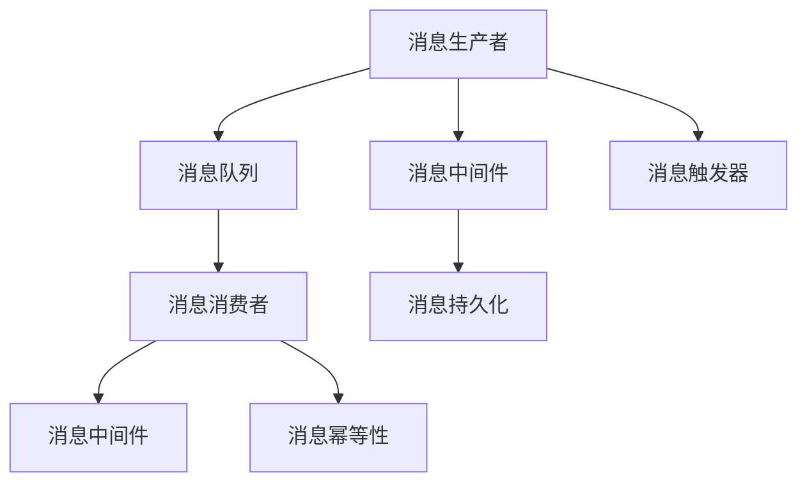

                 

# 消息队列：解耦系统组件的利器

> 关键词：消息队列,解耦,事件驱动架构,可靠传输,高可用性,数据一致性,吞吐量

## 1. 背景介绍

### 1.1 问题由来

在现代分布式系统中，组件之间的耦合越来越高，单一系统的复杂性不断增加，导致系统的维护难度和故障风险不断上升。如何实现组件的解耦，降低系统复杂度，提高系统的可维护性、可扩展性和可用性，成为系统架构设计的核心问题之一。消息队列作为一种流行的异步通信机制，已成为分布式系统中不可或缺的组件。

### 1.2 问题核心关键点

- 异步通信：消息队列支持异步通信，各个组件无需等待消息的发送和接收，提高了系统的并发能力和吞吐量。
- 解耦组件：消息队列提供了组件之间的解耦机制，不同组件独立运行，降低系统复杂度和风险。
- 可靠性保证：消息队列通过重试、持久化、幂等性等机制，保证消息的可靠传输和处理。
- 灵活扩展：消息队列支持组件的灵活扩展，可以快速增加或减少系统资源，应对流量波动。
- 高效通信：消息队列支持高吞吐量的通信方式，相比传统阻塞式通信，提升了系统的处理能力。
- 数据一致性：消息队列支持消息的顺序处理和幂等性，保证数据的一致性和正确性。

## 2. 核心概念与联系

### 2.1 核心概念概述

为更好地理解消息队列的基本原理和作用，本节将介绍几个密切相关的核心概念：

- 消息队列(Message Queue)：一种分布式异步通信机制，用于在不同的组件之间传递消息。消息队列由消息生产者(Publisher)、消息消费者(Subscriber)和消息中间件(Broker)构成。
- 生产者(Publisher)：负责生成和发送消息。可以是应用系统、消息触发器等。
- 消费者(Subscriber)：负责接收和处理消息。可以是应用系统、消息处理器等。
- 中间件(Broker)：负责存储和传输消息。可以是RabbitMQ、Kafka、ActiveMQ等。
- 发布-订阅模式(Publish/Subscribe, Pub/Sub)：一种消息模式，生产者发布消息，消费者订阅消息，中间件负责存储和传输消息。
- 请求-响应模式(Request/Response)：一种消息模式，生产者发送请求消息，消费者接收响应消息，中间件负责传输消息。

这些核心概念之间的逻辑关系可以通过以下Mermaid流程图来展示：



这个流程图展示了几类核心概念及其之间的关系：

1. 消息生产者通过消息中间件向消息队列发送消息。
2. 消息消费者通过消息中间件从消息队列接收消息。
3. 消息中间件存储和传输消息，同时实现消息的持久化和幂等性。
4. 消息触发器用于启动消息的生产和消费过程。
5. 消息持久化保证消息的可靠存储和传输。
6. 消息幂等性确保消息的重复处理不会对系统造成影响。

这些核心概念共同构成了消息队列的完整功能体系，使得异步通信机制在分布式系统中得以实现。通过理解这些核心概念，我们可以更好地把握消息队列的工作原理和优化方向。

## 3. 核心算法原理 & 具体操作步骤
### 3.1 算法原理概述

消息队列的算法原理主要基于发布-订阅模式，其核心思想是：生产者将消息发送到消息队列，消费者从消息队列中订阅消息并处理，中间件负责存储和传输消息。通过这种方式，实现组件之间的解耦，提高系统的并发性和可靠性。

消息队列的工作流程如下：

1. 生产者生成消息，并将其发送到消息队列。
2. 消息中间件接收消息，并存储到持久化的存储介质中。
3. 消费者订阅特定的消息队列，并从消息队列中获取消息。
4. 消息中间件将消息传输给消费者，消费者处理消息并给出响应。
5. 如果消费者处理失败，消息中间件将自动重试，直到成功。

消息队列的算法实现主要包括以下几个关键步骤：

- 消息生产：生产者通过消息中间件将消息发送到消息队列。
- 消息存储：消息中间件将消息存储到持久化的存储介质中。
- 消息传输：消息中间件将消息传输给消费者。
- 消息消费：消费者从消息队列中获取消息并处理。
- 消息确认：消费者处理完消息后，向消息中间件发送确认消息，中间件将其标记为已处理。
- 消息重试：如果消息中间件无法将消息传递给消费者，将自动重试，直到成功。

### 3.2 算法步骤详解

消息队列的实现涉及多个组件的交互，下面详细介绍其关键步骤：

**Step 1: 消息生产**

消息生产是消息队列的核心环节，涉及生产者、消息中间件和消息队列的交互。

- 生产者生成消息。生产者可以是应用系统、消息触发器等，根据实际应用场景进行实现。
- 生产者将消息发送到消息中间件。生产者通常通过中间件的API进行消息发送。
- 消息中间件接收消息。消息中间件是消息队列的核心组件，负责存储和传输消息。

**Step 2: 消息存储**

消息存储是消息队列的重要功能，涉及消息中间件和持久化存储介质的交互。

- 消息中间件将消息存储到持久化的存储介质中。持久化存储介质可以是文件、数据库等。
- 持久化存储介质保证消息的可靠存储和传输。消息持久化可以防止消息丢失，提高系统的可靠性。

**Step 3: 消息传输**

消息传输是消息队列的关键环节，涉及消息中间件和消费者的交互。

- 消息中间件将消息传输给消费者。消费者通常通过中间件的API进行消息接收。
- 消费者处理消息。消费者可以是应用系统、消息处理器等，根据实际应用场景进行实现。

**Step 4: 消息消费**

消息消费是消息队列的目标环节，涉及消费者、消息中间件和消息队列的交互。

- 消费者从消息队列中获取消息。消费者通常通过中间件的API进行消息接收。
- 消费者处理消息。消费者处理完消息后，向消息中间件发送确认消息，中间件将其标记为已处理。

**Step 5: 消息确认**

消息确认是消息队列的保障机制，涉及消费者和消息中间件的交互。

- 消费者处理完消息后，向消息中间件发送确认消息。
- 消息中间件将其标记为已处理。

**Step 6: 消息重试**

消息重试是消息队列的重要保障机制，涉及消息中间件的交互。

- 如果消息中间件无法将消息传递给消费者，将自动重试，直到成功。
- 消息重试可以防止消息丢失，提高系统的可靠性。

### 3.3 算法优缺点

消息队列作为一种异步通信机制，具有以下优点：

- 降低组件耦合：消息队列将生产者与消费者解耦，生产者无需等待消费者的响应，提高系统的并发性和可用性。
- 提高系统可靠性：消息队列支持消息的持久化和重试机制，防止消息丢失和重复处理。
- 灵活扩展：消息队列支持组件的灵活扩展，可以快速增加或减少系统资源，应对流量波动。
- 高效通信：消息队列支持高吞吐量的通信方式，相比传统阻塞式通信，提升了系统的处理能力。

同时，消息队列也存在以下缺点：

- 消息延时：消息队列中的消息可能会被延迟处理，导致消息延时。
- 系统复杂度：消息队列增加了系统的复杂度，需要考虑消息的可靠性和一致性问题。
- 资源消耗：消息队列需要额外的资源，如磁盘、内存等，增加系统成本。
- 开发成本：消息队列需要开发和维护消息中间件，增加开发成本。

### 3.4 算法应用领域

消息队列作为一种通用的异步通信机制，被广泛应用于各种系统架构中，例如：

- 企业级消息系统：企业内部的消息队列系统，用于业务系统之间的异步通信。
- 事件驱动架构：基于事件驱动架构的系统，通过消息队列实现事件的触发和处理。
- 微服务架构：微服务架构中的服务解耦，通过消息队列实现服务的通信和协作。
- 金融交易系统：金融交易系统中的消息传递，提高系统的可靠性和并发性。
- 物联网系统：物联网系统中的设备通信，通过消息队列实现设备的异步通信。
- 大数据处理系统：大数据处理系统中的数据流传递，通过消息队列实现数据的同步和异步处理。

除了上述这些常见场景外，消息队列还被广泛应用于各种场景中，如分布式事务、云平台、流处理、物联网等，为系统的解耦和异步通信提供基础保障。

## 4. 数学模型和公式 & 详细讲解 & 举例说明
### 4.1 数学模型构建

消息队列的数学模型主要基于发布-订阅模式，其核心思想是：生产者将消息发送到消息队列，消费者从消息队列中订阅消息并处理，中间件负责存储和传输消息。通过这种方式，实现组件之间的解耦，提高系统的并发性和可靠性。

假设消息队列的容量为 $N$，消息的到达速率服从泊松分布 $\lambda$，消息的处理速率为 $u$，消息的延迟时间为 $d$。则消息队列的消息数量 $M(t)$ 的数学模型为：

$$
M(t) = \int_0^t \lambda e^{-\lambda t} \mathrm{d}t + \frac{d}{u}(\lambda N - \lambda \int_0^t M(t) \mathrm{d}t)
$$

其中 $\lambda$ 为消息到达速率，$e$ 为自然常数，$N$ 为消息队列容量，$u$ 为消息处理速率，$d$ 为消息延迟时间。

### 4.2 公式推导过程

消息队列的数学模型涉及以下几个关键推导：

**推导1: 泊松分布**

泊松分布是一种描述随机事件发生次数的概率分布，用于描述消息到达的随机性。假设单位时间内消息到达次数为 $\lambda$，则消息到达的概率分布为：

$$
P(X=k) = \frac{e^{-\lambda} \lambda^k}{k!}
$$

**推导2: 消息数量推导**

消息队列的消息数量 $M(t)$ 可以表示为单位时间内消息到达数量和处理数量的差。假设单位时间内到达的消息数量为 $P$，处理的消息数量为 $u$，则消息数量的变化率为 $\lambda - u$。根据泊松分布，单位时间内到达的消息数量为 $\lambda e^{-\lambda t}$，因此消息数量的变化率为 $\lambda e^{-\lambda t} - u$。

假设消息队列的初始容量为 $N$，则消息数量的数学模型为：

$$
M(t) = N + \int_0^t (\lambda e^{-\lambda t} - u) \mathrm{d}t
$$

**推导3: 消息延迟**

消息队列中的消息可能被延迟处理，因此需要引入消息延迟时间 $d$。假设消息到达速率服从泊松分布 $\lambda$，则消息到达的时间间隔服从指数分布 $f(t) = \lambda e^{-\lambda t}$。假设消息的延迟时间为 $d$，则消息到达的时间间隔为 $t + d$，因此消息到达的分布为：

$$
P(X=t) = \frac{e^{-\lambda(t+d)} \lambda^t}{t!}
$$

将消息到达的时间间隔表示为 $t + d$，则消息数量的数学模型可以表示为：

$$
M(t) = \int_0^t \lambda e^{-\lambda(t+d)} \mathrm{d}t + \frac{d}{u}(\lambda N - \lambda \int_0^t M(t) \mathrm{d}t)
$$

通过上述推导，我们可以得到消息队列的消息数量数学模型，用于分析和优化消息队列系统。

### 4.3 案例分析与讲解

假设一个企业内部的消息队列，容量为 $N=1000$，消息到达速率 $\lambda=100$，消息处理速率 $u=50$，消息延迟时间 $d=1$，则消息数量的数学模型为：

$$
M(t) = \int_0^t \frac{100}{e^{100t}} \mathrm{d}t + \frac{1}{50}(1000 - 100 \int_0^t M(t) \mathrm{d}t)
$$

使用数值积分方法进行求解，可以得到消息队列在不同时间点的消息数量，从而分析和优化系统的性能。

## 5. 项目实践：代码实例和详细解释说明
### 5.1 开发环境搭建

在进行消息队列的实践前，我们需要准备好开发环境。以下是使用Python进行Kafka实践的环境配置流程：

1. 安装Kafka：从官网下载并安装Kafka，配置broker和topic等关键组件。
2. 创建Kafka集群：创建多节点Kafka集群，配置节点数、分区数、副本数等参数。
3. 创建Kafka客户端：创建生产者、消费者等Kafka客户端，用于发送和接收消息。
4. 安装Kafka相关工具：安装Kafka监控工具、日志记录工具等，用于管理和监控集群。

完成上述步骤后，即可在开发环境中进行消息队列的实践。

### 5.2 源代码详细实现

这里我们以Kafka为例，给出使用Python进行消息队列实践的完整代码实现。

首先，定义Kafka的生产者和消费者：

```python
from kafka import KafkaProducer, KafkaConsumer

# 定义生产者
producer = KafkaProducer(bootstrap_servers='localhost:9092', key_serializer=str.encode, value_serializer=str.encode)

# 定义消费者
consumer = KafkaConsumer('test-topic', bootstrap_servers='localhost:9092', group_id='my-group', auto_offset_reset='earliest')
```

然后，定义消息的生产和消费逻辑：

```python
# 生产消息
producer.send('test-topic', value='Hello, Kafka!')
producer.flush()

# 消费消息
for message in consumer:
    print(f'{message.partition} {message.key} {message.value}')
```

接着，启动Kafka集群，测试生产者和消费者：

```python
# 启动Kafka集群
kafka-server-start.sh config/server.properties

# 测试生产者
producer.send('test-topic', value='Hello, Kafka!')
producer.flush()

# 测试消费者
for message in consumer:
    print(f'{message.partition} {message.key} {message.value}')
```

最后，停止Kafka集群：

```python
# 停止Kafka集群
kafka-server-stop.sh
```

以上就是一个简单的Kafka消息队列实践，展示了生产者、消费者和中间件的交互过程。

### 5.3 代码解读与分析

让我们再详细解读一下关键代码的实现细节：

**KafkaProducer类**：
- `send`方法：用于发送消息到指定topic。
- `flush`方法：用于刷新缓存，确保消息已经发送。

**KafkaConsumer类**：
- `partition`属性：获取消息所属的分区。
- `key`属性：获取消息的key。
- `value`属性：获取消息的值。

**Kafka集群启动**：
- `kafka-server-start.sh`：启动Kafka集群，配置文件为`config/server.properties`。
- `kafka-server-stop.sh`：停止Kafka集群。

**消息生产**：
- `producer.send`方法：向指定topic发送消息，消息的内容为`Hello, Kafka!`。

**消息消费**：
- `consumer`对象：通过指定topic和group_id，创建消费者对象。
- `for message in consumer:`循环：遍历消费者对象，获取每条消息。
- `message.partition`属性：获取消息所属的分区。
- `message.key`属性：获取消息的key。
- `message.value`属性：获取消息的值。

可以看到，通过Kafka，我们可以方便地实现消息的生产和消费，保证系统组件之间的解耦和异步通信。

## 6. 实际应用场景
### 6.1 智能客服系统

基于消息队列的系统架构，可以构建智能客服系统的解决方案。智能客服系统通常需要处理大量的客户咨询请求，传统的多对多交互方式效率低下，容易产生瓶颈。

通过消息队列，智能客服系统可以采用异步通信方式，将客户咨询请求通过消息队列传递给多个客服处理组件，提高系统的并发性和处理能力。每个客服处理组件独立运行，处理完请求后，通过消息队列返回处理结果，实现消息的可靠传输和处理。

### 6.2 金融交易系统

金融交易系统中的消息队列架构，可以处理大量的交易订单和支付请求。传统的阻塞式通信方式容易产生网络瓶颈，导致交易延迟。

通过消息队列，金融交易系统可以采用异步通信方式，将交易订单和支付请求通过消息队列传递给多个交易处理组件，提高系统的并发性和处理能力。每个交易处理组件独立运行，处理完订单后，通过消息队列返回处理结果，实现消息的可靠传输和处理。

### 6.3 物联网系统

物联网系统中的消息队列架构，可以处理大量的设备数据和通信消息。传统的阻塞式通信方式容易产生网络瓶颈，导致通信延迟。

通过消息队列，物联网系统可以采用异步通信方式，将设备数据和通信消息通过消息队列传递给多个数据处理组件，提高系统的并发性和处理能力。每个数据处理组件独立运行，处理完数据后，通过消息队列返回处理结果，实现消息的可靠传输和处理。

### 6.4 未来应用展望

随着消息队列技术的不断演进，其在分布式系统中的应用场景将更加广泛，未来可能具备以下几个发展方向：

- 微服务架构：消息队列在微服务架构中的应用将更加普遍，用于实现服务的通信和协作。
- 事件驱动架构：基于消息队列的事件驱动架构将更加流行，实现应用的灵活扩展和敏捷开发。
- 大数据处理：消息队列在大数据处理中的应用将更加广泛，用于实现数据的同步和异步处理。
- 物联网系统：消息队列在物联网系统中的应用将更加普遍，用于实现设备的异步通信和数据处理。
- 金融交易系统：消息队列在金融交易系统中的应用将更加普遍，用于实现交易订单和支付请求的可靠传输和处理。
- 智能客服系统：消息队列在智能客服系统中的应用将更加普遍，用于实现客户咨询请求的可靠传输和处理。

这些方向凸显了消息队列技术的广泛应用前景，相信未来的消息队列技术将在更多场景中发挥重要作用，推动系统的解耦和异步通信的进步。

## 7. 工具和资源推荐
### 7.1 学习资源推荐

为了帮助开发者系统掌握消息队列的理论基础和实践技巧，这里推荐一些优质的学习资源：

1. 《消息队列设计与实现》系列博文：由消息队列专家撰写，深入浅出地介绍了消息队列的基本原理和实现方式。

2. 《Kafka: The Definitive Guide》书籍：Apache Kafka的权威指南，全面介绍了Kafka的核心功能和最佳实践。

3. 《Kafka: High Performance Messaging》书籍：Apache Kafka的高性能指南，介绍了Kafka的架构和优化策略。

4. 《RabbitMQ官方文档》：RabbitMQ的官方文档，提供了丰富的示例代码和API参考。

5. 《ActiveMQ官方文档》：ActiveMQ的官方文档，提供了详细的API和配置指南。

通过对这些资源的学习实践，相信你一定能够快速掌握消息队列的精髓，并用于解决实际的系统问题。
###  7.2 开发工具推荐

高效的开发离不开优秀的工具支持。以下是几款用于消息队列开发和部署的常用工具：

1. Kafka：由Apache基金会维护的开源消息队列系统，支持高吞吐量的异步通信，广泛应用于企业内部和外部系统中。

2. RabbitMQ：由Rabbit Technologies公司开发的企业级消息队列系统，支持多种消息模式和协议，广泛应用于金融、物联网等领域。

3. ActiveMQ：由IBM公司开发的企业级消息队列系统，支持多种消息模式和协议，广泛应用于医疗、零售等领域。

4. Weibei：由Weibei公司和Alibaba公司联合开发的开源消息队列系统，支持高可用性、高性能的消息传递。

5. Kafka Connect：Kafka的高可用性工具，用于数据的同步和异步处理，支持多种数据源和目标。

6. Kafka Streams：Kafka的流式处理工具，用于实时数据的处理和分析，支持SQL查询和流式计算。

7. Apache Pulsar：由Apache基金会维护的开源分布式消息平台，支持高可用性、高性能的消息传递，是Kafka的替代方案。

这些工具提供了丰富的功能和灵活的扩展能力，可以显著提升消息队列系统的开发效率和性能。

### 7.3 相关论文推荐

消息队列作为一种通用的异步通信机制，其研究已经得到广泛关注。以下是几篇奠基性的相关论文，推荐阅读：

1. Paxos Made Simple：提出Paxos算法，用于解决分布式系统中的故障容忍和一致性问题。

2. The Log-structured Storage System：提出Log-structured存储系统，用于实现高吞吐量的数据存储和检索。

3. Zookeeper：提出Zookeeper系统，用于分布式系统的协调和管理。

4. Apache Kafka：提出Kafka系统，用于实现高吞吐量的分布式消息队列。

5. RabbitMQ in Action：介绍RabbitMQ系统，包括其核心功能和最佳实践。

6. Kafka Design and Implementation：介绍Kafka系统，包括其架构和实现细节。

这些论文代表了大规模分布式系统的研究进展，对理解消息队列系统的工作原理和优化方向具有重要意义。

## 8. 总结：未来发展趋势与挑战
### 8.1 总结

本文对消息队列的基本原理和应用进行了全面系统的介绍。首先阐述了消息队列在分布式系统中的核心作用，明确了其在降低组件耦合、提高系统可用性和扩展性方面的独特价值。其次，从原理到实践，详细讲解了消息队列的核心算法和关键步骤，给出了消息队列系统开发的完整代码实例。同时，本文还广泛探讨了消息队列在智能客服、金融交易、物联网等多个领域的应用前景，展示了消息队列技术的广阔前景。此外，本文精选了消息队列技术的各类学习资源，力求为读者提供全方位的技术指引。

通过本文的系统梳理，可以看到，消息队列作为异步通信机制，已经在分布式系统中得到广泛应用，成为系统解耦和异步通信的重要手段。未来，伴随消息队列技术的持续演进，其在分布式系统中的应用场景将更加广泛，为系统的解耦和异步通信提供更强大的保障。

### 8.2 未来发展趋势

展望未来，消息队列技术将呈现以下几个发展趋势：

1. 高性能优化：消息队列的高性能优化将继续成为研究热点，提升系统的吞吐量和并发能力。
2. 微服务架构：消息队列在微服务架构中的应用将更加普遍，用于实现服务的通信和协作。
3. 事件驱动架构：基于消息队列的事件驱动架构将更加流行，实现应用的灵活扩展和敏捷开发。
4. 大数据处理：消息队列在大数据处理中的应用将更加广泛，用于实现数据的同步和异步处理。
5. 物联网系统：消息队列在物联网系统中的应用将更加普遍，用于实现设备的异步通信和数据处理。
6. 金融交易系统：消息队列在金融交易系统中的应用将更加普遍，用于实现交易订单和支付请求的可靠传输和处理。
7. 智能客服系统：消息队列在智能客服系统中的应用将更加普遍，用于实现客户咨询请求的可靠传输和处理。

这些趋势凸显了消息队列技术的广阔应用前景，相信未来的消息队列技术将在更多场景中发挥重要作用，推动系统的解耦和异步通信的进步。

### 8.3 面临的挑战

尽管消息队列技术已经取得了显著成果，但在迈向更加智能化、普适化应用的过程中，它仍面临以下挑战：

1. 系统复杂度：消息队列增加了系统的复杂度，需要考虑消息的可靠性和一致性问题。
2. 性能瓶颈：消息队列在高并发、高吞吐量的场景下容易产生性能瓶颈，需要优化系统的架构和算法。
3. 资源消耗：消息队列需要额外的资源，如磁盘、内存等，增加系统成本。
4. 开发成本：消息队列需要开发和维护消息中间件，增加开发成本。
5. 安全问题：消息队列中的消息可能包含敏感信息，需要考虑消息的安全性和隐私保护。
6. 扩展性问题：消息队列的扩展性需要考虑消息的可靠性和一致性问题，需要优化系统的架构和算法。

### 8.4 研究展望

面对消息队列技术所面临的挑战，未来的研究需要在以下几个方面寻求新的突破：

1. 系统优化：优化消息队列系统的架构和算法，提升系统的性能和可靠性。
2. 微服务架构：进一步探索消息队列在微服务架构中的应用，实现服务的灵活扩展和敏捷开发。
3. 事件驱动架构：探索事件驱动架构的实现方式，提高系统的灵活性和响应速度。
4. 大数据处理：探索消息队列在大数据处理中的应用，实现数据的同步和异步处理。
5. 物联网系统：探索消息队列在物联网系统中的应用，实现设备的异步通信和数据处理。
6. 金融交易系统：探索消息队列在金融交易系统中的应用，实现交易订单和支付请求的可靠传输和处理。
7. 智能客服系统：探索消息队列在智能客服系统中的应用，实现客户咨询请求的可靠传输和处理。

这些研究方向将推动消息队列技术在更多场景中的应用，为分布式系统提供更强大的保障。相信通过持续的创新和优化，消息队列技术将迎来更加广阔的发展空间。

## 9. 附录：常见问题与解答

**Q1：消息队列与传统阻塞式通信的区别是什么？**

A: 消息队列与传统阻塞式通信的主要区别在于通信方式。传统阻塞式通信方式采用一对一的方式，发送者和接收者之间有明确的时序关系，等待接收方处理后才能继续执行。而消息队列采用异步通信方式，发送者将消息发送到队列中，接收者从队列中获取消息，发送者和接收者之间没有明确的时序关系，发送者可以立即返回，接收者可以在方便的时候处理消息。

**Q2：消息队列的优点和缺点是什么？**

A: 消息队列的优点包括：
- 降低组件耦合：消息队列将生产者与消费者解耦，生产者无需等待消费者的响应，提高系统的并发性和可用性。
- 提高系统可靠性：消息队列支持消息的持久化和重试机制，防止消息丢失和重复处理。
- 灵活扩展：消息队列支持组件的灵活扩展，可以快速增加或减少系统资源，应对流量波动。
- 高效通信：消息队列支持高吞吐量的通信方式，相比传统阻塞式通信，提升了系统的处理能力。

消息队列的缺点包括：
- 消息延时：消息队列中的消息可能会被延迟处理，导致消息延时。
- 系统复杂度：消息队列增加了系统的复杂度，需要考虑消息的可靠性和一致性问题。
- 资源消耗：消息队列需要额外的资源，如磁盘、内存等，增加系统成本。
- 开发成本：消息队列需要开发和维护消息中间件，增加开发成本。

**Q3：消息队列的实现方式有哪些？**

A: 消息队列的实现方式主要包括：
- 发布-订阅模式：生产者发布消息，消费者订阅消息，中间件负责存储和传输消息。
- 请求-响应模式：生产者发送请求消息，消费者接收响应消息，中间件负责传输消息。
- 队列模式：生产者发送消息到队列，消费者从队列中获取消息，中间件负责存储和传输消息。
- 堆栈模式：生产者发送消息到堆栈，消费者从堆栈中获取消息，中间件负责存储和传输消息。

这些实现方式都可以用于不同的应用场景，开发者可以根据具体需求进行选择。

**Q4：消息队列的常用应用场景有哪些？**

A: 消息队列的常用应用场景包括：
- 企业级消息系统：企业内部的消息系统，用于业务系统之间的异步通信。
- 事件驱动架构：基于事件驱动架构的系统，通过消息队列实现事件的触发和处理。
- 微服务架构：微服务架构中的服务解耦，通过消息队列实现服务的通信和协作。
- 金融交易系统：金融交易系统中的消息传递，提高系统的可靠性和并发性。
- 物联网系统：物联网系统中的设备通信，通过消息队列实现设备的异步通信和数据处理。
- 大数据处理系统：大数据处理系统中的数据流传递，通过消息队列实现数据的同步和异步处理。

这些场景展示了消息队列技术的广泛应用前景，开发者可以根据具体需求选择合适的实现方式。

**Q5：消息队列的性能优化有哪些方法？**

A: 消息队列的性能优化主要包括以下方法：
- 持久化存储：使用持久化存储介质，保证消息的可靠存储和传输。
- 重试机制：引入重试机制，防止消息丢失和重复处理。
- 批量传输：采用批量传输方式，减少网络传输开销，提高系统的吞吐量。
- 分布式集群：使用分布式集群，提升系统的扩展性和可用性。
- 缓存机制：引入缓存机制，减少磁盘和内存的访问次数，提高系统的处理能力。
- 消息压缩：对消息进行压缩，减少消息传输的带宽消耗。

这些方法可以有效提升消息队列的性能和可靠性，开发者可以根据具体需求进行选择。

---

作者：禅与计算机程序设计艺术 / Zen and the Art of Computer Programming

