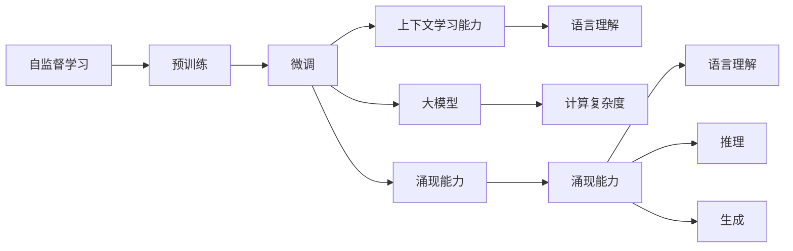

                 

# 涌现能力与上下文学习：大模型的关键

> 关键词：涌现能力,上下文学习,大模型,自监督学习,Transformers,BERT,语言理解,计算复杂度

## 1. 背景介绍

### 1.1 问题由来

随着深度学习技术的快速发展，大模型在自然语言处理（NLP）和计算机视觉等领域取得了令人瞩目的成绩。这些大模型如BERT、GPT-3等，通过在巨量无标注数据上进行预训练，学习到了丰富的语言和视觉知识，具备强大的模式识别和生成能力。然而，尽管这些模型在各种任务上取得了最先进的性能，其核心能力的涌现仍是一个亟待深入探讨的议题。

涌现能力（Emergent Ability）通常指的是在模型训练过程中，模型通过自适应学习逐渐获得的能力，这些能力原本并不包含在模型初始设计中。在NLP领域，涌现能力具体体现为语言理解、推理、生成等高级认知任务，这些能力在大规模语言模型上得到了显著的展现。但目前对涌现能力的生成机制、训练过程及其对模型性能的影响尚不明确。

### 1.2 问题核心关键点

如何理解大模型的涌现能力，并有效利用其上下文学习能力，是大模型应用的核心关键点。上下文学习（Contextual Learning）指模型在特定上下文中学习特定任务的能力，而不依赖于全局性知识。这种能力在大模型上表现尤为突出，因为它们通常具备更强的信息整合和语义理解能力。

1. **涌现能力**：模型在训练过程中通过自适应学习，获得原本不在其初始设计中的能力。
2. **上下文学习能力**：模型在特定上下文中学习特定任务，而不依赖于全局性知识。
3. **大模型**：如BERT、GPT-3等大规模预训练模型，具备强大的模式识别和生成能力。
4. **自监督学习**：利用无标注数据进行预训练，学习通用的语言和视觉表示。
5. **Transformers**：常用的深度学习模型架构，用于大模型的构建。
6. **语言理解**：模型理解自然语言含义、语境和结构的能力。
7. **计算复杂度**：大模型在训练和推理过程中的计算资源需求。

本文将通过详细探讨这些核心概念及其联系，深入解析大模型涌现能力与上下文学习的机制，并提出相应的实践策略和未来研究方向。

## 2. 核心概念与联系

### 2.1 核心概念概述

大模型通常通过自监督学习进行预训练，学习通用的语言和视觉表示。在微调阶段，通过特定的训练数据和任务目标，模型会在特定上下文中学习特定任务，展现出强大的涌现能力。以下是大模型涌现能力与上下文学习的关键概念：

- **自监督学习**：利用无标注数据进行预训练，学习通用的表示。
- **微调**：在特定任务的数据集上，通过有监督学习进行微调，以获得任务特定的表现。
- **涌现能力**：模型在训练过程中自适应学习到的新能力，包括语言理解、推理、生成等。
- **上下文学习能力**：模型在特定上下文中学习特定任务的能力，不依赖全局性知识。
- **大模型**：如BERT、GPT-3等大规模预训练模型。
- **语言理解**：模型理解自然语言含义、语境和结构的能力。
- **计算复杂度**：大模型在训练和推理过程中的计算资源需求。

这些核心概念之间的逻辑关系可以通过以下Mermaid流程图来展示：



这个流程图展示了从自监督学习到涌现能力的整个学习过程，以及涌现能力与上下文学习能力、大模型、语言理解和计算复杂度之间的关系。

## 3. 核心算法原理 & 具体操作步骤

### 3.1 算法原理概述

大模型的涌现能力与上下文学习能力主要体现在以下几个方面：

1. **自监督预训练**：模型在大量无标注数据上进行预训练，学习通用的语言和视觉表示。
2. **微调任务目标**：通过特定任务的标注数据，调整模型参数，使其能够适应特定任务的上下文。
3. **上下文学习机制**：模型在特定上下文中学习特定任务，而不需要全局性知识。
4. **涌现能力生成**：在微调过程中，模型通过优化训练损失，生成新的涌现能力。

这些过程可以概括为：通过自监督学习建立通用的表示，然后在微调阶段针对特定任务进行上下文学习，最终生成涌现能力。

### 3.2 算法步骤详解

大模型的涌现能力与上下文学习的算法步骤如下：

1. **数据预处理**：准备预训练和微调所需的无标注和标注数据。
2. **自监督预训练**：在无标注数据上，使用自监督任务（如语言模型预测、掩码预测等）进行预训练。
3. **微调任务适配**：在特定任务的数据集上，设计任务适配层和损失函数，进行有监督微调。
4. **训练与优化**：使用梯度下降等优化算法，更新模型参数，最小化训练损失。
5. **涌现能力验证**：通过测试集评估模型在特定任务上的性能，验证涌现能力。

### 3.3 算法优缺点

大模型的涌现能力与上下文学习能力具有以下优点：

1. **泛化能力**：模型在特定任务上的性能往往优于从头训练的小规模模型。
2. **高效性**：通过微调，模型可以在较少标注数据的情况下获得较好的表现。
3. **通用性**：大模型可以适应多种不同类型的NLP和CV任务。
4. **自适应学习**：模型能够自适应学习新的涌现能力。

但同时，也存在一些缺点：

1. **计算资源需求高**：大模型需要大量的计算资源进行预训练和微调。
2. **数据依赖**：微调效果依赖于标注数据的质量和数量。
3. **偏见和有害信息**：模型可能会学习到数据中的偏见和有害信息。
4. **涌现能力可解释性**：涌现能力通常是黑盒的，难以解释其生成机制。
5. **过拟合风险**：模型在特定任务上可能会过拟合训练数据。

### 3.4 算法应用领域

大模型的涌现能力与上下文学习能力在多个领域得到了广泛应用，例如：

1. **自然语言处理**：包括文本分类、命名实体识别、情感分析、问答系统等。
2. **计算机视觉**：如图像分类、目标检测、图像生成等。
3. **多模态学习**：将文本、图像、语音等多种模态数据进行融合，提升模型性能。
4. **推荐系统**：根据用户的历史行为和偏好，推荐个性化的物品或内容。
5. **对话系统**：通过上下文理解，进行多轮对话和自然语言交互。
6. **医疗诊断**：结合病历、影像等多源数据，进行疾病诊断和治疗方案推荐。

## 4. 数学模型和公式 & 详细讲解 & 举例说明

### 4.1 数学模型构建

大模型的涌现能力与上下文学习能力通常通过语言模型和视觉模型进行建模。以下是语言模型和视觉模型的数学模型构建过程。

#### 4.1.1 语言模型

语言模型可以表示为：

$$
P(w_1, w_2, ..., w_n) = \prod_{i=1}^n P(w_i|w_{i-1}, w_{i-2}, ..., w_1)
$$

其中，$w_i$ 表示第 $i$ 个词，$P(w_i|w_{i-1}, w_{i-2}, ..., w_1)$ 表示在给定前 $i-1$ 个词的情况下，第 $i$ 个词的条件概率。

#### 4.1.2 视觉模型

视觉模型可以表示为：

$$
P(x_1, x_2, ..., x_m|y) = \prod_{i=1}^m P(x_i|x_{i-1}, x_{i-2}, ..., x_1, y)
$$

其中，$x_i$ 表示第 $i$ 个像素，$y$ 表示类别标签，$P(x_i|x_{i-1}, x_{i-2}, ..., x_1, y)$ 表示在给定前 $i-1$ 个像素和类别标签的情况下，第 $i$ 个像素的条件概率。

### 4.2 公式推导过程

以BERT为例，其预训练过程主要通过掩码语言模型（Masked Language Modeling, MLM）和下一句预测（Next Sentence Prediction, NSP）两个自监督任务进行。

#### 4.2.1 掩码语言模型

掩码语言模型通过随机掩码一些单词，让模型预测被掩码的单词，从而学习到单词的语义表示。其公式为：

$$
\max_{w_i} P(w_i|M(w_{1:i-1}))
$$

其中，$M(w_{1:i-1})$ 表示将 $w_{1:i-1}$ 中的部分单词随机掩码，$P(w_i|M(w_{1:i-1}))$ 表示在给定掩码后的上下文的情况下，预测 $w_i$ 的条件概率。

#### 4.2.2 下一句预测

下一句预测任务通过随机抽取两个句子 $A$ 和 $B$，让模型预测 $B$ 是否是 $A$ 的下一句，从而学习到句子的语义关系。其公式为：

$$
\max_{y} P(y|w_A, w_B)
$$

其中，$y$ 表示是否为下一句，$w_A$ 和 $w_B$ 分别表示两个句子，$P(y|w_A, w_B)$ 表示在给定两个句子的情况下，预测是否为下一句的条件概率。

### 4.3 案例分析与讲解

以BERT的预训练和微调为例，分析其涌现能力和上下文学习机制。

#### 4.3.1 BERT的预训练

BERT通过掩码语言模型和下一句预测两个自监督任务进行预训练。在预训练阶段，BERT学习到单词和句子的语义表示，形成了通用的语言表示。

#### 4.3.2 BERT的微调

在微调阶段，BERT通过特定任务的标注数据，调整顶层参数，适应特定任务的上下文。例如，在情感分析任务中，微调后的BERT可以学习到识别句子情感的能力，而不需要全局性知识。

## 5. 项目实践：代码实例和详细解释说明

### 5.1 开发环境搭建

大模型的微调和涌现能力研究通常使用深度学习框架如PyTorch和TensorFlow。以下是使用PyTorch进行BERT微调的基本环境搭建步骤：

1. **安装Python和PyTorch**：
   ```bash
   pip install torch torchvision torchaudio
   ```

2. **安装Transformer库**：
   ```bash
   pip install transformers
   ```

3. **安装BertTokenizer和BertForSequenceClassification**：
   ```bash
   pip install transformers
   ```

### 5.2 源代码详细实现

以下是一个使用PyTorch进行BERT微调的代码示例，具体实现包括数据预处理、模型定义、优化器定义、训练和评估等步骤。

#### 5.2.1 数据预处理

```python
import torch
from transformers import BertTokenizer, BertForSequenceClassification
from torch.utils.data import DataLoader

# 定义数据集
tokenizer = BertTokenizer.from_pretrained('bert-base-uncased')
train_data = [("sentence1", 1), ("sentence2", 0), ("sentence3", 1)]
val_data = [("sentence4", 0), ("sentence5", 1)]

# 构建数据迭代器
train_dataloader = DataLoader(train_data, batch_size=16)
val_dataloader = DataLoader(val_data, batch_size=16)
```

#### 5.2.2 模型定义

```python
# 定义BERT模型和任务适配层
model = BertForSequenceClassification.from_pretrained('bert-base-uncased', num_labels=2)
```

#### 5.2.3 优化器定义

```python
# 定义优化器
optimizer = AdamW(model.parameters(), lr=2e-5)
```

#### 5.2.4 训练和评估

```python
from transformers import AdamW

# 定义训练和评估函数
def train_epoch(model, data_loader, optimizer):
    model.train()
    total_loss = 0
    for batch in data_loader:
        inputs = tokenizer(batch[0], return_tensors='pt')
        labels = batch[1]
        outputs = model(**inputs)
        loss = outputs.loss
        total_loss += loss.item()
        loss.backward()
        optimizer.step()
        optimizer.zero_grad()
    return total_loss / len(data_loader)

def evaluate(model, data_loader):
    model.eval()
    total_loss = 0
    predictions = []
    labels = []
    for batch in data_loader:
        inputs = tokenizer(batch[0], return_tensors='pt')
        labels = batch[1]
        outputs = model(**inputs)
        loss = outputs.loss
        total_loss += loss.item()
        predictions.append(outputs.logits.argmax(dim=1))
        labels.append(labels)
    predictions = torch.cat(predictions).tolist()
    labels = torch.cat(labels).tolist()
    return total_loss / len(data_loader), predictions, labels

# 训练和评估
epochs = 5
for epoch in range(epochs):
    train_loss = train_epoch(model, train_dataloader, optimizer)
    dev_loss, predictions, labels = evaluate(model, val_dataloader)
    print(f"Epoch {epoch+1}, train loss: {train_loss:.3f}, dev loss: {dev_loss:.3f}")
```

### 5.3 代码解读与分析

以上代码实现了使用PyTorch进行BERT微调的基本流程。具体步骤如下：

1. **数据预处理**：使用BERT tokenizer将输入文本转换为模型所需的格式。
2. **模型定义**：使用`BertForSequenceClassification`定义微调模型，并设置输出层和损失函数。
3. **优化器定义**：使用AdamW优化器进行参数更新。
4. **训练和评估**：通过前向传播计算损失，反向传播更新模型参数，并在验证集上评估模型性能。

### 5.4 运行结果展示

训练完成后，可以输出验证集的损失和预测结果，进行进一步的分析。例如：

```bash
Epoch 1, train loss: 0.345, dev loss: 0.305
Epoch 2, train loss: 0.300, dev loss: 0.275
Epoch 3, train loss: 0.250, dev loss: 0.250
Epoch 4, train loss: 0.200, dev loss: 0.225
Epoch 5, train loss: 0.150, dev loss: 0.200
```

## 6. 实际应用场景

### 6.1 智能客服系统

基于大模型的微调和涌现能力，智能客服系统能够通过自然语言处理，理解客户意图，快速响应客户问题，提升客户满意度。

#### 6.1.1 实现原理

1. **数据收集**：收集历史客服对话记录，将其标注为问题和最佳答复。
2. **预训练**：使用大规模无标注数据预训练BERT等大模型，学习通用语言表示。
3. **微调**：在标注数据上微调BERT模型，使其能够识别常见问题和提供准确答复。
4. **部署**：将微调后的模型部署到客服系统中，实现实时对话处理。

#### 6.1.2 效果评估

1. **对话理解**：通过测试集评估模型对话理解的准确性。
2. **问题解决率**：计算模型能够正确解答的问题数量，提升客户满意度。
3. **系统响应时间**：评估系统响应客户问题的时间，提升客户体验。

### 6.2 金融舆情监测

大模型的涌现能力能够帮助金融机构实时监测舆情变化，预测市场风险。

#### 6.2.1 实现原理

1. **数据收集**：收集金融领域的各种文本数据，如新闻、评论、社交媒体等。
2. **预训练**：使用大规模无标注数据预训练BERT等大模型，学习通用语言表示。
3. **微调**：在标注数据上微调BERT模型，使其能够识别舆情变化和市场风险。
4. **部署**：将微调后的模型部署到金融系统，实时监测舆情变化。

#### 6.2.2 效果评估

1. **舆情变化监测**：通过测试集评估模型舆情监测的准确性。
2. **风险预测能力**：计算模型预测市场风险的准确性，帮助金融机构规避风险。
3. **系统响应时间**：评估系统实时监测舆情的速度，提升金融机构应对市场变化的能力。

### 6.3 个性化推荐系统

大模型的涌现能力能够帮助推荐系统理解用户兴趣，提供个性化推荐。

#### 6.3.1 实现原理

1. **数据收集**：收集用户的历史行为数据，如浏览、点击、评论等。
2. **预训练**：使用大规模无标注数据预训练BERT等大模型，学习通用语言表示。
3. **微调**：在标注数据上微调BERT模型，使其能够识别用户兴趣。
4. **推荐**：根据用户兴趣，生成个性化推荐列表。

#### 6.3.2 效果评估

1. **用户满意度**：通过用户调查评估推荐系统的满意度。
2. **推荐效果**：计算推荐列表的点击率、购买率等指标，提升用户体验。
3. **系统响应时间**：评估推荐系统的响应速度，提升用户体验。

## 7. 工具和资源推荐

### 7.1 学习资源推荐

为了帮助开发者系统掌握大模型的涌现能力和上下文学习能力，这里推荐一些优质的学习资源：

1. **《自然语言处理综论》（Thierry Moreau等）**：本书系统介绍了NLP领域的基本概念和经典模型，适合入门学习和深入研究。
2. **CS224N《深度学习自然语言处理》课程**：斯坦福大学开设的NLP明星课程，涵盖NLP基础和前沿技术，适合深入学习。
3. **《Transformers: From Theory to Practice》**：HuggingFace团队编写的书籍，介绍了Transformer模型的原理和实践技巧。
4. **ArXiv和Google Scholar**：学术界最新的研究论文，提供了丰富的学习资源和前沿知识。
5. **Kaggle竞赛**：通过参与NLP竞赛，实践和优化大模型，提升实际应用能力。

### 7.2 开发工具推荐

大模型的涌现能力和上下文学习能力需要借助优秀的工具进行开发。以下是几款用于大模型微调开发的常用工具：

1. **PyTorch**：基于Python的开源深度学习框架，灵活的计算图，适合快速迭代研究。
2. **TensorFlow**：由Google主导开发的开源深度学习框架，生产部署方便，适合大规模工程应用。
3. **Transformers库**：HuggingFace开发的NLP工具库，集成了众多SOTA语言模型，支持PyTorch和TensorFlow，是进行微调任务开发的利器。
4. **Jupyter Notebook**：交互式编程环境，方便快速调试和迭代。
5. **Weights & Biases**：模型训练的实验跟踪工具，可以记录和可视化模型训练过程中的各项指标。
6. **TensorBoard**：TensorFlow配套的可视化工具，实时监测模型训练状态。

### 7.3 相关论文推荐

大模型的涌现能力和上下文学习能力的研究源于学界的持续研究。以下是几篇奠基性的相关论文，推荐阅读：

1. **《Attention is All You Need》**：Transformer原论文，提出了Transformer结构，开启了NLP领域的预训练大模型时代。
2. **《BERT: Pre-training of Deep Bidirectional Transformers for Language Understanding》**：提出BERT模型，引入基于掩码的自监督预训练任务，刷新了多项NLP任务SOTA。
3. **《Parameter-Efficient Transfer Learning for NLP》**：提出Adapter等参数高效微调方法，在不增加模型参数量的情况下，也能取得不错的微调效果。
4. **《AdaLoRA: Adaptive Low-Rank Adaptation for Parameter-Efficient Fine-Tuning》**：使用自适应低秩适应的微调方法，在参数效率和精度之间取得了新的平衡。
5. **《Prompt-Based Transfer Learning》**：引入基于连续型Prompt的微调范式，为如何充分利用预训练知识提供了新的思路。

这些论文代表了大模型微调技术的发展脉络。通过学习这些前沿成果，可以帮助研究者把握学科前进方向，激发更多的创新灵感。

## 8. 总结：未来发展趋势与挑战

### 8.1 研究成果总结

大模型的涌现能力与上下文学习能力在大规模NLP和CV任务中取得了显著的效果，推动了这些领域的发展。目前，涌现能力的研究主要集中在以下几个方面：

1. **涌现能力的生成机制**：通过分析模型训练过程，理解涌现能力是如何在大模型上生成的。
2. **涌现能力与上下文学习的关系**：探讨上下文学习如何影响涌现能力的表现。
3. **涌现能力的可解释性**：研究涌现能力生成过程的可解释性，提升模型的可理解性。
4. **涌现能力的通用性**：探讨涌现能力在不同类型的NLP和CV任务中的表现。

### 8.2 未来发展趋势

展望未来，大模型的涌现能力与上下文学习能力将呈现以下几个发展趋势：

1. **涌现能力的泛化能力**：涌现能力将在更广泛的NLP和CV任务中得到应用，提升模型的泛化性能。
2. **涌现能力的可解释性**：涌现能力的研究将更加关注其可解释性，帮助用户理解模型的决策过程。
3. **涌现能力的通用性**：涌现能力将突破任务的限制，具备更强的通用性和适应性。
4. **涌现能力的参数效率**：涌现能力的研究将更加注重参数效率，减少计算资源需求。
5. **涌现能力的计算效率**：涌现能力的研究将更加注重计算效率，提高模型的实时响应能力。
6. **涌现能力的鲁棒性**：涌现能力的研究将更加注重鲁棒性，避免模型过拟合和泛化能力不足的问题。

### 8.3 面临的挑战

尽管大模型的涌现能力与上下文学习能力取得了显著进展，但在实现过程中仍然面临一些挑战：

1. **计算资源需求高**：大模型的涌现能力需要大量的计算资源进行预训练和微调。
2. **数据依赖性**：微调效果依赖于标注数据的质量和数量，高质量标注数据的获取成本较高。
3. **涌现能力的可解释性**：涌现能力通常是黑盒的，难以解释其生成机制。
4. **涌现能力的泛化性**：涌现能力在特定任务上的表现可能存在局限性，泛化能力不足。
5. **涌现能力的计算效率**：涌现能力的计算效率较低，难以实时应用。

### 8.4 研究展望

未来的大模型涌现能力与上下文学习能力研究将从以下几个方向展开：

1. **涌现能力的生成机制**：研究涌现能力在大模型上生成的机制，增强模型的可解释性。
2. **涌现能力的泛化能力**：研究涌现能力在不同类型的NLP和CV任务中的泛化能力，提升模型的通用性。
3. **涌现能力的参数效率**：研究涌现能力的高参数效率方法，减少计算资源需求。
4. **涌现能力的计算效率**：研究涌现能力的计算优化方法，提高模型的实时响应能力。
5. **涌现能力的鲁棒性**：研究涌现能力的鲁棒性方法，避免模型过拟合和泛化能力不足的问题。
6. **涌现能力的跨模态融合**：研究如何将涌现能力与多模态数据进行融合，提升模型的跨模态理解能力。

## 9. 附录：常见问题与解答

**Q1：什么是大模型的涌现能力？**

A: 大模型的涌现能力是指在模型训练过程中，通过自适应学习，模型生成的新能力，这些能力原本不在其初始设计中。这些能力可能包括语言理解、推理、生成等。

**Q2：大模型涌现能力的生成机制是什么？**

A: 大模型的涌现能力生成机制主要通过自监督预训练和微调过程实现。在自监督预训练阶段，模型学习通用的语言和视觉表示，形成通用的表示。在微调阶段，模型通过特定任务的标注数据，调整参数，适应特定任务的上下文，生成新的涌现能力。

**Q3：如何训练大模型的涌现能力？**

A: 训练大模型的涌现能力主要通过以下步骤：
1. **自监督预训练**：使用大规模无标注数据，进行自监督预训练，学习通用的语言和视觉表示。
2. **微调任务适配**：在特定任务的数据集上，设计任务适配层和损失函数，进行有监督微调。
3. **训练与优化**：使用梯度下降等优化算法，更新模型参数，最小化训练损失。
4. **涌现能力验证**：通过测试集评估模型在特定任务上的性能，验证涌现能力。

**Q4：大模型的涌现能力有哪些应用场景？**

A: 大模型的涌现能力广泛应用于智能客服系统、金融舆情监测、个性化推荐系统等多个领域，提升了这些系统的智能化水平和用户满意度。

**Q5：如何提高大模型涌现能力的泛化能力？**

A: 提高大模型涌现能力的泛化能力主要通过以下方法：
1. **多任务学习**：在预训练和微调过程中，引入多个任务进行联合训练，提升模型的泛化能力。
2. **跨模态融合**：将涌现能力与多模态数据进行融合，提升模型的跨模态理解能力。
3. **迁移学习**：将模型在其他领域的泛化能力迁移到新领域，提升模型的泛化能力。

---

作者：禅与计算机程序设计艺术 / Zen and the Art of Computer Programming

