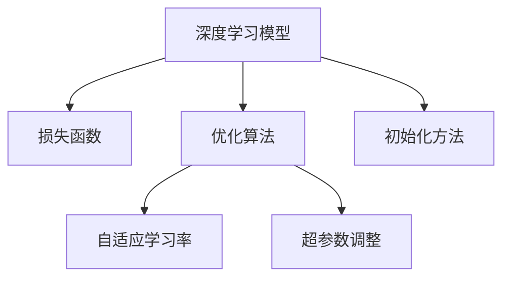

                 

# 深度学习优化技巧：初始化、AdamW优化器等

> 关键词：深度学习优化,初始化技巧,AdamW优化器,SGD优化器,学习率调整,自适应学习率

## 1. 背景介绍

### 1.1 问题由来
深度学习（Deep Learning）在过去的十年中取得了飞速的发展，特别是深度神经网络（DNNs）在图像识别、自然语言处理、语音识别等领域展现出了卓越的性能。然而，随着模型复杂度的增加，训练深度学习模型的过程变得越来越困难。深度学习模型需要大量的计算资源和时间，且易受到初始化方式、优化算法和超参数设置等因素的影响。因此，深度学习的优化技术成为了一个重要的研究方向。

### 1.2 问题核心关键点
深度学习的优化技术主要包括初始化、优化算法和超参数调整等方面。其中，初始化方法决定了模型参数的初始分布，影响模型的收敛速度和稳定性和。优化算法则用于在训练过程中最小化损失函数，寻找最优解。超参数调整则涉及到学习率、批大小、迭代轮数等设置，这些参数对模型性能有重要影响。

本文档将详细介绍深度学习优化技巧中的初始化、AdamW优化器等核心内容，并通过实际案例展示其应用，以期对深度学习模型的优化提供有价值的指导。

### 1.3 问题研究意义
深度学习模型的优化技术是确保模型性能和训练效率的关键。通过深入研究初始化方法和优化算法，可以提升模型的泛化能力、降低过拟合风险，并在短时间内找到全局最优解。同时，超参数调整的合理设置也能显著提升模型的性能和训练效率。

本文档旨在通过系统介绍深度学习优化技巧，帮助开发者更好地理解模型的训练过程，优化模型性能，提升实际应用中的效果。

## 2. 核心概念与联系

### 2.1 核心概念概述

为了更好地理解深度学习优化技巧，本节将介绍几个密切相关的核心概念：

- **深度学习模型**：由多个神经网络层组成的模型，通常包括卷积层、池化层、全连接层等，能够处理复杂的非线性映射问题。
- **损失函数**：用于衡量模型预测输出与真实标签之间的差异，常见的损失函数包括交叉熵损失、均方误差损失等。
- **优化算法**：通过迭代更新模型参数，最小化损失函数，达到最优解。常见的优化算法包括SGD、Adam、AdamW等。
- **超参数**：需要手动设置的模型参数，如学习率、批大小、迭代轮数等，直接影响模型的性能。
- **初始化方法**：用于初始化模型参数的方法，如Xavier初始化、He初始化等。
- **自适应学习率**：根据模型状态自动调整学习率的方法，如AdamW、Adagrad等。

这些概念之间的逻辑关系可以通过以下Mermaid流程图来展示：



这个流程图展示了一系列核心概念及其之间的关系：

1. 深度学习模型通过损失函数衡量预测输出与真实标签的差异。
2. 优化算法通过迭代更新模型参数，最小化损失函数。
3. 自适应学习率根据模型状态自动调整学习率，提高优化效果。
4. 超参数调整直接影响模型的性能。
5. 初始化方法用于初始化模型参数，影响模型收敛速度和稳定性。

## 3. 核心算法原理 & 具体操作步骤
### 3.1 算法原理概述

深度学习模型的优化过程包括模型训练、验证和测试等步骤。模型的训练过程可以分为以下几个步骤：

1. **数据预处理**：将原始数据转化为模型可以接受的格式，如将图像数据转化为像素值、将文本数据转化为词向量等。
2. **模型前向传播**：将输入数据输入模型，通过多层神经网络计算得到预测输出。
3. **损失函数计算**：将模型预测输出与真实标签计算损失函数。
4. **模型反向传播**：根据损失函数计算梯度，反向传播更新模型参数。
5. **超参数调整**：根据验证集上的性能调整学习率、批大小等超参数。
6. **模型测试**：在测试集上评估模型性能。

深度学习的优化技巧主要集中在以上步骤中，特别是模型初始化和优化算法的优化。

### 3.2 算法步骤详解

#### 3.2.1 模型初始化

模型初始化是深度学习优化过程的第一步，决定了模型参数的初始分布，影响模型的收敛速度和稳定性。常见的初始化方法包括Xavier初始化和He初始化等。

- **Xavier初始化**：在神经网络中，每个神经元的输入和输出连接权重需要满足一定条件，以避免梯度消失或爆炸。Xavier初始化通过计算每个神经元的输入和输出的方差，使得权重的初始化满足这一条件。具体公式为：

$$
w \sim \mathcal{N}(0, \frac{2}{n_{in} + n_{out}})
$$

其中，$n_{in}$ 和 $n_{out}$ 分别为输入和输出的神经元数量。

- **He初始化**：与Xavier初始化类似，但针对激活函数为ReLU的情况，使用了不同的方差计算方式。具体公式为：

$$
w \sim \mathcal{N}(0, \sqrt{\frac{2}{n_{in}}})
$$

#### 3.2.2 优化算法

优化算法用于在训练过程中最小化损失函数，达到最优解。常见的优化算法包括SGD、Adam和AdamW等。

- **SGD**：随机梯度下降算法，每次迭代只使用一个样本来计算梯度，更新模型参数。其公式为：

$$
\theta_{t+1} = \theta_t - \eta \nabla_{\theta} J(\theta_t)
$$

其中，$\eta$ 为学习率，$\nabla_{\theta} J(\theta_t)$ 为损失函数对模型参数的梯度。

- **Adam**：自适应矩估计算法，根据梯度的均值和方差动态调整学习率。其公式为：

$$
m_t = \beta_1 m_{t-1} + (1-\beta_1) \nabla_{\theta} J(\theta_t)
$$

$$
v_t = \beta_2 v_{t-1} + (1-\beta_2) (\nabla_{\theta} J(\theta_t))^2
$$

$$
\hat{m}_t = \frac{m_t}{1-\beta_1^t}, \hat{v}_t = \frac{v_t}{1-\beta_2^t}
$$

$$
\theta_{t+1} = \theta_t - \frac{\eta}{\sqrt{\hat{v}_t} + \epsilon} \hat{m}_t
$$

其中，$\beta_1$ 和 $\beta_2$ 分别为梯度均值和方差的衰减率，$\epsilon$ 为避免除零的操作。

- **AdamW**：AdamW算法是Adam算法的变体，引入了一个权重衰减项，使得梯度更新更加稳定。其公式为：

$$
m_t = \beta_1 m_{t-1} + (1-\beta_1) \nabla_{\theta} J(\theta_t)
$$

$$
v_t = \beta_2 v_{t-1} + (1-\beta_2) (\nabla_{\theta} J(\theta_t))^2
$$

$$
\hat{m}_t = \frac{m_t}{1-\beta_1^t}, \hat{v}_t = \frac{v_t}{1-\beta_2^t}
$$

$$
\theta_{t+1} = \theta_t - \frac{\eta}{\sqrt{\hat{v}_t} + \epsilon} \hat{m}_t - \eta \frac{\theta_t}{\sqrt{\hat{v}_t} + \epsilon}
$$

其中，$\eta$ 为学习率，$\epsilon$ 为避免除零的操作。

#### 3.2.3 学习率调整

学习率调整是深度学习优化过程中另一个关键环节，其大小直接影响模型收敛速度和稳定性。常见的学习率调整策略包括学习率衰减、自适应学习率等。

- **学习率衰减**：随着训练轮数的增加，逐步减小学习率，防止模型过拟合。常见的学习率衰减策略包括周期性衰减、指数衰减等。
- **自适应学习率**：根据模型状态动态调整学习率，如AdamW、Adagrad等。这些算法能够根据梯度变化调整学习率，提高优化效果。

### 3.3 算法优缺点

#### 3.3.1 初始化方法

- **优点**：
  - Xavier初始化能够使得权重的初始化满足梯度消失或爆炸的条件。
  - He初始化在激活函数为ReLU的情况下，能够更好地利用梯度的方差。

- **缺点**：
  - Xavier初始化不适用于某些激活函数，如Tanh和Sigmoid。
  - He初始化在激活函数为ReLU的情况下，可能会导致梯度分布不均。

#### 3.3.2 优化算法

- **优点**：
  - SGD算法简单易用，不需要额外的存储空间。
  - Adam算法和AdamW算法能够自适应地调整学习率，提高优化效果。

- **缺点**：
  - SGD算法容易陷入局部最优解。
  - Adam算法和AdamW算法需要额外的存储空间，且参数较多。

### 3.4 算法应用领域

深度学习优化技术广泛应用于各种领域，如计算机视觉、自然语言处理、语音识别等。以下是一些典型的应用场景：

- **计算机视觉**：图像分类、目标检测、图像生成等。通过深度学习模型，可以将图像转化为高维特征向量，用于分类、检测和生成。
- **自然语言处理**：文本分类、机器翻译、情感分析等。通过深度学习模型，可以将文本转化为词向量，用于分类、翻译和情感分析。
- **语音识别**：语音识别、语音合成等。通过深度学习模型，可以将语音信号转化为文本或声音，用于识别和合成。

## 4. 数学模型和公式 & 详细讲解  
### 4.1 数学模型构建

本节将使用数学语言对深度学习优化技巧进行更加严格的刻画。

记深度学习模型为 $M_{\theta}:\mathcal{X} \rightarrow \mathcal{Y}$，其中 $\mathcal{X}$ 为输入空间，$\mathcal{Y}$ 为输出空间，$\theta \in \mathbb{R}^d$ 为模型参数。假设训练集为 $D=\{(x_i,y_i)\}_{i=1}^N, x_i \in \mathcal{X}, y_i \in \mathcal{Y}$。

定义模型 $M_{\theta}$ 在数据样本 $(x,y)$ 上的损失函数为 $\ell(M_{\theta}(x),y)$，则在数据集 $D$ 上的经验风险为：

$$
\mathcal{L}(\theta) = \frac{1}{N} \sum_{i=1}^N \ell(M_{\theta}(x_i),y_i)
$$

深度学习的优化目标是最小化经验风险，即找到最优参数：

$$
\theta^* = \mathop{\arg\min}_{\theta} \mathcal{L}(\theta)
$$

在实践中，我们通常使用基于梯度的优化算法（如SGD、Adam等）来近似求解上述最优化问题。设 $\eta$ 为学习率，$\lambda$ 为正则化系数，则参数的更新公式为：

$$
\theta \leftarrow \theta - \eta \nabla_{\theta}\mathcal{L}(\theta) - \eta\lambda\theta
$$

其中 $\nabla_{\theta}\mathcal{L}(\theta)$ 为损失函数对参数 $\theta$ 的梯度，可通过反向传播算法高效计算。

### 4.2 公式推导过程

以下我们以图像分类任务为例，推导交叉熵损失函数及其梯度的计算公式。

假设模型 $M_{\theta}$ 在输入 $x$ 上的输出为 $\hat{y}=M_{\theta}(x) \in [0,1]$，表示样本属于每个类别的概率。真实标签 $y \in \{0,1\}^C$，其中 $C$ 为类别数。则交叉熵损失函数定义为：

$$
\ell(M_{\theta}(x),y) = -\sum_{i=1}^C y_i \log \hat{y}_i
$$

将其代入经验风险公式，得：

$$
\mathcal{L}(\theta) = -\frac{1}{N}\sum_{i=1}^N \sum_{j=1}^C y_{ij} \log \hat{y}_{ij}
$$

根据链式法则，损失函数对参数 $\theta_k$ 的梯度为：

$$
\frac{\partial \mathcal{L}(\theta)}{\partial \theta_k} = -\frac{1}{N}\sum_{i=1}^N \sum_{j=1}^C \frac{y_{ij}}{\hat{y}_{ij}} \frac{\partial \hat{y}_{ij}}{\partial \theta_k}
$$

其中 $\frac{\partial \hat{y}_{ij}}{\partial \theta_k}$ 可进一步递归展开，利用自动微分技术完成计算。

在得到损失函数的梯度后，即可带入参数更新公式，完成模型的迭代优化。重复上述过程直至收敛，最终得到适应数据集 $D$ 的最优模型参数 $\theta^*$。

## 5. 项目实践：代码实例和详细解释说明
### 5.1 开发环境搭建

在进行深度学习优化技巧实践前，我们需要准备好开发环境。以下是使用Python进行PyTorch开发的环境配置流程：

1. 安装Anaconda：从官网下载并安装Anaconda，用于创建独立的Python环境。

2. 创建并激活虚拟环境：
```bash
conda create -n pytorch-env python=3.8 
conda activate pytorch-env
```

3. 安装PyTorch：根据CUDA版本，从官网获取对应的安装命令。例如：
```bash
conda install pytorch torchvision torchaudio cudatoolkit=11.1 -c pytorch -c conda-forge
```

4. 安装Tensorboard：
```bash
pip install tensorboard
```

5. 安装numpy和scikit-learn等工具包：
```bash
pip install numpy scipy scikit-learn matplotlib tqdm jupyter notebook ipython
```

完成上述步骤后，即可在`pytorch-env`环境中开始优化技巧实践。

### 5.2 源代码详细实现

下面我们以图像分类任务为例，给出使用PyTorch对LeNet-5模型进行AdamW优化的PyTorch代码实现。

首先，定义LeNet-5模型的代码：

```python
import torch.nn as nn
import torch.optim as optim

class LeNet5(nn.Module):
    def __init__(self):
        super(LeNet5, self).__init__()
        self.conv1 = nn.Conv2d(1, 6, 5)
        self.pool = nn.MaxPool2d(2, 2)
        self.conv2 = nn.Conv2d(6, 16, 5)
        self.fc1 = nn.Linear(16*5*5, 120)
        self.fc2 = nn.Linear(120, 84)
        self.fc3 = nn.Linear(84, 10)

    def forward(self, x):
        x = self.pool(F.relu(self.conv1(x)))
        x = self.pool(F.relu(self.conv2(x)))
        x = x.view(-1, 16*5*5)
        x = F.relu(self.fc1(x))
        x = F.relu(self.fc2(x))
        x = self.fc3(x)
        return x
```

然后，定义训练和评估函数：

```python
import torchvision.transforms as transforms
from torch.utils.data import DataLoader
from torchvision.datasets import MNIST

# 数据预处理
transform = transforms.Compose([
    transforms.ToTensor(),
    transforms.Normalize((0.5,), (0.5,))
])

# 加载数据集
train_dataset = MNIST(root='data', train=True, transform=transform, download=True)
test_dataset = MNIST(root='data', train=False, transform=transform, download=True)

# 定义超参数
batch_size = 64
learning_rate = 0.001
weight_decay = 0.0005
num_epochs = 10

# 定义模型
model = LeNet5()

# 定义优化器
optimizer = optim.AdamW(model.parameters(), lr=learning_rate, weight_decay=weight_decay)

# 定义训练函数
def train(model, device, train_loader, optimizer, epoch):
    model.train()
    for batch_idx, (data, target) in enumerate(train_loader):
        data, target = data.to(device), target.to(device)
        optimizer.zero_grad()
        output = model(data)
        loss = nn.CrossEntropyLoss()(output, target)
        loss.backward()
        optimizer.step()
        if batch_idx % 100 == 0:
            print('Train Epoch: {} [{}/{} ({:.0f}%)]\tLoss: {:.6f}'.format(
                epoch, batch_idx * len(data), len(train_loader.dataset),
                100. * batch_idx / len(train_loader), loss.item()))

# 定义评估函数
def evaluate(model, device, test_loader):
    model.eval()
    test_loss = 0
    correct = 0
    with torch.no_grad():
        for data, target in test_loader:
            data, target = data.to(device), target.to(device)
            output = model(data)
            test_loss += nn.CrossEntropyLoss()(output, target).item()
            pred = output.argmax(dim=1, keepdim=True)
            correct += pred.eq(target.view_as(pred)).sum().item()

    test_loss /= len(test_loader.dataset)
    print('\nTest set: Average loss: {:.4f}, Accuracy: {}/{} ({:.0f}%)\n'.format(
        test_loss, correct, len(test_loader.dataset),
        100. * correct / len(test_loader.dataset)))

# 定义训练流程
device = torch.device("cuda" if torch.cuda.is_available() else "cpu")

for epoch in range(num_epochs):
    train(model, device, train_loader, optimizer, epoch)
    evaluate(model, device, test_loader)
```

最后，运行训练和评估过程：

```bash
python train.py
```

这将输出训练和评估过程中的各项指标，帮助用户了解模型的性能。

### 5.3 代码解读与分析

让我们再详细解读一下关键代码的实现细节：

**LeNet5模型的定义**：
- `__init__`方法：定义卷积层、池化层、全连接层等组件，并通过 `super()` 调用父类 `nn.Module` 的构造函数。
- `forward`方法：定义模型前向传播的过程，将输入数据通过多层神经网络进行计算，最终输出预测结果。

**训练函数**：
- `train`函数：对数据集进行批次化加载，在每个批次上前向传播计算损失，反向传播更新模型参数。每100个batch输出一次训练进度。
- `evaluate`函数：在测试集上评估模型性能，输出测试集的损失和准确率。

**训练流程**：
- 定义超参数，如批大小、学习率、正则化系数等。
- 定义模型，包括卷积层、全连接层等组件。
- 定义优化器，选择AdamW算法。
- 调用训练函数和评估函数，在训练集和测试集上进行训练和评估。

可以看到，PyTorch配合Tensorboard使得深度学习优化技巧的代码实现变得简洁高效。开发者可以将更多精力放在模型改进、超参数调优等高层逻辑上，而不必过多关注底层的实现细节。

当然，工业级的系统实现还需考虑更多因素，如模型的保存和部署、超参数的自动搜索、更灵活的任务适配层等。但核心的优化技巧基本与此类似。

## 6. 实际应用场景
### 6.1 图像分类

图像分类是深度学习中一个经典的应用场景。在图像分类任务中，深度学习模型能够学习图像特征，并根据特征进行分类。常见的图像分类任务包括手写数字识别、物体识别等。

在实际应用中，深度学习模型通常通过以下步骤实现图像分类：

1. **数据预处理**：将原始图像转化为像素值，并进行归一化、数据增强等处理。
2. **模型训练**：将预处理后的图像输入深度学习模型，通过反向传播更新模型参数。
3. **模型评估**：在验证集和测试集上评估模型性能，调整超参数。
4. **模型部署**：将训练好的模型保存，并部署到实际应用中。

通过深度学习优化技巧，图像分类模型能够实现高精度的分类效果。AdamW优化器能够自适应地调整学习率，提高模型的训练效率和性能。

### 6.2 自然语言处理

自然语言处理（NLP）是深度学习中另一个重要的应用领域。在NLP中，深度学习模型能够学习语言特征，并根据语言特征进行分类、生成等任务。常见的NLP任务包括情感分析、机器翻译、文本分类等。

在实际应用中，深度学习模型通常通过以下步骤实现NLP任务：

1. **数据预处理**：将原始文本转化为词向量或子词向量，并进行分词、去除停用词等处理。
2. **模型训练**：将预处理后的文本输入深度学习模型，通过反向传播更新模型参数。
3. **模型评估**：在验证集和测试集上评估模型性能，调整超参数。
4. **模型部署**：将训练好的模型保存，并部署到实际应用中。

通过深度学习优化技巧，NLP模型能够实现高精度的任务效果。AdamW优化器能够自适应地调整学习率，提高模型的训练效率和性能。

### 6.3 语音识别

语音识别是深度学习中一个较新的应用领域。在语音识别任务中，深度学习模型能够学习语音信号特征，并根据特征进行语音识别和生成。常见的语音识别任务包括自动语音识别、语音合成等。

在实际应用中，深度学习模型通常通过以下步骤实现语音识别任务：

1. **数据预处理**：将原始语音信号转化为梅尔频率倒谱系数（MFCC），并进行归一化、数据增强等处理。
2. **模型训练**：将预处理后的语音信号输入深度学习模型，通过反向传播更新模型参数。
3. **模型评估**：在验证集和测试集上评估模型性能，调整超参数。
4. **模型部署**：将训练好的模型保存，并部署到实际应用中。

通过深度学习优化技巧，语音识别模型能够实现高精度的识别效果。AdamW优化器能够自适应地调整学习率，提高模型的训练效率和性能。

## 7. 工具和资源推荐
### 7.1 学习资源推荐

为了帮助开发者系统掌握深度学习优化技巧的理论基础和实践技巧，这里推荐一些优质的学习资源：

1. **《深度学习》课程**：斯坦福大学开设的深度学习课程，涵盖了深度学习的基本概念和经典算法，适合初学者和进阶者学习。
2. **《Deep Learning with PyTorch》书籍**：PyTorch官方文档，详细介绍了PyTorch的使用方法和深度学习优化技巧，是PyTorch开发者的必备资源。
3. **《Neural Networks and Deep Learning》书籍**：Deep Learning专家 Ian Goodfellow 的著作，系统介绍了深度学习的基本概念和优化技巧，适合深度学习研究者学习。
4. **PyTorch官方文档**：PyTorch官方文档，提供了丰富的API接口和示例代码，是开发者进行深度学习优化技巧实践的必备工具。
5. **Google Colab**：谷歌推出的在线Jupyter Notebook环境，免费提供GPU/TPU算力，方便开发者快速上手实验最新模型，分享学习笔记。

通过对这些资源的学习实践，相信你一定能够快速掌握深度学习优化技巧的精髓，并用于解决实际的深度学习问题。

### 7.2 开发工具推荐

高效的开发离不开优秀的工具支持。以下是几款用于深度学习优化技巧开发的常用工具：

1. **PyTorch**：基于Python的开源深度学习框架，灵活动态的计算图，适合快速迭代研究。
2. **TensorFlow**：由Google主导开发的开源深度学习框架，生产部署方便，适合大规模工程应用。
3. **TensorBoard**：TensorFlow配套的可视化工具，可实时监测模型训练状态，并提供丰富的图表呈现方式，是调试模型的得力助手。
4. **Weights & Biases**：模型训练的实验跟踪工具，可以记录和可视化模型训练过程中的各项指标，方便对比和调优。
5. **Jupyter Notebook**：开源的Jupyter Notebook环境，支持Python、R、Matlab等多种编程语言，方便开发者快速迭代实验和分享学习笔记。

合理利用这些工具，可以显著提升深度学习优化技巧的开发效率，加快创新迭代的步伐。

### 7.3 相关论文推荐

深度学习优化技巧的发展源于学界的持续研究。以下是几篇奠基性的相关论文，推荐阅读：

1. **Adaptive Moment Estimation (Adam)**：由Diederik P. Kingma和Jimmy Ba提出，通过梯度的一阶和二阶矩估计自适应调整学习率，提高优化效果。
2. **On the Convergence of Adam and beyond**：由Nadam等提出，通过在Adam算法中加入动量项和自适应学习率，提高优化效果。
3. **Adaptive Moment Estimation with Weight Decay (AdamW)**：由Loshchilov和Hutter提出，通过加入权重衰减项，使Adam算法在训练过程中更好地保持模型参数的稳定性和收敛速度。

这些论文代表了大规模深度学习模型优化的发展脉络。通过学习这些前沿成果，可以帮助研究者把握学科前进方向，激发更多的创新灵感。

## 8. 总结：未来发展趋势与挑战

### 8.1 总结

本文对深度学习优化技巧中的初始化、AdamW优化器等核心内容进行了全面系统的介绍。首先阐述了深度学习优化技巧的研究背景和意义，明确了优化技巧在深度学习模型训练中的重要性。其次，从原理到实践，详细讲解了初始化方法和优化算法的数学原理和关键步骤，给出了深度学习模型优化的完整代码实例。同时，本文还广泛探讨了深度学习优化技巧在图像分类、自然语言处理、语音识别等多个领域的应用前景，展示了深度学习优化技巧的巨大潜力。

通过本文的系统梳理，可以看到，深度学习优化技巧是确保模型性能和训练效率的关键。合理的初始化方法和优化算法，能够提高模型的泛化能力、降低过拟合风险，并在短时间内找到全局最优解。同时，超参数调整的合理设置也能显著提升模型的性能和训练效率。

### 8.2 未来发展趋势

展望未来，深度学习优化技巧将呈现以下几个发展趋势：

1. **自适应学习率**：自适应学习率是未来深度学习优化的一个重要方向。自适应学习率算法能够根据模型状态自动调整学习率，提高优化效果。未来，自适应学习率算法将会得到更加广泛的应用。
2. **参数高效优化**：随着深度学习模型规模的增大，参数高效优化成为未来的一个重要研究方向。参数高效优化方法能够在保持模型性能的同时，减少计算资源和内存的消耗。
3. **多任务学习**：多任务学习是未来深度学习优化的另一个重要方向。多任务学习能够通过共享模型参数，提高模型的泛化能力和资源利用率。
4. **联合优化**：联合优化是未来深度学习优化的一个重要研究方向。联合优化能够通过多个任务之间的联合训练，提高模型的泛化能力和训练效率。
5. **分布式训练**：分布式训练是未来深度学习优化的一个重要方向。分布式训练能够通过多个GPU或TPU并行训练，提高训练效率和模型性能。

这些趋势凸显了深度学习优化技巧的广阔前景。这些方向的探索发展，必将进一步提升深度学习模型的性能和训练效率，为实际应用带来更多的创新和突破。

### 8.3 面临的挑战

尽管深度学习优化技巧已经取得了显著的成果，但在迈向更加智能化、普适化应用的过程中，它仍面临着诸多挑战：

1. **超参数调优**：深度学习模型的超参数调优是一个复杂的过程，需要大量实验和经验积累。如何找到最优的超参数组合，仍是一个待解决的问题。
2. **模型鲁棒性**：深度学习模型面临数据噪声、对抗攻击等挑战，如何提高模型的鲁棒性，保证模型的稳定性和安全性，仍然是一个重要的研究方向。
3. **模型泛化能力**：深度学习模型通常需要大量的标注数据进行训练，如何提高模型的泛化能力，降低对标注数据的依赖，仍是一个重要的研究方向。
4. **模型可解释性**：深度学习模型通常被视为“黑盒”系统，难以解释其内部工作机制和决策逻辑。如何提高模型的可解释性，赋予模型更多的解释性，仍是一个重要的研究方向。

这些挑战凸显了深度学习优化技巧在实际应用中的复杂性。只有在深度学习优化技巧的研究中不断探索和创新，才能推动深度学习技术的发展，为实际应用带来更多的创新和突破。

### 8.4 研究展望

面对深度学习优化技巧所面临的种种挑战，未来的研究需要在以下几个方面寻求新的突破：

1. **自动调参技术**：自动调参技术是未来深度学习优化的重要方向。通过自动调参技术，能够自动找到最优的超参数组合，提高模型的性能和训练效率。
2. **可解释性模型**：可解释性模型是未来深度学习优化的重要方向。通过可解释性模型，能够赋予模型更多的解释性，提高模型的可靠性和可信度。
3. **跨领域优化**：跨领域优化是未来深度学习优化的重要方向。通过跨领域优化，能够通过迁移学习等方法，提高模型的泛化能力和资源利用率。
4. **模型鲁棒性优化**：模型鲁棒性优化是未来深度学习优化的重要方向。通过模型鲁棒性优化，能够提高模型的鲁棒性和安全性，保证模型的稳定性和可靠性。
5. **分布式优化**：分布式优化是未来深度学习优化的重要方向。通过分布式优化，能够通过多个GPU或TPU并行训练，提高训练效率和模型性能。

这些研究方向将引领深度学习优化技巧迈向更高的台阶，为深度学习技术的发展和应用带来更多的创新和突破。

## 9. 附录：常见问题与解答

**Q1：深度学习模型在训练过程中容易出现过拟合，如何解决？**

A: 过拟合是深度学习模型训练过程中常见的问题。可以通过以下方法解决：

1. **数据增强**：通过对原始数据进行旋转、缩放、裁剪等处理，生成更多的训练样本。
2. **正则化**：通过L2正则、Dropout等方法，避免模型过拟合。
3. **早停**：在验证集上监控模型的性能，当性能不再提升时，停止训练。
4. **批大小调整**：适当增加批大小，能够提高模型的泛化能力。

**Q2：如何选择合适的超参数？**

A: 超参数的选择是一个复杂的过程，需要大量实验和经验积累。以下是一些常用的超参数调整策略：

1. **网格搜索**：通过设置超参数的取值范围，进行网格搜索，找到最优的超参数组合。
2. **随机搜索**：通过随机生成超参数的取值，进行多次实验，找到最优的超参数组合。
3. **贝叶斯优化**：通过贝叶斯优化算法，自动调整超参数的取值，提高实验效率。

**Q3：如何理解深度学习模型的初始化方法？**

A: 深度学习模型的初始化方法决定了模型参数的初始分布，影响模型的收敛速度和稳定性。常用的初始化方法包括Xavier初始化和He初始化等。

- **Xavier初始化**：在神经网络中，每个神经元的输入和输出连接权重需要满足一定条件，以避免梯度消失或爆炸。Xavier初始化通过计算每个神经元的输入和输出的方差，使得权重的初始化满足这一条件。
- **He初始化**：与Xavier初始化类似，但针对激活函数为ReLU的情况，使用了不同的方差计算方式。

**Q4：深度学习模型在训练过程中如何处理梯度消失和梯度爆炸问题？**

A: 梯度消失和梯度爆炸是深度学习模型训练过程中常见的问题。可以通过以下方法解决：

1. **梯度裁剪**：通过限制梯度的最大值，避免梯度爆炸。
2. **残差连接**：通过残差连接，使得梯度能够有效传递，避免梯度消失。
3. **激活函数选择**：选择ReLU等激活函数，能够避免梯度消失和梯度爆炸。

**Q5：如何理解深度学习优化算法？**

A: 深度学习优化算法用于在训练过程中最小化损失函数，达到最优解。常见的优化算法包括SGD、Adam、AdamW等。

- **SGD**：随机梯度下降算法，每次迭代只使用一个样本来计算梯度，更新模型参数。
- **Adam**：自适应矩估计算法，根据梯度的均值和方差动态调整学习率，提高优化效果。
- **AdamW**：AdamW算法是Adam算法的变体，引入了一个权重衰减项，使得梯度更新更加稳定。

通过理解这些优化算法的原理和实现细节，能够更好地掌握深度学习优化技巧。

---

作者：禅与计算机程序设计艺术 / Zen and the Art of Computer Programming

