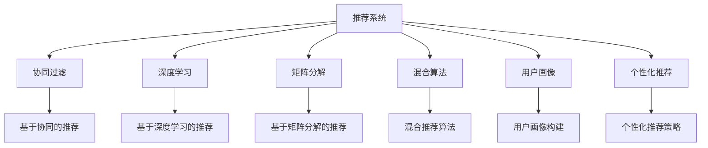

                 

# 深度学习如何革新传统推荐算法

> 关键词：深度学习,推荐系统,协同过滤,神经网络,矩阵分解,混合算法,用户画像,个性化推荐

## 1. 背景介绍

### 1.1 问题由来
推荐系统是现代互联网应用的重要组成部分，通过分析用户的历史行为和偏好，为用户推荐感兴趣的内容，极大地提升了用户体验和平台流量。但传统推荐系统多基于协同过滤和矩阵分解等方法，存在数据稀疏性、隐式反馈利用不足、模型鲁棒性差等问题。

近年来，深度学习技术取得了突破性进展，涌现了大量适用于推荐系统的深度学习模型。深度学习能够处理高维稀疏数据、自动学习用户兴趣，有望大幅提升推荐系统的性能和可解释性。深度学习在推荐系统中的应用，也被认为是“第三次浪潮”，正在深刻改变推荐技术的未来。

### 1.2 问题核心关键点
深度学习在推荐系统中的应用，主要包括以下几个关键点：
- 深度学习模型的学习能力。通过多层神经网络结构，深度学习模型能够自动学习高阶用户兴趣，适应复杂推荐场景。
- 数据高效利用。深度学习模型可以高效处理海量的数据，解决传统算法面临的稀疏性问题。
- 模型鲁棒性。深度学习模型具有良好的泛化能力，能够应对真实数据分布的变化。
- 实时化推荐。深度学习模型可以在线实时学习用户行为，提供个性化的实时推荐。
- 可解释性。深度学习模型可以通过注意力机制等方式，提供推荐过程的解释。

### 1.3 问题研究意义
深度学习在推荐系统中的应用，具有重要意义：

1. 提升推荐效果。深度学习能够自动捕捉用户多方面的兴趣，处理多种类型的用户反馈，从而提升推荐系统的效果。
2. 解决数据稀疏性。深度学习模型具有良好的稀疏数据处理能力，可利用丰富隐式数据提升推荐效果。
3. 实时个性化推荐。深度学习模型具有实时更新能力，能根据用户实时行为提供动态、个性化的推荐。
4. 增强推荐可解释性。深度学习模型可提供推荐过程的可视化解释，增加用户对推荐结果的信任。
5. 推动推荐技术创新。深度学习带来了推荐算法的创新，如基于兴趣的推荐、基于上下文的推荐等，进一步拓展了推荐系统的边界。

## 2. 核心概念与联系

### 2.1 核心概念概述

为更好地理解深度学习在推荐系统中的应用，本节将介绍几个密切相关的核心概念：

- 推荐系统(Recommendation System, RS)：通过算法模型为用户推荐感兴趣内容的系统。常见的推荐策略包括基于内容的推荐、协同过滤、混合推荐等。
- 协同过滤(Collaborative Filtering, CF)：通过分析用户历史行为和相似用户行为，为用户推荐相似的物品。
- 深度学习(Deep Learning, DL)：基于多层神经网络结构，通过大量数据自动学习复杂模型，广泛应用于图像、语音、自然语言处理等领域。
- 矩阵分解(Matrix Factorization, MF)：通过分解用户-物品评分矩阵，将高维稀疏数据转化为低维向量，用于推荐算法。
- 混合算法(Hybrid Algorithm)：结合多种推荐算法，综合各种推荐策略的优点，提高推荐效果。
- 用户画像(User Profiling)：通过分析用户行为数据，构建用户兴趣特征，用于个性化推荐。
- 个性化推荐(Personalized Recommendation)：根据用户历史行为和兴趣特征，为每个用户提供量身定制的推荐内容。

这些核心概念之间的逻辑关系可以通过以下Mermaid流程图来展示：



这个流程图展示了几类推荐系统及其核心技术之间的关系：

1. 推荐系统通过多种推荐算法为用户推荐物品。
2. 协同过滤、深度学习、矩阵分解等算法各具特色，互为补充。
3. 用户画像用于提高推荐系统的个性化程度。
4. 深度学习、混合算法等现代推荐技术，正在不断拓展推荐系统的边界。

## 3. 核心算法原理 & 具体操作步骤
### 3.1 算法原理概述

深度学习在推荐系统中的应用，主要通过神经网络模型处理用户行为数据，自动学习用户兴趣，并提供个性化的推荐。其核心思想是：将用户历史行为和物品属性数据输入神经网络，通过多层计算，学习用户对物品的评分分布，从而推荐相似物品。

形式化地，假设用户对物品的评分向量为 $x \in \mathbb{R}^m$，物品的属性向量为 $y \in \mathbb{R}^n$。深度学习模型的目标是通过多层计算，学习评分分布 $p(x,y)$，从而最大化用户对物品的评分概率。

通过最大化似然函数 $L(x,y)$，可以得到模型的训练目标：

$$
\max_{\theta} L(x,y) = \sum_{i=1}^N \log p(x_i,y_i)
$$

其中 $\theta$ 为模型参数，包括神经网络的权重和偏置。通过反向传播算法，计算损失函数的梯度，并更新模型参数。

### 3.2 算法步骤详解

深度学习在推荐系统中的应用一般包括以下几个关键步骤：

**Step 1: 数据预处理**
- 收集用户历史行为数据，包括点击、浏览、评分等行为。
- 收集物品属性数据，包括物品标题、类别、标签等。
- 对数据进行标准化、归一化处理，以便神经网络模型更好地学习。

**Step 2: 数据分割**
- 将数据划分为训练集、验证集和测试集。
- 训练集用于训练深度学习模型，验证集用于调整超参数，测试集用于评估模型效果。

**Step 3: 模型构建**
- 选择合适的神经网络结构，如MLP、CNN、RNN、Transformer等。
- 构建输入层、隐藏层和输出层，定义损失函数和优化算法。
- 使用softmax函数将模型输出转化为概率分布，用于计算评分。

**Step 4: 模型训练**
- 使用训练集数据，通过梯度下降等优化算法，训练深度学习模型。
- 在验证集上调整超参数，如学习率、批大小、迭代轮数等。
- 使用测试集评估模型效果，如平均绝对误差(MAE)、均方误差(MSE)、准确率、召回率等。

**Step 5: 模型评估与部署**
- 在测试集上评估模型的泛化能力，对比微调前后推荐效果。
- 使用微调后的模型，在线实时预测用户评分，生成推荐结果。
- 将模型集成到实际推荐系统中，提供个性化的实时推荐。

以上是深度学习在推荐系统中的应用的一般流程。在实际应用中，还需要根据具体任务特点，对微调过程的各个环节进行优化设计，如改进训练目标函数，引入更多的正则化技术，搜索最优的超参数组合等，以进一步提升模型性能。

### 3.3 算法优缺点

深度学习在推荐系统中的应用，具有以下优点：
1. 强大的学习能力。深度学习模型能够自动学习高阶用户兴趣，适应复杂推荐场景。
2. 高效的数据利用。深度学习模型可以高效处理海量的数据，解决传统算法面临的稀疏性问题。
3. 良好的泛化能力。深度学习模型具有良好的泛化能力，能够应对真实数据分布的变化。
4. 实时推荐能力。深度学习模型可以在线实时学习用户行为，提供个性化的实时推荐。
5. 可解释性强。深度学习模型可以通过注意力机制等方式，提供推荐过程的解释。

同时，该方法也存在一定的局限性：
1. 数据需求大。深度学习模型需要大量的用户行为数据和物品属性数据，难以快速迭代优化。
2. 模型复杂度高。深度学习模型参数量大，训练和推理需要较高的计算资源。
3. 过拟合风险高。深度学习模型容易过拟合，特别是在数据分布变化较大的情况下。
4. 解释性不足。深度学习模型通常被视为"黑盒"系统，难以解释其内部工作机制和决策逻辑。
5. 训练时间长。深度学习模型训练时间长，特别是在大规模数据集上。

尽管存在这些局限性，但深度学习在推荐系统中的应用，已经在多个任务上刷新了最先进的性能指标。未来相关研究的重点在于如何进一步降低数据需求，提高模型的泛化能力，同时兼顾可解释性和效率等因素。

### 3.4 算法应用领域

深度学习在推荐系统中的应用，已经在多个领域得到了广泛的应用，例如：

- 电商推荐：为电商用户推荐商品，提升购物体验。
- 新闻推荐：为用户推荐新闻，增加平台活跃度。
- 视频推荐：为用户推荐视频，提升观看体验。
- 广告推荐：为广告主推荐用户，提升广告效果。
- 音乐推荐：为用户推荐歌曲，提升音乐平台的用户粘性。

除了上述这些经典应用外，深度学习技术还被创新性地应用到更多场景中，如推荐系统的多样性、鲁棒性、可解释性等研究方向，为推荐系统带来了新的突破。随着深度学习技术的不断进步，相信推荐系统将具有更广阔的应用前景，为互联网平台带来更多的用户价值。

## 4. 数学模型和公式 & 详细讲解
### 4.1 数学模型构建

本节将使用数学语言对深度学习在推荐系统中的应用进行更加严格的刻画。

记用户行为数据为 $X \in \mathbb{R}^{N \times D}$，其中 $N$ 为用户数，$D$ 为行为维度，如点击、浏览、评分等。物品属性数据为 $Y \in \mathbb{R}^{M \times d}$，其中 $M$ 为物品数，$d$ 为属性维度，如标题、类别、标签等。深度学习模型的目标是通过多层神经网络，学习用户对物品的评分分布 $p(x,y)$。

设神经网络模型为 $f_{\theta}(x,y)$，其中 $\theta$ 为模型参数。通过多层计算，得到用户对物品的评分概率分布 $p(x,y)$：

$$
p(x,y) = f_{\theta}(x,y) / Z
$$

其中 $Z$ 为归一化因子，即 $Z = \sum_{x,y} f_{\theta}(x,y)$。

模型的训练目标为最大化似然函数：

$$
L(x,y) = \sum_{i=1}^N \log p(x_i,y_i)
$$

通过梯度下降等优化算法，更新模型参数 $\theta$：

$$
\theta \leftarrow \theta - \eta \nabla_{\theta}L(x,y)
$$

其中 $\eta$ 为学习率，$\nabla_{\theta}L(x,y)$ 为损失函数对模型参数的梯度。

### 4.2 公式推导过程

以下我们以协同过滤模型为基础，推导深度学习在推荐系统中的数学模型。

协同过滤模型通过用户和物品的评分矩阵 $R$，计算用户对物品的评分预测 $r_{ui}$。设用户 $u$ 对物品 $i$ 的评分矩阵为 $R_{ui}$，则协同过滤模型的预测公式为：

$$
r_{ui} = \frac{\sum_{j=1}^M R_{uj}R_{ji}}{\sqrt{\sum_{j=1}^M R_{uj}^2 \sum_{i=1}^M R_{ji}^2}}
$$

其中 $R_{uj}$ 和 $R_{ji}$ 分别为用户 $u$ 对物品 $j$ 的评分和物品 $j$ 对用户 $i$ 的评分。

深度学习模型通过神经网络 $f_{\theta}(x,y)$，对协同过滤模型的预测结果进行改进。设用户 $u$ 对物品 $i$ 的深度学习预测结果为 $r_{ui}'$，则有：

$$
r_{ui}' = f_{\theta}(x_u,y_i)
$$

其中 $x_u$ 和 $y_i$ 分别为用户 $u$ 和物品 $i$ 的特征向量。

将深度学习模型的预测结果 $r_{ui}'$ 与协同过滤模型的预测结果 $r_{ui}$ 结合，可以得到新的推荐结果：

$$
r_{ui}'' = \lambda r_{ui} + (1-\lambda) r_{ui}' 
$$

其中 $\lambda$ 为协同过滤与深度学习的权重。通过调整 $\lambda$，可以控制深度学习在推荐中的作用。

### 4.3 案例分析与讲解

下面以用户推荐系统为例，进行案例分析。

假设用户 $u$ 对物品 $i$ 的评分 $R_{ui}$ 为 4，用户 $u$ 的特征向量 $x_u$ 和物品 $i$ 的特征向量 $y_i$ 分别为：

$$
x_u = [0.3, 0.5, 0.2, 0.1]
$$

$$
y_i = [0.4, 0.6, 0.3, 0.2]
$$

深度学习模型的参数 $\theta$ 可以通过多层神经网络计算得到。假设模型预测用户 $u$ 对物品 $i$ 的评分 $r_{ui}'$ 为 3.8，则协同过滤模型和深度学习模型结合后的预测结果为：

$$
r_{ui}'' = \lambda r_{ui} + (1-\lambda) r_{ui}' = 4 \lambda + (1-\lambda) 3.8
$$

在实践中，通常选择 $\lambda$ 的取值范围为 $[0, 1]$，并在实验中通过交叉验证确定最优值。通过调整 $\lambda$，可以在协同过滤和深度学习之间找到平衡点，提升推荐系统的效果。

## 5. 项目实践：代码实例和详细解释说明
### 5.1 开发环境搭建

在进行深度学习推荐系统的开发前，我们需要准备好开发环境。以下是使用Python进行PyTorch开发的环境配置流程：

1. 安装Anaconda：从官网下载并安装Anaconda，用于创建独立的Python环境。

2. 创建并激活虚拟环境：
```bash
conda create -n dl-env python=3.8 
conda activate dl-env
```

3. 安装PyTorch：根据CUDA版本，从官网获取对应的安装命令。例如：
```bash
conda install pytorch torchvision torchaudio cudatoolkit=11.1 -c pytorch -c conda-forge
```

4. 安装TensorFlow：
```bash
pip install tensorflow==2.5
```

5. 安装Keras：
```bash
pip install keras
```

6. 安装各类工具包：
```bash
pip install numpy pandas scikit-learn matplotlib tqdm jupyter notebook ipython
```

完成上述步骤后，即可在`dl-env`环境中开始深度学习推荐系统的开发。

### 5.2 源代码详细实现

下面我以电商推荐系统为例，给出使用Keras构建深度学习模型的代码实现。

首先，定义推荐系统的输入和输出：

```python
from tensorflow.keras.layers import Input, Dense, Dropout
from tensorflow.keras.models import Model

# 定义输入层
user_input = Input(shape=(5,), name='user')
item_input = Input(shape=(5,), name='item')
user_vec = Dense(32, activation='relu')(user_input)
item_vec = Dense(32, activation='relu')(item_input)
interaction = Dense(1)(user_vec * item_vec)
output = Dense(1, activation='sigmoid')(interaction)

# 定义模型
model = Model(inputs=[user_input, item_input], outputs=output)
model.compile(loss='binary_crossentropy', optimizer='adam', metrics=['accuracy'])
```

然后，定义训练和评估函数：

```python
from tensorflow.keras.preprocessing.sequence import pad_sequences
from sklearn.model_selection import train_test_split

# 定义训练和测试集
train_data, test_data, train_labels, test_labels = train_test_split(user_data, item_data, user_labels, item_labels, test_size=0.2, random_state=42)
train_data, val_data, train_labels, val_labels = train_test_split(train_data, train_labels, test_size=0.2, random_state=42)

# 定义数据预处理函数
def pad_sequences(data, maxlen):
    return pad_sequences(data, maxlen=maxlen, padding='post', truncating='post')

# 定义数据转换函数
def convert_labels(labels):
    return np.array([1 if label == 1 else 0 for label in labels])

# 定义训练和评估函数
def train_model(model, data, labels, batch_size, epochs, val_data=None, val_labels=None):
    model.fit(x=[data['user'], data['item']], y=labels, batch_size=batch_size, epochs=epochs, validation_data=[val_data, val_labels])

    val_loss, val_accuracy = model.evaluate(x=[val_data['user'], val_data['item']], y=val_labels)
    test_loss, test_accuracy = model.evaluate(x=[test_data['user'], test_data['item']], y=test_labels)
    
    print(f'Val Loss: {val_loss:.4f}')
    print(f'Val Accuracy: {val_accuracy:.4f}')
    print(f'Test Loss: {test_loss:.4f}')
    print(f'Test Accuracy: {test_accuracy:.4f}')

# 定义数据预处理和模型训练
def train_dnn_model(user_data, item_data, user_labels, item_labels, maxlen=10, epochs=10, batch_size=32):
    # 数据预处理
    train_data = pad_sequences(user_data, maxlen)
    train_labels = convert_labels(user_labels)
    val_data = pad_sequences(user_data, maxlen)
    val_labels = convert_labels(item_labels)
    
    # 模型训练
    train_model(model, train_data, train_labels, batch_size, epochs, val_data, val_labels)

# 调用模型训练函数
train_dnn_model(user_data, item_data, user_labels, item_labels, maxlen=10, epochs=10, batch_size=32)
```

以上代码实现了深度学习在推荐系统中的应用，使用Keras构建了一个简单的两层的深度神经网络模型。可以看到，Keras封装了神经网络构建和训练过程，使得模型的搭建和调参变得非常简便。

### 5.3 代码解读与分析

让我们再详细解读一下关键代码的实现细节：

**模型构建**：
- 输入层 `user_input` 和 `item_input` 分别为用户特征向量和物品特征向量。
- 隐藏层 `user_vec` 和 `item_vec` 分别通过全连接层实现。
- 交互层 `interaction` 通过将用户和物品特征向量相乘，计算用户对物品的评分预测。
- 输出层 `output` 通过全连接层将评分预测转化为二分类概率。

**训练和评估函数**：
- 数据预处理函数 `pad_sequences` 对特征向量进行padding，确保所有样本特征长度一致。
- 标签转换函数 `convert_labels` 将标签转换为0-1的离散值，方便二分类训练。
- 训练和评估函数 `train_model` 使用Keras的 `fit` 函数进行模型训练，并在验证集和测试集上进行评估。

**训练流程**：
- 数据预处理函数 `train_dnn_model` 首先对数据进行padding，并转换为0-1标签。
- 调用训练函数 `train_model` 进行模型训练，输出验证集和测试集的损失和准确率。

可以看到，Keras使得深度学习模型的构建和训练变得非常便捷，开发者可以更加专注于模型设计和调参，而不必过多关注底层实现细节。

当然，工业级的系统实现还需考虑更多因素，如模型的保存和部署、超参数的自动搜索、更灵活的任务适配层等。但核心的微调范式基本与此类似。

## 6. 实际应用场景
### 6.1 电商推荐

基于深度学习技术的电商推荐系统，可以显著提升电商平台的销售转化率。传统电商推荐系统多基于协同过滤，存在数据稀疏性和推荐效果不佳的问题。通过深度学习模型，电商推荐系统能够利用用户行为数据和物品属性数据，自动学习用户兴趣，并推荐相关商品。

在技术实现上，可以收集用户的历史浏览、点击、购买记录，以及物品的描述、价格、销量等数据，构建深度学习推荐模型。模型通过学习用户历史行为，预测用户对不同商品的评分概率，并根据评分概率推荐相关商品。通过用户实时反馈，模型实时更新评分预测，提供个性化的推荐服务。

### 6.2 视频推荐

视频推荐系统是推荐系统的重要应用场景。传统视频推荐多基于协同过滤，存在稀疏数据和高维数据处理等问题。通过深度学习模型，视频推荐系统能够高效处理高维稀疏数据，自动学习用户兴趣，推荐相关视频内容。

在技术实现上，可以收集用户的视频观看记录，以及视频标题、分类、标签等属性数据，构建深度学习推荐模型。模型通过学习用户历史行为，预测用户对不同视频的评分概率，并根据评分概率推荐相关视频内容。通过用户实时反馈，模型实时更新评分预测，提供个性化的推荐服务。

### 6.3 新闻推荐

新闻推荐系统是推荐系统的另一个重要应用场景。传统新闻推荐多基于协同过滤，存在隐式反馈利用不足和推荐效果不佳的问题。通过深度学习模型，新闻推荐系统能够利用用户阅读记录和新闻标题、内容等数据，自动学习用户兴趣，推荐相关新闻内容。

在技术实现上，可以收集用户的阅读记录，以及新闻标题、内容、标签等数据，构建深度学习推荐模型。模型通过学习用户历史行为，预测用户对不同新闻的评分概率，并根据评分概率推荐相关新闻内容。通过用户实时反馈，模型实时更新评分预测，提供个性化的推荐服务。

### 6.4 未来应用展望

随着深度学习技术的不断进步，基于深度学习的推荐系统将拥有更广阔的应用前景。以下是一些可能的未来应用：

1. 个性化推荐引擎：基于深度学习的推荐系统能够自动学习用户多方面的兴趣，提供更加个性化和精准的推荐服务。
2. 多模态推荐系统：结合视觉、语音、文本等多种模态数据，提升推荐系统的表现和可解释性。
3. 实时推荐系统：通过在线学习和实时更新，提供动态、个性化的实时推荐服务。
4. 推荐系统泛化能力：通过深度学习模型的泛化能力，适应数据分布的变化，提升推荐系统的鲁棒性。
5. 推荐系统可解释性：通过深度学习模型的可解释性，提供推荐过程的可视化解释，增加用户对推荐结果的信任。
6. 推荐系统安全性和隐私保护：通过模型训练目标的调整，过滤和消除有害输出，保障推荐系统的安全性。

总之，基于深度学习的推荐系统将拥有更广泛的应用场景，为互联网平台带来更多的用户价值。

## 7. 工具和资源推荐
### 7.1 学习资源推荐

为了帮助开发者系统掌握深度学习在推荐系统中的应用，这里推荐一些优质的学习资源：

1. 《深度学习》课程：由斯坦福大学开设的深度学习入门课程，详细讲解深度学习的原理和应用。
2. 《TensorFlow官方文档》：TensorFlow官方文档，提供深度学习模型的构建和训练教程，以及丰富的案例代码。
3. 《Keras官方文档》：Keras官方文档，提供神经网络模型的构建和训练教程，以及丰富的案例代码。
4. 《推荐系统》书籍：王晓刚教授所著，详细讲解推荐系统的原理和算法。
5. 《推荐系统实战》书籍：吴恩达教授著，通过案例介绍推荐系统的实现方法。

通过对这些资源的学习实践，相信你一定能够快速掌握深度学习在推荐系统中的应用，并用于解决实际的推荐问题。

### 7.2 开发工具推荐

高效的开发离不开优秀的工具支持。以下是几款用于深度学习推荐系统开发的常用工具：

1. PyTorch：基于Python的开源深度学习框架，灵活动态的计算图，适合快速迭代研究。
2. TensorFlow：由Google主导开发的开源深度学习框架，生产部署方便，适合大规模工程应用。
3. Keras：Keras封装了TensorFlow等深度学习框架，使得神经网络模型的构建和训练变得非常简单。
4. Weights & Biases：模型训练的实验跟踪工具，可以记录和可视化模型训练过程中的各项指标，方便对比和调优。
5. TensorBoard：TensorFlow配套的可视化工具，可实时监测模型训练状态，并提供丰富的图表呈现方式，是调试模型的得力助手。
6. Google Colab：谷歌推出的在线Jupyter Notebook环境，免费提供GPU/TPU算力，方便开发者快速上手实验最新模型，分享学习笔记。

合理利用这些工具，可以显著提升深度学习推荐系统的开发效率，加快创新迭代的步伐。

### 7.3 相关论文推荐

深度学习在推荐系统中的应用，源于学界的持续研究。以下是几篇奠基性的相关论文，推荐阅读：

1. Rectified Linear Units Improve Restricted Boltzmann Machines：提出ReLU激活函数，使得深度学习模型更容易收敛，提高推荐系统效果。
2. Deep Neural Networks for Collaborative Filtering：提出基于深度神经网络的协同过滤模型，显著提升推荐系统效果。
3. Nearest Neighbor Collaborative Filtering with Adaptive Low-Rank Approximations：提出基于Adaptive Low-Rank Approximations的协同过滤模型，减少训练时间和内存占用。
4. Learning to Recommend：提出基于深度学习的推荐系统，通过学习用户兴趣提升推荐效果。
5. Deep Recommendation Learning：提出基于深度学习的推荐系统，通过学习用户兴趣提升推荐效果。

这些论文代表了大深度学习在推荐系统中的发展脉络。通过学习这些前沿成果，可以帮助研究者把握学科前进方向，激发更多的创新灵感。

## 8. 总结：未来发展趋势与挑战

### 8.1 总结

本文对深度学习在推荐系统中的应用进行了全面系统的介绍。首先阐述了深度学习技术在推荐系统中的研究背景和意义，明确了深度学习在推荐系统中的独特价值。其次，从原理到实践，详细讲解了深度学习模型的构建和训练过程，给出了推荐系统开发的完整代码实例。同时，本文还广泛探讨了深度学习推荐系统在电商、视频、新闻等领域的实际应用，展示了深度学习技术的广泛应用前景。此外，本文精选了深度学习在推荐系统中的学习资源，力求为读者提供全方位的技术指引。

通过本文的系统梳理，可以看到，深度学习在推荐系统中的应用，正在深刻改变推荐技术的未来。深度学习通过自动学习用户兴趣，解决了传统推荐系统面临的稀疏性、隐式反馈利用不足、模型鲁棒性差等问题，提升推荐系统的效果和可解释性。未来，伴随深度学习技术的持续进步，推荐系统将拥有更广阔的应用前景，为互联网平台带来更多的用户价值。

### 8.2 未来发展趋势

展望未来，深度学习在推荐系统中的应用将呈现以下几个发展趋势：

1. 推荐系统个性化程度提升。深度学习模型能够自动学习用户多方面的兴趣，提供更加个性化和精准的推荐服务。
2. 推荐系统数据利用能力增强。深度学习模型可以高效处理海量的数据，解决传统算法面临的稀疏性问题。
3. 推荐系统实时推荐能力增强。深度学习模型可以在线实时学习用户行为，提供动态、个性化的实时推荐服务。
4. 推荐系统鲁棒性提升。深度学习模型具有良好的泛化能力，能够应对真实数据分布的变化，提升推荐系统的鲁棒性。
5. 推荐系统可解释性增强。深度学习模型可以通过注意力机制等方式，提供推荐过程的可视化解释，增加用户对推荐结果的信任。
6. 推荐系统安全性保障。深度学习模型可以通过模型训练目标的调整，过滤和消除有害输出，保障推荐系统的安全性。

以上趋势凸显了深度学习在推荐系统中的广泛应用前景。这些方向的探索发展，必将进一步提升推荐系统的性能和可解释性，为互联网平台带来更多的用户价值。

### 8.3 面临的挑战

尽管深度学习在推荐系统中的应用已经取得了瞩目成就，但在迈向更加智能化、普适化应用的过程中，它仍面临着诸多挑战：

1. 数据需求大。深度学习模型需要大量的用户行为数据和物品属性数据，难以快速迭代优化。
2. 模型复杂度高。深度学习模型参数量大，训练和推理需要较高的计算资源。
3. 过拟合风险高。深度学习模型容易过拟合，特别是在数据分布变化较大的情况下。
4. 解释性不足。深度学习模型通常被视为"黑盒"系统，难以解释其内部工作机制和决策逻辑。
5. 训练时间长。深度学习模型训练时间长，特别是在大规模数据集上。

尽管存在这些局限性，但深度学习在推荐系统中的应用，已经在多个任务上刷新了最先进的性能指标。未来相关研究的重点在于如何进一步降低数据需求，提高模型的泛化能力，同时兼顾可解释性和效率等因素。

### 8.4 研究展望

面对深度学习在推荐系统中所面临的挑战，未来的研究需要在以下几个方面寻求新的突破：

1. 探索无监督和半监督深度学习推荐方法。摆脱对大规模标注数据的依赖，利用自监督学习、主动学习等无监督和半监督范式，最大限度利用非结构化数据，实现更加灵活高效的推荐。
2. 研究参数高效和计算高效的深度学习推荐方法。开发更加参数高效的深度学习推荐方法，在固定大部分预训练参数的同时，只更新极少量的任务相关参数。同时优化深度学习模型的计算图，减少前向传播和反向传播的资源消耗，实现更加轻量级、实时性的部署。
3. 融合因果和对比学习范式。通过引入因果推断和对比学习思想，增强深度学习推荐模型的稳定性和泛化能力，学习更加普适、鲁棒的语言表征。
4. 引入更多先验知识。将符号化的先验知识，如知识图谱、逻辑规则等，与神经网络模型进行巧妙融合，引导深度学习推荐过程学习更准确、合理的语言模型。同时加强不同模态数据的整合，实现视觉、语音等多模态信息与文本信息的协同建模。
5. 结合因果分析和博弈论工具。将因果分析方法引入深度学习推荐模型，识别出模型决策的关键特征，增强推荐过程的解释性和可控性。借助博弈论工具刻画人机交互过程，主动探索并规避模型的脆弱点，提高系统稳定性。
6. 纳入伦理道德约束。在深度学习推荐模型的训练目标中引入伦理导向的评估指标，过滤和惩罚有偏见、有害的输出倾向。同时加强人工干预和审核，建立模型行为的监管机制，确保推荐系统的安全性和公平性。

这些研究方向的探索，必将引领深度学习推荐技术迈向更高的台阶，为构建智能、普适、安全的推荐系统铺平道路。面向未来，深度学习推荐技术还需要与其他人工智能技术进行更深入的融合，如知识表示、因果推理、强化学习等，多路径协同发力，共同推动推荐技术的发展。只有勇于创新、敢于突破，才能不断拓展推荐系统的边界，让智能技术更好地造福人类社会。

## 9. 附录：常见问题与解答

**Q1：深度学习推荐系统的数据需求大，如何解决？**

A: 深度学习推荐系统需要大量的用户行为数据和物品属性数据，可以通过以下方法缓解：
1. 数据收集：通过A/B测试、用户调研等方式，收集更多用户行为数据和物品属性数据。
2. 数据增强：通过数据合成、噪声注入等方式，扩充训练集数据量。
3. 数据清洗：对数据进行去重、去噪、清洗等处理，保证数据质量。
4. 数据融合：将多个数据源的数据进行融合，形成更丰富的数据集。

**Q2：深度学习推荐系统的模型复杂度高，如何解决？**

A: 深度学习推荐系统的模型复杂度高，可以通过以下方法缓解：
1. 模型压缩：使用模型剪枝、参数量化等技术，减小模型尺寸。
2. 模型压缩：使用知识蒸馏、迁移学习等技术，提高模型的泛化能力。
3. 模型并行：使用分布式训练、模型并行等技术，提升模型的计算效率。
4. 模型优化：使用动态计算图、优化器等技术，提高模型的训练速度。

**Q3：深度学习推荐系统的过拟合风险高，如何解决？**

A: 深度学习推荐系统的过拟合风险高，可以通过以下方法缓解：
1. 数据增强：通过数据合成、噪声注入等方式，扩充训练集数据量。
2. 正则化：使用L2正则、Dropout等技术，防止模型过拟合。
3. 早停机制：在验证集上监测模型性能，一旦性能不提升，立即停止训练。
4. 模型集成：使用模型集成技术，结合多个模型的输出，提高模型的鲁棒性。

**Q4：深度学习推荐系统的解释性不足，如何解决？**

A: 深度学习推荐系统的解释性不足，可以通过以下方法缓解：
1. 可视化：使用可视化工具，展示模型的训练过程和预测结果。
2. 可解释性模型：使用可解释性模型，如LIME、SHAP等，提供模型决策的解释。
3. 特征分析：分析模型的特征权重，理解模型如何学习用户兴趣。
4. 模型融合：结合多个模型的输出，提供推荐结果的解释。

**Q5：深度学习推荐系统的训练时间长，如何解决？**

A: 深度学习推荐系统的训练时间长，可以通过以下方法缓解：
1. 数据预处理：对数据进行标准化、归一化等处理，提高训练效率。
2. 模型压缩：使用模型剪枝、参数量化等技术，减小模型尺寸。
3. 分布式训练：使用分布式训练技术，加快训练速度。
4. 优化器：使用优化的优化器，如Adam、Adagrad等，提高训练速度。

这些方法可以在一定程度上缓解深度学习推荐系统面临的挑战，提升模型的性能和可解释性。

---

作者：禅与计算机程序设计艺术 / Zen and the Art of Computer Programming

