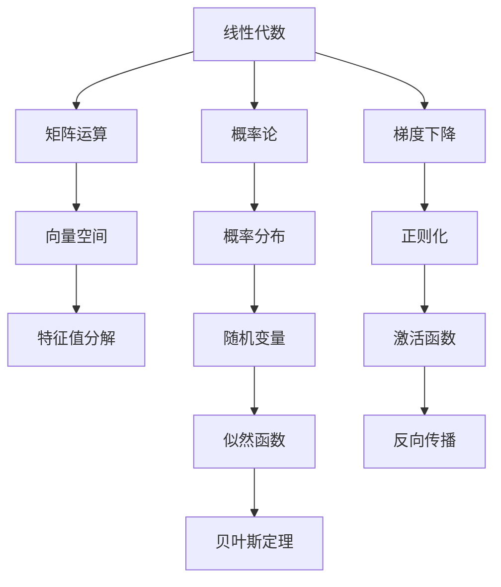

                 

# 深度学习数学基础：线性代数和概率论

> 关键词：深度学习, 线性代数, 概率论, 神经网络, 梯度下降, 正则化, 激活函数, 反向传播

## 1. 背景介绍

在深度学习的理论体系中，线性代数和概率论是不可或缺的两大基石。作为数据科学的理论基础，它们几乎渗透到深度学习的每个方面。无论你在构建神经网络、优化模型，还是分析数据集，线性代数和概率论的知识都是不可或缺的。

本文将深入探讨线性代数和概率论的核心概念和应用，以期为深度学习的理解与实践提供坚实的基础。

## 2. 核心概念与联系

### 2.1 核心概念概述

为了更好地理解线性代数和概率论在深度学习中的作用，首先需要明确几个关键概念：

- **线性代数**：研究向量、矩阵、张量等线性空间中的基本运算，是深度学习中矩阵运算和优化算法的核心。
- **概率论**：研究随机事件及其概率分布，是深度学习中模型的训练、预测与不确定性评估的基础。

这两个领域相互交织，构成了深度学习算法和模型的数学基础。线性代数提供了高效的数据表示和运算手段，而概率论则提供了数据的统计分析与建模工具。

### 2.2 核心概念原理和架构的 Mermaid 流程图



这个流程图展示了线性代数和概率论在深度学习中的主要应用场景。

- A节点到B节点的箭头表示线性代数中的矩阵运算，用于构建神经网络的权重矩阵和偏置向量。
- A节点到C节点的箭头表示线性代数中的向量空间，是数据和特征表示的基础。
- A节点到D节点的箭头表示特征值分解，用于优化神经网络的结构。
- E节点到F节点的箭头表示概率论中的概率分布，用于模型训练和推理。
- E节点到G节点的箭头表示随机变量，是模型中不确定性的来源。
- G节点到H节点的箭头表示似然函数，是模型参数估计的基础。
- E节点到I节点的箭头表示贝叶斯定理，用于推断模型的概率。
- J节点到K节点的箭头表示梯度下降算法，用于模型优化。
- J节点到L节点的箭头表示激活函数，用于神经网络的非线性建模。
- L节点到M节点的箭头表示反向传播算法，用于模型参数的更新。

## 3. 核心算法原理 & 具体操作步骤

### 3.1 算法原理概述

深度学习模型的构建和优化涉及大量的数学计算和算法设计。其中，线性代数和概率论的知识起到了至关重要的作用。

#### 3.1.1 线性代数在深度学习中的应用

线性代数在深度学习中主要应用于以下几个方面：

1. **矩阵运算**：构建和优化神经网络的权重矩阵和偏置向量。
2. **特征分解**：用于降维、特征提取和模型选择。
3. **张量计算**：处理多维数据和复杂结构。

#### 3.1.2 概率论在深度学习中的应用

概率论在深度学习中主要应用于以下几个方面：

1. **概率分布**：用于模型训练和推理。
2. **随机变量**：引入不确定性，提高模型的泛化能力。
3. **似然函数**：用于模型参数估计。
4. **贝叶斯定理**：用于模型推断和概率预测。

### 3.2 算法步骤详解

#### 3.2.1 矩阵运算和向量空间

在深度学习中，数据通常被表示为向量或矩阵形式。例如，图像数据可以被表示为像素值矩阵，文本数据可以被表示为词向量矩阵。

以图像数据为例，设输入图像大小为$m \times n$，每个像素值为一个标量，则输入向量$X$可以表示为：

$$
X \in \mathbb{R}^{m \times n}
$$

图像经过卷积层后，输出特征图大小为$r \times s$，每个特征值为一个标量，则输出向量$Y$可以表示为：

$$
Y \in \mathbb{R}^{r \times s}
$$

卷积操作可以看作对输入向量$X$进行线性变换，得到新的向量$Y$：

$$
Y = WX + b
$$

其中$W$为卷积核矩阵，$b$为偏置向量。

#### 3.2.2 特征值分解和矩阵求逆

特征值分解是线性代数中的重要概念，常用于模型选择和优化。在深度学习中，特征值分解可以用于降维和特征提取。

设矩阵$A$的特征值为$\lambda$，对应的特征向量为$v$，则有：

$$
Av = \lambda v
$$

特征值分解可以将矩阵$A$分解为：

$$
A = U \Sigma V^T
$$

其中$U$和$V$为正交矩阵，$\Sigma$为对角矩阵。

矩阵求逆在深度学习中也非常常见。设矩阵$A$可逆，则其逆矩阵$A^{-1}$满足：

$$
AA^{-1} = A^{-1}A = I
$$

其中$I$为单位矩阵。

#### 3.2.3 概率分布和随机变量

概率论中的概率分布和随机变量在深度学习中的应用包括：

1. **正态分布**：用于模型初始化。
2. **泊松分布**：用于建模稀疏计数数据。
3. **贝叶斯分布**：用于模型推断和概率预测。

以正态分布为例，设随机变量$X$服从均值为$\mu$、方差为$\sigma^2$的正态分布，则概率密度函数为：

$$
p(X) = \frac{1}{\sqrt{2\pi}\sigma} e^{-\frac{(X-\mu)^2}{2\sigma^2}}
$$

在深度学习中，正态分布常用于模型初始化权重，保证模型的稳定性和收敛性。

#### 3.2.4 似然函数和贝叶斯定理

似然函数和贝叶斯定理是概率论中的两个重要概念，常用于模型训练和推理。

设模型参数为$\theta$，训练数据为$D$，则似然函数$P(D|\theta)$表示在参数$\theta$下生成数据$D$的概率。在模型训练中，我们通过最大化似然函数来估计最优参数：

$$
\hat{\theta} = \mathop{\arg\max}_{\theta} P(D|\theta)
$$

贝叶斯定理则用于模型推断，即在已知数据$D$和先验知识$P(\theta)$下，推断模型参数的后验分布$P(\theta|D)$：

$$
P(\theta|D) = \frac{P(D|\theta)P(\theta)}{P(D)}
$$

其中$P(D)$为数据$D$的概率，可以通过最大似然估计得到。

### 3.3 算法优缺点

#### 3.3.1 线性代数

线性代数的优点包括：

1. **高效计算**：矩阵运算的并行计算能力，使得线性代数在深度学习中能够高效处理大量数据。
2. **泛化能力强**：线性代数为深度学习模型提供了通用的表示和优化手段。
3. **直观易懂**：线性代数中的向量空间和矩阵变换等概念，直观易懂，易于理解和应用。

线性代数的主要缺点包括：

1. **复杂度较高**：对于大规模数据和高维特征，线性代数的计算复杂度较高，容易产生数值稳定性和计算效率的问题。
2. **模型表达能力有限**：线性代数只能处理线性的关系，对于非线性关系建模能力有限。

#### 3.3.2 概率论

概率论的优点包括：

1. **不确定性建模**：概率论能够处理模型的不确定性和噪声，提高模型的泛化能力。
2. **推理能力强**：通过贝叶斯定理和似然函数，概率论能够进行有效的模型推断和预测。
3. **统计分析**：概率论提供了丰富的统计分析工具，用于数据建模和分析。

概率论的主要缺点包括：

1. **计算复杂度高**：概率论中的计算复杂度较高，尤其是在模型参数较多的情况下。
2. **模型假设较多**：概率论中的模型假设较多，对于一些复杂问题，可能需要大量的先验知识。

### 3.4 算法应用领域

线性代数和概率论在深度学习中的应用非常广泛，几乎涵盖了所有的神经网络和模型架构。

1. **卷积神经网络**：使用矩阵运算处理卷积层、池化层等结构。
2. **循环神经网络**：使用向量空间表示时间序列数据。
3. **自编码器**：使用矩阵分解和特征提取实现数据降维和重构。
4. **变分自编码器**：使用概率分布进行数据建模和重构。
5. **深度生成模型**：使用随机变量生成新数据。

## 4. 数学模型和公式 & 详细讲解 & 举例说明

### 4.1 数学模型构建

深度学习模型的数学模型通常可以表示为一个多层神经网络，其中每层包含一个或多个线性变换和非线性激活函数。

以全连接神经网络为例，设输入向量$X$大小为$d$，输出向量$Y$大小为$k$，则模型的线性变换可以表示为：

$$
Y = WX + b
$$

其中$W$为权重矩阵，$b$为偏置向量。

非线性激活函数常用于增加模型的表达能力，常见的激活函数包括：

- **Sigmoid函数**：
$$
f(x) = \frac{1}{1 + e^{-x}}
$$

- **ReLU函数**：
$$
f(x) = \max(0, x)
$$

- **Tanh函数**：
$$
f(x) = \tanh(x)
$$

### 4.2 公式推导过程

#### 4.2.1 梯度下降算法

梯度下降算法是深度学习中用于优化模型参数的常用算法。其基本思想是通过计算损失函数的梯度，反向传播更新模型参数，使得模型在损失函数最小值处收敛。

设损失函数为$L(\theta)$，梯度下降算法的更新规则为：

$$
\theta \leftarrow \theta - \eta \nabla_{\theta} L(\theta)
$$

其中$\eta$为学习率，$\nabla_{\theta} L(\theta)$为损失函数对参数$\theta$的梯度。

梯度下降算法有多种变体，包括批量梯度下降(Batch Gradient Descent, BGD)、随机梯度下降(Stochastic Gradient Descent, SGD)和小批量梯度下降(Mini-Batch Gradient Descent)。

#### 4.2.2 正则化

正则化是深度学习中用于避免模型过拟合的技术。常用的正则化方法包括L1正则和L2正则。

L1正则的更新规则为：

$$
\theta \leftarrow \theta - \eta (\nabla_{\theta} L(\theta) + \lambda ||\theta||_1)
$$

其中$\lambda$为正则化系数，$||\theta||_1$为L1范数。

L2正则的更新规则为：

$$
\theta \leftarrow \theta - \eta (\nabla_{\theta} L(\theta) + \lambda ||\theta||_2^2)
$$

其中$||\theta||_2$为L2范数。

### 4.3 案例分析与讲解

#### 4.3.1 卷积神经网络

卷积神经网络(CNN)是深度学习中最常用的模型之一，主要用于图像和视频数据的处理。

CNN的核心思想是局部连接和参数共享，通过卷积层和池化层实现特征提取和降维。卷积层的计算过程可以表示为：

$$
Y = W*X + b
$$

其中$*$为卷积运算，$W$为卷积核矩阵，$b$为偏置向量。

#### 4.3.2 循环神经网络

循环神经网络(RNN)是处理序列数据的常用模型。RNN的核心思想是时间步中的信息传递，通过隐藏状态$h$实现对时间序列数据的建模。

RNN的计算过程可以表示为：

$$
h_t = f(h_{t-1}, X_t)
$$

$$
Y_t = g(h_t)
$$

其中$f$和$g$为非线性激活函数，$h_t$为隐藏状态，$X_t$为时间步$t$的输入，$Y_t$为时间步$t$的输出。

## 5. 项目实践：代码实例和详细解释说明

### 5.1 开发环境搭建

在进行深度学习项目实践前，首先需要准备好开发环境。以下是使用Python进行TensorFlow开发的环境配置流程：

1. 安装Anaconda：从官网下载并安装Anaconda，用于创建独立的Python环境。

2. 创建并激活虚拟环境：
```bash
conda create -n tf-env python=3.8 
conda activate tf-env
```

3. 安装TensorFlow：根据CUDA版本，从官网获取对应的安装命令。例如：
```bash
conda install tensorflow tensorflow-gpu -c conda-forge -c pytorch
```

4. 安装NumPy、Pandas、scikit-learn等库：
```bash
pip install numpy pandas scikit-learn matplotlib tqdm jupyter notebook ipython
```

完成上述步骤后，即可在`tf-env`环境中开始项目实践。

### 5.2 源代码详细实现

这里我们以手写数字识别(MNIST)为例，给出使用TensorFlow对神经网络进行训练和推理的PyTorch代码实现。

首先，定义MNIST数据集的处理函数：

```python
import tensorflow as tf
from tensorflow.keras.datasets import mnist

def load_mnist_data():
    (x_train, y_train), (x_test, y_test) = mnist.load_data()
    x_train = x_train.reshape((60000, 28*28)).astype('float32') / 255.0
    x_test = x_test.reshape((10000, 28*28)).astype('float32') / 255.0
    y_train = tf.keras.utils.to_categorical(y_train, 10)
    y_test = tf.keras.utils.to_categorical(y_test, 10)
    return (x_train, y_train), (x_test, y_test)
```

然后，定义神经网络的模型：

```python
from tensorflow.keras.models import Sequential
from tensorflow.keras.layers import Dense, Flatten

def build_model():
    model = Sequential()
    model.add(Flatten(input_shape=(28, 28)))
    model.add(Dense(256, activation='relu'))
    model.add(Dense(10, activation='softmax'))
    model.compile(optimizer='adam', loss='categorical_crossentropy', metrics=['accuracy'])
    return model
```

接着，定义训练和评估函数：

```python
def train_model(model, x_train, y_train, batch_size, epochs):
    model.fit(x_train, y_train, batch_size=batch_size, epochs=epochs, validation_data=(x_test, y_test))

def evaluate_model(model, x_test, y_test, batch_size):
    loss, accuracy = model.evaluate(x_test, y_test, batch_size=batch_size)
    print(f'Test Loss: {loss:.4f}')
    print(f'Test Accuracy: {accuracy:.4f}')
```

最后，启动训练流程并在测试集上评估：

```python
x_train, y_train = load_mnist_data()
model = build_model()
train_model(model, x_train, y_train, batch_size=64, epochs=10)
evaluate_model(model, x_test, y_test, batch_size=64)
```

以上就是使用TensorFlow对神经网络进行MNIST数据集训练和评估的完整代码实现。可以看到，TensorFlow提供了方便的API，使得构建和训练神经网络变得简单高效。

### 5.3 代码解读与分析

让我们再详细解读一下关键代码的实现细节：

**load_mnist_data函数**：
- 定义了MNIST数据集的处理函数，将原始数据转换为模型可接受的格式，并进行归一化处理。

**build_model函数**：
- 定义了神经网络的模型结构，包括输入层、隐藏层和输出层。
- 使用ReLU和Softmax激活函数，优化器为Adam，损失函数为交叉熵。

**train_model函数**：
- 使用TensorFlow的fit方法，对模型进行训练。
- 设定批量大小和迭代次数，并在验证集上监控模型性能。

**evaluate_model函数**：
- 使用TensorFlow的evaluate方法，对模型进行评估。
- 输出测试集的损失和准确率。

**训练流程**：
- 使用load_mnist_data函数加载数据集。
- 调用build_model函数创建模型。
- 调用train_model函数进行训练，并在测试集上评估性能。

可以看到，TensorFlow提供了便捷的工具和API，使得神经网络的构建和训练变得非常简单。开发者可以更加专注于模型的设计和性能优化，而不必过多关注底层实现细节。

当然，工业级的系统实现还需考虑更多因素，如模型的保存和部署、超参数的自动搜索、更灵活的网络结构设计等。但核心的训练流程基本与此类似。

## 6. 实际应用场景

### 6.1 计算机视觉

深度学习在计算机视觉领域的应用非常广泛，如图像分类、目标检测、图像生成等。线性代数和概率论在计算机视觉中的应用包括：

1. **卷积神经网络**：用于图像特征提取和分类。
2. **循环神经网络**：用于视频序列的建模。
3. **自编码器**：用于图像去噪和降维。

### 6.2 自然语言处理

深度学习在自然语言处理领域的应用也非常广泛，如文本分类、机器翻译、问答系统等。线性代数和概率论在自然语言处理中的应用包括：

1. **循环神经网络**：用于文本序列的建模。
2. **Transformer模型**：用于自然语言翻译和生成。
3. **自编码器**：用于文本去噪和降维。

### 6.3 语音识别

深度学习在语音识别领域的应用也非常广泛，如自动语音识别、语音合成等。线性代数和概率论在语音识别中的应用包括：

1. **卷积神经网络**：用于声谱特征提取。
2. **循环神经网络**：用于语音序列建模。
3. **深度生成模型**：用于语音合成。

## 7. 工具和资源推荐

### 7.1 学习资源推荐

为了帮助开发者系统掌握深度学习的数学基础，这里推荐一些优质的学习资源：

1. 《Deep Learning》（Ian Goodfellow、Yoshua Bengio、Aaron Courville）：深度学习的经典教材，涵盖了深度学习的基础和高级内容。
2. 《Pattern Recognition and Machine Learning》（Christopher M. Bishop）：概率论和机器学习的经典教材，介绍了各种概率模型和机器学习算法。
3. 《Linear Algebra and Its Applications》（Sheldon Axler）：线性代数的经典教材，讲解了线性代数的基本概念和应用。
4. 《Probability and Computing》（Michael L. Kearns、Peter A. Ornstein）：概率论和计算的介绍性教材，讲解了概率论的基本概念和应用。

通过对这些资源的学习实践，相信你一定能够系统掌握深度学习的数学基础，为深度学习的理解与实践奠定坚实的基础。

### 7.2 开发工具推荐

高效的开发离不开优秀的工具支持。以下是几款用于深度学习开发的常用工具：

1. TensorFlow：由Google主导开发的开源深度学习框架，生产部署方便，适合大规模工程应用。
2. PyTorch：基于Python的开源深度学习框架，灵活动态的计算图，适合快速迭代研究。
3. Keras：基于TensorFlow和Theano的高级神经网络API，易于上手，适合初学者。
4. Jupyter Notebook：交互式Python代码编辑器，适合开发和调试深度学习模型。

合理利用这些工具，可以显著提升深度学习的开发效率，加快创新迭代的步伐。

### 7.3 相关论文推荐

深度学习的发展离不开学界的持续研究。以下是几篇奠基性的相关论文，推荐阅读：

1. A Tutorial on Deep Learning（Geoffrey Hinton）：深度学习的入门教材，讲解了深度学习的基本概念和算法。
2. ImageNet Classification with Deep Convolutional Neural Networks（Alex Krizhevsky、Ilya Sutskever、Geoffrey Hinton）：ImageNet数据集上的深度学习模型，展示了深度卷积神经网络在图像分类任务中的卓越性能。
3. Attention is All You Need（Ashish Vaswani）：Transformer模型的原论文，提出自注意力机制，提高了深度学习模型的表达能力。
4. Generating Sequences with Recurrent Neural Networks（Yoshua Bengio、Geoffrey Hinton、Christian J.C.:schmidhuber）：循环神经网络在序列建模中的应用，奠定了深度学习在自然语言处理和语音识别等领域的基础。
5. Variational Autoencoders（Diederik P. Kingma、Max Welling）：自编码器在图像去噪和降维中的应用，展示了深度学习模型的强大能力。

这些论文代表了大深度学习的发展脉络。通过学习这些前沿成果，可以帮助研究者把握学科前进方向，激发更多的创新灵感。

## 8. 总结：未来发展趋势与挑战

### 8.1 总结

本文对线性代数和概率论在深度学习中的应用进行了全面系统的介绍。首先阐述了线性代数和概率论在深度学习中的重要性和应用场景，明确了深度学习算法和模型的数学基础。其次，从原理到实践，详细讲解了深度学习模型的构建和优化方法，给出了神经网络的完整代码实现。同时，本文还广泛探讨了深度学习模型在计算机视觉、自然语言处理和语音识别等诸多领域的应用前景，展示了深度学习技术的广阔前景。

通过本文的系统梳理，可以看到，线性代数和概率论是大深度学习算法和模型的基础，在模型的构建和优化中起到了至关重要的作用。这些数学基础的应用，使得深度学习技术在各个领域得到了广泛应用，推动了人工智能技术的快速发展。

### 8.2 未来发展趋势

展望未来，线性代数和概率论在深度学习中的应用将呈现以下几个发展趋势：

1. **大规模模型**：随着算力成本的下降和数据规模的扩张，深度学习模型的参数量还将持续增长。超大规模模型蕴含的丰富知识，将进一步提升深度学习模型的表达能力和泛化能力。
2. **模型压缩和优化**：线性代数和概率论中的压缩和优化方法，如参数剪枝、量化、稀疏化等，将在大规模模型中得到广泛应用，提高模型的计算效率和资源利用率。
3. **多模态融合**：线性代数和概率论中的多模态融合方法，如视觉-文本融合、语音-文本融合等，将进一步提升深度学习模型对多源数据的建模能力。
4. **自适应学习**：线性代数和概率论中的自适应学习算法，如Meta Learning、联邦学习等，将进一步提升深度学习模型的适应性和鲁棒性。
5. **知识图谱和语义理解**：结合知识图谱和语义理解技术，深度学习模型将能够更好地处理复杂语义信息，提升模型在知识密集型任务中的性能。

以上趋势凸显了大深度学习算法和模型的强大潜力。这些方向的探索发展，必将进一步提升深度学习系统的性能和应用范围，为人工智能技术的发展带来新的突破。

### 8.3 面临的挑战

尽管深度学习在各个领域取得了显著的成就，但在迈向更加智能化、普适化应用的过程中，仍面临诸多挑战：

1. **计算资源瓶颈**：大规模模型的训练和推理需要大量的计算资源，算力成本较高，难以大规模部署。
2. **数据稀缺问题**：深度学习模型的训练需要大量的标注数据，数据稀缺问题在一些垂直领域尤为突出。
3. **模型泛化能力不足**：深度学习模型在训练集上表现良好，但在测试集上泛化能力不足，易受到噪声和对抗攻击的干扰。
4. **模型可解释性差**：深度学习模型往往是"黑盒"系统，难以解释其内部工作机制和决策逻辑，影响模型的可信度和安全性。
5. **伦理和隐私问题**：深度学习模型可能引入偏见和歧视，损害用户隐私，需加强伦理约束和隐私保护。

这些挑战需要学界和业界共同努力，才能更好地推动深度学习技术的健康发展。

### 8.4 研究展望

面对深度学习面临的挑战，未来的研究需要在以下几个方面寻求新的突破：

1. **模型压缩和优化**：开发更高效的压缩和优化算法，减少模型参数和计算资源的需求，提升模型的实时性和稳定性。
2. **自适应学习**：研究自适应学习算法，提高模型的泛化能力和适应性，降低数据稀缺问题的影响。
3. **模型可解释性**：结合符号化知识和模型分析工具，提升深度学习模型的可解释性和可信度。
4. **知识图谱和语义理解**：结合知识图谱和语义理解技术，提升深度学习模型的理解能力和推理能力。
5. **伦理和隐私保护**：加强深度学习模型的伦理约束和隐私保护，保障用户的权益和安全。

这些研究方向的探索，必将引领深度学习技术迈向更高的台阶，为构建智能、可信、可控的深度学习系统铺平道路。

## 9. 附录：常见问题与解答

**Q1：深度学习中的线性代数和概率论有什么区别？**

A: 线性代数和概率论是深度学习中的两大基础数学工具，它们的区别主要体现在以下几个方面：

1. **数据表示**：线性代数用于处理数值数据，概率论用于处理随机数据。
2. **优化目标**：线性代数用于优化损失函数，概率论用于优化模型的概率分布。
3. **模型表达**：线性代数提供了一种高效的数据表示和运算手段，概率论提供了一种通用的概率建模框架。

**Q2：深度学习中的梯度下降算法如何工作？**

A: 梯度下降算法是深度学习中用于优化模型参数的常用算法。其基本思想是通过计算损失函数的梯度，反向传播更新模型参数，使得模型在损失函数最小值处收敛。

梯度下降算法的步骤如下：

1. 计算损失函数的梯度。
2. 根据梯度和学习率，更新模型参数。
3. 重复以上步骤，直至收敛。

梯度下降算法有多种变体，包括批量梯度下降(Batch Gradient Descent, BGD)、随机梯度下降(Stochastic Gradient Descent, SGD)和小批量梯度下降(Mini-Batch Gradient Descent)。

**Q3：深度学习中的正则化技术有哪些？**

A: 深度学习中的正则化技术用于避免模型过拟合，包括：

1. L1正则化：限制模型参数的绝对值，减少参数的数量。
2. L2正则化：限制模型参数的平方和，减少模型的复杂度。
3. Dropout：随机丢弃一些神经元，减少模型的依赖性。
4. 数据增强：通过对训练数据进行扰动，增加模型的泛化能力。

这些正则化技术可以帮助深度学习模型更好地泛化到新的数据集上。

**Q4：深度学习中的激活函数有哪些？**

A: 深度学习中的激活函数用于增加模型的非线性能力，常用的激活函数包括：

1. Sigmoid函数：将输出限制在(0,1)范围内，常用于二分类问题。
2. ReLU函数：输出非负值，常用于图像分类、文本分类等任务。
3. Tanh函数：输出在(-1,1)范围内，常用于回归问题。
4. Softmax函数：将输出归一化，常用于多分类问题。

这些激活函数在不同的任务中都有广泛应用，开发者可以根据具体任务选择合适的激活函数。

**Q5：深度学习中的似然函数和贝叶斯定理有什么区别？**

A: 似然函数和贝叶斯定理是概率论中的两个重要概念，常用于模型训练和推理。

似然函数表示模型在已知参数$\theta$的情况下，生成数据$D$的概率，用于模型参数估计。似然函数的定义如下：

$$
P(D|\theta) = \prod_{i=1}^N P(x_i|\theta)
$$

其中$P(x_i|\theta)$为单一样本的概率密度函数。

贝叶斯定理表示在已知先验知识$P(\theta)$的情况下，推断模型参数的后验分布$P(\theta|D)$。贝叶斯定理的定义如下：

$$
P(\theta|D) = \frac{P(D|\theta)P(\theta)}{P(D)}
$$

其中$P(D)$为数据$D$的概率，可以通过最大似然估计得到。

总的来说，似然函数和贝叶斯定理都用于模型训练和推理，但贝叶斯定理在推断模型参数时考虑了先验知识，比似然函数更加全面。

---

作者：禅与计算机程序设计艺术 / Zen and the Art of Computer Programming

