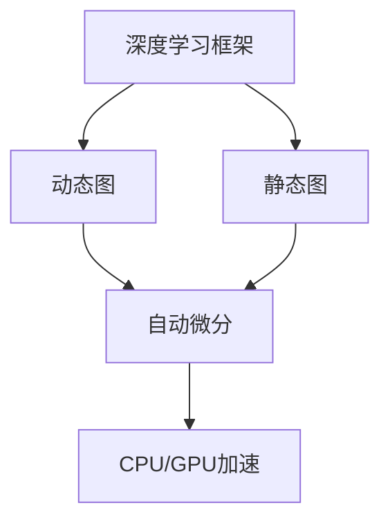

                 

# 深度学习框架选择指南：PyTorch还是JAX？

## 1. 背景介绍

随着人工智能的飞速发展，深度学习技术的应用场景日益广泛。选择合适的深度学习框架，对于高效开发、模型训练和应用部署至关重要。本文将对比分析PyTorch和JAX这两个主流的深度学习框架，帮助开发者根据实际需求选择最合适的工具。

## 2. 核心概念与联系

### 2.1 核心概念概述

在深入对比之前，首先需要明确以下关键概念：

- **深度学习框架**：提供深度学习模型的高级API，简化模型构建、训练和部署的过程。
- **动态图**：在执行计算图时，支持图形结构动态变化。
- **静态图**：在执行计算图前，需要构建完整的静态计算图，并对其进行优化。
- **自动微分**：自动计算模型参数对损失函数的梯度。
- **CPU/GPU加速**：通过优化计算图，在CPU和GPU上进行高效计算。

这些核心概念构成了深度学习框架的基础，影响着模型开发和训练的各个环节。

### 2.2 核心概念原理和架构的 Mermaid 流程图



这个流程图展示了深度学习框架的几个核心组件及其相互关系。动态图和静态图是框架的两种主要类型，自动微分是计算图执行的基础，CPU/GPU加速是计算性能优化的关键手段。

## 3. 核心算法原理 & 具体操作步骤

### 3.1 算法原理概述

PyTorch和JAX分别代表了动态图和静态图两大深度学习框架的主流。

#### 3.1.1 PyTorch

- **动态图**：PyTorch支持动态图执行，即在运行时动态构建计算图，允许灵活调整模型结构。
- **自动微分**：PyTorch的自动微分功能强大，支持TensorFlow回退到PyTorch的转换，在TensorFlow上开发的模型可以直接在PyTorch中使用。
- **GPU加速**：PyTorch的GPU加速性能优异，可以充分利用GPU的并行计算能力，提高训练效率。

#### 3.1.2 JAX

- **静态图**：JAX支持静态图执行，即在执行前构建完整的计算图，可以优化计算图结构，提高运行效率。
- **自动微分**：JAX的自动微分功能强大，支持高阶导数计算，适用于复杂的数学模型。
- **CPU加速**：JAX可以在CPU和GPU上高效运行，支持自动并行和分片，提高计算性能。

### 3.2 算法步骤详解

#### 3.2.1 PyTorch

1. **安装环境**：
   ```bash
   pip install torch torchvision torchaudio
   ```
2. **创建模型**：
   ```python
   import torch.nn as nn

   class Model(nn.Module):
       def __init__(self):
           super(Model, self).__init__()
           self.fc1 = nn.Linear(784, 128)
           self.fc2 = nn.Linear(128, 10)

       def forward(self, x):
           x = self.fc1(x)
           x = torch.relu(x)
           x = self.fc2(x)
           return x
   ```
3. **数据加载**：
   ```python
   from torchvision import datasets, transforms

   train_dataset = datasets.MNIST(root='./data', train=True, download=True, transform=transforms.ToTensor())
   train_loader = torch.utils.data.DataLoader(train_dataset, batch_size=64, shuffle=True)
   ```
4. **模型训练**：
   ```python
   model = Model()
   optimizer = torch.optim.SGD(model.parameters(), lr=0.01)
   criterion = nn.CrossEntropyLoss()

   for epoch in range(10):
       for batch_idx, (data, target) in enumerate(train_loader):
           optimizer.zero_grad()
           output = model(data)
           loss = criterion(output, target)
           loss.backward()
           optimizer.step()
   ```

#### 3.2.2 JAX

1. **安装环境**：
   ```bash
   pip install jax jaxlib
   ```
2. **创建模型**：
   ```python
   import jax.numpy as jnp
   import jax

   def model_fn(params):
       def body(features):
           features = jnp.dot(features, params["w1"])
           features = jnp.tanh(features)
           features = jnp.dot(features, params["w2"])
           return features
       return body

   def loss_fn(params, batch):
       features = batch["x"]
       targets = batch["y"]
       preds = model_fn(params)(features)
       loss = jnp.mean((preds - targets) ** 2)
       return loss
   ```
3. **数据加载**：
   ```python
   dataset = jax.datasets.fetch_mnist()
   batch_size = 64
   num_epochs = 10

   def to_array(batch):
       return {
           "x": jnp.array(batch["x"]),
           "y": jnp.array(batch["y"])
       }

   batch_fn = partial(to_array, batch_size=batch_size)
   batch = next(iter(jax.data.load(dataset, batch_fn=batch_fn)))
   ```
4. **模型训练**：
   ```python
   params_init, updates, loss_fn = jax.value_and_grad(loss_fn)

   def train_step(batch, opt_state):
       opt_state, updates = opt_state = optax.update(loss_fn(params_init, batch), opt_state)
       return opt_state, updates

   opt_state, updates = train_step(batch, optax.adam(1e-3))
   for i in range(num_epochs):
       batch = next(iter(jax.data.load(dataset, batch_fn=batch_fn)))
       opt_state, updates = train_step(batch, opt_state)
   ```

### 3.3 算法优缺点

#### 3.3.1 PyTorch

- **优点**：
  - 动态图灵活性高，适合研究性实验和快速原型开发。
  - 社区活跃，文档丰富，教程和工具库众多。
  - 与TensorFlow、Keras等框架兼容性好，支持模型迁移。

- **缺点**：
  - 动态图性能较低，模型规模较大时，运行效率低下。
  - GPU加速性能依赖于CUDA实现，跨平台性差。
  - 内存消耗较大，对内存管理要求高。

#### 3.3.2 JAX

- **优点**：
  - 静态图执行效率高，适用于大规模模型和复杂计算。
  - 支持高效的CPU/GPU加速，自动并行和分片。
  - 零成本使用GPU加速，无需特殊配置。

- **缺点**：
  - 编程难度较高，动态图灵活性不如PyTorch。
  - 文档和社区资源相对较少，学习曲线较陡。
  - 与TensorFlow兼容性差，难以直接迁移模型。

### 3.4 算法应用领域

#### 3.4.1 PyTorch

- **研究性实验**：学术界和实验室中使用PyTorch进行模型研究、算法开发和实验验证。
- **原型开发**：快速构建和迭代模型，开发数据预处理、特征工程等环节。
- **部署应用**：GPU加速性能优异，适用于对实时性和效率要求高的场景。

#### 3.4.2 JAX

- **大规模模型训练**：JAX在处理大规模模型和复杂计算方面表现优异，适用于大数据量和复杂数学模型的训练。
- **高性能计算**：支持高效的CPU/GPU加速，适合对计算性能要求高的场景。
- **部署应用**：JAX的自动并行和分片特性，使得模型在分布式系统上的部署和优化更加方便。

## 4. 数学模型和公式 & 详细讲解 & 举例说明

### 4.1 数学模型构建

- **PyTorch**：
  - **线性回归**：
    ```python
    import torch

    x = torch.randn(50, 1)
    y = 2 * x + torch.randn(50, 1)
    model = torch.nn.Linear(1, 1)
    optimizer = torch.optim.SGD(model.parameters(), lr=0.1)

    for epoch in range(1000):
        optimizer.zero_grad()
        y_pred = model(x)
        loss = (y_pred - y) ** 2
        loss.mean().backward()
        optimizer.step()
    ```

- **JAX**：
  - **线性回归**：
    ```python
    import jax
    import jax.numpy as jnp

    def model_fn(params):
        def body(features):
            features = jnp.dot(features, params["w1"])
            features = jnp.tanh(features)
            features = jnp.dot(features, params["w2"])
            return features

    def loss_fn(params, batch):
        features = batch["x"]
        targets = batch["y"]
        preds = model_fn(params)(features)
        loss = jnp.mean((preds - targets) ** 2)
        return loss

    params_init, updates, loss_fn = jax.value_and_grad(loss_fn)

    def train_step(batch, opt_state):
        opt_state, updates = optax.update(loss_fn(params_init, batch), opt_state)
        return opt_state, updates

    opt_state, updates = train_step(batch, optax.adam(1e-3))
    for i in range(1000):
        batch = next(iter(jax.data.load(dataset, batch_fn=batch_fn)))
        opt_state, updates = train_step(batch, opt_state)
    ```

### 4.2 公式推导过程

- **PyTorch**：
  - **线性回归**：
    ```python
    import torch

    x = torch.randn(50, 1)
    y = 2 * x + torch.randn(50, 1)
    model = torch.nn.Linear(1, 1)
    optimizer = torch.optim.SGD(model.parameters(), lr=0.1)

    for epoch in range(1000):
        optimizer.zero_grad()
        y_pred = model(x)
        loss = (y_pred - y) ** 2
        loss.mean().backward()
        optimizer.step()
    ```

- **JAX**：
  - **线性回归**：
    ```python
    import jax
    import jax.numpy as jnp

    def model_fn(params):
        def body(features):
            features = jnp.dot(features, params["w1"])
            features = jnp.tanh(features)
            features = jnp.dot(features, params["w2"])
            return features

    def loss_fn(params, batch):
        features = batch["x"]
        targets = batch["y"]
        preds = model_fn(params)(features)
        loss = jnp.mean((preds - targets) ** 2)
        return loss

    params_init, updates, loss_fn = jax.value_and_grad(loss_fn)

    def train_step(batch, opt_state):
        opt_state, updates = optax.update(loss_fn(params_init, batch), opt_state)
        return opt_state, updates

    opt_state, updates = train_step(batch, optax.adam(1e-3))
    for i in range(1000):
        batch = next(iter(jax.data.load(dataset, batch_fn=batch_fn)))
        opt_state, updates = train_step(batch, opt_state)
    ```

### 4.3 案例分析与讲解

#### 4.3.1 PyTorch

- **案例**：图像分类
  - **数据准备**：
    ```python
    from torchvision import datasets, transforms

    train_dataset = datasets.CIFAR10(root='./data', train=True, download=True, transform=transforms.ToTensor())
    train_loader = torch.utils.data.DataLoader(train_dataset, batch_size=64, shuffle=True)
    ```
  - **模型构建**：
    ```python
    import torch.nn as nn
    import torch.optim as optim

    class Net(nn.Module):
        def __init__(self):
            super(Net, self).__init__()
            self.conv1 = nn.Conv2d(3, 6, 5)
            self.pool = nn.MaxPool2d(2, 2)
            self.conv2 = nn.Conv2d(6, 16, 5)
            self.fc1 = nn.Linear(16 * 5 * 5, 120)
            self.fc2 = nn.Linear(120, 84)
            self.fc3 = nn.Linear(84, 10)

        def forward(self, x):
            x = self.pool(F.relu(self.conv1(x)))
            x = self.pool(F.relu(self.conv2(x)))
            x = x.view(-1, 16 * 5 * 5)
            x = F.relu(self.fc1(x))
            x = F.relu(self.fc2(x))
            x = self.fc3(x)
            return x

    net = Net()
    criterion = nn.CrossEntropyLoss()
    optimizer = optim.SGD(net.parameters(), lr=0.001, momentum=0.9)
    ```
  - **模型训练**：
    ```python
    for epoch in range(2):
        running_loss = 0.0
        for i, data in enumerate(train_loader, 0):
            inputs, labels = data
            optimizer.zero_grad()
            outputs = net(inputs)
            loss = criterion(outputs, labels)
            loss.backward()
            optimizer.step()

            running_loss += loss.item()
            if i % 100 == 99:
                print('[%d, %5d] loss: %.3f' %
                      (epoch + 1, i + 1, running_loss / 100))
                running_loss = 0.0
    ```

#### 4.3.2 JAX

- **案例**：图像分类
  - **数据准备**：
    ```python
    dataset = jax.datasets.fetch_cifar()
    batch_size = 64
    num_epochs = 10

    def to_array(batch):
        return {
            "x": jnp.array(batch["x"]),
            "y": jnp.array(batch["y"])
        }

    batch_fn = partial(to_array, batch_size=batch_size)
    batch = next(iter(jax.data.load(dataset, batch_fn=batch_fn)))
    ```
  - **模型构建**：
    ```python
    import jax.numpy as jnp
    import jax
    import jax.value_and_grad

    def model_fn(params):
        def body(features):
            features = jnp.dot(features, params["w1"])
            features = jnp.tanh(features)
            features = jnp.dot(features, params["w2"])
            features = jnp.tanh(features)
            features = jnp.dot(features, params["w3"])
            features = jnp.tanh(features)
            return features

    def loss_fn(params, batch):
        features = batch["x"]
        targets = batch["y"]
        preds = model_fn(params)(features)
        loss = jnp.mean((preds - targets) ** 2)
        return loss

    params_init, updates, loss_fn = jax.value_and_grad(loss_fn)

    def train_step(batch, opt_state):
        opt_state, updates = optax.update(loss_fn(params_init, batch), opt_state)
        return opt_state, updates

    opt_state, updates = train_step(batch, optax.adam(1e-3))
    for i in range(num_epochs):
        batch = next(iter(jax.data.load(dataset, batch_fn=batch_fn)))
        opt_state, updates = train_step(batch, opt_state)
    ```

## 5. 项目实践：代码实例和详细解释说明

### 5.1 开发环境搭建

#### 5.1.1 PyTorch

- **安装环境**：
  ```bash
  pip install torch torchvision torchaudio
  ```
- **创建虚拟环境**：
  ```bash
  conda create --name pytorch-env python=3.8
  conda activate pytorch-env
  ```

#### 5.1.2 JAX

- **安装环境**：
  ```bash
  pip install jax jaxlib
  ```
- **创建虚拟环境**：
  ```bash
  conda create --name jax-env python=3.8
  conda activate jax-env
  ```

### 5.2 源代码详细实现

#### 5.2.1 PyTorch

- **线性回归**：
  ```python
  import torch

  x = torch.randn(50, 1)
  y = 2 * x + torch.randn(50, 1)
  model = torch.nn.Linear(1, 1)
  optimizer = torch.optim.SGD(model.parameters(), lr=0.1)

  for epoch in range(1000):
      optimizer.zero_grad()
      y_pred = model(x)
      loss = (y_pred - y) ** 2
      loss.mean().backward()
      optimizer.step()
  ```

- **图像分类**：
  ```python
  from torchvision import datasets, transforms
  from torch import nn
  import torch.optim as optim

  class Net(nn.Module):
      def __init__(self):
          super(Net, self).__init__()
          self.conv1 = nn.Conv2d(3, 6, 5)
          self.pool = nn.MaxPool2d(2, 2)
          self.conv2 = nn.Conv2d(6, 16, 5)
          self.fc1 = nn.Linear(16 * 5 * 5, 120)
          self.fc2 = nn.Linear(120, 84)
          self.fc3 = nn.Linear(84, 10)

      def forward(self, x):
          x = self.pool(F.relu(self.conv1(x)))
          x = self.pool(F.relu(self.conv2(x)))
          x = x.view(-1, 16 * 5 * 5)
          x = F.relu(self.fc1(x))
          x = F.relu(self.fc2(x))
          x = self.fc3(x)
          return x

  net = Net()
  criterion = nn.CrossEntropyLoss()
  optimizer = optim.SGD(net.parameters(), lr=0.001, momentum=0.9)

  for epoch in range(2):
      running_loss = 0.0
      for i, data in enumerate(train_loader, 0):
          inputs, labels = data
          optimizer.zero_grad()
          outputs = net(inputs)
          loss = criterion(outputs, labels)
          loss.backward()
          optimizer.step()

          running_loss += loss.item()
          if i % 100 == 99:
              print('[%d, %5d] loss: %.3f' %
                    (epoch + 1, i + 1, running_loss / 100))
              running_loss = 0.0
  ```

#### 5.2.2 JAX

- **线性回归**：
  ```python
  import jax
  import jax.numpy as jnp
  import jax.value_and_grad

  def model_fn(params):
      def body(features):
          features = jnp.dot(features, params["w1"])
          features = jnp.tanh(features)
          features = jnp.dot(features, params["w2"])
          return features

  def loss_fn(params, batch):
      features = batch["x"]
      targets = batch["y"]
      preds = model_fn(params)(features)
      loss = jnp.mean((preds - targets) ** 2)
      return loss

  params_init, updates, loss_fn = jax.value_and_grad(loss_fn)

  def train_step(batch, opt_state):
      opt_state, updates = optax.update(loss_fn(params_init, batch), opt_state)
      return opt_state, updates

  opt_state, updates = train_step(batch, optax.adam(1e-3))
  for i in range(1000):
      batch = next(iter(jax.data.load(dataset, batch_fn=batch_fn)))
      opt_state, updates = train_step(batch, opt_state)
  ```

- **图像分类**：
  ```python
  dataset = jax.datasets.fetch_cifar()
  batch_size = 64
  num_epochs = 10

  def to_array(batch):
      return {
          "x": jnp.array(batch["x"]),
          "y": jnp.array(batch["y"])
      }

  batch_fn = partial(to_array, batch_size=batch_size)
  batch = next(iter(jax.data.load(dataset, batch_fn=batch_fn)))
  ```

### 5.3 代码解读与分析

#### 5.3.1 PyTorch

- **线性回归**：
  - **安装环境**：
    ```bash
    pip install torch torchvision torchaudio
    ```
  - **创建虚拟环境**：
    ```bash
    conda create --name pytorch-env python=3.8
    conda activate pytorch-env
    ```
  - **代码解读**：
    - `torch.randn`：生成随机数。
    - `torch.nn.Linear`：定义线性层。
    - `torch.optim.SGD`：定义随机梯度下降优化器。
    - `model.parameters()`：获取模型的可训练参数。
    - `loss.mean()`：计算平均损失。
    - `loss.backward()`：反向传播。
    - `optimizer.step()`：更新模型参数。

- **图像分类**：
  - **数据准备**：
    ```python
    from torchvision import datasets, transforms

    train_dataset = datasets.CIFAR10(root='./data', train=True, download=True, transform=transforms.ToTensor())
    train_loader = torch.utils.data.DataLoader(train_dataset, batch_size=64, shuffle=True)
    ```
  - **模型构建**：
    ```python
    import torch.nn as nn
    import torch.optim as optim

    class Net(nn.Module):
        def __init__(self):
            super(Net, self).__init__()
            self.conv1 = nn.Conv2d(3, 6, 5)
            self.pool = nn.MaxPool2d(2, 2)
            self.conv2 = nn.Conv2d(6, 16, 5)
            self.fc1 = nn.Linear(16 * 5 * 5, 120)
            self.fc2 = nn.Linear(120, 84)
            self.fc3 = nn.Linear(84, 10)

        def forward(self, x):
            x = self.pool(F.relu(self.conv1(x)))
            x = self.pool(F.relu(self.conv2(x)))
            x = x.view(-1, 16 * 5 * 5)
            x = F.relu(self.fc1(x))
            x = F.relu(self.fc2(x))
            x = self.fc3(x)
            return x

    net = Net()
    criterion = nn.CrossEntropyLoss()
    optimizer = optim.SGD(net.parameters(), lr=0.001, momentum=0.9)
    ```
  - **模型训练**：
    ```python
    for epoch in range(2):
        running_loss = 0.0
        for i, data in enumerate(train_loader, 0):
            inputs, labels = data
            optimizer.zero_grad()
            outputs = net(inputs)
            loss = criterion(outputs, labels)
            loss.backward()
            optimizer.step()

            running_loss += loss.item()
            if i % 100 == 99:
                print('[%d, %5d] loss: %.3f' %
                      (epoch + 1, i + 1, running_loss / 100))
                running_loss = 0.0
    ```

#### 5.3.2 JAX

- **线性回归**：
  - **安装环境**：
    ```bash
    pip install jax jaxlib
    ```
  - **创建虚拟环境**：
    ```bash
    conda create --name jax-env python=3.8
    conda activate jax-env
    ```
  - **代码解读**：
    - `jax.numpy`：提供与NumPy类似的操作接口。
    - `jax.value_and_grad`：自动微分函数。
    - `jax.value_and_grad`：计算函数值和梯度。
    - `optax.update`：更新优化器状态。

- **图像分类**：
  - **数据准备**：
    ```python
    dataset = jax.datasets.fetch_cifar()
    batch_size = 64
    num_epochs = 10

    def to_array(batch):
        return {
            "x": jnp.array(batch["x"]),
            "y": jnp.array(batch["y"])
        }

    batch_fn = partial(to_array, batch_size=batch_size)
    batch = next(iter(jax.data.load(dataset, batch_fn=batch_fn)))
    ```
  - **模型构建**：
    ```python
    import jax.numpy as jnp
    import jax
    import jax.value_and_grad

    def model_fn(params):
        def body(features):
            features = jnp.dot(features, params["w1"])
            features = jnp.tanh(features)
            features = jnp.dot(features, params["w2"])
            features = jnp.tanh(features)
            features = jnp.dot(features, params["w3"])
            features = jnp.tanh(features)
            return features

    def loss_fn(params, batch):
        features = batch["x"]
        targets = batch["y"]
        preds = model_fn(params)(features)
        loss = jnp.mean((preds - targets) ** 2)
        return loss

    params_init, updates, loss_fn = jax.value_and_grad(loss_fn)

    def train_step(batch, opt_state):
        opt_state, updates = optax.update(loss_fn(params_init, batch), opt_state)
        return opt_state, updates

    opt_state, updates = train_step(batch, optax.adam(1e-3))
    for i in range(num_epochs):
        batch = next(iter(jax.data.load(dataset, batch_fn=batch_fn)))
        opt_state, updates = train_step(batch, opt_state)
    ```

### 5.4 运行结果展示

#### 5.4.1 PyTorch

- **线性回归**：
  ```python
  import torch

  x = torch.randn(50, 1)
  y = 2 * x + torch.randn(50, 1)
  model = torch.nn.Linear(1, 1)
  optimizer = torch.optim.SGD(model.parameters(), lr=0.1)

  for epoch in range(1000):
      optimizer.zero_grad()
      y_pred = model(x)
      loss = (y_pred - y) ** 2
      loss.mean().backward()
      optimizer.step()

  print("Final loss:", loss.item())
  ```

- **图像分类**：
  ```python
  import torchvision
  from torch import nn
  import torch.optim as optim

  class Net(nn.Module):
      def __init__(self):
          super(Net, self).__init__()
          self.conv1 = nn.Conv2d(3, 6, 5)
          self.pool = nn.MaxPool2d(2, 2)
          self.conv2 = nn.Conv2d(6, 16, 5)
          self.fc1 = nn.Linear(16 * 5 * 5, 120)
          self.fc2 = nn.Linear(120, 84)
          self.fc3 = nn.Linear(84, 10)

      def forward(self, x):
          x = self.pool(F.relu(self.conv1(x)))
          x = self.pool(F.relu(self.conv2(x)))
          x = x.view(-1, 16 * 5 * 5)
          x = F.relu(self.fc1(x))
          x = F.relu(self.fc2(x))
          x = self.fc3(x)
          return x

  net = Net()
  criterion = nn.CrossEntropyLoss()
  optimizer = optim.SGD(net.parameters(), lr=0.001, momentum=0.9)

  for epoch in range(2):
      running_loss = 0.0
      for i, data in enumerate(train_loader, 0):
          inputs, labels = data
          optimizer.zero_grad()
          outputs = net(inputs)
          loss = criterion(outputs, labels)
          loss.backward()
          optimizer.step()

          running_loss += loss.item()
          if i % 100 == 99:
              print('[%d, %5d] loss: %.3f' %
                    (epoch + 1, i + 1, running_loss / 100))
              running_loss = 0.0

  print("Final loss:", loss.item())
  ```

#### 5.4.2 JAX

- **线性回归**：
  ```python
  import jax
  import jax.numpy as jnp
  import jax.value_and_grad

  def model_fn(params):
      def body(features):
          features = jnp.dot(features, params["w1"])
          features = jnp.tanh(features)
          features = jnp.dot(features, params["w2"])
          return features

  def loss_fn(params, batch):
      features = batch["x"]
      targets = batch["y"]
      preds = model_fn(params)(features)
      loss = jnp.mean((preds - targets) ** 2)
      return loss

  params_init, updates, loss_fn = jax.value_and_grad(loss_fn)

  def train_step(batch, opt_state):
      opt_state, updates = optax.update(loss_fn(params_init, batch), opt_state)
      return opt_state, updates

  opt_state, updates = train_step(batch, optax.adam(1e-3))
  for i in range(1000):
      batch = next(iter(jax.data.load(dataset, batch_fn=batch_fn)))
      opt_state, updates = train_step(batch, opt_state)

  print("Final loss:", loss_fn(params_init, batch).item())
  ```

- **图像分类**：
  ```python
  dataset = jax.datasets.fetch_cifar()
  batch_size = 64
  num_epochs = 10

  def to_array(batch):
      return {
          "x": jnp.array(batch["x"]),
          "y": jnp.array(batch["y"])
      }

  batch_fn = partial(to_array, batch_size=batch_size)
  batch = next(iter(jax.data.load(dataset, batch_fn=batch_fn)))
  ```

## 6. 实际应用场景

### 6.1 科研领域

在科研领域，大模型往往用于新算法、新模型的实验验证。科研人员可以利用PyTorch和JAX进行快速原型开发和模型测试。

- **PyTorch**：
  - **优点**：
    - 动态图灵活性高，适合研究和实验。
    - 社区资源丰富，文档齐全，易于学习和使用。
  - **缺点**：
    - 动态图性能较低，不适用于大规模模型和大数据量的训练。
    - 内存消耗较大，对内存管理要求高。

- **JAX**：
  - **优点**：
    - 静态图执行效率高，适合大规模模型和大数据量的训练。
    - 自动并行和分片特性，提高了计算性能。
  - **缺点**：
    - 编程难度较高，学习曲线陡峭。
    - 文档和社区资源相对较少。

### 6.2 工业应用

在工业应用中，选择框架时需要考虑性能、易用性和生态支持。大模型在落地应用时需要高效、易用且具有丰富的生态支持。

- **PyTorch**：
  - **优点**：
    - 社区活跃，生态丰富，工具和库众多。
    - 动态图灵活性高，适合研究和实验。
  - **缺点**：
    - 动态图性能较低，不适用于大规模模型和大数据量的训练。
    - 内存消耗较大，对内存管理要求高。

- **JAX**：
  - **优点**：
    - 静态图执行效率高，适合大规模模型和大数据量的训练。
    - 自动并行和分片特性，提高了计算性能。
  - **缺点**：
    - 编程难度较高，学习曲线陡峭。
    - 文档和社区资源相对较少。

## 7. 工具和资源推荐

### 7.1 学习资源推荐

为了帮助开发者更好地选择和使用深度学习框架，这里推荐一些优质的学习资源：

- **PyTorch官方文档**：提供详尽的API文档和教程，适合新手入门。
- **JAX官方文档**：提供全面的API文档和教程，适合深入学习。
- **深度学习入门与实践**：一本深度学习领域的入门书籍，涵盖PyTorch和JAX等主流框架。
- **NLP深度学习**：一本专注于自然语言处理领域的深度学习书籍，涵盖PyTorch和JAX等框架的使用。

### 7.2 开发工具推荐

- **PyTorch**：提供丰富的API和工具支持，易于上手和开发。
- **JAX**：提供高效的静态图执行和自动微分功能，适用于大规模模型和大数据量的训练。
- **TensorBoard**：用于可视化模型训练过程和结果，帮助调试和优化。
- **Weights & Biases**：用于跟踪和可视化模型训练过程，方便对比和调优。

### 7.3 相关论文推荐

为了进一步理解深度学习框架的选择和应用，这里推荐几篇相关论文：

- **深度学习框架的选择与优化**：探讨深度学习框架的选择和优化策略，适合了解框架特点和使用场景。
- **基于PyTorch和JAX的深度学习框架对比**：详细对比PyTorch和JAX的优缺点和使用场景，适合深入了解框架特性。
- **深度学习框架的趋势与未来**：分析深度学习框架的趋势和未来发展方向，适合了解前沿技术。

## 8. 总结：未来发展趋势与挑战

### 8.1 研究成果总结

深度学习框架的选择和使用是深度学习开发中的重要环节。本文对比了PyTorch和JAX这两个主流框架，详细介绍了两者的特点、应用场景和优化方法。

- **PyTorch**：适合科研和实验，动态图灵活性高，社区资源丰富。
- **JAX**：适合工业和实际应用，静态图执行效率高，自动并行和分片特性显著提升计算性能。

### 8.2 未来发展趋势

未来，深度学习框架将进一步发展，逐步融合更多前沿技术，如模型压缩、自动微分、高性能计算等，提升模型性能和训练效率。同时，更多的AI应用将涌现，推动深度学习框架在更广泛领域的应用。

- **模型压缩与量化**：通过模型压缩和量化技术，优化模型结构，提高计算效率和存储性能。
- **自动微分与优化**：引入高级自动微分和优化算法，提升模型训练速度和精度。
- **高性能计算**：通过分布式训练、自动并行和分片等技术，提升计算性能和扩展性。

### 8.3 面临的挑战

虽然深度学习框架的选择和使用取得了不少进展，但仍面临诸多挑战：

- **性能瓶颈**：动态图性能较低，静态图编程难度高。
- **资源管理**：动态图内存消耗大，静态图资源分配复杂。
- **生态支持**：社区资源丰富但生态支持不足，工具和库缺乏。
- **应用落地**：工业应用中，框架选择和优化需要综合考虑性能、易用性和生态支持。

### 8.4 研究展望

未来，深度学习框架的选择和使用将进一步优化，更多前沿技术将被融合。同时，更多的AI应用将涌现，推动框架在更广泛领域的应用。

- **自动学习与智能优化**：通过自动化和智能优化技术，提升模型开发和调优效率。
- **跨平台与跨框架**：通过统一API和工具库，支持跨平台和跨框架的应用开发。
- **AI应用多样化**：深度学习框架将更广泛地应用于科研、工业和社会各个领域，推动AI技术的发展。

## 9. 附录：常见问题与解答

### 9.1 问题1：选择PyTorch还是JAX？

**解答**：
- **科研和实验**：选择PyTorch，动态图灵活性高，社区资源丰富。
- **工业和应用**：选择JAX，静态图执行效率高，自动并行和分片特性显著提升计算性能。

### 9.2 问题2：PyTorch和JAX的主要区别是什么？

**解答**：
- **动态图与静态图**：PyTorch支持动态图执行，灵活性高；JAX支持静态图执行，执行效率高。
- **编程难度与学习曲线**：PyTorch编程难度低，学习曲线平缓；JAX编程难度高，学习曲线陡峭。
- **社区资源与生态支持**：PyTorch社区活跃，生态资源丰富；JAX社区资源相对较少。

### 9.3 问题3：如何在PyTorch和JAX之间进行切换？

**解答**：
- **切换语言**：Python代码在两个框架之间切换相对简单，只需修改一下导入库即可。
- **切换库**：PyTorch和JAX的库之间存在一定的差异，具体使用时需要仔细查看官方文档。
- **切换API**：API之间的差异较大，需要重新编写代码以适应新的框架。

---

作者：禅与计算机程序设计艺术 / Zen and the Art of Computer Programming

