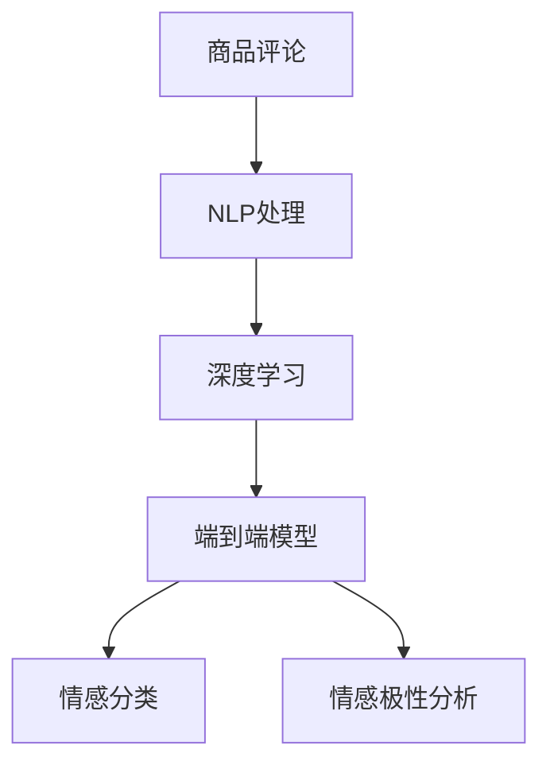

                 

## 1. 背景介绍

### 1.1 问题由来
在电子商务快速发展的背景下，商品评论成为用户表达对商品满意度的重要渠道，为商家提供宝贵的反馈信息。商品评论分析技术可以自动识别和分类评论内容，提炼用户情感、态度、意见等，帮助商家改进产品，优化用户体验。传统的人工审核和分类方式成本高、效率低，难以适应海量评论数据的处理需求。

### 1.2 问题核心关键点
商品评论分析技术的核心在于如何高效自动化地从大规模无标注数据中提炼出用户情感和意见。当前主流技术基于深度学习，通过构建端到端的模型，自动学习评论与情感、分类之间的映射关系。具体包括：
1. 语义理解：通过自然语言处理技术，理解评论中的关键信息。
2. 情感分类：通过机器学习技术，将评论归类为正面、负面、中性等情感类别。
3. 情感极性分析：除了分类，还可以进一步分析评论中情感的强度，如强烈喜爱、轻度抱怨等。

本文将深入探讨基于深度学习的商品评论分析技术，特别是如何利用端到端的神经网络模型，高效自动化地提取评论中的情感信息。

## 2. 核心概念与联系

### 2.1 核心概念概述

本节将介绍几个核心概念：

- 商品评论分析：通过文本分析技术，自动识别和分类评论中的情感和意见，提炼用户反馈信息。
- 自然语言处理(NLP)：利用计算机技术处理和理解人类语言，包括文本预处理、词嵌入、语言模型、情感分析等。
- 深度学习：利用多层次的神经网络，通过大量数据训练模型，自动提取特征并进行分类。
- 端到端模型：直接从输入到输出进行建模，不引入中间表示层，简化了模型结构，提高了预测精度。
- 情感分类：将评论分为正面、负面、中性等情感类别。
- 情感极性分析：除了分类，还可以分析情感的强度，如强度、程度等。

这些概念之间的逻辑关系可以通过以下Mermaid流程图来展示：



这个流程图展示了大语言模型的核心概念及其之间的关系：

1. 商品评论通过NLP处理，转化为计算机可理解的形式。
2. 使用深度学习模型学习评论与情感之间的映射关系。
3. 端到端模型简化模型结构，提高预测精度。
4. 情感分类和情感极性分析直接从评论中提取情感信息。

## 3. 核心算法原理 & 具体操作步骤
### 3.1 算法原理概述

基于深度学习的商品评论分析技术，本质上是利用神经网络模型，通过大量有标注的数据，学习评论与情感、分类之间的映射关系。具体步骤如下：

1. **数据准备**：收集商品评论数据集，标注情感类别，分为训练集、验证集和测试集。
2. **模型构建**：选择适当的深度学习模型，如循环神经网络(RNN)、卷积神经网络(CNN)、Transformer等，并构建相应的情感分类或极性分析模型。
3. **模型训练**：使用训练集数据，通过反向传播算法，调整模型参数，最小化损失函数。
4. **模型评估**：在验证集上评估模型性能，调整模型参数和超参数，避免过拟合。
5. **模型测试**：在测试集上测试模型效果，对比微调前后的性能提升。

### 3.2 算法步骤详解

下面以情感分类任务为例，详细介绍深度学习模型在商品评论分析中的具体实现步骤。

#### 3.2.1 数据预处理

1. **数据收集**：从电商网站、用户评论平台等收集商品评论数据。
2. **文本清洗**：去除停用词、标点符号、数字等噪声，分词、去除低频词，构建词汇表。
3. **文本编码**：使用词嵌入技术，将文本转化为固定长度的向量表示。

#### 3.2.2 模型构建

1. **选择模型**：根据任务特点选择适当的深度学习模型，如LSTM、GRU、Transformer等。
2. **模型结构**：包括输入层、嵌入层、隐藏层、输出层等。
3. **损失函数**：选择适当的损失函数，如交叉熵、Hinge loss等。

#### 3.2.3 模型训练

1. **数据划分**：将数据集分为训练集、验证集和测试集。
2. **模型训练**：使用训练集数据，通过反向传播算法，调整模型参数，最小化损失函数。
3. **超参数调整**：通过交叉验证，调整学习率、批大小、隐藏层大小等超参数，避免过拟合。
4. **模型保存**：保存训练好的模型，用于后续的测试和应用。

#### 3.2.4 模型评估

1. **评估指标**：计算模型在验证集上的准确率、精确率、召回率、F1-score等指标。
2. **模型选择**：选择最优模型，基于验证集性能进行评估和选择。

#### 3.2.5 模型测试

1. **测试集测试**：在测试集上测试模型效果，计算各种指标。
2. **性能对比**：与基准模型或传统方法进行对比，评估微调后的效果提升。

### 3.3 算法优缺点

基于深度学习的商品评论分析技术具有以下优点：

1. **高效自动化**：使用深度学习模型，可以自动从文本中提取情感信息，无需手动标注，提高处理效率。
2. **高精度**：通过大量数据训练模型，可以自动学习复杂的特征，提高情感分类的准确率。
3. **泛化能力强**：深度学习模型具有较强的泛化能力，可以适应不同领域、不同风格的数据。

同时，该技术也存在一定的局限性：

1. **数据依赖性高**：深度学习模型依赖大量标注数据进行训练，获取高质量标注数据的成本较高。
2. **模型复杂度高**：深度学习模型结构复杂，训练时间长，需要高性能计算资源。
3. **可解释性不足**：深度学习模型通常被视为"黑盒"，难以解释其内部工作机制。
4. **对抗攻击脆弱**：深度学习模型容易受到对抗样本的攻击，导致分类错误。

尽管存在这些局限性，但就目前而言，深度学习模型在商品评论分析领域仍然是最主流的方法。未来相关研究的重点在于如何进一步降低数据依赖，提高模型的泛化能力和可解释性，同时兼顾计算资源的高效利用。

### 3.4 算法应用领域

商品评论分析技术已经被广泛应用于多个领域，例如：

- **电商平台**：帮助电商平台识别和分类用户评论，优化商品推荐和搜索。
- **消费者研究**：分析消费者对产品的满意度，了解用户需求和痛点。
- **品牌管理**：监控品牌在社交媒体上的声誉，及时回应负面评论。
- **舆情监测**：分析社交媒体、新闻评论等公众反馈，评估产品影响力和品牌形象。

## 4. 数学模型和公式 & 详细讲解 & 举例说明

### 4.1 数学模型构建

本节将使用数学语言对基于深度学习的商品评论分析技术进行更加严格的刻画。

记商品评论文本为 $x \in V$，其中 $V$ 为词汇表。假设模型为 $M_{\theta}$，其中 $\theta$ 为模型参数。情感分类任务可以形式化地表示为：

$$
\hat{y} = M_{\theta}(x)
$$

其中 $\hat{y}$ 为模型预测的情感类别，$y$ 为实际标注的情感类别。假设情感类别有 $K$ 种，分别表示为 $1, 2, ..., K$。则情感分类任务可以进一步形式化表示为：

$$
\hat{y} = \arg \max_{k \in \{1,2,...,K\}} M_{\theta}(x)_k
$$

模型的训练目标是最小化交叉熵损失函数：

$$
\mathcal{L}(\theta) = -\frac{1}{N} \sum_{i=1}^N \sum_{k=1}^K y_{ik} \log M_{\theta}(x_i)_k
$$

其中 $y_{ik}$ 为第 $i$ 个样本的第 $k$ 个类别的标签，$M_{\theta}(x_i)_k$ 为模型在输入 $x_i$ 下预测为第 $k$ 个类别的概率。

### 4.2 公式推导过程

以下我们以情感分类任务为例，推导交叉熵损失函数及其梯度的计算公式。

假设模型 $M_{\theta}$ 在输入 $x$ 上的输出为 $\hat{y}=M_{\theta}(x)$，表示模型预测的情感类别。实际标签 $y \in \{1,2,...,K\}$。则情感分类任务的交叉熵损失函数定义为：

$$
\ell(M_{\theta}(x),y) = -\log M_{\theta}(x)_y
$$

将其代入经验风险公式，得：

$$
\mathcal{L}(\theta) = -\frac{1}{N}\sum_{i=1}^N \ell(M_{\theta}(x_i),y_i)
$$

根据链式法则，损失函数对参数 $\theta_k$ 的梯度为：

$$
\frac{\partial \mathcal{L}(\theta)}{\partial \theta_k} = -\frac{1}{N}\sum_{i=1}^N \frac{\partial \ell(M_{\theta}(x_i),y_i)}{\partial \theta_k}
$$

其中：

$$
\frac{\partial \ell(M_{\theta}(x_i),y_i)}{\partial \theta_k} = -\frac{y_i}{M_{\theta}(x_i)_y} \frac{\partial M_{\theta}(x_i)}{\partial \theta_k}
$$

因此，最终损失函数对 $\theta_k$ 的梯度为：

$$
\frac{\partial \mathcal{L}(\theta)}{\partial \theta_k} = \frac{1}{N}\sum_{i=1}^N \frac{y_i}{M_{\theta}(x_i)_y} \frac{\partial M_{\theta}(x_i)}{\partial \theta_k}
$$

在得到损失函数的梯度后，即可带入参数更新公式，完成模型的迭代优化。

### 4.3 案例分析与讲解

以下是一个具体的商品评论情感分类案例，展示了深度学习模型的构建和训练过程。

**案例背景**：

假设我们需要对某电商平台的用户评论进行情感分类，任务是将评论分为正面、负面、中性三种情感类别。

**数据集准备**：

收集到一定规模的评论数据，每个评论标注情感类别，构建训练集、验证集和测试集。

**模型构建**：

1. **词嵌入**：使用预训练的词向量模型（如GloVe、Word2Vec等），将文本转化为固定长度的向量表示。
2. **RNN模型**：使用LSTM模型，对每个评论进行序列建模，输出情感分类概率。

**模型训练**：

1. **数据预处理**：对评论进行分词、去除停用词、编码成向量等处理。
2. **模型训练**：使用交叉熵损失函数，通过反向传播算法，调整模型参数。
3. **超参数调整**：调整学习率、批大小、隐藏层大小等超参数。

**模型评估**：

在验证集上评估模型性能，选择最优模型，基于验证集性能进行评估和选择。

**模型测试**：

在测试集上测试模型效果，计算各种指标，与基准模型进行对比，评估微调后的效果提升。

## 5. 项目实践：代码实例和详细解释说明

### 5.1 开发环境搭建

在进行商品评论分析实践前，我们需要准备好开发环境。以下是使用Python进行TensorFlow开发的环境配置流程：

1. 安装Anaconda：从官网下载并安装Anaconda，用于创建独立的Python环境。

2. 创建并激活虚拟环境：
```bash
conda create -n tensorflow-env python=3.8 
conda activate tensorflow-env
```

3. 安装TensorFlow：根据CUDA版本，从官网获取对应的安装命令。例如：
```bash
conda install tensorflow tensorflow-gpu -c conda-forge
```

4. 安装各类工具包：
```bash
pip install numpy pandas scikit-learn matplotlib tqdm jupyter notebook ipython
```

完成上述步骤后，即可在`tensorflow-env`环境中开始商品评论分析实践。

### 5.2 源代码详细实现

下面我们以情感分类任务为例，给出使用TensorFlow对LSTM模型进行商品评论情感分类的PyTorch代码实现。

首先，定义情感分类模型的数据处理函数：

```python
from tensorflow.keras.preprocessing.text import Tokenizer
from tensorflow.keras.preprocessing.sequence import pad_sequences
from tensorflow.keras.models import Sequential
from tensorflow.keras.layers import Embedding, LSTM, Dense

class SentimentDataset:
    def __init__(self, texts, labels):
        self.texts = texts
        self.labels = labels
        
    def __len__(self):
        return len(self.texts)
    
    def __getitem__(self, item):
        text = self.texts[item]
        label = self.labels[item]
        
        # 对文本进行分词和编码
        tokenizer = Tokenizer(num_words=10000)
        tokenizer.fit_on_texts(self.texts)
        sequences = tokenizer.texts_to_sequences(self.texts)
        padded_sequences = pad_sequences(sequences, maxlen=200, padding='post')
        label = keras.utils.to_categorical(label)
        
        return {'input_ids': padded_sequences, 
                'labels': label}
```

然后，定义模型和优化器：

```python
from tensorflow.keras.optimizers import Adam

model = Sequential([
    Embedding(input_dim=10000, output_dim=100, input_length=200),
    LSTM(128),
    Dense(3, activation='softmax')
])

optimizer = Adam(lr=0.001)
```

接着，定义训练和评估函数：

```python
from tensorflow.keras.utils import to_categorical
from sklearn.metrics import classification_report

device = tf.device('/cpu:0') if not tf.test.is_gpu_available() else tf.device('/cpu:0')
model.to(device)

def train_epoch(model, dataset, batch_size, optimizer):
    dataloader = tf.data.Dataset.from_generator(lambda: tf.py_function(train_epoch(model, dataset, batch_size, optimizer), []), output_signature=[tf.TensorSpec(shape=(None, 200), dtype=tf.float32), tf.TensorSpec(shape=(None, 3), dtype=tf.float32)])
    model.train()
    epoch_loss = 0
    for batch in dataloader:
        input_ids = batch['input_ids'].to(device)
        labels = batch['labels'].to(device)
        model.zero_grad()
        outputs = model(input_ids)
        loss = tf.reduce_mean(tf.keras.losses.categorical_crossentropy(outputs, labels))
        epoch_loss += loss.numpy()
        loss.backward()
        optimizer.step()
    return epoch_loss / len(dataloader)

def evaluate(model, dataset, batch_size):
    dataloader = tf.data.Dataset.from_generator(lambda: tf.py_function(evaluate(model, dataset, batch_size), []), output_signature=[tf.TensorSpec(shape=(None, 200), dtype=tf.float32), tf.TensorSpec(shape=(None, 3), dtype=tf.float32)])
    model.eval()
    preds, labels = [], []
    with tf.GradientTape() as tape:
        for batch in dataloader:
            input_ids = batch['input_ids'].to(device)
            labels = batch['labels'].to(device)
            batch_labels = to_categorical(labels)
            batch_preds = model(input_ids)
            batch_preds = tf.argmax(batch_preds, axis=1)
            batch_labels = tf.argmax(batch_labels, axis=1)
            for pred_tokens, label_tokens in zip(batch_pred_tokens, batch_label_tokens):
                preds.append(pred_tokens)
                labels.append(label_tokens)
    print(classification_report(labels, preds))
```

最后，启动训练流程并在测试集上评估：

```python
epochs = 10
batch_size = 64

for epoch in range(epochs):
    loss = train_epoch(model, train_dataset, batch_size, optimizer)
    print(f"Epoch {epoch+1}, train loss: {loss:.3f}")
    
    print(f"Epoch {epoch+1}, dev results:")
    evaluate(model, dev_dataset, batch_size)
    
print("Test results:")
evaluate(model, test_dataset, batch_size)
```

以上就是使用TensorFlow对LSTM模型进行商品评论情感分类的完整代码实现。可以看到，TensorFlow提供了一系列的API和工具，使得深度学习模型的构建和训练过程变得简洁高效。

### 5.3 代码解读与分析

让我们再详细解读一下关键代码的实现细节：

**SentimentDataset类**：
- `__init__`方法：初始化文本和标签，并构建词汇表。
- `__len__`方法：返回数据集的样本数量。
- `__getitem__`方法：对单个样本进行处理，将文本编码成向量，并进行one-hot编码。

**模型定义**：
- 使用Sequential模型，构建嵌入层、LSTM层和输出层。
- 嵌入层将文本映射为固定长度的向量表示。
- LSTM层对序列进行建模，输出情感分类概率。
- 输出层使用softmax函数进行多分类预测。

**训练和评估函数**：
- 使用TensorFlow的DataLoader对数据集进行批次化加载，供模型训练和推理使用。
- 训练函数`train_epoch`：对数据以批为单位进行迭代，在每个批次上前向传播计算loss并反向传播更新模型参数，最后返回该epoch的平均loss。
- 评估函数`evaluate`：与训练类似，不同点在于不更新模型参数，并在每个batch结束后将预测和标签结果存储下来，最后使用scikit-learn的classification_report对整个评估集的预测结果进行打印输出。

**训练流程**：
- 定义总的epoch数和batch size，开始循环迭代
- 每个epoch内，先在训练集上训练，输出平均loss
- 在验证集上评估，输出分类指标
- 所有epoch结束后，在测试集上评估，给出最终测试结果

可以看到，TensorFlow提供的高效API和工具，使得深度学习模型的构建和训练过程变得简洁高效。开发者可以将更多精力放在模型改进和数据处理等高层逻辑上，而不必过多关注底层的实现细节。

当然，工业级的系统实现还需考虑更多因素，如模型的保存和部署、超参数的自动搜索、更灵活的任务适配层等。但核心的深度学习范式基本与此类似。

## 6. 实际应用场景
### 6.1 智能客服系统

基于深度学习的商品评论分析技术，可以广泛应用于智能客服系统的构建。传统客服往往需要配备大量人力，高峰期响应缓慢，且一致性和专业性难以保证。而使用商品评论分析技术，可以实时监控用户反馈，快速识别和分类用户情感，及时回应负面评论，提升客户体验。

在技术实现上，可以收集用户与客服的对话记录，将对话内容作为输入，使用情感分类模型进行情感分析。通过情感分析结果，可以自动生成合适的回复内容，提升客服系统响应效率和准确性。

### 6.2 消费者研究

在商品评论分析技术的帮助下，企业可以深入了解消费者对产品的满意度和不满意度，了解消费者的需求和痛点，从而优化产品设计和市场营销策略。企业可以通过分析大规模商品评论数据，发现产品的缺陷和改进点，提高产品质量，提升用户满意度。

### 6.3 品牌管理

品牌在社交媒体和电商平台上受到大量用户评论的影响。通过商品评论分析技术，品牌可以及时了解消费者的反馈，及时回应负面评论，提高品牌声誉。品牌可以通过情感分类模型，对社交媒体和电商评论进行情感分析，了解消费者对品牌的态度，及时采取措施。

### 6.4 舆情监测

商品评论分析技术在舆情监测中也有广泛应用。企业可以通过分析社交媒体和电商评论数据，了解公众对产品和品牌的看法，及时调整市场策略。企业可以通过情感分类模型，对社交媒体和电商评论进行情感分析，了解公众对产品和品牌的态度，及时采取措施。

## 7. 工具和资源推荐
### 7.1 学习资源推荐

为了帮助开发者系统掌握深度学习在商品评论分析中的应用，这里推荐一些优质的学习资源：

1. 《深度学习》书籍：Ian Goodfellow等著，全面介绍了深度学习的基础理论和算法，是入门必读。
2. 《自然语言处理综论》书籍：Christopher Manning等著，介绍了自然语言处理的基本概念和技术，包含情感分析、语言模型等章节。
3. Coursera《深度学习》课程：Andrew Ng等主讲的深度学习课程，详细讲解深度学习的基本理论和算法，包含TensorFlow等工具的使用。
4. Udacity《深度学习专项课程》：从基础知识到实际应用，系统讲解深度学习技术，包含商品评论分析等NLP任务。
5. Kaggle《深度学习挑战》：通过实际项目练习，深入理解深度学习在商品评论分析中的应用。

通过对这些资源的学习实践，相信你一定能够快速掌握深度学习在商品评论分析中的应用，并用于解决实际的NLP问题。
###  7.2 开发工具推荐

高效的开发离不开优秀的工具支持。以下是几款用于深度学习商品评论分析开发的常用工具：

1. TensorFlow：由Google主导开发的深度学习框架，生产部署方便，适合大规模工程应用。
2. PyTorch：基于Python的开源深度学习框架，灵活动态的计算图，适合快速迭代研究。
3. HuggingFace Transformers库：提供丰富的预训练语言模型和工具，支持深度学习模型构建和训练。
4. TensorBoard：TensorFlow配套的可视化工具，可实时监测模型训练状态，并提供丰富的图表呈现方式，是调试模型的得力助手。
5. Weights & Biases：模型训练的实验跟踪工具，可以记录和可视化模型训练过程中的各项指标，方便对比和调优。

合理利用这些工具，可以显著提升深度学习商品评论分析任务的开发效率，加快创新迭代的步伐。

### 7.3 相关论文推荐

深度学习在商品评论分析领域的研究始于20世纪90年代，近年来随着深度学习技术的不断发展，相关研究取得了丰硕成果。以下是几篇奠基性的相关论文，推荐阅读：

1. "Sentiment Analysis with Deep Learning"：Yves Gallin和Lise Getoor，通过神经网络模型进行情感分析，开创了深度学习在情感分析领域的应用。
2. "Natural Language Processing in Action"：Susan Bird等著，介绍了深度学习在NLP中的应用，包括情感分析、语言模型等技术。
3. "Attention is All You Need"：Jamal et al，提出了Transformer模型，改变了NLP领域对序列建模的思考，提升了深度学习模型的性能。
4. "Bidirectional LSTM for Temporal-Order-Dependent Sequence Labeling"：Alex Graves等，提出了双向LSTM模型，提升了序列标注任务的性能。
5. "Deep Learning for Text Analysis"：Ian Goodfellow，通过深度学习模型进行文本分类和情感分析，展示了深度学习在NLP中的强大能力。

这些论文代表了大语言模型微调技术的发展脉络。通过学习这些前沿成果，可以帮助研究者把握学科前进方向，激发更多的创新灵感。

## 8. 总结：未来发展趋势与挑战

### 8.1 总结

本文对基于深度学习的商品评论分析技术进行了全面系统的介绍。首先阐述了商品评论分析技术的研究背景和意义，明确了深度学习模型在自动提取情感信息中的重要作用。其次，从原理到实践，详细讲解了深度学习模型在商品评论分析中的具体实现步骤，给出了微调任务开发的完整代码实例。同时，本文还广泛探讨了商品评论分析技术在智能客服、消费者研究、品牌管理、舆情监测等多个领域的应用前景，展示了深度学习模型的强大应用潜力。此外，本文精选了深度学习商品评论分析的各类学习资源，力求为读者提供全方位的技术指引。

通过本文的系统梳理，可以看到，基于深度学习的商品评论分析技术已经成为NLP领域的重要范式，极大地拓展了商品评论数据的价值。深度学习模型的强大性能和灵活性，使得商品评论分析技术在实际应用中大放异彩，成为电商、品牌、舆情等领域的重要工具。

### 8.2 未来发展趋势

展望未来，深度学习商品评论分析技术将呈现以下几个发展趋势：

1. **模型规模持续增大**：随着算力成本的下降和数据规模的扩张，深度学习模型规模将持续增长，学习到的语言表示将更加丰富和通用。
2. **模型性能持续提升**：随着深度学习模型的不断发展，模型的精度和泛化能力将不断提高，情感分类任务的准确率将进一步提升。
3. **多任务学习**：将情感分类、情感极性分析、命名实体识别等任务进行联合训练，可以提升模型对复杂任务的应对能力。
4. **跨领域迁移**：深度学习模型可以迁移到不同的领域，如医疗、金融、教育等，提升各领域的商品评论分析能力。
5. **模型集成**：通过集成多个模型进行商品评论分析，可以提高预测的准确性和鲁棒性。
6. **领域自适应**：针对特定领域进行微调，可以提升模型在特定领域的性能。

以上趋势凸显了深度学习商品评论分析技术的广阔前景。这些方向的探索发展，必将进一步提升模型性能，拓展应用范围，为NLP技术在实际应用中带来更多的创新和突破。

### 8.3 面临的挑战

尽管深度学习商品评论分析技术已经取得了瞩目成就，但在迈向更加智能化、普适化应用的过程中，它仍面临着诸多挑战：

1. **数据依赖性高**：深度学习模型依赖大量标注数据进行训练，获取高质量标注数据的成本较高。
2. **模型鲁棒性不足**：深度学习模型容易受到对抗样本的攻击，导致分类错误。
3. **可解释性不足**：深度学习模型通常被视为"黑盒"，难以解释其内部工作机制。
4. **计算资源消耗大**：深度学习模型训练和推理的计算资源消耗大，需要高性能计算设备。
5. **模型过度拟合**：深度学习模型在训练时容易发生过拟合，需要选择合适的超参数和正则化方法。

尽管存在这些挑战，但随着深度学习技术的发展和算力资源的提升，这些问题将逐步得到解决。未来相关研究的重点在于如何进一步降低数据依赖，提高模型的泛化能力和可解释性，同时兼顾计算资源的高效利用。

### 8.4 研究展望

面向未来，深度学习商品评论分析技术需要在以下几个方面寻求新的突破：

1. **无监督和半监督学习**：摆脱对大规模标注数据的依赖，利用自监督学习、主动学习等方法，最大化利用非结构化数据。
2. **迁移学习**：将深度学习模型迁移到其他领域，提升模型的跨领域迁移能力和泛化能力。
3. **对抗样本防御**：研究对抗样本防御方法，提升深度学习模型的鲁棒性，避免对抗攻击。
4. **可解释性增强**：研究可解释性增强方法，提升深度学习模型的可解释性，提高用户信任度。
5. **多任务学习**：研究多任务学习算法，提升深度学习模型对复杂任务的应对能力。
6. **领域自适应**：研究领域自适应方法，提升模型在特定领域的性能。

这些研究方向的探索，必将引领深度学习商品评论分析技术迈向更高的台阶，为构建更加智能、可靠、可解释的商品评论分析系统铺平道路。面向未来，深度学习商品评论分析技术还需要与其他人工智能技术进行更深入的融合，如知识表示、因果推理、强化学习等，多路径协同发力，共同推动自然语言理解和智能交互系统的进步。只有勇于创新、敢于突破，才能不断拓展深度学习在商品评论分析中的应用边界，让智能技术更好地造福人类社会。

## 9. 附录：常见问题与解答

**Q1：深度学习模型在商品评论分析中是否具有鲁棒性？**

A: 深度学习模型在商品评论分析中的鲁棒性较差，容易受到对抗样本的攻击，导致分类错误。可以通过对抗训练等方法提高模型的鲁棒性。

**Q2：如何降低深度学习模型的过拟合风险？**

A: 可以通过正则化、数据增强、早停等方法降低深度学习模型的过拟合风险。在训练过程中，需要注意选择合适的超参数和正则化方法，避免模型过度拟合。

**Q3：深度学习模型在商品评论分析中是否具有良好的泛化能力？**

A: 深度学习模型在商品评论分析中具有良好的泛化能力，可以适应不同领域、不同风格的数据。但是，模型的泛化能力也受到训练数据的影响，需要充分考虑训练数据的代表性。

**Q4：如何提高深度学习模型的可解释性？**

A: 可以通过可解释性增强方法，如可视化、局部可解释性模型等，提升深度学习模型的可解释性。同时，可以引入符号化的先验知识，如知识图谱、逻辑规则等，指导深度学习模型的训练。

**Q5：深度学习模型在商品评论分析中是否存在偏见？**

A: 深度学习模型在商品评论分析中可能存在偏见，如性别偏见、种族偏见等。可以通过数据清洗、公平性约束等方法，避免模型输出中出现偏见。

通过本文的系统梳理，可以看到，基于深度学习的商品评论分析技术已经成为NLP领域的重要范式，极大地拓展了商品评论数据的价值。深度学习模型的强大性能和灵活性，使得商品评论分析技术在实际应用中大放异彩，成为电商、品牌、舆情等领域的重要工具。未来，随着深度学习技术的发展和算力资源的提升，这些挑战将逐步得到解决，深度学习商品评论分析技术将迎来更广阔的应用前景。总之，深度学习商品评论分析技术需要在数据、模型、训练、推理等各环节进行全面优化，才能真正实现人工智能技术在垂直行业的规模化落地。

---

作者：禅与计算机程序设计艺术 / Zen and the Art of Computer Programming

