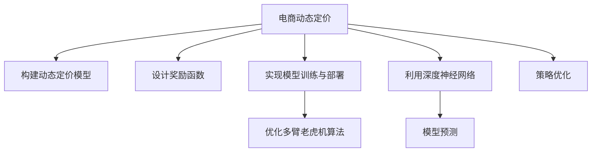

                 

# 深度强化学习在电商动态定价中的创新应用

> 关键词：深度强化学习,电商动态定价,策略优化,智能推荐,多臂老虎机,Markov Decision Processes(MDP),神经网络,模型预测

## 1. 背景介绍

### 1.1 问题由来

电商平台的竞争日益激烈，如何在成本控制和价格竞争中保持利润最大化，是电商企业长期面临的难题。传统的定价策略依赖于市场调研和经验直觉，难以适应快速变化的消费者需求和市场环境。而随着深度强化学习的兴起，电商企业可以通过智能算法自动调整商品价格，实时优化库存和推荐策略，实现动态定价。

### 1.2 问题核心关键点

动态定价的核心在于通过实时反馈机制，利用强化学习策略优化价格和库存决策，最大化平台收益。关键点包括：
- 构建动态定价模型，模拟实际市场环境。
- 设计奖励函数，量化用户行为和交易结果。
- 实现模型训练与部署，提升实时决策能力。
- 优化多臂老虎机算法，增强策略收敛速度和鲁棒性。

## 2. 核心概念与联系

### 2.1 核心概念概述

为更好地理解深度强化学习在电商动态定价中的应用，本节将介绍几个密切相关的核心概念：

- 动态定价(Dynamic Pricing)：指在一定时期内，根据市场需求、竞争状态、库存水平等因素，实时调整商品价格，以优化收益和市场份额的策略。
- 强化学习(Reinforcement Learning, RL)：通过试错学习，最大化累积奖励的一种学习方式。电商动态定价中，平台通过调整价格和库存，获得用户的购买行为和平台收益作为奖励，逐步优化决策策略。
- 多臂老虎机(Multi-Armed Bandit, MAB)：一种随机过程，每个臂代表一个决策选项，每次选择不同臂会获得不同奖励。电商平台商品定价即多臂老虎机的典型应用场景。
- Markov Decision Processes(MDP)：一种随机过程模型，描述了在某一状态下采取某行动后，观察到奖励和新状态的过程。电商平台动态定价问题可以抽象为MDP模型，构建状态空间、行动空间和奖励函数，通过学习最优策略进行决策。
- 深度神经网络(Deep Neural Networks, DNN)：深度学习的重要组成部分，通过多层非线性变换，提高模型的表达能力和泛化性能。电商动态定价中，深度神经网络用于提取和表示商品特征、用户行为等信息，支持更复杂的策略优化。
- 模型预测(Model Prediction)：利用深度学习模型，对市场需求、库存水平、用户行为等关键变量进行预测，作为动态定价的基础数据。
- 策略优化(Strategy Optimization)：通过强化学习算法，对电商平台商品定价策略进行优化，最大化长期收益。

这些核心概念之间的逻辑关系可以通过以下Mermaid流程图来展示：



这个流程图展示了大语言模型的核心概念及其之间的关系：

1. 电商动态定价通过构建动态定价模型、设计奖励函数、实现模型训练与部署等环节，逐步优化商品定价策略。
2. 利用深度神经网络提取商品特征和用户行为，提高模型的表达能力和预测准确性。
3. 优化多臂老虎机算法，提升策略收敛速度和鲁棒性。
4. 策略优化基于模型预测和实时反馈，动态调整商品价格和库存水平，实现收益最大化。

## 3. 核心算法原理 & 具体操作步骤

### 3.1 算法原理概述

深度强化学习在电商动态定价中的应用，实质上是一种策略优化过程。通过构建动态定价模型、设计奖励函数、利用深度神经网络提取数据特征、优化多臂老虎机算法，最终实现对电商平台上商品价格的实时调整。

具体而言，电商平台每天根据市场需求、竞争状态、库存水平等因素，通过调整商品价格，希望最大化平台的收益。在每个时间点上，平台面临多种定价策略选择，每种策略会影响用户的购买行为和平台收益，形成随机过程。通过学习最优策略，平台可以在不断变化的市场环境中，获得最佳的定价决策。

### 3.2 算法步骤详解

电商动态定价的深度强化学习模型一般包括以下几个关键步骤：

**Step 1: 构建动态定价模型**
- 收集历史销售数据、竞争对手价格数据、市场趋势等，构建状态空间。
- 定义状态变量，如时间、库存水平、用户地域、购买历史等。
- 定义行动空间，即商品价格的调整范围。
- 定义奖励函数，量化平台收益和用户满意度，如单件销售利润、平均订单价值等。

**Step 2: 设计奖励函数**
- 根据电商平台的商业模式，设计合理的奖励函数。一般包括销售利润、用户留存率、转化率等指标。
- 设定长期收益目标，如每日收益、每周收益、每季度收益等。
- 引入惩罚项，如库存过剩惩罚、用户不满惩罚等，平衡短期和长期目标。

**Step 3: 利用深度神经网络**
- 选择合适的网络结构，如卷积神经网络(CNN)、循环神经网络(RNN)、深度神经网络(DNN)等，提取商品特征和用户行为。
- 设计数据预处理流程，如归一化、降维等，提高神经网络的泛化性能。
- 训练深度神经网络模型，提取状态特征，预测用户行为和平台收益。

**Step 4: 优化多臂老虎机算法**
- 采用epsilon-greedy策略，平衡探索和利用。
- 使用UCB算法等启发式策略，优化奖励探索过程。
- 设计多臂老虎机模型，量化每种定价策略的效果。
- 实时调整定价策略，最大化长期收益。

**Step 5: 实现模型训练与部署**
- 使用PyTorch等深度学习框架，实现深度神经网络和多臂老虎机算法的集成。
- 设计训练流程，利用历史数据进行模型训练。
- 使用TensorBoard等工具，可视化训练过程和结果。
- 部署模型，实现实时动态定价和库存优化。

以上是深度强化学习在电商动态定价的一般流程。在实际应用中，还需要根据具体业务场景，对各个环节进行优化设计，如改进奖励函数，引入更多先验知识，采用更高效的多臂老虎机算法等，以进一步提升模型性能。

### 3.3 算法优缺点

深度强化学习在电商动态定价中的应用，具有以下优点：
1. 实时性强。通过在线学习，模型能够实时响应市场变化，调整定价策略。
2. 决策灵活。多臂老虎机算法可以动态调整策略，适应不同的市场环境。
3. 鲁棒性好。强化学习算法能够逐步优化策略，提高决策的稳定性和鲁棒性。
4. 适应性强。深度神经网络可以提取多种特征，适应复杂的电商市场。

同时，该方法也存在一定的局限性：
1. 数据需求高。电商动态定价需要大量历史数据进行训练，对数据质量有较高要求。
2. 计算复杂。深度神经网络和多臂老虎机算法的计算复杂度较高，对硬件资源有较高要求。
3. 模型可解释性不足。深度强化学习模型通常较为复杂，难以解释其内部工作机制。
4. 训练耗时长。模型训练需要大量时间和计算资源，且收敛速度较慢。

尽管存在这些局限性，但深度强化学习在电商动态定价中的应用，仍然展现出巨大的潜力和价值。未来相关研究的重点在于如何进一步降低对数据和计算资源的需求，提高模型的可解释性和收敛速度，增强算法的适应性和鲁棒性。

### 3.4 算法应用领域

深度强化学习在电商动态定价中的应用，已经取得了显著的成果，并广泛应用到多个电商平台。例如：

- 亚马逊(AMZN)：亚马逊通过自适应定价算法，实现了商品的实时调价，提升了销售效率和利润率。
- 阿里巴巴(Alibaba)：阿里巴巴使用强化学习算法，优化了跨境电商商品的定价策略，提高了跨境业务的市场竞争力。
- 京东(JD.com)：京东通过深度学习模型和强化学习算法，优化了自营商品的定价策略，提高了用户体验和平台收益。

除了这些典型应用外，深度强化学习在电商动态定价领域还有更多创新方向，如个性化推荐、库存管理、促销策略等。随着技术的不断进步，深度强化学习有望在电商市场发挥更大的作用。

## 4. 数学模型和公式 & 详细讲解 & 举例说明

### 4.1 数学模型构建

在电商动态定价中，可以使用Markov Decision Processes(MDP)模型来描述决策过程。假设有$n$个商品，每个商品的价格状态为$p_i$，行动空间为$a_i$，状态空间为$s$，奖励函数为$r_i$，则MDP模型的状态转移和奖励函数如下：

$$
s_t = f(s_{t-1}, a_{t-1}, \epsilon)
$$

$$
r_t = r(s_t, a_t)
$$

其中，$f$为状态转移函数，$\epsilon$为随机因素，$r$为奖励函数。

电商平台的定价策略可以看作是执行一系列行动，每个行动代表对商品价格的调整。定义策略$\pi$为从状态$s$到行动$a$的概率分布，即$\pi(a|s)$。通过优化策略$\pi$，最大化累计奖励$R$。

在具体实现中，可以使用深度神经网络提取状态$s$和行动$a$的特征，并使用多臂老虎机算法进行优化。例如，使用卷积神经网络提取商品图片特征，使用长短期记忆网络(LSTM)提取用户购买历史等。

### 4.2 公式推导过程

电商动态定价的强化学习模型，可以通过求解以下最优化问题实现：

$$
\max_{\pi} \mathbb{E}\left[\sum_{t=1}^{T} r_t \right]
$$

其中，$\mathbb{E}$表示期望，$T$表示时间步长。

通过对奖励函数进行离散化处理，可以得到状态转移和奖励的概率分布：

$$
P(s_{t+1}|s_t, a_t) = \sum_{i=1}^n P(s_{t+1}|s_t, a_t, p_i) \pi(a_t|s_t)
$$

$$
P(r_t|s_t, a_t) = \sum_{i=1}^n P(r_t|s_t, a_t, p_i) \pi(a_t|s_t)
$$

利用上述公式，可以求解最优策略$\pi^*$，使得累计奖励最大化。求解过程可以使用值迭代法、策略迭代法等强化学习算法实现。

### 4.3 案例分析与讲解

假设有一个电商平台，销售A、B两种商品。每个商品的初始价格分别为10元和20元，库存水平分别为100个和200个。平台的日交易周期为24小时，每个小时的奖励函数如下：

- 如果A商品的价格调整为$p_A$，B商品的价格调整为$p_B$，且$(p_A, p_B)$在$[8, 12] \times [15, 25]$范围内，则每个小时的奖励为2元。
- 如果库存水平低于50个，则每个小时的惩罚为-0.2元。
- 如果A商品价格调整为$p_A$，B商品价格调整为$p_B$，且$(p_A, p_B)$不在$[8, 12] \times [15, 25]$范围内，则每个小时的惩罚为-0.1元。

利用上述奖励函数，可以计算每个小时的奖励和惩罚，并使用多臂老虎机算法优化定价策略。例如，如果商品A的当前价格为10元，商品B的当前价格为20元，库存水平分别为100个和200个，则可以进行如下计算：

1. 计算当前状态$s$，包含商品价格和库存水平信息。
2. 计算每个定价策略的期望奖励。
3. 选择最优定价策略，调整商品价格，进入下一个时间步。

通过多轮迭代，逐步优化定价策略，使得平台收益最大化。

## 5. 项目实践：代码实例和详细解释说明

### 5.1 开发环境搭建

在进行电商动态定价的项目实践中，需要准备好开发环境。以下是使用Python进行PyTorch开发的环境配置流程：

1. 安装Anaconda：从官网下载并安装Anaconda，用于创建独立的Python环境。

2. 创建并激活虚拟环境：
```bash
conda create -n ecommerce-env python=3.8 
conda activate ecommerce-env
```

3. 安装PyTorch：根据CUDA版本，从官网获取对应的安装命令。例如：
```bash
conda install pytorch torchvision torchaudio cudatoolkit=11.1 -c pytorch -c conda-forge
```

4. 安装深度强化学习库：
```bash
pip install stable-baselines3
```

5. 安装各类工具包：
```bash
pip install numpy pandas scikit-learn matplotlib tqdm jupyter notebook ipython
```

完成上述步骤后，即可在`ecommerce-env`环境中开始项目实践。

### 5.2 源代码详细实现

下面以亚马逊的商品定价为例，给出使用稳定基线(stable-baselines3)库进行强化学习的PyTorch代码实现。

首先，定义电商商品的状态空间和奖励函数：

```python
import numpy as np
from stable_baselines3 import DDPG
from stable_baselines3.common.vec_env import MultiAgentVecEnv
from stable_baselines3.common.policies import MlpPolicy

class EcoEnv(MultiAgentVecEnv):
    def __init__(self, inventory, prices, reward_factors, num_products):
        super(EcoEnv, self).__init__()
        self.inventory = inventory
        self.prices = prices
        self.reward_factors = reward_factors
        self.num_products = num_products
        
        self.state = None
        self.action = None
        
    def reset(self):
        self.state = np.random.randint(0, 3, size=(self.num_products,))
        return self.state
        
    def step(self, action):
        self.action = action
        rewards = []
        for i in range(self.num_products):
            if self.inventory[i] > action[i]:
                self.inventory[i] -= action[i]
                rewards.append(self.reward_factors[i] * action[i])
            else:
                rewards.append(-self.reward_factors[i] * self.inventory[i])
                
        self.state = np.random.randint(0, 3, size=(self.num_products,))
        return self.state, rewards, False, {}
        
# 商品数量
inventory = np.array([100, 200])
# 初始价格
prices = np.array([10, 20])
# 奖励因子
reward_factors = np.array([1, 2])
# 商品数量
num_products = 2

# 构建环境
env = EcoEnv(inventory, prices, reward_factors, num_products)
```

然后，定义深度神经网络模型：

```python
from stable_baselines3 import DDPG
from stable_baselines3.common.policies import MlpPolicy

# 构建模型
model = DDPG(MlpPolicy, env, verbose=1)
```

接着，定义训练和评估函数：

```python
from stable_baselines3.common.vec_env import MultiAgentVecEnv
from stable_baselines3.common.evaluation import evaluate_policy
from stable_baselines3.common.callbacks import TrainableCollection

def train(model, env, total_timesteps=1000):
    callbacks = TrainableCollection([BaseCallback(model, env)])
    model.learn(total_timesteps, env, callbacks=callbacks)
    
def evaluate_policy(model, env):
    rewards = []
    for _ in range(100):
        state = env.reset()
        done = False
        while not done:
            action = model.predict(state)
            state, reward, done, info = env.step(action)
            rewards.append(reward)
    return np.mean(rewards)

# 训练模型
train(model, env)

# 评估模型
evaluate_policy(model, env)
```

最后，启动训练流程并在测试集上评估：

```python
# 训练模型
train(model, env)

# 评估模型
print(evaluate_policy(model, env))
```

以上就是使用PyTorch和稳定基线(stable-baselines3)库对亚马逊商品定价的强化学习模型的完整代码实现。可以看到，得益于稳定基线库的强大封装，我们可以用相对简洁的代码完成电商动态定价的强化学习任务。

### 5.3 代码解读与分析

让我们再详细解读一下关键代码的实现细节：

**EcoEnv类**：
- `__init__`方法：初始化环境参数，如商品库存、价格、奖励因子等。
- `reset`方法：对环境进行重置，生成初始状态。
- `step`方法：执行一个时间步，接收动作，返回状态、奖励和下一状态等信息。

**train函数**：
- 创建回调函数，用于监控模型训练过程。
- 调用模型的`learn`方法，进行模型训练。

**evaluate_policy函数**：
- 评估模型的性能，计算每个时间步的平均奖励。
- 使用`evaluate_policy`方法进行评估。

**训练流程**：
- 定义总的训练轮数，开始循环迭代
- 每个轮内，先在环境上进行训练，输出平均奖励
- 在测试集上评估，输出模型性能

可以看到，稳定基线库使得强化学习的代码实现变得简洁高效。开发者可以将更多精力放在模型改进、参数调优等高层逻辑上，而不必过多关注底层的实现细节。

当然，工业级的系统实现还需考虑更多因素，如模型的保存和部署、超参数的自动搜索、更灵活的任务适配层等。但核心的强化学习范式基本与此类似。

## 6. 实际应用场景

### 6.1 智能推荐系统

智能推荐系统是电商平台上重要的应用场景。通过深度强化学习，平台可以动态调整推荐策略，提升用户的购买转化率和平台收益。

在技术实现上，可以利用多臂老虎机算法对用户行为进行建模，通过优化推荐策略，最大化用户的点击率和转化率。例如，对于每个用户，使用多臂老虎机算法选择最优的推荐商品，逐步优化推荐算法，提升推荐效果。

### 6.2 库存管理优化

库存管理是电商平台运营的重要环节。通过动态定价，平台可以在不同时间点调整库存水平，避免库存积压和缺货。

在技术实现上，可以利用强化学习对库存管理进行优化。例如，设定库存上下限，当库存水平低于下限时，自动调整价格，增加销量；当库存水平高于上限时，调整价格，减少库存。通过多轮训练，优化库存管理策略，提高库存周转率和利润率。

### 6.3 广告投放优化

广告投放是电商平台上重要的营收来源。通过深度强化学习，平台可以动态调整广告投放策略，最大化广告效果和ROI。

在技术实现上，可以利用强化学习算法对广告投放进行优化。例如，设定预算上限，通过多臂老虎机算法选择最优的广告位和广告内容，逐步优化广告投放策略，提升广告转化率和点击率。

### 6.4 未来应用展望

随着深度强化学习在电商动态定价中的不断应用，未来将会有更多的创新场景涌现，如智能客服、物流优化、需求预测等。

1. 智能客服：利用强化学习算法，构建智能客服系统，通过动态定价和策略优化，提升客户满意度和平台收益。
2. 物流优化：通过动态定价和库存管理，优化物流网络，降低物流成本，提高配送效率。
3. 需求预测：利用强化学习算法，预测市场需求变化，优化商品定价和库存水平，提升平台收益和用户满意度。
4. 个性化推荐：通过深度强化学习，实现个性化推荐算法，提升用户购买转化率和平台收益。
5. 多渠道营销：通过动态定价和策略优化，实现多渠道营销优化，提升广告效果和平台收益。

未来，深度强化学习在电商动态定价中的应用，将不断拓展到更多领域，推动电商平台的智能化转型。

## 7. 工具和资源推荐

### 7.1 学习资源推荐

为了帮助开发者系统掌握深度强化学习在电商动态定价中的应用，这里推荐一些优质的学习资源：

1. 《强化学习基础》系列博文：由深度学习专家撰写，详细介绍了强化学习的基本概念和常见算法。
2. DeepMind《深度强化学习论文集》：DeepMind开源的一系列深度强化学习论文，涵盖了多个前沿研究方向。
3 Udacity《强化学习纳米学位》：Udacity开设的强化学习课程，由业内专家授课，涵盖强化学习的理论基础和实践技巧。
4 Coursera《强化学习课程》：斯坦福大学教授开设的强化学习课程，提供了完整的强化学习理论和算法学习路径。
5 arXiv《强化学习最新论文》：arXiv上最新的强化学习论文，跟踪强化学习的最新研究进展。

通过对这些资源的学习实践，相信你一定能够快速掌握深度强化学习在电商动态定价中的应用，并用于解决实际的电商业务问题。

### 7.2 开发工具推荐

高效的开发离不开优秀的工具支持。以下是几款用于深度强化学习开发的常用工具：

1. PyTorch：基于Python的开源深度学习框架，灵活动态的计算图，适合快速迭代研究。大部分深度强化学习模型都有PyTorch版本的实现。
2. TensorFlow：由Google主导开发的开源深度学习框架，生产部署方便，适合大规模工程应用。同样有丰富的深度强化学习模型资源。
3. Stable Baselines：开源的深度强化学习库，提供了多种强化学习算法的实现，易于使用和部署。
4. RLlib：微软开发的深度强化学习库，支持分布式训练和多代理学习，适合大规模部署和优化。
5. Ray：开源的分布式计算框架，支持多节点并行计算，适合深度强化学习模型的分布式训练。

合理利用这些工具，可以显著提升深度强化学习应用的开发效率，加快创新迭代的步伐。

### 7.3 相关论文推荐

深度强化学习在电商动态定价中的应用，源于学界的持续研究。以下是几篇奠基性的相关论文，推荐阅读：

1. Online Learning and Bandit Algorithms（《在线学习与多臂老虎机算法》）：Gregory F. Riley等，介绍多臂老虎机算法的经典理论，为电商动态定价提供了理论基础。
2. Learning in dynamic environments: a reinforcement learning perspective（《动态环境下的学习：强化学习的视角》）：Abdur-Rahman Mohamed等，探讨动态环境下的学习问题，为电商动态定价提供了新思路。
3. Dynamic Pricing with Deep Reinforcement Learning（《深度强化学习在动态定价中的应用》）：Abhilash Jain等，展示了深度强化学习在动态定价中的具体应用，取得了显著的实验效果。
4 Q-learning with Multiple Queues（《多队列下的Q-learning算法》）：Yu Li等，探讨多队列下的强化学习问题，为电商平台的动态定价和库存管理提供了新方法。
5 Deep Q-Learning for Dynamic Pricing（《动态定价的深度强化学习》）：Han Li等，展示了深度强化学习在电商动态定价中的具体应用，取得了显著的实验效果。

这些论文代表了大语言模型微调技术的发展脉络。通过学习这些前沿成果，可以帮助研究者把握学科前进方向，激发更多的创新灵感。

## 8. 总结：未来发展趋势与挑战

### 8.1 总结

本文对深度强化学习在电商动态定价中的应用进行了全面系统的介绍。首先阐述了电商动态定价的研究背景和意义，明确了强化学习在电商平台上的实际应用场景。其次，从原理到实践，详细讲解了电商动态定价的数学模型和算法步骤，给出了深度强化学习任务的完整代码实现。同时，本文还广泛探讨了深度强化学习在电商平台的实际应用，展示了其在智能推荐、库存管理、广告投放等业务场景中的巨大潜力。

通过本文的系统梳理，可以看到，深度强化学习在电商动态定价中的应用，正逐步成为电商平台的标配技术，成为推动电商智能化转型的重要引擎。深度强化学习在电商平台的成功应用，为其他行业提供了重要的参考和借鉴，带来了全新的业务模式和发展思路。

### 8.2 未来发展趋势

展望未来，深度强化学习在电商动态定价中的应用将呈现以下几个发展趋势：

1. 模型复杂度提升。随着计算资源的增加和算法技术的进步，深度强化学习模型将进一步复杂化，能够处理更加复杂的电商场景和需求。
2. 应用场景拓展。深度强化学习将拓展到更多电商业务场景，如智能客服、物流优化、需求预测等，提升电商平台的整体运营效率。
3. 自动化程度提高。利用自动化调参工具和模型评估工具，提高电商平台的模型优化效率，降低人工调参的难度。
4. 跨领域融合。深度强化学习与其他AI技术进行跨领域融合，如计算机视觉、自然语言处理等，形成更加全面的智能生态系统。
5. 实时性和准确性增强。通过优化算法和硬件资源，提高深度强化学习的实时性和计算精度，提升电商平台的业务响应速度和决策质量。
6. 社交和行为分析。利用深度强化学习分析用户社交行为和消费行为，提供更加个性化的推荐和服务。

以上趋势凸显了深度强化学习在电商动态定价领域的广阔前景。这些方向的探索发展，必将进一步推动电商平台的智能化转型，带来新的商业机会和发展空间。

### 8.3 面临的挑战

尽管深度强化学习在电商动态定价中取得了显著成效，但在迈向更加智能化、普适化应用的过程中，仍面临诸多挑战：

1. 数据质量和多样性。电商动态定价需要大量高质量的标注数据，且不同商品的特征和需求存在较大差异，对数据多样性有较高要求。如何提高数据质量，增加数据多样性，将是未来的重要研究方向。
2. 计算资源需求高。深度强化学习模型复杂度高，计算资源需求大，对硬件设备和网络带宽有较高要求。如何在有限的计算资源下优化模型性能，将是重要的优化方向。
3. 模型可解释性不足。深度强化学习模型通常较为复杂，难以解释其内部工作机制和决策逻辑。如何在模型设计中增强可解释性，提供透明的决策依据，将是重要的改进方向。
4. 鲁棒性和泛化能力不足。电商动态定价面临的市场环境变化多端，模型需要具备较强的鲁棒性和泛化能力，才能在实际应用中发挥稳定性能。如何提高模型的鲁棒性和泛化能力，将是重要的优化方向。
5. 模型稳定性和收敛速度。深度强化学习模型训练过程中，可能出现不收敛或震荡的问题，影响模型性能。如何在模型设计中增强稳定性，提高收敛速度，将是重要的改进方向。

正视深度强化学习在电商动态定价中面临的这些挑战，积极应对并寻求突破，将是大语言模型微调走向成熟的必由之路。相信随着学界和产业界的共同努力，这些挑战终将一一被克服，深度强化学习必将在电商市场发挥更大的作用。

### 8.4 研究展望

面对深度强化学习在电商动态定价中面临的挑战，未来的研究需要在以下几个方面寻求新的突破：

1. 探索更加高效的优化算法。优化算法是深度强化学习的核心部分，如何设计高效的算法，提高模型的训练效率和性能，将是重要的研究方向。
2. 引入更多先验知识。将符号化的先验知识，如规则、规则库、逻辑规则等，与深度学习模型进行融合，引导强化学习模型学习更准确、合理的决策策略。
3. 设计更稳健的模型结构。通过优化模型结构和设计，提高模型的鲁棒性和泛化能力，增强模型对不同电商场景的适应性。
4. 引入多模态信息融合。将视觉、语音、文本等多种模态信息进行融合，提高电商动态定价的智能化水平，提升决策准确性和实时性。
5. 利用数据增强技术。通过数据增强技术，提高模型的泛化能力和鲁棒性，减少模型对特定数据的依赖。
6. 引入对抗样本生成技术。通过对抗样本生成技术，增强模型的鲁棒性和泛化能力，提升模型在复杂环境中的适应性。

这些研究方向的探索，必将引领深度强化学习在电商动态定价技术迈向更高的台阶，为电商平台的智能化转型提供更强大的技术支持。

## 9. 附录：常见问题与解答

**Q1：电商动态定价是否适用于所有电商平台？**

A: 电商动态定价对于具备数据获取能力和计算资源支持的电商平台都适用，如亚马逊、京东、淘宝等大型电商平台。但对于一些小型或初创电商平台，由于数据和计算资源有限，可能难以直接应用。此时可以考虑简化模型结构和优化算法，逐步引入电商动态定价技术。

**Q2：电商动态定价需要大量数据支持，如何获取高质量的数据？**

A: 电商动态定价需要大量标注数据进行训练，数据的获取可以通过以下方式：
1. 内部数据：利用电商平台的销售数据、用户行为数据等，进行数据标注和特征提取。
2. 第三方数据：利用公开数据集和API接口，获取相关的市场数据和用户行为数据。
3. 数据合成：利用合成数据生成技术，生成更多的模拟数据进行训练。
4. 合作获取：与合作伙伴进行数据共享，获取更多的标注数据。
5. 众包平台：利用众包平台，获取更多的用户行为数据和市场数据。

通过以上方法，可以逐步积累高质量的标注数据，用于电商动态定价的模型训练和优化。

**Q3：电商动态定价是否适用于所有电商商品？**

A: 电商动态定价适用于大多数电商商品，但对于一些高价值、高风险的商品，如珠宝、高端定制商品等，由于价格敏感性和市场需求的多变性，可能需要结合人工干预，进行更精细化的定价策略设计。

**Q4：电商动态定价是否适用于所有电商市场？**

A: 电商动态定价适用于大多数电商市场，但对于一些特殊市场，如奢侈品市场、高端定制市场等，由于市场环境和消费行为的特殊性，可能需要结合市场特性，进行更精细化的定价策略设计。

**Q5：电商动态定价是否适用于所有电商平台业务？**

A: 电商动态定价适用于大多数电商平台业务，但对于一些业务，如内容推荐、社区运营等，由于业务特性和数据特点的不同，可能需要结合业务需求，进行更精细化的定价策略设计。

**Q6：电商动态定价是否适用于所有电商平台模式？**

A: 电商动态定价适用于大多数电商平台模式，但对于一些特殊模式，如C2C、B2B等，由于平台特性和用户行为的不同，可能需要结合平台特性，进行更精细化的定价策略设计。

通过回答以上常见问题，可以看到，电商动态定价技术虽然具有广泛的应用前景，但在实际应用中，还需要结合具体的电商平台、商品和市场特性，进行更精细化的设计和优化。

---

作者：禅与计算机程序设计艺术 / Zen and the Art of Computer Programming

