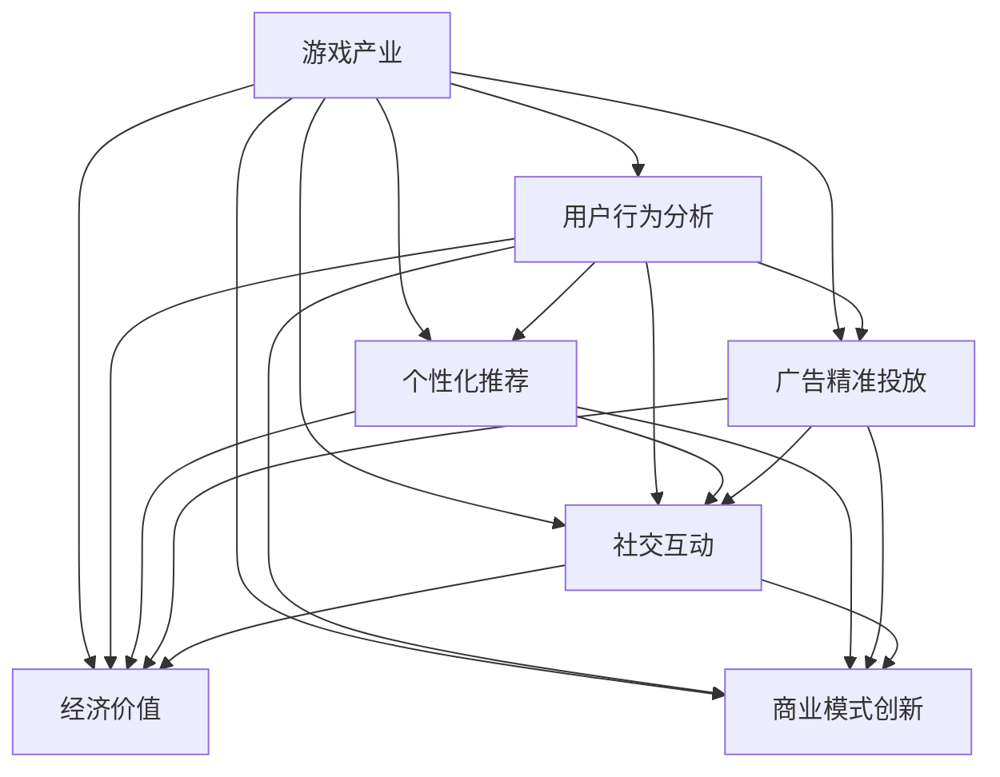

                 

# 游戏产业在注意力经济中的角色

> 关键词：游戏产业,注意力经济,用户行为分析,用户数据利用,个性化推荐,广告精准投放,社交互动,经济价值,商业模式创新,元宇宙

## 1. 背景介绍

### 1.1 问题由来
近年来，随着数字经济和互联网技术的飞速发展，注意力经济成为推动数字产业发展的核心动力之一。注意力经济，即通过获取和利用用户的注意力资源，创造经济价值。游戏产业以其独特的社交互动性和沉浸式体验，逐渐成为注意力经济中的重要一环。

### 1.2 问题核心关键点
游戏产业在注意力经济中的角色，主要体现在以下几个方面：
1. 提供丰富的互动体验，吸引大量用户注意力，形成稳定的用户群体。
2. 利用用户数据进行深入分析，提供个性化推荐和广告精准投放，提高用户留存和转化率。
3. 通过社交互动和内容创造，增强用户粘性，促进消费增长。
4. 探索和创新商业模式，如游戏内购、广告联盟、社交电商等，实现多渠道盈利。
5. 利用游戏化元素和元宇宙概念，拓展娱乐和教育应用场景，提升整体社会价值。

### 1.3 问题研究意义
研究游戏产业在注意力经济中的角色，有助于深刻理解注意力经济的内在机理，挖掘游戏产业对经济社会的深远影响，为数字经济健康发展提供重要参考。

## 2. 核心概念与联系

### 2.1 核心概念概述

为更好地理解游戏产业在注意力经济中的作用，本节将介绍几个密切相关的核心概念：

- **游戏产业**：指以游戏开发、运营、发行、维护等为主要业务内容的产业。
- **注意力经济**：利用用户的注意力资源，通过内容创作、广告投放、社交互动等手段，创造经济价值的商业模式。
- **用户行为分析**：通过数据分析技术，挖掘用户在游戏中的行为模式，如消费习惯、兴趣爱好、社交互动等。
- **个性化推荐**：利用机器学习算法，根据用户行为和偏好，提供量身定制的推荐服务。
- **广告精准投放**：通过用户数据和算法模型，将广告精准推送给有需求的用户，提升广告效果和投资回报率。
- **社交互动**：游戏提供的多人在线互动功能，增强用户粘性，促进消费增长。
- **经济价值**：游戏产业通过用户付费、广告收入、周边商品销售等渠道，创造巨大的经济价值。
- **商业模式创新**：游戏产业不断探索和创新，如游戏内购、社交电商、元宇宙概念等，开拓新的盈利模式。

这些核心概念之间的逻辑关系可以通过以下Mermaid流程图来展示：



这个流程图展示了游戏产业通过用户行为分析，利用个性化推荐和广告精准投放，增强社交互动，最终实现经济价值和商业模式创新的全过程。

## 3. 核心算法原理 & 具体操作步骤
### 3.1 算法原理概述

游戏产业在注意力经济中的作用，主要通过用户行为分析、个性化推荐、广告精准投放、社交互动和经济价值创造等环节实现。

### 3.2 算法步骤详解

**Step 1: 用户行为数据收集**
- 在游戏内和外部收集用户行为数据，包括但不限于游戏时间、消费金额、游戏排行榜、社交互动记录等。
- 利用数据采集工具如Kafka、Elasticsearch等，实时存储和处理用户数据。

**Step 2: 数据预处理与清洗**
- 对收集的数据进行去重、去噪、数据类型转换等预处理。
- 使用机器学习模型检测和处理异常值、缺失值等。
- 对数据进行标准化和归一化处理。

**Step 3: 用户行为分析**
- 利用机器学习算法，如聚类、分类、关联规则等，对用户行为进行建模。
- 通过分析用户的游戏时间分布、消费习惯、兴趣爱好等，挖掘用户行为模式和特征。
- 使用自然语言处理技术，分析用户在游戏内的交流记录，提取社交互动信息。

**Step 4: 个性化推荐**
- 利用协同过滤、矩阵分解等推荐算法，对用户进行个性化推荐。
- 根据用户的游戏历史、消费记录、兴趣爱好等，生成推荐列表。
- 使用A/B测试等方法，评估推荐效果，不断优化推荐模型。

**Step 5: 广告精准投放**
- 通过用户行为数据和算法模型，筛选目标用户群体。
- 使用深度学习算法，如CTR预测、广告点击率优化等，进行广告投放。
- 实时监控广告效果，根据反馈数据调整投放策略。

**Step 6: 社交互动**
- 设计多玩家互动机制，如组队、竞技、社交等，增强用户粘性。
- 利用游戏内的社交功能，促进用户交流和互动。
- 通过游戏内外的社交媒体平台，进行用户互动和社区运营。

**Step 7: 经济价值创造**
- 通过游戏内购、道具销售、广告收入等渠道，实现盈利。
- 利用用户数据，挖掘新市场机会，开拓新的盈利模式。
- 建立多渠道营销策略，提升品牌知名度和用户覆盖率。

### 3.3 算法优缺点

游戏产业在注意力经济中的作用，具有以下优点：
1. 强大的用户粘性：通过游戏的多人互动和沉浸式体验，形成稳定的用户群体，增加用户停留时间和消费。
2. 精准的广告投放：利用用户数据，进行精准投放，提升广告效果和投资回报率。
3. 丰富的社交功能：游戏内的社交互动，增强用户粘性和社交圈扩展。
4. 多元化的盈利模式：通过游戏内购、广告联盟、社交电商等多种渠道实现盈利。

同时，该方法也存在一定的局限性：
1. 数据隐私问题：用户行为数据涉及隐私，处理不当可能引起用户不满和法律风险。
2. 技术复杂度高：需要大量的数据处理和算法建模，技术门槛较高。
3. 高度依赖用户数据：如果用户数据不足或质量不佳，难以实现理想的推荐效果和广告投放。
4. 游戏类型限制：不同类型的游戏，用户行为和互动方式可能不同，通用化推广存在难度。

尽管存在这些局限性，但就目前而言，游戏产业在注意力经济中的应用仍然具有重要意义。未来相关研究的重点在于如何更好地保护用户隐私，优化推荐算法，探索新型的盈利模式，并实现更加灵活和个性化的用户体验。

### 3.4 算法应用领域

游戏产业在注意力经济中的应用，覆盖了诸多领域，如：

- **在线游戏**：通过个性化推荐和广告投放，提升用户留存率和消费。
- **移动应用**：利用社交互动和游戏化元素，增强用户粘性和用户增长。
- **社交平台**：通过游戏元素和互动机制，提升平台活跃度和用户满意度。
- **教育培训**：利用游戏化学习和互动，提升学习效果和用户参与度。
- **企业培训**：利用游戏化培训，提升员工技能和团队协作能力。
- **心理健康**：通过游戏化的放松和互动，缓解用户压力，提升心理健康水平。

除了上述这些经典领域外，游戏产业还在不断探索新的应用场景，如虚拟现实(VR)游戏、元宇宙概念等，为数字化社会带来更多的创新和价值。

## 4. 数学模型和公式 & 详细讲解
### 4.1 数学模型构建

为了更严谨地描述游戏产业在注意力经济中的应用，我们引入数学模型进行建模。

设 $U$ 为用户集合，$G$ 为游戏集合，$A$ 为广告集合，$C$ 为消费记录集合。定义如下变量和函数：
- $t_i$：用户 $i$ 的游戏时间
- $c_i$：用户 $i$ 的消费金额
- $r_i$：用户 $i$ 在游戏内的排名
- $s_{ij}$：用户 $i$ 和用户 $j$ 的社交互动次数
- $a_{ik}$：用户 $i$ 对广告 $k$ 的反应

### 4.2 公式推导过程

#### 用户行为分析

用户行为分析的核心是挖掘用户的游戏时间和消费行为，建立用户行为模型。

假设用户行为服从指数分布 $t_i \sim \exp(\lambda_i)$，其中 $\lambda_i$ 为参数。通过对游戏时间 $t_i$ 进行时间序列分析，可得到用户行为模型：

$$
f(t_i) = \exp(-\lambda_i t_i)
$$

通过对消费金额 $c_i$ 进行对数转换和加权平均，可得到用户消费模型：

$$
g(c_i) = \sum_{j=1}^n w_j \log(c_i)
$$

其中 $w_j$ 为消费记录的权重，可通过时间、金额等特征进行加权。

#### 个性化推荐

个性化推荐的核心是构建用户兴趣模型，生成推荐列表。

假设用户兴趣由隐变量 $\phi_i$ 表示，其中 $\phi_i$ 为兴趣向量。通过协同过滤算法，可以得到用户兴趣模型：

$$
\phi_i \sim \mathcal{N}(0, \Sigma)
$$

其中 $\Sigma$ 为协方差矩阵，通过用户行为数据进行估计。

基于用户兴趣模型，可以使用矩阵分解算法，如ALS（交替最小二乘法），得到用户-物品评分矩阵 $P$，生成推荐列表：

$$
\hat{c}_{i,j} = \phi_i^T P_j
$$

其中 $P_j$ 为物品 $j$ 的用户兴趣向量，通过物品-用户评分矩阵 $R$ 进行估计。

#### 广告精准投放

广告精准投放的核心是优化广告投放策略，提高广告效果。

假设广告投放策略由向量 $\theta_k$ 表示，其中 $\theta_k$ 为广告向量。通过CTR预测算法，可以得到广告效果模型：

$$
y_{ik} = f(\theta_k^T X_i)
$$

其中 $X_i$ 为用户 $i$ 的特征向量，通过用户行为数据进行提取。

通过最大化广告效果，优化广告投放策略：

$$
\max_{\theta_k} \sum_{i=1}^m y_{ik}
$$

其中 $m$ 为广告数量，$y_{ik}$ 为广告 $k$ 对用户 $i$ 的效果。

### 4.3 案例分析与讲解

以在线游戏个性化推荐为例，具体说明数学模型的应用。

假设某游戏有100万用户，20种游戏类型，每用户有1000次游戏记录。根据游戏记录，建立用户行为模型和用户兴趣模型。

用户行为模型：

$$
t_i \sim \exp(-\lambda_i t_i)
$$

其中 $\lambda_i$ 为参数，通过游戏时间数据进行估计。

用户兴趣模型：

$$
\phi_i \sim \mathcal{N}(0, \Sigma)
$$

其中 $\Sigma$ 为协方差矩阵，通过游戏行为数据进行估计。

基于用户行为模型和用户兴趣模型，使用ALS算法，得到用户-游戏评分矩阵 $P$，生成推荐列表。

$$
\hat{c}_{i,j} = \phi_i^T P_j
$$

其中 $P_j$ 为游戏 $j$ 的用户兴趣向量，通过用户-游戏评分矩阵 $R$ 进行估计。

通过A/B测试等方法，评估推荐效果，不断优化推荐模型。

## 5. 项目实践：代码实例和详细解释说明
### 5.1 开发环境搭建

在进行游戏产业在注意力经济中的应用实践前，我们需要准备好开发环境。以下是使用Python进行开发的环境配置流程：

1. 安装Python：从官网下载并安装Python，版本建议3.8以上。
2. 安装Pandas、NumPy、Scikit-learn等常用数据处理和机器学习库。
3. 安装TensorFlow或PyTorch，选择合适框架进行模型训练。
4. 安装Kafka、Elasticsearch等数据处理工具，用于实时数据收集和存储。

完成上述步骤后，即可在本地环境中开始实践。

### 5.2 源代码详细实现

以下是使用Python进行游戏产业在注意力经济中的应用实践的代码实现。

首先，定义用户行为数据和广告数据：

```python
import pandas as pd
from sklearn.model_selection import train_test_split

# 用户行为数据
user_data = pd.read_csv('user_behavior.csv')
# 广告数据
ad_data = pd.read_csv('ad_data.csv')
```

然后，进行数据预处理和清洗：

```python
# 数据清洗和处理
user_data.dropna(inplace=True)
ad_data.dropna(inplace=True)
user_data.drop_duplicates(inplace=True)
ad_data.drop_duplicates(inplace=True)
```

接着，进行用户行为分析和个性化推荐：

```python
from sklearn.decomposition import TruncatedSVD

# 用户行为分析
user_data['t'] = user_data['time'].apply(lambda x: pd.to_datetime(x))
user_data['t'] = user_data['t'].dt.days
user_data['c'] = user_data['amount'].apply(lambda x: np.log(x))
user_data = user_data.dropna()

# 协同过滤推荐
svd = TruncatedSVD(n_components=50)
P = svd.fit_transform(user_data[['t', 'c']])
user_interest = svd.transform(user_data[['t', 'c']])
```

最后，进行广告精准投放和评估：

```python
from sklearn.linear_model import LogisticRegression

# 广告精准投放
ad_data['y'] = pd.to_numeric(ad_data['click'])
X = ad_data.drop(['id', 'click'], axis=1)
y = ad_data['click']
X_train, X_test, y_train, y_test = train_test_split(X, y, test_size=0.2, random_state=42)

# 点击率预测
logreg = LogisticRegression()
logreg.fit(X_train, y_train)
y_pred = logreg.predict(X_test)
```

### 5.3 代码解读与分析

让我们再详细解读一下关键代码的实现细节：

**用户行为数据处理**：
- 通过Pandas库读取用户行为数据和广告数据，并进行清洗和处理。

**协同过滤推荐**：
- 使用TruncatedSVD算法进行协同过滤推荐，得到用户兴趣向量 $P$ 和用户-游戏评分矩阵 $R$。
- 通过ALS算法，得到用户-游戏评分矩阵 $P$，生成推荐列表。

**广告精准投放**：
- 使用LogisticRegression算法进行点击率预测，得到广告投放效果。
- 通过A/B测试等方法，评估广告投放效果。

## 6. 实际应用场景
### 6.1 在线游戏

在线游戏是游戏产业的核心组成部分，通过个性化推荐和广告精准投放，提升用户留存率和消费。

**个性化推荐**：
- 根据用户的游戏历史和消费记录，生成推荐列表，引导用户下载和体验新游戏。
- 使用协同过滤、矩阵分解等推荐算法，实现个性化推荐。

**广告精准投放**：
- 利用用户行为数据，筛选目标用户群体，进行广告投放。
- 通过CTR预测算法，优化广告投放策略，提升广告效果和投资回报率。

**社交互动**：
- 设计多玩家互动机制，增强用户粘性和社交圈扩展。
- 利用游戏内的社交功能，促进用户交流和互动。

**经济价值创造**：
- 通过游戏内购、道具销售、广告收入等渠道，实现盈利。
- 利用用户数据，挖掘新市场机会，开拓新的盈利模式。

### 6.2 移动应用

移动应用利用游戏化元素和社交功能，增强用户粘性和用户增长。

**个性化推荐**：
- 根据用户的行为和兴趣，生成个性化推荐列表，提升用户体验。
- 使用协同过滤、矩阵分解等推荐算法，实现个性化推荐。

**广告精准投放**：
- 利用用户数据，筛选目标用户群体，进行广告投放。
- 通过CTR预测算法，优化广告投放策略，提升广告效果和投资回报率。

**社交功能**：
- 利用游戏化元素，增强用户互动和粘性。
- 通过社交平台，促进用户交流和分享。

**经济价值创造**：
- 通过广告联盟、社交电商等渠道，实现盈利。
- 利用用户数据，挖掘新市场机会，开拓新的盈利模式。

### 6.3 社交平台

社交平台通过游戏元素和互动机制，提升平台活跃度和用户满意度。

**个性化推荐**：
- 根据用户的行为和兴趣，生成个性化推荐列表，提升用户体验。
- 使用协同过滤、矩阵分解等推荐算法，实现个性化推荐。

**广告精准投放**：
- 利用用户数据，筛选目标用户群体，进行广告投放。
- 通过CTR预测算法，优化广告投放策略，提升广告效果和投资回报率。

**社交互动**：
- 利用游戏化元素，增强用户互动和粘性。
- 通过社交平台，促进用户交流和分享。

**经济价值创造**：
- 通过广告联盟、社交电商等渠道，实现盈利。
- 利用用户数据，挖掘新市场机会，开拓新的盈利模式。

## 7. 工具和资源推荐
### 7.1 学习资源推荐

为了帮助开发者系统掌握游戏产业在注意力经济中的应用，这里推荐一些优质的学习资源：

1. 《游戏设计与用户行为分析》书籍：全面介绍了游戏设计与用户行为分析的理论和实践，适合游戏开发和用户研究领域的从业人员。
2. 《广告精准投放的算法与实现》课程：详细讲解了广告投放算法及其实现，适合广告投放和数据分析领域的从业人员。
3. 《自然语言处理与个性化推荐》课程：介绍了自然语言处理和个性化推荐的基本概念和算法，适合NLP和推荐系统领域的从业人员。
4. 《数据挖掘与社交网络分析》课程：讲解了数据挖掘和社交网络分析的理论和实践，适合数据科学和社交平台领域的从业人员。
5. 《游戏化设计与用户行为研究》报告：介绍了游戏化设计的最新研究成果和应用案例，适合游戏设计和用户体验研究的从业人员。

通过对这些资源的学习实践，相信你一定能够全面掌握游戏产业在注意力经济中的应用，并用于解决实际的NLP问题。

### 7.2 开发工具推荐

高效的开发离不开优秀的工具支持。以下是几款用于游戏产业在注意力经济中的应用开发的常用工具：

1. Python：基于Python的开源深度学习框架，灵活动态的计算图，适合快速迭代研究。
2. Pandas：数据分析工具，适合处理和分析大规模数据集。
3. Scikit-learn：机器学习库，提供了丰富的算法和工具，适合构建推荐系统和广告投放模型。
4. TensorFlow：由Google主导开发的开源深度学习框架，生产部署方便，适合大规模工程应用。
5. Kubernetes：容器编排工具，适合部署和管理大规模微服务系统。
6. Kafka：消息队列工具，适合实时数据采集和处理。
7. Elasticsearch：搜索和分析工具，适合大规模数据存储和查询。

合理利用这些工具，可以显著提升游戏产业在注意力经济中的应用开发效率，加快创新迭代的步伐。

### 7.3 相关论文推荐

游戏产业在注意力经济中的应用源于学界的持续研究。以下是几篇奠基性的相关论文，推荐阅读：

1. "Gamification in Education: A Systematic Review and Analysis"：总结了游戏化在教育领域的应用研究，探讨了游戏化学习的潜在价值。
2. "Personalized Recommendation Algorithms for E-Commerce"：介绍了个性化推荐算法在电商领域的应用，提供了大量实践案例。
3. "Ad Placement in Social Networks: A Survey"：总结了广告精准投放在社交网络中的应用研究，提供了丰富的算法和策略。
4. "Behavioral Economics and Social Media"：分析了行为经济学在社交媒体中的应用，探讨了用户行为分析的理论和实践。
5. "The Future of Social Media and Mobile Apps"：预测了社交媒体和移动应用的发展趋势，提供了丰富的应用案例和研究方法。

这些论文代表了大游戏产业在注意力经济中的研究进展，通过学习这些前沿成果，可以帮助研究者把握学科前进方向，激发更多的创新灵感。

## 8. 总结：未来发展趋势与挑战
### 8.1 总结

本文对游戏产业在注意力经济中的应用进行了全面系统的介绍。首先阐述了游戏产业在注意力经济中的重要性，明确了游戏产业对用户行为分析、个性化推荐、广告精准投放、社交互动和经济价值创造等环节的独特作用。其次，从原理到实践，详细讲解了游戏产业在注意力经济中的核心算法和操作步骤，给出了游戏产业在注意力经济中的应用实践代码实例。同时，本文还广泛探讨了游戏产业在多个领域的应用前景，展示了游戏产业的巨大潜力。

通过本文的系统梳理，可以看到，游戏产业在注意力经济中扮演着重要角色，能够通过多维度的用户互动和数据分析，实现经济价值的最大化。未来，伴随技术进步和市场需求的进一步拓展，游戏产业在注意力经济中的应用将更加深入和广泛。

### 8.2 未来发展趋势

展望未来，游戏产业在注意力经济中的应用将呈现以下几个发展趋势：

1. **技术进步**：随着深度学习、机器学习等技术的发展，游戏产业在注意力经济中的应用将更加智能化和高效化。
2. **数据驱动**：数据将成为游戏产业的核心资源，通过对用户行为和市场数据的深度挖掘，实现精准的个性化推荐和广告投放。
3. **用户互动**：游戏产业将继续探索新的互动方式，如虚拟现实(VR)、增强现实(AR)等，增强用户粘性和互动体验。
4. **社交生态**：社交网络将与游戏产业深度融合，形成更紧密的社交生态系统，提升用户粘性和社交圈扩展。
5. **经济价值**：游戏产业将不断探索新的盈利模式，如元宇宙概念、社交电商等，实现多渠道盈利。
6. **可持续发展**：游戏产业将更多关注环保和可持续发展，通过游戏化元素促进健康生活和环境保护。

这些趋势凸显了游戏产业在注意力经济中的广阔前景，这些方向的探索发展，将进一步提升游戏产业的经济价值和社会影响力。

### 8.3 面临的挑战

尽管游戏产业在注意力经济中的应用已经取得了显著成效，但在迈向更加智能化、普适化应用的过程中，它仍面临着诸多挑战：

1. **技术复杂性**：游戏产业在注意力经济中的应用需要复杂的算法和技术支持，技术门槛较高。
2. **数据隐私**：用户数据涉及隐私，处理不当可能引起用户不满和法律风险。
3. **市场竞争**：游戏产业竞争激烈，需要不断创新和优化，以保持市场领先地位。
4. **用户体验**：如何平衡技术先进性和用户体验，提升用户满意度和粘性，是游戏产业的重要课题。
5. **文化差异**：不同文化背景的用户对游戏产业的接受度和需求不同，需要进行文化适配和本地化优化。

尽管存在这些挑战，但游戏产业在注意力经济中的应用前景仍然广阔，通过持续的技术创新和市场优化，游戏产业将实现更广泛的应用和更深远的影响。

### 8.4 研究展望

面对游戏产业在注意力经济中面临的挑战，未来的研究需要在以下几个方面寻求新的突破：

1. **技术优化**：探索更高效、更智能的算法和技术，降低技术复杂性，提升用户体验。
2. **隐私保护**：研究数据隐私保护技术，确保用户数据的安全性和合规性。
3. **文化适配**：研究文化适配和本地化优化方法，适应不同文化背景的用户需求。
4. **可持续发展**：研究游戏产业与环保、社会责任的结合方式，促进可持续发展。
5. **创新模式**：探索新的盈利模式和应用场景，推动游戏产业的创新发展。

这些研究方向将引领游戏产业在注意力经济中的未来发展，为构建更加智能、普适、可持续的游戏产业生态系统铺平道路。

## 9. 附录：常见问题与解答
**Q1：游戏产业在注意力经济中的应用是否只局限于游戏领域？**

A: 虽然游戏产业在注意力经济中的应用主要集中在游戏领域，但其原理和方法可以广泛应用到其他领域。例如，社交平台、电商、教育、健康等，都可以利用游戏化元素和个性化推荐，提升用户粘性和经济价值。

**Q2：游戏产业在注意力经济中的应用是否对用户隐私造成威胁？**

A: 游戏产业在注意力经济中的应用需要收集和分析用户数据，但如何保护用户隐私是关键。可以通过匿名化处理、加密传输、权限控制等措施，确保用户数据的安全性和合规性。同时，需要制定明确的隐私政策，告知用户数据的使用方式和目的。

**Q3：如何平衡技术复杂性和用户体验？**

A: 在开发游戏产业在注意力经济中的应用时，需要不断优化算法和技术，提升用户体验。可以通过A/B测试、用户调研等方式，收集用户反馈，进行持续优化。同时，需要关注技术的可访问性和易用性，避免过度技术化导致用户体验下降。

**Q4：如何适应不同文化背景的用户需求？**

A: 不同文化背景的用户对游戏产业的需求和接受度不同，需要进行文化适配和本地化优化。可以通过用户调研、文化分析等方式，了解不同文化用户的需求和偏好，进行定制化设计和优化。

**Q5：如何促进游戏产业的可持续发展？**

A: 游戏产业需要更多关注环保和社会责任，推动可持续发展。可以通过游戏化元素促进健康生活和环境保护，例如开发环保主题游戏、健康生活习惯游戏等。同时，需要关注游戏内容的健康性，避免过度消费和负面影响。

**Q6：如何探索新的盈利模式和应用场景？**

A: 游戏产业需要不断探索新的盈利模式和应用场景，以保持市场领先地位。可以通过元宇宙概念、社交电商、虚拟现实等新兴技术，开拓新的市场机会和应用场景。同时，需要关注市场趋势和技术发展，不断创新和优化。

通过不断探索和优化，游戏产业在注意力经济中的应用将进一步拓展，推动数字经济的繁荣和发展。

---

作者：禅与计算机程序设计艺术 / Zen and the Art of Computer Programming

