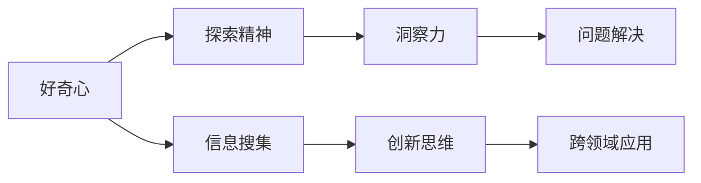

                 

# 理解洞察力的培养：鼓励好奇心和探索精神

## 1. 背景介绍

在快速发展的科技世界中，洞察力被视为一种稀缺而宝贵的技能。它不仅能够帮助我们更好地理解复杂现象，还能驱动创新和决策。但如何培养和发展这种洞察力？本文将深入探讨这一问题，并提出几种促进好奇心和探索精神的方法，帮助开发者和技术人员提高他们的洞察力。

## 2. 核心概念与联系

### 2.1 核心概念概述

在深入了解洞察力之前，我们需要先明确几个相关概念：

- **洞察力（Insight）**：指在复杂或模糊的情境中发现关键信息和本质问题的能力。它是认知、分析、推理和决策能力的综合体现。
- **好奇心（Curiosity）**：驱使我们探索未知、挑战常规的内心动力。它能够激发创新，推动知识边界扩张。
- **探索精神（Exploration）**：指在面对未知挑战时勇于尝试、持续学习的心态。它鼓励我们走出舒适区，发现新的解决方案。

### 2.2 核心概念原理和架构的 Mermaid 流程图



**解释**：
- 好奇心驱动信息搜集，获取更多知识和数据。
- 探索精神促使将获取的信息应用到不同场景中，产生新的想法。
- 洞察力是信息搜集、探索精神的产物，是解决问题的关键。

## 3. 核心算法原理 & 具体操作步骤

### 3.1 算法原理概述

基于好奇心和探索精神来培养洞察力，可以遵循以下算法原理：

1. **数据采集**：通过各种渠道收集信息，如书籍、论文、在线资源等。
2. **信息整合**：利用跨学科知识，对信息进行整合和关联，发现新的联系和模式。
3. **探索实验**：在假设的基础上进行小规模实验，验证假设的有效性。
4. **反复迭代**：根据实验结果不断调整假设，迭代优化。

### 3.2 算法步骤详解

1. **信息搜集**：
    - **工具推荐**：使用Google Scholar、ResearchGate等平台获取相关领域的最新研究成果。
    - **阅读习惯**：养成定期阅读的习惯，尤其是跨学科的读物。

2. **信息整合**：
    - **方法介绍**：采用思维导图、概念图等方式，帮助理解信息的结构关系。
    - **实例展示**：结合Kaggle项目，利用数据集进行多角度分析，如数据可视化、特征工程等。

3. **探索实验**：
    - **假设生成**：基于已整合的信息，生成若干假设，如模型参数调整、算法优化等。
    - **实验设计**：设计实验框架，定义实验变量和对照组，如A/B测试、随机分组等。
    - **结果分析**：通过统计分析和可视化工具，评估实验结果，得出结论。

4. **反复迭代**：
    - **反馈机制**：根据实验结果调整策略，不断反馈迭代。
    - **跨领域应用**：将新发现的规律应用于不同领域，验证其普遍性。

### 3.3 算法优缺点

**优点**：
- **广泛适用性**：好奇心和探索精神适用于所有技术领域，可以显著提高创新能力。
- **自我激励**：好奇心和探索精神能增强个人动机，驱动持续学习和成长。
- **问题解决能力**：通过系统性的探索和实验，提高解决问题的效率和效果。

**缺点**：
- **时间成本高**：信息搜集和整合需要大量时间，可能会影响短期效率。
- **资源依赖**：高质量的信息资源和工具对个人能力有一定要求。
- **风险不确定**：探索实验存在失败的可能，需要一定的风险承受能力。

### 3.4 算法应用领域

这种培养洞察力的方法广泛应用于多个领域：

- **人工智能与机器学习**：通过探索不同的模型架构和算法，发现新的优化方法和应用场景。
- **数据科学与大数据**：利用信息搜集和整合能力，进行数据挖掘和分析，发现数据背后的规律。
- **软件开发**：在技术栈和架构设计中引入创新思想，解决复杂问题。
- **产品设计与用户体验**：通过探索用户需求和行为模式，设计更符合用户需求的产品。

## 4. 数学模型和公式 & 详细讲解 & 举例说明

### 4.1 数学模型构建

我们可以用数学模型来描述这一过程：

- **信息搜集阶段**：设信息总量为 $I$，已知信息量为 $I_0$，通过探索获取的信息量为 $I_e$，则有：
  $$
  I = I_0 + I_e
  $$
- **信息整合阶段**：设整合后的信息量为 $I_m$，则有：
  $$
  I_m = f(I)
  $$
  其中 $f$ 表示整合函数。
- **探索实验阶段**：设实验次数为 $n$，每次实验的成功率为 $p$，则期望成功的实验次数为：
  $$
  n_e = n \times p
  $$
- **反复迭代阶段**：设每次迭代后的洞察力提升率为 $r$，经过 $k$ 次迭代后的洞察力为 $I_i$，则有：
  $$
  I_i = I_0 \times r^k
  $$

### 4.2 公式推导过程

以信息整合阶段为例，推导整合函数的表达式。设原始信息 $I$ 包含 $n$ 个元素，每个元素的概率为 $p_i$。整合函数 $f$ 可以表示为：
$$
f(I) = \sum_{i=1}^n p_i \times \log(p_i)
$$
该公式表示，整合后的信息量是原始信息量的对数平均，可以衡量信息的全面性和有效性。

### 4.3 案例分析与讲解

**案例**：使用信息搜集和整合方法，分析机器学习中梯度下降算法的效率。

1. **信息搜集**：搜集梯度下降算法相关论文，理解不同优化器的原理和参数设置。
2. **信息整合**：通过图表可视化，对比不同优化器在数据集上的收敛速度和精度，得出结论。
3. **探索实验**：设计实验框架，测试新参数组合，验证其对算法性能的影响。
4. **反复迭代**：根据实验结果，调整参数设置，实现更高效的梯度下降算法。

## 5. 项目实践：代码实例和详细解释说明

### 5.1 开发环境搭建

为方便进行信息搜集和整合实验，搭建开发环境：

1. **安装Python**：确保Python版本为3.8或以上。
2. **安装Pip**：使用pip安装第三方库。
3. **安装Jupyter Notebook**：使用conda或pip安装。
4. **安装TensorFlow**：用于进行深度学习相关的实验。
5. **安装Scikit-learn**：用于数据分析和可视化。
6. **安装Matplotlib**：用于绘制图表。

### 5.2 源代码详细实现

以下是使用Python进行信息搜集和整合的示例代码：

```python
import pandas as pd
import matplotlib.pyplot as plt
from sklearn.model_selection import train_test_split
from sklearn.linear_model import SGDClassifier
from sklearn.metrics import accuracy_score

# 假设我们有一个梯度下降算法的数据集
data = pd.read_csv('gd_data.csv')

# 数据预处理
X = data[['feature1', 'feature2']]
y = data['label']

# 划分训练集和测试集
X_train, X_test, y_train, y_test = train_test_split(X, y, test_size=0.2, random_state=42)

# 定义模型
model = SGDClassifier()

# 训练模型
model.fit(X_train, y_train)

# 评估模型
accuracy = accuracy_score(y_test, model.predict(X_test))

# 输出结果
print(f"Accuracy: {accuracy:.2f}")
```

### 5.3 代码解读与分析

**代码分析**：
1. **数据读取**：使用Pandas读取CSV文件，构建数据框架。
2. **数据预处理**：使用Scikit-learn的train_test_split函数划分训练集和测试集。
3. **模型定义**：使用Scikit-learn的SGDClassifier定义一个简单的梯度下降算法模型。
4. **模型训练**：使用fit函数训练模型。
5. **模型评估**：使用accuracy_score函数评估模型性能。
6. **结果输出**：输出模型的准确率。

### 5.4 运行结果展示

运行上述代码，将输出模型在测试集上的准确率，从而评估模型的性能。

## 6. 实际应用场景

### 6.1 智能推荐系统

在智能推荐系统中，通过信息搜集和整合能力，可以发现用户兴趣的潜规则，提升推荐效果。例如，通过分析用户行为数据，发现用户的偏好变化规律，调整推荐算法，提高推荐精度。

### 6.2 自然语言处理

在自然语言处理中，利用信息搜集和整合能力，可以发现语言现象的规律，改进模型架构。例如，通过分析大量的语料库，发现某些语言现象的统计特性，进而优化模型参数。

### 6.3 金融科技

在金融科技领域，通过探索新的数据分析方法，可以发现金融市场的隐含风险，优化投资策略。例如，通过分析金融数据，发现潜在的风险信号，调整投资组合，降低风险。

### 6.4 未来应用展望

随着技术的发展，基于好奇心和探索精神的洞察力培养方法将更加智能化、自动化。未来的趋势包括：

1. **智能信息搜集**：利用自然语言处理和机器学习技术，自动收集和整理信息。
2. **跨领域应用**：通过知识图谱和领域融合，实现跨领域知识的整合。
3. **自动化实验**：使用强化学习和自动化实验平台，提高探索实验的效率。

## 7. 工具和资源推荐

### 7.1 学习资源推荐

1. **《Python数据科学手册》**：全面介绍Python在数据分析和机器学习中的应用。
2. **Coursera《机器学习》课程**：由斯坦福大学开设，涵盖机器学习的基本概念和算法。
3. **Google Colab**：免费的Jupyter Notebook环境，支持GPU加速。
4. **Kaggle**：数据科学竞赛平台，提供海量数据集和算法竞赛。

### 7.2 开发工具推荐

1. **Python**：广泛应用的数据科学和机器学习编程语言。
2. **TensorFlow**：Google开发的深度学习框架，支持分布式计算。
3. **Jupyter Notebook**：用于数据科学和机器学习的交互式编程环境。
4. **Pandas**：用于数据处理和分析的Python库。
5. **Scikit-learn**：用于机器学习和数据挖掘的Python库。

### 7.3 相关论文推荐

1. **《深度学习》（Goodfellow et al., 2016）**：全面介绍深度学习的基本概念和算法。
2. **《计算机程序的构造和解释》（Dijkstra, 1970）**：经典计算机科学著作，阐述编程和算法设计的原则。
3. **《人工智能：一种现代方法》（Russell & Norvig, 2010）**：全面介绍人工智能的基本概念和算法。

## 8. 总结：未来发展趋势与挑战

### 8.1 研究成果总结

本文探讨了基于好奇心和探索精神培养洞察力的重要性，并提出了一套具体的方法和步骤。通过信息搜集、信息整合、探索实验和反复迭代等过程，可以显著提高洞察力，推动创新和决策。

### 8.2 未来发展趋势

1. **智能化信息搜集**：利用人工智能技术，自动收集和整合信息。
2. **自动化实验**：通过自动化实验平台，提高探索实验的效率。
3. **跨领域应用**：实现跨领域知识的整合和应用。

### 8.3 面临的挑战

1. **信息过载**：海量信息可能导致信息过载，需要有效的筛选和整合机制。
2. **实验复杂性**：探索实验可能涉及多变量调整，需要设计合理的实验框架。
3. **资源限制**：高昂的计算和存储资源对信息搜集和整合有较高要求。

### 8.4 研究展望

未来的研究方向包括：

1. **智能信息搜集技术**：利用深度学习和自然语言处理技术，自动筛选和整合信息。
2. **自动化实验框架**：开发自动化实验平台，提高探索实验的效率和可重复性。
3. **跨领域知识整合**：通过知识图谱和领域融合，实现跨领域知识的整合。

## 9. 附录：常见问题与解答

**Q1: 如何有效地进行信息搜集？**

A: 使用专业搜索引擎如Google Scholar、ResearchGate，定期订阅相关领域的顶级期刊和会议。利用社交网络如LinkedIn，关注行业内的专家和研究机构。

**Q2: 信息整合的常用方法有哪些？**

A: 使用思维导图工具如XMind、概念图工具如Cmap工具，帮助理解信息的结构关系。还可以使用数据可视化工具如Matplotlib、Seaborn，通过图表展示数据间的联系。

**Q3: 如何进行探索实验？**

A: 设计实验框架，定义实验变量和对照组，如A/B测试、随机分组等。使用统计分析和可视化工具，评估实验结果，得出结论。

**Q4: 反复迭代有哪些关键步骤？**

A: 根据实验结果调整策略，不断反馈迭代。结合新的信息，进行下一轮的探索和实验。

**Q5: 如何培养好奇心和探索精神？**

A: 保持对新事物的兴趣，不断学习新知识和技能。多参加技术研讨会、在线课程，拓展视野。与同行交流，分享心得和经验。

作者：禅与计算机程序设计艺术 / Zen and the Art of Computer Programming

