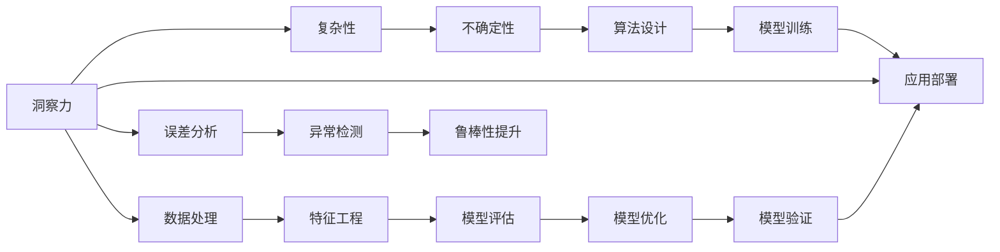

                 

# 理解洞察力的局限：承认复杂性和不确定性

> 关键词：洞察力,复杂性,不确定性,人工智能,算法设计

## 1. 背景介绍

在现代社会中，洞察力被视为解决问题和创新进步的关键。无论是商业决策、科学发现还是技术开发，洞察力都是驱动发展的核心要素。然而，随着技术复杂性的日益增加，我们越来越意识到，简单的观察和直觉往往不足以应对复杂的现实问题。这种认识促使我们重新审视洞察力的局限性，并探索如何更好地理解和利用复杂性与不确定性。

在人工智能（AI）领域，洞察力在算法设计、模型训练和应用部署中扮演着重要角色。AI技术，尤其是深度学习和自然语言处理（NLP），正日益成为解决复杂问题的强大工具。然而，这些技术的应用场景越来越复杂，涉及多模态数据、分布式计算和大规模数据处理。在这种情况下，洞察力的局限性愈发明显，承认复杂性和不确定性成为一种必要。

本文将探讨洞察力在AI中的局限性，分析复杂性和不确定性对AI算法设计的影响，并提供一些应对策略。通过深入理解这些概念，我们希望能够推动AI技术的进一步发展和应用，为解决现实世界中的复杂问题提供更有力的工具。

## 2. 核心概念与联系

### 2.1 核心概念概述

- **洞察力**：指通过观察、分析和推理得出深入理解的能力。在AI领域，洞察力体现为算法设计者对数据、模型和系统的深入理解，以及对问题本质的洞察。

- **复杂性**：指系统或过程的复杂程度。在AI中，复杂性表现为模型参数量、计算需求、数据多样性和任务复杂度等方面。

- **不确定性**：指系统或过程的不可预测性。在AI中，不确定性表现为数据噪声、模型预测不准确、输入数据分布变化和模型过拟合等。

这些核心概念之间存在着紧密的联系。洞察力帮助我们理解和应对复杂性和不确定性，复杂性和不确定性则对洞察力提出了更高的要求，使得算法设计、模型训练和应用部署更加具有挑战性。

### 2.2 核心概念原理和架构的 Mermaid 流程图



这个流程图展示了洞察力在AI系统中的作用及其与复杂性和不确定性的关系。洞察力在数据处理、特征工程、模型设计和验证、模型优化、异常检测和鲁棒性提升等多个环节中发挥着关键作用，帮助我们应对复杂性和不确定性带来的挑战。

## 3. 核心算法原理 & 具体操作步骤

### 3.1 算法原理概述

在AI算法设计中，洞察力帮助我们理解复杂性和不确定性的本质，并制定相应的应对策略。核心算法原理包括以下几个方面：

1. **模型选择与设计**：洞察力使我们能够选择合适的模型架构，如卷积神经网络（CNN）、循环神经网络（RNN）、变压器（Transformer）等，以及设计合适的损失函数和优化器。

2. **数据预处理**：洞察力指导我们如何清洗数据、处理缺失值、进行特征选择和特征工程，以便更好地准备数据供模型训练。

3. **模型训练与验证**：洞察力帮助我们监控训练过程中的误差和过拟合情况，调整学习率、批量大小和正则化参数，以提高模型的泛化能力。

4. **模型部署与评估**：洞察力指导我们如何部署模型，选择合适的硬件和软件环境，以及评估模型在实际应用中的性能和效果。

### 3.2 算法步骤详解

以下是AI算法设计的详细步骤：

1. **问题定义与需求分析**：
   - 明确问题的本质和目标，识别关键数据和模型需求。
   - 理解问题的复杂性和不确定性，制定相应的解决策略。

2. **数据收集与处理**：
   - 收集相关数据，进行清洗和预处理，如去除噪声、处理缺失值和异常值。
   - 进行特征选择和特征工程，如提取特征、进行编码和归一化。

3. **模型选择与设计**：
   - 选择合适的模型架构，如CNN、RNN、Transformer等。
   - 设计合适的损失函数和优化器，如交叉熵、Adam、SGD等。

4. **模型训练与验证**：
   - 使用训练集对模型进行训练，监控训练过程中的误差和过拟合情况。
   - 调整学习率、批量大小和正则化参数，提高模型的泛化能力。
   - 使用验证集评估模型性能，选择最优模型。

5. **模型部署与评估**：
   - 选择合适的硬件和软件环境进行模型部署。
   - 对模型进行测试和评估，监控模型在实际应用中的性能和效果。
   - 根据评估结果，调整模型参数和训练策略，提升模型性能。

### 3.3 算法优缺点

基于洞察力的算法设计有以下优点：

1. **提高模型泛化能力**：洞察力帮助我们选择合适的模型架构和参数，提高模型的泛化能力。
2. **减少过拟合风险**：洞察力指导我们进行正则化、数据增强和模型优化，减少过拟合风险。
3. **提升模型性能**：洞察力帮助我们在模型设计、数据预处理和模型训练等环节进行优化，提升模型性能。

同时，基于洞察力的算法设计也存在以下缺点：

1. **依赖专业知识和经验**：洞察力对算法设计者提出了较高的专业知识和经验要求，难以在短时间内掌握。
2. **数据和任务特定性**：洞察力往往依赖于具体问题和数据，难以泛化到其他问题和数据。
3. **时间和成本**：洞察力驱动的设计过程往往需要较长时间和较大成本，难以快速迭代。

### 3.4 算法应用领域

基于洞察力的算法设计在多个领域得到了广泛应用，包括计算机视觉、自然语言处理、语音识别、推荐系统等。

- **计算机视觉**：在图像分类、目标检测和图像分割等任务中，洞察力帮助选择合适的模型架构和设计合适的损失函数。
- **自然语言处理**：在文本分类、命名实体识别和机器翻译等任务中，洞察力指导进行特征选择、参数优化和模型评估。
- **语音识别**：在语音识别和语音合成等任务中，洞察力帮助进行信号处理、特征提取和模型设计。
- **推荐系统**：在推荐系统中的用户画像生成、物品推荐和实时更新等任务中，洞察力指导进行特征工程和模型优化。

## 4. 数学模型和公式 & 详细讲解 & 举例说明

### 4.1 数学模型构建

在AI中，洞察力也体现在数学模型的构建上。数学模型帮助我们将复杂现实问题抽象为数学形式，便于理解和解决。以下是几个常见的数学模型：

- **线性回归**：用于预测连续变量，模型形式为 $y = w_0 + w_1x_1 + \cdots + w_nx_n$，其中 $y$ 为输出，$x_i$ 为输入特征，$w_i$ 为权重。
- **逻辑回归**：用于分类问题，模型形式为 $\sigma(w_0 + w_1x_1 + \cdots + w_nx_n)$，其中 $\sigma$ 为sigmoid函数。
- **卷积神经网络（CNN）**：用于图像处理，模型形式为 $\mathcal{F}(X) = \mathcal{F}_C(\mathcal{F}_{conv}(\mathcal{F}_P(X)))$，其中 $X$ 为输入图像，$\mathcal{F}_P$ 为卷积层，$\mathcal{F}_C$ 为分类层。

### 4.2 公式推导过程

以逻辑回归为例，推导其梯度下降算法的过程：

$$
\hat{y} = \sigma(w_0 + w_1x_1 + \cdots + w_nx_n)
$$

其中 $y$ 为真实标签，$\hat{y}$ 为模型预测。定义损失函数为交叉熵损失：

$$
L = -\frac{1}{N}\sum_{i=1}^N (y_i \log \hat{y_i} + (1-y_i) \log (1-\hat{y_i}))
$$

对损失函数求梯度，得到权重更新公式：

$$
\frac{\partial L}{\partial w_k} = \frac{1}{N} \sum_{i=1}^N (y_i - \hat{y_i})x_i
$$

通过梯度下降算法更新权重，最小化损失函数，实现模型训练。

### 4.3 案例分析与讲解

以自然语言处理中的命名实体识别（NER）为例，分析其数学模型和算法设计：

**问题定义**：识别文本中的命名实体，如人名、地名和组织名。

**数据准备**：收集标注的NER数据集，如CoNLL-2003数据集。

**模型选择**：选择BiLSTM-CRF模型，利用双向长短时记忆网络（BiLSTM）提取特征，使用条件随机场（CRF）进行实体标注。

**特征选择**：提取上下文特征、词性标签和命名实体标签。

**模型训练**：使用交叉熵损失函数训练模型，调整超参数，如学习率、批量大小和正则化参数。

**模型评估**：使用F1-score等指标评估模型性能，进行误差分析。

## 5. 项目实践：代码实例和详细解释说明

### 5.1 开发环境搭建

搭建开发环境需要以下步骤：

1. **安装Python**：选择Python 3.x版本，下载并安装。
2. **安装PyTorch**：使用pip安装PyTorch库。
3. **安装TensorFlow**：如果需要使用TensorFlow，使用pip安装。
4. **安装其他库**：如numpy、pandas、matplotlib等，使用pip安装。
5. **配置开发环境**：设置Python路径、虚拟环境等。

### 5.2 源代码详细实现

以下是一个简单的逻辑回归模型实现示例：

```python
import numpy as np

# 定义逻辑回归模型
class LogisticRegression:
    def __init__(self):
        self.w = np.zeros((n_features, 1))
        self.b = 0
    
    def fit(self, X, y):
        # 定义损失函数
        def loss(w, b, X, y):
            z = np.dot(X, w) + b
            return -np.mean(y * z - np.log(1 + np.exp(z)))
        
        # 梯度下降算法
        alpha = 0.01
        n_iterations = 1000
        for i in range(n_iterations):
            w_grad = 0
            b_grad = 0
            for x, y in zip(X, y):
                z = np.dot(x, w) + b
                y_hat = 1 / (1 + np.exp(-z))
                w_grad += (y - y_hat) * x
                b_grad += y - y_hat
            w -= alpha * w_grad
            b -= alpha * b_grad
    
    def predict(self, X):
        z = np.dot(X, self.w) + self.b
        return np.sign(z)
```

### 5.3 代码解读与分析

以上代码实现了一个简单的逻辑回归模型，包含模型的初始化、拟合（训练）和预测（测试）三个部分。

- **初始化**：使用`__init__`方法初始化模型的权重和偏置。
- **拟合**：使用梯度下降算法训练模型，更新权重和偏置，最小化交叉熵损失。
- **预测**：使用训练好的模型对新数据进行分类预测。

## 6. 实际应用场景

### 6.1 智能推荐系统

智能推荐系统是洞察力在实际应用中的典型场景。推荐系统通过分析用户行为数据，识别用户偏好，推荐个性化商品或内容。

- **问题定义**：为用户推荐最感兴趣的物品。
- **数据准备**：收集用户行为数据，如点击、浏览、购买等。
- **模型选择**：选择协同过滤、基于内容的推荐、深度学习等模型。
- **特征选择**：提取用户画像、物品特征和用户行为特征。
- **模型训练**：使用用户行为数据训练推荐模型，调整超参数，优化推荐算法。
- **模型评估**：使用准确率、召回率、覆盖率等指标评估模型性能，进行误差分析。

### 6.2 医疗诊断系统

医疗诊断系统通过分析患者症状和历史数据，辅助医生进行疾病诊断和治疗。

- **问题定义**：识别患者可能患有的疾病。
- **数据准备**：收集患者症状、病历和实验室检查数据。
- **模型选择**：选择决策树、随机森林、深度学习等模型。
- **特征选择**：提取患者症状、病历和实验室检查数据特征。
- **模型训练**：使用标注数据训练诊断模型，调整超参数，优化模型性能。
- **模型评估**：使用准确率、召回率、F1-score等指标评估模型性能，进行误差分析。

### 6.3 金融风险管理系统

金融风险管理系统通过分析市场数据和交易记录，识别潜在的风险，辅助投资者决策。

- **问题定义**：识别市场中的潜在风险。
- **数据准备**：收集市场数据、交易记录和新闻数据。
- **模型选择**：选择机器学习、深度学习等模型。
- **特征选择**：提取市场指数、交易量、新闻情感等特征。
- **模型训练**：使用市场数据训练风险模型，调整超参数，优化风险预测。
- **模型评估**：使用准确率、召回率、ROC曲线等指标评估模型性能，进行误差分析。

## 7. 工具和资源推荐

### 7.1 学习资源推荐

- **在线课程**：Coursera上的“机器学习”课程，由Andrew Ng教授讲授，系统介绍机器学习和深度学习的基础知识和算法设计。
- **书籍**：《深度学习》（Goodfellow et al.），全面介绍了深度学习的基本概念和算法设计。
- **论文**：“BERT: Pre-training of Deep Bidirectional Transformers for Language Understanding”，介绍BERT模型的预训练和微调方法。

### 7.2 开发工具推荐

- **编程语言**：Python是最常用的编程语言之一，具有丰富的库和框架支持。
- **深度学习框架**：PyTorch和TensorFlow是两个常用的深度学习框架，提供了丰富的功能和灵活的API。
- **数据处理工具**：Pandas和NumPy是常用的数据处理工具，用于数据清洗、特征工程和数据分析。

### 7.3 相关论文推荐

- “A Few Useful Things to Know About Deep Learning”（Ian Goodfellow），介绍了深度学习的基本概念和实践技巧。
- “Deep Residual Learning for Image Recognition”（He et al.），提出残差网络（ResNet）架构，提高了深度神经网络的训练效果。
- “Attention Is All You Need”（Vaswani et al.），提出Transformer架构，提升了自然语言处理任务的性能。

## 8. 总结：未来发展趋势与挑战

### 8.1 研究成果总结

通过理解和应用洞察力，AI技术在多个领域取得了显著进展。基于洞察力的算法设计不仅提升了模型的性能，还使得AI技术更加深入和广泛地应用于实际问题中。

### 8.2 未来发展趋势

未来，AI技术将继续向更加复杂和多样化的方向发展，复杂性和不确定性将更加凸显。以下趋势将推动AI技术的进一步发展：

1. **多模态数据融合**：AI技术将更好地融合视觉、语音、文本等多模态数据，提升模型的综合能力。
2. **自监督学习**：通过无监督学习方法，利用数据的内在结构进行模型训练，减少对标注数据的依赖。
3. **持续学习**：AI模型将具备持续学习和在线更新的能力，适应数据分布的变化。
4. **可解释性**：AI模型的决策过程将更加透明和可解释，提高模型的可信度和可接受度。
5. **伦理和安全**：AI模型的设计和应用将更加注重伦理和安全问题，避免偏见和有害的输出。

### 8.3 面临的挑战

尽管AI技术在不断发展，但仍然面临诸多挑战：

1. **数据质量**：高质量、多样化的标注数据是AI模型训练的基础，但数据获取和标注成本较高。
2. **计算资源**：大规模深度学习模型的训练和推理需要大量的计算资源，硬件设施和软件环境要求较高。
3. **模型泛化**：复杂环境下的模型泛化能力有待提升，避免模型在实际应用中的过拟合和退化。
4. **解释性**：AI模型的决策过程复杂，难以进行解释和理解，影响模型的应用和推广。
5. **安全性**：AI模型可能被恶意利用，产生有害的输出，影响社会的稳定和公平。

### 8.4 研究展望

未来，研究和应用洞察力将推动AI技术向更加智能和可靠的方向发展。以下方向值得关注：

1. **自适应学习**：开发更加自适应和灵活的算法，能够根据数据和环境变化进行动态调整。
2. **元学习**：研究元学习算法，使模型具备快速学习新任务的能力。
3. **多任务学习**：研究多任务学习算法，提升模型在多个任务上的性能。
4. **可解释性增强**：开发更透明、可解释的AI模型，增强模型的可信度和接受度。
5. **伦理和公平性**：研究AI模型在伦理和安全方面的设计，确保模型的公平性和安全性。

## 9. 附录：常见问题与解答

**Q1：什么是洞察力？**

A: 洞察力指通过观察、分析和推理得出深入理解的能力。在AI领域，洞察力体现为算法设计者对数据、模型和系统的深入理解，以及对问题本质的洞察。

**Q2：如何提升模型泛化能力？**

A: 提升模型泛化能力的关键在于选择合适的模型架构、优化超参数、增加数据多样性、进行正则化等。具体的优化策略包括：
- 使用适当的正则化技术，如L2正则、Dropout等。
- 使用数据增强技术，如随机裁剪、翻转等，增加数据多样性。
- 进行迁移学习，利用已有模型的知识进行预训练，提高模型的泛化能力。

**Q3：如何应对模型过拟合？**

A: 应对模型过拟合的关键在于增加数据多样性、使用正则化技术、进行模型简化等。具体的优化策略包括：
- 增加数据多样性，进行数据增强和扩充。
- 使用适当的正则化技术，如L2正则、Dropout等。
- 进行模型简化，减少模型的复杂度。

**Q4：什么是自监督学习？**

A: 自监督学习指在没有标注数据的情况下，通过数据的内在结构和关系进行模型训练。自监督学习能够利用大规模无标签数据进行预训练，提升模型的泛化能力和自适应能力。

**Q5：什么是元学习？**

A: 元学习指学习如何快速学习新任务的能力。元学习模型能够根据新任务的特点，动态调整模型参数和训练策略，快速适应新任务。

---

作者：禅与计算机程序设计艺术 / Zen and the Art of Computer Programming

