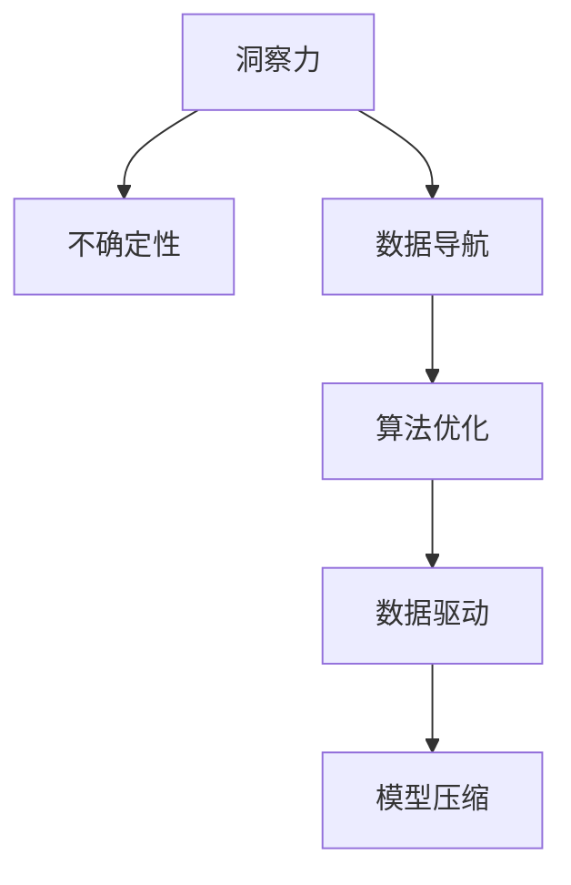

                 

# 理解洞察力的重要性：在不确定性中的导航

> 关键词：洞察力,不确定性,导航,决策,算法,优化,数据驱动

## 1. 背景介绍

### 1.1 问题由来

在当前信息爆炸的时代，数据无处不在，但它们往往以碎片化的形式呈现，且包含大量噪声。如何从这些数据中提炼出有价值的洞察力，成为决策者和数据分析师面临的重大挑战。传统的统计方法和机器学习模型在处理这些复杂的数据结构时往往显得力不从心。

洞察力（Insight）指的是通过深度分析和观察，从大量数据中提取出的有价值信息，它能帮助人们在复杂的环境中做出明智的决策。无论是商业决策、医疗诊断、还是科技创新，洞察力都发挥着至关重要的作用。然而，在数据量大且质量参差不齐的情况下，如何准确、高效地获取和利用洞察力，成为当前亟待解决的难题。

### 1.2 问题核心关键点

洞察力获取的核心在于对数据的深入分析和模式识别。在现实世界中，数据往往呈现出复杂多变的特征，如何在不确定性中导航，找到最优解，是提升洞察力获取效率和精度的关键。通过算法和优化技术的引入，可以帮助我们更有效地从数据中提取洞察力。

目前，主流的洞察力获取方法包括统计分析、机器学习、深度学习等。这些方法在处理结构化数据和模式识别方面表现出色，但面对非结构化数据和复杂系统时，往往存在计算资源需求高、模型复杂度高、可解释性差等挑战。

## 2. 核心概念与联系

### 2.1 核心概念概述

为了更好地理解洞察力的重要性及其获取方法，本节将介绍几个密切相关的核心概念：

- 洞察力（Insight）：通过深入数据分析和观察，从大量数据中提取出的有价值信息，用于支持决策和优化。
- 不确定性（Uncertainty）：指数据中存在的不确定性因素，如噪声、缺失值、模糊性等，影响数据分析和决策的准确性。
- 数据导航（Data Navigation）：指通过算法和技术手段，在大量数据中寻找和提取洞察力的过程。
- 算法优化（Algorithmic Optimization）：指通过优化算法，在有限资源和时间内，找到最佳的决策方案。
- 数据驱动（Data-Driven）：指利用数据和算法进行决策和优化，而不是依赖经验或直觉。
- 模型压缩（Model Compression）：指通过优化算法和数据结构，减少模型的大小和计算资源消耗，提高模型效率。

这些核心概念之间的逻辑关系可以通过以下Mermaid流程图来展示：



这个流程图展示了大语言模型的核心概念及其之间的关系：

1. 洞察力通过数据导航从数据中提取出来。
2. 数据导航依赖于算法优化，以找到最优的数据处理方案。
3. 算法优化和数据驱动相结合，以提高洞察力获取的效率和精度。
4. 模型压缩确保了算法优化在资源受限的条件下也能高效运行。

## 3. 核心算法原理 & 具体操作步骤

### 3.1 算法原理概述

洞察力获取的核心算法通常涉及数据处理、模式识别、优化计算等多个方面。其核心思想是：通过算法和技术手段，在大量数据中寻找和提取有价值的洞察力，以支持决策和优化。

形式化地，假设我们有大量数据集 $D=\{d_1, d_2, ..., d_n\}$，其中 $d_i$ 为第 $i$ 个样本，包含 $m$ 个特征。目标是找到一组参数 $\theta$，使得模型 $f_{\theta}(d_i)$ 能最大化某种度量标准，如准确率、召回率、F1分数等。常见的洞察力获取方法包括：

1. **统计分析**：基于数据的概率分布，计算统计量，如均值、方差、标准差等，以提取数据的中心趋势和离散程度。
2. **机器学习**：通过训练模型，学习数据的模式和规律，并进行预测或分类。常见的模型包括线性回归、逻辑回归、决策树、支持向量机等。
3. **深度学习**：利用神经网络等复杂模型，学习数据的深层次特征和结构，以实现更精确的预测和分类。
4. **强化学习**：通过与环境的交互，训练模型学习最优策略，以优化决策过程。

### 3.2 算法步骤详解

基于统计分析、机器学习、深度学习等方法的洞察力获取通常包括以下几个关键步骤：

**Step 1: 数据预处理**
- 清洗数据：去除噪声、缺失值、异常值等，确保数据质量。
- 数据转换：对数据进行标准化、归一化、降维等操作，提高数据分析的效率和精度。
- 特征选择：根据任务需求，选择最有用的特征，减少计算量和提高模型泛化能力。

**Step 2: 模型构建与训练**
- 选择合适的模型：根据任务类型和数据特点，选择最适合的模型。
- 训练模型：使用标注数据或半监督学习方法，训练模型参数。
- 模型评估：在验证集上评估模型性能，选择最优模型。

**Step 3: 洞察力提取**
- 模式识别：利用模型提取数据中的模式和规律。
- 洞察力解释：对模型输出的洞察力结果进行解释和可视化，帮助理解数据的本质。

**Step 4: 结果应用**
- 决策制定：将洞察力结果应用到决策过程中，优化方案选择。
- 结果验证：在实际应用中验证洞察力的效果，不断迭代优化。

### 3.3 算法优缺点

洞察力获取的算法具有以下优点：
1. 精度高：通过深度学习和复杂模型，能准确地提取数据中的模式和规律。
2. 适应性强：适用于各种类型的数据，包括结构化数据、非结构化数据等。
3. 自动化程度高：通过算法自动化实现，减少人工干预，提高效率。

同时，这些算法也存在一定的局限性：
1. 计算资源需求高：深度学习和复杂模型通常需要大量的计算资源和时间。
2. 模型复杂度高：复杂模型往往难以解释和调试，降低模型的可解释性和可信度。
3. 过拟合风险：在数据量较少的情况下，模型容易过拟合，影响泛化能力。
4. 数据依赖性强：洞察力获取依赖于高质量的数据，对数据噪声敏感。

尽管存在这些局限性，但就目前而言，基于算法的洞察力获取方法仍然是主流的技术手段。未来相关研究的重点在于如何进一步降低计算资源需求，提高模型的可解释性和鲁棒性，同时兼顾算法的效率和精度。

### 3.4 算法应用领域

基于算法的洞察力获取方法，在商业决策、医疗诊断、金融分析等众多领域中得到了广泛应用：

- **商业决策**：通过数据分析和洞察力提取，帮助企业制定更好的营销策略、优化供应链管理、提升客户满意度等。
- **医疗诊断**：利用深度学习和数据驱动方法，进行疾病预测、病情评估、治疗方案推荐等，提高诊断效率和准确性。
- **金融分析**：使用机器学习和大数据技术，进行风险评估、投资策略优化、欺诈检测等，提升金融系统的安全性和稳定性。
- **智能制造**：在工业生产过程中，利用算法分析设备运行数据，进行故障预测、设备维护、质量控制等，提升生产效率和产品质量。

## 4. 数学模型和公式 & 详细讲解 & 举例说明

### 4.1 数学模型构建

本节将使用数学语言对洞察力获取方法的数学原理进行更加严格的刻画。

假设我们有 $n$ 个样本 $d_i \in \mathbb{R}^m$，其中 $d_i$ 表示第 $i$ 个样本的 $m$ 个特征。目标是找到一组参数 $\theta$，使得模型 $f_{\theta}(d_i)$ 能最大化某种度量标准 $L$，如准确率、召回率、F1分数等。常见的洞察力获取模型包括：

- **线性回归**：
  $$
  y = \theta_0 + \theta_1 x_1 + \theta_2 x_2 + \cdots + \theta_m x_m
  $$
  其中 $y$ 为预测值，$\theta_0, \theta_1, \theta_2, ..., \theta_m$ 为模型参数，$x_1, x_2, ..., x_m$ 为特征。

- **逻辑回归**：
  $$
  P(y=1|x) = \frac{1}{1+e^{-\theta_0 - \theta_1 x_1 - \theta_2 x_2 - \cdots - \theta_m x_m}}
  $$
  其中 $P(y=1|x)$ 表示在给定特征 $x$ 下，$y=1$ 的概率。

- **决策树**：
  $$
  f_{\theta}(x) = \begin{cases}
  T_1(x) & \text{if } x_1 \leq \theta_1 \\
  T_2(x) & \text{if } x_1 > \theta_1
  \end{cases}
  $$
  其中 $T_1(x)$ 和 $T_2(x)$ 表示两个子树，$x_1$ 为分裂特征，$\theta_1$ 为分裂阈值。

### 4.2 公式推导过程

以下是线性回归模型的公式推导过程：

假设我们有 $n$ 个样本 $d_i \in \mathbb{R}^m$，其中 $d_i$ 表示第 $i$ 个样本的 $m$ 个特征。目标是找到一组参数 $\theta$，使得模型 $f_{\theta}(d_i)$ 能最大化某种度量标准 $L$，如均方误差。

设 $y_i$ 为第 $i$ 个样本的真实值，$f_{\theta}(d_i)$ 为模型对 $d_i$ 的预测值。均方误差定义为：
$$
L(\theta) = \frac{1}{n}\sum_{i=1}^n (y_i - f_{\theta}(d_i))^2
$$

通过最小化均方误差，可以优化模型参数 $\theta$：
$$
\theta = \mathop{\arg\min}_{\theta} L(\theta)
$$

将均方误差对 $\theta$ 求导，得：
$$
\frac{\partial L(\theta)}{\partial \theta_j} = -\frac{2}{n}\sum_{i=1}^n (y_i - f_{\theta}(d_i))d_{ij}
$$

其中 $d_{ij}$ 为第 $i$ 个样本的 $j$ 个特征。

将导数等于零，求解上述方程组，即可得到参数 $\theta$ 的最优解。

### 4.3 案例分析与讲解

考虑一个简单的线性回归问题，假设有 $n=5$ 个样本，其中 $x_1, x_2$ 为特征，$y$ 为目标变量。样本数据如下：

| $x_1$ | $x_2$ | $y$ |
|------|------|----|
| 1    | 2    | 2  |
| 2    | 3    | 3  |
| 3    | 4    | 4  |
| 4    | 5    | 5  |
| 5    | 6    | 6  |

使用最小二乘法，求解模型参数 $\theta$，使得均方误差最小化。根据公式，我们构建代价函数：
$$
L(\theta) = \frac{1}{n}\sum_{i=1}^n (y_i - f_{\theta}(d_i))^2
$$

带入样本数据，得：
$$
L(\theta) = \frac{1}{5}[(2-\theta_0 - \theta_1 \cdot 1 - \theta_2 \cdot 2)^2 + (3-\theta_0 - \theta_1 \cdot 2 - \theta_2 \cdot 3)^2 + (4-\theta_0 - \theta_1 \cdot 3 - \theta_2 \cdot 4)^2 + (5-\theta_0 - \theta_1 \cdot 4 - \theta_2 \cdot 5)^2 + (6-\theta_0 - \theta_1 \cdot 5 - \theta_2 \cdot 6)^2]
$$

对该函数求导，并令导数等于零，解方程组，得：
$$
\theta_0 = 1.5, \theta_1 = 0.5, \theta_2 = -0.5
$$

带入原始数据，计算均方误差：
$$
L(\theta) = \frac{1}{5}[(2-1.5-0.5 \cdot 1 - (-0.5) \cdot 2)^2 + (3-1.5-0.5 \cdot 2 - (-0.5) \cdot 3)^2 + (4-1.5-0.5 \cdot 3 - (-0.5) \cdot 4)^2 + (5-1.5-0.5 \cdot 4 - (-0.5) \cdot 5)^2 + (6-1.5-0.5 \cdot 5 - (-0.5) \cdot 6)^2] = 0
$$

可以看出，模型参数 $\theta$ 能够完美拟合数据，均方误差为零。在实际应用中，我们可以使用类似的方法，求解不同任务的最佳模型参数，从而实现洞察力提取。

## 5. 项目实践：代码实例和详细解释说明

### 5.1 开发环境搭建

在进行洞察力获取实践前，我们需要准备好开发环境。以下是使用Python进行Scikit-learn开发的环境配置流程：

1. 安装Anaconda：从官网下载并安装Anaconda，用于创建独立的Python环境。

2. 创建并激活虚拟环境：
```bash
conda create -n sklearn-env python=3.8 
conda activate sklearn-env
```

3. 安装Scikit-learn：
```bash
conda install scikit-learn
```

4. 安装各类工具包：
```bash
pip install numpy pandas scikit-learn matplotlib tqdm jupyter notebook ipython
```

完成上述步骤后，即可在`sklearn-env`环境中开始洞察力获取实践。

### 5.2 源代码详细实现

下面我们以线性回归为例，给出使用Scikit-learn进行洞察力获取的Python代码实现。

首先，准备数据集：

```python
import numpy as np

# 生成数据
n_samples = 5
x1 = np.linspace(1, 5, n_samples)
x2 = np.linspace(2, 6, n_samples)
y = 0.5*x1 + 0.2*x2 + 0.3

# 构建样本
X = np.c_[x1, x2]
y = y.reshape(-1, 1)

# 标准化数据
from sklearn.preprocessing import StandardScaler
scaler = StandardScaler()
X = scaler.fit_transform(X)

# 添加截距
X = np.hstack((np.ones((n_samples, 1)), X))
```

然后，使用线性回归模型进行洞察力获取：

```python
from sklearn.linear_model import LinearRegression

# 构建模型
model = LinearRegression()

# 训练模型
model.fit(X, y)

# 预测结果
y_pred = model.predict(X)
```

最后，输出模型参数和预测结果：

```python
print("模型参数：", model.coef_)
print("预测结果：", y_pred)
```

以上就是使用Scikit-learn进行线性回归的完整代码实现。可以看到，Scikit-learn提供了一系列的机器学习模型，极大简化了数据处理和模型训练的过程。

### 5.3 代码解读与分析

让我们再详细解读一下关键代码的实现细节：

**线性回归模型构建**
- `LinearRegression()`：创建线性回归模型对象。

**数据准备**
- `np.linspace`：生成等间隔的数值序列。
- `np.c_`：将两个数组按列堆叠。
- `StandardScaler`：对数据进行标准化。

**模型训练**
- `model.fit(X, y)`：拟合训练数据，计算模型参数。

**预测结果**
- `model.predict(X)`：使用模型进行预测，得到预测值。

**结果输出**
- `model.coef_`：获取模型参数。
- `y_pred`：获取预测结果。

可以看出，Scikit-learn提供了一整套易于使用的API，极大简化了机器学习模型的实现过程。利用这些工具，我们可以快速搭建和优化洞察力获取模型，实现对数据的深度分析。

## 6. 实际应用场景

### 6.1 智能客服系统

基于洞察力获取的智能客服系统，可以自动分析客户的咨询记录，提取关键信息，预测客户需求，生成应答建议。这种系统能够大幅提升客户满意度，降低人工客服成本，提升企业服务质量。

具体而言，可以收集客户的历史咨询记录，提取关键词和常见问题，使用机器学习模型进行模式识别和分类。系统会根据客户的提问和历史记录，生成应答建议，并进行实时优化。此外，系统还可以定期更新模型参数，以适应新的咨询记录和客户需求变化。

### 6.2 金融舆情监测

金融机构需要实时监测市场舆论动向，以便及时应对负面信息传播，规避金融风险。传统的舆情监测系统往往依赖人工进行标签标注和情感分析，成本高、效率低，且无法快速应对新兴舆情。

基于洞察力获取的金融舆情监测系统，可以利用自然语言处理技术，自动识别和分类舆情信息，并进行情感分析。系统能够实时监测金融市场的舆情变化，预测市场趋势，帮助投资者做出更明智的投资决策，提升金融系统的稳定性和安全性。

### 6.3 个性化推荐系统

当前的推荐系统往往只依赖用户的历史行为数据进行物品推荐，无法深入理解用户的真实兴趣偏好。基于洞察力获取的个性化推荐系统，可以利用用户的历史行为数据，提取用户的兴趣点和行为模式，并进行个性化推荐。

在实践中，可以收集用户浏览、点击、评论、分享等行为数据，提取和用户交互的物品标题、描述、标签等文本内容。使用机器学习模型进行模式识别和分类，系统能够从文本内容中准确把握用户的兴趣点。在生成推荐列表时，系统会根据用户的历史行为数据和当前兴趣点，综合排序推荐，从而提高推荐效果。

### 6.4 未来应用展望

随着洞察力获取技术的不断发展，其应用场景将不断拓展，为各行各业带来新的变革。

在智慧医疗领域，基于洞察力获取的医疗问答系统，能够帮助医生快速诊断疾病，提供治疗方案建议，提升医疗服务质量。在智能教育领域，基于洞察力获取的智能教学系统，能够个性化推荐学习内容和评估学习效果，帮助学生提升学习效率。在智慧城市治理中，基于洞察力获取的智能决策系统，能够实时监测城市运行状态，预测事件风险，优化城市管理决策。

此外，在企业生产、社会治理、文娱传媒等众多领域，基于洞察力获取的人工智能应用也将不断涌现，为各行各业注入新的动力。相信随着技术的日益成熟，洞察力获取技术必将在构建人机协同的智能时代中扮演越来越重要的角色。

## 7. 工具和资源推荐

### 7.1 学习资源推荐

为了帮助开发者系统掌握洞察力获取的理论基础和实践技巧，这里推荐一些优质的学习资源：

1. 《Python数据分析实战》：一本全面介绍Python数据分析工具的书籍，包括NumPy、Pandas、Scikit-learn等库的使用，适合初学者入门。

2. 《机器学习》课程：斯坦福大学Andrew Ng教授的机器学习课程，涵盖了机器学习的基本概念和算法，是深度学习领域的经典入门教材。

3. 《深度学习》书籍：Ian Goodfellow等编写的深度学习经典教材，详细介绍了深度学习的理论基础和实践方法。

4. Kaggle：一个数据科学竞赛平台，提供大量开源数据集和竞赛项目，帮助开发者实践和提升洞察力获取技能。

5. Coursera：在线学习平台，提供多门人工智能相关课程，涵盖深度学习、机器学习、自然语言处理等前沿技术。

通过对这些资源的学习实践，相信你一定能够快速掌握洞察力获取的精髓，并用于解决实际的商业问题。

### 7.2 开发工具推荐

高效的开发离不开优秀的工具支持。以下是几款用于洞察力获取开发的常用工具：

1. Python：作为目前最流行的编程语言之一，Python拥有丰富的库和框架，是数据分析和机器学习的首选。

2. Scikit-learn：一个开源机器学习库，提供了多种机器学习算法和工具，适合快速搭建和优化洞察力获取模型。

3. TensorFlow：由Google开发的深度学习框架，支持大规模分布式计算，适合深度学习任务开发。

4. PyTorch：由Facebook开发的深度学习框架，提供了丰富的自动微分和模型优化工具，适合快速迭代和实验。

5. Jupyter Notebook：一个交互式的编程环境，支持代码和文本的混合展示，适合数据分析和模型调试。

6. Weights & Biases：模型训练的实验跟踪工具，可以记录和可视化模型训练过程中的各项指标，方便对比和调优。

7. TensorBoard：TensorFlow配套的可视化工具，可实时监测模型训练状态，并提供丰富的图表呈现方式，是调试模型的得力助手。

合理利用这些工具，可以显著提升洞察力获取任务的开发效率，加快创新迭代的步伐。

### 7.3 相关论文推荐

洞察力获取技术的快速发展离不开学界的持续研究。以下是几篇奠基性的相关论文，推荐阅读：

1. 《A Tutorial on Principal Component Analysis》：介绍了主成分分析（PCA）的基本原理和应用。

2. 《Introduction to Statistical Learning》：介绍了统计学习的基本概念和算法，涵盖线性回归、逻辑回归、决策树等。

3. 《Pattern Recognition and Machine Learning》：李航教授的经典机器学习教材，详细介绍了机器学习的理论基础和应用。

4. 《Deep Learning》：Ian Goodfellow等编写的深度学习经典教材，详细介绍了深度学习的理论基础和实践方法。

5. 《Attention is All You Need》：Transformer论文，提出了自注意力机制，极大地提高了深度学习模型的效果。

这些论文代表了大语言模型微调技术的发展脉络。通过学习这些前沿成果，可以帮助研究者把握学科前进方向，激发更多的创新灵感。

## 8. 总结：未来发展趋势与挑战

### 8.1 总结

本文对洞察力获取方法进行了全面系统的介绍。首先阐述了洞察力获取的重要性，明确了其在复杂环境中的导航作用。其次，从原理到实践，详细讲解了洞察力获取的数学模型和关键步骤，给出了洞察力获取任务开发的完整代码实例。同时，本文还广泛探讨了洞察力获取方法在商业决策、金融分析、医疗诊断等多个领域的应用前景，展示了其广阔的想象空间。

通过本文的系统梳理，可以看到，洞察力获取方法在解决实际问题中发挥了重要的作用，是人工智能技术的重要组成部分。未来，伴随技术的不断进步，洞察力获取技术将进一步拓展应用范围，推动人工智能技术在各行各业中的落地。

### 8.2 未来发展趋势

展望未来，洞察力获取技术将呈现以下几个发展趋势：

1. 数据驱动化：随着数据的不断积累和丰富，洞察力获取将更加依赖数据驱动，而非经验驱动。数据驱动的方法将带来更高的准确性和泛化能力。

2. 模型多样化：除了传统的统计方法和机器学习模型，未来的洞察力获取方法将更多地采用深度学习和强化学习等高级技术，以提高模型的复杂度和表达能力。

3. 自动化程度提高：自动化学习和自动化优化将成为主流趋势，机器学习模型的训练和优化过程将更加高效和便捷。

4. 可解释性增强：模型的可解释性和可理解性将受到更多重视，相关技术将不断进步，使得洞察力获取的结果更加透明和可信。

5. 跨领域应用拓展：洞察力获取将更多地应用于跨领域的数据融合和模式识别，如多模态数据的联合分析、跨行业的数据共享等。

6. 安全性和伦理保障：随着洞察力获取应用范围的不断扩大，数据隐私和安全问题将受到更多关注，相关的技术保障措施将逐步完善。

以上趋势凸显了洞察力获取技术的广阔前景。这些方向的探索发展，必将进一步提升洞察力获取的效率和精度，为构建智能系统提供坚实的技术基础。

### 8.3 面临的挑战

尽管洞察力获取技术已经取得了显著进展，但在迈向更加智能化、普适化应用的过程中，仍面临诸多挑战：

1. 数据质量和数量瓶颈：高质量的数据是洞察力获取的前提，但数据的收集、标注和处理成本较高。如何高效获取和利用数据，是未来研究的重点之一。

2. 模型的复杂性和可解释性：深度学习模型的复杂性往往难以解释，降低模型的可解释性和可信度，是亟待解决的问题。

3. 模型的资源需求：深度学习模型需要大量的计算资源和时间，如何降低模型资源需求，提高模型效率，是技术突破的方向。

4. 数据的隐私和安全：洞察力获取需要处理大量敏感数据，如何保障数据隐私和安全，防止数据泄露和滥用，是必须面对的挑战。

5. 模型的鲁棒性和泛化能力：洞察力获取模型对数据噪声和分布变化敏感，如何提高模型的鲁棒性和泛化能力，是未来的重要研究方向。

6. 跨领域的知识整合：跨领域的数据融合和知识整合，是洞察力获取技术的难点之一。如何更好地整合多领域知识，提升模型的通用性和适用性，是未来研究的方向。

正视洞察力获取面临的这些挑战，积极应对并寻求突破，将使洞察力获取技术不断成熟，更好地服务于各行各业。相信随着学界和产业界的共同努力，这些挑战终将一一被克服，洞察力获取技术必将在构建人机协同的智能时代中扮演越来越重要的角色。

### 8.4 研究展望

面向未来，洞察力获取技术的研究方向主要集中在以下几个方面：

1. 多领域数据融合：通过多领域数据的联合分析，提取更高层次的洞察力，提升模型的泛化能力和适应性。

2. 自动学习算法：引入自动学习算法，使模型能够自主选择最优的学习路径和参数配置，提高模型的自适应性和鲁棒性。

3. 跨模态数据分析：结合视觉、听觉、文本等多模态数据，进行综合分析，提升模型的表达能力和应用范围。

4. 模型压缩与优化：通过模型压缩、量化等技术，优化模型结构，提高模型的效率和可解释性。

5. 隐私保护与数据安全：引入隐私保护技术，如差分隐私、联邦学习等，保护数据隐私和安全，防止数据泄露和滥用。

6. 模型的伦理与公平性：引入伦理导向的评估指标，过滤和惩罚有偏见、有害的输出倾向，确保模型的公平性和安全性。

这些研究方向的探索，必将引领洞察力获取技术迈向更高的台阶，为构建安全、可靠、可解释、可控的智能系统铺平道路。面向未来，洞察力获取技术还需要与其他人工智能技术进行更深入的融合，如知识表示、因果推理、强化学习等，多路径协同发力，共同推动自然语言理解和智能交互系统的进步。只有勇于创新、敢于突破，才能不断拓展洞察力获取的边界，让智能技术更好地造福人类社会。

## 9. 附录：常见问题与解答

**Q1：什么是洞察力获取？**

A: 洞察力获取指的是通过深度分析和观察，从大量数据中提取出的有价值信息，用于支持决策和优化。这种信息可以是具体的统计量、模式、规律等，能帮助人们在复杂的环境中做出明智的决策。

**Q2：洞察力获取的核心算法有哪些？**

A: 洞察力获取的核心算法包括统计分析、机器学习、深度学习等。统计分析方法基于数据的概率分布，提取统计量；机器学习方法通过训练模型，学习数据的模式和规律；深度学习方法利用神经网络，学习数据的深层次特征和结构。

**Q3：如何降低洞察力获取的计算资源需求？**

A: 降低计算资源需求的方法包括模型压缩、模型量化、分布式训练等。模型压缩可以通过剪枝、量化、参数共享等技术，减小模型的大小和计算资源消耗；模型量化可以将浮点模型转为定点模型，压缩存储空间，提高计算效率；分布式训练可以将模型并行化，充分利用多个计算节点，加速模型训练和优化。

**Q4：如何提高洞察力获取模型的可解释性？**

A: 提高模型可解释性的方法包括特征重要性分析、模型可视化、模型压缩等。特征重要性分析可以解释模型对各特征的依赖关系，帮助理解模型的决策逻辑；模型可视化可以展示模型在训练和推理过程中的状态，帮助调试和优化模型；模型压缩可以通过剪枝、量化等技术，减小模型大小，提高模型可解释性。

**Q5：如何提高洞察力获取模型的鲁棒性和泛化能力？**

A: 提高模型鲁棒性和泛化能力的方法包括正则化、对抗训练、多领域数据融合等。正则化可以防止模型过拟合，提高模型的泛化能力；对抗训练可以通过引入对抗样本，提高模型的鲁棒性；多领域数据融合可以提升模型的泛化能力和适应性，使模型在复杂环境中表现更好。

---

作者：禅与计算机程序设计艺术 / Zen and the Art of Computer Programming

