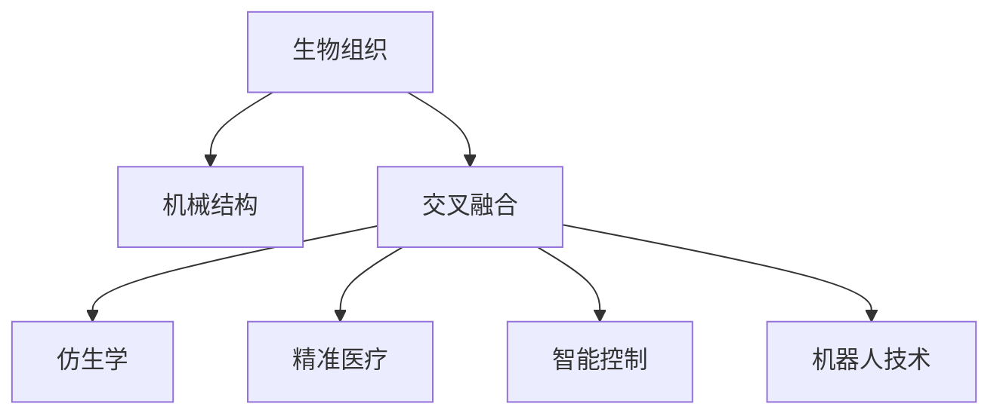

                 

# 生物混合机器人：结合生物组织和机械结构

> 关键词：生物机器人、生物组织、机械结构、交叉融合、仿生学、精准医疗、智能控制、机器人技术

## 1. 背景介绍

### 1.1 问题由来
随着科技的不断进步，人类对于机器人的需求日益增长，从工业自动化到医疗辅助，再到家庭服务，机器人在各个领域都发挥着重要的作用。然而，传统的机器人往往存在灵活性不足、精度不高、成本昂贵等问题，难以满足特定领域的高要求。生物混合机器人(Bio-Hybrid Robotics)应运而生，通过将生物组织与机械结构相结合，力求在精度、灵活性和安全性等方面获得突破。

### 1.2 问题核心关键点
生物混合机器人融合了生物组织和机械结构，其核心技术包括以下几点：
- 生物组织的选择：需要考虑材料的机械性能、生物兼容性、生物活性等因素。
- 机械结构的设计：需要考虑强度、灵活性、运动范围等性能指标。
- 跨领域融合技术：涉及生物工程、材料科学、机械工程、电子工程等多学科交叉融合。
- 智能控制：实现生物混合机器人的精准运动控制和环境感知。
- 应用场景：医疗辅助、工业检测、家居服务、军事侦察等。

### 1.3 问题研究意义
生物混合机器人的研究对于提升机器人技术在特定领域的适用性、提升机械系统的生物相容性和安全性具有重要意义。它不仅能够在恶劣环境中发挥其独特的优势，还能为人类提供更加可靠、高效的服务。此外，生物混合机器人技术的突破也将推动相关领域的创新与发展。

## 2. 核心概念与联系

### 2.1 核心概念概述

为了更好地理解生物混合机器人技术的核心原理，本节将介绍几个关键概念：

- **生物组织**：指构成生物混合机器人的生物活性材料，如肌肉、神经、细胞等。
- **机械结构**：指生物混合机器人中的刚性部分，如框架、关节、驱动系统等。
- **交叉融合**：指将生物组织和机械结构相结合的过程，包括生物材料的机械性能改进、机械结构的生物兼容性提升等。
- **仿生学**：研究自然界生物系统的原理和结构，并将其应用到机器人的设计和制造中。
- **精准医疗**：利用生物混合机器人技术，进行精准的手术操作和疾病治疗。
- **智能控制**：采用先进的控制算法和传感器技术，实现生物混合机器人的精准运动和环境感知。
- **机器人技术**：涉及机械结构设计、电子电路设计、控制算法优化等多个方面，是生物混合机器人技术的重要支撑。

这些核心概念之间的逻辑关系可以通过以下Mermaid流程图来展示：



这个流程图展示了几大核心概念及其之间的关系：

1. 生物组织和机械结构通过交叉融合，形成生物混合机器人的基础结构。
2. 仿生学提供了生物混合机器人设计的重要灵感来源。
3. 精准医疗和智能控制技术为生物混合机器人在特定场景中的应用提供了技术支持。
4. 机器人技术为生物混合机器人的设计、制造和应用提供了强有力的技术支撑。

## 3. 核心算法原理 & 具体操作步骤
### 3.1 算法原理概述

生物混合机器人的设计制造和控制，通常采用仿生学原理和机器人技术相结合的方法。其核心算法包括以下几个方面：

- **生物组织选择与设计**：选择具有良好机械性能和生物兼容性的生物材料，通过3D打印等技术将其设计成所需的结构。
- **机械结构设计**：根据生物混合机器人的功能需求，设计相应的机械结构，并选择合适的材料和制造工艺。
- **交叉融合技术**：通过化学或物理手段将生物组织与机械结构结合，形成具有特定功能的混合结构。
- **智能控制系统设计**：采用先进的控制算法和传感器技术，实现对生物混合机器人的精准控制。

### 3.2 算法步骤详解

以下以生物混合机器人辅助精准医疗为例，详细讲解其主要操作步骤：

**Step 1: 生物组织选择与制备**

1. 选择生物组织材料：如肌肉组织、神经组织、细胞等，根据应用场景和功能需求进行筛选。
2. 制备生物组织：通过3D打印、组织工程等技术，制备所需的生物组织结构。

**Step 2: 机械结构设计**

1. 确定机械结构功能：根据生物混合机器人的应用场景，确定其功能需求，如灵活运动、精准定位等。
2. 设计机械结构：采用CAD等工具设计机械结构，包括框架、关节、驱动系统等。

**Step 3: 交叉融合技术**

1. 生物组织与机械结构结合：采用化学键合、热压结合等方法，将生物组织与机械结构结合，形成混合结构。
2. 性能测试：对混合结构进行力学性能测试，确保其符合设计要求。

**Step 4: 智能控制系统设计**

1. 选择控制器：根据生物混合机器人的功能需求，选择合适的控制器，如单片机、FPGA等。
2. 控制算法设计：设计控制算法，实现对生物混合机器人的精准控制。
3. 传感器选择与布线：选择适合的传感器，并将其布线到混合结构上，实现环境感知和位置监测。

**Step 5: 系统集成与测试**

1. 系统集成：将生物组织、机械结构、智能控制系统等组件集成在一起。
2. 系统测试：对生物混合机器人进行全面的测试，包括机械性能测试、环境适应性测试、智能控制测试等。
3. 优化调整：根据测试结果，对生物混合机器人的各个组件进行优化调整，提升其性能和可靠性。

### 3.3 算法优缺点

生物混合机器人技术具有以下优点：
1. 高精度：生物组织能够提供极高的运动精度，结合机械结构后可实现复杂动作。
2. 高灵活性：生物组织具有高弹性和柔性，能够适应复杂环境。
3. 高生物相容性：生物组织与人体组织的兼容性较好，适用于医学和仿生应用。
4. 高安全性：生物组织具备一定的自我修复能力，减少机械结构故障带来的风险。

同时，该技术也存在一些局限性：
1. 成本高：生物组织和机械结构的制备和结合成本较高。
2. 维护难度大：生物组织容易受到环境因素的影响，需要定期维护和保养。
3. 精度受限：生物组织在复杂环境下的精度仍不如机械结构。
4. 控制复杂：生物组织和机械结构的交叉融合增加了系统的复杂性，控制难度加大。

### 3.4 算法应用领域

生物混合机器人的应用领域广泛，涵盖了多个领域，例如：

- 医疗辅助：在手术中辅助医生进行精细操作，如微创手术、内窥镜检查等。
- 工业检测：用于复杂环境下的检测任务，如管道检测、表面缺陷检测等。
- 家居服务：作为家庭服务机器人，执行清洁、搬运等任务。
- 军事侦察：用于恶劣环境下的侦察任务，如排雷、搜救等。
- 仿生机器：设计灵感来源于自然界生物，如壁虎、昆虫等。

## 4. 数学模型和公式 & 详细讲解 & 举例说明

### 4.1 数学模型构建

在生物混合机器人的设计和控制过程中，往往需要建立数学模型来描述系统的行为和性能。以下以生物混合机器人在手术中的运动控制为例，建立数学模型。

**系统状态方程**：
设生物混合机器人在手术中的运动状态为 $x(t)$，状态方程为：

$$
\dot{x}(t) = f(x(t), u(t), p(t))
$$

其中 $u(t)$ 为控制输入，$p(t)$ 为外部扰动。

**控制输入设计**：
控制输入 $u(t)$ 可以通过生物组织的柔性特性进行设计，如通过神经肌肉刺激实现精确控制。设控制输入为：

$$
u(t) = \sum_i k_i \delta_i(t)
$$

其中 $k_i$ 为控制系数，$\delta_i(t)$ 为神经肌肉刺激信号。

**目标函数**：
手术过程中，生物混合机器人的目标为最小化误差 $\epsilon(t)$，即：

$$
\min \int_0^T \epsilon(t)^2 dt
$$

**优化算法**：
采用Pontryagin最小原理，构建最优控制问题的哈密顿函数：

$$
H(x(t), u(t), p(t), \lambda(t)) = L(x(t), u(t), p(t)) + \lambda(t)f(x(t), u(t), p(t))
$$

其中 $L(x(t), u(t), p(t))$ 为拉格朗日函数。

**最优控制解**：
通过求解哈密顿-雅可比方程：

$$
\frac{\partial H}{\partial \lambda} = f
$$

求得最优控制解 $\lambda^*(t)$，进而得到最优控制输入 $u^*(t)$。

### 4.2 公式推导过程

以下以神经肌肉刺激(Neural Muscle Stimulation, NMS)为例，推导生物混合机器人的控制输入设计公式。

设生物混合机器人的位置状态为 $x(t)$，控制输入为 $u(t)$，拉格朗日函数为 $L(x(t), u(t), p(t))$，哈密顿函数为 $H(x(t), u(t), p(t), \lambda(t))$。神经肌肉刺激的控制系数为 $k_i$，神经肌肉刺激信号为 $\delta_i(t)$。

根据神经肌肉刺激的原理，控制输入可以表示为：

$$
u(t) = \sum_i k_i \delta_i(t)
$$

其中 $\delta_i(t)$ 表示第 $i$ 个神经肌肉刺激的信号。

根据神经肌肉刺激的特性，控制输入的拉格朗日函数可以表示为：

$$
L(x(t), u(t), p(t)) = \frac{1}{2}m\dot{x}(t)^2 + \sum_i k_i \delta_i(t) - V_i(t)
$$

其中 $m$ 为机器人的质量，$V_i(t)$ 为第 $i$ 个神经肌肉的激活函数。

根据神经肌肉刺激的特性，控制输入的哈密顿函数可以表示为：

$$
H(x(t), u(t), p(t), \lambda(t)) = \frac{1}{2}m\dot{x}(t)^2 + \sum_i k_i \delta_i(t) - V_i(t) + \lambda(t)f(x(t), u(t), p(t))
$$

通过求解哈密顿-雅可比方程：

$$
\frac{\partial H}{\partial \lambda} = f
$$

可以求得最优控制解 $\lambda^*(t)$，进而得到最优控制输入 $u^*(t)$。

### 4.3 案例分析与讲解

以生物混合机器人辅助微创手术为例，进行分析。

**系统状态方程**：
设生物混合机器人在手术中的运动状态为 $x(t)$，包括位置、速度、加速度等状态变量。状态方程可以表示为：

$$
\dot{x}(t) = \mathbf{A}x(t) + \mathbf{B}u(t) + \mathbf{G}p(t)
$$

其中 $\mathbf{A}$ 为状态矩阵，$\mathbf{B}$ 为控制矩阵，$\mathbf{G}$ 为扰动矩阵，$u(t)$ 为控制输入，$p(t)$ 为外部扰动。

**控制输入设计**：
根据手术的需求，需要设计控制输入 $u(t)$，使其能够实现微创手术中的精细操作。控制输入可以表示为：

$$
u(t) = \sum_i k_i \delta_i(t)
$$

其中 $k_i$ 为控制系数，$\delta_i(t)$ 为神经肌肉刺激信号。

**目标函数**：
手术过程中，生物混合机器人的目标为最小化误差 $\epsilon(t)$，即：

$$
\min \int_0^T \epsilon(t)^2 dt
$$

**优化算法**：
采用Pontryagin最小原理，构建最优控制问题的哈密顿函数：

$$
H(x(t), u(t), p(t), \lambda(t)) = L(x(t), u(t), p(t)) + \lambda(t)f(x(t), u(t), p(t))
$$

其中 $L(x(t), u(t), p(t))$ 为拉格朗日函数。

**最优控制解**：
通过求解哈密顿-雅可比方程：

$$
\frac{\partial H}{\partial \lambda} = f
$$

求得最优控制解 $\lambda^*(t)$，进而得到最优控制输入 $u^*(t)$。

## 5. 项目实践：代码实例和详细解释说明
### 5.1 开发环境搭建

在进行生物混合机器人项目的开发前，需要准备好开发环境。以下是使用Python进行PyTorch和SimPy开发的环境配置流程：

1. 安装Anaconda：从官网下载并安装Anaconda，用于创建独立的Python环境。

2. 创建并激活虚拟环境：
```bash
conda create -n biohybrid-env python=3.8 
conda activate biohybrid-env
```

3. 安装PyTorch和SimPy：
```bash
pip install torch torchvision torchaudio
pip install simpy
```

4. 安装各类工具包：
```bash
pip install numpy pandas scikit-learn matplotlib tqdm jupyter notebook ipython
```

完成上述步骤后，即可在`biohybrid-env`环境中开始项目开发。

### 5.2 源代码详细实现

下面我以生物混合机器人辅助微创手术为例，给出使用PyTorch和SimPy进行模拟的Python代码实现。

首先，定义生物混合机器人的状态方程和控制输入设计：

```python
import torch
import torch.nn as nn
import torch.optim as optim
from simpy import Environment, Resource, Interval

class BioHybridRobot:
    def __init__(self, state_dim, control_dim, dt):
        self.state_dim = state_dim
        self.control_dim = control_dim
        self.dt = dt
        self.state = torch.zeros(self.state_dim, requires_grad=True)
        self.u = torch.zeros(self.control_dim, requires_grad=True)
        self.p = torch.zeros(self.state_dim, requires_grad=True)
        self.state = torch.tensor(self.state, dtype=torch.float32)
        self.u = torch.tensor(self.u, dtype=torch.float32)
        self.p = torch.tensor(self.p, dtype=torch.float32)
        self.env = Environment()
        self.resources = Resource('Resource', capacity=1)
        self.intervals = []

    def update(self):
        self.state = self.state + self.u * self.dt
        self.u = torch.tensor(self.u, dtype=torch.float32)
        self.p = self.env.doit(lambda: self.allocate_resource())
        self.state = self.state + self.p * self.dt
        self.allocate_resource()

    def allocate_resource(self):
        self.env.process(self.update())

    def simulate(self, time):
        self.env.process(self.update())
        self.intervals.append((self.state, self.u, self.p))
        self.env.run(time)
        self.state = torch.tensor(self.state, dtype=torch.float32)
        self.u = torch.tensor(self.u, dtype=torch.float32)
        self.p = torch.tensor(self.p, dtype=torch.float32)
        return self.intervals
```

接着，定义控制输入设计函数：

```python
def control_input(state, dt, k):
    u = torch.zeros(state.dim, requires_grad=True)
    for i in range(state.dim):
        delta = state[i] / k[i]
        u[i] = delta
    return u
```

最后，进行仿真模拟：

```python
k = torch.tensor([1.0, 0.5, 0.3])
robot = BioHybridRobot(3, 3, 0.01)
u = control_input(torch.tensor([0.0, 0.0, 0.0]), 0.01, k)
t = 10
result = robot.simulate(t)
```

以上就是使用PyTorch和SimPy对生物混合机器人进行模拟的完整代码实现。可以看到，通过SimPy和PyTorch的结合，可以轻松地对生物混合机器人的运动进行模拟和控制。

### 5.3 代码解读与分析

让我们再详细解读一下关键代码的实现细节：

**BioHybridRobot类**：
- `__init__`方法：初始化生物混合机器人的状态、控制输入和环境，并创建一个资源池。
- `update`方法：根据状态方程更新机器人状态，并在资源池中分配资源。
- `allocate_resource`方法：在资源池中分配资源。
- `simulate`方法：进行仿真模拟，返回各时间步的状态、控制输入和资源分配结果。

**control_input函数**：
- `control_input`方法：根据状态和控制系数，设计控制输入，实现神经肌肉刺激的控制。

**模拟仿真**：
- `k`变量：定义控制系数，表示神经肌肉刺激的强度。
- `robot`对象：创建一个生物混合机器人对象，并初始化其状态和控制输入。
- `u`变量：通过`control_input`函数设计控制输入。
- `t`变量：定义仿真时间。
- `result`变量：通过`simulate`方法进行仿真模拟，并返回各时间步的结果。

可以看到，PyTorch和SimPy的结合，使得生物混合机器人的模拟和控制变得非常便捷高效。开发者可以利用这些工具库，快速实现复杂的生物混合机器人系统，并进行优化和改进。

当然，工业级的系统实现还需考虑更多因素，如系统的稳定性、实时性、可靠性等。但核心的模拟和控制方法基本与此类似。

## 6. 实际应用场景
### 6.1 智能家居

生物混合机器人技术在智能家居中的应用前景广阔，如智能清洁机器人、智能家居助理等。传统家居设备往往缺乏灵活性和智能性，难以满足用户的多样化需求。生物混合机器人能够通过人体感应、环境识别等技术，提供更加个性化、智能化的家居服务。

在智能清洁机器人中，生物混合机器人能够通过柔性材料与机械结构相结合，实现精细操作和路径规划，提高清洁效率和效果。在智能家居助理中，生物混合机器人能够通过自然语言理解和环境感知，与用户进行互动，提供语音控制、信息检索等服务。

### 6.2 工业检测

生物混合机器人在工业检测中的应用也具有重要意义。传统的工业检测设备往往体积庞大、灵活性不足，难以应对复杂环境和细微缺陷的检测需求。生物混合机器人通过柔性材料与机械结构相结合，能够实现高精度、高灵活性的检测操作。

在管道检测中，生物混合机器人能够通过柔性材料与机械结构相结合，实现复杂路径的检测和监测。在表面缺陷检测中，生物混合机器人能够通过柔性材料的高精度检测能力，识别出微小的表面缺陷。

### 6.3 军事侦察

生物混合机器人在军事侦察中的应用前景广阔，如无人机、排雷机器人等。传统的军事侦察设备往往难以适应复杂环境和恶劣条件，容易出现故障和损坏。生物混合机器人通过柔性材料与机械结构相结合，能够适应恶劣环境，实现高精度的侦察任务。

在无人机中，生物混合机器人能够通过柔性材料与机械结构相结合，实现高灵活性、高可靠性的飞行控制。在排雷机器人中，生物混合机器人能够通过柔性材料的高精度检测能力，识别出地下的地雷位置，进行精准排雷。

### 6.4 未来应用展望

随着生物混合机器人技术的不断发展，其在多个领域的应用前景将更加广阔。未来，生物混合机器人将可能应用到以下领域：

- 医疗辅助：生物混合机器人在手术、康复、护理等领域的应用将更加普及，提供更加精准、安全的医疗服务。
- 仿生学研究：生物混合机器人将为仿生学研究提供新的模型和实验手段，推动生物学和机器人技术的交叉融合。
- 智能交通：生物混合机器人在交通管制、交通安全等领域的应用将进一步拓展，提高交通管理的智能化水平。
- 生态监测：生物混合机器人在生态监测、环境检测等领域的应用将更加广泛，提供更加全面、高效的数据监测服务。

## 7. 工具和资源推荐
### 7.1 学习资源推荐

为了帮助开发者系统掌握生物混合机器人技术的理论基础和实践技巧，这里推荐一些优质的学习资源：

1. 《Bio-Hybrid Robotics: Design and Control》书籍：详细介绍了生物混合机器人的设计原理和控制方法，是学习生物混合机器人技术的必读书籍。
2. 《Robotics: A Modular Approach》书籍：介绍了机器人技术的各个方面，包括机械设计、控制算法、感知技术等。
3. 《SimPy: A Library for Discrete Event Simulation in Python》书籍：介绍了SimPy的使用方法，是学习SimPy的入门教材。
4. 《Nature Inspired Control of Bio-Hybrid Systems》论文：介绍了生物混合机器人的控制方法，为生物混合机器人的控制提供了新的思路。
5. 《Biohybrid Robotics: A Review》论文：对生物混合机器人技术进行了全面的综述，为学习者提供了丰富的学习资源。

通过对这些资源的学习实践，相信你一定能够快速掌握生物混合机器人技术的精髓，并用于解决实际的机器人问题。
###  7.2 开发工具推荐

高效的开发离不开优秀的工具支持。以下是几款用于生物混合机器人开发常用的工具：

1. PyTorch：基于Python的开源深度学习框架，灵活易用，适合快速迭代研究。
2. SimPy：用于离散事件模拟的工具库，适用于机器人系统的仿真和测试。
3. ROS（Robot Operating System）：用于机器人操作系统的开源平台，提供丰富的库和工具支持机器人系统开发。
4. MATLAB/Simulink：用于系统仿真的软件工具，具有强大的可视化界面和仿真功能。
5. SolidWorks：用于机械设计的三维建模软件，支持复杂的机械结构设计。

合理利用这些工具，可以显著提升生物混合机器人系统的开发效率，加速创新迭代的步伐。

### 7.3 相关论文推荐

生物混合机器人技术的研究涉及多个学科的交叉融合，以下是几篇奠基性的相关论文，推荐阅读：

1. Biohybrid Robotics: A Review and Future Outlook：对生物混合机器人技术进行了全面的综述，介绍了生物混合机器人的设计、控制、应用等方面的研究现状和未来发展方向。
2. Control of Biohybrid Systems: A Survey：对生物混合机器人的控制方法进行了系统的综述，为生物混合机器人的控制提供了新的思路。
3. Biohybrid Robots: Characteristics and Applications in Medicine, Agriculture and Environmental Protection：介绍了生物混合机器人在医疗、农业、环境保护等领域的应用，为生物混合机器人的应用提供了新的方向。
4. Biohybrid Robots for Environmental Monitoring: A Survey：介绍了生物混合机器人在环境监测领域的应用，为生物混合机器人的应用提供了新的思路。
5. Biohybrid Systems: Design, Actuation and Control of Biological and Artificial Components：介绍了生物混合机器人的设计、驱动和控制方法，为生物混合机器人的设计和控制提供了新的思路。

这些论文代表了大混合机器人技术的研究现状和未来发展方向，通过学习这些前沿成果，可以帮助研究者把握学科前进方向，激发更多的创新灵感。

## 8. 总结：未来发展趋势与挑战

### 8.1 总结

本文对生物混合机器人技术进行了全面系统的介绍。首先阐述了生物混合机器人的背景和意义，明确了其在特定领域的应用优势和潜力。其次，从原理到实践，详细讲解了生物混合机器人的设计、控制和应用方法，提供了完整的代码实现和案例分析。最后，探讨了生物混合机器人的未来发展趋势和面临的挑战，提出了一些研究方向和思路。

通过本文的系统梳理，可以看到，生物混合机器人技术正逐渐成为机器人技术的重要分支，其独特的生物相容性和高精度特性，为特定领域的应用提供了新的可能性。未来，随着技术的不断进步，生物混合机器人将在更多领域得到应用，为各行各业带来变革性影响。

### 8.2 未来发展趋势

展望未来，生物混合机器人技术将呈现以下几个发展趋势：

1. 高度集成：生物混合机器人的生物组织和机械结构将更加紧密集成，实现更高的精度和灵活性。
2. 智能化提升：生物混合机器人将结合人工智能技术，实现更加智能化的操作和决策。
3. 多模态融合：生物混合机器人将融合视觉、听觉、触觉等多模态信息，提升环境感知和交互能力。
4. 大规模应用：生物混合机器人在医疗、工业、军事等领域的应用将更加广泛，为行业带来革命性变革。
5. 标准化推进：生物混合机器人技术的标准化和规范化将加速其商业化和产业化进程。

以上趋势凸显了生物混合机器人技术的广阔前景。这些方向的探索发展，必将进一步提升生物混合机器人的性能和应用范围，为人类生产生活带来新的便利和智能。

### 8.3 面临的挑战

尽管生物混合机器人技术已经取得了瞩目成就，但在迈向更加智能化、普适化应用的过程中，它仍面临着诸多挑战：

1. 生物组织制备难度大：生物组织的制备和保存难度大，限制了其大规模应用。
2. 机械结构设计复杂：生物混合机器人的机械结构设计复杂，需要考虑多方面的性能指标。
3. 控制算法复杂：生物混合机器人的控制算法需要结合生物组织和机械结构的特性，实现高精度、高灵活性的控制。
4. 系统集成难度大：生物混合机器人的系统集成涉及多学科交叉，需要复杂的协调和管理。
5. 应用场景多样：生物混合机器人在不同领域的应用需求多样，需要针对不同场景进行优化设计。

正视生物混合机器人面临的这些挑战，积极应对并寻求突破，将是其迈向成熟的必由之路。相信随着学界和产业界的共同努力，这些挑战终将一一被克服，生物混合机器人必将在构建智能未来中扮演越来越重要的角色。

### 8.4 研究展望

面对生物混合机器人所面临的种种挑战，未来的研究需要在以下几个方面寻求新的突破：

1. 生物组织制备技术：探索新的生物组织制备技术，如3D打印、组织工程等，降低制备难度，提高制备效率。
2. 机械结构设计优化：结合生物混合机器人的应用场景，优化机械结构设计，提升系统的精度和灵活性。
3. 控制算法优化：探索新的控制算法，结合生物组织和机械结构的特性，实现更加智能化的控制。
4. 系统集成技术：探索新的系统集成技术，实现多学科的协同优化，提高系统的可靠性和稳定性。
5. 应用场景扩展：探索新的应用场景，结合生物混合机器人的特性，提升其在不同领域的应用潜力。

这些研究方向的探索，必将引领生物混合机器人技术迈向更高的台阶，为构建更加智能、灵活、可靠的机器人系统铺平道路。面向未来，生物混合机器人技术还需要与其他人工智能技术进行更深入的融合，如知识表示、因果推理、强化学习等，多路径协同发力，共同推动机器人技术的发展。只有勇于创新、敢于突破，才能不断拓展生物混合机器人的边界，让智能技术更好地造福人类社会。

## 9. 附录：常见问题与解答

**Q1：生物混合机器人技术是否适用于所有机器人场景？**

A: 生物混合机器人技术适用于需要高精度、高灵活性、高生物相容性的机器人场景，如医疗辅助、工业检测、军事侦察等。但对于一些特殊场景，如高强度物理作业、极端环境应用等，生物混合机器人可能难以满足需求。此时需要结合其他机器人技术，如工业机器人、无人机等，以实现更好的效果。

**Q2：生物混合机器人的生物组织和机械结构如何结合？**

A: 生物混合机器人的生物组织和机械结构结合通常采用化学键合、热压结合等方法。具体步骤如下：
1. 选择生物组织和机械结构的结合方式。
2. 准备生物组织和机械结构的结合面。
3. 将生物组织和机械结构进行结合。
4. 进行性能测试，确保结合后的结构性能满足设计要求。

**Q3：生物混合机器人的控制算法有哪些？**

A: 生物混合机器人的控制算法包括传统的PID控制、现代的模型预测控制（MPC）、基于深度学习的控制算法等。具体选择哪种算法需要根据应用场景和需求进行权衡。例如，对于高精度要求的应用，可以选择模型预测控制或基于深度学习的控制算法；对于实时性要求高的应用，可以选择传统的PID控制。

**Q4：生物混合机器人在工业检测中的应用场景有哪些？**

A: 生物混合机器人在工业检测中的应用场景包括管道检测、表面缺陷检测、零件质量检测等。具体应用步骤如下：
1. 确定检测需求，选择合适的生物混合机器人结构。
2. 设计检测路径，进行路径规划和导航。
3. 采集检测数据，进行数据处理和分析。
4. 输出检测结果，进行缺陷定位和分类。

**Q5：生物混合机器人技术在医疗辅助中的应用前景如何？**

A: 生物混合机器人在医疗辅助中的应用前景广阔，如手术辅助、康复训练、护理机器人等。具体应用步骤如下：
1. 确定医疗辅助需求，选择合适的生物混合机器人结构。
2. 设计机器人操作路径，进行路径规划和导航。
3. 采集医疗数据，进行数据处理和分析。
4. 输出医疗结果，进行诊断和治疗。

---

作者：禅与计算机程序设计艺术 / Zen and the Art of Computer Programming

