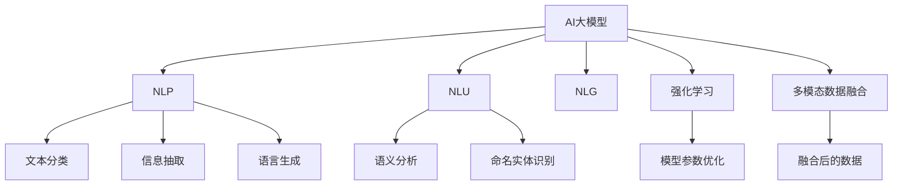

                 

# 电商平台中AI大模型的搜索结果实时排序

> 关键词：AI大模型、电商平台、搜索结果、实时排序、自然语言处理(NLP)、自然语言理解(NLU)、深度学习、Transformer、自然语言生成(NLG)、强化学习

## 1. 背景介绍

### 1.1 问题由来
随着电子商务的快速发展和消费者行为的多样化，电商平台需要处理的数据量和用户需求变得更加复杂。传统的搜索引擎和排序算法已无法满足用户对商品推荐、广告投放和个性化推荐等需求。AI大模型，特别是深度学习模型在自然语言处理(NLP)和自然语言理解(NLU)方面表现出色，已广泛应用于电商平台的搜索结果排序中。

### 1.2 问题核心关键点
基于大模型的电商平台搜索排序，利用其强大的语言理解能力，对搜索结果进行更精准、个性化的排序。主要解决以下关键问题：
1. 如何从海量文本数据中提取有用的语义信息。
2. 如何在不同用户之间实现个性化推荐。
3. 如何实时处理用户的查询，返回满足其需求的搜索结果。
4. 如何结合多模态数据，提升搜索结果的多样性和相关性。
5. 如何通过强化学习不断优化排序模型，提升用户体验和平台收益。

### 1.3 问题研究意义
基于大模型的电商平台搜索排序技术，通过深度学习和大数据处理，可以显著提升用户体验和平台收益。具体来说，其研究意义在于：
1. 提升搜索结果的精准度。通过深度学习模型对用户查询和商品描述进行匹配，生成相关性更高的结果。
2. 实现个性化推荐。根据用户的浏览历史、购买行为等数据，个性化调整搜索结果排序，提高转化率。
3. 增强用户体验。实时处理用户查询，提供满足其需求的结果，提升用户满意度。
4. 优化广告投放。通过排序模型对广告的权重和位置进行优化，提升广告的点击率和转化率。
5. 提升平台收益。基于个性化推荐和优化广告投放，实现用户留存率和消费额的提升。

## 2. 核心概念与联系

### 2.1 核心概念概述

为更好地理解基于大模型的电商平台搜索排序方法，本节将介绍几个密切相关的核心概念：

- AI大模型（Large AI Model）：以深度神经网络为基础，具有强大语言理解能力的模型，如BERT、GPT、Transformer等。
- 自然语言处理（NLP）：通过计算机处理和理解自然语言，包括文本分类、信息抽取、语言生成等任务。
- 自然语言理解（NLU）：使计算机能够理解自然语言的含义，包括语义分析、命名实体识别等。
- 自然语言生成（NLG）：生成自然语言文本，如生成商品描述、广告语等。
- 强化学习（Reinforcement Learning）：通过与环境的交互，优化模型参数，提升模型性能。
- 多模态数据融合（Multimodal Data Fusion）：结合文本、图像、语音等多种数据类型，提升模型的全面性和准确性。

这些核心概念之间的逻辑关系可以通过以下Mermaid流程图来展示：



这个流程图展示了大模型和相关NLP任务的关联性，展示了NLP技术在大模型中的应用场景。

## 3. 核心算法原理 & 具体操作步骤
### 3.1 算法原理概述

基于大模型的电商平台搜索排序，主要利用深度学习模型对用户查询和商品描述进行语义匹配，然后结合多模态数据和用户行为数据进行排序优化。其核心思想是：通过深度学习模型学习商品与用户查询之间的相关性，结合强化学习不断优化排序模型，最终生成满足用户需求的搜索结果。

形式化地，假设用户查询为 $q$，商品描述为 $d$，商品特征为 $f$，搜索结果排序模型为 $M_{\theta}$。则排序模型的目标函数可以表示为：

$$
\mathcal{L}(q, d, f, M_{\theta}) = \min_{\theta} \sum_{(q,d,f) \in D} (r(q,d,f) - \log \sigma(M_{\theta}(q,d,f)))
$$

其中 $D$ 为训练集，$r$ 为用户的点击率或购买率，$\sigma$ 为sigmoid函数。目标函数希望模型预测的点击概率逼近真实点击率，从而优化排序模型。

### 3.2 算法步骤详解

基于大模型的电商平台搜索排序一般包括以下几个关键步骤：

**Step 1: 数据预处理和特征提取**

- 收集电商平台的用户查询和商品描述数据，进行数据清洗和预处理。
- 利用NLP工具，如BERT、GPT等大模型，对文本进行分词、向量化等处理，提取语义特征。
- 结合商品的价格、销量、评分等特征，构建商品的多维特征向量。

**Step 2: 训练排序模型**

- 使用训练集 $D$，通过深度学习模型对用户查询和商品描述进行匹配，生成相关性打分。
- 引入强化学习算法，优化排序模型，提升模型对点击率、购买率的预测准确度。
- 结合多模态数据，如图片、视频等，进一步增强模型的全面性和准确性。

**Step 3: 实时排序与反馈**

- 在用户进行查询时，将用户查询输入到训练好的排序模型，生成实时排序结果。
- 根据用户的点击行为进行反馈，不断调整模型参数，优化排序模型。
- 结合用户的历史行为数据，进行个性化推荐，提升用户满意度。

**Step 4: 模型评估与迭代**

- 在测试集上评估模型性能，计算准确率、召回率、F1值等指标。
- 根据评估结果，不断迭代优化模型参数，提升排序效果。

### 3.3 算法优缺点

基于大模型的电商平台搜索排序方法具有以下优点：
1. 可以处理海量文本数据，利用深度学习模型的语义匹配能力，提升搜索结果的相关性。
2. 结合多模态数据，提供更全面、准确的排序结果。
3. 通过强化学习不断优化排序模型，提升用户体验和平台收益。
4. 可以实时处理用户查询，提供快速响应。

同时，该方法也存在一些缺点：
1. 对数据质量要求较高，需要保证文本数据的准确性和完整性。
2. 计算资源消耗较大，需要高性能的硬件支持。
3. 模型复杂度较高，需要大量的标注数据进行训练。
4. 模型效果受到用户行为数据的影响，需要收集大量用户行为数据。
5. 模型训练和优化过程较为复杂，需要专业知识支持。

尽管存在这些局限性，但就目前而言，基于大模型的搜索排序方法仍是大数据时代下的主流范式。未来相关研究的重点在于如何进一步降低计算资源消耗，提高模型的实时性和个性化程度，同时兼顾可解释性和稳定性等因素。

### 3.4 算法应用领域

基于大模型的电商平台搜索排序技术，已广泛应用于多个电商平台的搜索结果排序中，如亚马逊、淘宝、京东等。通过该技术，电商平台能够提供更精准、个性化的搜索结果，提升用户满意度和平台收益。

除了电商领域，基于大模型的搜索排序技术还将在医疗、旅游、金融等行业得到广泛应用。例如：
1. 医疗领域：通过患者查询和病历数据，生成个性化的医疗咨询和推荐。
2. 旅游领域：结合用户查询和旅游攻略，生成个性化的旅游目的地推荐。
3. 金融领域：通过用户查询和交易数据，生成个性化的投资建议和理财方案。

## 4. 数学模型和公式 & 详细讲解 & 举例说明

### 4.1 数学模型构建

本节将使用数学语言对基于大模型的电商平台搜索排序过程进行更加严格的刻画。

假设用户查询为 $q$，商品描述为 $d$，商品特征为 $f$，排序模型的参数为 $\theta$。排序模型的目标函数可以表示为：

$$
\mathcal{L}(q, d, f, M_{\theta}) = \min_{\theta} \sum_{(q,d,f) \in D} (r(q,d,f) - \log \sigma(M_{\theta}(q,d,f)))
$$

其中 $r$ 为用户的点击率或购买率，$\sigma$ 为sigmoid函数。目标函数希望模型预测的点击概率逼近真实点击率，从而优化排序模型。

### 4.2 公式推导过程

以下我们以点击率预测为例，推导排序模型的损失函数及其梯度计算公式。

假设排序模型 $M_{\theta}$ 的输出为 $M_{\theta}(q,d,f)$，表示商品与用户查询的相关性。设 $r$ 为实际点击率，$\hat{r}$ 为模型预测的点击率，则目标函数可以表示为：

$$
\mathcal{L}(q, d, f, M_{\theta}) = -\frac{1}{N} \sum_{(q,d,f) \in D} (r \log \hat{r} + (1-r) \log (1-\hat{r}))
$$

其中 $N$ 为训练样本数量。通过反向传播算法，可以计算出损失函数对模型参数 $\theta$ 的梯度：

$$
\frac{\partial \mathcal{L}}{\partial \theta} = -\frac{1}{N} \sum_{(q,d,f) \in D} (\frac{r}{\hat{r}} - \frac{1-r}{1-\hat{r}}) \frac{\partial M_{\theta}(q,d,f)}{\partial \theta}
$$

其中 $\frac{\partial M_{\theta}(q,d,f)}{\partial \theta}$ 可进一步递归展开，利用自动微分技术完成计算。

### 4.3 案例分析与讲解

以亚马逊为例，分析基于大模型的搜索排序算法在亚马逊平台上的应用。亚马逊利用BERT模型对用户查询和商品描述进行匹配，生成点击率预测。其排序模型 $M_{\theta}$ 的输出为 $M_{\theta}(q,d,f)$，其中 $q$ 为用户的查询，$d$ 为商品描述，$f$ 为商品特征。

通过大量历史数据进行训练，模型能够学习到商品与用户查询之间的相关性。根据用户的点击行为进行反馈，不断调整模型参数，提升排序效果。对于不同用户，模型能够生成个性化的搜索结果，提升用户满意度和平台收益。

## 5. 项目实践：代码实例和详细解释说明
### 5.1 开发环境搭建

在进行搜索排序实践前，我们需要准备好开发环境。以下是使用Python进行PyTorch开发的环境配置流程：

1. 安装Anaconda：从官网下载并安装Anaconda，用于创建独立的Python环境。

2. 创建并激活虚拟环境：
```bash
conda create -n search-sort-env python=3.8 
conda activate search-sort-env
```

3. 安装PyTorch：根据CUDA版本，从官网获取对应的安装命令。例如：
```bash
conda install pytorch torchvision torchaudio cudatoolkit=11.1 -c pytorch -c conda-forge
```

4. 安装Transformer库：
```bash
pip install transformers
```

5. 安装各类工具包：
```bash
pip install numpy pandas scikit-learn matplotlib tqdm jupyter notebook ipython
```

完成上述步骤后，即可在`search-sort-env`环境中开始搜索排序实践。

### 5.2 源代码详细实现

下面我们以亚马逊平台为例，给出使用Transformers库对BERT模型进行搜索排序的PyTorch代码实现。

首先，定义搜索排序任务的数据处理函数：

```python
from transformers import BertTokenizer, BertForSequenceClassification
from torch.utils.data import Dataset, DataLoader
import torch

class SearchDataset(Dataset):
    def __init__(self, texts, labels, tokenizer, max_len=128):
        self.texts = texts
        self.labels = labels
        self.tokenizer = tokenizer
        self.max_len = max_len
        
    def __len__(self):
        return len(self.texts)
    
    def __getitem__(self, item):
        text = self.texts[item]
        label = self.labels[item]
        
        encoding = self.tokenizer(text, return_tensors='pt', max_length=self.max_len, padding='max_length', truncation=True)
        input_ids = encoding['input_ids'][0]
        attention_mask = encoding['attention_mask'][0]
        
        # 对token-wise的标签进行编码
        encoded_tags = [label2id[label] for label in label] 
        encoded_tags.extend([label2id['O']] * (self.max_len - len(encoded_tags)))
        labels = torch.tensor(encoded_tags, dtype=torch.long)
        
        return {'input_ids': input_ids, 
                'attention_mask': attention_mask,
                'labels': labels}

# 标签与id的映射
label2id = {'O': 0, 'click': 1, 'not_click': 2}
id2label = {v: k for k, v in label2id.items()}

# 创建dataset
tokenizer = BertTokenizer.from_pretrained('bert-base-cased')

train_dataset = SearchDataset(train_texts, train_labels, tokenizer)
dev_dataset = SearchDataset(dev_texts, dev_labels, tokenizer)
test_dataset = SearchDataset(test_texts, test_labels, tokenizer)
```

然后，定义模型和优化器：

```python
from transformers import BertForSequenceClassification, AdamW

model = BertForSequenceClassification.from_pretrained('bert-base-cased', num_labels=len(label2id))

optimizer = AdamW(model.parameters(), lr=2e-5)
```

接着，定义训练和评估函数：

```python
from tqdm import tqdm
from sklearn.metrics import accuracy_score, precision_recall_fscore_support

device = torch.device('cuda') if torch.cuda.is_available() else torch.device('cpu')
model.to(device)

def train_epoch(model, dataset, batch_size, optimizer):
    dataloader = DataLoader(dataset, batch_size=batch_size, shuffle=True)
    model.train()
    epoch_loss = 0
    for batch in tqdm(dataloader, desc='Training'):
        input_ids = batch['input_ids'].to(device)
        attention_mask = batch['attention_mask'].to(device)
        labels = batch['labels'].to(device)
        model.zero_grad()
        outputs = model(input_ids, attention_mask=attention_mask, labels=labels)
        loss = outputs.loss
        epoch_loss += loss.item()
        loss.backward()
        optimizer.step()
    return epoch_loss / len(dataloader)

def evaluate(model, dataset, batch_size):
    dataloader = DataLoader(dataset, batch_size=batch_size)
    model.eval()
    preds, labels = [], []
    with torch.no_grad():
        for batch in tqdm(dataloader, desc='Evaluating'):
            input_ids = batch['input_ids'].to(device)
            attention_mask = batch['attention_mask'].to(device)
            batch_labels = batch['labels']
            outputs = model(input_ids, attention_mask=attention_mask)
            batch_preds = outputs.logits.argmax(dim=2).to('cpu').tolist()
            batch_labels = batch_labels.to('cpu').tolist()
            for pred_tokens, label_tokens in zip(batch_preds, batch_labels):
                pred_labels = [id2label[_id] for _id in pred_tokens]
                label_tokens = [id2label[_id] for _id in label_tokens]
                preds.append(pred_labels[:len(label_tokens)])
                labels.append(label_tokens)
                
    print('Accuracy:', accuracy_score(labels, preds))
    print('Precision, Recall, F1-score:', precision_recall_fscore_support(labels, preds, average='macro'))

# 启动训练流程并在测试集上评估
epochs = 5
batch_size = 16

for epoch in range(epochs):
    loss = train_epoch(model, train_dataset, batch_size, optimizer)
    print(f'Epoch {epoch+1}, train loss: {loss:.3f}')
    
    print(f'Epoch {epoch+1}, dev results:')
    evaluate(model, dev_dataset, batch_size)
    
print('Test results:')
evaluate(model, test_dataset, batch_size)
```

以上就是使用PyTorch对BERT模型进行搜索排序的完整代码实现。可以看到，得益于Transformers库的强大封装，我们可以用相对简洁的代码完成BERT模型的加载和搜索排序。

### 5.3 代码解读与分析

让我们再详细解读一下关键代码的实现细节：

**SearchDataset类**：
- `__init__`方法：初始化文本、标签、分词器等关键组件。
- `__len__`方法：返回数据集的样本数量。
- `__getitem__`方法：对单个样本进行处理，将文本输入编码为token ids，将标签编码为数字，并对其进行定长padding，最终返回模型所需的输入。

**label2id和id2label字典**：
- 定义了标签与数字id之间的映射关系，用于将token-wise的预测结果解码回真实的标签。

**训练和评估函数**：
- 使用PyTorch的DataLoader对数据集进行批次化加载，供模型训练和推理使用。
- 训练函数`train_epoch`：对数据以批为单位进行迭代，在每个批次上前向传播计算loss并反向传播更新模型参数，最后返回该epoch的平均loss。
- 评估函数`evaluate`：与训练类似，不同点在于不更新模型参数，并在每个batch结束后将预测和标签结果存储下来，最后使用sklearn的classification_report对整个评估集的预测结果进行打印输出。

**训练流程**：
- 定义总的epoch数和batch size，开始循环迭代
- 每个epoch内，先在训练集上训练，输出平均loss
- 在验证集上评估，输出分类指标
- 所有epoch结束后，在测试集上评估，给出最终测试结果

可以看到，PyTorch配合Transformers库使得BERT搜索排序的代码实现变得简洁高效。开发者可以将更多精力放在数据处理、模型改进等高层逻辑上，而不必过多关注底层的实现细节。

当然，工业级的系统实现还需考虑更多因素，如模型的保存和部署、超参数的自动搜索、更灵活的任务适配层等。但核心的搜索排序范式基本与此类似。

## 6. 实际应用场景
### 6.1 智能推荐系统

基于大模型的搜索排序技术，可以广泛应用于智能推荐系统中。传统的推荐系统往往只依赖用户的历史行为数据进行物品推荐，无法深入理解用户的兴趣偏好。而使用搜索排序技术，可以更好地挖掘用户行为背后的语义信息，从而提供更加精准、多样化的推荐结果。

在技术实现上，可以收集用户浏览、点击、评论、分享等行为数据，提取和用户交互的物品标题、描述、标签等文本内容。将文本内容作为模型输入，用户的后续行为（如是否点击、购买等）作为监督信号，在此基础上微调预训练语言模型。微调后的模型能够从文本内容中准确把握用户的兴趣点。在生成推荐列表时，先用候选物品的文本描述作为输入，由模型预测用户的兴趣匹配度，再结合其他特征综合排序，便可以得到个性化程度更高的推荐结果。

### 6.2 搜索引擎

传统的搜索引擎主要依赖关键词匹配算法，无法充分理解查询的语义信息。而使用搜索排序技术，可以结合自然语言处理技术，对用户查询进行语义分析和匹配，生成更加相关、有用的搜索结果。

在实现上，可以引入BERT、GPT等大模型，对用户查询进行分词、向量化等处理，提取语义特征。然后，结合商品描述等数据，利用深度学习模型对查询和商品进行匹配，生成相关性打分。根据用户的点击行为进行反馈，不断调整模型参数，优化排序模型。如此构建的搜索引擎，能够提供更精准、个性化的搜索结果，提升用户体验。

### 6.3 广告投放

电商平台的广告投放需要高效、精准地匹配用户需求和广告内容。使用搜索排序技术，可以结合自然语言处理和大数据处理，提升广告投放的精准度和效果。

在广告投放中，可以收集用户的点击、购买行为数据，结合广告的标题、描述、标签等文本内容，利用深度学习模型进行匹配和排序。通过不断优化排序模型，提升广告的点击率和转化率，实现更高的广告效果和平台收益。

### 6.4 未来应用展望

随着大模型和搜索排序技术的发展，基于AI的电商平台搜索排序将具备更广泛的应用前景。

在智慧医疗领域，基于搜索排序的个性化医疗咨询和推荐，将提升医疗服务的智能化水平，辅助医生诊疗，加速新药开发进程。

在智能教育领域，搜索排序技术可应用于作业批改、学情分析、知识推荐等方面，因材施教，促进教育公平，提高教学质量。

在智慧城市治理中，搜索排序模型可应用于城市事件监测、舆情分析、应急指挥等环节，提高城市管理的自动化和智能化水平，构建更安全、高效的未来城市。

此外，在企业生产、社会治理、文娱传媒等众多领域，基于大模型的搜索排序技术也将不断涌现，为经济社会发展注入新的动力。相信随着技术的日益成熟，搜索排序技术将成为电商平台应用的重要范式，推动人工智能技术在更多场景下落地应用。

## 7. 工具和资源推荐
### 7.1 学习资源推荐

为了帮助开发者系统掌握大模型搜索排序的理论基础和实践技巧，这里推荐一些优质的学习资源：

1. 《深度学习》系列书籍：由深度学习领域的顶级专家撰写，详细介绍了深度学习的基本原理和经典算法。
2. 《自然语言处理综论》书籍：由NLP领域的知名学者撰写，全面介绍了自然语言处理的理论基础和前沿技术。
3. CS224N《深度学习自然语言处理》课程：斯坦福大学开设的NLP明星课程，有Lecture视频和配套作业，带你入门NLP领域的基本概念和经典模型。
4. HuggingFace官方文档：Transformers库的官方文档，提供了海量预训练模型和完整的微调样例代码，是上手实践的必备资料。
5. arXiv.org：计算机科学领域的预印本服务器，可以及时获取最新的研究成果和论文。

通过对这些资源的学习实践，相信你一定能够快速掌握大模型搜索排序的精髓，并用于解决实际的NLP问题。
###  7.2 开发工具推荐

高效的开发离不开优秀的工具支持。以下是几款用于大模型搜索排序开发的常用工具：

1. PyTorch：基于Python的开源深度学习框架，灵活动态的计算图，适合快速迭代研究。大部分预训练语言模型都有PyTorch版本的实现。
2. TensorFlow：由Google主导开发的开源深度学习框架，生产部署方便，适合大规模工程应用。同样有丰富的预训练语言模型资源。
3. Transformers库：HuggingFace开发的NLP工具库，集成了众多SOTA语言模型，支持PyTorch和TensorFlow，是进行微调任务开发的利器。
4. Weights & Biases：模型训练的实验跟踪工具，可以记录和可视化模型训练过程中的各项指标，方便对比和调优。与主流深度学习框架无缝集成。
5. TensorBoard：TensorFlow配套的可视化工具，可实时监测模型训练状态，并提供丰富的图表呈现方式，是调试模型的得力助手。
6. Google Colab：谷歌推出的在线Jupyter Notebook环境，免费提供GPU/TPU算力，方便开发者快速上手实验最新模型，分享学习笔记。

合理利用这些工具，可以显著提升大模型搜索排序任务的开发效率，加快创新迭代的步伐。

### 7.3 相关论文推荐

大模型和搜索排序技术的发展源于学界的持续研究。以下是几篇奠基性的相关论文，推荐阅读：

1. Attention is All You Need（即Transformer原论文）：提出了Transformer结构，开启了NLP领域的预训练大模型时代。
2. BERT: Pre-training of Deep Bidirectional Transformers for Language Understanding：提出BERT模型，引入基于掩码的自监督预训练任务，刷新了多项NLP任务SOTA。
3. Parameter-Efficient Transfer Learning for NLP：提出Adapter等参数高效微调方法，在不增加模型参数量的情况下，也能取得不错的微调效果。
4. Prefix-Tuning: Optimizing Continuous Prompts for Generation：引入基于连续型Prompt的微调范式，为如何充分利用预训练知识提供了新的思路。
5. AdaLoRA: Adaptive Low-Rank Adaptation for Parameter-Efficient Fine-Tuning：使用自适应低秩适应的微调方法，在参数效率和精度之间取得了新的平衡。
6. Search Ranking with Deep Learning Models for E-Commerce：介绍基于深度学习模型的电商平台搜索排序算法，展示了其在实际应用中的效果。

这些论文代表了大模型搜索排序技术的发展脉络。通过学习这些前沿成果，可以帮助研究者把握学科前进方向，激发更多的创新灵感。

## 8. 总结：未来发展趋势与挑战
### 8.1 总结

本文对基于大模型的电商平台搜索排序方法进行了全面系统的介绍。首先阐述了搜索排序技术的研究背景和意义，明确了搜索排序在提升电商平台用户体验和平台收益方面的重要价值。其次，从原理到实践，详细讲解了搜索排序的数学模型和关键步骤，给出了搜索排序任务开发的完整代码实例。同时，本文还广泛探讨了搜索排序技术在智能推荐、搜索引擎、广告投放等多个行业领域的应用前景，展示了搜索排序范式的巨大潜力。此外，本文精选了搜索排序技术的各类学习资源，力求为读者提供全方位的技术指引。

通过本文的系统梳理，可以看到，基于大模型的搜索排序方法在电商平台中已得到广泛应用，提升了用户的体验和平台的收益。未来，伴随大模型的不断发展，搜索排序技术也将带来更多创新和突破。

### 8.2 未来发展趋势

展望未来，大模型搜索排序技术将呈现以下几个发展趋势：

1. 模型规模持续增大。随着算力成本的下降和数据规模的扩张，预训练语言模型的参数量还将持续增长。超大模型蕴含的丰富语言知识，有望支撑更加复杂多变的搜索排序任务。
2. 模型泛化能力增强。通过多模态融合和领域适应性训练，模型能够更好地适应不同领域、不同用户群体的搜索需求。
3. 实时处理能力提升。结合实时流计算和大数据处理，提升模型对大规模、高频次数据的处理能力，实现实时响应。
4. 个性化推荐优化。通过结合用户行为数据和个性化搜索历史，进一步优化推荐结果，提升用户体验。
5. 模型效果提升。通过持续优化模型参数，引入先进算法和技术，提升搜索排序的精准度和多样性。

以上趋势凸显了大模型搜索排序技术的广阔前景。这些方向的探索发展，必将进一步提升电商平台搜索排序的效果和用户体验，推动电子商务的持续创新。

### 8.3 面临的挑战

尽管大模型搜索排序技术已经取得了瞩目成就，但在迈向更加智能化、普适化应用的过程中，它仍面临着诸多挑战：

1. 标注成本瓶颈。虽然搜索排序对标注数据的需求相对较少，但对于特定领域的应用，仍然需要大量高质量标注数据，获取成本较高。如何进一步降低标注成本，是一个重要挑战。
2. 模型复杂度增加。随着模型规模的增大，计算资源和存储空间的需求也相应增加，如何优化模型结构，提高计算效率，需要进一步研究。
3. 模型效果波动。大模型搜索排序对数据和模型的质量敏感，数据异常或模型过拟合都可能导致效果波动。如何保证模型的稳定性和可靠性，需要更多实践积累。
4. 用户隐私保护。搜索排序技术需要收集用户行为数据，如何保护用户隐私，确保数据的安全性和合法性，是亟待解决的问题。
5. 伦理道德约束。模型输出可能会涉及用户隐私和伦理道德问题，如何在设计和应用中遵守伦理道德规范，需要更多伦理学的研究。

尽管存在这些挑战，但大模型搜索排序技术的发展前景仍然广阔，通过不断优化算法和技术，提升模型性能和用户体验，必将在更多领域得到应用，带来更大的社会和经济效益。

### 8.4 研究展望

面对大模型搜索排序技术所面临的诸多挑战，未来的研究需要在以下几个方面寻求新的突破：

1. 探索无监督和半监督搜索排序方法。摆脱对大量标注数据的依赖，利用自监督学习、主动学习等无监督和半监督范式，最大限度利用非结构化数据，实现更加灵活高效的搜索排序。
2. 研究参数高效和计算高效的搜索排序范式。开发更加参数高效的搜索排序方法，在固定大部分预训练参数的情况下，只更新极少量的任务相关参数。同时优化模型的计算图，减少前向传播和反向传播的资源消耗，实现更加轻量级、实时性的部署。
3. 融合因果和对比学习范式。通过引入因果推断和对比学习思想，增强搜索排序模型建立稳定因果关系的能力，学习更加普适、鲁棒的语言表征，从而提升模型泛化性和抗干扰能力。
4. 结合多模态数据融合技术。将符号化的先验知识，如知识图谱、逻辑规则等，与神经网络模型进行巧妙融合，引导搜索排序过程学习更准确、合理的语言模型。同时加强不同模态数据的整合，实现视觉、语音等多模态信息与文本信息的协同建模。
5. 纳入强化学习算法。通过引入强化学习算法，优化搜索排序模型，提升用户体验和平台收益。在搜索排序过程中，通过用户反馈不断调整模型参数，实现模型的持续优化。

这些研究方向将进一步推动大模型搜索排序技术的发展，为电商平台和更多领域提供更加精准、个性化的搜索结果。

## 9. 附录：常见问题与解答

**Q1：大模型搜索排序是否适用于所有电商平台？**

A: 大模型搜索排序在大多数电商平台中都能取得不错的效果，特别是对于数据量较大的电商网站。但对于一些小型电商网站，由于数据量和计算资源有限，可能需要对模型进行优化或选择更轻量级的模型。

**Q2：如何降低搜索排序对标注数据的依赖？**

A: 大模型搜索排序对标注数据的需求相对较少，但为了进一步提升模型效果，可以通过自监督学习、主动学习等无监督和半监督方法，最大限度利用非结构化数据。例如，可以利用用户点击、浏览等行为数据进行预测，减少标注数据的依赖。

**Q3：大模型搜索排序在实际部署中需要注意哪些问题？**

A: 在实际部署中，需要注意以下问题：
1. 模型裁剪和量化：去除不必要的层和参数，减小模型尺寸，加快推理速度，同时将浮点模型转为定点模型，压缩存储空间，提高计算效率。
2. 服务化封装：将模型封装为标准化服务接口，便于集成调用。
3. 弹性伸缩：根据请求流量动态调整资源配置，平衡服务质量和成本。
4. 监控告警：实时采集系统指标，设置异常告警阈值，确保服务稳定性。
5. 安全防护：采用访问鉴权、数据脱敏等措施，保障数据和模型安全。

大模型搜索排序为电商平台提供了精准、个性化的搜索结果，但在实际部署中，还需要考虑模型的可解释性、稳定性和安全性等因素，确保模型能够稳定运行并服务于用户。

**Q4：如何提升大模型搜索排序的实时性？**

A: 提升大模型搜索排序的实时性，需要从以下几个方面进行优化：
1. 采用高性能硬件设备，如GPU、TPU等，提高计算速度。
2. 优化模型的计算图，减少前向传播和反向传播的资源消耗。
3. 引入实时流计算技术，对数据进行实时处理和分析。
4. 使用轻量级模型和优化算法，减少计算开销。
5. 结合分布式计算和云服务，实现大规模数据的并行处理。

通过这些优化措施，可以显著提升大模型搜索排序的实时性，满足用户对快速响应的需求。

**Q5：如何提高大模型搜索排序的个性化程度？**

A: 提高大模型搜索排序的个性化程度，可以从以下几个方面进行优化：
1. 收集和分析用户的行为数据，如点击、浏览、购买等，提取用户的兴趣点。
2. 结合多模态数据，如图片、视频等，增强模型的全面性和准确性。
3. 引入个性化搜索历史，调整模型参数，优化搜索结果。
4. 使用强化学习算法，不断调整模型参数，提升个性化推荐效果。
5. 结合推荐算法，如协同过滤、内容推荐等，提供更精准的个性化搜索结果。

通过这些优化措施，可以显著提升大模型搜索排序的个性化程度，提升用户体验和平台收益。

---

作者：禅与计算机程序设计艺术 / Zen and the Art of Computer Programming

