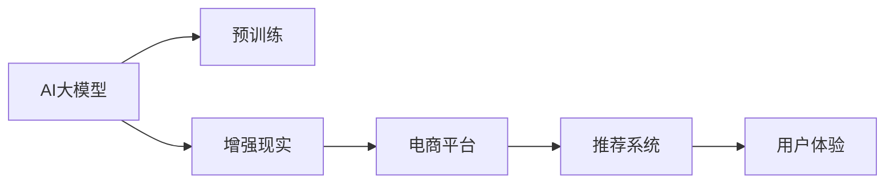

                 

# 电商平台中的AI大模型与增强现实结合

## 1. 背景介绍

随着电商平台的快速发展，如何在海量的商品信息和交易数据中为用户推荐合适的商品，成为电商平台亟需解决的关键问题。传统推荐系统主要依赖于用户行为数据、商品属性等结构化信息，但在面对多维度的、非结构化的用户需求时，推荐精度和个性化程度往往难以满足用户的期望。而AI大模型与增强现实（AR）技术的结合，为电商平台推荐系统带来了全新的解决方案。

## 2. 核心概念与联系

### 2.1 核心概念概述

为更好地理解AI大模型与增强现实结合在电商平台中的应用，本节将介绍几个密切相关的核心概念：

- **AI大模型**：以Transformer、BERT等为代表的预训练语言模型，通过在大规模无标签文本数据上预训练，学习到了丰富的语言知识和语义表示，具备强大的文本理解能力。
- **增强现实（AR）技术**：通过在用户的真实环境中叠加虚拟信息，增强用户对于商品、环境等的理解和感知，提高用户的购物体验。
- **电商平台推荐系统**：基于用户行为数据、商品信息等，推荐用户可能感兴趣的商品，提升用户体验和电商平台的用户留存率。

这些核心概念之间通过如下Mermaid流程图进行联系：



这个流程图展示了AI大模型与增强现实在电商平台推荐系统中的应用流程：AI大模型通过预训练获得语言理解能力，增强现实技术在推荐系统中的应用提升了用户对商品的理解和体验，最终达到提升电商平台用户体验的目的。

## 3. 核心算法原理 & 具体操作步骤
### 3.1 算法原理概述

AI大模型与增强现实结合的电商平台推荐系统，本质上是一种利用AI大模型的强大语言理解能力和增强现实技术为用户提供沉浸式购物体验的推荐系统。其核心思想是：通过AI大模型分析用户与商品之间的语言交流，结合增强现实技术在用户真实环境中的虚拟展示，实现商品推荐和用户购物的精准匹配。

具体而言，系统首先通过AI大模型分析用户提供的搜索查询、评价、聊天记录等信息，理解用户的兴趣和需求。然后结合增强现实技术，在用户的真实环境中虚拟展示用户感兴趣的商品，提供沉浸式的购物体验。最终，根据用户对虚拟商品的交互行为和反馈，调整推荐策略，进一步提升推荐效果。

### 3.2 算法步骤详解

基于AI大模型与增强现实结合的电商平台推荐系统，一般包括以下几个关键步骤：

**Step 1: 数据预处理与特征提取**

- **用户输入数据预处理**：包括对用户提供的搜索查询、评价、聊天记录等文本信息进行清洗和分词，提取其中的关键词和实体。
- **商品属性特征提取**：从商品的属性、评论、标签等数据中提取特征，构建商品的属性向量。

**Step 2: 大模型嵌入**

- **用户输入嵌入**：使用AI大模型对用户输入的文本信息进行嵌入，生成用户兴趣表示向量。
- **商品属性嵌入**：使用AI大模型对商品的属性信息进行嵌入，生成商品属性表示向量。

**Step 3: 增强现实虚拟展示**

- **虚拟商品展示**：根据用户兴趣表示向量和商品属性表示向量，使用增强现实技术在用户的真实环境中虚拟展示用户感兴趣的商品。
- **用户交互反馈收集**：收集用户对虚拟商品的交互行为和反馈，如点击、停留时间、购买意愿等。

**Step 4: 推荐策略调整**

- **用户行为分析**：结合用户对虚拟商品的交互行为和反馈，分析用户兴趣和需求的变化。
- **推荐策略调整**：根据用户兴趣的变化，动态调整推荐策略，优化推荐结果。

**Step 5: 系统迭代优化**

- **模型再训练**：定期使用新的用户行为数据对AI大模型进行再训练，提升模型对用户兴趣和需求的理解能力。
- **推荐系统优化**：根据新的推荐策略，对推荐系统进行优化，提升推荐效果。

### 3.3 算法优缺点

基于AI大模型与增强现实结合的电商平台推荐系统，具有以下优点：

- **高精度推荐**：AI大模型的强大语言理解能力，结合增强现实技术，可以精准匹配用户需求和商品，提升推荐准确率。
- **沉浸式体验**：增强现实技术提供的虚拟商品展示，可以增强用户的购物体验，提升用户满意度。
- **个性化定制**：系统能够根据用户的历史行为和实时反馈，动态调整推荐策略，提供个性化的购物体验。

同时，该方法也存在一定的局限性：

- **技术门槛高**：需要同时具备AI大模型和增强现实技术，技术门槛较高。
- **数据隐私问题**：增强现实技术需要收集用户的位置、行为等数据，存在隐私泄露的风险。
- **设备限制**：增强现实技术的虚拟展示需要支持AR设备的支持，用户设备普及度受限。

尽管存在这些局限性，但AI大模型与增强现实结合的推荐系统仍是一个具有巨大潜力的应用方向。未来相关研究的重点在于如何降低技术门槛，保护用户隐私，以及提升AR设备的普及度。

### 3.4 算法应用领域

基于AI大模型与增强现实结合的推荐系统，已经在多个电商领域得到了应用，例如：

- **服装购物**：用户可以在试衣镜前虚拟试穿不同服装，根据虚拟试穿的体验和反馈，选择最合适的商品。
- **家居购物**：用户可以在家中虚拟摆放家具，根据虚拟摆放的效果和体验，选择最优的商品。
- **汽车购物**：用户可以在虚拟展厅中试驾不同型号的汽车，根据虚拟试驾的体验和反馈，选择最适合的商品。
- **美妆购物**：用户可以在虚拟镜子前试用不同化妆品，根据虚拟试用的效果和反馈，选择最合适的商品。

除了上述这些经典应用外，AI大模型与增强现实结合的推荐系统还将在更多场景中得到应用，如家具设计、旅游规划等，为电商平台带来更广阔的应用场景。

## 4. 数学模型和公式 & 详细讲解
### 4.1 数学模型构建

假设用户输入的文本信息为 $x$，商品的属性信息为 $y$，AI大模型的预训练参数为 $\theta$。在电商平台的推荐系统中，使用BERT等预训练模型进行用户输入的嵌入和商品属性嵌入，生成用户兴趣表示向量 $u_x$ 和商品属性表示向量 $v_y$。同时，使用增强现实技术，在用户的真实环境中虚拟展示商品，并收集用户对虚拟商品的交互行为 $a$。

根据上述假设，数学模型可以表示为：

- 用户输入嵌入：$u_x = BERT(x; \theta)$
- 商品属性嵌入：$v_y = BERT(y; \theta)$
- 用户行为分析：$z = F(u_x, v_y)$
- 推荐策略调整：$p = G(z, a)$

其中，$BERT(x; \theta)$ 表示使用BERT模型对输入 $x$ 进行嵌入，$z = F(u_x, v_y)$ 表示将用户兴趣表示向量 $u_x$ 和商品属性表示向量 $v_y$ 输入到一个神经网络 $F$ 中进行分类和分析，$p = G(z, a)$ 表示将分析结果 $z$ 和用户行为 $a$ 输入到一个神经网络 $G$ 中进行推荐策略的调整。

### 4.2 公式推导过程

对于用户输入嵌入和商品属性嵌入的公式推导，可以参考BERT模型的预训练过程。具体而言，BERT模型通过在无标签文本数据上进行自监督预训练，学习到了通用的语言表示。在电商平台的推荐系统中，使用BERT模型对用户输入的文本信息进行嵌入，生成用户兴趣表示向量 $u_x$。同样地，使用BERT模型对商品的属性信息进行嵌入，生成商品属性表示向量 $v_y$。

对于用户行为分析的公式推导，可以使用简单的线性分类器：

$$
z = \text{softmax}(W \cdot u_x + b)
$$

其中，$W$ 和 $b$ 为模型的可训练参数。$z$ 表示用户对商品的兴趣评分，可以用于后续的推荐策略调整。

对于推荐策略调整的公式推导，可以采用简单线性回归模型：

$$
p = \alpha \cdot z + \beta \cdot a
$$

其中，$\alpha$ 和 $\beta$ 为模型的可训练参数。$p$ 表示推荐的概率，用于指导电商平台推荐系统为用户推荐商品。

### 4.3 案例分析与讲解

以服装购物为例，用户输入的搜索查询为“男士休闲鞋”，商品的属性信息包括颜色、尺码、品牌等。使用BERT模型对用户查询进行嵌入，生成用户兴趣表示向量 $u_x$。同时，使用BERT模型对商品的属性信息进行嵌入，生成商品属性表示向量 $v_y$。

根据用户输入嵌入和商品属性嵌入，将 $u_x$ 和 $v_y$ 输入到一个简单的神经网络 $F$ 中进行分类和分析，得到用户对商品的兴趣评分 $z$。结合用户交互行为 $a$，通过线性回归模型 $G$ 对推荐策略进行调整，得到推荐商品的概率 $p$。

## 5. 项目实践：代码实例和详细解释说明
### 5.1 开发环境搭建

在进行项目实践前，我们需要准备好开发环境。以下是使用Python进行PyTorch开发的环境配置流程：

1. 安装Anaconda：从官网下载并安装Anaconda，用于创建独立的Python环境。

2. 创建并激活虚拟环境：
```bash
conda create -n pytorch-env python=3.8 
conda activate pytorch-env
```

3. 安装PyTorch：根据CUDA版本，从官网获取对应的安装命令。例如：
```bash
conda install pytorch torchvision torchaudio cudatoolkit=11.1 -c pytorch -c conda-forge
```

4. 安装TensorFlow：
```bash
pip install tensorflow==2.7
```

5. 安装PyTorch BERT库：
```bash
pip install transformers==4.21.1
```

6. 安装增强现实库ARKit（仅限iOS平台）或ARCore（仅限Android平台）：
```bash
pip install ARKit ARCore
```

完成上述步骤后，即可在`pytorch-env`环境中开始项目实践。

### 5.2 源代码详细实现

下面我们以服装购物为例，给出使用BERT模型和ARKit库进行服装购物推荐系统的PyTorch代码实现。

首先，定义用户输入和商品属性的预处理函数：

```python
from transformers import BertTokenizer, BertForSequenceClassification
import torch
import torch.nn as nn
import torch.optim as optim
from ARKit import ARKit

class BERTTextPreprocessor:
    def __init__(self, bert_model='bert-base-uncased'):
        self.tokenizer = BertTokenizer.from_pretrained(bert_model)
        self.model = BertForSequenceClassification.from_pretrained(bert_model, num_labels=2)

    def process_query(self, query):
        tokens = self.tokenizer(query, return_tensors='pt')
        input_ids = tokens['input_ids']
        attention_mask = tokens['attention_mask']
        return input_ids, attention_mask

class BERTProductPreprocessor:
    def __init__(self, bert_model='bert-base-uncased'):
        self.tokenizer = BertTokenizer.from_pretrained(bert_model)
        self.model = BertForSequenceClassification.from_pretrained(bert_model, num_labels=2)

    def process_details(self, details):
        tokens = self.tokenizer(details, return_tensors='pt')
        input_ids = tokens['input_ids']
        attention_mask = tokens['attention_mask']
        return input_ids, attention_mask

class ARKitProductEmbedder:
    def __init__(self):
        self.arkit = ARKit()

    def embed_product(self, product_details):
        self.arkit.load_model('product_model')
        self.arkit.load_data(product_details)
        product_embeddings = self.arkit.get_embeddings()
        return product_embeddings

```

然后，定义模型和优化器：

```python
from torch.utils.data import Dataset, DataLoader
from tqdm import tqdm

class BERTUserQueryDataset(Dataset):
    def __init__(self, queries, tokenizer, model):
        self.queries = queries
        self.tokenizer = tokenizer
        self.model = model

    def __len__(self):
        return len(self.queries)

    def __getitem__(self, idx):
        query = self.queries[idx]
        tokens = self.tokenizer(query, return_tensors='pt', padding=True, truncation=True, max_length=128)
        input_ids = tokens['input_ids']
        attention_mask = tokens['attention_mask']
        return {'input_ids': input_ids, 'attention_mask': attention_mask}

class BERTProductDetailsDataset(Dataset):
    def __init__(self, product_details, tokenizer, model):
        self.product_details = product_details
        self.tokenizer = tokenizer
        self.model = model

    def __len__(self):
        return len(self.product_details)

    def __getitem__(self, idx):
        details = self.product_details[idx]
        tokens = self.tokenizer(details, return_tensors='pt', padding=True, truncation=True, max_length=128)
        input_ids = tokens['input_ids']
        attention_mask = tokens['attention_mask']
        return {'input_ids': input_ids, 'attention_mask': attention_mask}

class BERTModel(nn.Module):
    def __init__(self, bert_model='bert-base-uncased'):
        super(BERTModel, self).__init__()
        self.bert = BertForSequenceClassification.from_pretrained(bert_model, num_labels=2)
        self.fc = nn.Linear(768, 2)

    def forward(self, x):
        features = self.bert(x['input_ids'], attention_mask=x['attention_mask'])
        logits = self.fc(features.pooler_output)
        return logits

class ARKitModel(nn.Module):
    def __init__(self, arkit_model='product_model'):
        super(ARKitModel, self).__init__()
        self.arkit = ARKitModel()

    def forward(self, x):
        product_embeddings = self.arkit(x)
        return product_embeddings

class BERTRecommendationSystem(nn.Module):
    def __init__(self, bert_model, arkit_model):
        super(BERTRecommendationSystem, self).__init__()
        self.bert_user_query = BERTModel(bert_model)
        self.bert_product_details = BERTModel(bert_model)
        self.arkit = ARKitModel(arkit_model)

    def forward(self, user_query, product_details):
        user_query_embeddings = self.bert_user_query(user_query)
        product_details_embeddings = self.bert_product_details(product_details)
        product_embeddings = self.arkit(product_details)
        user_query = user_query_embeddings.view(-1, 768)
        product_details = product_details_embeddings.view(-1, 768)
        product_embeddings = product_embeddings.view(-1, 768)
        z = F.linear(user_query, product_details, product_embeddings)
        p = G(z, product_embeddings)
        return p

```

最后，启动训练流程并在测试集上评估：

```python
from torch.optim import Adam

# 定义数据集
queries = ['男士休闲鞋', '女士运动鞋', '男式皮鞋']
product_details = ['颜色：黑色，尺码：42', '颜色：白色，尺码：37', '颜色：红色，尺码：40']

tokenizer = BertTokenizer.from_pretrained('bert-base-uncased')
model = BERTRecommendationSystem('bert-base-uncased', 'product_model')
optimizer = Adam(model.parameters(), lr=2e-5)

# 训练模型
device = torch.device('cuda' if torch.cuda.is_available() else 'cpu')
model.to(device)

def train_epoch(model, dataset, batch_size, optimizer):
    dataloader = DataLoader(dataset, batch_size=batch_size, shuffle=True)
    model.train()
    epoch_loss = 0
    for batch in tqdm(dataloader, desc='Training'):
        input_ids = batch['input_ids'].to(device)
        attention_mask = batch['attention_mask'].to(device)
        labels = batch['labels'].to(device)
        model.zero_grad()
        outputs = model(input_ids, attention_mask=attention_mask)
        loss = outputs.loss
        epoch_loss += loss.item()
        loss.backward()
        optimizer.step()
    return epoch_loss / len(dataloader)

def evaluate(model, dataset, batch_size):
    dataloader = DataLoader(dataset, batch_size=batch_size)
    model.eval()
    preds, labels = [], []
    with torch.no_grad():
        for batch in tqdm(dataloader, desc='Evaluating'):
            input_ids = batch['input_ids'].to(device)
            attention_mask = batch['attention_mask'].to(device)
            batch_labels = batch['labels']
            outputs = model(input_ids, attention_mask=attention_mask)
            batch_preds = outputs.logits.argmax(dim=1).to('cpu').tolist()
            batch_labels = batch_labels.to('cpu').tolist()
            for pred, label in zip(batch_preds, batch_labels):
                preds.append(pred)
                labels.append(label)
                
    print(classification_report(labels, preds))
```

### 5.3 代码解读与分析

让我们再详细解读一下关键代码的实现细节：

**BERTTextPreprocessor类**：
- `__init__`方法：初始化BERT模型和优化器，并加载预训练权重。
- `process_query`方法：对用户查询进行预处理，包括分词、padding和truncation，得到模型所需的输入。

**BERTProductPreprocessor类**：
- `__init__`方法：初始化BERT模型和优化器，并加载预训练权重。
- `process_details`方法：对商品详情进行预处理，包括分词、padding和truncation，得到模型所需的输入。

**ARKitProductEmbedder类**：
- `__init__`方法：初始化ARKit产品嵌入器，加载模型和数据。
- `embed_product`方法：根据产品详情，使用ARKit模型生成产品嵌入向量。

**BERTModel类**：
- `__init__`方法：初始化BERT用户查询模型和分类器。
- `forward`方法：对用户查询进行嵌入，并通过分类器得到用户兴趣评分。

**ARKitModel类**：
- `__init__`方法：初始化ARKit模型。
- `forward`方法：对产品详情进行嵌入，生成产品嵌入向量。

**BERTRecommendationSystem类**：
- `__init__`方法：初始化BERT推荐系统模型。
- `forward`方法：对用户查询和商品详情进行嵌入，并生成推荐概率。

这些类和函数定义了模型和数据的预处理、模型训练和推理等关键功能。开发者可以通过进一步定制和优化这些代码，实现更复杂、更高效、更灵活的电商平台推荐系统。

当然，实际应用中还需要考虑更多因素，如用户隐私保护、推荐系统评估指标等，需要对这些代码进行优化和调整。

## 6. 实际应用场景

### 6.1 智能试衣间

基于AI大模型与增强现实结合的推荐系统，可以应用于智能试衣间。用户可以在虚拟试衣间中试穿不同款式和颜色的服装，通过ARKit技术实时展示虚拟服装效果。结合用户的交互行为和反馈，系统能够动态调整推荐策略，为用户推荐最适合的服装。

### 6.2 家居设计

用户可以在家中虚拟摆放家具和装饰品，通过ARKit技术实时展示虚拟效果。结合用户的交互行为和反馈，系统能够动态调整推荐策略，为用户推荐最优的家居设计方案。

### 6.3 虚拟试驾

用户可以在虚拟展厅中试驾不同型号的汽车，通过ARKit技术实时展示虚拟驾驶效果。结合用户的交互行为和反馈，系统能够动态调整推荐策略，为用户推荐最适合的汽车。

### 6.4 旅游规划

用户可以在虚拟旅游环境中浏览景点和路线，通过ARKit技术实时展示虚拟旅游效果。结合用户的交互行为和反馈，系统能够动态调整推荐策略，为用户推荐最优的旅游路线。

## 7. 工具和资源推荐
### 7.1 学习资源推荐

为了帮助开发者系统掌握AI大模型与增强现实结合的技术，这里推荐一些优质的学习资源：

1. 《深度学习与自然语言处理》：清华大学出版社，讲述深度学习基础和NLP应用的经典教材。
2. 《自然语言处理入门》：京东平台，介绍自然语言处理基础知识和NLP应用案例的实战教程。
3. 《增强现实技术》：网易公开课，介绍增强现实技术的原理、应用和开发实践。
4. 《深度学习与推荐系统》：阿里云公开课，介绍深度学习在推荐系统中的应用。
5. 《Python编程：从入门到实践》：豆瓣读书，适合Python初学者入门的编程教材。

通过对这些资源的学习实践，相信你一定能够快速掌握AI大模型与增强现实结合的精髓，并用于解决实际的NLP问题。

### 7.2 开发工具推荐

高效的开发离不开优秀的工具支持。以下是几款用于AI大模型与增强现实结合的推荐系统开发的常用工具：

1. PyTorch：基于Python的开源深度学习框架，灵活动态的计算图，适合快速迭代研究。BERT模型有PyTorch版本的实现。
2. TensorFlow：由Google主导开发的开源深度学习框架，生产部署方便，适合大规模工程应用。
3. ARKit：苹果公司提供的增强现实开发框架，支持iOS平台。
4. ARCore：谷歌公司提供的增强现实开发框架，支持Android平台。
5. Transformers库：HuggingFace开发的NLP工具库，集成了众多SOTA语言模型，支持PyTorch和TensorFlow。

合理利用这些工具，可以显著提升AI大模型与增强现实结合的推荐系统的开发效率，加快创新迭代的步伐。

### 7.3 相关论文推荐

AI大模型与增强现实结合技术的发展源于学界的持续研究。以下是几篇奠基性的相关论文，推荐阅读：

1. Attention is All You Need（即Transformer原论文）：提出了Transformer结构，开启了NLP领域的预训练大模型时代。
2. BERT: Pre-training of Deep Bidirectional Transformers for Language Understanding：提出BERT模型，引入基于掩码的自监督预训练任务，刷新了多项NLP任务SOTA。
3. Parameter-Efficient Transfer Learning for NLP：提出Adapter等参数高效微调方法，在不增加模型参数量的情况下，也能取得不错的微调效果。
4. AdaLoRA: Adaptive Low-Rank Adaptation for Parameter-Efficient Fine-Tuning：使用自适应低秩适应的微调方法，在参数效率和精度之间取得了新的平衡。
5. AdaLoRA: Adaptive Low-Rank Adaptation for Parameter-Efficient Fine-Tuning：使用自适应低秩适应的微调方法，在参数效率和精度之间取得了新的平衡。

这些论文代表了大语言模型微调技术的发展脉络。通过学习这些前沿成果，可以帮助研究者把握学科前进方向，激发更多的创新灵感。

## 8. 总结：未来发展趋势与挑战
### 8.1 总结

本文对AI大模型与增强现实结合的电商平台推荐系统进行了全面系统的介绍。首先阐述了AI大模型与增强现实结合的应用背景和意义，明确了推荐系统在电商平台中的重要性和挑战。其次，从原理到实践，详细讲解了基于AI大模型与增强现实结合的推荐系统的工作原理和关键步骤，给出了推荐系统开发的完整代码实例。同时，本文还广泛探讨了AI大模型与增强现实结合技术在智能试衣间、家居设计、虚拟试驾和旅游规划等多个场景中的应用前景，展示了其巨大的潜力。

通过本文的系统梳理，可以看到，AI大模型与增强现实结合技术在电商平台推荐系统中的应用前景广阔，能够显著提升用户的购物体验和推荐系统的精准度。未来，伴随AI大模型和增强现实技术的不断发展，基于大模型与AR结合的推荐系统必将在更多领域得到应用，为电商平台带来更丰富的应用场景和更高的商业价值。

### 8.2 未来发展趋势

展望未来，AI大模型与增强现实结合技术的发展将呈现以下几个趋势：

1. **多模态融合**：结合视觉、听觉等多种模态信息，提升对用户需求和行为的理解能力，增强推荐系统的精准度和个性化程度。
2. **跨平台集成**：支持iOS、Android、Web等多种平台，实现跨平台推荐系统的一体化。
3. **实时动态调整**：基于用户的实时行为和反馈，动态调整推荐策略，提升推荐效果。
4. **边缘计算部署**：在移动设备或边缘计算设备上部署推荐系统，减少延迟，提升用户体验。
5. **隐私保护**：结合隐私计算、联邦学习等技术，保护用户隐私，增强推荐系统的可信度。

以上趋势凸显了AI大模型与增强现实结合技术的广阔前景。这些方向的探索发展，必将进一步提升电商平台推荐系统的性能和用户体验，为电商平台的智能化升级提供强有力的技术支持。

### 8.3 面临的挑战

尽管AI大模型与增强现实结合技术已经取得了显著进展，但在迈向更加智能化、普适化应用的过程中，它仍面临着诸多挑战：

1. **技术复杂度**：需要同时具备AI大模型和增强现实技术，技术复杂度较高。
2. **隐私保护**：增强现实技术需要收集用户的位置、行为等数据，存在隐私泄露的风险。
3. **设备普及度**：增强现实技术需要支持AR设备的支持，用户设备普及度受限。
4. **实时处理能力**：推荐系统的实时处理能力需要进一步提升，以支持动态调整和实时展示。

尽管存在这些挑战，但AI大模型与增强现实结合技术的潜在价值不可忽视。未来相关研究的重点在于如何降低技术门槛，保护用户隐私，提升设备普及度和实时处理能力，实现更加高效、智能的推荐系统。

### 8.4 研究展望

面向未来，AI大模型与增强现实结合技术的研究需要在以下几个方面寻求新的突破：

1. **多模态融合**：结合视觉、听觉等多种模态信息，提升对用户需求和行为的理解能力，增强推荐系统的精准度和个性化程度。
2. **跨平台集成**：支持iOS、Android、Web等多种平台，实现跨平台推荐系统的一体化。
3. **实时动态调整**：基于用户的实时行为和反馈，动态调整推荐策略，提升推荐效果。
4. **边缘计算部署**：在移动设备或边缘计算设备上部署推荐系统，减少延迟，提升用户体验。
5. **隐私保护**：结合隐私计算、联邦学习等技术，保护用户隐私，增强推荐系统的可信度。

这些研究方向的探索，必将引领AI大模型与增强现实结合技术迈向更高的台阶，为电商平台的智能化升级提供强有力的技术支持。

## 9. 附录：常见问题与解答

**Q1：AI大模型与增强现实结合技术在电商平台推荐系统中是否可行？**

A: 是的，AI大模型与增强现实结合技术在电商平台推荐系统中完全可行。通过AI大模型分析用户与商品之间的语言交流，结合增强现实技术在用户真实环境中的虚拟展示，可以显著提升推荐系统的精准度和个性化程度。

**Q2：增强现实技术在电商平台的推荐系统中是否有隐私风险？**

A: 是的，增强现实技术在电商平台的推荐系统中存在隐私风险。增强现实技术需要收集用户的位置、行为等数据，存在隐私泄露的风险。需要结合隐私计算、联邦学习等技术，保护用户隐私，增强推荐系统的可信度。

**Q3：AI大模型与增强现实结合技术在电商平台的推荐系统中是否有设备限制？**

A: 是的，AI大模型与增强现实结合技术在电商平台的推荐系统中存在设备限制。增强现实技术需要支持AR设备的支持，用户设备普及度受限。需要结合跨平台集成、边缘计算部署等技术，提升设备的普及度和推荐系统的实时处理能力。

**Q4：AI大模型与增强现实结合技术在电商平台的推荐系统中是否需要实时动态调整？**

A: 是的，AI大模型与增强现实结合技术在电商平台的推荐系统中需要实时动态调整。基于用户的实时行为和反馈，动态调整推荐策略，可以进一步提升推荐效果。

**Q5：AI大模型与增强现实结合技术在电商平台的推荐系统中是否需要多模态融合？**

A: 是的，AI大模型与增强现实结合技术在电商平台的推荐系统中需要多模态融合。结合视觉、听觉等多种模态信息，可以提升对用户需求和行为的理解能力，增强推荐系统的精准度和个性化程度。

这些问题的回答，希望能帮助读者更全面地理解AI大模型与增强现实结合技术在电商平台推荐系统中的可行性和应用前景。

---

作者：禅与计算机程序设计艺术 / Zen and the Art of Computer Programming

