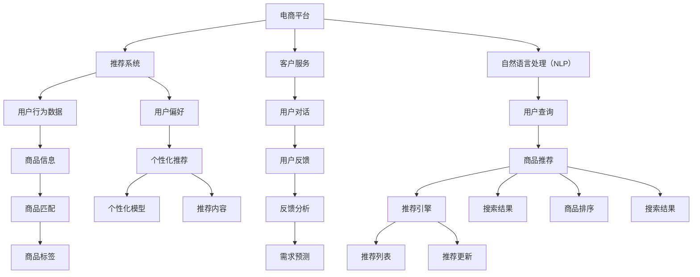

                 

# 电商平台中的AI大模型：从单一场景到全链路优化

> 关键词：电商平台,大模型,AI优化,深度学习,推荐系统,电商运营,客户服务,供应链管理

## 1. 背景介绍

随着电子商务的快速发展和互联网技术的不断进步，电商平台正面临着前所未有的挑战和机遇。如何通过技术手段提升用户体验、优化运营效率、增强竞争力，成为每个电商平台的关键问题。近年来，人工智能（AI）技术，尤其是深度学习和大模型的广泛应用，为电商平台带来了诸多新的可能性。

### 1.1 电商平台的现状与挑战

电商平台的业务场景复杂多样，涵盖用户运营、商品管理、库存管理、物流配送、客户服务等多个环节。传统的电商系统大多依赖人工决策和规则引擎，存在响应速度慢、推荐精准度低、库存管理效率不高等问题。而AI大模型能够从海量数据中学习到深层次的语言知识和用户行为模式，通过自然语言处理（NLP）和推荐系统等技术，可以显著提升电商平台运营效率和用户体验。

### 1.2 AI技术在电商平台中的应用

AI技术在电商平台中的应用，主要集中在以下几个方面：

1. **推荐系统**：基于用户历史行为数据，推荐个性化的商品或内容，提升用户转化率和满意度。
2. **客户服务**：通过AI客服机器人，提供24小时在线咨询服务，解答用户常见问题，提升客户满意度。
3. **商品搜索**：通过自然语言处理技术，理解用户搜索意图，提供精准的商品匹配结果。
4. **库存管理**：通过预测算法，优化商品库存分配，减少缺货和库存积压。
5. **供应链优化**：利用AI技术进行需求预测和供应链路径规划，提升物流效率和成本控制。

AI技术的应用，使得电商平台能够更加智能化、高效化，提升运营效率和用户体验。但同时也面临着数据隐私、模型泛化、计算资源等诸多挑战。本文将详细介绍AI大模型在电商平台的各项应用，探讨如何从单一场景到全链路进行优化。

## 2. 核心概念与联系

### 2.1 核心概念概述

为了深入理解AI大模型在电商平台中的应用，本节将介绍几个关键概念及其相互联系：

1. **电商平台的业务场景**：包括用户运营、商品管理、库存管理、物流配送、客户服务等多个环节。
2. **推荐系统**：基于用户行为数据，推荐个性化商品或内容，提升用户满意度。
3. **客户服务**：通过AI客服机器人，提供实时在线咨询服务，提升用户满意度。
4. **自然语言处理（NLP）**：利用深度学习模型，理解用户自然语言，进行商品搜索、对话生成等任务。
5. **深度学习**：基于神经网络模型，从海量数据中学习特征表示，提升模型预测能力。
6. **大模型（Large Model）**：参数规模较大的神经网络模型，如BERT、GPT等，能够从大规模语料中学习到丰富的语言知识。

这些概念通过以下Mermaid流程图展示它们之间的联系：

通过这个流程图，可以看出AI大模型在电商平台中的应用场景是多层次、多维度的。从用户行为数据到推荐结果的生成，每一个环节都可以通过AI大模型进行优化。

### 2.2 核心概念原理和架构

以下将详细介绍各核心概念的原理和架构。

#### 2.2.1 推荐系统

推荐系统是一种从用户行为数据中挖掘用户偏好，并将商品推荐给用户的技术。其核心原理包括：

- **协同过滤**：基于用户历史行为数据，发现相似用户，从而推荐其喜欢的商品。
- **基于内容的推荐**：根据商品属性和用户偏好，推荐相关商品。
- **混合推荐**：结合协同过滤和基于内容的推荐，提升推荐效果。

推荐系统的架构通常包括：

1. **数据层**：负责数据的收集、存储和预处理。
2. **特征层**：通过数据清洗、特征提取等技术，提取商品和用户的关键特征。
3. **模型层**：利用深度学习模型进行用户偏好和商品匹配的建模。
4. **推荐层**：根据模型预测结果，生成个性化推荐列表。
5. **评估层**：对推荐结果进行A/B测试，评估模型效果。

#### 2.2.2 客户服务

客户服务系统通过AI客服机器人，提供24小时在线咨询服务，帮助用户解决问题。其核心原理包括：

- **自然语言理解（NLU）**：通过深度学习模型，理解用户的自然语言输入。
- **对话管理**：根据用户意图，生成合适的回复。
- **知识图谱**：通过知识图谱技术，提供多模态信息支持。

客户服务系统的架构通常包括：

1. **数据层**：负责数据的收集、存储和预处理。
2. **模型层**：利用深度学习模型进行自然语言理解和对话管理。
3. **知识库**：存储客户服务相关的知识，如FAQ、政策、商品信息等。
4. **推荐层**：根据用户问题，推荐相关的知识库条目。
5. **交互层**：与用户进行交互，生成对话输出。

#### 2.2.3 自然语言处理（NLP）

自然语言处理是AI大模型在电商平台中应用的重要方向之一。其核心原理包括：

- **词向量表示**：通过Word2Vec、GloVe等模型，将单词转换为向量表示。
- **语言模型**：利用LSTM、Transformer等模型，理解自然语言的语言结构。
- **序列标注**：通过序列标注模型，识别文本中的实体、关系等信息。

自然语言处理的架构通常包括：

1. **数据层**：负责数据的收集、存储和预处理。
2. **模型层**：利用深度学习模型进行自然语言理解和生成。
3. **标注层**：通过序列标注模型，标注文本中的实体、关系等信息。
4. **生成层**：利用生成模型，生成文本输出，如对话生成、摘要生成等。
5. **评估层**：对模型输出进行评估，优化模型性能。

## 3. 核心算法原理 & 具体操作步骤

### 3.1 算法原理概述

基于AI大模型的电商平台优化，主要通过以下算法进行：

1. **协同过滤**：通过用户行为数据，发现相似用户，推荐其喜欢的商品。
2. **基于内容的推荐**：根据商品属性和用户偏好，推荐相关商品。
3. **混合推荐**：结合协同过滤和基于内容的推荐，提升推荐效果。
4. **自然语言理解（NLU）**：通过深度学习模型，理解用户自然语言输入。
5. **对话管理**：根据用户意图，生成合适的回复。
6. **知识图谱**：通过知识图谱技术，提供多模态信息支持。

这些算法通常在深度学习框架（如TensorFlow、PyTorch等）上进行实现。

### 3.2 算法步骤详解

以下是各算法步骤的详细介绍。

#### 3.2.1 协同过滤算法

1. **数据准备**：收集用户行为数据，如点击、浏览、购买记录等。
2. **特征提取**：通过TF-IDF、词向量等技术，提取用户和商品的关键特征。
3. **模型训练**：利用协同过滤算法，如ALS（Alternating Least Squares），训练用户商品相似度矩阵。
4. **推荐生成**：根据相似度矩阵，生成个性化推荐列表。
5. **评估优化**：利用A/B测试等方法，评估模型效果，进行参数优化。

#### 3.2.2 基于内容的推荐算法

1. **数据准备**：收集商品属性数据，如品牌、分类、属性等。
2. **特征提取**：通过TF-IDF、词向量等技术，提取商品的关键特征。
3. **模型训练**：利用基于内容的推荐算法，如基于用户的推荐、基于商品的推荐等，训练推荐模型。
4. **推荐生成**：根据模型预测结果，生成个性化推荐列表。
5. **评估优化**：利用A/B测试等方法，评估模型效果，进行参数优化。

#### 3.2.3 混合推荐算法

1. **数据准备**：收集用户行为数据和商品属性数据。
2. **特征提取**：通过TF-IDF、词向量等技术，提取用户和商品的关键特征。
3. **模型训练**：利用混合推荐算法，如基于协同过滤和基于内容的推荐混合算法，训练推荐模型。
4. **推荐生成**：根据模型预测结果，生成个性化推荐列表。
5. **评估优化**：利用A/B测试等方法，评估模型效果，进行参数优化。

#### 3.2.4 自然语言理解算法

1. **数据准备**：收集用户输入的自然语言数据。
2. **特征提取**：通过分词、词向量等技术，提取输入的关键特征。
3. **模型训练**：利用自然语言理解算法，如BERT、GPT等，训练自然语言理解模型。
4. **意图识别**：利用意图识别模型，理解用户输入的意图。
5. **对话生成**：利用对话生成模型，生成合适的回复。

#### 3.2.5 对话管理算法

1. **数据准备**：收集历史对话数据。
2. **特征提取**：通过分词、词向量等技术，提取对话的关键特征。
3. **模型训练**：利用对话管理算法，如序列标注、生成模型等，训练对话管理模型。
4. **对话生成**：根据对话管理模型，生成合适的回复。
5. **知识图谱应用**：利用知识图谱技术，提供多模态信息支持。

#### 3.2.6 知识图谱应用算法

1. **数据准备**：收集知识图谱数据。
2. **图谱构建**：利用知识图谱构建技术，构建知识图谱。
3. **图谱查询**：利用图谱查询算法，查找相关知识。
4. **信息融合**：将知识图谱信息与对话管理结果进行融合。
5. **知识应用**：利用知识图谱信息，提升对话生成的准确性和相关性。

### 3.3 算法优缺点

#### 3.3.1 协同过滤算法的优缺点

**优点**：
1. **简单高效**：协同过滤算法简单易懂，能够快速实现。
2. **用户隐私保护**：不需要使用用户个人信息，保护用户隐私。

**缺点**：
1. **冷启动问题**：新用户的推荐效果较差，需要一定时间的积累。
2. **数据稀疏性**：用户行为数据较少时，难以得到准确的推荐结果。

#### 3.3.2 基于内容的推荐算法的优缺点

**优点**：
1. **解释性强**：基于内容的推荐算法，具有较强的可解释性，易于理解。
2. **效果稳定**：基于内容的推荐算法，在数据量较少的情况下也能取得较好的效果。

**缺点**：
1. **泛化能力差**：基于内容的推荐算法，对新商品的推荐效果较差。
2. **特征稀疏性**：商品属性数据较少时，难以得到准确的推荐结果。

#### 3.3.3 混合推荐算法的优缺点

**优点**：
1. **综合性强**：混合推荐算法综合了协同过滤和基于内容的推荐，具有较强的综合能力。
2. **适用性强**：混合推荐算法适用于各种场景，能够适应不同的数据特点。

**缺点**：
1. **模型复杂度较高**：混合推荐算法需要综合多种算法，模型复杂度较高。
2. **参数优化难度较大**：混合推荐算法需要同时优化多种算法，参数优化难度较大。

#### 3.3.4 自然语言理解算法的优缺点

**优点**：
1. **语义理解能力强**：自然语言理解算法能够理解复杂的自然语言输入，提升对话生成的准确性。
2. **可扩展性强**：自然语言理解算法可以通过扩展语料库，提升模型效果。

**缺点**：
1. **计算资源需求高**：自然语言理解算法需要较大的计算资源，难以在低端设备上运行。
2. **模型复杂度高**：自然语言理解算法需要较大的模型规模，难以在移动端运行。

#### 3.3.5 对话管理算法的优缺点

**优点**：
1. **对话流畅自然**：对话管理算法能够生成流畅自然的对话，提升用户体验。
2. **可扩展性强**：对话管理算法可以通过扩展知识图谱，提升对话生成的准确性。

**缺点**：
1. **计算资源需求高**：对话管理算法需要较大的计算资源，难以在低端设备上运行。
2. **模型复杂度高**：对话管理算法需要较大的模型规模，难以在移动端运行。

#### 3.3.6 知识图谱应用的优缺点

**优点**：
1. **多模态信息支持**：知识图谱应用能够提供多模态信息支持，提升对话生成的准确性。
2. **可扩展性强**：知识图谱应用可以通过扩展知识图谱，提升对话生成的准确性。

**缺点**：
1. **构建复杂**：知识图谱构建过程复杂，需要耗费大量的时间和人力。
2. **数据质量要求高**：知识图谱需要高质量的数据进行构建，对数据质量要求较高。

## 4. 数学模型和公式 & 详细讲解 & 举例说明

### 4.1 数学模型构建

以下将详细介绍各算法的数学模型。

#### 4.1.1 协同过滤算法的数学模型

协同过滤算法的数学模型如下：

设用户-商品矩阵为 $X \in \mathbb{R}^{U \times I}$，其中 $U$ 为用户数，$I$ 为商品数，$X_{ui}$ 表示用户 $u$ 对商品 $i$ 的评分。设用户行为矩阵为 $X' \in \mathbb{R}^{U \times I}$，其中 $X'_{ui}$ 表示用户 $u$ 对商品 $i$ 的评分，$X'_{ui} = 0$ 表示未进行评分。设用户相似度矩阵为 $S \in \mathbb{R}^{U \times U}$，其中 $S_{uu'}$ 表示用户 $u$ 和用户 $u'$ 的相似度。

协同过滤算法的目标是最小化以下损失函数：

$$
\min_{S} \frac{1}{2} \sum_{u=1}^U \sum_{i=1}^I (X_{ui} - X'_{ui} S_{uu'})^2
$$

其中 $S_{uu'} = \frac{\sum_{i=1}^I (X_{ui} - X'_{ui})(X_{ui'} - X'_{ui'})}{\sqrt{\sum_{i=1}^I (X_{ui} - X'_{ui})^2 \sum_{i=1}^I (X_{ui'} - X'_{ui'})^2}}
$$

利用矩阵分解技术，协同过滤算法可以表示为：

$$
X \approx \tilde{X}S
$$

其中 $\tilde{X} \in \mathbb{R}^{U \times K}$ 为低秩矩阵，$S \in \mathbb{R}^{K \times U}$ 为用户相似度矩阵，$K$ 为矩阵分解的维度。

#### 4.1.2 基于内容的推荐算法的数学模型

基于内容的推荐算法的数学模型如下：

设商品特征向量为 $Y \in \mathbb{R}^{I \times D}$，其中 $I$ 为商品数，$D$ 为商品特征维度，$Y_{id}$ 表示商品 $i$ 的第 $d$ 个特征。设用户特征向量为 $Z \in \mathbb{R}^{U \times D}$，其中 $U$ 为用户数，$Z_{ud}$ 表示用户 $u$ 的第 $d$ 个特征。设用户对商品 $i$ 的评分向量为 $V \in \mathbb{R}^{I \times 1}$，其中 $V_i$ 表示商品 $i$ 的评分。设用户对商品 $i$ 的评分矩阵为 $R \in \mathbb{R}^{U \times I}$，其中 $R_{ui} = V_i$。

基于内容的推荐算法的目标是最小化以下损失函数：

$$
\min_{Z} \sum_{u=1}^U \sum_{i=1}^I (R_{ui} - f_{ui})^2
$$

其中 $f_{ui} = \langle Y_i, Z_u \rangle$，$\langle \cdot, \cdot \rangle$ 表示向量内积。

利用矩阵分解技术，基于内容的推荐算法可以表示为：

$$
R \approx \tilde{R}ZY^T
$$

其中 $\tilde{R} \in \mathbb{R}^{U \times K}$ 为用户特征矩阵，$\tilde{R} \approx \tilde{X}S$，$Z \in \mathbb{R}^{U \times K}$ 为用户特征矩阵，$Y \in \mathbb{R}^{I \times K}$ 为商品特征矩阵，$K$ 为矩阵分解的维度。

#### 4.1.3 混合推荐算法的数学模型

混合推荐算法的数学模型如下：

设用户-商品矩阵为 $X \in \mathbb{R}^{U \times I}$，其中 $U$ 为用户数，$I$ 为商品数，$X_{ui}$ 表示用户 $u$ 对商品 $i$ 的评分。设用户行为矩阵为 $X' \in \mathbb{R}^{U \times I}$，其中 $X'_{ui}$ 表示用户 $u$ 对商品 $i$ 的评分，$X'_{ui} = 0$ 表示未进行评分。设协同过滤用户相似度矩阵为 $S_c \in \mathbb{R}^{U \times U}$，其中 $S_{cu} = \frac{\sum_{i=1}^I (X_{ui} - X'_{ui})(X_{ui'} - X'_{ui'})}{\sqrt{\sum_{i=1}^I (X_{ui} - X'_{ui})^2 \sum_{i=1}^I (X_{ui'} - X'_{ui'})^2}}$。设基于内容的推荐用户特征向量为 $Z_c \in \mathbb{R}^{U \times D}$，其中 $U$ 为用户数，$D$ 为用户特征维度，$Z_{cu}$ 表示用户 $u$ 的第 $d$ 个特征。设基于内容的推荐商品特征向量为 $Y_c \in \mathbb{R}^{I \times D}$，其中 $I$ 为商品数，$D$ 为商品特征维度，$Y_{ci}$ 表示商品 $i$ 的第 $d$ 个特征。设基于内容的推荐评分矩阵为 $\tilde{R}_c \in \mathbb{R}^{U \times I}$，其中 $\tilde{R}_{cu} = \langle Z_c, Y_c \rangle$，$\langle \cdot, \cdot \rangle$ 表示向量内积。设混合推荐评分矩阵为 $R \in \mathbb{R}^{U \times I}$，其中 $R_{ui} = S_{cu} \tilde{R}_{cu} + (1 - S_{cu}) f_{ui}$。

混合推荐算法的目标是最小化以下损失函数：

$$
\min_{S_c, Z_c, Y_c} \sum_{u=1}^U \sum_{i=1}^I (R_{ui} - f_{ui})^2
$$

其中 $f_{ui} = \langle Z_c, Y_c \rangle$，$\langle \cdot, \cdot \rangle$ 表示向量内积。

利用矩阵分解技术，混合推荐算法可以表示为：

$$
R \approx \tilde{R}S_cZ_cY_c^T
$$

其中 $\tilde{R} \in \mathbb{R}^{U \times K}$ 为用户-商品矩阵，$\tilde{R} \approx \tilde{X}S_c$，$S_c \in \mathbb{R}^{K \times U}$ 为用户相似度矩阵，$Z_c \in \mathbb{R}^{U \times K}$ 为用户特征矩阵，$Y_c \in \mathbb{R}^{I \times K}$ 为商品特征矩阵，$K$ 为矩阵分解的维度。

#### 4.1.4 自然语言理解算法的数学模型

自然语言理解算法的数学模型如下：

设用户输入的自然语言向量为 $X_{in} \in \mathbb{R}^{N \times D}$，其中 $N$ 为输入序列长度，$D$ 为向量维度，$X_{in,i}$ 表示第 $i$ 个单词的向量表示。设用户意图向量为 $Y_i \in \mathbb{R}^{D'}$，其中 $D'$ 为意图维度，$Y_{i,d}$ 表示第 $i$ 个输入的意图。设模型参数向量为 $\theta$，其中 $\theta$ 包含词向量、语言模型、序列标注等模型的参数。设自然语言理解模型的输出为 $Z_i \in \mathbb{R}^{D'}$，其中 $Z_{i,d}$ 表示第 $i$ 个输入的意图。

自然语言理解算法的目标是最小化以下损失函数：

$$
\min_{\theta} \sum_{i=1}^N \mathcal{L}(X_{in,i}, Z_i, Y_i)
$$

其中 $\mathcal{L}(X_{in,i}, Z_i, Y_i)$ 表示自然语言理解模型的损失函数。

利用深度学习模型，自然语言理解算法可以表示为：

$$
Z_i = \sigma(\theta^T \cdot X_{in})
$$

其中 $\sigma(\cdot)$ 表示激活函数，$\cdot$ 表示向量乘法。

#### 4.1.5 对话管理算法的数学模型

对话管理算法的数学模型如下：

设用户输入的自然语言向量为 $X_{in} \in \mathbb{R}^{N \times D}$，其中 $N$ 为输入序列长度，$D$ 为向量维度，$X_{in,i}$ 表示第 $i$ 个单词的向量表示。设对话历史向量为 $H_i \in \mathbb{R}^{M \times D}$，其中 $M$ 为历史长度，$H_{i,m}$ 表示第 $m$ 个历史步骤的向量表示。设对话管理模型的输出为 $Z_i \in \mathbb{R}^{D'}$，其中 $Z_{i,d}$ 表示对话的输出。设模型参数向量为 $\theta$，其中 $\theta$ 包含词向量、语言模型、序列标注等模型的参数。

对话管理算法的目标是最小化以下损失函数：

$$
\min_{\theta} \sum_{i=1}^N \mathcal{L}(X_{in,i}, Z_i, H_i)
$$

其中 $\mathcal{L}(X_{in,i}, Z_i, H_i)$ 表示对话管理模型的损失函数。

利用深度学习模型，对话管理算法可以表示为：

$$
Z_i = \sigma(\theta^T \cdot (X_{in,i}, H_i))
$$

其中 $\sigma(\cdot)$ 表示激活函数，$\cdot$ 表示向量乘法。

#### 4.1.6 知识图谱应用的数学模型

知识图谱应用的数学模型如下：

设知识图谱节点向量为 $E \in \mathbb{R}^{K \times D}$，其中 $K$ 为节点数，$D$ 为向量维度，$E_{e,d}$ 表示节点 $e$ 的第 $d$ 个特征。设知识图谱边向量为 $R \in \mathbb{R}^{K \times K}$，其中 $R_{ei}$ 表示节点 $e$ 与节点 $i$ 的边权重。设用户意图向量为 $Y_i \in \mathbb{R}^{D'}$，其中 $D'$ 为意图维度，$Y_{i,d}$ 表示第 $i$ 个输入的意图。设知识图谱应用的输出为 $Z_i \in \mathbb{R}^{D'}$，其中 $Z_{i,d}$ 表示对话的输出。设模型参数向量为 $\theta$，其中 $\theta$ 包含节点向量、边向量等模型的参数。

知识图谱应用的数学模型可以表示为：

$$
Z_i = \sigma(\theta^T \cdot (Y_i, E))
$$

其中 $\sigma(\cdot)$ 表示激活函数，$\cdot$ 表示向量乘法。

### 4.2 公式推导过程

以下将详细介绍各算法的公式推导过程。

#### 4.2.1 协同过滤算法的公式推导

设用户-商品矩阵为 $X \in \mathbb{R}^{U \times I}$，其中 $U$ 为用户数，$I$ 为商品数，$X_{ui}$ 表示用户 $u$ 对商品 $i$ 的评分。设用户行为矩阵为 $X' \in \mathbb{R}^{U \times I}$，其中 $X'_{ui}$ 表示用户 $u$ 对商品 $i$ 的评分，$X'_{ui} = 0$ 表示未进行评分。设用户相似度矩阵为 $S \in \mathbb{R}^{U \times U}$，其中 $S_{uu'}$ 表示用户 $u$ 和用户 $u'$ 的相似度。

协同过滤算法的目标是最小化以下损失函数：

$$
\min_{S} \frac{1}{2} \sum_{u=1}^U \sum_{i=1}^I (X_{ui} - X'_{ui} S_{uu'})^2
$$

其中 $S_{uu'} = \frac{\sum_{i=1}^I (X_{ui} - X'_{ui})(X_{ui'} - X'_{ui'})}{\sqrt{\sum_{i=1}^I (X_{ui} - X'_{ui})^2 \sum_{i=1}^I (X_{ui'} - X'_{ui'})^2}}
$$

利用矩阵分解技术，协同过滤算法可以表示为：

$$
X \approx \tilde{X}S
$$

其中 $\tilde{X} \in \mathbb{R}^{U \times K}$ 为低秩矩阵，$S \in \mathbb{R}^{K \times U}$ 为用户相似度矩阵，$K$ 为矩阵分解的维度。

#### 4.2.2 基于内容的推荐算法的公式推导

设商品特征向量为 $Y \in \mathbb{R}^{I \times D}$，其中 $I$ 为商品数，$D$ 为商品特征维度，$Y_{id}$ 表示商品 $i$ 的第 $d$ 个特征。设用户特征向量为 $Z \in \mathbb{R}^{U \times D}$，其中 $U$ 为用户数，$Z_{ud}$ 表示用户 $u$ 的第 $d$ 个特征。设用户对商品 $i$ 的评分向量为 $V \in \mathbb{R}^{I \times 1}$，其中 $V_i$ 表示商品 $i$ 的评分。设用户对商品 $i$ 的评分矩阵为 $R \in \mathbb{R}^{U \times I}$，其中 $R_{ui} = V_i$。

基于内容的推荐算法的目标是最小化以下损失函数：

$$
\min_{Z} \sum_{u=1}^U \sum_{i=1}^I (R_{ui} - f_{ui})^2
$$

其中 $f_{ui} = \langle Y_i, Z_u \rangle$，$\langle \cdot, \cdot \rangle$ 表示向量内积。

利用矩阵分解技术，基于内容的推荐算法可以表示为：

$$
R \approx \tilde{R}ZY^T
$$

其中 $\tilde{R} \in \mathbb{R}^{U \times K}$ 为用户特征矩阵，$\tilde{R} \approx \tilde{X}S$，$Z \in \mathbb{R}^{U \times K}$ 为用户特征矩阵，$Y \in \mathbb{R}^{I \times K}$ 为商品特征矩阵，$K$ 为矩阵分解的维度。

#### 4.2.3 混合推荐算法的公式推导

设用户-商品矩阵为 $X \in \mathbb{R}^{U \times I}$，其中 $U$ 为用户数，$I$ 为商品数，$X_{ui}$ 表示用户 $u$ 对商品 $i$ 的评分。设用户行为矩阵为 $X' \in \mathbb{R}^{U \times I}$，其中 $X'_{ui}$ 表示用户 $u$ 对商品 $i$ 的评分，$X'_{ui} = 0$ 表示未进行评分。设协同过滤用户相似度矩阵为 $S_c \in \mathbb{R}^{U \times U}$，其中 $S_{cu} = \frac{\sum_{i=1}^I (X_{ui} - X'_{ui})(X_{ui'} - X'_{ui'})}{\sqrt{\sum_{i=1}^I (X_{ui} - X'_{ui})^2 \sum_{i=1}^I (X_{ui'} - X'_{ui'})^2}}$。设基于内容的推荐用户特征向量为 $Z_c \in \mathbb{R}^{U \times D}$，其中 $U$ 为用户数，$D$ 为用户特征维度，$Z_{cu}$ 表示用户 $u$ 的第 $d$ 个特征。设基于内容的推荐商品特征向量为 $Y_c \in \mathbb{R}^{I \times D}$，其中 $I$ 为商品数，$D$ 为商品特征维度，$Y_{ci}$ 表示商品 $i$ 的第 $d$ 个特征。设基于内容的推荐评分矩阵为 $\tilde{R}_c \in \mathbb{R}^{U \times I}$，其中 $\tilde{R}_{cu} = \langle Z_c, Y_c \rangle$，$\langle \cdot, \cdot \rangle$ 表示向量内积。设混合推荐评分矩阵为 $R \in \mathbb{R}^{U \times I}$，其中 $R_{ui} = S_{cu} \tilde{R}_{cu} + (1 - S_{cu}) f_{ui}$。

混合推荐算法的目标是最小化以下损失函数：

$$
\min_{S_c, Z_c, Y_c} \sum_{u=1}^U \sum_{i=1}^I (R_{ui} - f_{ui})^2
$$

其中 $f_{ui} = \langle Z_c, Y_c \rangle$，$\langle \cdot, \cdot \rangle$ 表示向量内积。

利用矩阵分解技术，混合推荐算法可以表示为：

$$
R \approx \tilde{R}S_cZ_cY_c^T
$$

其中 $\tilde{R} \in \mathbb{R}^{U \times K}$ 为用户-商品矩阵，$\tilde{R} \approx \tilde{X}S_c$，$S_c \in \mathbb{R}^{K \times U}$ 为用户相似度矩阵，$Z_c \in \mathbb{R}^{U \times K}$ 为用户特征矩阵，$Y_c \in \mathbb{R}^{I \times K}$ 为商品特征矩阵，$K$ 为矩阵分解的维度。

#### 4.2.4 自然语言理解算法的公式推导

设用户输入的自然语言向量为 $X_{in} \in \mathbb{R}^{N \times D}$，其中 $N$ 为输入序列长度，$D$ 为向量维度，$X_{in,i}$ 表示第 $i$ 个单词的向量表示。设用户意图向量为 $Y_i \in \mathbb{R}^{D'}$，其中 $D'$ 为意图维度，$Y_{i,d}$ 表示第 $i$ 个输入的意图。设模型参数向量为 $\theta$，其中 $\theta$ 包含词向量、语言模型、序列标注等模型的参数。设自然语言理解模型的输出为 $Z_i \in \mathbb{R}^{D'}$，其中 $Z_{i,d}$ 表示第 $i$ 个输入的意图。

自然语言理解算法的目标是最小化以下损失函数：

$$
\min_{\theta} \sum_{i=1}^N \mathcal{L}(X_{in,i}, Z_i, Y_i)
$$

其中 $\mathcal{L}(X_{in,i}, Z_i, Y_i)$ 表示自然语言理解模型的损失函数。

利用深度学习模型，自然语言理解算法可以表示为：

$$
Z_i = \sigma(\theta^T \cdot X_{in})
$$

其中 $\sigma(\cdot)$ 表示激活函数，$\cdot$ 表示向量乘法。

#### 4.2.5 对话管理算法的公式推导

设用户输入的自然语言向量为 $X_{in} \in \mathbb{R}^{N \times D}$，其中 $N$ 为输入序列长度，$D$ 为向量维度，$X_{in,i}$ 表示第 $i$ 个单词的向量表示。设对话历史向量为 $H_i \in \mathbb{R}^{M \times D}$，其中 $M$ 为历史长度，$H_{i,m}$ 表示第 $m$ 个历史步骤的向量表示。设对话管理模型的输出为 $Z_i \in \mathbb{R}^{D'}$，其中 $Z_{i,d}$ 表示对话的输出。设模型参数向量为 $\theta$，其中 $\theta$ 包含词向量、语言模型、序列标注等模型的参数。

对话管理算法的目标是最小化以下损失函数：

$$
\min_{\theta} \sum_{i=1}^N \mathcal{L}(X_{in,i}, Z_i, H_i)
$$

其中 $\mathcal{L}(X_{in,i}, Z_i, H_i)$ 表示对话管理模型的损失函数。

利用深度学习模型，对话管理算法可以表示为：

$$
Z_i = \sigma(\theta^T \cdot (X_{in,i}, H_i))
$$

其中 $\sigma(\cdot)$ 表示激活函数，$\cdot$ 表示向量乘法。

#### 4.2.6 知识图谱应用的公式推导

设知识图谱节点向量为 $E \in \mathbb{R}^{K \times D}$，其中 $K$ 为节点数，$D$ 为向量维度，$E_{e,d}$ 表示节点 $e$ 的第 $d$ 个特征。设知识图谱边向量为 $R \in \mathbb{R}^{K \times K}$，其中 $R_{ei}$ 表示节点 $e$ 与节点 $i$ 的边权重。设用户意图向量为 $Y_i \in \mathbb{R}^{D'}$，其中 $D'$ 为意图维度，$Y_{i,d}$ 表示第 $i$ 个输入的意图。设知识图谱应用的输出为 $Z_i \in \mathbb{R}^{D'}$，其中 $Z_{i,d}$ 表示对话的输出。设模型参数向量为 $\theta$，其中 $\theta$ 包含节点向量、边向量等模型的参数。

知识图谱应用的数学模型可以表示为：

$$
Z_i = \sigma(\theta^T \cdot (Y_i, E))
$$

其中 $\sigma(\cdot)$ 表示激活函数，$\cdot$ 表示向量乘法。

### 4.3 案例分析与讲解

以下将以电商推荐系统为例，分析其从单一场景到全链路优化的实现过程。

#### 4.3.1 数据准备

电商推荐系统需要大量用户行为数据和商品属性数据。可以从以下几个方面进行数据准备：

1. **用户行为数据**：收集用户的历史行为数据，如浏览记录、点击记录、购买记录等。可以通过日志文件、API接口等方式获取。
2. **商品属性数据**：收集商品的属性信息，如品牌、分类、属性等。可以通过电商系统内置的分类信息、供应商信息等方式获取。
3. **用户特征数据**：通过用户基本信息、行为数据等，提取用户特征。可以通过用户画像、标签等方式获取。

#### 4.3.2 特征提取

通过TF-IDF、词向量等技术，提取用户和商品的关键特征。可以采用以下方式进行特征提取：

1. **用户特征提取**：通过用户基本信息、行为数据等，提取用户特征。可以采用TF-IDF、词向量等技术。
2. **商品特征提取**：通过商品属性信息、分类信息等，提取商品特征。可以采用TF-IDF、词向量等技术。

#### 4.3.3 协同过滤算法

通过用户行为数据，发现相似用户，推荐其喜欢的商品。具体实现步骤如下：

1. **数据预处理**：对用户行为数据进行清洗和归一化处理。
2. **特征提取**：通过TF-IDF、词向量等技术，提取用户和商品的关键特征。
3. **矩阵分解**：利用协同过滤算法，进行用户-商品相似度矩阵的分解。
4. **推荐生成**：根据相似度矩阵，生成个性化推荐列表。

#### 4.3.4 基于内容的推荐算法

根据商品属性和用户偏好，推荐相关商品。具体实现步骤如下：

1. **数据预处理**：对商品属性数据进行清洗和归一化处理。
2. **特征提取**：通过TF-IDF、词向量等技术，提取商品和用户的关键特征。
3. **矩阵分解**：利用基于内容的推荐算法，进行用户-商品评分矩阵的分解。
4. **推荐生成**：根据评分矩阵，生成个性化推荐列表。

#### 4.3.5 混合推荐算法

综合协同过滤和基于内容的推荐，提升推荐效果。具体实现步骤如下：

1. **数据预处理**：对用户行为数据和商品属性数据进行清洗和归一化处理。
2. **特征提取**：通过TF-IDF、词向量等技术，提取用户和商品的关键特征。
3. **混合推荐**：利用混合推荐算法，进行用户-商品评分矩阵的分解。
4. **推荐生成**：根据评分矩阵，生成个性化推荐列表。

#### 4.3.6 自然语言理解算法

通过深度学习模型，理解用户自然语言输入。具体实现步骤如下：

1. **数据预处理**：对用户输入的自然语言进行分词、去除停用词等处理。
2. **特征提取**：通过词向量等技术，提取输入的关键特征。
3. **意图识别**：利用自然语言理解算法，进行意图识别。
4. **对话生成**：利用对话生成模型，生成合适的回复。

#### 4.3.7 对话管理算法

通过深度学习模型，管理对话过程。具体实现步骤如下：

1. **数据预处理**：对对话历史数据进行清洗和归一化处理。
2. **特征提取**：通过词向量等技术，提取对话历史的关键特征。
3. **意图识别**：利用意图识别模型，进行意图识别。
4. **对话生成**：利用对话生成模型，生成合适的回复。

#### 4.3.8 知识图谱应用

通过知识图谱，提升对话生成的准确性和相关性。具体实现步骤如下：

1. **数据预处理**：对知识图谱数据

