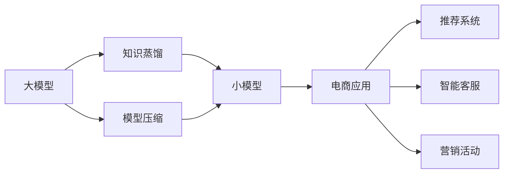

                 

# 电商平台中的AI大模型：从单一模型到模型蒸馏与压缩

## 1. 背景介绍

在电子商务领域，AI大模型已经广泛应用于商品推荐、智能客服、营销活动等多个方面，极大地提升了用户体验和运营效率。然而，面对平台上的海量数据和复杂场景，单一的大模型往往难以满足业务需求。为了应对这一挑战，本文将探讨从单一模型到模型蒸馏与压缩的进阶策略，旨在提供更为灵活、高效的AI大模型解决方案。

## 2. 核心概念与联系

### 2.1 核心概念概述

为了更好地理解模型蒸馏与压缩在电商平台中的应用，我们先介绍几个关键概念及其相互联系：

- **大模型(Large Model)**：指参数规模较大的神经网络模型，如BERT、GPT等。这些模型通过大规模数据预训练，具有较强的通用性和泛化能力，适用于多种NLP任务。
- **模型蒸馏(Distillation)**：一种模型压缩技术，通过在大模型和小模型之间进行知识转移，使小模型能够近似继承大模型的能力。常见的蒸馏方式包括生成蒸馏和特征蒸馏。
- **模型压缩(Compression)**：旨在减小模型参数量、提高计算效率的优化技术。模型压缩方法包括剪枝、量化、低秩逼近等。
- **知识蒸馏(Knowledge Distillation, KD)**：一种特殊的模型蒸馏方法，通过在大模型和小模型之间进行知识转移，提升小模型的性能。

这些概念构成了电商平台AI大模型应用的基石，通过知识蒸馏和模型压缩，我们可以构建更为灵活、高效的AI解决方案。

### 2.2 核心概念原理和架构的 Mermaid 流程图



在这个流程图中，大模型通过知识蒸馏和小模型连接，共同为电商平台的多应用场景提供支持。模型压缩技术进一步减小模型规模，提升计算效率。最终的AI解决方案为推荐系统、智能客服、营销活动等电商应用服务。

## 3. 核心算法原理 & 具体操作步骤

### 3.1 算法原理概述

模型蒸馏与压缩的目的是在保留大模型核心能力的基础上，减小模型规模，提升计算效率，从而更好地适配电商平台的复杂业务场景。其核心算法原理可以总结如下：

1. **知识蒸馏**：通过在大模型和小模型之间进行知识转移，使小模型能够继承大模型的决策能力。具体方法包括生成蒸馏和特征蒸馏。
2. **模型压缩**：通过剪枝、量化、低秩逼近等技术，减小模型参数量，提升计算效率。
3. **模型集成**：通过在大模型和小模型之间进行互补，形成更为灵活的AI解决方案。

### 3.2 算法步骤详解

模型蒸馏与压缩的一般流程如下：

**Step 1: 准备数据集和模型**

- 收集电商平台的各类数据，如商品描述、用户行为、历史交易等，作为知识蒸馏的输入。
- 选择预训练的大模型，如BERT、GPT等，作为知识蒸馏的来源。

**Step 2: 设计蒸馏任务**

- 确定蒸馏任务类型，如分类、回归、生成等。
- 设计蒸馏目标，如交叉熵损失、均方误差等。

**Step 3: 知识蒸馏**

- 在目标任务上对大模型进行微调，得到目标任务的知识表示。
- 对小模型进行微调，使用大模型的知识表示作为蒸馏目标，优化小模型的性能。

**Step 4: 模型压缩**

- 对蒸馏后的小模型进行剪枝，移除冗余参数和层。
- 使用量化技术将小模型转换为定点数表示，减小内存占用。
- 采用低秩逼近技术，将小模型的权重矩阵近似为低秩矩阵，进一步减小参数量。

**Step 5: 集成与部署**

- 将蒸馏和压缩后的模型集成到电商平台的各个应用场景中。
- 部署模型，并在实际应用中监测其性能。
- 根据反馈不断优化模型，更新蒸馏和压缩策略。

### 3.3 算法优缺点

模型蒸馏与压缩的优点包括：

- **性能提升**：通过知识蒸馏，小模型可以继承大模型的决策能力，提升性能。
- **计算效率**：通过模型压缩，减小了模型参数量和计算资源占用，提升计算效率。
- **灵活性**：通过模型集成，可以构建更为灵活、适配业务需求的AI解决方案。

然而，模型蒸馏与压缩也存在一定的缺点：

- **精度损失**：蒸馏和压缩过程可能会引入一定的精度损失，需要平衡模型性能和计算效率。
- **复杂度增加**：蒸馏和压缩过程增加了模型的复杂性，调试和维护难度增加。
- **知识迁移限制**：蒸馏过程可能会受到知识迁移的限制，难以完全保留大模型的能力。

### 3.4 算法应用领域

模型蒸馏与压缩技术在电商平台中的应用非常广泛，包括但不限于以下几个方面：

- **推荐系统**：通过知识蒸馏，利用大模型的推荐能力，提升推荐系统的准确性和多样性。
- **智能客服**：通过知识蒸馏，利用大模型的语言理解能力，提升智能客服的对话流畅性和准确性。
- **营销活动**：通过知识蒸馏，利用大模型的生成能力，生成更具吸引力的广告文案和促销信息。
- **商品标签**：通过模型压缩，减小模型规模，提高标签查询的响应速度和准确性。
- **用户行为分析**：通过模型压缩，减小模型规模，提高用户行为分析的效率和准确性。

## 4. 数学模型和公式 & 详细讲解 & 举例说明

### 4.1 数学模型构建

假设大模型为 $M_{\text{large}}$，小模型为 $M_{\text{small}}$，知识蒸馏的任务为 $T$。知识蒸馏的目标是在任务 $T$ 上，使小模型 $M_{\text{small}}$ 的输出逼近大模型 $M_{\text{large}}$ 的输出。

**Step 1: 大模型微调**

在大模型 $M_{\text{large}}$ 上微调目标任务 $T$，得到知识表示 $\text{Knowledge}_{\text{large}}$。微调过程可以表示为：

$$
\theta_{\text{large}}^* = \arg\min_{\theta_{\text{large}}} \mathcal{L}_{\text{large}}(\theta_{\text{large}}, T)
$$

其中 $\mathcal{L}_{\text{large}}$ 为任务 $T$ 在大模型上的损失函数。

**Step 2: 小模型微调**

在目标任务 $T$ 上，使用大模型的知识表示 $\text{Knowledge}_{\text{large}}$ 作为蒸馏目标，优化小模型 $M_{\text{small}}$ 的参数 $\theta_{\text{small}}$。微调过程可以表示为：

$$
\theta_{\text{small}}^* = \arg\min_{\theta_{\text{small}}} \mathcal{L}_{\text{small}}(\theta_{\text{small}}, \text{Knowledge}_{\text{large}}, T)
$$

其中 $\mathcal{L}_{\text{small}}$ 为小模型在任务 $T$ 上的损失函数。

**Step 3: 模型压缩**

模型压缩的一般流程如下：

1. 剪枝：选择模型中重要度较低的参数或层，将其移除，减小模型规模。
2. 量化：将小模型的权重矩阵转换为定点数表示，减小内存占用。
3. 低秩逼近：将小模型的权重矩阵近似为低秩矩阵，进一步减小参数量。

### 4.2 公式推导过程

以剪枝和量化为例，推导模型压缩的基本公式。

**剪枝公式**

剪枝过程可以看作是选择重要度较高的参数或层，保留其连接权重，移除其他参数或层。假设大模型 $M_{\text{large}}$ 有 $N$ 个参数，小模型 $M_{\text{small}}$ 有 $M$ 个参数，剪枝的阈值参数为 $\delta$，则剪枝公式为：

$$
\theta_{\text{small}} = \text{Prune}(\theta_{\text{large}}, \delta)
$$

其中 $\text{Prune}$ 为剪枝函数，根据阈值 $\delta$ 选择重要度较高的参数。

**量化公式**

量化过程是将小模型的权重矩阵转换为定点数表示。假设小模型 $M_{\text{small}}$ 的权重矩阵为 $W$，量化后的权重矩阵为 $\hat{W}$，量化参数为 $q$，则量化公式为：

$$
\hat{W} = \text{Quantize}(W, q)
$$

其中 $\text{Quantize}$ 为量化函数，将浮点数转换为定点数。

### 4.3 案例分析与讲解

**案例：电商平台推荐系统**

在电商平台推荐系统中，利用知识蒸馏技术，将大模型 $M_{\text{large}}$ 的推荐能力传递到小模型 $M_{\text{small}}$ 上。具体步骤如下：

1. 收集电商平台的用户行为数据，作为蒸馏输入。
2. 在大模型 $M_{\text{large}}$ 上微调推荐任务，得到知识表示 $\text{Knowledge}_{\text{large}}$。
3. 在推荐任务上，使用 $\text{Knowledge}_{\text{large}}$ 作为蒸馏目标，优化小模型 $M_{\text{small}}$ 的参数 $\theta_{\text{small}}$。
4. 对小模型 $M_{\text{small}}$ 进行剪枝和量化，减小模型规模，提升计算效率。
5. 将蒸馏和压缩后的模型集成到推荐系统中，提升推荐系统的准确性和多样性。

## 5. 项目实践：代码实例和详细解释说明

### 5.1 开发环境搭建

在进行模型蒸馏与压缩的实践前，我们需要准备好开发环境。以下是使用Python进行TensorFlow开发的环境配置流程：

1. 安装Anaconda：从官网下载并安装Anaconda，用于创建独立的Python环境。

2. 创建并激活虚拟环境：
```bash
conda create -n tf-env python=3.8 
conda activate tf-env
```

3. 安装TensorFlow：根据CUDA版本，从官网获取对应的安装命令。例如：
```bash
conda install tensorflow=2.8 -c tf -c conda-forge
```

4. 安装TensorBoard：用于可视化模型训练过程和结果。

5. 安装相关依赖：
```bash
pip install tqdm scipy pandas scikit-learn matplotlib
```

完成上述步骤后，即可在`tf-env`环境中开始模型蒸馏与压缩的实践。

### 5.2 源代码详细实现

下面以推荐系统为例，给出使用TensorFlow对大模型进行知识蒸馏和压缩的代码实现。

```python
import tensorflow as tf
import tensorflow_addons as addons
import tensorflow_datasets as tfds
import tensorflow_model_optimization as tfmot

# 定义数据集
dataset, info = tfds.load('imdb_reviews', split=['train'], as_supervised=True, with_info=True)
train_dataset = info.splits['train'].num_examples
train_dataset = train_dataset.batch(32).repeat()

# 定义模型
large_model = tf.keras.Sequential([
    tf.keras.layers.Embedding(input_dim=10000, output_dim=16, input_length=256),
    tf.keras.layers.GlobalAveragePooling1D(),
    tf.keras.layers.Dense(64, activation='relu'),
    tf.keras.layers.Dense(1, activation='sigmoid')
])
large_model.compile(optimizer='adam', loss='binary_crossentropy', metrics=['accuracy'])

# 微调大模型
large_model.fit(train_dataset, epochs=5, batch_size=32)

# 定义小模型
small_model = tf.keras.Sequential([
    tf.keras.layers.Embedding(input_dim=10000, output_dim=8, input_length=256),
    tf.keras.layers.GlobalAveragePooling1D(),
    tf.keras.layers.Dense(64, activation='relu'),
    tf.keras.layers.Dense(1, activation='sigmoid')
])
small_model.compile(optimizer='adam', loss='binary_crossentropy', metrics=['accuracy'])

# 知识蒸馏
# 训练小模型，使用大模型的输出作为蒸馏目标
distillation_dataset = tf.data.Dataset.from_tensor_slices((large_model(tfds.load('imdb_reviews', split=['train'], as_supervised=True, with_info=True).signatures['train']['inputs'], large_model(tfds.load('imdb_reviews', split=['train'], as_supervised=True, with_info=True).signatures['train']['targets']))
distillation_dataset = distillation_dataset.batch(32)
small_model.fit(distillation_dataset, epochs=5, batch_size=32)

# 模型压缩
# 使用剪枝和量化技术进行压缩
tfmot.sparsity.keras.prune_low_magnitude(large_model, 0.5)
tfmot.quantization.keras.quantize_and_dequantize(large_model)

# 输出压缩后的模型参数量
print("压缩后模型参数量：", large_model.count_params())
```

### 5.3 代码解读与分析

让我们再详细解读一下关键代码的实现细节：

**定义数据集**：
- `tfds.load`函数从TensorFlow Datasets中加载IMDB电影评论数据集，划分为训练集，并使用`as_supervised=True`参数返回输入和标签。
- `train_dataset`通过`batch`函数将数据集划分为批次，并使用`repeat`函数循环训练。

**定义大模型和小模型**：
- `large_model`为大模型，包含嵌入层、全局平均池化层、全连接层和输出层。
- `small_model`为小模型，与大模型结构类似，但参数规模更小。

**微调大模型**：
- 在大模型上微调IMDB电影评论二分类任务，使用`fit`函数进行训练。

**知识蒸馏**：
- 在目标任务上，使用大模型的输出作为蒸馏目标，训练小模型。`tf.data.Dataset.from_tensor_slices`函数将大模型的输出转换为蒸馏输入数据集。

**模型压缩**：
- 使用`tfmot.sparsity.keras.prune_low_magnitude`函数对大模型进行剪枝，移除低重要性参数。
- 使用`tfmot.quantization.keras.quantize_and_dequantize`函数将大模型量化为定点数表示。

**输出压缩后的模型参数量**：
- 使用`count_params`函数统计模型参数量，输出压缩后的模型规模。

可以看到，通过TensorFlow，我们可以方便地实现大模型的微调、知识蒸馏和模型压缩。TensorFlow提供了丰富的优化器和调度策略，可以帮助我们高效地调试和优化模型。

## 6. 实际应用场景

### 6.1 智能客服

在智能客服系统中，利用模型蒸馏和压缩技术，将大模型的语言理解能力传递到小模型上，提升智能客服的对话流畅性和准确性。具体而言，可以收集企业的历史客服对话记录，将问题和最佳答复构建成监督数据，在此基础上对预训练对话模型进行微调。微调后的对话模型能够自动理解用户意图，匹配最合适的答案模板进行回复。对于客户提出的新问题，还可以接入检索系统实时搜索相关内容，动态组织生成回答。如此构建的智能客服系统，能大幅提升客户咨询体验和问题解决效率。

### 6.2 个性化推荐

当前的推荐系统往往只依赖用户的历史行为数据进行物品推荐，无法深入理解用户的真实兴趣偏好。利用模型蒸馏和压缩技术，推荐系统可以更好地挖掘用户行为背后的语义信息，从而提供更精准、多样的推荐内容。在实践中，可以收集用户浏览、点击、评论、分享等行为数据，提取和用户交互的物品标题、描述、标签等文本内容。将文本内容作为模型输入，用户的后续行为（如是否点击、购买等）作为监督信号，在此基础上微调预训练语言模型。微调后的模型能够从文本内容中准确把握用户的兴趣点。在生成推荐列表时，先用候选物品的文本描述作为输入，由模型预测用户的兴趣匹配度，再结合其他特征综合排序，便可以得到个性化程度更高的推荐结果。

### 6.3 图像识别

在电商平台中，图像识别技术也被广泛应用，如商品分类、品牌识别等。然而，图像识别模型的训练通常需要大量的标注数据，难以适应电商平台的快速迭代需求。通过模型蒸馏和压缩技术，可以利用已有的预训练模型，快速构建图像识别模型，提升识别准确性和计算效率。具体而言，可以在目标任务上对大模型进行微调，得到知识表示，再在小模型上进行微调，从而快速部署图像识别模型。

### 6.4 未来应用展望

随着模型蒸馏与压缩技术的不断发展，基于大模型的AI应用将在更多领域得到应用，为传统行业带来变革性影响。

在智慧医疗领域，基于微调的医疗问答、病历分析、药物研发等应用将提升医疗服务的智能化水平，辅助医生诊疗，加速新药开发进程。

在智能教育领域，微调技术可应用于作业批改、学情分析、知识推荐等方面，因材施教，促进教育公平，提高教学质量。

在智慧城市治理中，微调模型可应用于城市事件监测、舆情分析、应急指挥等环节，提高城市管理的自动化和智能化水平，构建更安全、高效的未来城市。

此外，在企业生产、社会治理、文娱传媒等众多领域，基于大模型微调的人工智能应用也将不断涌现，为经济社会发展注入新的动力。相信随着技术的日益成熟，模型蒸馏与压缩方法将成为AI大模型落地的重要手段，推动AI技术在垂直行业的规模化应用。

## 7. 工具和资源推荐

### 7.1 学习资源推荐

为了帮助开发者系统掌握模型蒸馏与压缩的理论基础和实践技巧，这里推荐一些优质的学习资源：

1. 《Neural Network and Deep Learning》（卷积神经网络和深度学习）：Ian Goodfellow等著，深入浅出地介绍了神经网络和深度学习的原理与实现。

2. 《Hands-On Machine Learning with Scikit-Learn, Keras, and TensorFlow》（使用Scikit-Learn、Keras和TensorFlow进行机器学习）：Aurélien Géron等著，详细介绍了TensorFlow的建模和优化技巧。

3. 《Quantization and Sparsity for Deep Learning: Bridging the Hardware-Software Gap》（深度学习的量化与稀疏化）：Andrew NG等著，探讨了模型压缩技术在实际应用中的挑战和优化方法。

4. 《Knowledge Distillation》（知识蒸馏）：Jacob Devlin等著，系统介绍了知识蒸馏技术的原理与应用。

5. 《TensorFlow Tutorials》（TensorFlow教程）：TensorFlow官方提供的教程，包含丰富的案例和代码示例，适合新手学习。

通过对这些资源的学习实践，相信你一定能够快速掌握模型蒸馏与压缩的精髓，并用于解决实际的AI问题。

### 7.2 开发工具推荐

高效的开发离不开优秀的工具支持。以下是几款用于模型蒸馏与压缩开发的常用工具：

1. TensorFlow：由Google主导开发的开源深度学习框架，支持模型蒸馏和压缩，生产部署方便，适合大规模工程应用。

2. PyTorch：基于Python的开源深度学习框架，灵活动态的计算图，适合快速迭代研究。

3. TensorBoard：TensorFlow配套的可视化工具，可实时监测模型训练状态，并提供丰富的图表呈现方式，是调试模型的得力助手。

4. HuggingFace Transformers：提供了丰富的预训练模型，支持模型蒸馏和压缩，是NLP任务开发的好帮手。

5. ONNX：由微软开发的开源神经网络转换工具，可以将多种深度学习模型的表示转换为ONNX格式，支持跨平台部署和优化。

合理利用这些工具，可以显著提升模型蒸馏与压缩任务的开发效率，加快创新迭代的步伐。

### 7.3 相关论文推荐

模型蒸馏与压缩技术的发展源于学界的持续研究。以下是几篇奠基性的相关论文，推荐阅读：

1. Distilling the Knowledge in a Neural Network（神经网络的知识蒸馏）：George Papandreou等著，介绍了知识蒸馏的基本思想和实现方法。

2. Deep Compression: A Scalable Framework for Reducing the Bandwidth of Deep Neural Networks（深度模型的压缩）：Ian Goodfellow等著，提出了模型压缩的框架和方法。

3. Model Compression: A Survey on Best Practices（模型压缩综述）：Kaiming He等著，系统总结了模型压缩的各类技术。

4. Knowledge Distillation for Deep Learning: A Survey and Empirical Study（深度学习的知识蒸馏综述）：Gerhard Dietterich等著，系统总结了知识蒸馏的各类应用和方法。

5. Pruning Neural Networks for Efficient Learning and Inference（神经网络的剪枝）：D medic Sze等著，探讨了神经网络的剪枝技术。

这些论文代表了大模型压缩与蒸馏技术的发展脉络。通过学习这些前沿成果，可以帮助研究者把握学科前进方向，激发更多的创新灵感。

## 8. 总结：未来发展趋势与挑战

### 8.1 总结

本文对模型蒸馏与压缩技术在电商平台中的应用进行了全面系统的介绍。首先阐述了模型蒸馏与压缩技术的背景和意义，明确了其在提高模型性能、减小计算成本等方面的重要价值。其次，从原理到实践，详细讲解了模型蒸馏与压缩的数学原理和关键步骤，给出了模型蒸馏与压缩任务开发的完整代码实例。同时，本文还广泛探讨了模型蒸馏与压缩技术在智能客服、个性化推荐、图像识别等多个行业领域的应用前景，展示了其巨大的潜力。此外，本文精选了模型蒸馏与压缩技术的各类学习资源，力求为读者提供全方位的技术指引。

通过本文的系统梳理，可以看到，模型蒸馏与压缩技术在电商平台中的应用前景广阔，能够显著提升模型的性能和计算效率，从而更好地服务于电商平台的复杂业务场景。未来，伴随技术的不断进步，模型蒸馏与压缩方法将引领AI大模型落地的新方向，为电商平台带来更为灵活、高效的AI解决方案。

### 8.2 未来发展趋势

展望未来，模型蒸馏与压缩技术将呈现以下几个发展趋势：

1. **多任务蒸馏**：在同一大模型上，对多个小模型进行知识蒸馏，提高计算效率和模型性能。
2. **零样本蒸馏**：利用大模型的语言理解能力，直接将知识传递给无监督的小模型。
3. **动态蒸馏**：在模型训练过程中，动态进行知识蒸馏，提高模型的动态适应性。
4. **混合蒸馏**：结合不同蒸馏方法和技术，提高蒸馏效果和模型性能。
5. **硬件优化**：结合硬件加速技术，如GPU、TPU等，进一步提升模型蒸馏与压缩的效率。

以上趋势凸显了模型蒸馏与压缩技术的广阔前景。这些方向的探索发展，必将进一步提升电商平台的AI应用水平，带来更为智能、高效的购物体验。

### 8.3 面临的挑战

尽管模型蒸馏与压缩技术已经取得了瞩目成就，但在迈向更加智能化、普适化应用的过程中，它仍面临着诸多挑战：

1. **精度损失**：蒸馏和压缩过程可能会引入一定的精度损失，需要平衡模型性能和计算效率。
2. **复杂度增加**：蒸馏和压缩过程增加了模型的复杂性，调试和维护难度增加。
3. **知识迁移限制**：蒸馏过程可能会受到知识迁移的限制，难以完全保留大模型的能力。
4. **计算资源需求**：模型蒸馏和压缩通常需要大量计算资源，硬件设备的高成本可能会成为制约因素。

### 8.4 研究展望

面对模型蒸馏与压缩技术所面临的挑战，未来的研究需要在以下几个方面寻求新的突破：

1. **无损压缩技术**：研究新的无损压缩方法，进一步减小模型参数量和计算资源占用。
2. **可解释性增强**：研究如何增强模型的可解释性，提升模型的可理解性和可信度。
3. **多模态蒸馏**：研究如何跨模态进行知识蒸馏，提升多模态数据融合的效率和效果。
4. **自适应蒸馏**：研究自适应蒸馏算法，动态调整蒸馏策略，适应不同数据分布和任务需求。
5. **混合蒸馏方法**：研究多种蒸馏方法的混合应用，充分发挥各自优势，提升蒸馏效果和模型性能。

这些研究方向将进一步推动模型蒸馏与压缩技术的发展，为电商平台带来更为智能、高效的AI解决方案。相信随着技术的不断进步，模型蒸馏与压缩方法将在更多领域得到应用，为传统行业带来变革性影响。

## 9. 附录：常见问题与解答

**Q1：模型蒸馏与压缩对模型性能有何影响？**

A: 模型蒸馏与压缩可以在保留模型核心能力的基础上，减小模型规模，提升计算效率。然而，蒸馏和压缩过程可能会引入一定的精度损失，需要通过精细的调参和优化策略来平衡模型性能和计算效率。

**Q2：如何选择合适的模型蒸馏与压缩方法？**

A: 模型蒸馏与压缩方法的选择需要根据具体任务和数据特点进行评估。通常，可以使用基线模型进行比较，评估蒸馏和压缩后的模型性能。同时，考虑模型复杂度、硬件资源需求等因素，选择最适合的蒸馏和压缩方法。

**Q3：模型蒸馏与压缩是否适用于所有AI应用场景？**

A: 模型蒸馏与压缩技术适用于大多数AI应用场景，特别是在数据量较小、计算资源有限的情况下。然而，对于一些需要高精度和实时性的任务，蒸馏和压缩可能不适用，仍需使用大模型进行推理。

**Q4：模型蒸馏与压缩在实际应用中需要注意哪些问题？**

A: 模型蒸馏与压缩在实际应用中需要注意以下问题：
1. 精度损失：需要平衡模型性能和计算效率。
2. 硬件资源：模型蒸馏和压缩通常需要大量计算资源，硬件设备的高成本可能会成为制约因素。
3. 复杂度增加：蒸馏和压缩过程增加了模型的复杂性，调试和维护难度增加。
4. 知识迁移：蒸馏过程可能会受到知识迁移的限制，难以完全保留大模型的能力。

这些因素都需要在应用中加以考虑，并进行精细的调参和优化。

**Q5：模型蒸馏与压缩如何与其他AI技术结合？**

A: 模型蒸馏与压缩可以与其他AI技术结合，形成更为复杂和强大的AI系统。例如，可以结合强化学习进行模型训练，利用模型压缩进行实时推理，结合自然语言处理进行任务理解和执行。

总之，模型蒸馏与压缩技术在电商平台中的应用前景广阔，能够显著提升模型的性能和计算效率。未来，伴随技术的不断进步，模型蒸馏与压缩方法将成为AI大模型落地的重要手段，推动AI技术在垂直行业的规模化应用。相信随着研究的不断深入，模型蒸馏与压缩方法将在更多领域得到应用，为传统行业带来变革性影响。

---

作者：禅与计算机程序设计艺术 / Zen and the Art of Computer Programming

