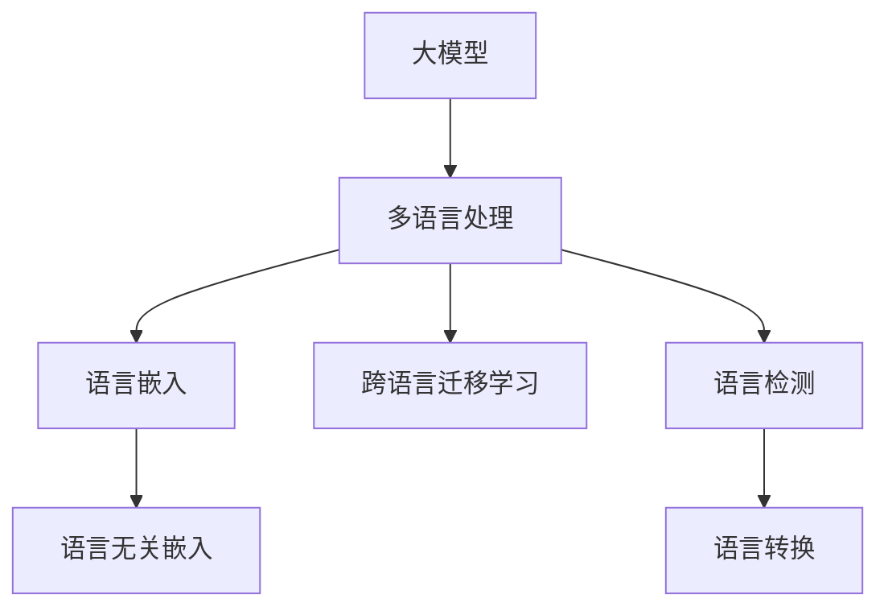

                 

# 电商平台中的AI大模型：从单一语言到多语言支持

## 1. 背景介绍

### 1.1 问题由来
随着全球化的不断深化，跨国电商平台的兴起给消费者带来了极大的便利，但也带来了语言障碍的挑战。单一语言的大模型在处理多语言数据时往往存在局限性，无法充分利用多语言数据中的丰富语义信息，从而影响电商平台的运营效率和用户体验。因此，开发适用于多语言环境的AI大模型，成为了一个重要的研究方向。

### 1.2 问题核心关键点
多语言支持的核心关键点在于如何在不损失单一语言模型的性能的同时，拓展其对多语言的适应能力。这涉及到以下几方面的问题：
- 如何高效地处理多语言数据
- 如何设计合适的模型架构
- 如何优化多语言训练过程
- 如何提高多语言模型的泛化能力

### 1.3 问题研究意义
研究多语言支持的大模型，对于推动电商平台的国际化，提升用户体验，增强平台的全球竞争力具有重要意义：
- 打破语言障碍：多语言模型能够处理多语言数据，消除语言障碍，提升电商平台的国际化和本地化能力。
- 提升用户体验：通过多语言模型，电商平台能够提供更丰富、更精准的推荐和服务，提升用户满意度。
- 拓展市场空间：多语言模型能够支持多语言搜索和商品描述，拓展电商平台的市场空间。
- 促进技术创新：多语言模型的开发涉及数据预处理、模型架构、训练优化等多方面的技术创新，有助于推动AI技术的持续进步。

## 2. 核心概念与联系

### 2.1 核心概念概述

为更好地理解多语言支持的大模型，本节将介绍几个密切相关的核心概念：

- **大模型(Large Model)**：指具有大规模参数量、能够处理大量数据、并具有强大泛化能力的人工智能模型，如BERT、GPT等。
- **多语言处理(Multilingual Processing)**：指大模型在处理多语言数据时的相关技术，包括语言检测、语言转换、语言建模等。
- **语言嵌入(Language Embedding)**：指将不同语言的词汇映射到共同的向量空间中的技术，使模型能够理解并处理多种语言。
- **跨语言迁移学习(Cross-lingual Transfer Learning)**：指在一种语言上训练的模型，能够迁移到另一种语言上使用的技术。
- **语言无关嵌入(Language-agnostic Embedding)**：指在多语言模型中，不同语言的词汇在相同向量空间中的表示具有相似性，从而提高跨语言的泛化能力。

这些核心概念之间的逻辑关系可以通过以下Mermaid流程图来展示：



这个流程图展示了大模型在多语言环境中的核心概念及其之间的关系：

1. 大模型通过多语言处理技术，能够处理多种语言的输入数据。
2. 多语言处理包含语言嵌入、跨语言迁移学习等子概念，分别对应不同的技术实现。
3. 语言嵌入将不同语言的词汇映射到共同的向量空间中，便于模型理解。
4. 跨语言迁移学习使模型能够在不损失性能的前提下，迁移到其他语言上使用。
5. 语言无关嵌入通过共享向量空间，提高模型的泛化能力。
6. 语言检测和语言转换技术，则分别用于识别输入语言和转换语言编码，方便模型处理。

这些概念共同构成了大模型在多语言环境中的处理框架，使其能够高效地处理多语言数据。

## 3. 核心算法原理 & 具体操作步骤
### 3.1 算法原理概述

多语言支持的大模型算法，本质上是对单一语言大模型进行扩展和优化，以适应多语言环境的处理需求。核心思想是：
1. **多语言数据预处理**：将不同语言的文本数据进行预处理，统一转换为模型能够处理的形式。
2. **语言无关嵌入**：构建跨语言的共同向量空间，使不同语言的词汇具有相似的表示。
3. **跨语言迁移学习**：在一种语言上训练的模型能够迁移到其他语言上使用，减少数据和计算资源的消耗。
4. **多语言模型的设计**：通过设计合适的模型架构，如多任务学习、多语言对比学习等，提高模型的泛化能力。

### 3.2 算法步骤详解

多语言支持的大模型算法一般包括以下几个关键步骤：

**Step 1: 多语言数据预处理**
- **数据收集**：收集多语言文本数据，包括商品描述、用户评论、广告文本等。
- **文本清洗**：去除无用信息、噪音数据，确保数据质量。
- **分词和标准化**：将文本数据分词，并进行标准化处理，如统一字符编码、去重等。
- **语言检测**：使用语言检测算法（如BERT、FastText等）识别文本的语言。
- **语言转换**：使用语言转换技术（如Byte Pair Encoding, BPE等）将不同语言的文本转换为统一编码。

**Step 2: 语言无关嵌入**
- **嵌入矩阵初始化**：根据不同语言的词汇表，构建嵌入矩阵，初始化为随机向量。
- **语言无关训练**：使用多语言数据，训练语言无关嵌入矩阵，使其能够表示不同语言的词汇。
- **向量空间对齐**：通过线性变换等方法，将不同语言的嵌入矩阵映射到统一的向量空间中。

**Step 3: 跨语言迁移学习**
- **单语言模型训练**：在一种语言上训练通用大模型（如BERT），获得预训练参数。
- **迁移学习**：将预训练模型参数迁移到其他语言上，使用少量标注数据进行微调，获得适应多语言环境的模型。
- **联合训练**：在不同语言上训练模型，提高模型的泛化能力。

**Step 4: 多语言模型设计**
- **多任务学习**：将不同语言的任务进行联合训练，如商品分类、情感分析、推荐等。
- **多语言对比学习**：在不同语言间进行对比学习，提高模型的泛化能力。
- **多语言分类器设计**：设计适应多语言环境的分类器，如多层感知机、Transformer等。

### 3.3 算法优缺点

多语言支持的大模型算法具有以下优点：
1. **泛化能力强**：通过跨语言迁移学习，模型能够适应不同语言的输入，具有较强的泛化能力。
2. **数据需求少**：使用预训练模型和跨语言迁移学习，能够在少量标注数据下取得良好效果。
3. **高效处理多语言数据**：通过统一嵌入空间和联合训练，能够高效处理多语言数据，提升电商平台的用户体验。

同时，该算法也存在一定的局限性：
1. **计算资源消耗大**：多语言数据预处理和语言无关嵌入需要大量的计算资源，对硬件设备要求较高。
2. **模型复杂度较高**：多任务学习和联合训练增加了模型的复杂度，可能影响模型训练速度和性能。
3. **语言转换困难**：不同语言的文本转换可能存在语义损失，影响模型性能。
4. **数据质量要求高**：多语言数据的预处理和标注质量直接影响模型效果，需要高质量的标注数据和文本数据。

尽管存在这些局限性，但就目前而言，多语言支持的大模型算法仍然是一种高效且实用的解决方案。未来相关研究的重点在于如何进一步降低计算资源消耗，提高语言转换的准确性和泛化能力，同时兼顾模型复杂度和数据质量的要求。

### 3.4 算法应用领域

多语言支持的大模型算法在多个领域得到广泛应用，特别是在电商平台中，具有以下典型应用：

- **商品推荐**：使用多语言模型进行商品推荐，提升用户体验。
- **搜索排序**：使用多语言模型进行商品搜索排序，提高搜索效果。
- **用户评论分析**：使用多语言模型进行用户评论情感分析，优化用户服务。
- **广告定向**：使用多语言模型进行广告定向，提高广告投放的精准度。
- **多语言客服**：使用多语言模型进行客户服务，提升客户满意度。

除了电商领域外，多语言模型还在金融、医疗、教育等多个领域得到应用，为不同行业的智能化转型提供了有力的技术支持。

## 4. 数学模型和公式 & 详细讲解  
### 4.1 数学模型构建

多语言支持的大模型数学模型构建，主要包括以下几个关键步骤：

1. **多语言数据预处理**
   - 假设原始文本数据为 $\{(x_i, y_i)\}_{i=1}^N$，其中 $x_i$ 为输入文本，$y_i$ 为标签（如商品类别、情感标签等）。
   - 使用语言检测模型 $M_{det}$ 识别文本语言，得到语言标签 $l_i$。
   - 使用语言转换模型 $M_{enc}$ 将不同语言的文本转换为统一的编码。

2. **语言无关嵌入**
   - 假设 $V_1, V_2, ..., V_m$ 为不同语言的词汇表，共包含 $N_1, N_2, ..., N_m$ 个词汇。
   - 构建嵌入矩阵 $W \in \mathbb{R}^{N \times d}$，其中 $N = \sum_{i=1}^m N_i$，$d$ 为向量维度。
   - 使用语言无关训练算法，如MLM（Masked Language Modeling），在统一向量空间中训练嵌入矩阵 $W$。

3. **跨语言迁移学习**
   - 假设在语言 $j$ 上训练的预训练模型为 $M_{pre}^j$，获得参数 $\theta^j$。
   - 使用少量标注数据 $\{(x_i^j, y_i^j)\}_{i=1}^{N_j}$ 在语言 $j$ 上进行微调，得到微调后的模型参数 $\hat{\theta}^j$。
   - 使用联合训练算法，将不同语言的微调模型 $M_{fin}^j$ 组合成多语言模型 $M_{fin}$。

### 4.2 公式推导过程

以下我们将详细介绍多语言支持的大模型算法中的关键数学公式及其推导过程。

**多语言数据预处理**
- 假设语言检测模型 $M_{det}$ 的输出为 $l_i \in \{1, 2, ..., m\}$，其中 $m$ 为语言种类。
- 假设语言转换模型 $M_{enc}$ 的输出为 $z_i \in \{1, 2, ..., d\}$，其中 $d$ 为编码维度。

**语言无关嵌入**
- 假设不同语言的词汇嵌入为 $W_1, W_2, ..., W_m$，每个嵌入矩阵的形状为 $N_i \times d$。
- 假设使用MLM进行语言无关训练，目标函数为：
  $$
  \min_{W} \mathcal{L}(W) = \frac{1}{N}\sum_{i=1}^N \mathcal{L}_l(W) + \mathcal{L}_u(W)
  $$
  其中 $\mathcal{L}_l(W)$ 为语言建模损失，$\mathcal{L}_u(W)$ 为统一向量空间损失。

**跨语言迁移学习**
- 假设在语言 $j$ 上微调的模型为 $M_{fin}^j$，微调后的参数为 $\hat{\theta}^j$。
- 假设联合训练的目标函数为 $\mathcal{L}_{joint}$，目标最小化联合损失：
  $$
  \min_{\theta^j, \hat{\theta}^j} \mathcal{L}_{joint}(\theta^j, \hat{\theta}^j) = \frac{1}{N_j}\sum_{i=1}^{N_j} \ell(M_{fin}^j(x_i^j), y_i^j) + \lambda \frac{1}{N}\sum_{i=1}^N \ell(M_{fin}(x_i), y_i)
  $$
  其中 $\ell$ 为交叉熵损失，$\lambda$ 为联合训练的权重系数。

### 4.3 案例分析与讲解

以电商平台中的商品推荐系统为例，说明多语言支持的大模型的应用。

假设电商平台收集了不同语言的商品描述数据，如英语、中文、法语等。使用多语言支持的大模型进行商品推荐，可以分为以下几个步骤：

**Step 1: 数据预处理**
- 收集不同语言的商品描述数据，并进行分词、清洗、标准化处理。
- 使用语言检测模型识别文本语言，得到语言标签。
- 使用语言转换模型将不同语言的文本转换为统一的编码。

**Step 2: 语言无关嵌入**
- 构建统一向量空间，初始化嵌入矩阵 $W$。
- 使用MLM在统一向量空间中训练嵌入矩阵 $W$，使其能够表示不同语言的词汇。

**Step 3: 跨语言迁移学习**
- 在英语上训练预训练模型 $M_{pre}^1$，获得预训练参数 $\theta^1$。
- 使用少量标注数据在英语上进行微调，得到微调后的模型参数 $\hat{\theta}^1$。
- 在中文和法语上使用类似方式微调，得到微调后的模型参数 $\hat{\theta}^2, \hat{\theta}^3$。
- 使用联合训练算法，将不同语言的微调模型组合成多语言模型 $M_{fin}$。

**Step 4: 商品推荐**
- 输入商品描述文本，经过语言检测和转换，得到统一编码的文本。
- 使用多语言模型 $M_{fin}$ 进行分类和推荐，输出推荐结果。

通过上述步骤，电商平台能够利用多语言支持的大模型，提升商品推荐的精准度和用户满意度，拓展市场空间。

## 5. 项目实践：代码实例和详细解释说明
### 5.1 开发环境搭建

在进行多语言支持的大模型项目实践前，我们需要准备好开发环境。以下是使用Python进行PyTorch开发的环境配置流程：

1. 安装Anaconda：从官网下载并安装Anaconda，用于创建独立的Python环境。

2. 创建并激活虚拟环境：
```bash
conda create -n pytorch-env python=3.8 
conda activate pytorch-env
```

3. 安装PyTorch：根据CUDA版本，从官网获取对应的安装命令。例如：
```bash
conda install pytorch torchvision torchaudio cudatoolkit=11.1 -c pytorch -c conda-forge
```

4. 安装Transformers库：
```bash
pip install transformers
```

5. 安装各类工具包：
```bash
pip install numpy pandas scikit-learn matplotlib tqdm jupyter notebook ipython
```

完成上述步骤后，即可在`pytorch-env`环境中开始多语言支持的大模型微调实践。

### 5.2 源代码详细实现

下面我以多语言支持的商品推荐系统为例，给出使用Transformers库对多语言模型进行微调的PyTorch代码实现。

首先，定义多语言商品推荐的数据处理函数：

```python
from transformers import BertTokenizer
from torch.utils.data import Dataset
import torch

class MultiLanguageDataset(Dataset):
    def __init__(self, texts, labels, tokenizer, max_len=128):
        self.texts = texts
        self.labels = labels
        self.tokenizer = tokenizer
        self.max_len = max_len
        
    def __len__(self):
        return len(self.texts)
    
    def __getitem__(self, item):
        text = self.texts[item]
        label = self.labels[item]
        
        encoding = self.tokenizer(text, return_tensors='pt', max_length=self.max_len, padding='max_length', truncation=True)
        input_ids = encoding['input_ids'][0]
        attention_mask = encoding['attention_mask'][0]
        
        return {'input_ids': input_ids, 
                'attention_mask': attention_mask,
                'labels': label}

# 标签与id的映射
label2id = {'positive': 1, 'negative': 0}

# 创建dataset
tokenizer = BertTokenizer.from_pretrained('bert-base-cased')

train_dataset = MultiLanguageDataset(train_texts, train_labels, tokenizer)
dev_dataset = MultiLanguageDataset(dev_texts, dev_labels, tokenizer)
test_dataset = MultiLanguageDataset(test_texts, test_labels, tokenizer)
```

然后，定义模型和优化器：

```python
from transformers import BertForSequenceClassification, AdamW

model = BertForSequenceClassification.from_pretrained('bert-base-cased', num_labels=len(label2id))

optimizer = AdamW(model.parameters(), lr=2e-5)
```

接着，定义训练和评估函数：

```python
from torch.utils.data import DataLoader
from tqdm import tqdm
from sklearn.metrics import accuracy_score

device = torch.device('cuda') if torch.cuda.is_available() else torch.device('cpu')
model.to(device)

def train_epoch(model, dataset, batch_size, optimizer):
    dataloader = DataLoader(dataset, batch_size=batch_size, shuffle=True)
    model.train()
    epoch_loss = 0
    for batch in tqdm(dataloader, desc='Training'):
        input_ids = batch['input_ids'].to(device)
        attention_mask = batch['attention_mask'].to(device)
        labels = batch['labels'].to(device)
        model.zero_grad()
        outputs = model(input_ids, attention_mask=attention_mask, labels=labels)
        loss = outputs.loss
        epoch_loss += loss.item()
        loss.backward()
        optimizer.step()
    return epoch_loss / len(dataloader)

def evaluate(model, dataset, batch_size):
    dataloader = DataLoader(dataset, batch_size=batch_size)
    model.eval()
    preds, labels = [], []
    with torch.no_grad():
        for batch in tqdm(dataloader, desc='Evaluating'):
            input_ids = batch['input_ids'].to(device)
            attention_mask = batch['attention_mask'].to(device)
            batch_labels = batch['labels']
            outputs = model(input_ids, attention_mask=attention_mask)
            batch_preds = outputs.logits.argmax(dim=1).to('cpu').tolist()
            batch_labels = batch_labels.to('cpu').tolist()
            for pred, label in zip(batch_preds, batch_labels):
                preds.append(pred)
                labels.append(label)
                
    print('Accuracy:', accuracy_score(labels, preds))
```

最后，启动训练流程并在测试集上评估：

```python
epochs = 5
batch_size = 16

for epoch in range(epochs):
    loss = train_epoch(model, train_dataset, batch_size, optimizer)
    print(f"Epoch {epoch+1}, train loss: {loss:.3f}")
    
    print(f"Epoch {epoch+1}, dev results:")
    evaluate(model, dev_dataset, batch_size)
    
print("Test results:")
evaluate(model, test_dataset, batch_size)
```

以上就是使用PyTorch对多语言商品推荐系统进行微调的完整代码实现。可以看到，得益于Transformers库的强大封装，我们可以用相对简洁的代码完成多语言模型的加载和微调。

### 5.3 代码解读与分析

让我们再详细解读一下关键代码的实现细节：

**MultiLanguageDataset类**：
- `__init__`方法：初始化文本、标签、分词器等关键组件。
- `__len__`方法：返回数据集的样本数量。
- `__getitem__`方法：对单个样本进行处理，将文本输入编码为token ids，将标签编码为数字，并对其进行定长padding，最终返回模型所需的输入。

**label2id字典**：
- 定义了标签与数字id之间的映射关系，用于将预测结果解码回真实的标签。

**训练和评估函数**：
- 使用PyTorch的DataLoader对数据集进行批次化加载，供模型训练和推理使用。
- 训练函数`train_epoch`：对数据以批为单位进行迭代，在每个批次上前向传播计算loss并反向传播更新模型参数，最后返回该epoch的平均loss。
- 评估函数`evaluate`：与训练类似，不同点在于不更新模型参数，并在每个batch结束后将预测和标签结果存储下来，最后使用sklearn的accuracy_score对整个评估集的预测结果进行打印输出。

**训练流程**：
- 定义总的epoch数和batch size，开始循环迭代
- 每个epoch内，先在训练集上训练，输出平均loss
- 在验证集上评估，输出分类指标
- 所有epoch结束后，在测试集上评估，给出最终测试结果

可以看到，PyTorch配合Transformers库使得多语言商品推荐系统的微调代码实现变得简洁高效。开发者可以将更多精力放在数据处理、模型改进等高层逻辑上，而不必过多关注底层的实现细节。

当然，工业级的系统实现还需考虑更多因素，如模型的保存和部署、超参数的自动搜索、更灵活的任务适配层等。但核心的微调范式基本与此类似。

## 6. 实际应用场景
### 6.1 智能客服系统

基于多语言支持的大模型，智能客服系统能够快速响应不同语言的用户咨询，提升客户满意度。使用多语言模型对客服对话进行分析和理解，能够实现自动化的客户服务，提高客户响应速度和服务质量。

在技术实现上，可以收集不同语言的历史客服对话记录，将问题和最佳答复构建成监督数据，在此基础上对预训练多语言模型进行微调。微调后的多语言模型能够自动理解用户意图，匹配最合适的答案模板进行回复。对于客户提出的新问题，还可以接入检索系统实时搜索相关内容，动态组织生成回答。如此构建的智能客服系统，能够7x24小时不间断服务，快速响应客户咨询，用自然流畅的语言解答各类常见问题。

### 6.2 金融舆情监测

金融机构需要实时监测市场舆论动向，以便及时应对负面信息传播，规避金融风险。使用多语言模型对全球市场新闻、评论等进行舆情分析，能够实时捕捉不同语言市场的舆情变化，及时预警潜在风险。

具体而言，可以收集全球范围内的金融市场新闻、评论等文本数据，并对其进行主题标注和情感标注。在此基础上对预训练多语言模型进行微调，使其能够自动判断文本属于何种主题，情感倾向是正面、中性还是负面。将微调后的模型应用到实时抓取的网络文本数据，就能够自动监测不同语言市场的情感变化趋势，一旦发现负面信息激增等异常情况，系统便会自动预警，帮助金融机构快速应对潜在风险。

### 6.3 个性化推荐系统

当前的推荐系统往往只依赖用户的历史行为数据进行物品推荐，无法深入理解用户的真实兴趣偏好。使用多语言模型进行个性化推荐，能够更好地挖掘用户行为背后的语义信息，从而提供更精准、多样的推荐内容。

在实践中，可以收集用户浏览、点击、评论、分享等行为数据，提取和用户交互的物品标题、描述、标签等文本内容。将文本内容作为模型输入，用户的后续行为（如是否点击、购买等）作为监督信号，在此基础上微调预训练语言模型。微调后的多语言模型能够从文本内容中准确把握用户的兴趣点。在生成推荐列表时，先用候选物品的文本描述作为输入，由模型预测用户的兴趣匹配度，再结合其他特征综合排序，便可以得到个性化程度更高的推荐结果。

### 6.4 未来应用展望

随着多语言支持的大模型的不断发展，其应用领域将不断拓展，为传统行业带来变革性影响。

在智慧医疗领域，多语言支持的大模型能够处理多种语言的医疗数据，提升医疗服务的国际化水平，辅助医生诊疗，加速新药开发进程。

在智能教育领域，多语言模型能够进行多语言学情分析和知识推荐，因材施教，促进教育公平，提高教学质量。

在智慧城市治理中，多语言模型能够处理多语言舆情数据，提高城市管理的自动化和智能化水平，构建更安全、高效的未来城市。

此外，在企业生产、社会治理、文娱传媒等众多领域，多语言模型的开发与应用也将不断涌现，为经济社会发展注入新的动力。相信随着技术的日益成熟，多语言支持的大模型将为各行业的智能化转型提供新的解决方案。

## 7. 工具和资源推荐
### 7.1 学习资源推荐

为了帮助开发者系统掌握多语言支持的大模型的理论基础和实践技巧，这里推荐一些优质的学习资源：

1. 《Transformer从原理到实践》系列博文：由大模型技术专家撰写，深入浅出地介绍了Transformer原理、BERT模型、多语言微调技术等前沿话题。

2. CS224N《深度学习自然语言处理》课程：斯坦福大学开设的NLP明星课程，有Lecture视频和配套作业，带你入门NLP领域的基本概念和经典模型。

3. 《Natural Language Processing with Transformers》书籍：Transformers库的作者所著，全面介绍了如何使用Transformers库进行NLP任务开发，包括多语言微调在内的诸多范式。

4. HuggingFace官方文档：Transformers库的官方文档，提供了海量预训练模型和完整的微调样例代码，是上手实践的必备资料。

5. CLUE开源项目：中文语言理解测评基准，涵盖大量不同类型的中文NLP数据集，并提供了基于多语言微调的baseline模型，助力中文NLP技术发展。

通过对这些资源的学习实践，相信你一定能够快速掌握多语言支持的大模型的精髓，并用于解决实际的NLP问题。
###  7.2 开发工具推荐

高效的开发离不开优秀的工具支持。以下是几款用于多语言支持的大模型微调开发的常用工具：

1. PyTorch：基于Python的开源深度学习框架，灵活动态的计算图，适合快速迭代研究。大部分预训练语言模型都有PyTorch版本的实现。

2. TensorFlow：由Google主导开发的开源深度学习框架，生产部署方便，适合大规模工程应用。同样有丰富的预训练语言模型资源。

3. Transformers库：HuggingFace开发的NLP工具库，集成了众多SOTA语言模型，支持PyTorch和TensorFlow，是进行多语言微调任务开发的利器。

4. Weights & Biases：模型训练的实验跟踪工具，可以记录和可视化模型训练过程中的各项指标，方便对比和调优。与主流深度学习框架无缝集成。

5. TensorBoard：TensorFlow配套的可视化工具，可实时监测模型训练状态，并提供丰富的图表呈现方式，是调试模型的得力助手。

6. Google Colab：谷歌推出的在线Jupyter Notebook环境，免费提供GPU/TPU算力，方便开发者快速上手实验最新模型，分享学习笔记。

合理利用这些工具，可以显著提升多语言支持的大模型微调任务的开发效率，加快创新迭代的步伐。

### 7.3 相关论文推荐

多语言支持的大模型的发展源于学界的持续研究。以下是几篇奠基性的相关论文，推荐阅读：

1. Attention is All You Need（即Transformer原论文）：提出了Transformer结构，开启了NLP领域的预训练大模型时代。

2. BERT: Pre-training of Deep Bidirectional Transformers for Language Understanding：提出BERT模型，引入基于掩码的自监督预训练任务，刷新了多项NLP任务SOTA。

3. Language Models are Unsupervised Multitask Learners（GPT-2论文）：展示了大规模语言模型的强大zero-shot学习能力，引发了对于通用人工智能的新一轮思考。

4. Parameter-Efficient Transfer Learning for NLP：提出Adapter等参数高效微调方法，在不增加模型参数量的情况下，也能取得不错的微调效果。

5. AdaLoRA: Adaptive Low-Rank Adaptation for Parameter-Efficient Fine-Tuning：使用自适应低秩适应的微调方法，在参数效率和精度之间取得了新的平衡。

6. Multi-Task Sequence-to-Sequence Modeling for Unsupervised Zero-Shot Generalization：提出多任务序列到序列模型，提升模型的零样本学习能力。

这些论文代表了大语言模型多语言微调技术的发展脉络。通过学习这些前沿成果，可以帮助研究者把握学科前进方向，激发更多的创新灵感。

## 8. 总结：未来发展趋势与挑战

### 8.1 总结

本文对多语言支持的大模型进行了全面系统的介绍。首先阐述了多语言处理的重要性和当前的技术挑战，明确了多语言支持大模型的研究意义和目标。其次，从原理到实践，详细讲解了多语言微调的数学原理和关键步骤，给出了多语言商品推荐系统的完整代码实例。同时，本文还广泛探讨了多语言模型在智能客服、金融舆情、个性化推荐等多个行业领域的应用前景，展示了多语言模型的广阔应用场景。此外，本文精选了多语言微调技术的各类学习资源，力求为读者提供全方位的技术指引。

通过本文的系统梳理，可以看到，多语言支持的大模型技术正在成为NLP领域的重要范式，极大地拓展了预训练语言模型的应用边界，推动了NLP技术的国际化进程。未来，伴随预训练语言模型和多语言微调方法的持续演进，相信NLP技术将在更广阔的应用领域大放异彩，深刻影响人类的生产生活方式。

### 8.2 未来发展趋势

展望未来，多语言支持的大模型技术将呈现以下几个发展趋势：

1. **模型规模持续增大**：随着算力成本的下降和数据规模的扩张，预训练语言模型的参数量还将持续增长。超大规模语言模型蕴含的丰富语言知识，有望支撑更加复杂多变的下游任务微调。

2. **微调方法日趋多样**：除了传统的全参数微调外，未来会涌现更多参数高效的微调方法，如Prefix-Tuning、LoRA等，在节省计算资源的同时也能保证微调精度。

3. **持续学习成为常态**：随着数据分布的不断变化，微调模型也需要持续学习新知识以保持性能。如何在不遗忘原有知识的同时，高效吸收新样本信息，将成为重要的研究课题。

4. **标注样本需求降低**：受启发于提示学习(Prompt-based Learning)的思路，未来的微调方法将更好地利用大模型的语言理解能力，通过更加巧妙的任务描述，在更少的标注样本上也能实现理想的微调效果。

5. **语言转换技术进步**：语言转换技术将不断发展，减少语言转换带来的语义损失，提高多语言模型的性能。

6. **多模态微调崛起**：多语言模型还将与其他模态（如视觉、语音）进行多模态融合，提升模型的综合处理能力。

以上趋势凸显了多语言支持的大模型技术的广阔前景。这些方向的探索发展，必将进一步提升NLP系统的性能和应用范围，为人类认知智能的进化带来深远影响。

### 8.3 面临的挑战

尽管多语言支持的大模型技术已经取得了瞩目成就，但在迈向更加智能化、普适化应用的过程中，它仍面临着诸多挑战：

1. **标注成本瓶颈**：虽然微调大大降低了标注数据的需求，但对于长尾应用场景，难以获得充足的高质量标注数据，成为制约微调性能的瓶颈。如何进一步降低微调对标注样本的依赖，将是一大难题。

2. **模型鲁棒性不足**：当前微调模型面对域外数据时，泛化性能往往大打折扣。对于测试样本的微小扰动，微调模型的预测也容易发生波动。如何提高微调模型的鲁棒性，避免灾难性遗忘，还需要更多理论和实践的积累。

3. **推理效率有待提高**：大规模语言模型虽然精度高，但在实际部署时往往面临推理速度慢、内存占用大等效率问题。如何在保证性能的同时，简化模型结构，提升推理速度，优化资源占用，将是重要的优化方向。

4. **可解释性亟需加强**：当前微调模型更像是"黑盒"系统，难以解释其内部工作机制和决策逻辑。对于医疗、金融等高风险应用，算法的可解释性和可审计性尤为重要。如何赋予微调模型更强的可解释性，将是亟待攻克的难题。

5. **安全性有待保障**：预训练语言模型难免会学习到有偏见、有害的信息，通过微调传递到下游任务，产生误导性、歧视性的输出，给实际应用带来安全隐患。如何从数据和算法层面消除模型偏见，避免恶意用途，确保输出的安全性，也将是重要的研究课题。

6. **知识整合能力不足**：现有的多语言模型往往局限于任务内数据，难以灵活吸收和运用更广泛的先验知识。如何让多语言模型更好地与外部知识库、规则库等专家知识结合，形成更加全面、准确的信息整合能力，还有很大的想象空间。

正视多语言模型面临的这些挑战，积极应对并寻求突破，将是大语言模型多语言微调走向成熟的必由之路。相信随着学界和产业界的共同努力，这些挑战终将一一被克服，多语言支持的大模型必将在构建人机协同的智能时代中扮演越来越重要的角色。

### 8.4 未来突破

面对多语言支持的大模型所面临的种种挑战，未来的研究需要在以下几个方面寻求新的突破：

1. **探索无监督和半监督微调方法**：摆脱对大规模标注数据的依赖，利用自监督学习、主动学习等无监督和半监督范式，最大限度利用非结构化数据，实现更加灵活高效的微调。

2. **研究参数高效和计算高效的微调范式**：开发更加参数高效的微调方法，在固定大部分预训练参数的同时，只更新极少量的任务相关参数。同时优化微调模型的计算图，减少前向传播和反向传播的资源消耗，实现更加轻量级、实时性的部署。

3. **融合因果和对比学习范式**：通过引入因果推断和对比学习思想，增强多语言模型的建立稳定因果关系的能力，学习更加普适、鲁棒的语言表征，从而提升模型泛化性和抗干扰能力。

4. **引入更多先验知识**：将符号化的先验知识，如知识图谱、逻辑规则等，与神经网络模型进行巧妙融合，引导多语言模型进行学习。同时加强不同模态数据的整合，实现视觉、语音等多模态信息与文本信息的协同建模。

5. **结合因果分析和博弈论工具**：将因果分析方法引入多语言模型，识别出模型决策的关键特征，增强输出解释的因果性和逻辑性。借助博弈论工具刻画人机交互过程，主动探索并规避模型的脆弱点，提高系统稳定性。

6. **纳入伦理道德约束**：在模型训练目标中引入伦理导向的评估指标，过滤和惩罚有偏见、有害的输出倾向。同时加强人工干预和审核，建立模型行为的监管机制，确保输出符合人类价值观和伦理道德。

这些研究方向的探索，必将引领多语言支持的大模型微调技术迈向更高的台阶，为构建安全、可靠、可解释、可控的智能系统铺平道路。面向未来，多语言支持的大模型技术还需要与其他人工智能技术进行更深入的融合，如知识表示、因果推理、强化学习等，多路径协同发力，共同推动自然语言理解和智能交互系统的进步。只有勇于创新、敢于突破，才能不断拓展语言模型的边界，让智能技术更好地造福人类社会。

## 9. 附录：常见问题与解答

**Q1：多语言支持的大模型是否适用于所有NLP任务？**

A: 多语言支持的大模型在大多数NLP任务上都能取得不错的效果，特别是对于数据量较小的任务。但对于一些特定领域的任务，如医学、法律等，仅仅依靠通用语料预训练的模型可能难以很好地适应。此时需要在特定领域语料上进一步预训练，再进行微调，才能获得理想效果。此外，对于一些需要时效性、个性化很强的任务，如对话、推荐等，多语言模型也需要针对性的改进优化。

**Q2：多语言支持的大模型如何处理语言转换？**

A: 多语言支持的大模型在处理多语言数据时，语言转换是关键步骤。以下是常用的语言转换技术：

1. **Byte Pair Encoding (BPE)**：将不同语言的文本转换为统一编码，适用于处理文本序列。
2. **WordPiece Tokenization**：将不同语言的文本划分为统一的词汇单元，适用于处理单词序列。
3. **Universal Sentence Encoder (USE)**：将不同语言的文本映射到统一的向量空间中，适用于处理句子序列。
4. **FastText**：使用字符级别的表示，适用于处理字符序列。

以上技术均可用于多语言支持的大模型的语言转换，具体选择取决于任务需求和数据特征。

**Q3：多语言支持的大模型在多语言数据预处理中需要注意什么？**

A: 多语言支持的大模型在多语言数据预处理中，需要注意以下几个方面：

1. **文本清洗**：去除无用信息、噪音数据，确保数据质量。
2. **分词和标准化**：将文本数据分词，并进行标准化处理，如统一字符编码、去重等。
3. **语言检测**：使用语言检测算法（如BERT、FastText等）识别文本语言。
4. **语言转换**：使用语言转换技术（如BPE、WordPiece等）将不同语言的文本转换为统一编码。

这些步骤对于保证多语言模型的训练效果至关重要，需要根据具体任务进行灵活调整。

**Q4：多语言支持的大模型在部署时需要注意什么？**

A: 将多语言支持的大模型转化为实际应用，还需要考虑以下因素：

1. **模型裁剪**：去除不必要的层和参数，减小模型尺寸，加快推理速度。
2. **量化加速**：将浮点模型转为定点模型，压缩存储空间，提高计算效率。
3. **服务化封装**：将模型封装为标准化服务接口，便于集成调用。
4. **弹性伸缩**：根据请求流量动态调整资源配置，平衡服务质量和成本。
5. **监控告警**：实时采集系统指标，设置异常告警阈值，确保服务稳定性。
6. **安全防护**：采用访问鉴权、数据脱敏等措施，保障数据和模型安全。

多语言支持的大模型在部署时需要综合考虑模型性能、资源利用、安全防护等因素，确保系统稳定可靠。

**Q5：多语言支持的大模型在实际应用中面临哪些挑战？**

A: 多语言支持的大模型在实际应用中面临以下挑战：

1. **标注成本瓶颈**：多语言数据的标注成本较高，需要高质量的标注数据和专业的人员支持。
2. **模型鲁棒性不足**：多语言模型在不同语言环境下可能表现不稳定，泛化能力不足。
3. **推理效率有待提高**：大规模语言模型在实际部署时，可能面临推理速度慢、内存占用大等效率问题。
4. **可解释性亟需加强**：多语言模型的内部工作机制和决策逻辑难以解释，影响模型的可信度和应用范围。
5. **安全性有待保障**：预训练语言模型可能学习到有害信息，需要从数据和算法层面进行防护。
6. **知识整合能力不足**：多语言模型难以整合外部知识库和规则库，影响其综合处理能力。

这些挑战需要在技术、工程、伦理等多个层面进行综合解决，才能更好地推动多语言支持的大模型的应用。

通过本文的系统梳理，可以看到，多语言支持的大模型技术正在成为NLP领域的重要范式，极大地拓展了预训练语言模型的应用边界，推动了NLP技术的国际化进程。未来，伴随预训练语言模型和多语言微调方法的持续演进，相信NLP技术将在更广阔的应用领域大放异彩，深刻影响人类的生产生活方式。

