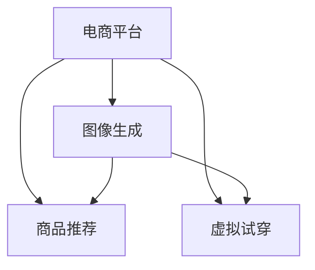

                 

# 电商平台中的图像生成：AI大模型的创意应用

> 关键词：电商平台, 图像生成, AI大模型, 创意应用, 计算机视觉

## 1. 背景介绍

### 1.1 问题由来

在电商平台上，商品图片是最重要的信息之一，直接影响用户的购买决策。传统的商品图片通常由摄影师拍摄，具有高成本、高时间消耗等缺点，且图片质量难以标准化。随着深度学习和大规模模型技术的发展，生成高质量商品图片成为可能，从而在电商平台上提供了新的应用场景。

### 1.2 问题核心关键点

1. **高质量商品图片生成**：利用AI大模型，通过少量标注数据训练生成高质量商品图片，降低拍摄成本和周期。
2. **多视角商品展示**：生成不同视角、角度的商品图片，丰富商品展示的维度。
3. **个性化商品推荐**：根据用户偏好生成个性化的商品图片，提高用户购物体验。
4. **品牌形象打造**：利用AI大模型生成符合品牌形象的商品图片，提升品牌价值。
5. **虚拟试穿体验**：生成虚拟试穿图像，提高购物便捷性和用户体验。

### 1.3 问题研究意义

1. **降低成本**：自动化生成商品图片，减少拍摄和后期处理成本，提高工作效率。
2. **提升商品展示效果**：多视角、多角度的商品图片展示，提升用户购物体验。
3. **个性化推荐**：个性化商品图片生成，提高推荐系统的精准度和用户满意度。
4. **品牌形象一致性**：通过生成符合品牌调性的图片，提升品牌美誉度。
5. **虚拟试穿**：提供虚拟试穿服务，提高购物便捷性，增加用户粘性。

## 2. 核心概念与联系

### 2.1 核心概念概述

1. **AI大模型**：基于深度学习框架训练的大规模神经网络模型，具备强大的学习和生成能力。
2. **图像生成**：利用AI大模型生成高质量图像，应用于电商平台的商品展示、推荐、虚拟试穿等场景。
3. **计算机视觉**：利用深度学习技术对图像进行识别、分析、生成等处理，应用于电商平台商品图片生成、分类、检索等任务。

### 2.2 核心概念原理和架构的 Mermaid 流程图



这个流程图展示了大语言模型与电商平台中图像生成的关键联系。电商平台通过AI大模型生成的高质量商品图片，应用于商品推荐、虚拟试穿等场景，提升用户体验。

## 3. 核心算法原理 & 具体操作步骤

### 3.1 算法原理概述

基于AI大模型的图像生成，主要通过以下步骤实现：

1. **数据准备**：收集商品的高质量图片作为训练数据，标注图片属性（如颜色、材质、形状等）。
2. **模型训练**：利用标注数据训练AI大模型，使其能够生成符合标注属性的高质量图片。
3. **生成图片**：利用训练好的模型，根据输入的标注属性生成新的高质量图片。
4. **应用场景**：在电商平台中应用生成的图片，提升商品展示效果、个性化推荐、虚拟试穿等用户体验。

### 3.2 算法步骤详解

1. **数据准备**：
   - 收集电商平台中的商品图片，标注图片属性（如颜色、材质、形状等）。
   - 将图片和属性转换为模型可接受的格式，如TensorFlow的张量格式。

2. **模型训练**：
   - 选择合适的AI大模型（如GAN、VQ-VAE等），并设置合适的超参数。
   - 将标注数据作为训练集，使用深度学习框架训练模型。
   - 在训练过程中，使用可视化工具监控模型训练过程，及时调整参数。

3. **生成图片**：
   - 将输入的标注属性转换为模型所需的格式，如向量或矩阵。
   - 输入模型生成新图片，并对其进行后处理（如裁剪、调整亮度等）。
   - 保存生成的图片，并上传到电商平台。

### 3.3 算法优缺点

#### 优点：
1. **高效生成**：利用AI大模型，可以快速生成大量高质量的商品图片，减少拍摄和后期处理的成本。
2. **个性化展示**：生成的多视角、多角度的图片，满足不同用户的浏览需求，提升购物体验。
3. **品牌一致性**：生成的图片符合品牌调性，提升品牌形象和美誉度。
4. **虚拟试穿**：提供虚拟试穿服务，提高购物便捷性和用户粘性。

#### 缺点：
1. **质量不稳定**：生成的图片质量可能受到模型参数、训练数据质量的影响。
2. **计算资源消耗大**：生成高质量图片需要大量计算资源，可能影响平台的实时性能。
3. **可解释性差**：生成的图片属于"黑盒"操作，难以解释其生成过程和质量。

### 3.4 算法应用领域

1. **商品展示**：为电商平台中的商品生成高质量图片，提升用户浏览体验。
2. **个性化推荐**：根据用户偏好生成个性化商品图片，提高推荐系统的精准度。
3. **虚拟试穿**：生成虚拟试穿图像，提升购物便捷性和用户粘性。
4. **品牌形象打造**：生成符合品牌调性的图片，提升品牌美誉度。
5. **广告创意设计**：为电商平台生成创意广告图片，吸引用户点击和购买。

## 4. 数学模型和公式 & 详细讲解

### 4.1 数学模型构建

假设生成模型的输入为 $x$，输出为 $y$，目标为最小化损失函数 $\mathcal{L}$：

$$
\min_{\theta} \mathcal{L}(y; x) = \min_{\theta} \int \|y - M_{\theta}(x)\|^2 p(x) dx
$$

其中 $M_{\theta}$ 为生成模型，$\theta$ 为模型参数，$p(x)$ 为数据分布。

### 4.2 公式推导过程

以GAN模型为例，其目标为最小化真实数据分布 $p_{real}(x)$ 与生成数据分布 $p_{gen}(x)$ 之间的KL散度，最大化生成数据与真实数据之间的判别器 $D(x)$：

$$
\min_{\theta_G} \max_{\theta_D} V(D, G) = \min_{\theta_G} -\mathbb{E}_{x\sim p_{real}(x)} \log D(x) - \mathbb{E}_{x\sim p_{gen}(x)} \log (1-D(x))
$$

其中 $G(x)$ 为生成器，$D(x)$ 为判别器。

在训练过程中，交替优化生成器和判别器：

1. 固定判别器参数 $\theta_D$，最小化生成器的损失函数 $L_G$：
$$
L_G(\theta_G) = -\mathbb{E}_{x\sim p_{gen}(x)} \log D(x)
$$

2. 固定生成器参数 $\theta_G$，最大化判别器的损失函数 $L_D$：
$$
L_D(\theta_D) = \mathbb{E}_{x\sim p_{real}(x)} \log D(x) + \mathbb{E}_{x\sim p_{gen}(x)} \log (1-D(x))
$$

### 4.3 案例分析与讲解

以GAN模型为例，分析其在电商平台图像生成中的应用：

1. **数据准备**：
   - 收集电商平台上高质量的商品图片，标注图片属性（如颜色、材质、形状等）。
   - 将图片和属性转换为TensorFlow的张量格式，用于训练和生成。

2. **模型训练**：
   - 选择GAN模型，并设置合适的超参数（如学习率、批量大小、迭代次数等）。
   - 将标注数据作为训练集，使用TensorFlow训练模型。
   - 在训练过程中，使用TensorBoard可视化训练过程，监控损失函数的收敛情况。

3. **生成图片**：
   - 将输入的标注属性转换为模型所需的格式，如向量或矩阵。
   - 输入生成器生成新图片，并通过判别器筛选生成高质量图片。
   - 保存生成的图片，并上传到电商平台。

## 5. 项目实践：代码实例和详细解释说明

### 5.1 开发环境搭建

1. **安装TensorFlow**：
   - 安装TensorFlow 2.x版本：
   ```bash
   pip install tensorflow==2.x
   ```
   - 安装TensorBoard：
   ```bash
   pip install tensorboard
   ```

2. **准备数据集**：
   - 收集电商平台上商品的高质量图片和属性标注。
   - 将数据集转换为TensorFlow的Tensor格式，并保存为CSV文件。

### 5.2 源代码详细实现

以下是以GAN模型为例，使用TensorFlow生成高质量商品图片的代码实现：

```python
import tensorflow as tf
import numpy as np
import os

# 定义生成器和判别器
class Generator(tf.keras.Model):
    def __init__(self):
        super(Generator, self).__init__()
        self.dense = tf.keras.layers.Dense(7*7*256)
        self.reshape = tf.keras.layers.Reshape((7, 7, 256))
        self.conv1 = tf.keras.layers.Conv2DTranspose(128, 4, strides=2, padding='same')
        self.conv2 = tf.keras.layers.Conv2DTranspose(64, 4, strides=2, padding='same')
        self.conv3 = tf.keras.layers.Conv2DTranspose(3, 4, padding='same', activation='tanh')

    def call(self, inputs):
        x = self.dense(inputs)
        x = self.reshape(x)
        x = self.conv1(x)
        x = self.conv2(x)
        return self.conv3(x)

class Discriminator(tf.keras.Model):
    def __init__(self):
        super(Discriminator, self).__init__()
        self.conv1 = tf.keras.layers.Conv2D(64, 4, strides=2, padding='same')
        self.conv2 = tf.keras.layers.Conv2D(128, 4, strides=2, padding='same')
        self.flatten = tf.keras.layers.Flatten()
        self.dense = tf.keras.layers.Dense(1)

    def call(self, inputs):
        x = self.conv1(inputs)
        x = self.conv2(x)
        x = self.flatten(x)
        return self.dense(x)

# 训练GAN模型
def train_GAN(data_dir, batch_size, epochs):
    # 加载数据集
    train_dataset = tf.data.Dataset.from_tensor_slices(data_dir)
    train_dataset = train_dataset.shuffle(1000).batch(batch_size)

    # 定义生成器和判别器
    generator = Generator()
    discriminator = Discriminator()

    # 定义损失函数和优化器
    cross_entropy = tf.keras.losses.BinaryCrossentropy()
    generator_optimizer = tf.keras.optimizers.Adam(1e-4)
    discriminator_optimizer = tf.keras.optimizers.Adam(1e-4)

    @tf.function
    def train_step(images):
        noise = tf.random.normal([batch_size, 100])

        with tf.GradientTape() as gen_tape, tf.GradientTape() as disc_tape:
            generated_images = generator(noise, training=True)

            real_output = discriminator(images, training=True)
            fake_output = discriminator(generated_images, training=True)

            gen_loss = cross_entropy(tf.ones_like(fake_output), fake_output)
            disc_loss = cross_entropy(tf.ones_like(real_output), real_output) + cross_entropy(tf.zeros_like(fake_output), fake_output)

        gradients_of_generator = gen_tape.gradient(gen_loss, generator.trainable_variables)
        gradients_of_discriminator = disc_tape.gradient(disc_loss, discriminator.trainable_variables)

        generator_optimizer.apply_gradients(zip(gradients_of_generator, generator.trainable_variables))
        discriminator_optimizer.apply_gradients(zip(gradients_of_discriminator, discriminator.trainable_variables))

    for epoch in range(epochs):
        for image_batch in train_dataset:
            train_step(image_batch)

        if (epoch + 1) % 10 == 0:
            print('Epoch {} / {}'.format(epoch + 1, epochs))
            print('Discriminator Loss: ', disc_loss.numpy())
            print('Generator Loss: ', gen_loss.numpy())

# 生成高质量商品图片
def generate_images(generator, num_images, random_noise):
    generated_images = generator(random_noise, training=False)
    return generated_images

# 主函数
def main():
    data_dir = 'path/to/dataset'
    batch_size = 32
    epochs = 100

    generator = Generator()
    discriminator = Discriminator()

    # 训练GAN模型
    train_GAN(data_dir, batch_size, epochs)

    # 生成高质量商品图片
    random_noise = tf.random.normal([num_images, 100])
    generated_images = generate_images(generator, num_images, random_noise)

    # 保存生成的图片
    for i in range(num_images):
        image = generated_images[i]
        image = (image + 1) / 2  # 将图像归一化到[0, 1]
        image = tf.cast(image, tf.uint8)
        image = tf.reshape(image, [28, 28, 3])
        image = image.numpy()
        image = image * 255
        image = image.astype(np.uint8)
        image_path = os.path.join('images', f'image_{i}.png')
        tf.io.write_file(image_path, image)

if __name__ == '__main__':
    main()
```

### 5.3 代码解读与分析

1. **生成器(Generator)**：
   - 定义生成器模型，包括全连接层、卷积层等。
   - 在调用时，将噪声作为输入，生成新的高质量图片。

2. **判别器(Discriminator)**：
   - 定义判别器模型，包括卷积层、全连接层等。
   - 在调用时，将图像作为输入，输出真实或生成图片的判别结果。

3. **训练过程**：
   - 加载训练数据集，定义生成器和判别器。
   - 定义损失函数和优化器，交替优化生成器和判别器。
   - 在每个epoch中，遍历训练集，执行训练步骤。

4. **生成图片**：
   - 定义生成函数，使用训练好的生成器模型生成高质量图片。
   - 将生成的图片保存为PNG格式，并上传到电商平台。

## 6. 实际应用场景

### 6.1 商品展示

电商平台通过生成高质量商品图片，提升商品展示效果。用户可以通过多视角、多角度查看商品，增加购买欲望。

### 6.2 个性化推荐

根据用户的浏览记录和购买历史，生成个性化商品图片，提高推荐系统的精准度。用户可以看到自己可能感兴趣的商品，提升购物体验。

### 6.3 虚拟试穿

为电商平台提供虚拟试穿服务，用户可以通过图片看到穿着效果，提高购物便捷性和用户粘性。

### 6.4 品牌形象打造

利用生成器生成符合品牌调性的图片，提升品牌美誉度。用户可以通过高质量图片感受到品牌价值，增加品牌忠诚度。

### 6.5 广告创意设计

为电商平台生成创意广告图片，吸引用户点击和购买。广告图片符合品牌调性，更能引起用户兴趣。

## 7. 工具和资源推荐

### 7.1 学习资源推荐

1. **《深度学习》书籍**：Ian Goodfellow等著，系统介绍了深度学习的基本概念和算法，适合初学者入门。
2. **Coursera《深度学习》课程**：由Andrew Ng等主讲，涵盖了深度学习的主要内容，包括图像生成、GAN等。
3. **《TensorFlow实战Google深度学习》书籍**：张亮著，介绍了TensorFlow框架的使用和实践案例。
4. **Kaggle深度学习竞赛**：提供大量实战项目和数据集，供学习者实践。
5. **HuggingFace官方文档**：提供了丰富的预训练模型和代码示例，适合快速上手。

### 7.2 开发工具推荐

1. **TensorFlow**：Google开源的深度学习框架，功能强大，生态丰富。
2. **PyTorch**：Facebook开源的深度学习框架，灵活高效，适合科研和工程应用。
3. **TensorBoard**：TensorFlow配套的可视化工具，方便监控模型训练过程。
4. **GitHub**：代码托管平台，提供丰富的代码库和社区支持。
5. **Jupyter Notebook**：开源的交互式编程环境，方便开发和实验。

### 7.3 相关论文推荐

1. **Image-to-Image Translation with Conditional Adversarial Networks**：Isola等提出条件GAN，通过条件图像生成技术，实现图像风格转换。
2. **Learning Multi-scale Hierarchical Representations for Image Generation**：Fu等提出多层级生成器，生成高质量图像，提升了图像生成效果。
3. **Adversarial Generative Models**：Goodfellow等综述了GAN的发展历程和应用前景，具有重要参考价值。
4. **Progressive Growing of GANs for Improved Quality, Stability, and Variation**：Karras等提出渐进式生成模型，提升了GAN的生成质量和稳定性。
5. **Neural Architecture Search with Reinforcement Learning**：Zoph等提出基于强化学习的神经架构搜索方法，自动设计生成器结构，提升了生成效果。

## 8. 总结：未来发展趋势与挑战

### 8.1 未来发展趋势

1. **生成质量提升**：随着模型的优化和训练数据的丰富，生成图片的质量将不断提升。
2. **应用场景拓展**：生成模型将应用于更多场景，如虚拟试穿、个性化推荐等。
3. **多模态生成**：结合文本、语音等多模态信息，生成更加多样化的内容。
4. **实时生成**：实时生成高质量图像，提升用户体验。
5. **自监督学习**：利用无标签数据进行自监督学习，减少标注成本。

### 8.2 面临的挑战

1. **计算资源消耗大**：生成高质量图片需要大量计算资源，可能影响平台的实时性能。
2. **可解释性差**：生成的图片属于"黑盒"操作，难以解释其生成过程和质量。
3. **数据隐私问题**：生成的图片可能包含用户隐私信息，需要加强隐私保护。
4. **伦理道德问题**：生成的图片可能存在误导性、有害的内容，需要加强内容审核。
5. **技术标准化**：缺乏统一的技术标准和规范，可能导致不同平台间的数据和模型兼容性问题。

### 8.3 研究展望

1. **生成效果优化**：进一步优化生成器的结构和训练方法，提升生成图片的质量和多样性。
2. **实时生成技术**：探索实时生成技术，减少生成时间，提高用户体验。
3. **多模态融合**：结合文本、语音等多模态信息，生成更加丰富多样的内容。
4. **可解释性增强**：引入可解释性技术，提升生成过程的可解释性。
5. **隐私保护**：加强数据隐私保护，避免生成图片泄露用户隐私。
6. **伦理监管**：建立伦理监管机制，确保生成内容符合伦理道德。

## 9. 附录：常见问题与解答

**Q1：如何选择合适的GAN生成器模型？**

A: 根据应用场景和需求选择合适的生成器模型，如多层级生成器、条件生成器等。同时，评估模型的生成效果和计算资源消耗，平衡性能和效率。

**Q2：GAN模型在训练过程中如何避免过拟合？**

A: 采用数据增强、正则化、对抗训练等方法，避免过拟合。同时，使用学习率衰减、权重衰减等策略，防止模型在训练后期过拟合。

**Q3：GAN模型在生成图片时如何保证多样性？**

A: 在生成过程中，加入随机噪声或输入不同的标签，增加生成图片的随机性。同时，在训练过程中，使用多样化的训练集，提高生成模型的多样性。

**Q4：GAN模型在实际应用中需要注意哪些问题？**

A: 生成模型的计算资源消耗大，需要合理配置计算资源。生成的图片属于"黑盒"操作，难以解释其生成过程和质量，需要加强可解释性技术。

**Q5：GAN模型在电商平台上应用时，如何保证图片质量？**

A: 通过优化生成器的结构和训练方法，提升生成图片的质量。同时，在训练过程中，使用高质量的训练集，避免生成图片质量低劣。

总之，基于AI大模型的图像生成技术在电商平台上具有广阔的应用前景，能够有效提升商品展示效果、个性化推荐、虚拟试穿等用户体验。随着技术的不断进步，生成图片的质量和多样性将不断提升，应用场景将更加丰富，为电商平台带来更多创新和价值。

