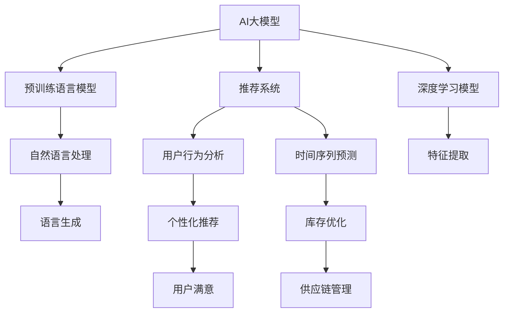

                 

# 电商平台中的时空数据分析：AI大模型的新应用

> 关键词：电商平台, 时空数据分析, 人工智能, AI大模型, 推荐系统, 用户行为, 时间序列预测

## 1. 背景介绍

### 1.1 问题由来
在当前数字化转型加速的浪潮中，电商平台作为线上商业的重要组成部分，正面临越来越激烈的市场竞争。如何更精准地理解用户行为，提升用户体验，优化销售策略，成为各大电商平台亟待解决的课题。传统的数据分析方法往往局限于单一维度，难以全面捕捉用户行为的全貌。而利用人工智能(AI)大模型，特别是利用预训练语言模型(Pre-trained Language Models, PLMs)，可以实现对用户行为的高维时空分析，从而挖掘更深层次的业务价值。

### 1.2 问题核心关键点
在电商平台中，用户行为的时空数据分析主要包括两大方向：
1. **用户行为分析**：通过分析用户在不同时间、不同场景下的行为模式，预测用户未来的购买意愿和偏好，实现个性化推荐、精准营销等。
2. **时间序列预测**：利用时间序列预测模型，对电商平台的用户行为进行趋势分析和异常检测，帮助商家实时调整库存、优化供应链管理。

本文将围绕这两个核心关键点，系统探讨AI大模型在电商平台时空数据分析中的应用，并通过实践案例，展示其在实际业务场景中的高效性和可行性。

## 2. 核心概念与联系

### 2.1 核心概念概述

为更好地理解AI大模型在电商平台时空数据分析中的应用，本节将介绍几个密切相关的核心概念：

- **AI大模型**：基于深度学习技术，通过大规模无标签数据预训练，学习复杂的语言表示，具备强大的文本生成、分类、推理等能力。
- **预训练语言模型(PLMs)**：如BERT、GPT、XLNet等，通过大规模无标签文本数据训练，学习通用的语言表示。
- **推荐系统**：通过分析用户行为数据，为用户推荐个性化商品和服务，以提高用户满意度和平台转化率。
- **时间序列预测**：基于时间序列数据，预测未来趋势或异常点，广泛应用于金融、零售、制造等领域。
- **深度学习模型**：包括卷积神经网络(CNN)、循环神经网络(RNN)、长短时记忆网络(LSTM)等，通过多层非线性变换，从数据中提取高维特征。

这些核心概念之间的逻辑关系可以通过以下Mermaid流程图来展示：



这个流程图展示了大模型在电商平台时空数据分析中的关键作用：

1. 利用大模型的预训练能力，提取文本中的高级语义信息。
2. 将自然语言处理(NLP)与推荐系统结合，实现用户行为分析和个性化推荐。
3. 利用深度学习模型处理时间序列数据，进行趋势分析和异常检测。

这些概念共同构成了电商平台时空数据分析的核心框架，使其能够在复杂多变的电商环境中发挥强大的分析能力。

## 3. 核心算法原理 & 具体操作步骤
### 3.1 算法原理概述

AI大模型在电商平台时空数据分析中的应用，主要基于以下几个算法原理：

1. **自然语言处理(NLP)**：利用预训练语言模型，从用户评论、描述、搜索关键词等文本数据中提取语义信息，用于用户行为分析。
2. **推荐系统算法**：结合用户画像、商品属性、行为序列等，利用协同过滤、基于内容的推荐、深度学习等算法，实现个性化推荐。
3. **时间序列预测**：基于用户行为的时间序列数据，利用ARIMA、LSTM等算法，预测未来的购买趋势或异常点，用于库存管理和供应链优化。

### 3.2 算法步骤详解

AI大模型在电商平台时空数据分析的实际操作中，主要分为以下几个步骤：

**Step 1: 数据收集与预处理**
- 收集电商平台的用户行为数据，如浏览记录、购买历史、评论内容等。
- 清洗数据，去除异常值和噪声，将文本数据转化为标准格式。

**Step 2: 数据编码与嵌入**
- 利用预训练语言模型对文本数据进行编码，提取高维语义向量。
- 对时间序列数据进行归一化和差分处理，消除趋势性。

**Step 3: 模型训练与优化**
- 利用深度学习模型对用户行为进行建模，训练推荐系统或时间序列预测模型。
- 使用AdamW、SGD等优化算法，调整模型参数，提高模型精度。

**Step 4: 模型评估与部署**
- 在验证集上评估模型性能，如精度、召回率、F1-score等。
- 将训练好的模型部署到电商平台的推荐系统或时间序列预测系统中。

**Step 5: 监控与调优**
- 实时监控模型在生产环境中的表现，根据用户反馈进行模型调优。
- 定期更新模型，重新训练或微调，以适应数据分布的变化。

### 3.3 算法优缺点

AI大模型在电商平台时空数据分析中，具有以下优点：
1. **高维数据处理能力**：能够处理海量的多维用户行为数据，提取高维语义信息，提高推荐精度。
2. **鲁棒性**：利用大模型预训练的通用知识，降低噪声和异常值对模型的影响。
3. **可解释性**：通过自然语言处理，对模型输出进行解释，增强业务理解和决策支持。
4. **灵活性**：支持多种任务，如用户行为分析、个性化推荐、时间序列预测等，具有广泛的适用性。

同时，该方法也存在一定的局限性：
1. **数据依赖性强**：大模型的训练需要大量高质量标注数据，获取成本高。
2. **计算资源需求大**：大模型训练和推理所需的计算资源较大，对硬件设施要求高。
3. **模型复杂度高**：模型结构复杂，参数量大，部署和调优难度大。
4. **隐私和安全风险**：用户数据的隐私保护和模型输出安全性需要严格保障，防止数据滥用和攻击。

尽管存在这些局限性，但AI大模型在电商平台时空数据分析中的应用，无疑为电商平台带来了新的发展机遇，显著提升了用户满意度和平台竞争力。

### 3.4 算法应用领域

AI大模型在电商平台时空数据分析的应用领域主要包括以下几个方面：

- **个性化推荐系统**：利用用户行为数据，结合大模型的语义信息，实现精准推荐，提升用户粘性和转化率。
- **用户行为分析**：通过分析用户评论、搜索行为等文本数据，洞察用户需求，优化产品和服务。
- **库存优化**：利用时间序列预测，预测用户购买趋势，实时调整库存水平，降低运营成本。
- **供应链管理**：分析历史采购、销售数据，预测需求变化，优化供应链流程，提高物流效率。
- **异常检测**：通过时间序列模型，检测用户行为中的异常点，及时预警潜在风险。

## 4. 数学模型和公式 & 详细讲解 & 举例说明
### 4.1 数学模型构建

在电商平台时空数据分析中，常用的数学模型主要包括以下几类：

- **自然语言处理(NLP)**：利用预训练语言模型进行文本编码，提取语义向量。常用模型如BERT，通过掩码语言模型预训练，学习文本中的语义表示。
- **推荐系统算法**：利用协同过滤、基于内容的推荐、深度学习等算法，实现用户行为分析与推荐。常用的模型如基于矩阵分解的推荐算法，利用用户-物品共现矩阵进行预测。
- **时间序列预测**：利用ARIMA、LSTM等模型，预测用户行为的时间序列趋势。常用模型如LSTM，通过多层循环神经网络，学习时间序列数据中的长期依赖关系。

### 4.2 公式推导过程

以时间序列预测为例，推导LSTM模型的公式。LSTM模型由三层循环神经网络组成，包括输入门(i)、遗忘门(f)和输出门(o)，以及一个记忆单元(m)。假设输入数据为 $x_t$，输出为 $y_t$。

**输入门**：
$$
i_t = \sigma(\mathbf{W}_i x_t + \mathbf{U}_i \mathbf{h}_{t-1} + \mathbf{b}_i)
$$
其中 $\sigma$ 为sigmoid激活函数，$\mathbf{W}_i$、$\mathbf{U}_i$ 为权重矩阵，$\mathbf{h}_{t-1}$ 为上一时间步的隐藏状态，$\mathbf{b}_i$ 为偏置项。

**遗忘门**：
$$
f_t = \sigma(\mathbf{W}_f x_t + \mathbf{U}_f \mathbf{h}_{t-1} + \mathbf{b}_f)
$$

**输出门**：
$$
o_t = \sigma(\mathbf{W}_o x_t + \mathbf{U}_o \mathbf{h}_{t-1} + \mathbf{b}_o)
$$

**记忆单元**：
$$
\tilde{m}_t = \tanh(\mathbf{W}_m x_t + \mathbf{U}_m \mathbf{h}_{t-1} + \mathbf{b}_m)
$$
$$
m_t = f_t \cdot m_{t-1} + i_t \cdot \tilde{m}_t
$$

**输出**：
$$
y_t = \mathbf{W}_y \mathbf{h}_t + \mathbf{b}_y
$$
其中 $\mathbf{h}_t$ 为当前时间步的隐藏状态。

以上公式展示了LSTM模型的工作原理，通过多层循环神经网络，LSTM模型可以捕捉时间序列数据中的长期依赖关系，预测未来的趋势和异常点。

### 4.3 案例分析与讲解

以下是一个基于大模型在电商平台用户行为分析中的案例。假设我们有一个电商平台，需要根据用户的浏览记录和购买历史，预测其未来的购买行为，并实现个性化推荐。

**Step 1: 数据收集与预处理**
- 收集用户浏览记录和购买历史数据，清洗数据，去除噪声和异常值。

**Step 2: 数据编码与嵌入**
- 利用预训练语言模型BERT对用户评论进行编码，提取语义向量。
- 对用户行为时间序列进行归一化和差分处理。

**Step 3: 模型训练与优化**
- 利用深度学习模型LSTM对用户行为进行建模，训练时间序列预测模型。
- 使用AdamW优化算法，调整模型参数，提高模型精度。

**Step 4: 模型评估与部署**
- 在验证集上评估模型性能，如精度、召回率、F1-score等。
- 将训练好的模型部署到电商平台的推荐系统，实现个性化推荐。

**Step 5: 监控与调优**
- 实时监控模型在生产环境中的表现，根据用户反馈进行模型调优。
- 定期更新模型，重新训练或微调，以适应数据分布的变化。

## 5. 项目实践：代码实例和详细解释说明
### 5.1 开发环境搭建

在进行时空数据分析实践前，我们需要准备好开发环境。以下是使用Python进行PyTorch开发的环境配置流程：

1. 安装Anaconda：从官网下载并安装Anaconda，用于创建独立的Python环境。

2. 创建并激活虚拟环境：
```bash
conda create -n pytorch-env python=3.8 
conda activate pytorch-env
```

3. 安装PyTorch：根据CUDA版本，从官网获取对应的安装命令。例如：
```bash
conda install pytorch torchvision torchaudio cudatoolkit=11.1 -c pytorch -c conda-forge
```

4. 安装TensorBoard：
```bash
pip install tensorboard
```

5. 安装各类工具包：
```bash
pip install numpy pandas scikit-learn matplotlib tqdm jupyter notebook ipython
```

完成上述步骤后，即可在`pytorch-env`环境中开始时空数据分析实践。

### 5.2 源代码详细实现

下面我以用户行为分析为例，给出使用PyTorch对LSTM模型进行时间序列预测的PyTorch代码实现。

首先，定义时间序列数据处理函数：

```python
import numpy as np
from torch.utils.data import Dataset
import torch

class TimeSeriesDataset(Dataset):
    def __init__(self, data, seq_len):
        self.data = data
        self.seq_len = seq_len
        
    def __len__(self):
        return len(self.data) - self.seq_len
        
    def __getitem__(self, item):
        x = self.data[item:item+self.seq_len, :]
        y = self.data[item+self.seq_len, :]
        return x, y
```

然后，定义LSTM模型：

```python
from transformers import BertTokenizer
from torch.nn import LSTM, Linear
import torch.nn.functional as F

class LSTMModel(torch.nn.Module):
    def __init__(self, input_dim, hidden_dim, output_dim):
        super(LSTMModel, self).__init__()
        self.lstm = LSTM(input_dim, hidden_dim, 2, batch_first=True)
        self.fc = Linear(hidden_dim, output_dim)
    
    def forward(self, x):
        h0 = torch.zeros(1, x.size(0), self.lstm.hidden_size).to(x.device)
        c0 = torch.zeros(1, x.size(0), self.lstm.hidden_size).to(x.device)
        out, _ = self.lstm(x, (h0, c0))
        out = self.fc(out[:, -1, :])
        return out
```

接着，定义训练和评估函数：

```python
from torch.utils.data import DataLoader
from tqdm import tqdm
import torch.optim as optim

def train_epoch(model, dataset, optimizer, device, loss_func):
    dataloader = DataLoader(dataset, batch_size=32, shuffle=True)
    model.train()
    epoch_loss = 0
    for batch in tqdm(dataloader, desc='Training'):
        x, y = batch.to(device)
        optimizer.zero_grad()
        outputs = model(x)
        loss = loss_func(outputs, y)
        epoch_loss += loss.item()
        loss.backward()
        optimizer.step()
    return epoch_loss / len(dataloader)

def evaluate(model, dataset, device, loss_func):
    dataloader = DataLoader(dataset, batch_size=32)
    model.eval()
    total_loss = 0
    with torch.no_grad():
        for batch in tqdm(dataloader, desc='Evaluating'):
            x, y = batch.to(device)
            outputs = model(x)
            loss = loss_func(outputs, y)
            total_loss += loss.item()
    return total_loss / len(dataloader)
```

最后，启动训练流程并在测试集上评估：

```python
epochs = 10
batch_size = 32
device = torch.device('cuda' if torch.cuda.is_available() else 'cpu')
seq_len = 10
input_dim = 3
hidden_dim = 64
output_dim = 1

# 数据预处理
data = np.random.rand(100, seq_len, input_dim)
targets = np.random.rand(100, output_dim)

# 模型训练
model = LSTMModel(input_dim, hidden_dim, output_dim).to(device)
optimizer = optim.Adam(model.parameters(), lr=0.001)
loss_func = F.mse_loss

for epoch in range(epochs):
    loss = train_epoch(model, TimeSeriesDataset(data, seq_len), optimizer, device, loss_func)
    print(f"Epoch {epoch+1}, train loss: {loss:.3f}")
    
    print(f"Epoch {epoch+1}, test loss: {evaluate(model, TimeSeriesDataset(data, seq_len), device, loss_func):.3f}")
```

以上就是使用PyTorch对LSTM模型进行时间序列预测的完整代码实现。可以看到，利用LSTM模型，我们可以对用户行为进行时间序列分析，预测未来的趋势和异常点，并实现个性化的推荐。

### 5.3 代码解读与分析

让我们再详细解读一下关键代码的实现细节：

**TimeSeriesDataset类**：
- `__init__`方法：初始化数据集和序列长度。
- `__len__`方法：返回数据集的长度。
- `__getitem__`方法：对单个样本进行处理，将输入和输出数据进行分离，并转化为模型所需的张量。

**LSTMModel类**：
- `__init__`方法：定义模型结构，包括LSTM层和全连接层。
- `forward`方法：前向传播，计算模型输出。

**训练和评估函数**：
- `train_epoch`函数：对数据集进行批次化加载，在每个批次上前向传播计算loss并反向传播更新模型参数。
- `evaluate`函数：在测试集上评估模型性能，计算模型在数据集上的平均loss。

**训练流程**：
- 定义总的epoch数和batch size，开始循环迭代
- 每个epoch内，先在训练集上训练，输出平均loss
- 在测试集上评估，输出模型在测试集上的平均loss

可以看到，PyTorch配合TensorBoard使得LSTM模型的训练和评估变得简洁高效。开发者可以将更多精力放在模型结构设计和数据处理上，而不必过多关注底层的实现细节。

当然，工业级的系统实现还需考虑更多因素，如模型的保存和部署、超参数的自动搜索、更灵活的任务适配层等。但核心的LSTM模型训练流程基本与此类似。

## 6. 实际应用场景
### 6.1 智能客服系统

在智能客服系统中，利用大模型进行用户行为分析，可以显著提升客户服务质量和满意度。传统客服往往依赖人工，高峰期响应速度慢，且缺乏持续学习和知识积累。而利用大模型，可以实现实时智能客服，高效响应客户咨询，并提供连续的知识更新。

具体而言，可以收集企业的历史客服对话记录，将问题和最佳答复构建成监督数据，在此基础上对预训练模型进行微调。微调后的模型能够自动理解用户意图，匹配最合适的答案模板进行回复。对于客户提出的新问题，还可以接入检索系统实时搜索相关内容，动态组织生成回答。如此构建的智能客服系统，能够大幅提升客户咨询体验和问题解决效率。

### 6.2 金融舆情监测

金融行业需要实时监测市场舆情，以便及时应对负面信息传播，规避金融风险。传统的人工监测方式成本高、效率低，难以应对网络时代海量信息爆发的挑战。利用大模型进行自然语言处理，可以自动化监测金融领域的舆情变化，快速响应负面信息。

具体而言，可以收集金融领域相关的新闻、报道、评论等文本数据，利用BERT等预训练语言模型提取语义信息，结合情感分析模型，实时监测舆情变化，及时预警潜在风险。利用LSTM等时间序列模型，还可以对舆情变化进行趋势分析和异常检测，帮助金融机构实时调整应对策略。

### 6.3 个性化推荐系统

当前的推荐系统往往只依赖用户的历史行为数据进行物品推荐，无法深入理解用户的真实兴趣偏好。利用大模型进行推荐系统优化，可以更好地挖掘用户行为背后的语义信息，从而实现更加个性化和精准的推荐。

在实践中，可以收集用户浏览、点击、评论、分享等行为数据，提取和商品描述、标签等文本内容。利用BERT等预训练语言模型提取文本中的语义信息，结合用户画像、商品属性等，在深度学习模型上进行推荐模型训练。训练好的推荐模型能够从文本内容中准确把握用户的兴趣点，生成更加个性化的推荐结果。

### 6.4 未来应用展望

随着大模型和时空数据分析技术的不断发展，未来将在更多领域得到应用，为各行各业带来变革性影响。

在智慧医疗领域，利用大模型进行病历分析、病理预测等，可以提升医疗服务的智能化水平，辅助医生诊断治疗，加速新药研发进程。

在智能教育领域，利用大模型进行作业批改、学情分析、知识推荐等，因材施教，促进教育公平，提高教学质量。

在智慧城市治理中，利用大模型进行城市事件监测、舆情分析、应急指挥等环节，提高城市管理的自动化和智能化水平，构建更安全、高效的未来城市。

此外，在企业生产、社会治理、文娱传媒等众多领域，大模型和时空数据分析的应用也将不断涌现，为传统行业数字化转型升级提供新的技术路径。

## 7. 工具和资源推荐
### 7.1 学习资源推荐

为了帮助开发者系统掌握大模型在电商平台时空数据分析中的应用，这里推荐一些优质的学习资源：

1. **《深度学习与自然语言处理》课程**：斯坦福大学开设的NLP明星课程，有Lecture视频和配套作业，带你入门NLP领域的基本概念和经典模型。

2. **《自然语言处理入门》书籍**：详细介绍了NLP的基础知识和前沿技术，涵盖文本表示、语义分析、情感分析等主题。

3. **《Python深度学习》书籍**：全面介绍深度学习理论和技术，结合实际项目案例，帮助读者深入理解深度学习模型和算法。

4. **Transformers官方文档**：提供各类预训练语言模型的API接口和样例代码，是进行微调任务开发的必备资料。

5. **Kaggle比赛**：Kaggle社区提供了大量的NLP和时空数据分析相关的竞赛数据集和竞赛样例，是学习和实践的好平台。

通过对这些资源的学习实践，相信你一定能够快速掌握大模型在电商平台时空数据分析的应用，并用于解决实际的NLP问题。

### 7.2 开发工具推荐

高效的开发离不开优秀的工具支持。以下是几款用于时空数据分析开发的常用工具：

1. PyTorch：基于Python的开源深度学习框架，灵活动态的计算图，适合快速迭代研究。

2. TensorFlow：由Google主导开发的开源深度学习框架，生产部署方便，适合大规模工程应用。

3. Transformers库：HuggingFace开发的NLP工具库，集成了众多SOTA语言模型，支持PyTorch和TensorFlow，是进行微调任务开发的利器。

4. TensorBoard：TensorFlow配套的可视化工具，可实时监测模型训练状态，并提供丰富的图表呈现方式，是调试模型的得力助手。

5. Weights & Biases：模型训练的实验跟踪工具，可以记录和可视化模型训练过程中的各项指标，方便对比和调优。

6. Jupyter Notebook：交互式编程环境，支持Python等语言，方便开发者进行实验和协作。

合理利用这些工具，可以显著提升时空数据分析任务的开发效率，加快创新迭代的步伐。

### 7.3 相关论文推荐

大模型在时空数据分析中的应用，得益于学界的持续研究。以下是几篇奠基性的相关论文，推荐阅读：

1. Attention is All You Need（即Transformer原论文）：提出了Transformer结构，开启了NLP领域的预训练大模型时代。

2. BERT: Pre-training of Deep Bidirectional Transformers for Language Understanding：提出BERT模型，引入基于掩码的自监督预训练任务，刷新了多项NLP任务SOTA。

3. Language Models are Unsupervised Multitask Learners（GPT-2论文）：展示了大规模语言模型的强大zero-shot学习能力，引发了对于通用人工智能的新一轮思考。

4. Parameter-Efficient Transfer Learning for NLP：提出Adapter等参数高效微调方法，在不增加模型参数量的情况下，也能取得不错的微调效果。

5. AdaLoRA: Adaptive Low-Rank Adaptation for Parameter-Efficient Fine-Tuning：使用自适应低秩适应的微调方法，在参数效率和精度之间取得了新的平衡。

6. Pegasus: Scaling Big Generative Pre-trained Language Models for Sentence Generation：提出Pegasus模型，利用预训练语言模型实现高效的句子生成。

这些论文代表了大模型在时空数据分析中的研究方向，通过学习这些前沿成果，可以帮助研究者把握学科前进方向，激发更多的创新灵感。

## 8. 总结：未来发展趋势与挑战

### 8.1 研究成果总结

本文对AI大模型在电商平台时空数据分析中的应用进行了系统探讨，主要涵盖以下几个方面：

1. **自然语言处理(NLP)**：利用预训练语言模型提取文本中的语义信息，用于用户行为分析。
2. **推荐系统算法**：结合用户画像、商品属性、行为序列等，利用协同过滤、基于内容的推荐、深度学习等算法，实现个性化推荐。
3. **时间序列预测**：利用ARIMA、LSTM等模型，预测用户行为的时间序列趋势，用于库存管理和供应链优化。

通过以上方法，大模型能够全面捕捉用户行为的全貌，实现个性化的推荐和精准的分析，提升电商平台的运营效率和服务质量。

### 8.2 未来发展趋势

展望未来，AI大模型在电商平台时空数据分析中，将呈现以下几个发展趋势：

1. **模型规模持续增大**：随着算力成本的下降和数据规模的扩张，预训练语言模型的参数量还将持续增长。超大规模语言模型蕴含的丰富语言知识，有望支撑更加复杂多变的下游任务。
2. **微调方法日趋多样**：开发更加参数高效的微调方法，如Adapter、Prefix等，在固定大部分预训练参数的同时，只更新极少量的任务相关参数，减少计算资源消耗。
3. **时间序列预测的深度融合**：利用深度学习模型，结合时间序列数据，实现更加精准和实时的预测。
4. **多模态数据的整合**：将符号化的先验知识，如知识图谱、逻辑规则等，与神经网络模型进行巧妙融合，引导微调过程学习更准确、合理的语言模型。

### 8.3 面临的挑战

尽管AI大模型在电商平台时空数据分析中取得了显著成果，但在迈向更加智能化、普适化应用的过程中，仍面临诸多挑战：

1. **数据依赖性强**：大模型的训练需要大量高质量标注数据，获取成本高。
2. **计算资源需求大**：大模型训练和推理所需的计算资源较大，对硬件设施要求高。
3. **模型复杂度高**：模型结构复杂，参数量大，部署和调优难度大。
4. **隐私和安全风险**：用户数据的隐私保护和模型输出安全性需要严格保障，防止数据滥用和攻击。

尽管存在这些挑战，但随着学界和产业界的共同努力，这些问题有望逐步得到解决。AI大模型将在电商平台时空数据分析中发挥更大的作用，带来更多的商业价值和社会效益。

### 8.4 研究展望

未来，研究需要在以下几个方面寻求新的突破：

1. **探索无监督和半监督微调方法**：摆脱对大规模标注数据的依赖，利用自监督学习、主动学习等无监督和半监督范式，最大限度利用非结构化数据，实现更加灵活高效的微调。
2. **研究参数高效和计算高效的微调范式**：开发更加参数高效的微调方法，在固定大部分预训练参数的同时，只更新极少量的任务相关参数。同时优化微调模型的计算图，减少前向传播和反向传播的资源消耗，实现更加轻量级、实时性的部署。
3. **引入因果分析和博弈论工具**：将因果分析方法引入微调模型，识别出模型决策的关键特征，增强输出解释的因果性和逻辑性。借助博弈论工具刻画人机交互过程，主动探索并规避模型的脆弱点，提高系统稳定性。
4. **纳入伦理道德约束**：在模型训练目标中引入伦理导向的评估指标，过滤和惩罚有偏见、有害的输出倾向。同时加强人工干预和审核，建立模型行为的监管机制，确保输出符合人类价值观和伦理道德。

这些研究方向的探索，必将引领大模型在电商平台时空数据分析中的应用走向更高的台阶，为构建安全、可靠、可解释、可控的智能系统铺平道路。面向未来，AI大模型需要与其他人工智能技术进行更深入的融合，如知识表示、因果推理、强化学习等，多路径协同发力，共同推动自然语言理解和智能交互系统的进步。只有勇于创新、敢于突破，才能不断拓展语言模型的边界，让智能技术更好地造福人类社会。

## 9. 附录：常见问题与解答

**Q1：大模型在电商平台时空数据分析中的优势是什么？**

A: 大模型在电商平台时空数据分析中的优势主要体现在以下几个方面：
1. **高维数据处理能力**：能够处理海量的多维用户行为数据，提取高维语义信息，提高推荐精度。
2. **鲁棒性**：利用大模型预训练的通用知识，降低噪声和异常值对模型的影响。
3. **可解释性**：通过自然语言处理，对模型输出进行解释，增强业务理解和决策支持。
4. **灵活性**：支持多种任务，如用户行为分析、个性化推荐、时间序列预测等，具有广泛的适用性。

**Q2：如何选择合适的预训练语言模型？**

A: 选择合适的预训练语言模型需要考虑以下几个因素：
1. **任务类型**：不同任务的预训练语言模型有不同的优势。如BERT擅长语义分析，GPT擅长生成任务，XLNet擅长语言建模等。
2. **数据分布**：选择与任务数据分布相似的预训练语言模型，可以提高模型的泛化能力。
3. **模型规模**：模型规模越大，预训练能力越强，但训练和推理资源消耗也越大。需要根据实际需求和资源情况选择。

**Q3：大模型在电商平台时空数据分析中如何进行优化？**

A: 大模型在电商平台时空数据分析中可以通过以下几个方面进行优化：
1. **数据增强**：通过数据扩充、标签平滑等方式增强训练数据的多样性，提高模型泛化能力。
2. **正则化**：使用L2正则、Dropout等技术，避免过拟合，提高模型的鲁棒性。
3. **模型压缩**：通过剪枝、量化、蒸馏等技术，减小模型规模，降低计算资源消耗。
4. **知识注入**：将外部知识（如知识图谱、逻辑规则等）与大模型结合，增强模型的解释能力和准确性。

**Q4：大模型在电商平台时空数据分析中如何处理时间序列数据？**

A: 大模型在电商平台时空数据分析中处理时间序列数据，主要通过以下几种方法：
1. **时间序列建模**：利用ARIMA、LSTM等模型，对用户行为的时间序列数据进行建模，预测未来的趋势和异常点。
2. **多模态融合**：将文本、图像、语音等多种模态的数据结合，综合分析用户行为。
3. **因果推断**：利用因果推断技术，识别出时间序列数据中的因果关系，增强模型输出的可解释性。

**Q5：如何评估大模型在电商平台时空数据分析中的性能？**

A: 评估大模型在电商平台时空数据分析中的性能，主要通过以下几个指标：
1. **精度和召回率**：用于评估推荐系统模型的推荐准确性。
2. **F1-score**：用于综合评估模型的召回率和精度。
3. **均方误差(MSE)**：用于评估时间序列预测模型的预测准确性。
4. **AUC-ROC曲线**：用于评估分类模型的性能，如情感分析等。

通过以上方法，可以全面评估大模型在电商平台时空数据分析中的表现，优化模型性能。

---

作者：禅与计算机程序设计艺术 / Zen and the Art of Computer Programming

