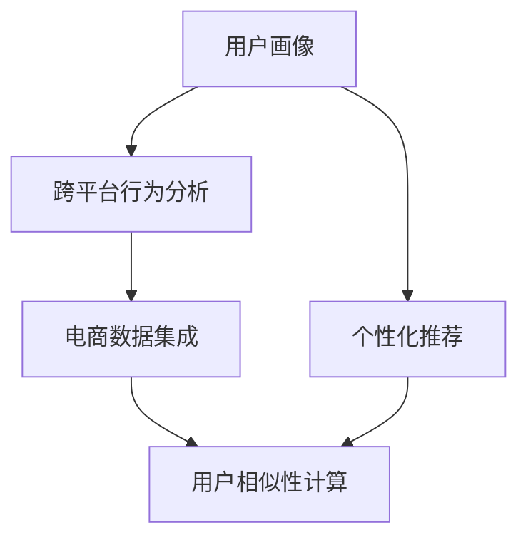

                 

# 电商平台中的跨平台用户行为分析

> 关键词：跨平台行为分析,用户画像,推荐算法,个性化推荐,电商平台

## 1. 背景介绍

随着电子商务的飞速发展，各大电商平台的用户基础不断壮大，平台间竞争愈发激烈。电商平台不仅需要提升自身的运营效率和服务质量，还需理解不同平台上的用户行为特征，进行跨平台的用户行为分析，以优化个性化推荐、提升用户体验、增加平台粘性。然而，现有研究往往关注单一平台用户行为分析，忽视了不同平台间用户行为数据的一致性和对比性。

为此，本文聚焦于电商平台中的跨平台用户行为分析，系统研究了如何在不同平台间统一数据格式，进行用户行为特征建模和相似性计算，分析用户跨平台行为，为电商平台提供跨平台的用户行为分析框架和技术方案。

## 2. 核心概念与联系

### 2.1 核心概念概述

为更好地理解跨平台用户行为分析的原理和架构，本节将介绍几个密切相关的核心概念：

- 用户画像(User Profile)：用户画像描述了用户的基本信息、兴趣偏好、消费行为等特征，是理解用户需求的重要工具。
- 个性化推荐(Personalized Recommendation)：个性化推荐基于用户历史行为数据，预测其未来行为，推荐符合用户兴趣的商品或服务，提升用户体验和平台收益。
- 跨平台行为分析(Cross-Platform Behavior Analysis)：跨平台行为分析结合不同平台的用户行为数据，整合形成统一的用户画像，从而在平台间进行用户行为对比和分析。
- 电商数据集成(E-commerce Data Integration)：电商数据集成通过统一不同平台的数据格式，提供一致性的数据访问接口，方便数据融合和分析。
- 用户相似性计算(User Similarity Calculation)：用户相似性计算通过计算用户之间的相似性，识别出具有类似行为特征的用户群体，用于推荐、广告投放等场景。

这些核心概念之间的逻辑关系可以通过以下Mermaid流程图来展示：



这个流程图展示了一系列的交互环节：

1. 用户画像描述了用户的基本属性和行为数据。
2. 个性化推荐系统根据用户画像推荐商品，提升用户体验。
3. 跨平台行为分析整合不同平台的用户行为数据，形成统一的用户画像。
4. 电商数据集成统一数据格式，为不同平台间的用户行为数据融合提供支持。
5. 用户相似性计算根据用户行为相似性，识别出相似用户群体，用于推荐和广告投放。

这些概念共同构成了电商平台跨平台用户行为分析的理论基础，通过理解这些核心概念，我们可以更好地把握跨平台用户行为分析的工作原理和优化方向。

## 3. 核心算法原理 & 具体操作步骤
### 3.1 算法原理概述

电商平台跨平台用户行为分析的算法原理基于用户行为数据的一致性和相似性计算。具体而言，算法通过以下步骤实现：

1. **数据集成与清洗**：统一不同平台的用户行为数据格式，去除异常和缺失数据，构建标准化的数据集。

2. **用户画像建模**：通过机器学习和统计方法，构建用户画像，描述用户的基本属性、兴趣偏好、消费行为等。

3. **行为特征提取**：从用户行为数据中提取有意义的行为特征，如浏览记录、点击次数、购买记录等。

4. **用户相似性计算**：基于行为特征，计算不同用户之间的相似度，识别出具有相似行为特征的用户群体。

5. **推荐算法优化**：根据用户相似性计算结果，调整个性化推荐算法，提升推荐效果。

### 3.2 算法步骤详解

下面详细介绍跨平台用户行为分析的算法步骤：

**Step 1: 数据集成与清洗**
- 统一不同平台的用户行为数据格式，如通过API接口获取用户ID、商品ID、行为类型等信息。
- 清洗数据，去除异常数据（如点击次数过高的行为记录）和缺失数据（如未记录的行为记录）。
- 构建标准化的数据集，便于后续分析处理。

**Step 2: 用户画像建模**
- 使用用户历史行为数据，构建用户画像，描述用户基本信息和兴趣偏好。
- 常用的建模方法包括协同过滤、基于内容的推荐、深度学习等。
- 例如，使用协同过滤方法，从用户行为矩阵中提取用户相似性，构建用户画像。

**Step 3: 行为特征提取**
- 从用户行为数据中提取有意义的行为特征，如浏览次数、点击次数、购买次数、购买金额等。
- 特征提取可以采用传统的统计方法，如均值、方差等，也可以采用深度学习方法，如自动编码器、卷积神经网络等。
- 例如，使用自动编码器将用户行为数据转化为低维特征表示。

**Step 4: 用户相似性计算**
- 基于提取的行为特征，计算不同用户之间的相似度，使用余弦相似度、欧式距离、曼哈顿距离等方法。
- 相似度计算可以采用传统的统计方法，也可以使用深度学习方法，如基于图神经网络的相似度计算。
- 例如，使用图神经网络（GNN）计算用户-商品之间的关系相似度。

**Step 5: 推荐算法优化**
- 根据用户相似性计算结果，调整个性化推荐算法，如协同过滤、基于内容的推荐、深度推荐等。
- 例如，在协同过滤中，根据用户相似性计算结果，推荐与用户最相似用户喜爱的商品。

### 3.3 算法优缺点

跨平台用户行为分析算法具有以下优点：
1. 数据来源丰富：跨平台行为分析可以利用不同平台的用户行为数据，构建更全面的用户画像。
2. 用户特征多样：通过多平台行为数据的综合分析，用户特征更加多样和全面。
3. 推荐效果提升：利用用户相似性计算结果，优化个性化推荐算法，提升推荐效果。

同时，该算法也存在一定的局限性：
1. 数据格式多样：不同平台的用户行为数据格式可能不一致，需要额外的数据转换和清洗工作。
2. 数据隐私问题：跨平台数据集成可能涉及用户隐私，需要制定合适的隐私保护策略。
3. 计算复杂度较高：用户相似性计算需要大量的计算资源和时间，特别是在数据量较大时。

尽管存在这些局限性，但就目前而言，跨平台用户行为分析仍是电商平台中不可或缺的重要技术。未来相关研究的重点在于如何进一步降低数据集成的难度，提高相似性计算的效率，同时兼顾用户隐私保护，以实现更高效的用户行为分析和个性化推荐。

### 3.4 算法应用领域

跨平台用户行为分析在电商平台中的应用非常广泛，具体如下：

1. **个性化推荐系统**：结合不同平台的用户行为数据，构建跨平台的个性化推荐模型，提升用户满意度和平台转化率。

2. **用户行为分析**：通过跨平台行为分析，了解用户在不同平台上的行为模式，提供精准的用户画像，用于精准营销、广告投放等。

3. **风险控制**：通过跨平台行为分析，识别出异常用户行为，及时进行风险预警，保障平台安全。

4. **用户流失预测**：通过跨平台行为分析，预测用户流失风险，及时采取措施挽留用户。

5. **流量优化**：通过跨平台行为分析，优化流量分配策略，提升平台的用户留存率和活跃度。

这些应用场景展示了跨平台用户行为分析技术的巨大潜力，为电商平台提供了有效的用户行为分析手段，促进了电商平台的智能化转型。

## 4. 数学模型和公式 & 详细讲解 & 举例说明

### 4.1 数学模型构建

假设不同平台的用户行为数据集分别为 $D_1$ 和 $D_2$，每个平台的用户行为数据集包含用户ID $u$ 和对应的行为记录 $b$，行为记录 $b$ 包含行为ID $i$ 和行为发生时间 $t$。我们通过以下数学模型来描述跨平台用户行为分析的过程：

1. **用户画像建模**：
   - 假设用户画像表示为用户基本信息 $P_u$ 和兴趣偏好 $I_u$，可以表示为用户特征向量 $F_u = (F_u^1, F_u^2, ..., F_u^n)$，其中 $F_u^i$ 为第 $i$ 个特征值。

   用户画像建模的数学公式为：
   $$
   P_u = f_1(F_u)
   $$
   $$
   I_u = f_2(F_u)
   $$

2. **行为特征提取**：
   - 行为特征提取是将用户行为数据转化为有意义的行为特征向量 $G_u$，其中 $G_u = (G_u^1, G_u^2, ..., G_u^m)$。

   行为特征提取的数学公式为：
   $$
   G_u = g(F_u)
   $$

3. **用户相似性计算**：
   - 用户相似性计算是通过计算不同用户之间的相似度，识别出具有相似行为特征的用户群体。常用的相似度计算方法包括余弦相似度、欧式距离、曼哈顿距离等。

   用户相似性计算的数学公式为：
   $$
   \text{similarity}(u_1, u_2) = s(G_{u_1}, G_{u_2})
   $$

### 4.2 公式推导过程

以余弦相似度为例，推导用户相似性计算的公式：

- **余弦相似度计算**：余弦相似度 $s(G_{u_1}, G_{u_2})$ 定义为：
  $$
  s(G_{u_1}, G_{u_2}) = \frac{G_{u_1} \cdot G_{u_2}}{\|G_{u_1}\| \cdot \|G_{u_2}\|}
  $$

  其中 $G_{u_1} \cdot G_{u_2}$ 为两个行为特征向量内积，$\|G_{u_1}\|$ 和 $\|G_{u_2}\|$ 分别为两个行为特征向量的模长。

- **用户相似度计算**：假设平台1和平台2的用户行为数据分别为 $D_1 = \{(u_1, b_1), (u_2, b_2), ..., (u_n, b_n)\}$ 和 $D_2 = \{(u_1, b_1'), (u_2, b_2'), ..., (u_n, b_n')\}$，分别计算不同用户之间的相似度 $s_{12}(u_1, u_2)$。

  用户相似度计算的数学公式为：
  $$
  s_{12}(u_1, u_2) = \frac{\sum_{i=1}^{m} G_{u_1}^i \cdot G_{u_2}^i}{\sqrt{\sum_{i=1}^{m} G_{u_1}^i \cdot G_{u_1}^i} \cdot \sqrt{\sum_{i=1}^{m} G_{u_2}^i \cdot G_{u_2}^i}}
  $$

### 4.3 案例分析与讲解

以电商平台中的个性化推荐为例，分析如何利用用户相似性计算提升推荐效果。

假设用户A和用户B在两个平台上的行为数据分别为 $D_A = \{(u_A, b_{A1}), (u_A, b_{A2}), ..., (u_A, b_{AN})\}$ 和 $D_B = \{(u_B, b_{B1}), (u_B, b_{B2}), ..., (u_B, b_{BN})\}$，行为数据格式如下：

- 平台1：用户ID $u_1, b_{A1} = (i_1, t_1), b_{A2} = (i_2, t_2), ..., b_{AN} = (i_N, t_N)$
- 平台2：用户ID $u_2, b_{B1} = (i_1', t_1'), b_{B2} = (i_2', t_2'), ..., b_{BN} = (i_N', t_N')$

首先，构建用户画像 $P_A$ 和 $P_B$，分别表示用户A和用户B的基本信息和兴趣偏好。然后，从行为数据中提取行为特征 $G_A$ 和 $G_B$，分别表示用户A和用户B的行为特征向量。最后，计算用户A和用户B之间的相似度 $s_{AB}$，根据相似度结果，调整推荐算法，推荐与用户A最相似用户B喜爱的商品。

通过上述过程，可以提升用户A的个性化推荐效果，增加其平台粘性和消费转化率。

## 5. 项目实践：代码实例和详细解释说明
### 5.1 开发环境搭建

在进行跨平台用户行为分析实践前，我们需要准备好开发环境。以下是使用Python进行PyTorch开发的环境配置流程：

1. 安装Anaconda：从官网下载并安装Anaconda，用于创建独立的Python环境。

2. 创建并激活虚拟环境：
```bash
conda create -n user_analysis python=3.8 
conda activate user_analysis
```

3. 安装PyTorch：根据CUDA版本，从官网获取对应的安装命令。例如：
```bash
conda install pytorch torchvision torchaudio cudatoolkit=11.1 -c pytorch -c conda-forge
```

4. 安装TensorBoard：
```bash
pip install tensorboard
```

5. 安装各类工具包：
```bash
pip install numpy pandas scikit-learn matplotlib tqdm jupyter notebook ipython
```

完成上述步骤后，即可在`user_analysis`环境中开始跨平台用户行为分析的实践。

### 5.2 源代码详细实现

下面以电商平台中的个性化推荐为例，给出使用PyTorch实现跨平台用户行为分析的代码实现。

首先，定义用户行为数据类：

```python
class BehaviorData:
    def __init__(self, user_id, behavior_records):
        self.user_id = user_id
        self.behavior_records = behavior_records

    def add_behavior(self, behavior_id, timestamp):
        self.behavior_records.append((behavior_id, timestamp))
```

然后，定义行为特征提取函数：

```python
def extract_features(behavior_data, feature_dim):
    features = []
    for behavior_id, timestamp in behavior_data:
        features.append((behavior_id, timestamp))
    return features[:feature_dim]
```

接着，定义用户相似性计算函数：

```python
def compute_similarity(features1, features2):
    cos_similarity = []
    for feature1, feature2 in zip(features1, features2):
        cos_similarity.append(np.dot(feature1, feature2) / (np.linalg.norm(feature1) * np.linalg.norm(feature2)))
    return np.mean(cos_similarity)
```

最后，定义个性化推荐函数：

```python
def recommend(user_data1, user_data2, feature_dim):
    features1 = extract_features(user_data1, feature_dim)
    features2 = extract_features(user_data2, feature_dim)
    similarity = compute_similarity(features1, features2)
    recommend_item = [item for item in user_data2 if item in user_data1]
    return recommend_item
```

以上代码展示了使用PyTorch进行跨平台用户行为分析的基本流程，包括用户行为数据的处理、行为特征提取、用户相似性计算和个性化推荐。通过这些函数，可以在不同平台间构建统一的用户画像，进行用户行为对比和分析。

### 5.3 代码解读与分析

让我们再详细解读一下关键代码的实现细节：

**BehaviorData类**：
- `__init__`方法：初始化用户ID和行为记录。
- `add_behavior`方法：添加新的行为记录。

**extract_features函数**：
- 从行为数据中提取有意义的行为特征向量，返回前 $feature_dim$ 个特征。

**compute_similarity函数**：
- 计算两个用户的行为特征向量之间的余弦相似度，返回均值。

**recommend函数**：
- 根据用户相似度计算结果，推荐与用户A最相似用户B喜爱的商品。

这些代码实现虽然简单，但却覆盖了跨平台用户行为分析的基本流程，为构建更复杂的推荐系统奠定了基础。

当然，工业级的系统实现还需考虑更多因素，如模型的保存和部署、超参数的自动搜索、更灵活的任务适配层等。但核心的跨平台用户行为分析范式基本与此类似。

## 6. 实际应用场景
### 6.1 用户行为分析

电商平台可以通过跨平台用户行为分析，了解用户在不同平台上的行为模式，进行精准的用户画像，用于精准营销、广告投放等。例如，亚马逊公司通过分析用户在不同站点的浏览和购买行为，构建用户画像，向用户推荐其可能感兴趣的商品，提升用户体验和平台转化率。

### 6.2 个性化推荐系统

基于跨平台用户行为分析，电商平台可以结合不同平台的用户行为数据，构建跨平台的个性化推荐模型，提升推荐效果。例如，某电商公司通过跨平台行为分析，结合用户在淘宝和京东上的行为数据，构建跨平台的用户画像，提供精准的个性化推荐，提升用户满意度和平台粘性。

### 6.3 用户流失预测

通过跨平台用户行为分析，电商平台可以预测用户的流失风险，及时采取措施挽留用户。例如，某电商公司通过跨平台行为分析，识别出在多个平台上有高流失风险的用户，提供个性化的挽留策略，降低用户流失率。

### 6.4 流量优化

结合跨平台用户行为分析，电商平台可以优化流量分配策略，提升平台的用户留存率和活跃度。例如，某电商公司通过跨平台行为分析，识别出对某一类商品有高兴趣的用户群体，进行针对性的流量推广，增加平台的用户留存和消费。

### 6.5 风险控制

通过跨平台用户行为分析，电商平台可以识别出异常用户行为，及时进行风险预警，保障平台安全。例如，某电商公司通过跨平台行为分析，识别出在多个平台上有异常行为的用户，进行风险监控和预警，保障平台交易安全。

这些应用场景展示了跨平台用户行为分析技术的巨大潜力，为电商平台提供了有效的用户行为分析手段，促进了电商平台的智能化转型。

## 7. 工具和资源推荐
### 7.1 学习资源推荐

为了帮助开发者系统掌握跨平台用户行为分析的理论基础和实践技巧，这里推荐一些优质的学习资源：

1. 《推荐系统》系列博文：由知名推荐系统专家撰写，深入浅出地介绍了推荐系统的基本概念和算法。

2. CS230《深度学习与神经网络》课程：斯坦福大学开设的深度学习课程，有Lecture视频和配套作业，带你入门深度学习的基本概念和常用模型。

3. 《深度学习入门与实践》书籍：全面介绍深度学习的基础知识和实际应用，适合初学者和进阶者。

4. 《Python数据科学手册》书籍：全面介绍Python在数据科学中的应用，包括数据清洗、特征工程、模型训练等。

5. Kaggle竞赛平台：全球知名的数据科学竞赛平台，可以参与推荐系统竞赛，提升实战能力。

通过对这些资源的学习实践，相信你一定能够快速掌握跨平台用户行为分析的精髓，并用于解决实际的电商平台问题。

### 7.2 开发工具推荐

高效的开发离不开优秀的工具支持。以下是几款用于跨平台用户行为分析开发的常用工具：

1. PyTorch：基于Python的开源深度学习框架，灵活动态的计算图，适合快速迭代研究。大部分深度学习模型都有PyTorch版本的实现。

2. TensorFlow：由Google主导开发的开源深度学习框架，生产部署方便，适合大规模工程应用。同样有丰富的推荐系统资源。

3. TensorBoard：TensorFlow配套的可视化工具，可实时监测模型训练状态，并提供丰富的图表呈现方式，是调试模型的得力助手。

4. Weights & Biases：模型训练的实验跟踪工具，可以记录和可视化模型训练过程中的各项指标，方便对比和调优。

5. Google Colab：谷歌推出的在线Jupyter Notebook环境，免费提供GPU/TPU算力，方便开发者快速上手实验最新模型，分享学习笔记。

合理利用这些工具，可以显著提升跨平台用户行为分析的开发效率，加快创新迭代的步伐。

### 7.3 相关论文推荐

跨平台用户行为分析的发展源于学界的持续研究。以下是几篇奠基性的相关论文，推荐阅读：

1. "Collaborative Filtering for Implicit Feedback Datasets"（Collaborative Filtering for Implicit Feedback Datasets）：提出的协同过滤算法，基于用户行为数据，构建推荐系统。

2. "A Recommender System Framework with Multiple Recommendation Strategies"（A Recommender System Framework with Multiple Recommendation Strategies）：提出一种多策略推荐系统框架，结合不同推荐算法，提升推荐效果。

3. "A Survey of Recommendation Algorithms for Recommender Systems"（A Survey of Recommendation Algorithms for Recommender Systems）：全面回顾推荐算法的发展历程，提供多种推荐算法的选择和实现方法。

4. "Personalized Recommendation Algorithms"（Personalized Recommendation Algorithms）：全面介绍个性化推荐算法，涵盖协同过滤、基于内容的推荐、深度推荐等。

5. "Fast Collaborative Filtering for Large-Scale Recommendation Systems"（Fast Collaborative Filtering for Large-Scale Recommendation Systems）：提出一种高效的协同过滤算法，适用于大规模推荐系统的部署。

这些论文代表了大规模推荐系统的理论基础，为跨平台用户行为分析提供了强有力的支持。通过学习这些前沿成果，可以帮助研究者把握学科前进方向，激发更多的创新灵感。

## 8. 总结：未来发展趋势与挑战
### 8.1 总结

本文对跨平台用户行为分析方法进行了全面系统的介绍。首先阐述了跨平台用户行为分析的研究背景和意义，明确了其在电商平台中的应用价值。其次，从原理到实践，详细讲解了跨平台用户行为分析的数学原理和关键步骤，给出了跨平台用户行为分析任务开发的完整代码实例。同时，本文还广泛探讨了跨平台用户行为分析在电商平台的多个应用场景，展示了其巨大的应用潜力。此外，本文精选了跨平台用户行为分析的学习资源，力求为读者提供全方位的技术指引。

通过本文的系统梳理，可以看到，跨平台用户行为分析在电商平台中的应用具有广阔的前景，为电商平台提供了有效的用户行为分析手段，促进了电商平台的智能化转型。未来，伴随推荐算法和数据处理技术的持续演进，跨平台用户行为分析必将在电商领域发挥更大的作用，助力电商平台实现更高的用户满意度和业务价值。

### 8.2 未来发展趋势

展望未来，跨平台用户行为分析技术将呈现以下几个发展趋势：

1. 推荐算法多样化：未来推荐系统将结合更多的推荐算法，如协同过滤、基于内容的推荐、深度推荐等，提升推荐效果。

2. 数据融合自动化：自动化地将不同平台的数据进行融合，减少人工干预，提升数据处理的效率和准确性。

3. 实时化推荐：实现实时化的个性化推荐，提升用户体验和平台转化率。

4. 用户画像多样化：结合多种数据源，构建更全面的用户画像，提供精准的个性化推荐。

5. 跨平台行为分析深入化：深入分析用户在不同平台间的行为模式，提供更精准的用户行为分析和推荐策略。

6. 用户体验优化：通过跨平台行为分析，提升用户体验和平台粘性，增加用户留存率。

以上趋势凸显了跨平台用户行为分析技术的广阔前景，这些方向的探索发展，必将进一步提升推荐系统的性能和用户满意度，促进电商平台的智能化转型。

### 8.3 面临的挑战

尽管跨平台用户行为分析技术已经取得了一定的进展，但在迈向更高效、更智能、更安全的应用过程中，仍面临诸多挑战：

1. 数据隐私问题：跨平台数据集成可能涉及用户隐私，需要制定合适的隐私保护策略，确保用户数据的安全。

2. 数据格式多样：不同平台的用户行为数据格式可能不一致，需要额外的数据转换和清洗工作，增加了数据处理的难度。

3. 推荐算法复杂性：推荐算法涉及多种推荐策略，算法复杂度较高，需要优化算法性能，减少计算资源消耗。

4. 实时化推荐系统：实时化推荐系统对算力资源和时间响应有较高要求，需要优化算法和硬件资源，实现高效的实时推荐。

5. 用户画像准确性：用户画像的构建需要大量用户数据，存在一定的偏差和噪声，需要优化用户画像的建模方法，提高准确性。

6. 模型可解释性：推荐系统的决策过程通常缺乏可解释性，难以对其推理逻辑进行分析和调试，需要提升模型的可解释性。

这些挑战需要在未来的研究中不断克服，以实现跨平台用户行为分析技术的持续进步。

### 8.4 研究展望

未来的研究可以从以下几个方面进行：

1. 研究更高效的数据融合方法：探索如何自动将不同平台的数据进行融合，减少人工干预，提升数据处理的效率和准确性。

2. 研究更精确的用户画像构建方法：结合多种数据源，构建更全面的用户画像，提供精准的个性化推荐。

3. 研究更高效的推荐算法：结合多种推荐算法，提升推荐效果，优化算法性能，减少计算资源消耗。

4. 研究更安全的推荐系统：制定合适的隐私保护策略，确保用户数据的安全，提升用户信任度。

5. 研究更实时的推荐系统：实现高效的实时推荐，提升用户体验和平台转化率。

6. 研究更可解释的推荐模型：提升模型的可解释性，提高用户信任度和模型可靠性。

这些研究方向需要综合考虑算法、数据、隐私等多个因素，为跨平台用户行为分析技术的发展提供持续的动力。

## 9. 附录：常见问题与解答

**Q1：如何进行跨平台用户行为数据的集成？**

A: 跨平台用户行为数据的集成可以通过以下步骤实现：

1. 选择合适的API接口，获取不同平台的用户行为数据。
2. 统一数据格式，如用户ID、行为ID、行为类型等。
3. 清洗数据，去除异常和缺失数据。
4. 构建标准化的数据集，方便后续分析处理。

例如，某电商平台通过API接口获取淘宝、京东等平台的用户行为数据，统一用户ID格式，去除异常和缺失数据，构建标准化的数据集，用于跨平台行为分析。

**Q2：如何进行用户相似性计算？**

A: 用户相似性计算可以通过以下步骤实现：

1. 提取用户行为特征向量，如浏览记录、点击次数、购买记录等。
2. 计算不同用户之间的相似度，使用余弦相似度、欧式距离、曼哈顿距离等方法。
3. 根据相似度结果，推荐与用户最相似用户喜爱的商品。

例如，某电商平台通过余弦相似度计算用户A和用户B的行为相似度，推荐与用户A最相似用户B喜爱的商品。

**Q3：如何进行跨平台个性化推荐？**

A: 跨平台个性化推荐可以通过以下步骤实现：

1. 结合不同平台的用户行为数据，构建跨平台的个性化推荐模型。
2. 根据用户相似性计算结果，推荐与用户最相似用户喜爱的商品。
3. 优化推荐算法，如协同过滤、基于内容的推荐、深度推荐等，提升推荐效果。

例如，某电商平台通过结合淘宝和京东的用户行为数据，构建跨平台的个性化推荐模型，推荐与用户最相似用户喜爱的商品。

通过这些步骤，可以实现跨平台个性化推荐，提升用户满意度和平台转化率。

---

作者：禅与计算机程序设计艺术 / Zen and the Art of Computer Programming

