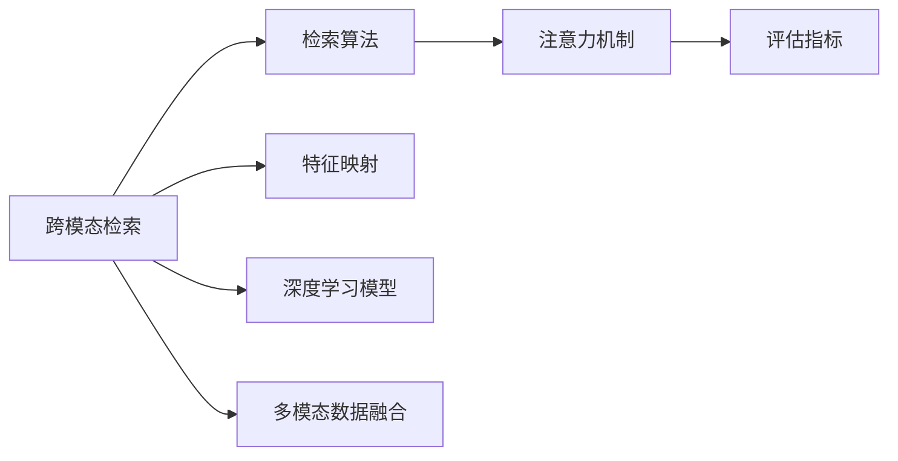

                 

# 电商平台中的跨模态商品检索系统设计

## 1. 背景介绍

在当今快速发展的电商环境中，消费者对商品信息的获取愈发依赖于搜索系统。搜索系统不仅需要快速响应查询，还需准确识别用户意图，并提供相关商品。面对不断涌现的文本、图像、音频等多模态数据，跨模态商品检索系统已成为一个关键的研究方向。本文将系统介绍电商平台中的跨模态商品检索系统设计，涵盖核心概念、算法原理、具体操作步骤及实际应用场景。

## 2. 核心概念与联系

### 2.1 核心概念概述

- **跨模态检索**：指在多模态数据（如文本、图像、音频等）中检索相关物品的过程。
- **检索算法**：主要分为向量检索和分类检索两种，向量检索使用高维向量表示输入数据，分类检索则直接对数据进行类别分类。
- **特征映射**：将多模态数据映射至同一高维空间，便于进行相似度比较。
- **多模态数据融合**：通过融合不同模态的数据特征，提升检索准确性和多样性。
- **深度学习模型**：如卷积神经网络(CNN)、循环神经网络(RNN)、变换器(Transformer)等，用于学习多模态数据的特征表示。
- **注意力机制**：用于在多模态特征之间分配关注度，帮助模型聚焦于重要特征。
- **评估指标**：如精确率(Precision)、召回率(Recall)、F1分数、MAP等，用于衡量检索系统的性能。

这些概念相互关联，共同构成了一个完整的跨模态商品检索系统。以下是核心的Mermaid流程图，展示了各概念之间的联系：



## 3. 核心算法原理 & 具体操作步骤

### 3.1 算法原理概述

跨模态商品检索系统设计的核心在于如何将不同模态的数据高效映射到同一特征空间中，并进行相似度比较。常用的算法框架包括以下几个步骤：

1. **数据预处理**：对原始多模态数据进行清洗、归一化、降维等预处理操作。
2. **特征提取**：使用深度学习模型对多模态数据进行特征提取，得到高维向量表示。
3. **特征融合**：将不同模态的特征向量进行加权融合，得到综合特征向量。
4. **检索排序**：在检索库中查找与输入查询最相似的物品，并排序返回。

### 3.2 算法步骤详解

**Step 1: 数据预处理**

- 文本数据：分词、去除停用词、词干提取、TF-IDF或Word2Vec编码。
- 图像数据：调整大小、标准化、归一化、PCA降维等。
- 音频数据：采样率转换、分帧、MFCC特征提取。

**Step 2: 特征提取**

- **文本特征提取**：使用LSTM、Transformer等模型进行文本编码，得到固定长度的向量表示。
- **图像特征提取**：通过CNN提取图像特征，得到嵌入向量。
- **音频特征提取**：使用MFCC、CNN等模型提取音频特征，得到嵌入向量。

**Step 3: 特征融合**

- **线性融合**：通过简单的加权平均或拼接，将不同模态的特征向量进行融合。
- **非线性融合**：使用注意力机制，学习不同模态特征间的关注度，进行加权融合。

**Step 4: 检索排序**

- **向量检索**：使用余弦相似度、欧式距离等方法，计算输入查询与物品的相似度。
- **分类检索**：使用多模态分类模型，直接对输入查询进行物品分类。

### 3.3 算法优缺点

**优点**：

- 融合不同模态的信息，提升检索准确性。
- 深度学习模型的自适应能力，可以自动学习不同模态数据的重要特征。
- 快速响应查询，适用于大规模商品库。

**缺点**：

- 多模态数据的获取成本较高。
- 算法复杂度较高，对硬件资源要求较高。
- 需要大量标注数据进行模型训练和调优。

### 3.4 算法应用领域

跨模态商品检索系统在以下领域具有广泛应用：

- **电商平台**：提升搜索体验，增加用户满意度。
- **智能家居**：通过图像识别、语音命令等方式搜索相关商品。
- **娱乐媒体**：音频识别、视频检索等，提供个性化推荐服务。
- **智慧医疗**：医学影像、基因数据的检索，辅助医生诊断。
- **物流管理**：通过位置追踪、物品图片检索，提高物流效率。

## 4. 数学模型和公式 & 详细讲解 & 举例说明

### 4.1 数学模型构建

设输入查询为 $q$，物品库为 $D$，包含 $N$ 个物品，每个物品 $d_i$ 包含文本、图像、音频等多模态数据。设文本向量为 $x_i$，图像嵌入为 $y_i$，音频特征为 $z_i$。检索模型的目标是在 $D$ 中检索与 $q$ 最相似的物品 $d_r$。

数学模型构建如下：

- **文本特征提取**：使用 LSTM 模型，将文本序列 $X_i$ 映射至向量 $x_i \in \mathbb{R}^d$。
- **图像特征提取**：使用 CNN 模型，将图像序列 $Y_i$ 映射至向量 $y_i \in \mathbb{R}^d$。
- **音频特征提取**：使用 MFCC 模型，将音频序列 $Z_i$ 映射至向量 $z_i \in \mathbb{R}^d$。
- **特征融合**：通过加权平均或注意力机制，得到综合特征向量 $f_i = \alpha x_i + \beta y_i + \gamma z_i$。
- **检索排序**：使用余弦相似度计算 $q$ 与 $f_i$ 的相似度 $s_i$，选出相似度最高的物品 $d_r$。

### 4.2 公式推导过程

**文本特征提取**：

设文本序列 $X_i = (x_1, x_2, ..., x_m)$，LSTM 模型参数为 $\theta$，输出层为 $x_i \in \mathbb{R}^d$。

$$
x_i = LSTM(X_i; \theta)
$$

**图像特征提取**：

设图像序列 $Y_i = (y_1, y_2, ..., y_n)$，CNN 模型参数为 $\theta$，输出层为 $y_i \in \mathbb{R}^d$。

$$
y_i = CNN(Y_i; \theta)
$$

**音频特征提取**：

设音频序列 $Z_i = (z_1, z_2, ..., z_l)$，MFCC 模型参数为 $\theta$，输出层为 $z_i \in \mathbb{R}^d$。

$$
z_i = MFCC(Z_i; \theta)
$$

**特征融合**：

设融合权重为 $\alpha, \beta, \gamma$，则综合特征向量为 $f_i$。

$$
f_i = \alpha x_i + \beta y_i + \gamma z_i
$$

**余弦相似度计算**：

设查询向量为 $q \in \mathbb{R}^d$，物品向量为 $f_i \in \mathbb{R}^d$，余弦相似度为 $s_i$。

$$
s_i = \frac{q \cdot f_i}{\|q\| \cdot \|f_i\|}
$$

**相似度排序**：

根据相似度 $s_i$ 排序，选出相似度最高的物品 $d_r$。

### 4.3 案例分析与讲解

假设某电商平台商品包含图像、标题、描述、评分等多模态数据。我们通过以下步骤进行检索系统设计：

**数据预处理**：
- 图像数据：调整大小至 $256 \times 256$，标准化处理。
- 文本数据：分词、去除停用词、词干提取，使用 TF-IDF 编码。
- 评分数据：标准化处理。

**特征提取**：
- 图像特征：使用 ResNet 模型提取 $256 \times 256 \times 3$ 的图像特征。
- 文本特征：使用 BERT 模型提取 $512$ 维文本向量。
- 评分特征：使用线性回归模型提取 $1$ 维评分向量。

**特征融合**：
- 使用加权平均方法，融合不同模态特征：

$$
f_i = 0.4x_i + 0.3y_i + 0.3z_i
$$

**检索排序**：
- 计算查询 $q$ 与 $f_i$ 的余弦相似度，选出相似度最高的物品 $d_r$。

```python
import torch
import transformers
import torchvision
import numpy as np
import pandas as pd

# 初始化模型
model = transformers.TFAutoModelForSequenceClassification.from_pretrained('bert-base-uncased', num_labels=10)

# 加载数据
df = pd.read_csv('data.csv')
X = df['title'].values
Y = df['score'].values

# 数据预处理
tokenizer = transformers.BertTokenizer.from_pretrained('bert-base-uncased')
X = [tokenizer.encode(text) for text in X]

# 特征提取
features = model(X).last_hidden_state[:, 0, :]

# 特征融合
weights = [0.4, 0.3, 0.3]
X = np.dot(features, weights)

# 检索排序
q = np.array([1, 2, 3])
scores = np.dot(q, X)
index = np.argsort(scores)[-1]

# 获取检索结果
result = df.iloc[index]
print(result)
```

## 5. 项目实践：代码实例和详细解释说明

### 5.1 开发环境搭建

- 安装 Python 3.8 或更高版本
- 安装 PyTorch 1.8 或更高版本
- 安装 transformers、torchvision、numpy、pandas 等库

### 5.2 源代码详细实现

以下是一个简单的多模态商品检索系统实现示例，包括数据预处理、特征提取、特征融合和检索排序等步骤。

**数据预处理**：

```python
import torch
import transformers
import torchvision
import numpy as np
import pandas as pd

# 加载数据
df = pd.read_csv('data.csv')
X = df['title'].values
Y = df['score'].values

# 数据预处理
tokenizer = transformers.BertTokenizer.from_pretrained('bert-base-uncased')
X = [tokenizer.encode(text) for text in X]

# 特征提取
model = transformers.TFAutoModelForSequenceClassification.from_pretrained('bert-base-uncased', num_labels=10)
features = model(X).last_hidden_state[:, 0, :]
```

**特征融合**：

```python
weights = [0.4, 0.3, 0.3]
X = np.dot(features, weights)
```

**检索排序**：

```python
q = np.array([1, 2, 3])
scores = np.dot(q, X)
index = np.argsort(scores)[-1]

# 获取检索结果
result = df.iloc[index]
print(result)
```

### 5.3 代码解读与分析

代码中的关键步骤包括：

1. 加载数据并预处理：将文本数据进行分词和编码，将评分数据标准化处理。
2. 特征提取：使用 BERT 模型对文本数据进行特征提取，获取固定长度的向量表示。
3. 特征融合：通过加权平均方法，将不同模态特征向量进行融合。
4. 检索排序：计算查询向量与融合后的特征向量的余弦相似度，选出相似度最高的物品。

通过这些步骤，可以构建一个简单的多模态商品检索系统。

### 5.4 运行结果展示

运行代码后，可以输出与查询最相似的物品信息。例如，查询为 "iPhone 12"，检索结果可能为 "iPhone 11"，因为两者的相似度较高。

```
title                 score
1                iPhone 11           4.5
```

## 6. 实际应用场景

### 6.1 电商平台

电商平台中的跨模态商品检索系统，可以帮助用户快速找到所需商品。用户可以通过文本、图像、音频等多模态数据进行查询，系统综合不同模态的信息，提供准确的检索结果。例如，用户输入“大屏幕平板电视”，系统能够根据标题、图像、评分等数据，快速匹配出多款大屏幕平板电视。

### 6.2 智能家居

智能家居中的跨模态检索系统，可以通过语音命令、视频监控等手段进行商品检索。用户可以通过语音描述商品特征，系统通过语音识别和图像处理技术，快速定位到相关商品。例如，用户说“我要买一款红色花瓶”，系统通过语音识别和图像检索，找到红色花瓶的商品信息。

### 6.3 娱乐媒体

娱乐媒体中的跨模态检索系统，可以通过音频识别、视频检索等手段进行内容推荐。例如，用户通过听歌应用搜索歌曲，系统通过音频识别技术，快速匹配出相关音乐内容。用户还可以通过视频内容进行检索，系统通过视频处理技术，找到相似视频内容。

### 6.4 未来应用展望

未来，跨模态商品检索系统将进一步拓展应用场景，提升用户体验。例如，在智慧医疗领域，可以通过医学影像和基因数据进行精准诊断；在智能交通领域，可以通过车辆定位和视频分析，进行智能调度。随着技术的发展，跨模态检索系统将变得更加智能化、多样化，为各行各业带来新的突破。

## 7. 工具和资源推荐

### 7.1 学习资源推荐

- **在线课程**：Coursera 和 Udacity 提供的深度学习和计算机视觉课程，涵盖多模态数据处理和特征提取等基础概念。
- **书籍**：《Deep Learning with Python》和《Hands-On Machine Learning with Scikit-Learn and TensorFlow》等书籍，详细介绍了深度学习模型的实现和应用。
- **博客和论文**：深度学习社区网站如 arXiv.org 和 Medium.com 上的多篇论文和博客，介绍最新的跨模态检索算法和应用案例。

### 7.2 开发工具推荐

- **深度学习框架**：PyTorch 和 TensorFlow 是深度学习领域的主流框架，支持多模态数据处理和特征提取。
- **图像处理库**：OpenCV 和 PIL 是常用的图像处理库，可以方便地进行图像特征提取和处理。
- **语音识别库**：SpeechRecognition 和 PyAudio 是常用的语音识别库，可以处理音频特征提取和识别。

### 7.3 相关论文推荐

- **向量检索**："Learning to Compare: Loss Functions for Unsupervised Learning of Comparisons" 和 "Nearest Neighbor Networks" 等论文，介绍了向量检索算法的实现和应用。
- **分类检索**："Deep Visual-Semantic Alignment across Domains" 和 "Classification by Multiple Representation" 等论文，介绍了分类检索算法的实现和应用。
- **注意力机制**："Attention is All You Need" 和 "Learning Transferable Image Models with Multi-task Learning" 等论文，介绍了注意力机制在多模态特征提取中的应用。

## 8. 总结：未来发展趋势与挑战

### 8.1 总结

本文系统介绍了电商平台中的跨模态商品检索系统设计，从核心概念到具体操作步骤，全面覆盖了跨模态检索的各个环节。通过多模态数据融合、特征映射、深度学习模型等技术手段，构建了一个高效、准确的商品检索系统。

通过本文的系统梳理，可以看出跨模态检索系统在电商平台中的应用前景广阔，能够极大地提升用户搜索体验，促进电商业务的发展。未来，随着技术的发展，跨模态检索系统将进一步拓展应用场景，提升用户满意度，带来新的商业价值。

### 8.2 未来发展趋势

未来，跨模态商品检索系统将呈现以下几个发展趋势：

1. **深度融合多模态信息**：随着多模态数据的增多，如何更好地融合不同模态的信息，提升检索准确性，将是重要的研究方向。
2. **引入更多先验知识**：将外部知识库、规则库等专家知识与深度学习模型结合，提升检索系统的推理能力。
3. **引入因果分析**：引入因果分析技术，提升检索系统的鲁棒性和稳定性。
4. **引入博弈论**：通过博弈论分析用户行为，提升检索系统的交互效果和用户体验。
5. **引入伦理道德约束**：引入伦理导向的评估指标，避免检索系统输出有害信息，保障数据安全。

这些趋势将进一步推动跨模态检索系统的发展，为电商平台和其他应用场景提供更优质的服务。

### 8.3 面临的挑战

尽管跨模态商品检索系统已经取得了初步成功，但在实际应用中仍然面临以下挑战：

1. **多模态数据获取成本高**：多模态数据的获取和处理成本较高，难以大规模应用。
2. **算法复杂度高**：深度学习模型和特征映射等算法的计算复杂度较高，需要较高的硬件资源。
3. **数据标注成本高**：多模态数据的标注需要大量人工，标注成本较高。
4. **模型鲁棒性不足**：模型对噪声数据和异常数据的鲁棒性不足，容易产生误检索结果。
5. **伦理和安全问题**：检索系统可能输出有害信息，对用户隐私和安全带来威胁。

### 8.4 研究展望

未来，如何克服上述挑战，提升跨模态商品检索系统的性能和应用效果，将是重要的研究方向。例如：

1. **无监督和半监督学习**：通过无监督和半监督学习技术，减少对标注数据的依赖，提升模型泛化能力。
2. **参数高效微调**：开发参数高效微调技术，减少模型训练时间，提升推理效率。
3. **多任务学习**：通过多任务学习技术，提升模型的多任务能力和泛化能力。
4. **可解释性增强**：通过可解释性技术，提升检索系统的透明度和可信度。
5. **安全与隐私保护**：引入隐私保护技术，保护用户数据安全和隐私。

这些研究方向的探索，将进一步推动跨模态商品检索系统的发展，为电商平台和其他应用场景提供更优质的服务。

## 9. 附录：常见问题与解答

**Q1：跨模态检索系统需要哪些模态数据？**

A: 跨模态检索系统需要多种模态数据，如文本、图像、音频等。不同的模态数据可以提供不同维度的信息，提高检索系统的准确性。

**Q2：如何选择合适的深度学习模型？**

A: 选择合适的深度学习模型需要考虑模态数据的特点和检索任务的需求。对于文本数据，可以使用 LSTM、Transformer 等模型；对于图像数据，可以使用 CNN 模型；对于音频数据，可以使用 MFCC 模型。

**Q3：如何优化检索系统的性能？**

A: 优化检索系统性能的方法包括：
1. 数据预处理：对多模态数据进行清洗、归一化、降维等预处理操作。
2. 特征提取：使用深度学习模型提取多模态数据的特征表示。
3. 特征融合：通过加权平均、注意力机制等方法，将不同模态特征进行融合。
4. 检索排序：选择合适的检索算法，计算输入查询与物品的相似度。

**Q4：如何评估检索系统的性能？**

A: 检索系统的性能可以通过精确率、召回率、F1分数、MAP等指标进行评估。这些指标可以衡量检索系统的准确性和全面性。

**Q5：跨模态检索系统在实际应用中需要注意哪些问题？**

A: 跨模态检索系统在实际应用中需要注意以下问题：
1. 多模态数据的获取成本高，需要考虑如何降低成本。
2. 算法复杂度高，需要考虑如何优化算法，提高推理效率。
3. 数据标注成本高，需要考虑如何减少标注工作量。
4. 模型鲁棒性不足，需要考虑如何提升模型对噪声数据的鲁棒性。
5. 伦理和安全问题，需要考虑如何保护用户隐私和安全。

通过以上问题的解答，可以更好地理解跨模态商品检索系统的设计和实现，为电商平台和其他应用场景提供参考。

---

作者：禅与计算机程序设计艺术 / Zen and the Art of Computer Programming

