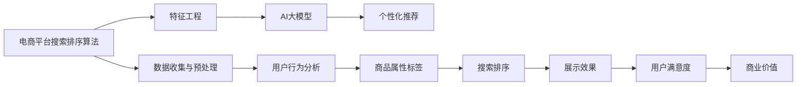

                 

# 电商平台如何利用AI大模型优化搜索排序算法

## 1. 背景介绍

在现代电商平台上，搜索排序算法扮演着至关重要的角色。搜索排序不仅要为用户提供快速、准确、相关的搜索结果，还要平衡展示效果、用户满意度、商业价值等目标。然而，随着商品数量和用户行为的多样化，传统基于规则的搜索排序算法逐渐显示出其局限性。近年来，基于AI大模型的技术逐渐应用于电商平台，通过深度学习和大规模预训练模型，搜索排序算法在性能和效果上取得了显著提升。本文将详细介绍如何利用AI大模型优化电商平台的搜索排序算法。

## 2. 核心概念与联系

### 2.1 核心概念概述

为更好地理解基于AI大模型的搜索排序算法，本节将介绍几个关键概念：

- 电商平台搜索排序算法：指用于处理用户查询，并根据商品相关性、商品属性、用户行为等因素，生成排序结果的系统。

- AI大模型：指通过在大规模数据上进行预训练，学习到复杂语言表示的深度神经网络模型。如BERT、GPT等。

- 推荐系统：指根据用户历史行为和偏好，推荐用户可能感兴趣的商品的系统。推荐系统可以与搜索排序算法相结合，提升用户体验和商品曝光率。

- 特征工程：指通过构建和选择特征，提升模型输入数据的代表性，从而提高模型预测准确性的过程。

- 跨领域迁移学习：指将一个领域学习到的知识，迁移应用到另一个相关领域的学习范式。在大模型微调中，跨领域迁移学习可以显著提升模型在特定任务上的性能。

这些概念之间存在着紧密的联系，共同构成了电商平台搜索排序算法的技术框架。具体来说，电商平台搜索排序算法通过收集和构建用户行为数据、商品属性数据，利用AI大模型进行特征学习，再结合推荐系统进行个性化推荐，从而生成高效、准确的搜索结果。

### 2.2 核心概念原理和架构的 Mermaid 流程图



此流程图展示了电商搜索排序算法的主要组成和数据流向。首先，数据从数据收集和预处理阶段开始，经过特征工程后输入AI大模型，大模型通过预训练和微调学习商品特征和用户行为表示。这些表示被用于个性化推荐系统，进一步提升搜索结果的相关性和用户满意度。最终，优化后的搜索排序算法提升展示效果和商业价值，形成了完整的电商平台搜索排序系统。

## 3. 核心算法原理 & 具体操作步骤

### 3.1 算法原理概述

基于AI大模型的搜索排序算法，本质上是一种深度学习的应用。其核心思想是通过预训练语言模型，学习商品描述、用户行为和搜索历史之间的关系，从而优化搜索排序效果。具体来说，算法分为以下几个关键步骤：

1. **数据收集与预处理**：收集用户查询记录、点击行为、浏览历史等数据，并进行清洗和标准化。
2. **特征工程**：根据用户行为和商品属性，构建并选择合适的特征，提升模型输入的代表性和预测能力。
3. **预训练与微调**：使用大规模无标签文本数据对AI大模型进行预训练，再利用标注数据进行微调，使模型学习到用户偏好和商品相关性。
4. **搜索排序**：将预训练和微调后的模型作为特征提取器，结合用户行为数据和商品特征，生成排序结果。

### 3.2 算法步骤详解

以下详细介绍基于AI大模型的搜索排序算法具体实施步骤：

#### 3.2.1 数据收集与预处理

1. **用户行为数据**：收集用户搜索、点击、浏览、购物车操作、评价等信息。
2. **商品属性数据**：收集商品名称、描述、分类、价格、评分等属性信息。
3. **数据清洗**：去除重复数据、缺失值、异常值，确保数据质量和一致性。
4. **标准化**：对数据进行归一化、编码等预处理，便于后续的模型训练。

#### 3.2.2 特征工程

1. **用户行为特征**：提取用户搜索历史、点击行为、浏览轨迹等特征。
2. **商品属性特征**：提取商品名称、价格、品牌、评分等特征。
3. **联合特征**：将用户行为特征和商品属性特征进行组合，如商品-用户二元特征、时间窗口特征等。
4. **高维特征降维**：使用PCA、LDA等方法对高维特征进行降维，提升模型训练效率。

#### 3.2.3 预训练与微调

1. **选择模型**：选择适合的AI大模型，如BERT、GPT等。
2. **预训练**：在大规模无标签文本数据上进行预训练，学习语言的通用表示。
3. **微调**：利用标注数据对预训练模型进行微调，学习特定领域的语言表示。
4. **评估**：在验证集上评估模型性能，调整超参数和模型结构。

#### 3.2.4 搜索排序

1. **输入**：将用户查询和商品特征输入预训练和微调后的模型。
2. **特征提取**：模型提取输入特征，生成商品表示和用户表示。
3. **相似度计算**：计算商品表示和用户表示之间的相似度，排序生成搜索结果。
4. **展示效果优化**：根据展示效果和商业价值，调整排序结果，提升用户体验和转化率。

### 3.3 算法优缺点

#### 3.3.1 算法优点

1. **高效性**：AI大模型具有强大的特征学习和表达能力，可以高效地处理大规模数据，优化搜索排序效果。
2. **可解释性**：基于深度学习的模型具有较强的解释性，可以通过特征重要性分析，理解模型决策过程。
3. **灵活性**：AI大模型可以不断更新和微调，适应数据和用户行为的动态变化。
4. **鲁棒性**：大模型在多种数据分布和特征组合下具有较好的泛化能力，提升搜索排序的稳定性和鲁棒性。

#### 3.3.2 算法缺点

1. **计算资源需求高**：大规模预训练和微调需要大量的计算资源和时间，如GPU、TPU等高性能设备。
2. **数据依赖性强**：模型的性能很大程度上取决于数据的质量和多样性，需要收集和清洗大量高价值的标注数据。
3. **模型复杂度高**：深度学习模型结构复杂，模型训练和优化过程容易陷入局部最优。
4. **过拟合风险**：在标注数据较少的情况下，深度模型容易发生过拟合，降低泛化能力。

### 3.4 算法应用领域

基于AI大模型的搜索排序算法在多个电商平台上得到了广泛应用，涵盖了以下领域：

1. **商品推荐**：根据用户行为和商品属性，生成个性化商品推荐列表，提升用户满意度和转化率。
2. **搜索结果排序**：优化搜索结果排序，提升用户查询的准确性和相关性。
3. **广告投放优化**：通过分析用户行为数据，优化广告投放策略，提升广告效果和转化率。
4. **智能客服**：利用自然语言处理技术，构建智能客服系统，解答用户疑问，提升用户服务体验。
5. **用户画像生成**：结合用户行为数据和商品属性，生成用户画像，进行精准营销。

## 4. 数学模型和公式 & 详细讲解 & 举例说明

### 4.1 数学模型构建

基于AI大模型的搜索排序算法，主要涉及以下几个数学模型：

1. **用户行为表示模型**：利用用户行为数据，通过深度学习模型生成用户表示。
2. **商品属性表示模型**：利用商品属性数据，通过深度学习模型生成商品表示。
3. **相似度计算模型**：基于用户表示和商品表示，计算相似度，排序生成搜索结果。
4. **展示效果优化模型**：根据展示效果和商业价值，调整排序结果，优化用户满意度。

#### 4.2 公式推导过程

以用户行为表示模型的构建为例，推导用户表示的计算公式。

假设用户行为数据为 $\{x_i\}_{i=1}^N$，每个行为 $x_i$ 包含多项特征 $f_1(x_i), f_2(x_i), ..., f_m(x_i)$。利用深度学习模型 $M_{\theta}$ 对行为数据进行表示，生成用户表示 $U_i = M_{\theta}(x_i)$。

具体来说，模型 $M_{\theta}$ 通常为神经网络模型，如卷积神经网络、递归神经网络等。其前向传播过程为：

$$
U_i = M_{\theta}(x_i) = \sum_{k=1}^K w_kf_k(x_i) + b_k
$$

其中 $w_k$ 和 $b_k$ 为模型参数，$f_k(x_i)$ 为第 $k$ 个特征函数。

#### 4.3 案例分析与讲解

以商品推荐为例，分析如何利用AI大模型优化商品推荐。

1. **数据收集**：收集用户历史行为数据 $D=\{(x_i,y_i)\}_{i=1}^N$，其中 $x_i$ 为行为数据，$y_i$ 为推荐结果。
2. **特征选择**：选择用户行为特征 $x_i$ 和商品属性特征 $z_j$，如用户搜索历史、点击行为、商品名称、价格等。
3. **预训练模型**：选择预训练模型 $M_{\theta}$，如BERT，在大规模无标签文本数据上进行预训练。
4. **微调模型**：利用标注数据对预训练模型进行微调，学习用户行为表示和商品属性表示。
5. **推荐计算**：利用微调后的模型生成用户表示 $U_i$ 和商品表示 $Z_j$，计算相似度 $S_{ij} = U_i \cdot Z_j$，生成推荐列表。

## 5. 项目实践：代码实例和详细解释说明

### 5.1 开发环境搭建

在进行AI大模型搜索排序算法开发前，需要先搭建好开发环境。以下是使用Python进行PyTorch开发的环境配置流程：

1. 安装Anaconda：从官网下载并安装Anaconda，用于创建独立的Python环境。

2. 创建并激活虚拟环境：
```bash
conda create -n pytorch-env python=3.8 
conda activate pytorch-env
```

3. 安装PyTorch：根据CUDA版本，从官网获取对应的安装命令。例如：
```bash
conda install pytorch torchvision torchaudio cudatoolkit=11.1 -c pytorch -c conda-forge
```

4. 安装Transformers库：
```bash
pip install transformers
```

5. 安装各类工具包：
```bash
pip install numpy pandas scikit-learn matplotlib tqdm jupyter notebook ipython
```

完成上述步骤后，即可在`pytorch-env`环境中开始开发。

### 5.2 源代码详细实现

下面我们以电商平台商品推荐系统为例，给出使用Transformers库对BERT模型进行推荐预测的PyTorch代码实现。

首先，定义推荐任务的数据处理函数：

```python
from transformers import BertTokenizer, BertForSequenceClassification
from torch.utils.data import Dataset
import torch

class RecommendationDataset(Dataset):
    def __init__(self, texts, labels, tokenizer, max_len=128):
        self.texts = texts
        self.labels = labels
        self.tokenizer = tokenizer
        self.max_len = max_len
        
    def __len__(self):
        return len(self.texts)
    
    def __getitem__(self, item):
        text = self.texts[item]
        label = self.labels[item]
        
        encoding = self.tokenizer(text, return_tensors='pt', max_length=self.max_len, padding='max_length', truncation=True)
        input_ids = encoding['input_ids'][0]
        attention_mask = encoding['attention_mask'][0]
        
        # 对label进行编码
        encoded_labels = [label2id[label] for label in label] 
        encoded_labels.extend([label2id['O']] * (self.max_len - len(encoded_labels)))
        labels = torch.tensor(encoded_labels, dtype=torch.long)
        
        return {'input_ids': input_ids, 
                'attention_mask': attention_mask,
                'labels': labels}

# 标签与id的映射
label2id = {'O': 0, '推荐': 1, '不推荐': 2}
id2label = {v: k for k, v in label2id.items()}

# 创建dataset
tokenizer = BertTokenizer.from_pretrained('bert-base-cased')

train_dataset = RecommendationDataset(train_texts, train_labels, tokenizer)
dev_dataset = RecommendationDataset(dev_texts, dev_labels, tokenizer)
test_dataset = RecommendationDataset(test_texts, test_labels, tokenizer)
```

然后，定义模型和优化器：

```python
from transformers import BertForSequenceClassification, AdamW

model = BertForSequenceClassification.from_pretrained('bert-base-cased', num_labels=len(label2id))

optimizer = AdamW(model.parameters(), lr=2e-5)
```

接着，定义训练和评估函数：

```python
from torch.utils.data import DataLoader
from tqdm import tqdm
from sklearn.metrics import classification_report

device = torch.device('cuda') if torch.cuda.is_available() else torch.device('cpu')
model.to(device)

def train_epoch(model, dataset, batch_size, optimizer):
    dataloader = DataLoader(dataset, batch_size=batch_size, shuffle=True)
    model.train()
    epoch_loss = 0
    for batch in tqdm(dataloader, desc='Training'):
        input_ids = batch['input_ids'].to(device)
        attention_mask = batch['attention_mask'].to(device)
        labels = batch['labels'].to(device)
        model.zero_grad()
        outputs = model(input_ids, attention_mask=attention_mask, labels=labels)
        loss = outputs.loss
        epoch_loss += loss.item()
        loss.backward()
        optimizer.step()
    return epoch_loss / len(dataloader)

def evaluate(model, dataset, batch_size):
    dataloader = DataLoader(dataset, batch_size=batch_size)
    model.eval()
    preds, labels = [], []
    with torch.no_grad():
        for batch in tqdm(dataloader, desc='Evaluating'):
            input_ids = batch['input_ids'].to(device)
            attention_mask = batch['attention_mask'].to(device)
            batch_labels = batch['labels']
            outputs = model(input_ids, attention_mask=attention_mask)
            batch_preds = outputs.logits.argmax(dim=2).to('cpu').tolist()
            batch_labels = batch_labels.to('cpu').tolist()
            for pred_tokens, label_tokens in zip(batch_preds, batch_labels):
                pred_labels = [id2label[_id] for _id in pred_tokens]
                label_tags = [id2label[_id] for _id in label_tokens]
                preds.append(pred_labels[:len(label_tags)])
                labels.append(label_tags)
                
    print(classification_report(labels, preds))
```

最后，启动训练流程并在测试集上评估：

```python
epochs = 5
batch_size = 16

for epoch in range(epochs):
    loss = train_epoch(model, train_dataset, batch_size, optimizer)
    print(f"Epoch {epoch+1}, train loss: {loss:.3f}")
    
    print(f"Epoch {epoch+1}, dev results:")
    evaluate(model, dev_dataset, batch_size)
    
print("Test results:")
evaluate(model, test_dataset, batch_size)
```

以上就是使用PyTorch对BERT进行商品推荐任务微调的完整代码实现。可以看到，得益于Transformers库的强大封装，我们可以用相对简洁的代码完成BERT模型的加载和微调。

### 5.3 代码解读与分析

让我们再详细解读一下关键代码的实现细节：

**RecommendationDataset类**：
- `__init__`方法：初始化文本、标签、分词器等关键组件。
- `__len__`方法：返回数据集的样本数量。
- `__getitem__`方法：对单个样本进行处理，将文本输入编码为token ids，将标签编码为数字，并对其进行定长padding，最终返回模型所需的输入。

**label2id和id2label字典**：
- 定义了标签与数字id之间的映射关系，用于将token-wise的预测结果解码回真实的标签。

**训练和评估函数**：
- 使用PyTorch的DataLoader对数据集进行批次化加载，供模型训练和推理使用。
- 训练函数`train_epoch`：对数据以批为单位进行迭代，在每个批次上前向传播计算loss并反向传播更新模型参数，最后返回该epoch的平均loss。
- 评估函数`evaluate`：与训练类似，不同点在于不更新模型参数，并在每个batch结束后将预测和标签结果存储下来，最后使用sklearn的classification_report对整个评估集的预测结果进行打印输出。

**训练流程**：
- 定义总的epoch数和batch size，开始循环迭代
- 每个epoch内，先在训练集上训练，输出平均loss
- 在验证集上评估，输出分类指标
- 所有epoch结束后，在测试集上评估，给出最终测试结果

可以看到，PyTorch配合Transformers库使得BERT微调的代码实现变得简洁高效。开发者可以将更多精力放在数据处理、模型改进等高层逻辑上，而不必过多关注底层的实现细节。

当然，工业级的系统实现还需考虑更多因素，如模型的保存和部署、超参数的自动搜索、更灵活的任务适配层等。但核心的微调范式基本与此类似。

## 6. 实际应用场景

### 6.1 智能推荐系统

基于AI大模型的搜索排序算法，已经在多个电商平台得到了广泛应用。具体到智能推荐系统中，AI大模型可以根据用户历史行为和商品属性，生成个性化商品推荐列表，提升用户满意度和转化率。

例如，亚马逊的推荐系统通过利用AI大模型，分析用户浏览历史和购买记录，生成相关性高的商品推荐。其推荐系统通过不断学习和调整，提升推荐效果和用户满意度，已经成为其业务的核心竞争力。

### 6.2 个性化搜索结果排序

传统的搜索结果排序算法通常基于关键词匹配和点击率进行排序。但随着用户行为数据的多样化，仅依靠关键词匹配已经无法满足用户的需求。基于AI大模型的搜索排序算法，可以综合分析用户行为和商品属性，生成个性化搜索结果，提升用户查询的准确性和相关性。

例如，谷歌的个性化搜索结果排序，通过利用AI大模型，分析用户搜索历史和点击行为，生成相关性高的搜索结果。其搜索结果能够根据用户需求和情境动态调整，显著提升用户体验。

### 6.3 广告投放优化

电商平台的广告投放优化，通过分析用户行为数据和商品属性，调整广告投放策略，提升广告效果和转化率。基于AI大模型的搜索排序算法，可以实时监控广告投放效果，优化广告投放策略，实现精准广告投放。

例如，淘宝的智能广告投放系统，通过利用AI大模型，分析用户行为数据和商品属性，生成个性化广告推荐。其广告投放系统通过不断学习和调整，提升广告效果和用户满意度，成为其业务的重要组成部分。

## 7. 工具和资源推荐

### 7.1 学习资源推荐

为了帮助开发者系统掌握AI大模型搜索排序的理论基础和实践技巧，这里推荐一些优质的学习资源：

1. 《深度学习基础》系列博文：由大模型技术专家撰写，深入浅出地介绍了深度学习基础和实践技术，包括搜索排序算法的相关内容。

2. 《深度学习与自然语言处理》课程：斯坦福大学开设的深度学习课程，有Lecture视频和配套作业，带你入门深度学习基础和自然语言处理技术。

3. 《推荐系统理论与实践》书籍：推荐系统领域的经典书籍，全面介绍了推荐系统的理论基础和实践技巧，包括AI大模型在推荐系统中的应用。

4. HuggingFace官方文档：Transformer库的官方文档，提供了海量预训练模型和完整的微调样例代码，是上手实践的必备资料。

5. Kaggle推荐系统竞赛：通过参加Kaggle推荐系统竞赛，实践推荐系统算法，提升推荐系统设计和优化能力。

通过对这些资源的学习实践，相信你一定能够快速掌握AI大模型搜索排序的精髓，并用于解决实际的推荐问题。

### 7.2 开发工具推荐

高效的开发离不开优秀的工具支持。以下是几款用于AI大模型搜索排序开发的常用工具：

1. PyTorch：基于Python的开源深度学习框架，灵活动态的计算图，适合快速迭代研究。大部分预训练语言模型都有PyTorch版本的实现。

2. TensorFlow：由Google主导开发的开源深度学习框架，生产部署方便，适合大规模工程应用。同样有丰富的预训练语言模型资源。

3. Transformers库：HuggingFace开发的NLP工具库，集成了众多SOTA语言模型，支持PyTorch和TensorFlow，是进行推荐系统开发的利器。

4. Weights & Biases：模型训练的实验跟踪工具，可以记录和可视化模型训练过程中的各项指标，方便对比和调优。与主流深度学习框架无缝集成。

5. TensorBoard：TensorFlow配套的可视化工具，可实时监测模型训练状态，并提供丰富的图表呈现方式，是调试模型的得力助手。

6. Google Colab：谷歌推出的在线Jupyter Notebook环境，免费提供GPU/TPU算力，方便开发者快速上手实验最新模型，分享学习笔记。

合理利用这些工具，可以显著提升AI大模型搜索排序任务的开发效率，加快创新迭代的步伐。

### 7.3 相关论文推荐

AI大模型搜索排序技术的发展源于学界的持续研究。以下是几篇奠基性的相关论文，推荐阅读：

1. Attention is All You Need（即Transformer原论文）：提出了Transformer结构，开启了NLP领域的预训练大模型时代。

2. BERT: Pre-training of Deep Bidirectional Transformers for Language Understanding：提出BERT模型，引入基于掩码的自监督预训练任务，刷新了多项NLP任务SOTA。

3. Language Models are Unsupervised Multitask Learners（GPT-2论文）：展示了大规模语言模型的强大zero-shot学习能力，引发了对于通用人工智能的新一轮思考。

4. Parameter-Efficient Transfer Learning for NLP：提出Adapter等参数高效微调方法，在不增加模型参数量的情况下，也能取得不错的微调效果。

5. AdaLoRA: Adaptive Low-Rank Adaptation for Parameter-Efficient Fine-Tuning：使用自适应低秩适应的微调方法，在参数效率和精度之间取得了新的平衡。

6. Search Ranking via Cross-Channel Interaction for Multi-Aspect Recommendation：利用AI大模型进行跨通道交互，提升推荐系统的效果和性能。

这些论文代表了大语言模型搜索排序技术的发展脉络。通过学习这些前沿成果，可以帮助研究者把握学科前进方向，激发更多的创新灵感。

## 8. 总结：未来发展趋势与挑战

### 8.1 总结

本文对基于AI大模型的电商搜索排序算法进行了全面系统的介绍。首先阐述了搜索排序算法在电商平台中的重要性，以及AI大模型在其中应用的必要性。接着从原理到实践，详细讲解了搜索排序算法的数学模型、关键步骤和具体实现。最后，介绍了AI大模型在推荐系统、个性化搜索结果排序、广告投放优化等多个实际应用场景中的应用。

通过本文的系统梳理，可以看到，基于AI大模型的搜索排序算法已经广泛应用于电商平台的各个业务环节，显著提升了用户体验和业务效果。未来，随着预训练语言模型和微调方法的持续演进，搜索排序算法还将进一步优化，拓展到更多电商业务领域，为电商平台的发展注入新的动力。

### 8.2 未来发展趋势

展望未来，AI大模型搜索排序技术将呈现以下几个发展趋势：

1. 模型规模持续增大。随着算力成本的下降和数据规模的扩张，预训练语言模型的参数量还将持续增长。超大规模语言模型蕴含的丰富语言知识，有望支撑更加复杂多变的推荐系统。

2. 搜索排序技术多样化。除了传统的基于深度学习的排序方法，未来还将涌现更多基于启发式算法、博弈论等技术的排序方法，进一步提升推荐系统的效率和效果。

3. 跨领域迁移学习的应用加深。通过跨领域迁移学习，模型可以学习到更加通用的语言表示，提升推荐系统在不同领域下的泛化能力。

4. 用户画像生成更加精准。结合用户行为数据和商品属性，生成更加精细化的用户画像，提升推荐系统的个性化程度。

5. 实时化推荐系统逐步普及。利用流式数据处理技术，实时更新推荐系统模型，实现实时化推荐。

6. 多模态推荐系统逐渐兴起。结合图像、视频等多模态数据，生成更加全面、准确的推荐结果。

以上趋势凸显了AI大模型搜索排序技术的广阔前景。这些方向的探索发展，必将进一步提升推荐系统的效果和性能，为用户带来更优质的体验和更高的转化率。

### 8.3 面临的挑战

尽管AI大模型搜索排序技术已经取得了显著成就，但在迈向更加智能化、普适化应用的过程中，它仍面临着诸多挑战：

1. 数据依赖性强。模型的性能很大程度上取决于数据的质量和多样性，需要收集和清洗大量高价值的标注数据。获取高质量数据成本较高。

2. 模型复杂度高。深度学习模型结构复杂，模型训练和优化过程容易陷入局部最优。优化算法和模型结构的设计仍需不断改进。

3. 过拟合风险。在标注数据较少的情况下，深度模型容易发生过拟合，降低泛化能力。如何平衡模型的复杂性和泛化能力，仍需进一步研究。

4. 资源消耗大。大规模预训练和微调需要大量的计算资源和时间，如GPU、TPU等高性能设备。资源优化和加速技术仍需不断探索。

5. 模型可解释性不足。深度学习模型往往像“黑盒”系统，难以解释其内部工作机制和决策逻辑。如何赋予模型更强的可解释性，仍需更多研究。

6. 安全性有待保障。模型学习到的语言知识可能包含有害信息，模型在对抗攻击下的鲁棒性仍需加强。如何确保模型的安全性和稳定性，仍需进一步研究。

7. 跨领域泛化能力有限。预训练模型在不同领域的泛化能力有限，跨领域迁移学习仍需进一步研究。

这些挑战凸显了AI大模型搜索排序技术的复杂性和多样性。解决这些挑战，需要学界和工业界的共同努力，不断改进和优化算法，提升推荐系统的性能和效果。

### 8.4 研究展望

面对AI大模型搜索排序技术所面临的种种挑战，未来的研究需要在以下几个方面寻求新的突破：

1. 探索无监督和半监督推荐方法。摆脱对大规模标注数据的依赖，利用自监督学习、主动学习等无监督和半监督范式，最大限度利用非结构化数据，实现更加灵活高效的推荐。

2. 研究跨领域迁移学习技术。通过跨领域迁移学习，提升模型在不同领域下的泛化能力，减少对标注数据的依赖。

3. 优化推荐系统的计算效率。开发更加高效、轻量级的推荐算法，提升推荐系统的实时性和可扩展性。

4. 提升推荐系统的可解释性。引入因果分析、博弈论等工具，提高推荐系统的透明性和可解释性。

5. 融合多模态数据。结合图像、视频等多模态数据，提升推荐系统的全面性和准确性。

6. 构建跨领域通用的语言表示。通过跨领域迁移学习，构建通用的语言表示，提升推荐系统在不同领域下的泛化能力。

7. 增强推荐系统的安全性。引入对抗训练、隐私保护等技术，提高推荐系统的安全性。

这些研究方向将进一步推动AI大模型搜索排序技术的发展，为构建更加智能、高效、安全的推荐系统提供有力支持。面向未来，AI大模型搜索排序技术将不断拓展其应用边界，提升推荐系统的性能和效果，为电商平台的业务发展注入新的动力。

## 9. 附录：常见问题与解答

**Q1：AI大模型搜索排序算法的原理是什么？**

A: AI大模型搜索排序算法的核心原理是利用深度学习模型对用户行为和商品属性进行表示，并基于这些表示计算用户与商品的相似度，排序生成搜索结果。具体来说，算法分为数据收集与预处理、特征工程、预训练与微调、搜索排序等步骤。通过构建用户行为和商品属性特征，利用预训练和微调后的模型生成用户表示和商品表示，计算相似度，排序生成搜索结果。

**Q2：AI大模型搜索排序算法有哪些优点？**

A: AI大模型搜索排序算法具有以下优点：
1. 高效性：AI大模型具有强大的特征学习和表达能力，可以高效地处理大规模数据，优化搜索排序效果。
2. 可解释性：基于深度学习的模型具有较强的解释性，可以通过特征重要性分析，理解模型决策过程。
3. 灵活性：AI大模型可以不断更新和微调，适应数据和用户行为的动态变化。
4. 鲁棒性：大模型在多种数据分布和特征组合下具有较好的泛化能力，提升搜索排序的稳定性和鲁棒性。

**Q3：AI大模型搜索排序算法有哪些缺点？**

A: AI大模型搜索排序算法具有以下缺点：
1. 计算资源需求高：大规模预训练和微调需要大量的计算资源和时间，如GPU、TPU等高性能设备。
2. 数据依赖性强：模型的性能很大程度上取决于数据的质量和多样性，需要收集和清洗大量高价值的标注数据。
3. 模型复杂度高：深度学习模型结构复杂，模型训练和优化过程容易陷入局部最优。
4. 过拟合风险：在标注数据较少的情况下，深度模型容易发生过拟合，降低泛化能力。

**Q4：AI大模型搜索排序算法有哪些应用场景？**

A: AI大模型搜索排序算法在多个电商平台上得到了广泛应用，涵盖了以下领域：
1. 商品推荐：根据用户历史行为和商品属性，生成个性化商品推荐列表，提升用户满意度和转化率。
2. 个性化搜索结果排序：综合分析用户行为和商品属性，生成个性化搜索结果，提升用户查询的准确性和相关性。
3. 广告投放优化：分析用户行为数据和商品属性，调整广告投放策略，提升广告效果和转化率。
4. 智能客服：利用自然语言处理技术，构建智能客服系统，解答用户疑问，提升用户服务体验。
5. 个性化推荐：结合用户行为数据和商品属性，生成个性化推荐列表，提升推荐效果和用户满意度。

**Q5：AI大模型搜索排序算法在开发中需要注意哪些问题？**

A: 在AI大模型搜索排序算法的开发中，需要注意以下问题：
1. 数据收集与预处理：确保数据的质量和一致性，去除重复数据、缺失值、异常值。
2. 特征工程：选择合适的特征，提升模型输入的代表性和预测能力。
3. 预训练与微调：选择适合的AI大模型，进行预训练和微调，学习特定领域的语言表示。
4. 模型训练与优化：使用合适的优化算法，避免过拟合，平衡模型的复杂性和泛化能力。
5. 模型部署与监控：合理部署模型，实时监控系统指标，确保系统稳定性。

这些问题的解决，将有助于提升AI大模型搜索排序算法的性能和效果，实现高效的电商推荐系统。

