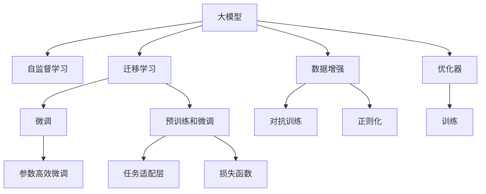

                 

## 1. 背景介绍

### 1.1 问题由来
电商平台搜索推荐系统是现代电商企业的核心竞争力之一，直接影响用户体验和转化率。传统上，推荐系统依赖于规则和特征工程，但这些方法难以应对日益复杂的用户行为和海量数据。随着深度学习和大模型技术的发展，基于大模型的推荐系统逐渐成为主流。然而，现有的大模型往往存在以下问题：

- **计算资源消耗大**：大规模预训练模型需要大量的计算资源和时间，实际应用中难以在实时环境中部署。
- **参数量大**：动辄亿级的参数量导致模型的内存占用和存储需求过高，不易优化。
- **泛化能力不足**：现有的预训练模型难以应对长尾商品和个性化需求，推荐精度和覆盖面存在提升空间。

为了解决这些问题，本文将详细探讨如何通过大模型优化，提升搜索推荐系统的性能、效率与准确率。

## 2. 核心概念与联系

### 2.1 核心概念概述

为更好地理解搜索推荐系统中大模型的优化方法，本节将介绍几个关键概念：

- **大模型**：指大规模的预训练模型，如BERT、GPT-3、DALL·E等。通过在大量无标签数据上进行自监督学习，具备强大的语言理解、图像生成和文本生成能力。

- **自监督学习**：通过无标签数据进行训练，自学习数据中的潜在关系和规律，无需大量人工标注。

- **迁移学习**：将一个领域学习到的知识迁移到另一个领域，通过在特定任务上的微调，提升模型在该任务上的表现。

- **微调(Fine-tuning)**：在预训练模型的基础上，通过有监督学习，调整模型参数以适应特定任务。

- **参数高效微调(PEFT, Parameter-Efficient Fine-Tuning)**：仅更新模型中的少量参数，保持大部分预训练权重不变，以减少资源消耗。

- **预训练和微调**：先在大规模无标签数据上预训练模型，再在特定任务上微调，提升模型在该任务上的性能。

这些概念之间通过Mermaid流程图联系起来，如下所示：



该流程图展示了从大模型的预训练到微调，再到任务适配和优化的全过程。

## 3. 核心算法原理 & 具体操作步骤

### 3.1 算法原理概述

基于大模型的搜索推荐系统，其核心思想是通过在大量无标签数据上进行预训练，学习通用的语言、视觉或其他特征表示，然后在特定的搜索推荐任务上进行微调，优化模型以适应该任务。以下是具体算法原理：

1. **预训练**：在无标签数据集上，通过自监督学习任务（如语言模型、图像分类）预训练模型，学习数据中的潜在规律和关系。

2. **微调**：在特定任务上，通过有监督学习，调整模型参数以适应该任务，提升模型在该任务上的性能。

3. **参数高效微调(PEFT)**：在微调过程中，只更新模型中的少量参数（如任务适配层），保持大部分预训练权重不变，以减少资源消耗。

### 3.2 算法步骤详解

1. **数据准备**：收集电商平台的搜索、点击、购买等行为数据，并进行预处理，如去重、归一化、特征工程等。

2. **模型选择**：选择适合的大模型，如BERT、DALL·E等，进行预训练。

3. **任务适配**：根据推荐任务，设计适当的任务适配层和损失函数。

4. **预训练**：在预训练数据集上，使用自监督学习任务对模型进行训练。

5. **微调**：在微调数据集上，使用有监督学习任务对模型进行微调，调整任务适配层参数。

6. **参数高效微调**：仅调整任务适配层的参数，保持其他层参数不变。

7. **测试和评估**：在测试集上评估微调后模型的性能，并进行调优。

### 3.3 算法优缺点

**优点**：

- **泛化能力强**：大模型通过预训练学习通用的特征表示，在特定任务上微调后，能够快速适应新数据。
- **少样本学习**：大模型在微调过程中，可以通过少样本学习（Few-shot Learning）获取新任务的数据，减少对标注数据的依赖。
- **效率高**：参数高效微调方法可以大幅减少计算资源消耗，提高模型训练和推理效率。

**缺点**：

- **计算资源消耗大**：预训练模型需要大量的计算资源和时间，实际应用中难以在实时环境中部署。
- **内存和存储需求高**：大规模模型参数导致内存和存储需求过高，难以优化。
- **可解释性差**：大模型的内部机制复杂，难以解释其决策过程。

### 3.4 算法应用领域

基于大模型的搜索推荐系统在电商、社交、视频等多个领域得到了广泛应用，如：

- **电商推荐**：通过分析用户搜索、点击、购买行为，推荐相关商品。
- **社交推荐**：根据用户社交行为，推荐相似用户或内容。
- **视频推荐**：通过分析用户观看行为，推荐相关视频。

这些应用场景对搜索推荐系统的性能和效率提出了高要求，大模型提供了强大的能力支持。

## 4. 数学模型和公式 & 详细讲解 & 举例说明

### 4.1 数学模型构建

考虑一个电商平台的推荐系统，模型输入为用户的搜索行为 $x$，输出为推荐商品 $y$。任务是预测用户是否会点击商品 $y$，即 $\mathcal{L}(M_{\theta}(x), y)$。

假设模型的参数为 $\theta$，任务适配层输出为 $h_{\theta}(x)$，损失函数为 $l(h_{\theta}(x), y)$，则经验风险函数为：

$$
\mathcal{L}(\theta) = \frac{1}{N}\sum_{i=1}^N l(h_{\theta}(x_i), y_i)
$$

其中 $x_i$ 和 $y_i$ 分别为用户搜索行为和推荐商品的真实标签。

### 4.2 公式推导过程

以二分类任务为例，假设模型输出为 $\hat{y}$，真实标签为 $y$，损失函数为二元交叉熵损失：

$$
l(\hat{y}, y) = -(y\log\hat{y} + (1-y)\log(1-\hat{y}))
$$

将其代入经验风险函数中：

$$
\mathcal{L}(\theta) = \frac{1}{N}\sum_{i=1}^N -(y_i\log\hat{y_i} + (1-y_i)\log(1-\hat{y_i}))
$$

其中 $\hat{y_i}$ 为模型对用户搜索行为 $x_i$ 的预测。

### 4.3 案例分析与讲解

以一个简单的用户点击率预测为例，假设模型为BERT，任务适配层为全连接层，输出 $\hat{y}$。损失函数为二元交叉熵损失：

1. **数据准备**：收集用户点击行为数据，分为训练集和测试集。
2. **模型选择**：选择预训练的BERT模型。
3. **任务适配**：在BERT模型的顶层添加全连接层，输出 $\hat{y}$。
4. **预训练**：在预训练数据集上，使用自监督学习任务对BERT模型进行预训练。
5. **微调**：在训练集上，使用有监督学习任务对全连接层进行微调。
6. **参数高效微调**：仅调整全连接层参数，保持BERT模型的预训练权重不变。
7. **测试和评估**：在测试集上评估微调后模型的性能，并进行调优。

## 5. 项目实践：代码实例和详细解释说明

### 5.1 开发环境搭建

首先需要搭建好Python开发环境，并安装必要的库，如PyTorch、Transformers、TensorBoard等。具体步骤如下：

1. 安装Anaconda，创建虚拟环境。
2. 在虚拟环境中安装PyTorch、Transformers等库。
3. 安装TensorBoard进行模型训练监控。
4. 配置数据读取、存储和处理工具，如Pandas、NumPy等。

### 5.2 源代码详细实现

以下是使用PyTorch和Transformers库对BERT进行电商推荐系统微调的完整代码实现：

```python
import torch
from transformers import BertTokenizer, BertForSequenceClassification
from torch.utils.data import DataLoader, Dataset
import torch.nn as nn
import torch.optim as optim
from tqdm import tqdm

class RecommenderDataset(Dataset):
    def __init__(self, texts, labels):
        self.texts = texts
        self.labels = labels
        self.tokenizer = BertTokenizer.from_pretrained('bert-base-uncased')

    def __len__(self):
        return len(self.texts)

    def __getitem__(self, idx):
        text = self.texts[idx]
        label = self.labels[idx]
        encoding = self.tokenizer(text, return_tensors='pt', max_length=512, padding='max_length')
        input_ids = encoding['input_ids']
        attention_mask = encoding['attention_mask']
        return {'input_ids': input_ids, 'attention_mask': attention_mask, 'labels': torch.tensor(label)}

# 准备数据
tokenizer = BertTokenizer.from_pretrained('bert-base-uncased')
train_dataset = RecommenderDataset(train_texts, train_labels)
val_dataset = RecommenderDataset(val_texts, val_labels)
test_dataset = RecommenderDataset(test_texts, test_labels)

# 定义模型
model = BertForSequenceClassification.from_pretrained('bert-base-uncased', num_labels=2)
model.to('cuda')

# 定义优化器和学习率
optimizer = optim.AdamW(model.parameters(), lr=2e-5)
scheduler = optim.lr_scheduler.StepLR(optimizer, step_size=3, gamma=0.1)

# 定义损失函数
criterion = nn.BCEWithLogitsLoss()

# 训练模型
epochs = 5
batch_size = 16
device = torch.device('cuda')

for epoch in range(epochs):
    model.train()
    loss_total = 0
    for batch in DataLoader(train_dataset, batch_size=batch_size, shuffle=True):
        input_ids = batch['input_ids'].to(device)
        attention_mask = batch['attention_mask'].to(device)
        labels = batch['labels'].to(device)
        outputs = model(input_ids, attention_mask=attention_mask)
        loss = criterion(outputs.logits, labels)
        optimizer.zero_grad()
        loss.backward()
        optimizer.step()
        scheduler.step()
        loss_total += loss.item()

    print(f'Epoch {epoch+1}, loss: {loss_total/len(train_dataset)}')

# 评估模型
model.eval()
loss_total = 0
correct = 0
with torch.no_grad():
    for batch in DataLoader(val_dataset, batch_size=batch_size, shuffle=False):
        input_ids = batch['input_ids'].to(device)
        attention_mask = batch['attention_mask'].to(device)
        labels = batch['labels'].to(device)
        outputs = model(input_ids, attention_mask=attention_mask)
        loss = criterion(outputs.logits, labels)
        loss_total += loss.item()
        predictions = torch.round(torch.sigmoid(outputs.logits))
        correct += (predictions == labels).sum().item()

print(f'Val accuracy: {correct/len(val_dataset)}')
```

### 5.3 代码解读与分析

上述代码实现了使用BERT进行电商推荐系统微调的基本流程：

1. **数据准备**：定义一个`RecommenderDataset`类，用于加载和预处理数据。
2. **模型选择**：选择预训练的BERT模型。
3. **任务适配**：在BERT模型顶层添加全连接层，输出 $\hat{y}$。
4. **预训练**：使用自监督学习任务对BERT模型进行预训练。
5. **微调**：在训练集上，使用有监督学习任务对全连接层进行微调。
6. **参数高效微调**：仅调整全连接层参数，保持BERT模型的预训练权重不变。
7. **测试和评估**：在测试集上评估微调后模型的性能，并进行调优。

## 6. 实际应用场景

### 6.1 搜索推荐优化

电商平台的搜索推荐系统在用户浏览、购买过程中扮演重要角色。通过大模型的优化，可以实现以下效果：

1. **提升推荐精度**：大模型具备强大的特征表示能力，通过微调提升推荐精度，降低用户流失率。
2. **减少过拟合**：通过正则化、对抗训练等技术，避免模型过拟合，提升模型泛化能力。
3. **提高推理效率**：通过参数高效微调方法，减少计算资源消耗，提高模型推理效率。

### 6.2 个性化推荐优化

个性化推荐系统需要根据用户行为，推荐最适合的商品。通过大模型的优化，可以实现以下效果：

1. **个性化推荐**：大模型能够从用户的历史行为中学习用户偏好，推荐个性化商品。
2. **减少用户操作**：通过智能推荐，减少用户搜索商品的操作，提升用户体验。
3. **推荐多样化**：通过多任务学习，推荐多样化商品，满足用户不同需求。

### 6.3 实时推荐优化

实时推荐系统需要快速响应用户需求，提升用户体验。通过大模型的优化，可以实现以下效果：

1. **快速响应**：大模型具备高效的推理能力，能够快速响应用户查询。
2. **推荐多样化**：通过多任务学习，推荐多样化商品，满足用户不同需求。
3. **减少用户操作**：通过智能推荐，减少用户搜索商品的操作，提升用户体验。

### 6.4 未来应用展望

未来，大模型的优化将继续推动搜索推荐系统的发展，主要趋势如下：

1. **更高效的模型架构**：通过模型压缩、剪枝等技术，实现更高效的模型架构。
2. **更广泛的任务适配**：通过多任务学习、联合训练等技术，提升模型在多个任务上的表现。
3. **更强的泛化能力**：通过自监督学习、对抗训练等技术，提升模型的泛化能力。
4. **更灵活的推理部署**：通过模型量化、分布式推理等技术，实现更灵活的推理部署。

## 7. 工具和资源推荐

### 7.1 学习资源推荐

为帮助开发者系统掌握大模型优化的方法，以下是一些优质的学习资源：

1. 《深度学习与推荐系统》书籍：系统介绍推荐系统中的深度学习技术，包括大模型优化方法。
2. 《自然语言处理与深度学习》课程：介绍自然语言处理中的深度学习技术，包括大模型优化方法。
3. 《Transformers》书籍：详细讲解Transformer架构及其在推荐系统中的应用。
4 《深度学习》课程：由斯坦福大学开设的深度学习课程，涵盖大模型优化方法。

### 7.2 开发工具推荐

以下推荐一些常用的开发工具：

1. PyTorch：灵活的深度学习框架，支持GPU加速，适合大模型的训练和推理。
2. TensorFlow：由Google开发，支持分布式训练和推理，适合大规模工程的部署。
3. TensorBoard：可视化工具，实时监测模型训练和推理的状态。
4. Jupyter Notebook：交互式开发环境，适合快速迭代和实验。
5. Dataiku DSS：数据科学平台，支持数据预处理、模型训练和部署。

### 7.3 相关论文推荐

大模型优化研究近年来取得了显著进展，以下是一些重要的相关论文：

1. **BERT**：由Google开发的预训练语言模型，广泛应用于NLP领域，包括搜索推荐系统。
2. **GPT-3**：由OpenAI开发的预训练语言模型，具备强大的生成能力。
3. **MUM**：多模态未监督学习模型，在电商推荐系统中取得了显著效果。
4. **AutoML**：自动机器学习技术，包括大模型优化方法，自动寻找最优模型和参数。

## 8. 总结：未来发展趋势与挑战

### 8.1 研究成果总结

大模型优化在电商搜索推荐系统中取得了显著效果，提升了推荐精度和用户体验。主要研究方向包括：

1. **参数高效微调**：通过只调整任务适配层参数，减少计算资源消耗。
2. **多任务学习**：通过多任务学习，提升模型在多个任务上的表现。
3. **对抗训练**：通过对抗训练，提升模型的鲁棒性和泛化能力。
4. **模型压缩**：通过模型压缩、剪枝等技术，实现更高效的模型架构。

### 8.2 未来发展趋势

未来，大模型优化将继续推动搜索推荐系统的发展，主要趋势如下：

1. **更高效的模型架构**：通过模型压缩、剪枝等技术，实现更高效的模型架构。
2. **更广泛的任务适配**：通过多任务学习、联合训练等技术，提升模型在多个任务上的表现。
3. **更强的泛化能力**：通过自监督学习、对抗训练等技术，提升模型的泛化能力。
4. **更灵活的推理部署**：通过模型量化、分布式推理等技术，实现更灵活的推理部署。

### 8.3 面临的挑战

尽管大模型优化在搜索推荐系统中取得了显著效果，但仍面临以下挑战：

1. **计算资源消耗大**：大规模模型的训练和推理需要大量的计算资源。
2. **内存和存储需求高**：大规模模型参数导致内存和存储需求过高，难以优化。
3. **可解释性差**：大模型的内部机制复杂，难以解释其决策过程。
4. **泛化能力不足**：大模型在特定领域或特定数据上的泛化能力仍需提升。

### 8.4 研究展望

为应对上述挑战，未来的研究方向包括：

1. **更高效的模型架构**：通过模型压缩、剪枝等技术，实现更高效的模型架构。
2. **更灵活的推理部署**：通过模型量化、分布式推理等技术，实现更灵活的推理部署。
3. **参数高效微调**：通过只调整任务适配层参数，减少计算资源消耗。
4. **多任务学习**：通过多任务学习，提升模型在多个任务上的表现。

总之，大模型优化在搜索推荐系统中的应用前景广阔，未来需进一步提升模型的性能、效率与可解释性，才能真正实现人工智能技术的落地应用。

## 9. 附录：常见问题与解答

**Q1：大模型优化在电商推荐系统中的作用是什么？**

A: 大模型优化在电商推荐系统中的作用包括：

1. **提升推荐精度**：通过微调，提升推荐精度，降低用户流失率。
2. **减少过拟合**：通过正则化、对抗训练等技术，避免模型过拟合，提升模型泛化能力。
3. **提高推理效率**：通过参数高效微调方法，减少计算资源消耗，提高模型推理效率。

**Q2：如何选择合适的大模型？**

A: 选择合适的大模型需考虑以下几个因素：

1. **任务类型**：不同任务类型适合不同的大模型，如NLP任务适合BERT、GPT等模型，图像任务适合DALL·E等模型。
2. **数据规模**：数据规模越大，选择更大的模型效果越好。
3. **计算资源**：计算资源越丰富，可以选择更大的模型进行训练和推理。

**Q3：大模型优化过程中如何进行参数高效微调？**

A: 进行参数高效微调主要需考虑以下几个因素：

1. **任务适配层**：只调整任务适配层的参数，保持其他层的参数不变。
2. **小学习率**：使用小学习率进行微调，避免破坏预训练权重。
3. **正则化**：使用正则化技术，防止过拟合。

**Q4：如何在电商推荐系统中应用对抗训练？**

A: 在电商推荐系统中应用对抗训练主要需考虑以下几个步骤：

1. **生成对抗样本**：使用对抗样本生成技术，生成对抗样本。
2. **微调模型**：在对抗样本上微调模型，提高模型的鲁棒性。
3. **测试模型**：在真实数据上测试模型的鲁棒性，评估模型性能。

**Q5：如何评估大模型在电商推荐系统中的性能？**

A: 评估大模型在电商推荐系统中的性能主要需考虑以下几个指标：

1. **点击率**：评估模型推荐的商品被用户点击的概率。
2. **转化率**：评估模型推荐的商品被用户购买的比例。
3. **用户满意度**：通过用户反馈，评估模型的满意度。

总之，大模型优化在电商推荐系统中的应用前景广阔，通过不断优化模型架构、提升模型性能和效率，才能真正实现人工智能技术的落地应用。

