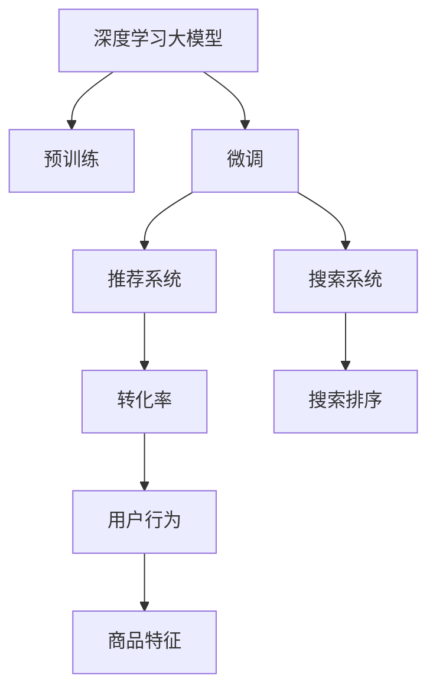

                 

## 1. 背景介绍

### 1.1 问题由来

在电商平台上，搜索推荐系统的核心任务是帮助用户快速找到所需商品，并促进转化。传统推荐系统依赖人工规则和浅层模型，难以应对海量数据和复杂用户行为。近年来，深度学习大模型在电商平台搜索推荐领域大放异彩，通过预训练和微调，获得了显著的性能提升。然而，尽管大模型在学术界和工业界取得了显著成绩，实际应用中仍面临诸多挑战：

- **系统性能不足**：部分大模型在实际应用中表现不佳，尤其是个性化推荐和排序精度方面存在瓶颈。
- **资源效率低**：大模型在推理时计算量大，存储需求高，影响系统的响应速度和成本控制。
- **用户转化率不高**：部分推荐结果与用户真实需求不匹配，导致用户流失和订单流失。

为了解决这些问题，本文将聚焦于AI 大模型在电商平台搜索推荐系统中的应用优化。通过介绍核心概念、算法原理、实践案例等，探讨如何在大模型基础上，进一步提高搜索推荐系统的性能、效率与转化率。

## 2. 核心概念与联系

### 2.1 核心概念概述

为了更好地理解大模型在电商搜索推荐系统中的应用优化，首先需要了解几个核心概念：

- **深度学习大模型**：如BERT、GPT-3等，通过大规模数据预训练获得通用语言表示，具备强大的语义理解和生成能力。
- **推荐系统**：基于用户行为、商品特征等信息，为用户推荐相关商品的系统。
- **搜索系统**：提供商品查询和排序功能的系统，旨在让用户快速找到所需商品。
- **转化率**：用户从浏览到购买的比率，是衡量推荐系统效果的重要指标。

这些概念构成了搜索推荐系统的基本框架。大模型的引入，极大地丰富了推荐系统的功能和表现能力，但同时也带来了计算复杂度、存储需求等新的问题。本文将通过系统介绍大模型的原理和架构，深入探讨其在电商搜索推荐系统中的应用优化。

### 2.2 核心概念原理和架构的 Mermaid 流程图



这张流程图展示了大模型在搜索推荐系统中的应用路径：

1. **预训练(B)**：大模型通过大规模无标签数据预训练，学习语言表示。
2. **微调(C)**：针对电商搜索推荐任务，在预训练模型的基础上进行微调，提升模型性能。
3. **推荐系统(D)**：使用微调后的模型，根据用户行为和商品特征，进行推荐。
4. **搜索系统(E)**：通过搜索模型，对推荐结果进行排序和展示。
5. **转化率(F)**：评估推荐结果对用户的转化效果。
6. **用户行为(H)**：收集用户点击、购买等行为数据。
7. **商品特征(I)**：提取商品的属性、类别、价格等信息。

通过这一流程，大模型能够显著提升电商搜索推荐系统的性能和用户体验。

## 3. 核心算法原理 & 具体操作步骤

### 3.1 算法原理概述

大模型在电商搜索推荐系统中的应用，主要基于以下核心算法：

- **深度学习**：利用大模型的强大语义理解和生成能力，提升推荐系统的预测精度。
- **预训练与微调**：通过在大规模无标签数据上进行预训练，然后针对具体电商任务进行微调，进一步优化模型性能。
- **深度学习推理**：在大模型基础上，进行高效的推理计算，加速搜索推荐过程。
- **在线学习与反馈**：结合用户行为数据，对模型进行在线学习，动态调整推荐策略。

### 3.2 算法步骤详解

#### 3.2.1 预训练与微调

1. **预训练**：
   - **数据准备**：收集电商商品描述、用户行为、商品属性等信息，构建大规模无标签数据集。
   - **模型训练**：使用预训练模型（如BERT、GPT-3等）在大规模数据上进行训练，学习语言表示。

2. **微调**：
   - **任务适配**：根据电商搜索推荐任务，设计相应的任务适配层和损失函数。
   - **模型训练**：使用标注数据集对模型进行微调，优化预测输出。

3. **推理计算**：
   - **模型部署**：将微调后的模型部署到生产环境中，进行实时推荐和搜索排序。
   - **推理优化**：使用优化技术（如量化、剪枝等），减少计算和存储需求，提高推理速度。

4. **在线学习**：
   - **数据收集**：收集用户点击、购买等行为数据，构建在线学习数据集。
   - **模型更新**：根据在线数据，对模型进行动态更新，调整推荐策略。

### 3.3 算法优缺点

#### 3.3.1 优点

1. **精度高**：大模型通过预训练和微调，具备强大的语义理解和生成能力，能够提供高精度的推荐和排序结果。
2. **泛化能力强**：大模型可以适应不同类型和规模的数据集，具备良好的泛化性能。
3. **自动学习**：在线学习机制能够自动适应用户行为变化，提升推荐系统性能。

#### 3.3.2 缺点

1. **计算资源需求高**：大模型推理时计算量大，存储需求高，影响系统响应速度和成本。
2. **可解释性不足**：大模型复杂度高，难以解释其决策过程，影响用户信任和系统调试。
3. **数据依赖性强**：预训练和微调效果受数据质量和数量的影响较大，数据偏差可能导致推荐结果偏差。

### 3.4 算法应用领域

大模型在电商搜索推荐系统中的应用主要涵盖以下几个领域：

1. **商品推荐**：根据用户行为和商品特征，推荐相关商品。
2. **搜索排序**：对搜索结果进行排序，提高用户满意度。
3. **个性化定制**：根据用户偏好，定制个性化推荐。
4. **情感分析**：分析用户对商品的情感倾向，优化推荐策略。
5. **广告推荐**：根据用户行为，推荐广告和促销活动。

## 4. 数学模型和公式 & 详细讲解 & 举例说明

### 4.1 数学模型构建

假设电商搜索推荐系统中的预训练大模型为 $M_{\theta}$，其中 $\theta$ 为模型参数。用户行为表示为 $X \in \mathbb{R}^n$，商品特征表示为 $Y \in \mathbb{R}^m$，推荐目标为 $T \in \{0,1\}$，表示用户是否点击商品。推荐模型的数学模型为：

$$
P(T|X,Y) = \sigma(\theta^T f(X,Y))
$$

其中 $\sigma$ 为 sigmoid 函数，$f(X,Y)$ 为模型对输入的预测函数。模型的损失函数为交叉熵损失：

$$
\mathcal{L}(\theta) = -\frac{1}{N} \sum_{i=1}^N [T_i \log P(T_i|X_i,Y_i) + (1-T_i) \log (1-P(T_i|X_i,Y_i))]
$$

### 4.2 公式推导过程

- **预训练**：使用大规模无标签数据，进行自监督学习，优化模型参数 $\theta$。
- **微调**：使用标注数据集，进行有监督学习，进一步优化模型参数 $\theta$。
- **推理计算**：将用户行为 $X$ 和商品特征 $Y$ 输入模型 $M_{\theta}$，计算预测结果 $P(T|X,Y)$。

### 4.3 案例分析与讲解

以用户点击行为预测为例，假设用户点击行为可以用向量 $X=[x_1,x_2,\dots,x_n]$ 表示，商品特征可以用向量 $Y=[y_1,y_2,\dots,y_m]$ 表示。模型的预测结果为：

$$
P(T|X,Y) = \sigma(\theta^T f(X,Y))
$$

其中 $f(X,Y)$ 为预训练和微调后的模型输出。例如，使用BERT模型进行预训练和微调后，将用户行为和商品特征输入BERT模型，得到向量表示 $H \in \mathbb{R}^d$，再经过线性变换得到预测结果：

$$
P(T|X,Y) = \sigma(W_H H + b)
$$

其中 $W_H$ 和 $b$ 为可训练的线性参数。通过训练得到 $W_H$ 和 $b$ 的值，即可进行用户点击行为预测。

## 5. 项目实践：代码实例和详细解释说明

### 5.1 开发环境搭建

1. **环境准备**：
   - 安装 Python 3.8 及 TensorFlow、PyTorch 等深度学习框架。
   - 安装 BERT、GPT-3 等预训练大模型库。

2. **数据准备**：
   - 收集电商商品描述、用户行为、商品属性等信息，构建训练数据集。
   - 进行数据预处理和标准化，准备好训练和测试数据。

### 5.2 源代码详细实现

#### 5.2.1 预训练模型

使用 BERT 模型进行预训练和微调，代码如下：

```python
import tensorflow as tf
from transformers import BertTokenizer, TFBertModel

tokenizer = BertTokenizer.from_pretrained('bert-base-uncased')
model = TFBertModel.from_pretrained('bert-base-uncased')

# 数据预处理
def encode(text):
    return tokenizer.encode(text, add_special_tokens=True)

# 构建输入输出格式
input_ids = tf.constant([encode('product1'), encode('product2')])
attention_mask = tf.constant([[1., 1.], [1., 1.]])

# 前向传播
with tf.GradientTape() as tape:
    outputs = model(input_ids, attention_mask=attention_mask)
    logits = outputs[0]

# 计算损失
loss = tf.keras.losses.binary_crossentropy(tf.zeros_like(logits), logits)
```

#### 5.2.2 微调模型

在预训练模型的基础上，进行微调，代码如下：

```python
# 构建微调模型
class BERTForClickPrediction(tf.keras.Model):
    def __init__(self, config):
        super(BERTForClickPrediction, self).__init__()
        self.bert = TFBertModel(config)
        self.dropout = tf.keras.layers.Dropout(0.1)
        self.out = tf.keras.layers.Dense(1)

    def call(self, inputs):
        _, pooled_output = self.bert(inputs['input_ids'], attention_mask=inputs['attention_mask'])
        pooled_output = self.dropout(pooled_output)
        logits = self.out(pooled_output)
        return logits

# 定义损失函数和优化器
model = BERTForClickPrediction(config)
loss_fn = tf.keras.losses.BinaryCrossentropy()
optimizer = tf.keras.optimizers.Adam()

# 微调训练
def train_step(inputs):
    with tf.GradientTape() as tape:
        logits = model(inputs)
        loss = loss_fn(y_true, logits)
    grads = tape.gradient(loss, model.trainable_variables)
    optimizer.apply_gradients(zip(grads, model.trainable_variables))
    return loss

# 微调训练循环
for epoch in range(num_epochs):
    for batch in train_dataset:
        inputs = {
            'input_ids': batch['input_ids'],
            'attention_mask': batch['attention_mask']
        }
        loss = train_step(inputs)
        print("Epoch {}, Loss: {:.4f}".format(epoch, loss))
```

#### 5.2.3 推理计算

将用户行为和商品特征输入微调模型，进行预测和排序，代码如下：

```python
# 推理计算
def predict(inputs):
    with tf.GradientTape() as tape:
        logits = model(inputs)
        prob = tf.sigmoid(logits)
    return prob.numpy()

# 测试集评估
test_dataset = ...
test_results = []
for batch in test_dataset:
    inputs = {
        'input_ids': batch['input_ids'],
        'attention_mask': batch['attention_mask']
    }
    prob = predict(inputs)
    test_results.append(prob)

# 计算指标
precision_at_k = precision_at_k_value(test_results, k=k_value)
```

### 5.3 代码解读与分析

#### 5.3.1 数据预处理

- **编码**：使用 BERT 分词器对用户行为和商品特征进行编码，转换为模型可接受的格式。
- **标准化**：将编码后的向量进行标准化处理，统一输入格式。

#### 5.3.2 模型构建

- **预训练模型**：加载预训练的 BERT 模型，作为特征提取器。
- **微调模型**：在预训练模型的基础上，构建微调模型，添加线性层和 sigmoid 激活函数，用于输出预测结果。

#### 5.3.3 训练与推理

- **训练**：使用二分类交叉熵损失函数，优化微调模型。
- **推理**：将用户行为和商品特征输入微调模型，得到预测概率，进行排序和推荐。

## 6. 实际应用场景

### 6.1 智能客服

在智能客服系统中，大模型可以用于用户意图识别和问题回答。通过对客服对话数据进行标注，训练大模型识别用户意图，并根据意图生成相应回答。大模型在处理自然语言理解和生成方面具有优势，能够快速响应用户咨询，提升客户满意度。

### 6.2 个性化推荐

电商平台上，用户行为多样，推荐系统需要根据用户兴趣进行个性化推荐。大模型通过预训练和微调，能够自动学习用户兴趣和行为模式，提供精准的推荐结果。通过在线学习机制，模型能够动态适应用户行为变化，持续提升推荐效果。

### 6.3 广告投放

电商平台通过广告投放提升收入。大模型可以根据用户行为和商品属性，预测用户对广告的响应概率，优化广告投放策略，提高广告点击率和转化率。通过微调和在线学习，模型能够实时调整广告投放策略，提升广告效果。

### 6.4 未来应用展望

未来，大模型在电商搜索推荐系统中的应用将进一步深化，主要体现在以下几个方面：

1. **多模态融合**：将文本、图像、语音等多模态信息融合，提升推荐系统的表现能力。
2. **知识图谱嵌入**：将知识图谱信息嵌入到推荐模型中，提升推荐系统的知识推理能力。
3. **对抗训练**：通过对抗样本训练，提高推荐系统的鲁棒性和抗干扰能力。
4. **联邦学习**：在多平台多用户之间进行模型共享和联合训练，提升推荐系统的性能。

## 7. 工具和资源推荐

### 7.1 学习资源推荐

1. **《深度学习》课程**：斯坦福大学的《深度学习》课程，介绍了深度学习的基础和前沿技术。
2. **《深度学习与NLP》书籍**：介绍了深度学习在自然语言处理领域的应用。
3. **《Transformers》书籍**：由 Hugging Face 的开发者撰写，详细介绍了 Transformer 模型和大模型的应用。
4. **Kaggle 竞赛**：通过参加电商推荐系统相关的 Kaggle 竞赛，提升实践能力和算法理解。

### 7.2 开发工具推荐

1. **TensorFlow**：Google 开源的深度学习框架，支持分布式训练和推理。
2. **PyTorch**：Facebook 开源的深度学习框架，支持动态图和静态图。
3. **Transformers**：由 Hugging Face 开发的 NLP 工具库，支持多种预训练模型和微调。
4. **TensorBoard**：TensorFlow 配套的可视化工具，实时监测训练过程和模型性能。
5. **Jupyter Notebook**：轻量级的交互式编程环境，便于实验和协作开发。

### 7.3 相关论文推荐

1. **Attention is All You Need**：Transformer 模型的原始论文，介绍了自注意力机制在序列建模中的应用。
2. **BERT: Pre-training of Deep Bidirectional Transformers for Language Understanding**：BERT 模型的原始论文，介绍了掩码语言模型的预训练方法。
3. **Knowledge Graph Embeddings**：介绍知识图谱嵌入技术，将知识图谱信息嵌入到推荐系统中。
4. **FedAvg: A Decentralized Online & Distributed Gradient Optimization Algorithm**：介绍联邦学习算法，支持多平台多用户之间的联合训练。

## 8. 总结：未来发展趋势与挑战

### 8.1 研究成果总结

本文通过系统介绍大模型在电商平台搜索推荐系统中的应用优化，探讨了如何在大模型基础上，进一步提高系统性能、效率与转化率。通过预训练和微调，大模型在电商推荐系统中的表现显著提升。然而，大模型在实际应用中仍面临计算资源需求高、可解释性不足等问题，需要进一步优化。

### 8.2 未来发展趋势

1. **多模态融合**：将文本、图像、语音等多模态信息融合，提升推荐系统的表现能力。
2. **知识图谱嵌入**：将知识图谱信息嵌入到推荐系统中，提升推荐系统的知识推理能力。
3. **对抗训练**：通过对抗样本训练，提高推荐系统的鲁棒性和抗干扰能力。
4. **联邦学习**：在多平台多用户之间进行模型共享和联合训练，提升推荐系统的性能。

### 8.3 面临的挑战

1. **计算资源需求高**：大模型推理时计算量大，存储需求高，影响系统响应速度和成本。
2. **可解释性不足**：大模型复杂度高，难以解释其决策过程，影响用户信任和系统调试。
3. **数据依赖性强**：预训练和微调效果受数据质量和数量的影响较大，数据偏差可能导致推荐结果偏差。

### 8.4 研究展望

未来，大模型在电商搜索推荐系统中的应用将进一步深化，主要体现在以下几个方面：

1. **多模态融合**：将文本、图像、语音等多模态信息融合，提升推荐系统的表现能力。
2. **知识图谱嵌入**：将知识图谱信息嵌入到推荐系统中，提升推荐系统的知识推理能力。
3. **对抗训练**：通过对抗样本训练，提高推荐系统的鲁棒性和抗干扰能力。
4. **联邦学习**：在多平台多用户之间进行模型共享和联合训练，提升推荐系统的性能。

## 9. 附录：常见问题与解答

### Q1: 大模型在电商推荐系统中表现不佳，原因是什么？

A: 大模型在电商推荐系统中表现不佳，主要原因包括：

- **数据质量问题**：电商推荐系统依赖大量标注数据，数据质量直接影响模型性能。
- **模型结构问题**：大模型结构复杂，难以适应电商推荐系统的特殊需求。
- **模型训练问题**：模型训练时间较长，计算资源需求高，影响系统响应速度。

### Q2: 如何优化大模型在电商推荐系统中的计算效率？

A: 优化大模型在电商推荐系统中的计算效率，主要可以从以下几个方面入手：

- **模型压缩**：通过剪枝、量化等技术，减少大模型参数量，降低计算资源需求。
- **推理加速**：使用优化工具（如 TensorRT），加速模型推理计算。
- **硬件优化**：使用 GPU、TPU 等高性能设备，提升计算性能。

### Q3: 如何提升大模型在电商推荐系统中的可解释性？

A: 提升大模型在电商推荐系统中的可解释性，可以从以下几个方面入手：

- **模型可视化**：使用可视化工具（如 TensorBoard），分析模型决策过程，提高可解释性。
- **特征可视化**：分析模型对输入特征的关注点，提高用户信任度。
- **逻辑推理**：使用逻辑推理工具（如 XAI），分析模型决策逻辑，提高可解释性。

### Q4: 大模型在电商推荐系统中如何应对用户行为变化？

A: 大模型在电商推荐系统中应对用户行为变化，主要可以通过以下几个方面：

- **在线学习**：使用在线学习机制，实时更新模型参数，动态适应用户行为变化。
- **增量训练**：定期对模型进行增量训练，提高模型适应性。
- **模型监控**：实时监控模型性能，及时发现和修复问题。

### Q5: 大模型在电商推荐系统中如何保证数据隐私？

A: 大模型在电商推荐系统中保证数据隐私，主要可以从以下几个方面入手：

- **数据加密**：对用户数据进行加密处理，保护用户隐私。
- **差分隐私**：使用差分隐私技术，保护用户数据隐私。
- **联邦学习**：在多平台多用户之间进行联合训练，保护用户数据隐私。

